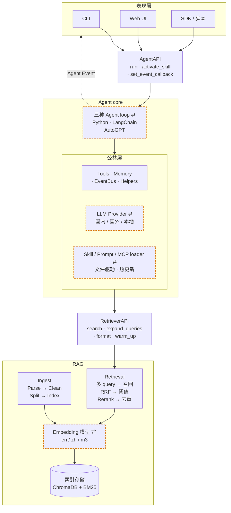

# AgentA

[](https://github.com/michaelwangzhenan/AgentA/actions/workflows/AgentA_CI.yml)


一个从零实现的 **本地化私有知识库 Agent**：上接 CLI / WebUI / SDK 三种交互方式，下接 ChromaDB + BM25 向量库与 9 个国内外主流 LLM；
集成进阶 **RAG**（混合检索 + RRF + Cross-Encoder 精排 + Query 改写）与 **ReAct / Plan-Execute** 推理循环，内置防 prompt 注入、MCP（Model Context Protocol）接入、Skills 框架与跨 session 用户记忆。

围绕"学习/研究助理"业务跑通完整链路：**入库 → 检索 → 出题 → 批改 → 间隔复习（SRS）**。

---

## 演示

<!-- TODO: 把下方占位图替换为实际截图 / GIF，建议存放路径 docs/assets/ -->

| CLI 流式输出 | WebUI 聊天界面 |
|:---:|:---:|
|  |  |

> **Live Demo 视频**：_待补充_<br>
> 计划录制 60 秒端到端 demo（入库 → 检索 → 出题 → 批改 → SRS），上传 B 站 / YouTube 后在此处贴出链接。

---

## 项目数据一览

| 维度 | 规模 |
|---|---|
| **代码量** | ~27.8K 行 Python（`src/` 47 文件 + `tools/` + `tests/`） |
| **设计文档** | ~16.5K 行 Markdown，8 轮迭代设计文档（`docs/iter_*.md`） |
| **单元测试** | 46 个测试文件，覆盖 RAG / Agent core / Memory / CLI / Tools |
| **评估体系** | 1 套 RAG 黄金集 + 9 套 Agent 能力评估（含对抗安全 / 性能基准） |
| **LLM Provider** | 9 个（Kimi · Qwen · DeepSeek · GLM · 豆包 · OpenAI · Claude · Grok · Ollama 本地） |
| **Embedding 模型** | 3 个（英文 / 中文 / 多语言）+ Cross-Encoder Reranker |
| **支持文档格式** | 7 种（PDF · DOCX · PPTX · XLSX · MD · HTML · TXT）+ PDF 扫描件 OCR 兜底 |
| **Agent 实现** | 3 套可切换（Python 原生 · LangChain · AutoGPT 风格） |
| **CI** | GitHub Actions 全自动：快速单测 + 性能回归门禁 |

---

## 整体架构

- 三层职责：表现层 / Agent Core / RAG
- 两套接口：`AgentAPI` / `RetrieverAPI`
- 四档可换/可扩展（图中橙色虚线框）：LLM Provider / Embedding 模型 / Agent 实现 / Skill·Prompt·MCP loader



---

## 1. 核心能力

### 1.1 进阶 RAG 检索

| 能力 | 说明 |
|---|---|
| **多模型 Embedding** | • `all-MiniLM-L6-v2`（英文）/ `bge-small-zh`（中文）/ `bge-m3`（多语言）三套<br>• 分库存储，自动按语种路由 |
| **混合检索** | • Dense 向量召回 + BM25 关键词召回<br>• 通过 **RRF（Reciprocal Rank Fusion，倒数排名融合）** 融合排名<br>• 对术语 / 缩写 / 版本号场景显著优于纯向量 |
| **二阶段精排** | • `bge-reranker-base` Cross-Encoder 精排<br>• 按 per-model 阈值过滤低质 chunk |
| **Query 改写** | • Multi-Query 同义改写<br>• HyDE（假设性答案生成）<br>• 跨语言翻译轴<br>• 三档可独立开关 |
| **多格式解析** | • PDF · DOCX · PPTX · XLSX · Markdown · HTML · TXT 七种格式<br>• PDF 扫描件自动调 `rapidocr-onnxruntime` OCR 兜底 |
| **召回可溯源** | • 回答正文带 `[n]` 标号<br>• 末尾 `— sources —` 块写明文件 / 章节 / 页号<br>• 同源 chunk 自动合并，编号受控防幻觉 |
| **评估方法** | • 内置黄金集 + `hit@1 / hit@3 / hit@k` / `MRR`（Mean Reciprocal Rank，平均倒数排名）<br>• 每次调优产物保存为 Markdown 报告（含 Miss 用例诊断），便于跨轮 diff |

### 1.2 Agent 能力

| 能力 | 说明 |
|---|---|
| **推理循环** | • 简单任务用 ReAct<br>• 复杂任务自动升级为 **Plan-Execute** 多步执行<br>• 测验批改 / RAG 召回用 **Harness 自检 + LLM-as-Judge** 双重复核 |
| **Context 管理** | 四层注入：<br>• SYSTEM_PROMPT + Skill catalog<br>• 项目偏好 `.agenta/rules.md`<br>• 跨 session 用户记忆<br>• 临时上下文（学习计划 / 工具结果 / 用户输入） |
| **安全防注入** | • `<untrusted_tool>` 包装隔离<br>• 启发式清洗<br>• plan 执行审批<br>• URL/SSRF 防护<br>• tool 名单门 |
| **Thinking 模式** | • Extended Thinking 总开关<br>• Budget / Adaptive 两种预算策略可配<br>• 适配 Claude / Qwen3 |
| **多模型切换** | • 内置 9 个国内外 LLM provider，`.env` 一行切换<br>• OpenAI 兼容 + Anthropic + Ollama 本地 |
| **用户记忆** | • 跨 session 自动提取与节流的用户偏好 / 事实库（`UserMemoryStore`） |
| **Skills 框架** | • 兼容 `agentskills.io` 规范<br>• LLM 按 description 自动激活，或 `/<name>` 手动调起 |
| **MCP 接入** | • 作为 [Model Context Protocol](https://modelcontextprotocol.io) Host<br>• 配置文件挂载第三方 server，零代码扩 tool |

**业务能力**（学习/研究助理端到端跑通）：
- **创建学习计划**：根据用户目标制定多步计划，可跨 session 注入 prompt
- **出题练习**：基于知识库自动出 MCQ（多选题）+ 简答题
- **测试批改**：作答后自动批改 + 留档复盘
- **主动复习**：基于 SM-2 算法的 SRS（Spaced Repetition System，间隔重复）卡片调度

### 1.3 多形态交互

| 形态 | 入口 | 适用场景 |
|---|---|---|
| **CLI** | `python main.py` | 开发调试 / 无 GUI 环境；支持斜杠命令 + Tab 补全 + 流式输出 |
| **Web UI** | `chainlit run chainlit_app.py` | 日常使用，浏览器内聊天界面，支持上传 / 思考过程展示 |
| **SDK**(TBD) | `from src.agent.agent_api import AgentAPI` | 二次集成 / 脚本调用；事件回调可订阅 Agent 内部步骤 |

三种形态共用同一个 `AgentAPI`，通过 `EventBus` 推送统一的 Agent Event（thinking / tool_call / tool_result / message / error），表现层只关心渲染。

### 1.4 三套 Agent 实现（同接口可切换）

`IMP_METHOD` 一行配置即可切换底层实现，方便横向对比与学习不同框架的设计取舍：

| 实现 | 入口 | 特点 |
|---|---|---|
| **PYTHON** | `src/agent/agent.py` | 从零手写的 ReAct + Plan-Execute 循环，无第三方依赖，便于理解 Agent 内部机制 |
| **LANGCHAIN** | `src/agent/langchain_agent.py` | 基于 LangChain `AgentExecutor`，使用社区生态的 tool / memory 抽象 |
| **AUTOGPT** | `src/agent/autogpt_agent.py` | 自主目标分解 + 长周期任务循环风格实现 |

三套实现共享同一份工具（`tools.py`）/ 记忆（`memory/`）/ 评估集，关注点是 Agent 控制流本身的差异。

---

## 2. 工程化质量

为保证个人项目也维持生产级工程素养，从一开始就建立了**测试 / 评估 / CI** 三道质量门：

### 2.1 测试体系

- **46 个 pytest 测试文件**覆盖 Agent core / RAG / Memory / CLI / Tools 全模块
- 用 `MagicMock` 隔离外部依赖（LLM / DB / 文件 IO），默认快速集 1-2 分钟跑完
- 通过 `pytest.ini` marker 分档：`fast`（默认） / `ext`（含 7 个 LLM provider） / `int`（需真实 API key 的集成测试）

### 2.2 评估方法（不是只跑通）

| 评估对象 | 黄金集位置 | 指标 |
|---|---|---|
| **RAG 召回** | `tools/rag_eval/golden.json` | `hit@1` / `hit@3` / `hit@k` / `MRR`，Miss 用例自动诊断 |
| **Memory 召回** | `tools/agent_eval/memory/` | 项目 rules / 用户偏好是否被遵循 |
| **Skills 激活** | `tools/agent_eval/skills/` | LLM 看到 catalog 能否主动调对 `load_skill(name=…)` |
| **Plan-Execute 识别** | `tools/agent_eval/plan/` | 复杂任务调 `make_plan` / 简单任务不调；plan 结构由 LLM-judge 打分 |
| **学习计划 / Quiz / SRS 业务** | `tools/agent_eval/plan_business/`, `quiz/`, `srs/` | 业务工具调用正确性 + 结构质量 |
| **Harness 自检准确率** | `tools/agent_eval/harness/` | critic 自身判得准不准（quiz_critic / rag_critic） |
| **MCP 接入** | `tools/agent_eval/mcp/` | 配置 → server 启动 → tool 合流 → SSRF 拦截全链路 |
| **对抗安全** | `tools/agent_eval/security/` | 直接越狱 / RAG 间接 / Web 间接 / tool 名单门，拦截率 ≥ 90% / 误拦率 ≤ 10% |
| **性能基准** | `tools/agent_eval/perf_eval.py` | session / memory 在 10/100/1000/5000 数据档位下的延迟基准（中位数 ms） |

所有评估结果统一保存到 `tools/{rag,agent}_eval/reports/` 下的 **Markdown 报告**（强制不用 JSON / CSV），方便跨轮对比与人工 review。

### 2.3 CI / CD

GitHub Actions（`.github/workflows/AgentA_CI.yml`）每次 push / PR 自动执行：

1. **Fast UT**：默认单测集，平均 ~1 分钟跑完
2. **性能回归门禁**：跑 `perf_eval` 100 / 1000 数据档位，若中位数延迟回归则 CI 红，并上传报告 artifact

---

## 3. 快速开始

### 3.1 环境准备

```bash
python -m venv .venv
# Windows
.venv\Scripts\activate
# Linux / macOS
source .venv/bin/activate

pip install -r requirements.txt
```

### 3.2 配置环境变量

```bash
cp .env.example .env
# 填入：LLM_PROVIDER 以及对应的 *_API_KEY
```

### 3.3 下载 Embedding / Reranker 模型

参考 [5.3 模型下载](#53-模型下载)。

### 3.4 启动 AgentA

首次使用先入库（详见 [5.1 RAG 入库](#51-rag-入库)）：

```bash
python -m tools.rag_cli ingest -m m3
```

WebUI 模式（Chainlit，推荐）：

```bash
chainlit run chainlit_app.py --port 8000
# 浏览器打开 http://localhost:8000
```

CLI 模式（开发调试 / 无 GUI 场景）：

```bash
python main.py
# 进入后输入 /help 查看全部命令
```

---

## 4. 主要配置

`.env` 中常用的关键项（完整说明见 `.env.example`）：

```ini
# —— LLM ——
LLM_PROVIDER=qwen                 # kimi / qwen / deepseek / glm / openai / claude ...
QWEN_API_KEY=sk-xxxxxxxx
LLM_PROXY=http://127.0.0.1:7890   # 仅 openai / grok / claude 需要

# —— RAG ——
EMBEDDING_MODEL=m3                # en / zh / m3
RAG_ACTIVE_EMBEDDINGS=m3          # 实际启用的 collection 列表
RAG_TOP_K=8                       # 送给 LLM 的最终片段数
RERANKER_ENABLED=true             # 二阶段 Cross-Encoder 精排
BM25_ENABLED=true                 # BM25 + RRF 混合检索
RAG_QUERY_REWRITE_ENABLED=true    # Multi-Query 同义改写

# —— Agent ——
IMP_METHOD=PYTHON                 # PYTHON / LANGCHAIN / AUTOGPT
THINKING_ENABLED=true             # Extended Thinking（Claude / Qwen3）
USER_MEMORY_ENABLED=true          # 跨 session 用户记忆
USER_RULES_ENABLED=true           # 项目级偏好 .agenta/rules.md 注入
PLAN_PERMISSION_MODE=false        # plan 执行前是否需要用户审批
HARNESS_QUIZ_ENABLED=true         # 测验批改 LLM-as-Judge 复审
HARNESS_RAG_ENABLED=true          # RAG 召回 chunks 相关性过滤
MCP_ENABLED=true                  # 启用 MCP 接入（.agenta/mcp/config.json）
```

---

## 5. 实用工具

### 5.1 RAG 入库

`tools/rag_cli.py` 把 `./datasets/` 下文档灌入向量库 + BM25 索引，并提供清库与状态查询：

```bash
python -m tools.rag_cli status                                 # 查看每个 collection 的当前状态
python -m tools.rag_cli ingest                                 # 幂等增量入库（默认 datasets/data_en + 默认模型）
python -m tools.rag_cli ingest -d ./datasets/data_zh -m zh     # 指定目录 / 模型别名（en / zh / m3）
python -m tools.rag_cli clear                                  # 清空全部 collection + BM25（需 yes 确认）
python -m tools.rag_cli clear -m m3                            # 只清空指定 alias
```

### 5.2 RAG 评估

基于 `tools/rag_eval/golden.json` 黄金集计算 `hit@1 / hit@3 / hit@k` / `MRR`，结果默认保存到 `tools/rag_eval/reports/`：

```bash
python -m tools.rag_eval.runner                                # 当前配置基线
python -m tools.rag_eval.runner --no-rewriter                  # 关闭 Query 改写做消融对比
python -m tools.rag_eval.runner --no-rerank                    # 关闭精排做消融对比
python -m tools.rag_eval.runner -o tools/rag_eval/reports/x.md # 保存 Markdown 报告 + 同名 .log trace
```

<a id="53-模型下载"></a>

### 5.3 模型下载

`tools/download_models.py` 按编号下载所需 Embedding / Reranker，自带多镜像 fallback：

```bash
python -m tools.download_models      # 默认下载全部 5 个（已缓存自动跳过）
python -m tools.download_models -l   # 仅查看清单与缓存状态
python -m tools.download_models 3    # 下载指定模型（编号详见 -l 输出）
```

### 5.4 单元测试

`tools/ut.sh` 封装 pytest 调用，分两类：**档位**（按 marker 过滤）+ **模块**（按文件，调试用）：

```bash
bash tools/ut.sh -h          # 查看帮助
bash tools/ut.sh -fast       # 默认 case，跳过 integration/langchain/autogpt/extended_providers
bash tools/ut.sh -ext        # 默认 + 其余 7 个 LLM provider
bash tools/ut.sh -int        # 仅集成测试（需 .env 中相应真实 API key）
bash tools/ut.sh -all        # 全部 case
```

> Windows 用户也可直接 `python -m pytest tests/`，效果等同 `-fast`（pytest.ini 已配 marker 过滤）。

### 5.5 UI 调试

`tools/ui_debug.ps1`（Windows / PowerShell）一键拉起 Chainlit + cloudflared 隧道，自动把临时公网 URL 复制到剪贴板，方便手机或外部设备调试：

```powershell
.\tools\ui_debug.ps1                 # 默认 8000 端口
.\tools\ui_debug.ps1 -Port 8080      # 自定义端口
```

### 5.6 Agent 能力评估

10 套独立评估脚本，全部报告统一保存到 `tools/agent_eval/reports/`，命名 `<feature>-<YYYYMMDD-HHMMSS>.md`：

| # | 评估对象 | 脚本 | 默认 case 示例 |
|---|---|---|---|
| 1 | Memory 召回（偏好遵循） | `tools.agent_eval.memory.recall_golden` | `M01-lang-zh` |
| 2 | Skills 激活识别 | `tools.agent_eval.skills.recall_skill` | `S01-positive-planner` |
| 3 | Plan-Execute 识别 + 结构 | `tools.agent_eval.plan.eval_plan` | `P01-positive-*` |
| 4 | 学习计划业务 | `tools.agent_eval.plan_business.eval_learning_plan` | `L01-create-ml-8w` |
| 5 | Quiz 出题 / 批改 | `tools.agent_eval.quiz.eval_quiz` | `Q01-create-rag` |
| 6 | SRS 调度触发 | `tools.agent_eval.srs.eval_srs` | `S01-due-today` |
| 7 | Harness 自检准确率 | `tools.agent_eval.harness.eval_harness` | `Q01-correct-grading-passes` |
| 8 | MCP 接入全链路 | `tools.agent_eval.mcp.eval_mcp` | `C6-ssrf-defense-blocks-internal` |
| 9 | 安全 / 防注入对抗 | `tools.agent_eval.security.adversarial` | `--kind direct` |
| 10 | 性能基准（延迟中位数） | `tools.agent_eval.perf_eval` | `--target memory --sizes 100,1000,5000` |

<details>
<summary><b>常用运行方式</b>（点开展开）</summary>

```bash
# 跑全部（默认调真实 LLM）
python -m tools.agent_eval.memory.recall_golden
python -m tools.agent_eval.skills.recall_skill
python -m tools.agent_eval.plan.eval_plan
python -m tools.agent_eval.plan_business.eval_learning_plan
python -m tools.agent_eval.quiz.eval_quiz
python -m tools.agent_eval.srs.eval_srs
python -m tools.agent_eval.harness.eval_harness
python -m tools.agent_eval.mcp.eval_mcp
python -m tools.agent_eval.security.adversarial
python -m tools.agent_eval.perf_eval --target all

# 通用开关
--case <ID>     # 单 case 调试
--no-report     # 不写报告（quick check）
--no-judge      # 跳过 LLM-judge 评分（仅结构对比，省 LLM 配额）
--no-llm        # 跳过 LLM 调用，仅跑可静态判定的 case
```

</details>

---

## 文档导读

| 文档 | 内容 |
|---|---|
| `docs/iter_0_init.md` | 项目初版规划：目标 / 架构 / 技术选型 |
| `docs/iter_2_agent.md` | Agent core 设计：四层 context / Memory / Plan-Execute / Skills / 防注入 |
| `docs/iter_3_CI.md` | GitHub Actions CI 接入：免费额度 / 性能门禁 / artifact |
| `docs/iter_4_UI.md` | UI 形态反思 |
| `docs/iter_5_LangChain.md` | LangChain 实现路径 |
| `docs/iter_6_AutoGPT.md` | AutoGPT 风格实现 |
| `docs/iter_7_CnP.md` | 模型上下文协议（MCP）接入设计 |
| `docs/iter_8_debugging.md` | 线上调试 / 远端联调 |
