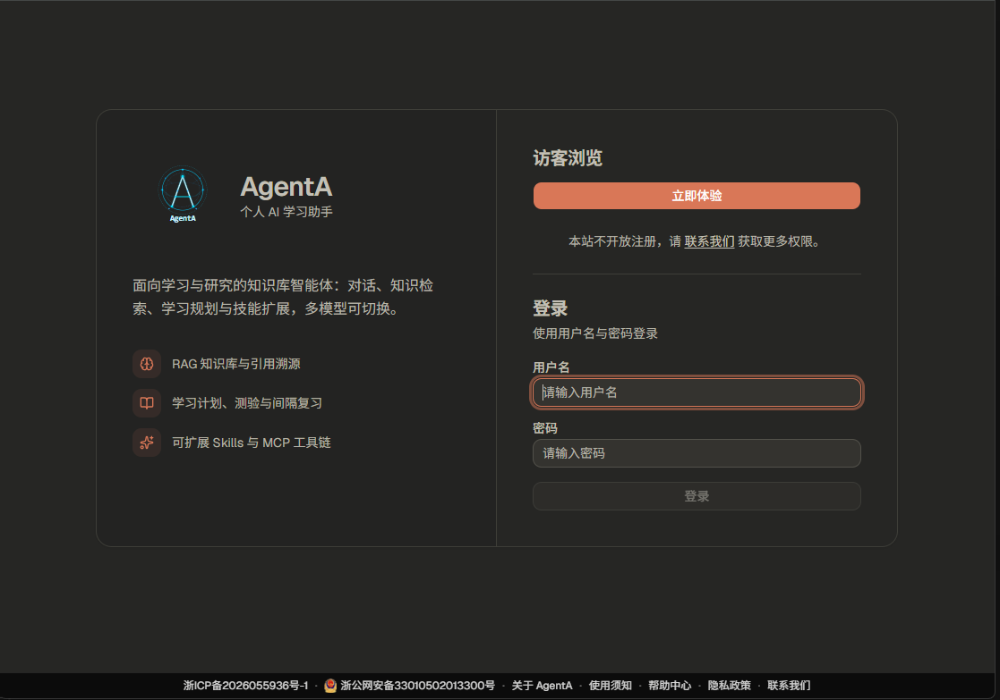
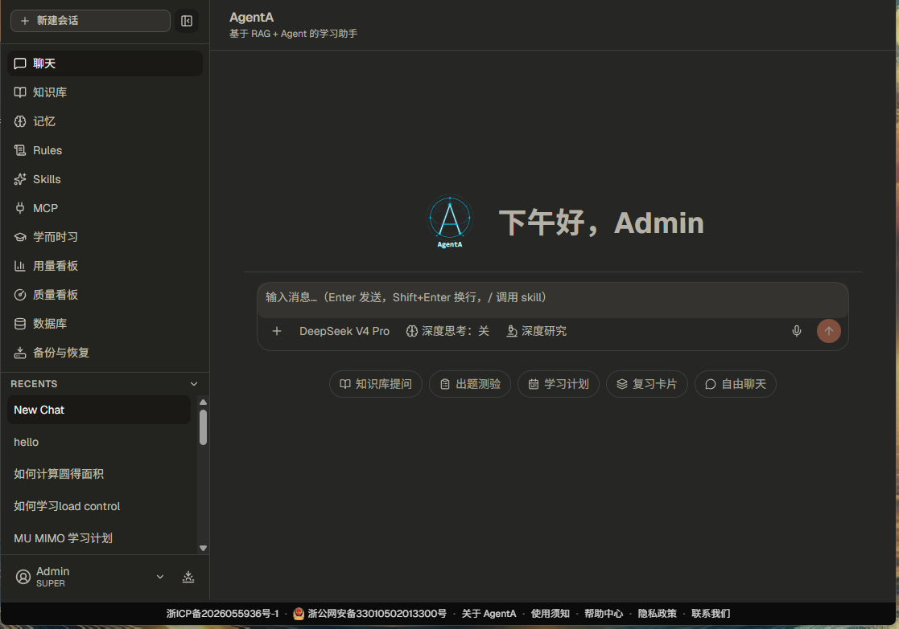
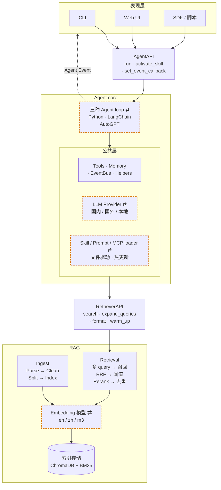

# AgentA

[](https://github.com/michaelwangzhenan/AgentA/actions/workflows/AgentA_CI.yml)
[](https://agenta.xin)


一个私有知识库 Agent，提供 CLI、Web UI、SDK 三种交互方式，底层用 ChromaDB + BM25 向量库，接入 10 个国内外主流 LLM。自主实现 ReAct / Plan-Execute 推理循环，集成进阶 RAG（混合检索、RRF、Cross-Encoder 精排、Query 改写），内置防 prompt 注入、MCP（Model Context Protocol）接入、Skills 框架和跨 session 用户记忆。

面向学习 / 研究助理场景，覆盖入库、检索、出题、批改、间隔复习（SRS）的完整流程。

已部署上线并完成 ICP 与公安备案，可直接在线体验。

---

## 在线体验

站点 [agenta.xin](https://agenta.xin)。

体验账号是只读权限，可以浏览知识库、翻阅预置的会话与学习计划、查看管理后台的用量与质量看板，不能发起对话或修改数据。想完整试用，请“联系我们”申请权限。

| 登录界面 |  聊天界面 |
|:---:|:---:|
|  |  |

---

## 核心特性

- 三套可切换的 Agent 实现：Python 原生实现 / LangChain / AutoGPT 风格，同接口配置即可切换，便于横向对比框架取舍
- 进阶 RAG：混合检索（Dense + BM25）、RRF 融合、Cross-Encoder 精排、Query 改写；多语言分库，扫描件 OCR 降级处理；回答附 `[n]` 溯源标注
- 评估体系：全模块 pytest 覆盖，10 套 Agent 能力评估（含对抗安全、性能基准），GitHub Actions CI 门禁
- 十个 LLM Provider，配置即切换：涵盖国内外主流与 Ollama 本地，兼容 OpenAI 与 Anthropic 原生两种协议
- 内置安全防注入：隔离包装、启发式清洗、plan 执行审批、SSRF 防护、工具白名单等多层防护
- 业务闭环：面向学习 / 研究助理，覆盖入库、检索、出题、批改至 SRS 间隔复习
- 配套 Web 管理后台：用量统计、备份恢复、质量看板、模型路由池、用户与权限管理
- 已上线公网并通过 ICP 与公安备案：线上跑在 2 核 2G 轻量服务器上，为此做了一轮内存治理，并按备案审核要求进行安全与账号管控

---

## 整体架构

- 三层职责：表现层 / Agent Core / RAG
- 两套接口：`AgentAPI` / `RetrieverAPI`
- 四档可换/可扩展（图中橙色虚线框）：LLM Provider / Embedding 模型 / Agent 实现 / Skill·Prompt·MCP loader



> 完整设计文档（接口约定 / 模块职责 / 取舍说明）：**[`docs/design.md`](docs/design.md)**

---

## 核心能力

### 进阶 RAG 检索

| 能力 | 说明 |
|---|---|
| **多模型 Embedding** | • `all-MiniLM-L6-v2`（英文）/ `bge-small-zh`（中文）/ `bge-m3`（多语言）三套<br>• 按模型别名（en / zh / m3）分库存储；检索按 `RAG_ACTIVE_EMBEDDINGS` 多库并行召回再融合 |
| **混合检索** | • Dense 向量召回 + BM25 关键词召回<br>• 通过 **RRF（Reciprocal Rank Fusion，倒数排名融合）** 融合排名<br>• 对术语 / 缩写 / 版本号场景比纯向量更准 |
| **二阶段精排** | • `bge-reranker-base` Cross-Encoder 精排<br>• Dense 召回按 per-model 阈值过滤，精排后可选全局阈值再筛 |
| **Query 改写** | • Multi-Query 同义改写<br>• HyDE（假设性答案生成）<br>• 跨语言翻译轴<br>• 三档可独立开关 |
| **多格式解析** | • PDF · DOCX · PPTX · XLSX · Markdown · HTML · TXT 七种格式<br>• PDF 扫描件自动调用 `rapidocr-onnxruntime` OCR 降级处理 |
| **召回可溯源** | • 回答正文带 `[n]` 标号<br>• 末尾 `— sources —` 块写明文件 / 章节 / 页号<br>• 同源 chunk 自动合并，编号受控防幻觉 |
| **评估方法** | • 内置黄金集 + `hit@1 / hit@3 / hit@k` / `MRR`（Mean Reciprocal Rank，平均倒数排名）<br>• 每次调优产物保存为 Markdown 报告（含 Miss 用例诊断），便于跨轮 diff |

### Agent 能力

| 能力 | 说明 |
|---|---|
| **推理循环** | • 简单任务用 ReAct<br>• 复杂任务转入 **Plan-Execute** 多步执行<br>• 测验批改用 Critic 自检 + LLM-as-Judge 双重复核；RAG 召回用 Critic 过滤低相关 chunk |
| **Context 管理** | 四层 system prompt 注入：<br>• SYSTEM_PROMPT + Skill catalog<br>• 个人偏好 Rules（每用户一份，存 `auth.db`）<br>• 跨 session 用户记忆<br>• 当前激活的学习计划（`<active_study_plan>`） |
| **安全防注入** | • `<untrusted_tool>` 包装隔离<br>• 启发式清洗<br>• plan 执行审批<br>• URL/SSRF 防护<br>• tool 名单门 |
| **Thinking 模式** | • Extended Thinking 总开关<br>• 可配 thinking 预算 tokens<br>• 适配 Claude 原生思考与 Qwen 系 reasoning |
| **多模型切换** | • 内置 10 个国内外 LLM provider，`.env` 一处配置即可切换<br>• OpenAI 兼容 + Anthropic 原生 + Ollama 本地 |
| **模型路由** | • `auto` 档按问题难度在候选池内向更便宜的模型降级<br>• 手选具体模型即精确锁定；判定 / 调用出错软回落基准模型，不阻断主链路 |
| **语义缓存** | • 相近 query 命中历史答案，跳过整次检索 + 生成<br>• 独立向量库匹配、按用户隔离、可失效；读写出错回落正常流程 |
| **用户记忆** | • 跨 session 自动提取与节流的用户偏好 / 事实库（`UserMemoryStore`） |
| **Skills 框架** | • 兼容 `agentskills.io` 规范<br>• LLM 按 description 自动激活，或 `/<name>` 手动调起 |
| **MCP 接入** | • 作为 [Model Context Protocol](https://modelcontextprotocol.io) Host<br>• 配置文件挂载第三方 server，零代码扩展工具 |
| **深度研究** | • 独立于普通 chat 的四阶段流水线：规划 → 并行子代理检索 → 反思补查 → 带 `[n]` 引用综述<br>• 子代理独立上下文，中间过程不污染会话历史 |

**业务能力**（学习/研究助理）：
- **创建学习计划**：根据用户目标制定多步计划并跨 session 持久化，激活后注入当前会话上下文
- **出题练习**：基于知识库自动出单选 / 多选 / 简答三类题
- **测试批改**：作答后自动批改 + 留档复盘
- **主动复习**：基于 SM-2 算法的 SRS（Spaced Repetition System，间隔重复）卡片调度

### 多形态交互

| 形态 | 入口 | 适用场景 |
|---|---|---|
| **CLI** | `python -m src.cli.main` | 开发调试 / 无 GUI 环境；支持斜杠命令 + Tab 补全 + 流式输出 |
| **Web UI** | 后端 `python -m src.api.run`（:8000）+ 前端 `npm run dev`（:5173）<br>Windows 一键：`tools/dev_server.ps1 start` | 日常使用；React 前端 + FastAPI 后端，多用户登录、上传、思考过程 SSE 流式展示，含管理后台 |
| **SDK / 脚本** | `from src.agent.agent_api import AgentAPI` | 二次集成 / 脚本调用；事件回调可订阅 Agent 内部步骤 |

三种形态共用同一个 `AgentAPI`，通过 `EventBus` 推送统一的 Agent Event（思考过程 / 正文 token / 工具调用 / plan 进度 / 最终答案 / 错误等），表现层只关心渲染。

### 三套 Agent 实现

通过 `IMP_METHOD` 配置即可切换底层实现，便于横向对比不同框架的设计取舍：

| 实现 | 入口 | 特点 |
|---|---|---|
| **PYTHON** | `src/agent/agent.py` | 自主实现的 ReAct + Plan-Execute 循环，无第三方依赖，便于理解 Agent 内部机制 |
| **LANGCHAIN** | `src/agent/langchain_agent.py` | 基于 LangChain `AgentExecutor`，使用社区生态的 tool / memory 抽象 |
| **AUTOGPT** | `src/agent/autogpt_agent.py` | 自主目标分解 + 长周期任务循环风格实现 |

三套实现共享同一份工具（`tools.py`）/ 记忆（`stores/`）/ 评估集，关注点是 Agent 控制流本身的差异。

---

## 工程化质量

作为个人项目，仍按工程标准建立了测试、评估、CI 三道质量门：

### 测试体系

- **121 个 pytest 测试文件**覆盖 Agent core / RAG / Memory / CLI / API / Tools 全模块
- 用 `MagicMock` 隔离外部依赖（LLM / DB / 文件 IO），默认快速集约 1-2 分钟完成
- 通过 `pytest.ini` marker 分档：默认仅运行快速集（自动排除 `integration` / `slow` / `langchain` / `autogpt`）；集成测试（真实 API / 网络 / ChromaDB）、慢用例、可选实现（LangChain / AutoGPT）测试按需单独运行

### 评估方法

| 评估对象 | 黄金集位置 | 指标 |
|---|---|---|
| **RAG 召回** | `rag_golden.db`（质量看板维护） | `hit@1` / `hit@3` / `hit@k` / `MRR`，Miss 用例自动诊断 |
| **Memory 召回** | `tools/agent_eval/memory/` | 项目 rules / 用户偏好是否被遵循 |
| **Skills 激活** | `tools/agent_eval/skills/` | LLM 能否依据 catalog 正确调用 `load_skill(name=…)` |
| **Plan-Execute 识别** | `tools/agent_eval/plan_execute/` | 复杂任务调用 `make_plan`、简单任务不调用；plan 结构由 LLM-judge 打分 |
| **学习计划 / Quiz / SRS 业务** | `tools/agent_eval/learning_plan/`, `quiz/`, `srs/` | 业务工具调用正确性与结构质量 |
| **Critic 自检准确率** | `tools/agent_eval/critic/` | critic 自身判定的准确率（quiz_critic / rag_critic） |
| **MCP 接入** | `tools/agent_eval/mcp/` | 配置、server 启动、tool 合流、SSRF 拦截全链路 |
| **对抗安全** | `tools/agent_eval/security/` | 直接越狱 / RAG 间接 / Web 间接 / tool 名单门，拦截率 ≥ 90% / 误拦率 ≤ 10% |
| **性能基准** | `tools/agent_eval/perf/eval_perf.py` | session / memory 在 10/100/1000/5000 数据档位下的延迟基准（中位数 ms） |

所有评估结果统一保存到 `tools/reports/<eval>/` 下的 **Markdown 报告**（强制不用 JSON / CSV），便于跨轮对比与人工复核。

### CI / CD

GitHub Actions（`.github/workflows/AgentA_CI.yml`）每次 push / PR 自动执行三个并行 job：

1. **Fast UT**：默认单测集（`pytest -q`），平均约 1 分钟完成
2. **性能回归门禁**：运行 `eval_perf` 100 / 1000 数据档位，中位数延迟回归则判定失败，并上传报告 artifact
3. **评估门禁（非 LLM）**：运行 `run_all --ci` 的确定性子集（安全拦截等不消耗 token 的用例），任一 FAIL 即判定失败，并上传报告 artifact

---

## 上线与合规

AgentA 已上线部署，域名为 agenta.xin，已通过 ICP 备案与公安联网备案。

### 线上的模型选择
Embedding 与 Rerank 在本地跑的是 HuggingFace 模型，2 GiB 内存装不下，线上换成了硅基流动的 API，用 `BAAI/bge-m3` 与 `BAAI/bge-reranker-v2-m3`。

### 账号与权限

角色分 readonly、user、admin 三级，另有一个主账号可管理用户。
设计原则是读的范围放宽、写的范围收紧：三种角色看到的导航一致，写权限逐级递增，只有admin 可以进行知识库的上传与入库。前端对无权限的操作置灰并给出提示，后端在路由层进行统一的权限检查。

---

## 快速开始

### 环境准备

```bash
python -m venv .venv
# Windows
.venv\Scripts\activate
# Linux / macOS
source .venv/bin/activate

pip install -r requirements.txt
```

### 配置环境变量

```bash
cp .env.example .env
# 填入：LLM_PROVIDER 以及对应的 *_API_KEY
```

完整配置项（RAG / Agent / 安全 / Thinking 等开关）逐条说明见 **`.env.example`**。

### 下载 Embedding / Reranker 模型

参考 [模型下载](#53-模型下载)。

### 准备 MCP server（可选）

如开启 MCP（`MCP_ENABLED=true`），会挂载 fetch 与 filesystem 两个默认 server，需提前准备好运行环境；否则启动时二者连接失败（agent 仍可正常运行）。

| server | 类型 | 能力 | 准备方式 |
|---|---|---|---|
| **fetch** | Python | 抓网页转 markdown | `pip install -r requirements.txt` 已含 `mcp-server-fetch`，无需额外操作 |
| **filesystem** | Node | 读 / 写 / 列工作区文件 | 需先安装 [Node.js](https://nodejs.org)（含 `npx`）；安装后**先手动运行一次**以预下载该包（`npx -y @modelcontextprotocol/server-filesystem`） |

### 启动 AgentA

首次使用先入库（详见 [RAG 入库](#rag-入库)）：

```bash
python -m tools.cli.rag_cli ingest -m m3
```

Web UI 模式（React 前端 + FastAPI 后端，推荐）：

```bash
# Windows 一键拉起前后端（后台运行）
tools/dev_server.ps1 start
# 浏览器打开 http://localhost:5173

# 或手动分别启动：
python -m src.api.run                 # 后端 :8000
cd frontend && npm install && npm run dev   # 前端 :5173（首次需 npm install）
```

CLI 模式（开发调试 / 无 GUI 场景）：

```bash
python -m src.cli.main
# 进入后输入 /help 查看全部命令
```

---

## 实用工具

<details>
<summary><b>RAG 入库 / RAG 评估 / 模型下载 / Agent 能力评估</b>（展开查看命令）</summary>

<a id="rag-入库"></a>

### RAG 入库

`tools/cli/rag_cli.py` 将 `./datasets/` 下文档写入向量库与 BM25 索引，并提供清库与状态查询：

```bash
python -m tools.cli.rag_cli status                                 # 查看每个 collection 的当前状态
python -m tools.cli.rag_cli ingest                                 # 幂等增量入库（默认 datasets/data_en + 默认模型）
python -m tools.cli.rag_cli ingest -d ./datasets/data_zh -m zh     # 指定目录 / 模型别名（en / zh / m3）
python -m tools.cli.rag_cli clear                                  # 清空全部 collection + BM25（需 yes 确认）
python -m tools.cli.rag_cli clear -m m3                            # 只清空指定 alias
```

### RAG 评估

黄金集从 `rag_golden.db` 读取（增删改查走「质量看板」的「Golden 管理」页），计算 `hit@1 / hit@3 / hit@k` / `MRR`：

```bash
python -m tools.rag_eval.runner                              # 当前配置基线（仅终端汇总）
python -m tools.rag_eval.runner --no-rewriter                # 关闭 Query 改写进行消融对比
python -m tools.rag_eval.runner --no-rerank                  # 关闭精排进行消融对比
python -m tools.rag_eval.runner -o tools/reports/rag/x.md    # 保存 Markdown 报告 + 同名 .log trace
```

<a id="53-模型下载"></a>

### 模型下载

`tools/cli/download_models.py` 按编号下载所需 Embedding / Reranker，自带多镜像 fallback：

```bash
python -m tools.cli.download_models      # 默认下载全部 5 个（已缓存自动跳过）
python -m tools.cli.download_models -l   # 仅查看清单与缓存状态
python -m tools.cli.download_models 3    # 下载指定模型（编号详见 -l 输出）
```

### Agent 能力评估

10 套独立评估脚本，报告统一保存到 `tools/reports/<eval>/`，命名 `<feature>-<YYYYMMDD-HHMMSS>.md`：

| # | 评估对象 | 脚本 | 默认 case 示例 |
|---|---|---|---|
| 1 | Memory 召回（偏好遵循） | `tools.agent_eval.memory.eval_memory` | `M01-lang-zh` |
| 2 | Skills 激活识别 | `tools.agent_eval.skills.eval_skills` | `S01-positive-planner` |
| 3 | Plan-Execute 识别 + 结构 | `tools.agent_eval.plan_execute.eval_plan_execute` | `P01-positive-*` |
| 4 | 学习计划业务 | `tools.agent_eval.learning_plan.eval_learning_plan` | `L01-create-ml-8w` |
| 5 | Quiz 出题 / 批改 | `tools.agent_eval.quiz.eval_quiz` | `Q01-create-rag` |
| 6 | SRS 调度触发 | `tools.agent_eval.srs.eval_srs` | `S01-due-today` |
| 7 | Critic 自检准确率 | `tools.agent_eval.critic.eval_critic` | `Q01-correct-grading-passes` |
| 8 | MCP 接入全链路 | `tools.agent_eval.mcp.eval_mcp` | `C6-ssrf-defense-blocks-internal` |
| 9 | 安全 / 防注入对抗 | `tools.agent_eval.security.eval_security` | `--kind direct` |
| 10 | 性能基准（延迟中位数） | `tools.agent_eval.perf.eval_perf` | `--target memory --sizes 100,1000,5000` |

```bash
# 逐项运行（默认调用真实 LLM）
python -m tools.agent_eval.memory.eval_memory
python -m tools.agent_eval.skills.eval_skills
python -m tools.agent_eval.plan_execute.eval_plan_execute
python -m tools.agent_eval.learning_plan.eval_learning_plan
python -m tools.agent_eval.quiz.eval_quiz
python -m tools.agent_eval.srs.eval_srs
python -m tools.agent_eval.critic.eval_critic
python -m tools.agent_eval.mcp.eval_mcp
python -m tools.agent_eval.security.eval_security
python -m tools.agent_eval.perf.eval_perf --target all
# 或一次运行全部：python -m tools.agent_eval.run_all（CI 子集加 --ci）

# 通用开关
--case <ID>     # 单 case 调试
--no-report     # 不写报告（快速检查）
--no-judge      # 跳过 LLM-judge 评分（仅结构对比，节省 LLM 配额）
--no-llm        # 跳过 LLM 调用，仅运行可静态判定的 case
```

</details>

---

## 文档导读

本项目保留了完整的设计与迭代文档，从需求到设计取舍再到逐项验证都有记录：

| 文档 | 内容 |
|---|---|
| **[`docs/design.md`](docs/design.md)** | **当前态设计（single source of truth）**：整体架构 / RAG（Ingest · Retrieval · Eval）/ Agent（API · 会话 · 记忆 · Prompt · Citation · Plan · Skills · MCP · 防注入） |
| [`docs/v_1_0/iteration/`](docs/v_1_0/iteration) | **20+ 篇迭代设计文档**（V1.0，iter_0 至 iter_19，另有 LangChain / AutoGPT 专篇）：完整记录需求、设计、取舍的思考过程 |
| [`docs/v_1_0/verification/`](docs/v_1_0/verification) | 迭代验证记录：评估体系 / 路由缓存 / 深度研究 / 安全红队等验收 |
| [`docs/v_1_1/`](docs/v_1_1) | **20+ 篇上线迭代文档**（V1.1）：部署与运维手册、云端 embedding 选型对比、低内存性能治理、备案合规改造、权限与前端路由重构 |
| [`docs/knowledge/`](docs/knowledge) | 知识库：AI / UI / Git / Pytest 等学习沉淀 |
| [`docs/code.md`](docs/code.md) | 代码导读：模块职责与关键实现索引 |
