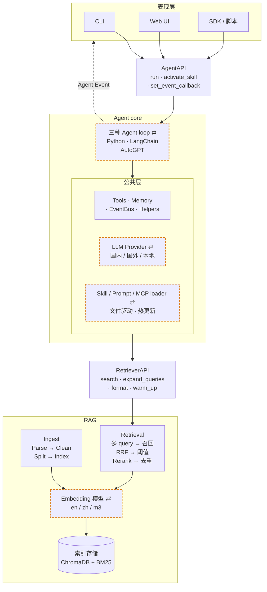

# AgentA

**Badges(TBD)**

一个从零实现的 **本地化私有知识库 Agent**，集成进阶 RAG 检索与 ReAct 工具调用循环，支持 CLI 与 WebUI 两种交互方式，可在 9 个国内外主流 LLM 之间切换。

**整体架构**

- 三层职责：表现层 / Agent Core / RAG
- 两套接口：`AgentAPI` / `RetrieverAPI`
- 四档可换/可扩展：LLM Provider / Embedding 模型 / Agent 实现 / Skill·Prompt·MCP loader


## 1.功能特性

### 1.1.RAG

- **多模型 Embedding**：内置 `all-MiniLM-L6-v2`（英文）/ `bge-small-zh`（中文）/ `bge-m3`（多语言）三套模型，分库存储自动路由。
- **混合检索**：Dense 向量召回 + BM25 关键词召回，通过 **Reciprocal Rank Fusion** 融合排名，对术语/缩写/版本号场景显著优于纯向量。
- **二阶段精排**：使用 `bge-reranker-base` Cross-Encoder 对召回结果做精排，并按 per-model 阈值过滤低质 chunk。
- **Query 改写**：Multi-Query 同义改写、HyDE 假设性答案、跨语言翻译轴三档可独立开关。
- **多格式解析**：覆盖 PDF / DOCX / PPTX / XLSX / Markdown / HTML / TXT 七种格式，PDF 扫描件自动 OCR 兜底（rapidocr-onnxruntime）。
- **评估方法**：`tools/rag_eval/runner.py` 内置黄金集 + `hit@1，hit@3，hit@k` / `MRR` 指标，每次调优结果存储 Markdown 报告（含 Miss 用例诊断），便于跨轮 diff。
- **召回可溯源**：RAG 回答正文带 `[n]` 标号 + 末尾 `— sources —` 块写明文件 / 章节 / 页号，同源 chunk 自动合并，编号受控防幻觉。

### 1.2.Agent

- **Agent 推理循环**：
  - 简单任务使用 ReAct 模式
  - 复杂任务升级为 Plan-Execute 多步执行
  - 测验批改 / RAG 召回结果用 Harness 自检 + LLM-as-Judge 复审
- **Context 管理**：
  - 四层注入：
    - SYSTEM_PROMPT 常量 + Skill catalog
    - 用户偏好 `.agenta/rules.md`
    - 跨 session 用户记忆
    - 临时上下文：学习计划 / 工具调用 / 用户输入
  - 防 prompt 注入：`<untrusted_tool>` 包装 + 启发式清洗 + plan 审批 + SSRF 防护
- **Thinking 模式**：Extended Thinking 开关 + budget / Adaptive 两种策略可配。
- **多模型切换**：内置 9 个国内/外 LLM provider，`.env` 一键切换。
- **用户记忆**：跨 session 管理用户偏好与事实，自动节流提取。
- **Skills 支持**：兼容 agentskills.io 规范，LLM 按 description 自动激活或 `/<name>` 手动调起。
- **MCP 接入**：作为 [Model Context Protocol](https://modelcontextprotocol.io) Host，配置文件挂载第三方 server，零代码扩 tool。
- **业务功能**（学习/研究助理）：
  - 创建学习计划：根据用户目标制定，可跨 session 注入 prompt
  - 出题练习：基于知识库自动出 MCQ（多选题）+ 简答题
  - 测试批改：作答后自动批改 + 跨 session 留档复盘
  - 主动复习：按遗忘曲线调度卡片，提示复习，用户自评

### 1.3 用户界面
CLI
WebUI


### 1.4 三套实现
PYTHON
LANGCHAIN
AUTOGPT

## 2.快速开始

### 2.1.环境准备

```bash
python -m venv .venv
# Windows
.venv\Scripts\activate
# Linux / macOS
source .venv/bin/activate

pip install -r requirements.txt
```

### 2.2.配置环境变量

```bash
cp .env.example .env
# 填入：LLM_PROVIDER 以及对应的 *_API_KEY
```

### 2.3.下载 Embedding /Reranker 模型

参考 [4.3.模型下载](#43-模型下载)

### 2.4.启动 AgentA

首次使用先入库（详见 [4.1.RAG 入库](#41rag-入库)）：

```bash
python -m tools.rag_cli ingest -m m3
```

WebUI 模式（Chainlit，推荐）：

```bash
chainlit run chainlit_app.py --port 8000
# 浏览器打开 http://localhost:8000
```

CLI 模式（开发调试 / 无 GUI 场景）：

```bash
python main.py
# 进入后输入 /help 查看全部命令
```

## 3.主要配置

`.env` 中常用的关键项（完整说明见 `.env.example`）：

```ini
# —— LLM ——
LLM_PROVIDER=qwen                 # kimi / qwen / deepseek / glm / openai / claude ...
QWEN_API_KEY=sk-xxxxxxxx
LLM_PROXY=http://127.0.0.1:7890   # 仅 openai / grok / claude 需要

# —— RAG ——
EMBEDDING_MODEL=m3                # en / zh / m3
RAG_ACTIVE_EMBEDDINGS=m3          # 实际启用的 collection 列表
RAG_TOP_K=8                       # 送给 LLM 的最终片段数
RERANKER_ENABLED=true             # 二阶段 Cross-Encoder 精排
BM25_ENABLED=true                 # BM25 + RRF 混合检索
RAG_QUERY_REWRITE_ENABLED=true    # Multi-Query 同义改写

# —— Agent ——
IMP_METHOD=PYTHON                 # PYTHON / LANGCHAIN / AUTOGPT
THINKING_ENABLED=true             # Extended Thinking（Claude / Qwen3）
USER_MEMORY_ENABLED=true          # 跨 session 用户记忆
USER_RULES_ENABLED=true           # 项目级偏好 .agenta/rules.md 注入
PLAN_PERMISSION_MODE=false        # plan 执行前是否需要用户审批
HARNESS_QUIZ_ENABLED=true         # 测验批改 LLM-as-Judge 复审
HARNESS_RAG_ENABLED=true          # RAG 召回 chunks 相关性过滤
MCP_ENABLED=true                  # 启用 MCP 接入（.agenta/mcp/config.json）
```

## 4.实用工具

### 4.1.RAG 入库

`tools/rag_cli.py` 把 `./datasets/` 下文档灌入向量库 + BM25 索引，并提供清库与状态查询：

```bash
python -m tools.rag_cli status                                 # 查看每个 collection 的当前状态
python -m tools.rag_cli ingest                                 # 幂等增量入库（默认 datasets/data_en + 默认模型）
python -m tools.rag_cli ingest -d ./datasets/data_zh -m zh     # 指定目录 / 模型别名（en / zh / m3）
python -m tools.rag_cli clear                                  # 清空全部 collection + BM25（需 yes 确认）
python -m tools.rag_cli clear -m m3                            # 只清空指定 alias
```

### 4.2.RAG 评估

基于 `tools/rag_eval/golden.json` 黄金集计算 `hit@1，hit@3，hit@k` / `MRR`，结果默认落到 `tools/rag_eval/reports/`。

```bash
python -m tools.rag_eval.runner                                          # 当前配置基线
python -m tools.rag_eval.runner --no-rewriter                            # 关闭 Query 改写做消融对比
python -m tools.rag_eval.runner --no-rerank                              # 关闭精排做消融对比
python -m tools.rag_eval.runner -o tools/rag_eval/reports/x.md          # 落 Markdown 报告 + 同名 .log trace
```

<a id="43-模型下载"></a>

### 4.3.模型下载

`tools/download_models.py` 按编号下载所需 Embedding / Reranker，自带多镜像 fallback:

```bash
python -m tools.download_models      # 默认下载全部 5 个（已缓存自动跳过）
python -m tools.download_models -l   # 仅查看清单与缓存状态
python -m tools.download_models 3    # 下载指定模型(编号详见 -l 输出)

```

### 4.4.UT 测试

`tools/ut.sh` 封装了 pytest 调用，分两类：**档位**（按 marker 过滤）+ **模块**（按文件，调试用）。

```bash
bash tools/ut.sh -h          # 查看帮助
bash tools/ut.sh -fast       # 默认case，跳过 integration/langchain/autogpt/extended_providers
bash tools/ut.sh -ext        # 默认 + 其余 7 个 LLM provider
bash tools/ut.sh -int        # 仅集成测试（需 .env 中相应真实 API key）
bash tools/ut.sh -all        # 全部case

```

> Windows 用户也可直接 `python -m pytest tests/` ，效果等同 `-fast`（pytest.ini 已配 marker 过滤）。

### 4.5.UI 调试

`tools/ui_debug.ps1`（Windows / PowerShell）一键拉起 Chainlit + cloudflared 隧道，自动把生成的临时公网 URL 复制到剪贴板，方便手机或外部设备调试：

```powershell
.\tools\ui_debug.ps1                 # 默认 8000 端口
.\tools\ui_debug.ps1 -Port 8080      # 自定义端口
```

### 4.6.Agent 评估

Phase 1.2~3.3 引入的 Agent 能力各自带独立评估脚本，报告统一落到 `tools/agent_eval/reports/`，命名约定 `<feature>-<YYYYMMDD-HHMMSS>.md`。

#### 4.6.1.Memory 召回

`tools/agent_eval/memory/recall_golden.py` 把 case 里的"已有记忆 / 项目 rules / RAG 引用"灌入 system prompt，调真实 LLM 后用关键词检查回答是否遵循偏好。

```bash
python -m tools.agent_eval.memory.recall_golden                              # 跑全部
python -m tools.agent_eval.memory.recall_golden --case M01-lang-zh           # 单 case
python -m tools.agent_eval.memory.recall_golden --no-report                  # 不落盘
```

#### 4.6.2.Skills 激活识别

`tools/agent_eval/skills/recall_skill.py` 验证 LLM 看到 skill catalog 后能否**主动**调对 `load_skill(name=…)`（positive 调对 / negative 不调）。

```bash
python -m tools.agent_eval.skills.recall_skill                              # 跑全部
python -m tools.agent_eval.skills.recall_skill --case S01-positive-planner  # 单 case
```

#### 4.6.3.Plan-Execute 识别 + 结构

`tools/agent_eval/plan/eval_plan.py` 评 LLM 对复杂任务是否调 `make_plan`、对简单任务是否不调；通过 case 再用 LLM-judge 打 plan 结构分。

```bash
python -m tools.agent_eval.plan.eval_plan                              # 跑全部
python -m tools.agent_eval.plan.eval_plan --case P01-positive-...      # 单 case
python -m tools.agent_eval.plan.eval_plan --no-judge                   # 不调 LLM-judge
```

#### 4.6.4.学习计划业务

`tools/agent_eval/plan_business/eval_learning_plan.py` 评 LLM 看到学习目标后是否调对 `make_plan` / `create_study_plan` 落库 tool，并对 plan steps 评质量分。

```bash
python -m tools.agent_eval.plan_business.eval_learning_plan
python -m tools.agent_eval.plan_business.eval_learning_plan --case L01-create-ml-8w
python -m tools.agent_eval.plan_business.eval_learning_plan --no-judge
```

#### 4.6.5.Quiz 出题 / 批改

`tools/agent_eval/quiz/eval_quiz.py` 评 LLM 看到出题 / 查历史需求时是否调对 `make_plan` / `create_quiz` / `query_quiz_history`，并对 plan 评质量分。

```bash
python -m tools.agent_eval.quiz.eval_quiz
python -m tools.agent_eval.quiz.eval_quiz --case Q01-create-rag
python -m tools.agent_eval.quiz.eval_quiz --no-judge
```

#### 4.6.6.SRS 调度触发

`tools/agent_eval/srs/eval_srs.py` 评 LLM 看到 due / add / review 三类输入时是否调对 SRS 四 tool；SM-2 算法本身由 UT 保。

```bash
python -m tools.agent_eval.srs.eval_srs
python -m tools.agent_eval.srs.eval_srs --case S01-due-today
```

#### 4.6.7.Harness 自检准确率

`tools/agent_eval/harness/eval_harness.py` 评 critic 自身判得准不准 —— 给定 (input, expected verdict) 比对 quiz_critic / rag_critic 实际判定。

```bash
python -m tools.agent_eval.harness.eval_harness
python -m tools.agent_eval.harness.eval_harness --case Q01-correct-grading-passes
```

#### 4.6.8.MCP 接入

`tools/agent_eval/mcp/eval_mcp.py` 跑 MCP client 完整链路（配置 → server 启动 → tool 合流 → LLM 调用 → SSRF 拦截），对照 7 条验收标准。

```bash
python -m tools.agent_eval.mcp.eval_mcp                                          # 跑全部
python -m tools.agent_eval.mcp.eval_mcp --no-llm                                 # 仅 structural（不烧 LLM 配额）
python -m tools.agent_eval.mcp.eval_mcp --case C6-ssrf-defense-blocks-internal   # 单 case
```

#### 4.6.9.安全 / 防注入

`tools/agent_eval/security/adversarial.py` 跑直接越狱 / RAG 间接 / web 间接 / tool 名单门 四类攻击 case，统计拦截率（≥ 90%）+ 误拦率（≤ 10%）。

```bash
python -m tools.agent_eval.security.adversarial                              # 跑全部
python -m tools.agent_eval.security.adversarial --kind direct                # 仅一类
python -m tools.agent_eval.security.adversarial --no-llm                     # 仅 tool_blocklist 类（不烧 LLM 配额）
```

#### 4.6.10.性能基准

`tools/agent_eval/perf_eval.py` 跑 session 列出 / 搜索 + memory 列出 / 查询 在 10/100/1000/5000 数据档位下的延迟基准（中位数 ms）。

```bash
python -m tools.agent_eval.perf_eval                              # session 基准
python -m tools.agent_eval.perf_eval --target memory              # memory 基准
python -m tools.agent_eval.perf_eval --target all                 # 全部
python -m tools.agent_eval.perf_eval --sizes 100,1000,5000        # 自定义档位
```

