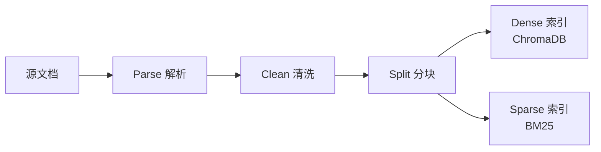
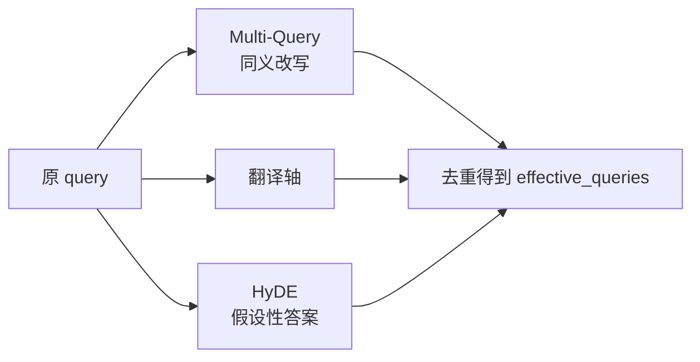
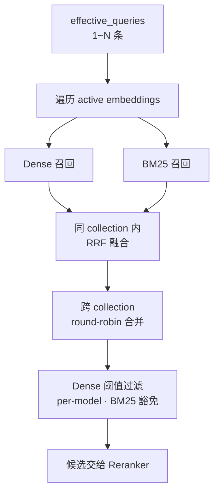
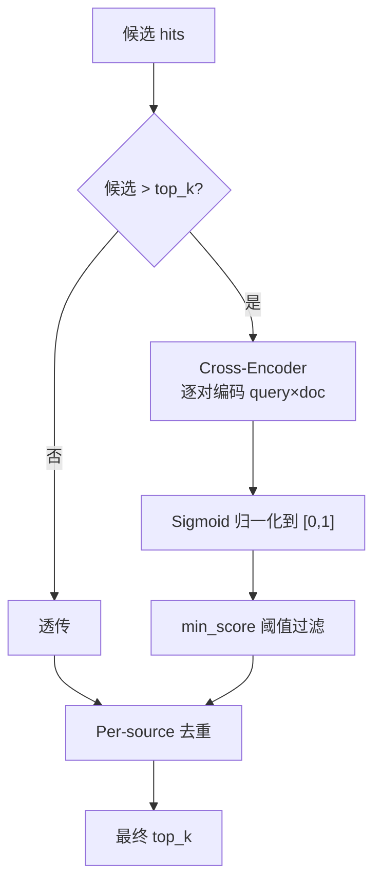
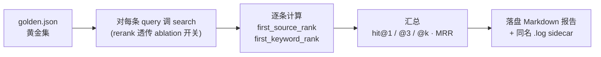

# 1.整体架构


# 2.RAG
## 2.1.Ingestion

将本地文档转换为可被检索的索引数据。

### 2.1.1.Ingestion流程



### 2.1.2.Ingestion设计要点

- **多格式统一抽象**：7 种格式经 parser 出口统一为纯文本，下游零分支；扫描版 PDF 自动走 OCR 兜底。
- **解析层清洗**：剥离页眉页脚、版权声明、跨页重复模板，避免高频噪声污染向量空间与 BM25 IDF。
- **结构化分块**：识别 Markdown 标题与 PDF 页号作为语义锚点；分块同时保留 `heading_path` / `page_no` 元数据，并把父级标题面包屑注入 chunk 文本本身，使每个 chunk 自带"我在第几章 / 第几页 / 讲什么"。
- **双索引同源**：dense 与 BM25 共享同一份 `chunk_id`，下游 RRF 融合能精确对齐"两路是否命中同一 chunk"——这是混合检索可行性的前提。
- **幂等增量**：以文件 `content_sha1` 驱动；未变化整文件跳过 re-embed，变化时先删旧再写新，重复运行不产生重复或孤儿数据。

### 2.1.3.Embedding（Dense 索引）

**目标**：捕获语义相似度，让"5G 基站"能匹配"无线接入网络"这类语义近义表达。

- **多模型并存**：每个 embedding 模型对应独立 collection——不同模型的向量维度天然不可比，必须分库。通过别名（`en / zh / m3`）切换默认模型，也支持多库并行召回再融合。
- **存储 / 距离空间**：ChromaDB + HNSW 索引，统一使用 cosine 空间（与 BGE / MiniLM 等模型训练目标对齐，避免默认 squared L2 造成命中错位）。
- **非对称检索约定**：BGE 系列要求 query 侧加专属 prefix、doc 侧不加；retriever 按模型名自动注入，ingest 端保持纯净文本。
- **物理布局**：每个 collection 一个 UUID 目录存 HNSW 二进制文件，所有元数据集中在 `chroma.sqlite3`，可直接 SQL 查询溯源。

### 2.1.4.BM25（Sparse 索引）

**目标**：捕获字面精确命中，解决 dense 模型对"无语义符号"的盲区——版本号、缩写、项目代号、命令名（如 `3GPP TS 38.211`、`CB014670`、`L2PS`），这些字符串没有可学习的语义，embedding 之后会被完全抹平。

- **与 dense 互补**：dense 强在语义近义、BM25 强在字面精确，两者通过 RRF 融合形成"语义 + 字面"双签到。
- **自实现 · 零外部依赖**：BM25 Okapi 公式 + 倒排索引 + pickle 持久化足够覆盖需求，无需引入 `rank_bm25` / Lucene 这类重量依赖。
- **混合分词**：英文走 whitespace + lowercase + 轻量停用词；中文走 **bigram**（连续 2 字符）——避免 `jieba` 30MB 词典依赖，且 RAG 场景下 bigram 召回率优于 unigram。
- **与 dense 共 chunk_id**：RRF 融合按 id 对齐的前提；缺这一条会退化为粗暴的跨尺度分数加权。
- **按文件粒度可删**：以 `doc_id` 为索引键支持批量删除，与 ChromaDB 在 ingest 文件级 upsert 上行为对齐。

## 2.2.Retrieval

### 2.2.1.Query rewrite

在检索前对用户原始 query 做语义/词汇扩展，提升召回鲁棒性。



**设计要点**

- **三类策略各打一种盲区，可独立开关**：
  - *Multi-Query* 解决"同义 / 术语化"差异——把口语化或不规范的措辞替换成专业术语；
  - *HyDE* 解决"口语 → 文档术语"的词汇分布差距，让 LLM 先编一段"假设性答案"作为额外检索 query；
  - *翻译轴* 解决"中文提问、英文文档"的跨语言失衡（dense 跨语言能力有限、BM25 跨语言完全失效）。
- **零侵入 · 静默降级**：query 改写定位为"锦上添花"层，LLM 调用失败时返回空、不打断主链路。
- **进程级 LRU 缓存**：同一 query 二次命中零开销，避免重复花 LLM token。
- **不依赖 chat_history**：指代消解由上层 Agent 在 query 入参前自行完成；本模块对会话状态零耦合，便于独立测试与离线评估复用。

### 2.2.2.Hybrid Retrieval

在 Dense + BM25 双索引基础上，对多 query 并行召回结果做"同 collection 内分级融合 + 跨 collection 公平合并 + per-model 阈值过滤"。



**设计要点**

- **RRF 而非分数加权**：Dense (cosine) 与 BM25 (Okapi raw) 分数尺度完全不可比，强行加权权重几乎不可调；RRF 只看"排第几"，天然解决跨尺度融合，多查询命中的 chunk 自然加权。
- **多 query 召回量自适应**：每条 query 的召回窗口随改写条数收缩，总候选量与单 query 一致——避免改写越多候选越爆炸、Reranker 被洪水冲垮。
- **跨 collection round-robin 合并**：不同 embedding 模型距离空间不同，直接按分数拼接会让某个模型的高分占满名额；round-robin 保证每个库公平出列。
- **Dense 阈值 per-model**：各模型同主题相似度分布差异显著（MiniLM 偏低、bge-zh 偏高），用单一全局阈值会一边误杀好结果、一边放进噪声——按 collection 分别校准。
- **BM25 命中豁免 dense 阈值**：BM25 是强字面信号，若被 dense 低分误杀，将失去"无语义符号"召回的全部价值。
- **检索器溯源**：每条 Hit 保留"由哪些检索器召回"的字段，下游可做差异化阈值策略，也便于评估与排查。

### 2.2.3.Cross-Encoder reranker

对 Bi-Encoder 召回的候选做二阶段精排，弥补"召回阶段双塔模型缺乏 token 级 query-doc 交互"的固有缺陷。



**设计要点**

- **Bi-Encoder + Cross-Encoder 两段式**：召回阶段双塔结构 query 与 doc 各自独立编码，能预算向量、毫秒级检索；精排阶段把 (query, doc) 拼起来过一次 Transformer 做 token 级交互，精度更高但代价 O(N)——故只对召回 top-N 跑。
- **候选 ≤ top_k 直接透传**：精排空间为零时跑 reranker 纯属浪费，前置短路。
- **多模型可切换 · 懒加载缓存**：默认 `bge-reranker-base`（中英双语），可一行配置切换更大/更轻量模型；按模型名缓存到进程，首次调用懒加载，切换模型不重启。
- **Sigmoid 归一化统一刻度**：不同 reranker 输出尺度天然不同（bge 近似概率、ms-marco 是 logit），统一过 sigmoid 后阈值 / 比较 / 展示用同一套尺度，切换模型不必同步调阈值刻度。
- **加载失败降级不崩溃**：模型缺失 / 网络不可达时返回召回前 top_k 条，主链路继续工作并 warning 给出修复指引（offline 开关、模型名拼写、备选轻量模型）。
- **Per-source 去重置后**：放在 reranker 之后保证"被去重的是真的低质重复"，而不是先按 source 限流再被精排选中——顺序颠倒会废掉一部分精排成果。

### 2.2.4.Evaluation

用"黄金集（golden set）"对当前 RAG 配置做端到端检索评估，输出指标 + 实验上下文，支撑离线调优、回归对比与 ablation 实验。



**指标矩阵**

| 指标 | 衡量什么 | 适用场景 |
|---|---|---|
| `hit_source@1` / `@3` / `@k` | 第 1 / 前 3 / 前 K 位是否命中"期望源文件" | 不同档位分别敏感于精排、短列表 UX、整体召回 |
| `hit_keyword@k` | top-K 内是否包含"期望关键词" | 关键词命中与位次弱相关，只看 @k 即可 |
| `hit_either@1` / `@3` / `@k` | 上述任一命中（更宽松）| 综合通过率，三档对齐 source |
| `MRR` | 第一次命中位置的倒数平均 | 衡量"是否早命中"（而非"是否命中"）|

**设计要点**

- **位置敏感的多档指标**：`hit@1` 对精排最敏感，`hit@3` 反映短列表 UX，`hit@k` 反映整体召回；单 `hit@k` 会掩盖召回与精排的不同贡献，三档并报让 ablation 实验能定位差异落在哪一层。
- **`first_source_rank` 与 `first_keyword_rank` 分开追踪**：两者由不同检索能力贡献（source 拼的是 ranking，keyword 拼的是内容覆盖），合并为单一 `first_hit_rank` 会让"source 排第 5 但 keyword 排第 1"这类信号丢失。
- **空目标自动剔除分母**：未标注 `expected_source*` / `expected_keywords` 的 case 不进入对应指标分母，避免"想留宽容评估却被惩罚"——比如纯靠 keyword 评估时不强求每个 case 都标 source 文件。
- **Results-first Markdown 报告**：字段顺序刻意按"核心指标 → 实验开关 → metadata → Miss 用例"排，打开报告第一屏即看到结果，调优时无需滚动；选 Markdown 而非 JSON，是因为评估输出的主要消费者是人（在 IDE 里 diff、贴到对比表），原始 case 列表对人工阅读价值低，放进 Miss 用例小节足够。
- **`.log` sidecar 收集 trace**：`-o report.md` 同时落盘 `report.md.log`，把每条 query 的 retriever 阶段日志（dense / bm25 / rrf / rerank / dedupe 各阶段候选数）落地，事后回溯 ablation 异常结果时无需重跑评估。终端默认仅打进度条与汇总（避免 INFO 倒灌进度行），`-v` 才把 INFO 抬到终端。
- **Metadata 全量留档**：报告头部序列化所有"影响结果的配置因子"（git commit + dirty 标志、LLM provider、active embeddings、KB chunk 实测数、reranker / dense 阈值 / BM25 / query 改写 / 切分参数），保证每次实验可追溯、可 diff、可复现。
- **KB chunk 数实测而非读配置**：直接查 ChromaDB `collection.count()`，因为 ingest 历史会让"配置里写的"和"真实落盘的"分叉——避免"配置看起来一样但 KB 已变"造成误判。
- **Ablation 通过 CLI 开关 + retriever 内层透传**：`--no-rewriter` 跳过 query 改写、`--no-rerank` 经 `search(rerank=False)` 强制关闭 retriever 内层 cross-encoder；报告同时记录"该组件最终是否真生效"（处理过静默降级路径），避免命令行参数与实际行为脱节。
- **Golden 集题型可分组**：每条 item 可选 `type` 字段（baseline / rerank / rewrite / hyde），便于做 per-type 统计——某组件只在自己擅长的题型上有增益时，全量指标会被稀释，按 type 拆分才看得见。


## 2.3.代码阅读指导

### 2.3.1.文件职责速查

| 路径 | 角色 | 主要入口 |
|---|---|---|
| `src/rag/parser.py` | 多格式 → 纯文本（txt/md/html/pdf/docx/pptx/xlsx + OCR 兜底）| `parse_file(path)` |
| `src/rag/splitter.py` | 结构化分块（识别 Markdown 标题与 PDF 页号作为锚点，注入面包屑）| `split_structured(text, ...)` |
| `src/rag/ingest.py` | 入库主流程（遍历目录 → parse → split → 双索引写盘 + 幂等增量）| `ingest_all(...)` · CLI `python -m src.rag.ingest` |
| `src/rag/bm25_index.py` | BM25 Okapi 自实现（倒排索引 + bigram 中文分词 + pickle 持久化）| `get_index(coll)` |
| `src/rag/query_rewriter.py` | 三轴 query 改写（Multi-Query / HyDE / 翻译轴），LRU 缓存包装 | `expand_queries(query)` |
| `src/rag/retriever.py` | 检索总枢纽：多 query × 多 collection × dense+bm25 → RRF → 阈值 → rerank → dedupe | `search(query, ..., rerank=None)` |
| `src/rag/reranker.py` | Cross-Encoder 精排，输出统一 sigmoid 归一化到 [0,1] | `rerank(query, hits, top_k)` |
| `tools/rag_eval/eval.py` | 端到端检索评估（黄金集 → 指标 → Markdown 报告 + `.log` sidecar）| `python -m tools.rag_eval.eval` |
| `tests/test_rag.py` | 单元 + 集成测试（chunk / 阈值 / reranker / search 端到端）| `pytest tests/test_rag.py` |

### 2.3.2.两条主调用链

**生产路径**（Agent 在线检索）：

```
Agent 工具调用
  └─ src/agent/tools.py · _tool_search_knowledge
       └─ src/rag/query_rewriter.py · expand_queries(query)         ← 三轴改写
            └─ src/rag/retriever.py · search(query, queries=...)    ← 总枢纽
                 ├─ _query_collection(...)                          ← Dense 召回
                 ├─ _query_bm25(...) → bm25_index.get_index()       ← Sparse 召回
                 ├─ _rrf_fuse(...)                                   ← RRF 融合
                 └─ src/rag/reranker.py · rerank(...)               ← Cross-Encoder 精排
```

**评估路径**（离线 ablation）：

```
python -m tools.rag_eval.eval [--no-rewriter] [--no-rerank] [-o report.md] [-v]
  └─ tools/rag_eval/eval.py · main() → evaluate()
       └─ src/rag/retriever.py · search(..., rerank=False?)         ← 透传 ablation 开关
            └─ (同生产路径)
       → 指标聚合（hit@1/@3/@k · MRR）
       → 落盘 Markdown 报告 + 同名 .log sidecar
```

### 2.3.3.推荐阅读顺序

**先读"主线"**，掌握"用户 query 进来后到底走了哪几步"：

1. `src/rag/retriever.py · search()` —— 整个 RAG 的"主函数"，看明白它就掌握了 80% 的检索逻辑。重点关注其中的阶段化日志（`[search]` 前缀），它是流程的天然导览。
2. `src/rag/reranker.py · rerank()` —— 短小，看完能理解 sigmoid 归一化与 score 字段语义。
3. `src/rag/query_rewriter.py · expand_queries()` —— 三轴改写如何各自降级、如何合并去重。

**再按需要往下钻**：

- 想优化召回质量 / 阈值 → `retriever.py` 的 dense 阈值过滤与 RRF 段
- 想加新文档格式 → `parser.py` 的 `parse_file()` 与各 `_parse_*` 私有函数
- 想调分块策略 → `splitter.py · split_structured()`
- 想加 / 改指标 → `tools/rag_eval/eval.py · evaluate()` 与 `_render_markdown()`
- 想理解入库幂等性 → `ingest.py · ingest_all()` 的 `content_sha1` 比对逻辑

### 2.3.4.常见改动落点

| 需求 | 改动文件 | 关键函数 / 配置 |
|---|---|---|
| 切换 embedding 模型 / 加新 alias | `src/config.py` | `EMBEDDING_MODELS` 字典；ingest 后自动新建 collection |
| 调 RRF / 阈值 / 去重 | `.env` | `RRF_K` / `RAG_DENSE_MIN_SCORE_*` / `RAG_K_PER_SOURCE` |
| 切换 reranker 模型 | `.env` | `RERANKER_MODEL` + `RAG_RERANK_MIN_SCORE`（统一 sigmoid 后仍需按分布微调） |
| 关闭某个改写轴 | `.env` | `RAG_QUERY_REWRITE_ENABLED` / `RAG_HYDE_ENABLED` / `RAG_TRANSLATE_QUERY_ENABLED` |
| Agent / 评估临时关 rerank | 调用方 | `search(..., rerank=False)`，无需改全局 config |
| 新增黄金集题目 | `tools/rag_eval/golden.json` | 字段 schema 见 `tools/rag_eval/eval.py` 顶部 docstring |
| 加新指标 | `tools/rag_eval/eval.py` | `EvalReport` 字段 + `evaluate()` 累加 + `_render_markdown()` 渲染 |


# 3.Agent
## LLM

## ReAct

## Session

## Memory

## Tools

## Prompt

## Skills

## MCP


# 4.UI


# 5.IMP
## Python 

## LangChain

## AutoGPT

