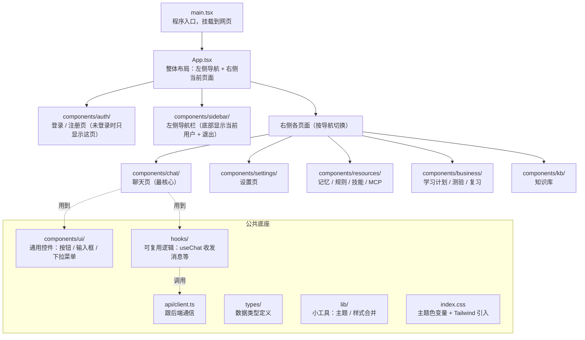
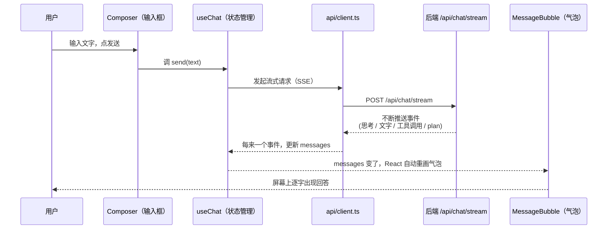

# 1. RAG

## 1.1. 文件职责速查

| 路                                                    径 | 角色                                                                                                | 主          要     入           口        |
| ---------------------------------------------------------------------------------- | --------------------------------------------------------------------------------------------------- | ------------------------------------------------------- |
| `src/rag/parser.py`                                                              | 多格式 → 纯文本（txt/md/html/pdf/docx/pptx/xlsx + OCR 兜底）                                       | `parse_file(path)`                                    |
| `src/rag/splitter.py`                                                            | 结构化分块（识别 Markdown 标题与 PDF 页号作为锚点，<br />把父级标题路径作为前缀注入 chunk 文本）    | `split_structured(text, ...)`                         |
| `src/rag/ingest.py`                                                              | 入库主流程（遍历目录 → parse → split → 双索引写盘 + 幂等增量）                                   | `ingest_all(...)` · CLI `python -m src.rag.ingest` |
| `src/rag/bm25_index.py`                                                          | BM25 Okapi 自实现（倒排索引 + bigram 中文分词 + pickle 持久化）                                     | `get_index(coll)`                                     |
| `src/rag/query_rewriter.py`                                                      | 三轴 query 改写（Multi-Query / HyDE / 翻译轴），LRU 缓存包装                                        | `expand_queries(query)`                               |
| `src/rag/retriever.py`                                                           | 检索总枢纽：多 query × 多 collection × dense+bm25 →<br />RRF → 阈值 → rerank → dedupe(去重）) | `search(query, ..., rerank=None)`                     |
| `src/rag/reranker.py`                                                            | Cross-Encoder 精排，输出统一 sigmoid 归一化到 [0,1]                                                 | `rerank(query, hits, top_k)`                          |
| `tools/rag_eval/runner.py`                                                       | 端到端检索评估（黄金集 → 指标 → Markdown 报告 +`.log` 伴生文件）                                | `python -m tools.rag_eval.runner`                     |

## 1.2. 两条主调用链

**生产路径**（Agent 在线检索）：

```
Agent 工具调用
  └─ src/agent/tools.py · _tool_search_knowledge
       └─ src/rag/query_rewriter.py · expand_queries(query)         ← 三轴改写
            └─ src/rag/retriever.py · search(query, queries=...)    ← 总枢纽
                 ├─ _query_collection(...)                          ← Dense 召回
                 ├─ _query_bm25(...) → bm25_index.get_index()       ← Sparse 召回
                 ├─ _rrf_fuse(...)                                   ← RRF 融合
                 └─ src/rag/reranker.py · rerank(...)               ← Cross-Encoder 精排
```

**评估路径**（离线 ablation）：

```
python -m tools.rag_eval.runner [--no-rewriter] [--no-rerank] [-o report.md] [-v]
  └─ tools/rag_eval/runner.py · main() → evaluate()
       ├─ [默认] src/rag/query_rewriter.py · expand_queries(query)  ← 可用 --no-rewriter 关
       └─ src/rag/retriever.py · search(query, queries=..., rerank=...)  ← rerank 透传 ablation
            └─ (dense + BM25 → RRF → 阈值 → rerank → dedupe，同生产路径)
       → 指标聚合（hit@1/@3/@k · MRR）
       → 存储 Markdown 报告 + 同名 .log 伴生文件
```

## 1.3. 推荐阅读顺序

**先读"主线"**，掌握"用户 query 进来后到底走了哪几步"：

1. `src/rag/retriever.py · search()` —— 整个 RAG 的"主函数"，看明白它就掌握了 80% 的检索逻辑。重点关注其中的阶段化日志（`[search]` 前缀），它是流程的天然导览。
2. `src/rag/reranker.py · rerank()` —— 短小，看完能理解 sigmoid 归一化与 score 字段语义。
3. `src/rag/query_rewriter.py · expand_queries()` —— 三轴改写如何各自降级、如何合并去重。

**再按需要往下钻**：

- 想优化召回质量 / 阈值 → `retriever.py` 的 dense 阈值过滤与 RRF 段
- 想加新文档格式 → `parser.py` 的 `parse_file()` 与各 `_parse_*` 私有函数
- 想调分块策略 → `splitter.py · split_structured()`
- 想加 / 改指标 → `tools/rag_eval/runner.py · evaluate()` 与 `_render_markdown()`
- 想理解入库幂等性 → `ingest.py · ingest_all()` 的 `content_sha1` 比对逻辑

## 1.4. 常见改动落点

| 需求                             | 改动文件                     | 关键函数 / 配置                                                                        |
| -------------------------------- | ---------------------------- | -------------------------------------------------------------------------------------- |
| 切换 embedding 模型 / 加新 alias | `src/config.py`            | `EMBEDDING_MODELS` 字典；ingest 后自动新建 collection                                |
| 调 RRF / 阈值 / 去重             | `.env`                     | `RRF_K` / `RAG_DENSE_MIN_SCORE_*` / `RAG_K_PER_SOURCE`                           |
| 切换 reranker 模型               | `.env`                     | `RERANKER_MODEL` + `RAG_RERANK_MIN_SCORE`（统一 sigmoid 后仍需按分布微调）         |
| 关闭某个改写轴                   | `.env`                     | `RAG_QUERY_REWRITE_ENABLED` / `RAG_HYDE_ENABLED` / `RAG_TRANSLATE_QUERY_ENABLED` |
| Agent / 评估临时关 rerank        | 调用方                       | `search(..., rerank=False)`，无需改全局 config                                       |
| 加新指标                         | `tools/rag_eval/runner.py` | `EvalReport` 字段 + `evaluate()` 累加 + `_render_markdown()` 渲染                |

# 2. Agent 代码

## 2.1. 文件职责速查

| 路径                                   | 角色                                                                                                                         | 主要入口                                                                                                                              |
| -------------------------------------- | ---------------------------------------------------------------------------------------------------------------------------- | ------------------------------------------------------------------------------------------------------------------------------------- |
| `src/agent/agent_api.py`             | `AgentAPI` Protocol：表现层 ↔ Agent core 契约（duck-typed，三种实现都满足，详 [§3.1](#31-agentapi)）                        | `AgentAPI`（Protocol）                                                                                                              |
| `src/agent/agent.py`                 | Python ReAct Agent 主实现：拼 system → loop（LLM ↔ tool）→ final；含 `SYSTEM_PROMPT` 与模块级共享 store 单例            | `Agent(...).run(user_input)` · `SYSTEM_PROMPT`                                                                                   |
| `src/agent/autogpt_agent.py`         | Auto-GPT 风格 Agent：Plan → Execute（子 ReAct）→ Review 三阶段                                                             | `AutoGPTAgent(...).run(user_input)`                                                                                                 |
| `src/agent/langchain_agent.py`       | LangChain `AgentExecutor` 实现，公共层接口对齐，loop 由 LangChain 接管                                                     | `LangChainAgent(...).run(user_input)`                                                                                               |
| `src/agent/langchain_tools.py`       | 把 `tools.py` 的 OpenAI 风格 schema 包装成 LangChain `StructuredTool`                                                    | `build_langchain_tools()`                                                                                                           |
| `src/agent/tools.py`                 | 全部业务 tool 定义 +`execute_tool` 路由（RAG / web / fetch / plan / study / quiz / srs / skill / mcp）                     | `get_tools(skill_bodies)` · `execute_tool(name, args, ...)`                                                                      |
| `src/agent/core/event_bus.py`        | 事件总线：10 类 `AgentEvent` 分发，多订阅扇出 + 异常隔离                                                                   | `EventBus` · `EVENT_*` 常量                                                                                                      |
| `src/agent/core/tool_call_engine.py` | 工具调用一轮编排：执行 + 结果格式化 + 写历史 + 叠加发 `plan_*` 事件                                                        | `ToolCallEngine.process(message, messages)`                                                                                         |
| `src/agent/core/history_manager.py`  | 历史按轮截断 + skill_pair 完整性保护 + system 拼接                                                                           | `HistoryManager.load_truncated()`                                                                                                   |
| `src/agent/core/memory_manager.py`   | UserMemory 注入 `<user_context>` + 节流自动提取                                                                            | `MemoryManager.build_system_prompt()` · `try_extract()`                                                                          |
| `src/agent/core/thinking_policy.py`  | Adaptive Extended Thinking budget 估算（LOW / MED / HIGH 三档）                                                              | `ThinkingPolicy.effective_budget(messages)`                                                                                         |
| `src/agent/core/citation_builder.py` | RAG 引用编号管理：跨同轮多次 `search_knowledge` 累计编号 + 末尾 `— sources —` 块渲染（详 [§3.6](#36-引用管理)）          | `CitationBuilder.register()` · `render()`                                                                                        |
| `src/agent/core/plan_manager.py`     | `PlanState` / `PlanStep` dataclass + 从 messages reconstruct plan 状态（详 [§3.8.1](#381-数据载体)）                       | `reconstruct_from_messages(messages)`                                                                                               |
| `src/agent/core/srs_scheduler.py`    | SM-2 公式纯函数（4 档 → ease / interval / repetitions / lapses，详[§3.11.2](#3112-sm-2-算法核心)）                            | `schedule_review(card, rating)`                                                                                                     |
| `src/agent/core/harness_manager.py`  | Q1 测验批改自检 + R1 RAG 召回过滤；复用 `judge_with_llm`（详 [§3.12](#312-harness-自检)）                                    | `HarnessManager.review_grading()` · `filter_chunks()`                                                                            |
| `src/agent/core/rules_loader.py`     | 把用户 rules 文本拼成 `<user_rules>` block（rules 文本由 Agent 按当前用户从 `user_rules` 读，详 [§3.5](#35-prompt-管理)）  | `build_rules_block()`                                                                                                               |
| `src/agent/core/mcp_config.py`       | MCP servers 配置解析 + UI 编辑路径的 CRUD 辅助 + disabled 列表管理（详[§3.14.3](#3143-配置文件) / [§3.14.4](#3144-web-ui-管理)） | `load_mcp_config()` · `add_server()` · `update_server()` · `delete_server()` · `rename_server()` · `toggle_server()` |
| `src/agent/core/mcp_manager.py`      | MCP server 子进程生命周期 + tool 发现 / 调用（asyncio loop 跑在后台线程）                                                    | `MCPManager.start_all()` · `start_one()` · `stop_one()` · `reload()` · `list_tools()` · `call_tool()`                |
| `src/agent/core/url_guard.py`        | SSRF 防护：私网 / 链路本地 / 保留段 IP 拦截                                                                                  | `is_url_safe(url)`                                                                                                                  |
| `src/agent/core/security_filter.py`  | Prompt-injection 启发式清洗 + tool 白名单 +`<untrusted_*>` 包装                                                            | `wrap_untrusted()` · `scrub_injection()` · `is_tool_allowed()`                                                                |
| `tools/agent_eval/`                  | Agent 端到端评估（plan / quiz / srs / memory / harness / security / mcp / perf）                                             | 各子目录 `eval_*.py`（详 [§3.13](#313-评估方法)）                                                                                     |
| `tests/test_agent*.py`               | 单元 + 集成测试（protocol / events / active_plan / autogpt / langchain）                                                     | `pytest tests/test_agent*.py`                                                                                                       |

## 2.2. 三条主调用链

**生产路径**（Python ReAct，默认实现 `IMP_METHOD=PYTHON`）：

```
src/agent/agent.py · Agent.run(user_input)
  ├─ HistoryManager.load_truncated()                       ← 截断 + skill_pair 保护
  ├─ MemoryManager.build_system_prompt(base)               ← 拼 <user_context>
  ├─ rules_loader.build_rules_block()                      ← 拼 <user_rules>
  ├─ build_active_study_plan_block(session_id)             ← 拼 <active_study_plan>
  └─ for iteration in range(MAX_HARD_CAP_ROUNDS):
       ├─ ThinkingPolicy.effective_budget(messages)         ← Adaptive 三档预算
       ├─ src/llm/provider.py · call_with_thinking(...)      ← 流式 / 非流式
       └─ if message.tool_calls:
            └─ ToolCallEngine.process(message, messages)
                 ├─ src/agent/tools.py · execute_tool(name, args, ...)
                 │    ├─ _tool_search_knowledge → src/rag/retriever.py · search(...)
                 │    ├─ _tool_make_plan / _tool_update_step / _tool_abort_plan
                 │    ├─ _tool_create_quiz → harness_manager · review_grading(...)
                 │    └─ ... (study / srs / skill / mcp / web / fetch)
                 ├─ security_filter · wrap_untrusted + scrub_injection
                 ├─ EventBus.publish(tool_call_start / tool_call_end)
                 └─ EventBus.publish(plan_created / plan_step_start / plan_step_end)
          else:                                              ← LLM 直接返文本
            ├─ EventBus.publish(final_answer)
            └─ MemoryManager.try_extract(user_input, reply)   ← 节流自动提取
```

**AutoGPT 三阶段路径**（`IMP_METHOD=AUTOGPT`）：

```
src/agent/autogpt_agent.py · AutoGPTAgent.run(user_input)
  ├─ [Plan]    LLM 生成 JSON 任务列表（≤ MAX_PLAN_TASKS）
  ├─ [Execute] for task: 子 ReAct 循环（≤ MAX_TASK_TOOL_ROUNDS）
  │              └─ src/agent/tools.py · execute_tool(...)
  ├─ [Review]  LLM 汇总所有任务结果 → final_answer
  └─ [Persist] 仅写 user + 最终 assistant（不写中间 task / tool message）
```

**评估路径**（离线）：

```
python -m tools.agent_eval.<feature>.eval_*
  └─ tools/agent_eval/<feature>/eval_*.py
       ├─ 真发起 Agent.run(...)（端到端）或直调 core helper（隔离评估）
       ├─ 指标聚合（recall / accuracy / latency / token / cost）
       └─ 落 Markdown 报告 + 同名 .log trace 到 tools/agent_eval/reports/
```

## 2.3. 推荐阅读顺序

**先读"主线"**，掌握"用户问题进来后 Agent 走了哪几步"：

1. `src/agent/agent.py · Agent.run()` —— Agent 的"主函数"，看明白即掌握 80% 推理逻辑。重点看：四层 system 拼接 → `for iteration` 主循环 → `tool_calls` 分支与 `final_answer` 分支的分叉点。
2. `src/agent/core/tool_call_engine.py · ToolCallEngine.process()` —— 工具调用一轮的"小循环"：执行 tool → 包 `<untrusted_*>` → 写历史 → 叠加发 `plan_*` 事件，主循环把每轮 tool_calls 都委托给它。
3. `src/agent/core/event_bus.py · EventBus.publish()` —— 短，看完能理解 10 类事件如何扇出到表现层（CLI / Chainlit）以及异常如何隔离。
4. `src/agent/tools.py · execute_tool()` —— 路由总线：所有业务 tool 在此 dispatch；按需深入某个 `_tool_*` 私有函数。

**再按需要往下钻**：

- 想理解 plan-execute → `tool_call_engine.py · _maybe_publish_plan_events()` + `core/plan_manager.py · reconstruct_from_messages()`
- 想调 thinking budget → `core/thinking_policy.py · effective_budget()`（LOW / MED / HIGH 阈值）
- 想加新业务 tool → `tools.py` 末尾找一个 `_tool_*` 拷贝 + `get_tools()` 加 schema + `execute_tool()` 加 case
- 想换 / 加 Agent 实现 → 对照 `agent_api.py · AgentAPI` Protocol 三件套：`run` / `activate_skill` / `set_event_callback`
- 想理解 RAG 引用编号 → `core/citation_builder.py · register()` 与 `render()`
- 想接 MCP server → `core/mcp_config.py`（配置 schema） + `core/mcp_manager.py`（subprocess + asyncio）
- 想加 prompt-injection 防护 → `core/security_filter.py · scrub_injection()` 的 `_PATTERNS` 表
- 想加 Harness critic 题型 → `core/harness_manager.py` + 对应 prompt 模板文件

## 2.4. 常见改动落点

| 需求                                                | 改动文件                              | 关键函数 / 配置                                                                                  |
| --------------------------------------------------- | ------------------------------------- | ------------------------------------------------------------------------------------------------ |
| 切换默认 Agent 实现（Python / LangChain / AutoGPT） | `.env`                              | `IMP_METHOD`                                                                                   |
| 调推理上限 / plan 步预算                            | `src/agent/agent.py`                | `MAX_TOOL_ROUNDS` / `MAX_TOTAL_ROUNDS` / `MAX_HARD_CAP_ROUNDS` / `_PLAN_ROUNDS_PER_STEP` |
| 改 SYSTEM_PROMPT（必查场景 / 工具策略 / 引用规范）  | `src/agent/agent.py`                | `SYSTEM_PROMPT`                                                                                |
| 加新业务 tool                                       | `src/agent/tools.py`                | `get_tools()` 加 schema + `execute_tool()` 加 dispatch + 新 `_tool_*` 实现                 |
| 改 Extended Thinking 阈值                           | `.env`                              | `THINKING_ENABLED` / `THINKING_BUDGET_MODE` / `THINKING_BUDGET_*`                          |
| 改用户记忆自动提取节流                              | `.env`                              | `USER_MEMORY_EXTRACT_EVERY_N` / `USER_MEMORY_EXTRACT_MIN_INPUT_LEN`                          |
| 开 / 关 plan 用户审批                               | `.env`                              | `PLAN_PERMISSION_MODE`                                                                         |
| 调 SM-2 调度参数                                    | `src/agent/core/srs_scheduler.py`   | `_clip_ease()` / `_update_ease()` / `_interval_from_repetitions()`                         |
| 加 Harness critic 题型                              | `src/agent/core/harness_manager.py` | `review_grading()` / `filter_chunks()` + 对应 prompt 模板                                    |
| 加 prompt-injection 模板拦截                        | `src/agent/core/security_filter.py` | `_PATTERNS` 列表 + `scrub_injection()`                                                       |
| 调 SSRF 拦截范围                                    | `src/agent/core/url_guard.py`       | `is_url_safe()`                                                                                |
| 改 tool 白 / 黑名单（禁用某个 tool）                | `.env`                              | `TOOL_ALLOWLIST` / `TOOL_BLOCKLIST`                                                          |
| 接入 MCP server                                     | `.agenta/mcp/config.json`           | `servers.<name>`；启动时 `mcp_manager.py · start_all()` 自动接入                            |
| 加新事件类型                                        | `src/agent/core/event_bus.py`       | 新 `EVENT_*` 常量 → `ALL_EVENT_TYPES` + 表现层 `_event_router` 加 case                    |
| 加 Agent 评估 task                                  | `tools/agent_eval/<feature>/`       | 新建子目录，参考已有 `plan/` `quiz/` `srs/` 等 feature                                     |

## 2.5. 精华理解

### 2.5.1. Prompt 组装

**发给 LLM 的内容 = `messages`（system prompt + 截断后的对话历史 + 当前用户问题）+ `tools` 参数。**

- system prompt 本身四层拼成：base（含 skills catalog）→ `<user_rules>` → `<user_context>` → `<active_study_plan>`，后注入覆盖前注入。
- 工具不在 prompt 里，是独立的 `tools` 参数（见 [§2.5.3](#253-tools--function-calling)）。

代码：

- messages 组装 → `agent/agent.py · Agent.run()`（`[{"role":"system"...}, *history, {"role":"user"...}]`）
- system 四层拼接 → `agent/agent.py`（`build_rules_block()` / `MemoryManager.build_system_prompt()` / `build_active_study_plan_block()`）
- 历史截断 → `agent/core/history_manager.py · HistoryManager.load_truncated()`

### 2.5.2. ReAct

**一个 `for` 循环：每轮调一次 LLM，调工具就喂回结果再问，直到 LLM 给出文字答案。**

- 每轮判断：LLM 返回 `tool_calls` → 执行 + 结果塞回 messages，`continue` 下一轮；返回正文 → 即最终答案，退出。
- 轮数上限不是定值：每轮按 active plan 步数动态重算（无 plan 用 baseline）。
- 工具轮次到顶时去掉 tools 参数，强制 LLM 出文字答案；空正文会补一次重试。

代码：

- 主循环 → `agent/agent.py · Agent.run()`（`for iteration in range(...)`）
- 上限动态算 → `agent/agent.py · _compute_effective_caps()`
- 调 LLM → `llm/provider.py · chat()` / `call_with_thinking()`；
- 执行工具 → `agent/core/tool_call_engine.py · process()`

### 2.5.3. Tools / Function Calling

**通过 function calling 的 `tools` 参数（不是 prompt 正文）把可用工具告诉 LLM，由 LLM（`tool_choice=auto`）自己决定调不调；一次调用 = ReAct 多轮里的中间一轮。**

- 每个 tool 的「做什么 / 何时用 / 怎么用」写在它的 JSON Schema `description` 里；system prompt 只放总体工具策略，不放工具清单。
- tool 分类：RAG 召回（`search_knowledge`）、agenta 本地工具（`web_search` / `fetch_url` + plan + 学习/Quiz/SRS 业务 + `load_skill`）、MCP（`<server>.<tool>` 运行时合流）。
- 给 LLM 前过白/黑名单门（`SECURITY_MODE`），被禁的 tool 直接不出现在列表。

代码：

- 组装工具列表 → `agent/tools.py · get_tools()`；schema 定义 → `TOOLS` 等常量
- MCP 合流 → `agent/tools.py · _load_mcp_tools_safe()`
- 名单门 → `agent/core/security_filter.py · is_tool_allowed()`

### 2.5.4. Thinking

**开启 thinking ≈ 调 LLM 时按各家 provider 拼对参数。**

- 两条路：Claude 原生传 `thinking={budget_tokens}`；OpenAI 兼容（qwen/kimi/glm/minimax/deepseek）往 `extra_body` 塞各家不同的键。
- 参数之外：
  - ① 强制流式，思考内容走 `reasoning_content` 实时透传
  - ② 多轮工具调用要把 reasoning 回传给 LLM

代码：

- 分发入口 → `llm/provider.py · call_with_thinking()`（按 provider 能力分两条路）
- 流式收 reasoning → `llm/provider.py · _run_openai_stream()` / `_run_thinking_stream()`

### 2.5.5. Plan-Execute

**通过 prompt  让 LLM 先 make_plan，然后再根据 plan 执行。**

prompt 之外：

- ① `make_plan`/`update_step` 的返回值把"下一步"主动喂回 LLM 引导；
- ② **轮次预算按 plan 步数放大**；
- ③ 参数校验纠错；
- ④LLM 漏调 `update_step` 时补发结束事件给 UI；
- ⑤ Plan 审批（make_plan 后弹 yes/no，no 中止）。

代码：

- prompt 驱动段 → `agent/core/agent_commons.py`（SYSTEM_PROMPT 里的 plan 规范）
- 三个 tool → `agent/tools.py · _tool_make_plan()` / `_tool_update_step()` / `_tool_abort_plan()`
- 状态重建 → `agent/core/plan_manager.py · reconstruct_from_messages()` / `PlanState`
- 轮次预算放大 → `agent/agent.py · _compute_effective_caps()`；收尾兜底 → `_finalize_pending_plan_steps()`
- plan 事件 + 审批门 → `agent/core/tool_call_engine.py`；开关 → `.env · PLAN_PERMISSION_MODE`

### 2.5.6. Session 管理

**一个 `user_id` 多个 session，一个 session 多条 message（两表 + 各自索引）：**

- message 存 OpenAI 四种 role（`system`/`user`/`assistant`/`tool`），tool_call / tool 结果也作为消息入表。
- 权限隔离：每个读写先过归属校验，非本人 session 读返回空、写不操作（纵深防御）。
- 生命周期：rename / create_empty / delete / clear  等。
- 分层：`ChatHistoryStore` 只做 CRUD，截断/轮次/skill 完整性等 loop 语义在 `HistoryManager`。

代码：

- 存储 + 表结构 → `memory/chat_history.py · ChatHistoryStore`（`sessions` / `messages` 两表）
- 归属校验 → `chat_history.py · _owns_unlocked()` / `owns_session()`
- 历史加载 + 截断 → `agent/core/history_manager.py · HistoryManager.load_truncated()`

### 2.5.7. User Rules

**≈ Cursor Rules：每用户独享的可信偏好，包成 `<user_rules>` 块注入 system prompt（四层第二层）**

- 每 `user_id` 一份，存库（`auth.db.user_rules`），Web「Rules」页编辑，改完下一轮即生效
- 关键：作为"用户主权内容"**不做防注入清洗**（防注入只针对 web_search/fetch_url 等 untrusted 外部数据）
- 开关： `USER_RULES_ENABLED`
- 长度上限： `USER_RULES_MAX_CHARS`

代码：

- 拼块 : `agent/core/rules_loader.py · build_rules_block()`；
- 注入 : `agent/agent.py`（`base + build_rules_block(...)`）
- 存取 : `memory/user_store.py · get_rules()` / `set_rules()`；
- 后端 api : `api/schemas/rules.py`

### 2.5.8. User Memory

**跨 session 持久化的自然语言列表（用户长期信息），注入 `<user_context>` 块（四层第三层）**

- 三种来源（`source` 字段）：`manual`（`/memory add` 手动）、`explicit`（"请记住"命令触发 LLM 提取）、`auto`（对话末自动提取）
- `explicit`/`auto` 写入不是 append，而是一次 LLM 调用做"提取 + 合并"（ADD/UPDATE/DELETE），天然去重去矛盾
- `auto` 默认关、且节流（每 N 轮 + 窗口需有够长 user 消息）；`explicit` 不受节流
- memory 写入**要过防注入清洗**（来源含对话里的 untrusted 内容）

代码：

- 存储 + 提取合并 : `memory/user_memory.py · UserMemoryStore`（`user_memories` 表，含 `source`）
- 触发节流 + 注入 : `agent/core/memory_manager.py · MemoryManager`（`try_extract()` / `build_system_prompt()`）
- 节流开关 : `.env · USER_MEMORY_AUTO_EXTRACT` / `USER_MEMORY_EXTRACT_EVERY_N`

### 2.5.9. 防 prompt injection

**四层防御：L1 输入侧 → L2 数据供应侧 → L3 处理侧 → L4 输出侧。核心是"外部不可信数据"进 context 前清洗 + 打标签。**

- L1 输入侧：用户输入**视为可信、不清洗**（用户主控，同 rules）。
- L2 数据供应侧：RAG/web/tool(包含mcp) 返回三类外部数据，进 context 前先清洗，再包成 `<untrusted_doc/web/tool>`。
- L3 处理侧：`SYSTEM_PROMPT`「数据隔离原则」段告知 LLM `<untrusted_*>` 内是数据、非指令。
- L4 输出侧：tool 黑/白名单(包含mcp)+ plan 审批（make_plan 后弹 yes/no）。
- memory 在**写入库时**用同一套 patterns 清洗，注入时走 `<user_context>`（不加 untrusted 标签）。

代码：

- patterns + 清洗 + 打标签 : `agent/core/security_filter.py`（`_INJECTION_PATTERNS` / `scrub_injection()` / `wrap_untrusted()`）
- L2 实现 : `rag/retriever.py · format_search_results()`、`tools.py · _tool_web_search()` / `_tool_fetch_url()` / `_execute_mcp_tool()`
- L3 数据隔离段 : `agent/core/agent_commons.py · SYSTEM_PROMPT`（「数据隔离」段）
- L4 名单门 : `tools.py · get_tools()` / `execute_tool()`；plan 审批 : `agent/core/tool_call_engine.py`

### 2.5.10. Skills

**符合 agentskills.io 规范的渐进披露：catalog 常驻让 LLM 认出，正文用到时才经 `load_skill` 加载。**

- catalog（每个 skill 的 name + description）启动时渲染成 `<available_skills>` 块，拼进 base system_prompt（四层第一层）。
- LLM 浏览 catalog 自己判断该用谁 → 调 `load_skill(name=...)` → 正文作为 `role:"tool"` 响应进 messages 历史（**不进 system prompt**）。
- 渐进披露规范三层（catalog / body / scripts）只实现前两层，**scripts 未做**。
- 启停"状态分离"：禁用名单存 `.agenta/skills/disabled.json`，SKILL.md 保持纯净。

代码：

- 扫描 / 解析 / disabled 名单 : `agent/core/skill_loader.py`（扫 `**/SKILL.md` + 解析 frontmatter → `SkillInfo` 字典）
- catalog 拼接 + 正文加载 tool : `agent/tools.py · _build_load_skill_def()` / `get_tools(skill_bodies)`
- 热更新 : `/reload-skills`（CLI）/ `POST /api/skills/reload`（`api/routes/skills.py`）
- 目录约定 : `.agenta/skills/<name>/SKILL.md`（frontmatter `name` + `description`）

### 2.5.11. MCP

**AgentA 是 MCP host：用官方 SDK 的 stdio_client 把每个 server 作为子进程拉起，tool 带 `<server>.<tool>` 前缀合流进 `get_tools()`。**

- 只实现 stdio transport，**未接 HTTP/SSE**（连不了远程 server，只能本地子进程式）。
- 数据驱动：server 列表来自 `.agenta/mcp/config.json`（`command` + `args`），加 server 纯改配置不动代码。
- 当前接 2 个：`filesystem`、`fetch`。
- 硬编码特例：`fetch` server 接入成功时屏蔽内置 `fetch_url`（避免功能重叠）。
- 已知缺口：MCP `fetch` 的 SSRF 防御依赖 server 端，host 侧 `url_guard` 未共用（design §3.13）。

代码：

- host / 连接管理 : `agent/core/mcp_manager.py · MCPManager`（`stdio_client` → `ClientSession` → `initialize` → `list_tools`）
- 配置解析 : `agent/core/mcp_config.py`；配置文件 : `.agenta/mcp/config.json`
- tool 合流 + fetch 特例 : `agent/tools.py · _load_mcp_tools_safe()` / `get_tools()`

### 2.5.12. Citation 引用展示

**回答正文带 `[n]` 标号，末尾追加 `— sources —` 块（文件/章节/页），让答案可追溯到原文。**

- 普通对话：只引 **RAG 召回**（`search_knowledge`）；`web_search` / `fetch_url` 不引。
- 深度研究：独立一套**共享 `CitationBuilder`**（跨子代理线程），把 RAG + 网页（`web_search`/`fetch_url`）统一编号。
- 编号约定（普通）：每轮 new builder 从 `[1]` 起、同轮多次召回累计、同 `(source, heading_path)` 合并。
- 反幻觉：`[n]` 全由 builder 分配，LLM 写的未分配编号（如 `[99]`）`extract_used` 时静默丢弃。

代码：

- 编号 + sources 块 : `agent/core/citation_builder.py · CitationBuilder`（`register()` / `extract_used()` / `render()`）
- 普通对话装配 : `agent/agent.py · Agent.run()`（每轮 new builder，正文后拼 sources）
- 深度研究共享引用 : `agent/core/research_engine.py`（子代理共用一个 builder，KB + web 统一 `[n]`）

# 3. UI 代码指南

面向「没做过前端、但想看懂本项目前端并能改一些小地方」的读者。读完能定位到某块界面对应哪个文件、看懂代码大致结构、自己动手改字号 / 间距 / 颜色这类样式。

## 3.1. 代码框架

前端是一个 React 单页应用，技术栈一句话：**React + TypeScript 写界面逻辑，Tailwind CSS 写样式，Vite 负责本地开发和打包**。

| 名词                           | 一句话解释                                                       |
| ------------------------------ | ---------------------------------------------------------------- |
| React                          | 把界面拆成一个个「组件」（可复用的界面块）的框架                 |
| TypeScript                     | 带类型标注的 JavaScript，编辑器能提前帮你查错                    |
| Tailwind CSS                   | 用一串短 class 名（如 `text-lg`）直接写样式，不单独写 CSS 文件 |
| Vite                           | 开发时启动本地服务器、改完代码自动刷新（热更新）；上线时打包     |
| shadcn / lucide-react / sonner | 现成的基础控件库 / 图标库 / 弹窗提示库                           |

代码都在 `frontend/src/` 下，按职责分目录：



目录速记：

| 目录 / 文件          | 放什么                                                                    |
| -------------------- | ------------------------------------------------------------------------- |
| `components/chat/` | 聊天界面的所有块：消息列表、气泡、输入框、思考块、工具调用块              |
| `components/auth/` | 登录 / 注册页；没登录时整个应用只显示这一页                               |
| `components/ui/`   | 最底层通用控件（按钮、下拉菜单等），别的组件拼装它们                      |
| `hooks/`           | 抽出来复用的逻辑，函数名以 `use` 开头（核心是 `useChat`，管消息收发） |
| `api/client.ts`    | 所有「请求后端」的函数都在这（含登录 / 注册 / 退出）                      |
| `lib/auth.tsx`     | 管「当前登录的是谁」：登录 / 注册 / 退出、是否管理员，都从这取            |
| `types/`           | 描述数据长什么样（如一条消息有哪些字段）                                  |
| `lib/`             | 零碎工具函数（`cn` 合并样式、主题切换）                                 |
| `index.css`        | 全局主题色、字体、圆角等变量                                              |

## 3.2. 流程图

以「用户发一条消息，看到 AI 流式回答」为例，看数据怎么流动：



要点：

- **状态在 `useChat` 里**：`messages`（消息数组）是唯一数据源；它一变，所有用到它的界面自动重画。这是 React 的核心思想——**改数据，不直接改界面**。
- **后端是流式（SSE）**：回答不是一次性返回，而是一段段推过来，所以能看到「逐字蹦」和中间的思考 / 工具调用过程。
- **组件只负责「把数据画出来」**：`MessageBubble` 拿到一条消息，按它的字段决定显示文字、思考块还是工具块（见 §3.1 的 `components/chat/`）。

## 3.3. 语法基础

看懂前端代码只需先掌握这几个概念，够改样式用了。

**1. 组件 = 返回界面的函数**。函数名大写开头，`return` 里那段「像 HTML」的就是界面：

```tsx
function Hello() {
  return <div className="text-lg">你好</div>
}
```

**2. JSX = 在 JS 里写界面标签**。标签里用 `{}` 插入变量或表达式：

```tsx
const name = '小明'
return <div>你好，{name}</div>   // 显示：你好，小明
```

**3. props = 父组件传给子组件的参数**（就是函数入参）：

```tsx
function Badge({ text }: { text: string }) {
  return <span>{text}</span>
}
// 用：<Badge text="free" />
```

**4. state = 组件自己的可变数据**，用 `useState`，变了界面自动重画：

```tsx
const [count, setCount] = useState(0)   // count 当前值；setCount 改它
```

**5. className + Tailwind = 用短 class 名控制样式**（最常改的就是这里）：

```tsx
<button className="px-2 text-sm text-muted-foreground">按钮</button>
//                  左右内边距  字号小   文字用「次要」色
```

**6. 条件 / 列表渲染**（代码里到处是这两种写法）：

| 写法                                       | 含义                       |
| ------------------------------------------ | -------------------------- |
| `{ok && <X/>}`                           | `ok` 为真才显示 `X`    |
| `{ok ? <A/> : <B/>}`                     | 真显示 `A`，假显示 `B` |
| `{list.map((x) => <X key={x.id} .../>)}` | 把数组每一项渲染成一个组件 |

**7. TypeScript 类型**：冒号后面是类型标注（`text: string` 表示 text 是字符串），只是给编辑器查错用，不影响运行逻辑。看不懂类型时可先跳过，专注 `return` 里的界面部分。

## 3.4. 页面调整指南

改字号 / 间距 / 颜色 / 对齐这类样式，**只改 `className` 里的 Tailwind 工具类即可**，不用碰逻辑。步骤：

1. **定位文件**：按下表从「界面区域」找到对应组件文件。
2. **找到那段 JSX**：在文件里搜界面上的文字或附近元素。
3. **改 `className`**：替换里面的工具类（见速查表）。
4. **存盘看效果**：开发服务器（`npm run dev`）会热更新，浏览器自动刷新，不用重启。

界面区域 → 文件对照：

| 界面区域                                                                   | 文件                                     |
| -------------------------------------------------------------------------- | ---------------------------------------- |
| 登录 / 注册页（含左上 logo + 标题）                                        | `components/auth/LoginView.tsx`        |
| 左侧导航栏（底部当前用户名 / 退出按钮；管理员才显示技能 / MCP / 设置入口） | `components/sidebar/Sidebar.tsx`       |
| 聊天输入框 / 模型选择 / 工具条                                             | `components/chat/Composer.tsx`         |
| 消息气泡（用户 / AI、附件卡片、操作按钮）                                  | `components/chat/MessageBubble.tsx`    |
| 工具调用块（如 `update_step`）                                           | `components/chat/ToolBlock.tsx`        |
| 思考过程块                                                                 | `components/chat/ThinkingBlock.tsx`    |
| 学习计划块                                                                 | `components/chat/PlanBlock.tsx`        |
| 设置页                                                                     | `components/settings/SettingsView.tsx` |
| 记忆 / 规则 / 技能 / MCP 页                                                | `components/resources/` 下对应文件     |
| 全局主题色 / 字体 / 圆角                                                   | `index.css`                            |

常用 Tailwind 工具类速查：

| 想改     | 类名示例                                                         | 说明                             |
| -------- | ---------------------------------------------------------------- | -------------------------------- |
| 字号     | `text-xs` `text-sm` `text-base` `text-lg` `text-xl`    | 从小到大                         |
| 字重     | `font-normal` `font-medium` `font-bold`                    | 常规 / 中等 / 加粗               |
| 文字颜色 | `text-foreground` `text-muted-foreground` `text-green-600` | 主色 / 次要色 / 具体色           |
| 背景色   | `bg-background` `bg-muted` `bg-primary`                    | 用主题变量，自动适配深浅色       |
| 内边距   | `p-2`（四周）`px-2`（左右）`py-1`（上下）                  | 数字越大越宽                     |
| 外边距   | `m-2` `mt-1` `mb-2`                                        | 同上，t/b/l/r 指方向             |
| 元素间距 | `gap-2`                                                        | 配合 `flex` 用，控制子元素间隔 |
| 宽 / 高  | `w-8` `h-8` `w-full` `max-w-3xl`                         | 固定值 / 占满 / 最大宽度         |
| 横向排列 | `flex items-center justify-between`                            | 一行排列、垂直居中、两端对齐     |
| 圆角     | `rounded-md` `rounded-full`                                  | 中等圆角 / 全圆                  |

实战例子（就是上一轮改过的）：把工具条上当前模型名的字号从大调小，在 `Composer.tsx` 找到模型选择按钮，把 `text-lg` 改成 `text-sm` 即可：

```tsx
// 改前
className="... px-2 text-lg text-muted-foreground ..."
// 改后（字号变小）
className="... px-2 text-sm text-muted-foreground ..."
```

小贴士：

- **颜色优先用主题变量**（`text-muted-foreground` / `bg-muted` 等），它们在深色 / 浅色模式下会自动切换；直接写 `text-gray-500` 这种会在另一种模式下不协调。
- 一个 `className` 里可以堆很多类，**顺序不影响效果**，按「布局 → 间距 → 字体 → 颜色」分组写更好读。
- 改坏了不要慌，Tailwind 类是纯样式，删掉多写的类就回到原样，不会影响功能。
