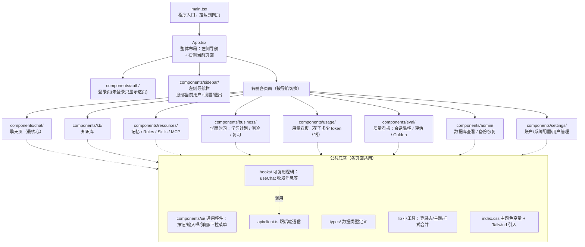
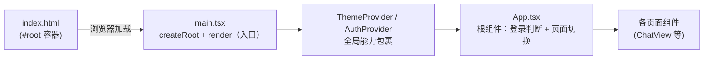
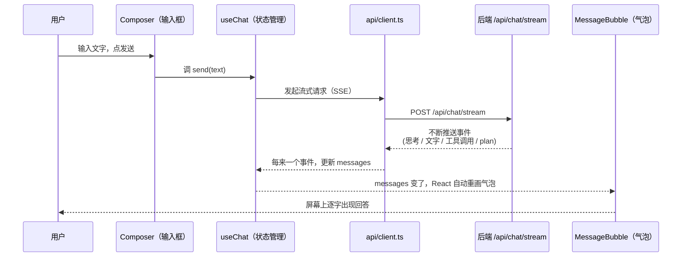
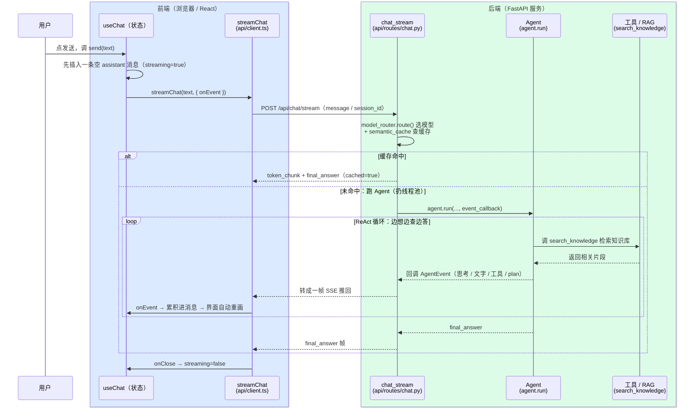
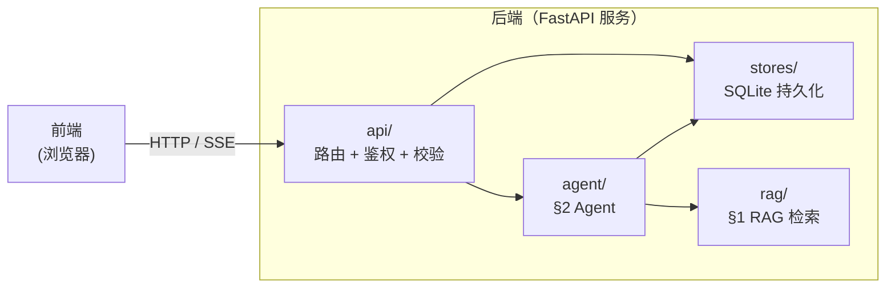
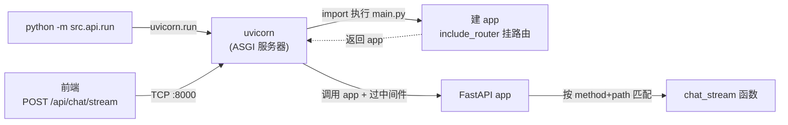
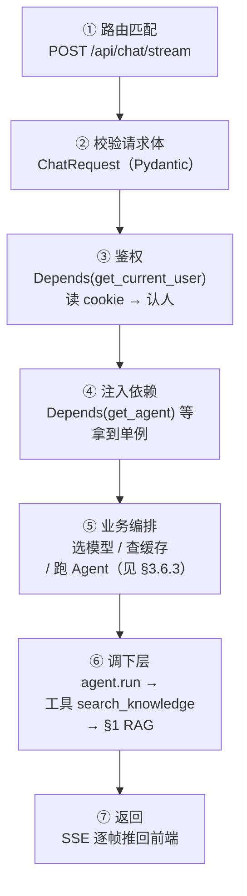
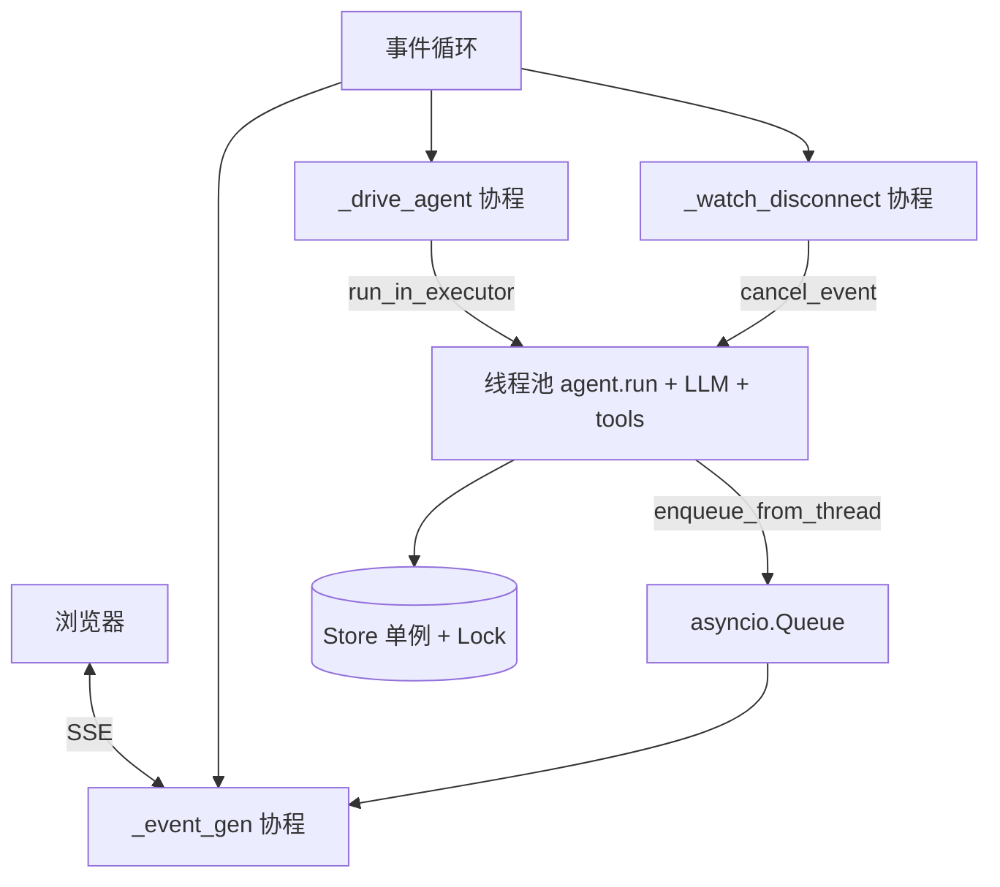

# 1. RAG

## 1.1. 文件职责速查


| 路径 | 角色 | 主要入口 |
| --------------------------- | --------------------------------------------------------------------------- | -------------------------------------------------- |
| src/rag/parser.py | 多格式 → 纯文本（txt/md/html/pdf/docx/pptx/xlsx + OCR 兜底） | parse_file(path) |
| src/rag/splitter.py | 结构化分块（识别 Markdown 标题与 PDF 页号作为锚点， 把父级标题路径作为前缀注入 chunk 文本） | iter_structured_lines(lines, ...) |
| src/rag/ingest.py | 入库主流程（遍历目录 → parse → split → 双索引写盘 + 幂等增量） | ingest_all(...) · CLI python -m src.rag.ingest |
| src/rag/bm25_index.py | BM25 Okapi 自实现（倒排索引 + bigram 中文分词 + pickle 持久化） | get_index(coll) |
| src/rag/query_rewriter.py | 三轴 query 改写（Multi-Query / HyDE / 翻译轴），LRU 缓存包装 | expand_queries(query) |
| src/rag/retriever.py | 检索总枢纽：多 query × 多 collection × dense+bm25 → RRF → 阈值 → rerank → dedupe(去重）) | search(query, ..., rerank=None) |
| src/rag/reranker.py | Cross-Encoder 精排，输出统一 sigmoid 归一化到 [0,1] | rerank(query, hits, top_k) |
| tools/rag_eval/runner.py | 端到c端检索评估（黄金集 → 指标 → Markdown 报告 + .log 伴生文件） | python -m tools.rag_eval.runner |


## 1.2. 两条主调用链

生产路径（Agent 在线检索）

```
Agent 工具调用
  └─ src/agent/tools.py · _tool_search_knowledge
       └─ src/rag/query_rewriter.py · expand_queries(query)         ← 三轴改写
            └─ src/rag/retriever.py · search(query, queries=...)    ← 总枢纽
                 ├─ _query_collection(...)                          ← Dense 召回
                 ├─ _query_bm25(...) → bm25_index.get_index()       ← Sparse 召回
                 ├─ _rrf_fuse(...)                                   ← RRF 融合
                 └─ src/rag/reranker.py · rerank(...)               ← Cross-Encoder 精排
```

评估路径（离线 ablation）

```
python -m tools.rag_eval.runner [--no-rewriter] [--no-rerank] [-o report.md] [-v]
  └─ tools/rag_eval/runner.py · main() → evaluate()
       ├─ [默认] src/rag/query_rewriter.py · expand_queries(query)  ← 可用 --no-rewriter 关
       └─ src/rag/retriever.py · search(query, queries=..., rerank=...)  ← rerank 透传 ablation
            └─ (dense + BM25 → RRF → 阈值 → rerank → dedupe，同生产路径)
       → 指标聚合（hit@1/@3/@k · MRR）
       → 存储 Markdown 报告 + 同名 .log 伴生文件
```

## 1.3. 推荐阅读顺序

先读主线

1. src/rag/retriever.py · search() —— 整个 RAG 的"主函数"，看明白它就掌握了 80% 的检索逻辑。重点关注其中的阶段化日志（[search] 前缀），它是流程的天然导览。
2. src/rag/reranker.py · rerank() —— 短小，看完能理解 sigmoid 归一化与 score 字段语义。
3. src/rag/query_rewriter.py · expand_queries() —— 三轴改写如何各自降级、如何合并去重。

再按需要往下钻

- 想优化召回质量 / 阈值 → retriever.py 的 dense 阈值过滤与 RRF 段
- 想加新文档格式 → parser.py 的 parse_file() 与各 _parse_* 私有函数
- 想调分块策略 → splitter.py · iter_structured_lines()
- 想加 / 改指标 → tools/rag_eval/runner.py · evaluate() 与 _render_markdown()
- 想理解入库幂等性 → ingest.py · ingest_all() 的 content_sha1 比对逻辑

## 1.4. 常见改动落点


| 需求 | 改动文件 | 关键函数 / 配置 |
| -------------------------- | -------------------------- | -------------------------------------------------------------------------------- |
| 切换 embedding 模型 / 加新 alias | src/config.py | EMBEDDING_MODELS 字典；ingest 后自动新建 collection |
| 调 RRF / 阈值 / 去重 | .env | RRF_K / RAG_DENSE_MIN_SCORE_* / RAG_K_PER_SOURCE |
| 切换 reranker 模型 | .env | RERANKER_MODEL + RAG_RERANK_MIN_SCORE（统一 sigmoid 后仍需按分布微调） |
| 关闭某个改写轴 | .env | RAG_QUERY_REWRITE_ENABLED / RAG_HYDE_ENABLED / RAG_TRANSLATE_QUERY_ENABLED |
| Agent / 评估临时关 rerank | 调用方 | search(..., rerank=False)，无需改全局 config |
| 加新指标 | tools/rag_eval/runner.py | EvalReport 字段 + evaluate() 累加 + _render_markdown() 渲染 |


# 2. Agent

## 2.1. 文件职责速查


| 路径 | 角色 | 主要入口 |
| ------------------------------------ | -------------------------------------------------------------------------------------------------------- | -------------------------------------------------------------------------------------------------------------------- |
| src/agent/agent_api.py | AgentAPI Protocol：表现层 ↔ Agent core 接口） | AgentAPI（Protocol） |
| src/agent/agent.py | Python ReAct Agent 主实现，含 SYSTEM_PROMPT 与模块级共享 store 单例 | Agent(...).run(user_input) · SYSTEM_PROMPT |
| src/agent/autogpt_agent.py | Auto-GPT 风格 Agent：Plan → Execute（子 ReAct）→ Review 三阶段 | AutoGPTAgent(...).run(user_input) |
| src/agent/langchain_agent.py | LangChain AgentExecutor 实现，公共层接口对齐，loop 由 LangChain 接管 | LangChainAgent(...).run(user_input) |
| src/agent/langchain_tools.py | 把 tools.py 的 OpenAI 风格 schema 包装成 LangChain StructuredTool | build_langchain_tools() |
| src/agent/tools.py | 全部业务 tool 定义 +execute_tool 路由（RAG / web / fetch / plan / study / quiz / srs / skill / mcp） | get_tools(skill_bodies) · execute_tool(name, args, ...) |
| src/agent/core/event_bus.py | 事件总线：18 类 AgentEvent 分发（含 tool / plan / research 等），多订阅扇出 + 异常隔离 | EventBus · EVENT_* 常量 |
| src/agent/core/tool_call_engine.py | 工具调用一轮编排：执行 + 结果格式化 + 写历史 + 叠加发 plan_* 事件 | ToolCallEngine.process(message, messages) |
| src/agent/core/history_manager.py | 历史按轮截断 + skill_pair 完整性保护 + system 拼接 | HistoryManager.load_truncated() |
| src/agent/core/memory_manager.py | UserMemory 注入 <user_context> + 节流自动提取 | MemoryManager.build_system_prompt() · try_extract() |
| src/agent/core/thinking_policy.py | Adaptive Extended Thinking budget 估算（LOW / MED / HIGH 三档） | ThinkingPolicy.effective_budget() |
| src/agent/core/citation_builder.py | RAG 引用编号管理：跨同轮多次 search_knowledge 累计编号 + 末尾 — sources — 块渲染（详 [引用展示](#2512-citation-引用展示)） | CitationBuilder.register() · render() |
| src/agent/core/plan_manager.py | PlanState / PlanStep dataclass + 从 messages reconstruct plan 状态（详 [plan-execute](#255-plan-execute)） | reconstruct_from_messages(messages) |
| src/agent/core/srs_scheduler.py | SM-2 公式纯函数（4 档 → ease / interval / repetitions / lapses，详 [SRS](#2515-srs-复习)） | schedule_review(card, rating) |
| src/agent/core/critic_manager.py | Q1 测验批改自检 + R1 RAG 召回过滤；复用 judge_with_llm（详 [Critic](#2516-critic-自检)） | CriticManager.review_grading() · filter_chunks() |
| src/agent/core/rules_loader.py | 把用户 rules 文本拼成 <user_rules> block（rules 文本由 Agent 按当前用户从 user_rules 读，详 [Rules](#35-prompt-管理)） | build_rules_block() |
| src/agent/core/mcp_config.py | MCP servers 配置解析 + UI 编辑路径的 CRUD 辅助 + disabled 列表管理（详[3.14.3 节](#3143-配置文件) / [3.14.4 节](#3144-web-ui-管理)） | load_mcp_config() · add_server() · update_server() · delete_server() · rename_server() · toggle_server() |
| src/agent/core/mcp_manager.py | MCP server 子进程生命周期 + tool 发现 / 调用（asyncio loop 跑在后台线程） | MCPManager.start_all() · start_one() · stop_one() · reload() · list_tools() · call_tool() |
| src/agent/core/url_guard.py | SSRF 防护：私网 / 链路本地 / 保留段 IP 拦截 | is_url_safe(url) |
| src/agent/core/security_filter.py | Prompt-injection 启发式清洗 + tool 白名单 + <untrusted_*> 包装 | wrap_untrusted() · scrub_injection() · is_tool_allowed() |
| tools/agent_eval/ | Agent 端到端评估（plan / quiz / srs / memory / critic / security / mcp / perf） | 各子目录 eval_*.py |
| tests/agent/test_*.py | 单元 + 集成测试（protocol / events / active_plan / autogpt / langchain / critic 等） | pytest tests/agent/ |


## 2.2. 三条主调用链

生产路径（Python ReAct，默认实现 IMP_METHOD=PYTHON）：

```
src/agent/agent.py · Agent.run(user_input)
  ├─ HistoryManager.load_truncated()                       ← 截断 + skill_pair 保护
  ├─ MemoryManager.build_system_prompt(base)               ← 拼 <user_context>
  ├─ rules_loader.build_rules_block()                      ← 拼 <user_rules>
  ├─ build_active_study_plan_block(session_id)             ← 拼 <active_study_plan>
  └─ for iteration in range(MAX_HARD_CAP_ROUNDS):
       ├─ ThinkingPolicy.effective_budget(messages)         ← Adaptive 三档预算
       ├─ src/llm/provider.py · call_with_thinking(...)      ← 流式 / 非流式
       └─ if message.tool_calls:
            └─ ToolCallEngine.process(message, messages)
                 ├─ src/agent/tools.py · execute_tool(name, args, ...)
                 │    ├─ _tool_search_knowledge → src/rag/retriever.py · search(...)
                 │    ├─ _tool_make_plan / _tool_update_step / _tool_abort_plan
                 │    ├─ _tool_grade_quiz → critic_manager · review_grading(...)
                 │    └─ ... (study / srs / skill / mcp / web / fetch)
                 ├─ security_filter · wrap_untrusted + scrub_injection
                 ├─ EventBus.publish(tool_call_start / tool_call_end)
                 └─ EventBus.publish(plan_created / plan_step_start / plan_step_end)
          else:                                              ← LLM 直接返文本
            ├─ EventBus.publish(final_answer)
            └─ MemoryManager.try_extract(user_input, reply)   ← 节流自动提取
```

AutoGPT 三阶段路径（IMP_METHOD=AUTOGPT）：

```
src/agent/autogpt_agent.py · AutoGPTAgent.run(user_input)
  ├─ [Plan]    LLM 生成 JSON 任务列表（≤ MAX_PLAN_TASKS）
  ├─ [Execute] for task: 子 ReAct 循环（≤ MAX_TASK_TOOL_ROUNDS）
  │              └─ src/agent/tools.py · execute_tool(...)
  ├─ [Review]  LLM 汇总所有任务结果 → final_answer
  └─ [Persist] 仅写 user + 最终 assistant（不写中间 task / tool message）
```

评估路径（离线）：

```
python -m tools.agent_eval.<feature>.eval_*
  └─ tools/agent_eval/<feature>/eval_*.py
       ├─ 真发起 Agent.run(...)（端到端）或直调 core helper（隔离评估）
       ├─ 指标聚合（recall / accuracy / latency / token / cost）
       └─ 落 Markdown 报告 + 同名 .log trace 到 tools/agent_eval/reports/
```

## 2.3. 推荐阅读顺序

先读主线

1. src/agent/agent.py · Agent.run() —— Agent 的"主函数"，看明白即掌握 80% 推理逻辑。重点看：四层 system 拼接 → for iteration 主循环 → tool_calls 分支与 final_answer 分支的分叉点。
2. src/agent/core/tool_call_engine.py · ToolCallEngine.process() —— 工具调用一轮的"小循环"：执行 tool → 包 <untrusted_*> → 写历史 → 叠加发 plan_* 事件，主循环把每轮 tool_calls 都委托给它。
3. src/agent/core/event_bus.py · EventBus.publish() —— 短，看完能理解 10 类事件如何扇出到表现层（CLI / Chainlit）以及异常如何隔离。
4. src/agent/tools.py · execute_tool() —— 路由总线：所有业务 tool 在此 dispatch；按需深入某个 _tool_* 私有函数。

再按需要往下钻

- 想理解 plan-execute → tool_call_engine.py · _maybe_publish_plan_events() + core/plan_manager.py · reconstruct_from_messages()
- 想调 thinking budget → core/thinking_policy.py · effective_budget()（LOW / MED / HIGH 阈值）
- 想加新业务 tool → tools.py 末尾找一个 _tool_* 拷贝 + get_tools() 加 schema + execute_tool() 加 case
- 想换 / 加 Agent 实现 → 对照 agent_api.py · AgentAPI Protocol 三件套：run / activate_skill / set_event_callback
- 想理解 RAG 引用编号 → core/citation_builder.py · register() 与 render()
- 想接 MCP server → core/mcp_config.py（配置 schema） + core/mcp_manager.py（subprocess + asyncio）
- 想加 prompt-injection 防护 → core/security_filter.py · scrub_injection() 的 _INJECTION_PATTERNS 表
- 想加 / 改 critic 自检规则 → core/critic_manager.py + tools/agent_eval/critic/ 下的 prompt 模板

## 2.4. 常见改动落点


| 需求 | 改动文件 | 关键函数 / 配置 |
| ------------------------------------------- | ----------------------------------- | ---------------------------------------------------------------------------------------- |
| 切换默认 Agent 实现（Python / LangChain / AutoGPT） | .env | IMP_METHOD |
| 调推理上限 / plan 步预算 | src/agent/agent.py | MAX_TOOL_ROUNDS / MAX_TOTAL_ROUNDS / MAX_HARD_CAP_ROUNDS / _PLAN_ROUNDS_PER_STEP |
| 改 SYSTEM_PROMPT（必查场景 / 工具策略 / 引用规范） | src/agent/agent.py | SYSTEM_PROMPT |
| 加新业务 tool | src/agent/tools.py | get_tools() 加 schema + execute_tool() 加 dispatch + 新 _tool_* 实现 |
| 改 Extended Thinking 阈值 | .env | THINKING_ENABLED / THINKING_BUDGET_MODE / THINKING_BUDGET_* |
| 改用户记忆自动提取节流 | .env | USER_MEMORY_EXTRACT_EVERY_N / USER_MEMORY_EXTRACT_MIN_INPUT_LEN |
| 开 / 关 plan 用户审批 | .env | PLAN_PERMISSION_MODE |
| 调 SM-2 调度参数 | src/agent/core/srs_scheduler.py | _clip_ease() / _update_ease() / _interval_from_repetitions() |
| 加 / 改 critic 自检规则 | src/agent/core/critic_manager.py | review_grading() / filter_chunks() + tools/agent_eval/critic/ prompt 模板 |
| 加 prompt-injection 模板拦截 | src/agent/core/security_filter.py | _INJECTION_PATTERNS 列表 + scrub_injection() |
| 调 SSRF 拦截范围 | src/agent/core/url_guard.py | is_url_safe() |
| 改 tool 白 / 黑名单（禁用某个 tool） | .env | TOOL_ALLOWLIST / TOOL_BLOCKLIST |
| 接入 MCP server | .agenta/mcp/config.json | servers.<name>；启动时 mcp_manager.py · start_all() 自动接入 |
| 加新事件类型 | src/agent/core/event_bus.py | 新 EVENT_* 常量 → ALL_EVENT_TYPES + 表现层 _event_router 加 case |
| 加 Agent 评估 task | tools/agent_eval/<feature>/ | 新建子目录，参考已有 plan/ quiz/ srs/ 等 feature |


# 3. Web UI

面向「没做过前端、但想看懂本项目前端并能改一些小地方」的读者。读完能定位到某块界面对应哪个文件、看懂代码大致结构、自己动手改字号 / 间距 / 颜色这类样式。

## 3.1. 前端框架

前端是一个 React 单页应用，技术栈一句话：React + TypeScript 写界面逻辑，Tailwind CSS 写样式，Vite 负责本地开发和打包。


| 名词 | 一句话解释 |
| --------------------- | ------------------------------------------------------------------ |
| React | 把界面拆成一个个「组件」（可复用的界面块）的框架 |
| TypeScript | 带类型标注的 JavaScript，编辑器能提前帮你查错 |
| Tailwind CSS | 用一串短 class 名（如 text-lg）直接写样式，不单独写 CSS 文件 |
| Vite | 开发时启动本地服务器、改完代码自动刷新（热更新）；上线时打包 |
| Base UI / shadcn | 无样式但带交互逻辑的基础控件底座（按钮、弹窗等）；按 shadcn 风格把源码复制进 components/ui/ 后自行配样式 |
| lucide-react / sonner | 图标库 / 右下角弹窗提示（toast）库 |
| react-markdown | 把 AI 回答里的 Markdown 渲染成排版好的界面 |


代码都在 frontend/src/ 下，按职责分目录：




目录速记：


| 目录 / 文件 | 放什么 |
| ----------------------- | ----------------------------------------------------- |
| components/chat/ | 聊天界面的所有块：消息列表、气泡、输入框、思考块、工具块、计划块、代码块、来源面板 |
| components/kb/ | 知识库：文档列表、上传入库、拖拽区 |
| components/resources/ | 记忆 / Rules / Skills / MCP 四个页面（Skills、MCP 仅管理员） |
| components/business/ | 学而时习：学习计划 / 测验 / 复习三个 tab，右侧可开聊天 |
| components/usage/ | 用量看板：用量趋势、计费配置、省钱面板 |
| components/eval/ | 质量看板：会话监控、离线评估、Golden 管理、实时安全监控 |
| components/admin/ | 管理员专属：数据库查看、备份与恢复 |
| components/settings/ | 设置页：个人信息 / 密码 / 系统配置 / API 密钥 / 用户管理 / 注销 |
| components/auth/ | 登录 / 注册页；没登录时整个应用只显示这一页 |
| components/sidebar/ | 左侧导航栏（页面切换 + 会话列表 + 底部用户菜单 / 主题切换） |
| components/ui/ | 最底层通用控件（按钮、输入框、弹窗、下拉等），别的组件拼装它们 |
| hooks/ | 抽出来复用的逻辑，use 开头（核心 useChat 管消息收发；另有语音输入、草稿、输入框设置） |
| api/client.ts | 所有「请求后端」的函数都在这（含登录 / 注册 / 退出） |
| lib/auth.tsx | 管「当前登录的是谁」：登录 / 注册 / 退出、是否管理员，都从这取 |
| types/ | 描述数据长什么样（每个 feature 一个文件，如 chat.ts / usage.ts） |
| lib/ | 零碎工具（cn 合并样式、主题切换、toast 提示、附件处理） |
| index.css | 全局主题色、字体、圆角等变量 |


## 3.2. 前端启动

前端从浏览器打开网页到渲染出界面，也有一条启动链（跟后端 3.7.2 节「启动 → 收 HTTP → 路由」对称）：

1. 浏览器加载 index.html：里面有个空容器 `<div id="root">`，以及一行 `<script src="/src/main.tsx">`（开发期由 Vite 提供，见 3.1 节的 Vite）。
2. main.tsx 是入口：它不画界面，只做「挂载」——找到 #root，把 React 组件树渲染进去：

```tsx
// frontend/src/main.tsx
createRoot(document.getElementById('root')!).render(
  <StrictMode>
    <ThemeProvider> {/* 全局主题 / 深浅色 */}
      <AuthProvider> {/* 全局登录态：当前是谁、是否管理员 */}
        <App />      {/* 根组件 */}
      </AuthProvider>
    </ThemeProvider>
  </StrictMode>,
)
```

1. 外层 Provider 提供全局能力：ThemeProvider（主题）、AuthProvider（登录态）包在最外，里面所有组件都能取用。
2. App.tsx 是根组件：先看 AuthProvider 给的登录态——没登录只显示登录页（components/auth/），登录了才渲染左侧导航 + 当前页面，并按导航在各页面间切换。
3. 进入具体页面组件（ChatView 等），用户开始交互；要数据时经 api/client.ts 向后端请求（接上 3.6 节）。




对照记忆：前后端入口都叫 main——后端 main.py 建 app、挂路由；前端 main.tsx 建 root、挂 App。App.tsx 之于前端，约等于「路由汇总 + 总布局」。

## 3.3. 流程图

以「用户发一条消息，看到 AI 流式回答」为例，看数据怎么流动：




要点：

- 状态在 useChat 里：messages（消息数组）是唯一数据源；它一变，所有用到它的界面自动重画。这是 React 的核心思想——改数据，不直接改界面。
- 后端是流式（SSE）：回答不是一次性返回，而是一段段推过来，所以能看到「逐字蹦」和中间的思考 / 工具调用过程。
- 组件只负责「把数据画出来」：MessageBubble 拿到一条消息，按它的字段决定显示文字、思考块还是工具块（见 3.1 节的 components/chat/）。

## 3.4. 语法基础

本节把读懂、改动前端代码要用的概念，按「画界面 → 传数据 → 加交互 → 控制显示 → 副作用 → 类型」六组系统过一遍。只改样式 / 文案掌握前三组即可；想动逻辑再往后看。

### 3.4.1. 画界面：组件 + JSX + 样式

1. 组件与界面

组件 = 返回界面的函数。函数名大写开头，return 里那段「像 HTML」的就是界面；定义好后就能当标签用（`<ChatView ... />`）。下面是 components/chat/ChatView.tsx 的骨架：

```tsx
// frontend/src/components/chat/ChatView.tsx（节选）

// 这就是一个组件：大写开头的函数 ChatView。
// 入参 { messages, onSend } 是 props（父组件传进来的数据 / 回调），见下方 §3.3.2。
export function ChatView({ messages, onSend /* ... */ }: ChatViewProps) {
 // return 里这段「像 HTML」的就是这个组件要显示的界面（JSX）。
 return (
 // 最外层一个 div：className 里全是 Tailwind 样式类（弹性纵向布局、占满高度）。
 <div className="flex h-full flex-1 flex-col">
 {/* 顶部标题栏：一条下边框 + 左右上下内边距 */}
 <header className="border-b border-border px-6 py-3">
 {/* h1 标题：基础字号、半粗、字间距收紧 */}
 <h1 className="text-base font-semibold tracking-tight">AgentA</h1>
 {/* 副标题：更小字号 + 次要文字色 */}
 <p className="text-xs text-muted-foreground">基于 RAG + Agent 的学习助手</p>
 </header>
 </div>
 )
}
```

2. JSX = 在 JS 里写界面标签。几条必须知道的规则：


| 规则 | 说明 | 项目里的真实写法 |
| ---------------------- | ---------------------- | ----------------------------------------------------------- |
| 用 {} 插值 | 标签里插变量 / 表达式 | `<span>{timeLabel(m.createdAt!)}</span>`（MessageList.tsx） |
| className 不是 class | JSX 里类名属性叫 className | `<h1 className="text-base font-semibold">`（ChatView.tsx） |
| 只能有一个根节点 | 多个并列用 <>…</> 包起来 | `<><MessageList … />{composer}</>`（ChatView.tsx） |
| 标签必须闭合 | 无内容标签自闭合 | `<MessageBubble message={m} cb={cb} />`（MessageList.tsx） |


3. className + Tailwind = 控制样式（最常改的就在这，详见 3.4 节）。MessageList.tsx 里「回到最新」按钮的样式：

> 注意：// 注释不能写进 className 的引号里，否则会变成样式字符串的一部分。所以下面把每个类的含义放在代码块外解释。

```tsx
// frontend/src/components/chat/MessageList.tsx（节选）
<button
 className="absolute bottom-4 left-1/2 flex -translate-x-1/2 items-center gap-1
 rounded-full border border-border bg-popover px-3 py-1.5 text-xs"
>
 {/* ArrowDown 是 lucide 图标组件，className 的 h/w 控制图标大小 */}
 <ArrowDown className="h-3.5 w-3.5" /> 回到最新
</button>
```

上面 className 里每个类的作用：absolute bottom-4 left-1/2（绝对定位、贴底、水平方向放到 50%）→ flex -translate-x-1/2（弹性布局，再左移自身一半实现真正水平居中）→ items-center gap-1（子元素垂直居中、间距 0.25rem）→ rounded-full border border-border（全圆角 + 一圈边框）→ bg-popover px-3 py-1.5 text-xs（背景色 + 内边距 + 小字号）。

多个类、或要按条件加类时用 cn(...)（见 3.1 节「目录速记」lib/），它还会自动解决两个类改同一样式时的冲突。CodeBlock.tsx 的复制按钮：

```tsx
// frontend/src/components/chat/CodeBlock.tsx（节选）
className={cn(
 // 第一串：基础样式（弹性布局、小圆角、内边距、11px 字号、次要文字色）
 'flex items-center gap-1 rounded px-1.5 py-0.5 text-[11px] text-muted-foreground',
 // 第二串：交互态（颜色过渡 + 鼠标悬停时加深背景和文字）
 'transition-colors hover:bg-foreground/10 hover:text-foreground',
)} // cn(...) 把多串类拼成一个字符串，并自动去掉互相冲突的类
```

### 3.4.2. 传数据：props + state

4. props = 父组件传给子组件的参数（就是函数入参，数据从上往下流）。ChatView 通过 props 接收消息和各种回调，? 表示可选、= false 是默认值：

```tsx
// frontend/src/components/chat/ChatView.tsx（节选）

// 先用 type 描述「这个组件接受哪些 props」（每个 prop 的名字 + 类型）
export type ChatViewProps = {
 messages: Message[] // 消息数组，由父组件传入
 onSend: (text: string, mode?: ChatMode) => void // 回调函数：用户发消息时调它
 hideHeader?: boolean // 名字带 ? = 可选，父组件可以不传
 // ...
}

// 函数入参用 { } 把 props 一个个解构出来；hideHeader = false 表示不传时默认为 false
export function ChatView({ messages, onSend, hideHeader = false }: ChatViewProps) {
 /* ...这里用 messages 渲染列表、把 onSend 传给输入框... */
}
```

特殊 prop children 指「标签中间包起来的内容」。CodeBlock 就靠它接收要展示的代码：

```tsx
// frontend/src/components/chat/CodeBlock.tsx（节选）
// children 的类型是 ReactNode（可以是文字、标签、组件等任意可渲染内容）
type Props = { language: string; raw: string; children: ReactNode }

// 使用时，写在 <CodeBlock> … </CodeBlock> 标签【中间】的内容，就会作为 children 传进去
// 用：<CodeBlock language="ts" raw={code}>{高亮后的代码}</CodeBlock>
// └──── 这部分就是 children ────┘
```

5. state = 组件自己的可变数据，用 useState；改它必须用配套的 set 函数，不能直接赋值，一改 React 就自动重画。CodeBlock 用一个 copied 状态控制按钮显示「复制 / 已复制」：

```tsx
// frontend/src/components/chat/CodeBlock.tsx（节选）

// useState(false) 声明一个状态：初始值 false。
// 返回一个数组，习惯用解构取两个东西：[当前值, 改它的函数]
const [copied, setCopied] = useState(false) // copied=当前是否已复制；setCopied=改它

const copy = async () => {
 await navigator.clipboard.writeText(raw) // 把代码写进系统剪贴板（异步，所以 await）
 setCopied(true) // 用 set 函数改成 true → 触发界面重画
 // 直接写 copied = true 不行：React 不知道数据变了，界面不会更新
 setTimeout(() => setCopied(false), 1500) // 1.5 秒后再改回 false，按钮恢复「复制」
}
```

记住 React 的核心思想：改数据，不直接改界面——界面是数据「算出来」的结果，数据一变界面自动跟着变（这里 copied 一变，按钮文字 / 图标就自动切换）。

### 3.4.3. 加交互：事件 + 回调往上传

6. 事件处理：onClick / onChange 等接一个函数；输入框常配 value + onChange 做成「受控」（值存在 state 里）：

```tsx
// MessageList.tsx：onClick 接一个函数，点按钮时就执行 scrollToBottom
<button onClick={scrollToBottom}> 回到最新 </button>

// Sidebar.tsx：重命名会话的「受控」输入框
// - value={renameValue}：输入框显示的内容由 state 决定（不是用户随便敲）
// - onChange：每次敲键盘触发，e.target.value 是最新文本，写回 state →
// state 变 → value 跟着变 → 这样输入框才显示出你敲的字
<Input value={renameValue} onChange={(e) => setRenameValue(e.target.value)} />
```

7. 子组件通知父组件 = 把一个回调函数传下去（数据往下、事件往上）。本项目大量这样用：App 把 send 一路传给 ChatView 的 onSend，再传给输入框 Composer：

```tsx
// frontend/src/components/chat/ChatView.tsx（节选）
// ChatView 自己不发请求，只是把从父组件 App 收到的 onSend 继续往下传给输入框 Composer。
<Composer
 onSend={onSend} // 数据往下传：把回调交给子组件
 onStop={onStop}
/>
// 事件往上走：用户在 Composer 里点「发送」→ Composer 调用 onSend(文本)
// → 实际执行的是 App 传下来的函数 → App 据此发起后端请求
// 这就是 React 的约定：数据往下（props），事件往上（回调函数）
```

### 3.4.4. 控制显示：条件 / 列表渲染

代码里到处是这两种写法：


| 写法 | 含义 | 项目里的真实写法 |
| ---------------------------------------- | --------------- | -------------------------------------------------------------------------- |
| `{ok && <X/>}` | ok 为真才显示 X | `{!hideHeader && (<header>…</header>)}`（ChatView.tsx） |
| `{ok ? <A/> : <B/>}` | 真显示 A，假显示 B | `{messages.length === 0 ? (<空状态/>) : (<消息列表/>)}`（ChatView.tsx） |
| `{list.map((x) => <X key={x.id} .../>)}` | 把数组每一项渲染成一个组件 | `{messages.map((m) => <MessageBubble key={m.id} … />)}`（MessageList.tsx） |


列表渲染必须给每项一个唯一 key（如 key={m.id}）：React 靠它分辨哪项变了，漏写会告警并可能出 bug。

### 3.4.5. 副作用：useEffect

改样式 / 文案用不到，动逻辑才需要。useEffect 用来做「渲染之外的事」——如订阅事件、取数据、操作 DOM。MessageList 用它在消息更新后自动滚到底部：

```tsx
// frontend/src/components/chat/MessageList.tsx（节选）
useEffect(() => {
 // 第一个参数是「要做的事」：这里在每次渲染完后把滚动条挪到底部
 if (!stick) return // 用户手动往上翻了就不打扰（提前返回）
 const el = containerRef.current // 取到列表容器的真实 DOM 元素
 if (el) el.scrollTop = el.scrollHeight // 把滚动位置设到最底 → 看到最新消息
}, [messages, stick])
// 第二个参数是「依赖数组」：里面任一值变化，上面的函数就重新执行一次。
// [messages, stick] → 来新消息、或 stick 变了就滚动
// [] → 只在组件首次出现时跑一次（常用于进页面拉数据）
// 不写 → 每次渲染都跑（一般要避免）
```

形如 useXxx 的都叫 Hook（useState / useEffect / useRef / 项目自定义的 useChat 等）。两条铁律：只在组件函数顶层调用（别放进 if / 循环里），名字以 use 开头。

### 3.4.6. TypeScript 类型

冒号后面是类型标注，只给编辑器查错用，不影响运行：


| 写法 | 含义 | 项目里的真实写法 |
| ------------------ | --------------- | -------------------------------------------- |
| text: string | 字符串 | sessionId: string |
| count?: number | 可选，可以不传 | hideHeader?: boolean（ChatView.tsx） |
| 'a' | 'b' | 只能是这几个值之一（联合类型） |
| type Props = {…} | 给一组字段起个类型名，方便复用 | type ChatViewProps = { … }（ChatView.tsx） |


ViewKind 这种联合类型很实用：App 里 activeView 只能取这几个值，写错一个名字编辑器立刻报红。看不懂类型时可先跳过，专注 return 里的界面部分。

## 3.5. 页面调整指南

改字号 / 间距 / 颜色 / 对齐这类样式，只改 className 里的 Tailwind 工具类即可，不用碰逻辑。步骤：

1. 定位文件：按下表从「界面区域」找到对应组件文件。
2. 找到那段 JSX：在文件里搜界面上的文字或附近元素。
3. 改 className：替换里面的工具类（见速查表）。
4. 存盘看效果：开发服务器（npm run dev）会热更新，浏览器自动刷新，不用重启。

界面区域 → 文件对照：


| 界面区域 | 文件 |
| -------------------------------------------------------------- | -------------------------------------- |
| 登录 / 注册页（含左上 logo + 标题） | components/auth/LoginView.tsx |
| 左侧导航栏（页面入口 + 会话列表；底部用户名 / 设置 / 退出；Skills / MCP / 数据库 / 备份仅管理员） | components/sidebar/Sidebar.tsx |
| 聊天输入框 / 模型选择 / 工具条 | components/chat/Composer.tsx |
| 消息气泡（用户 / AI、附件卡片、操作按钮） | components/chat/MessageBubble.tsx |
| 工具调用块（如 update_step） | components/chat/ToolBlock.tsx |
| 思考过程块 | components/chat/ThinkingBlock.tsx |
| 学习计划块 | components/chat/PlanBlock.tsx |
| 学而时习页（学习计划 / 测验 / 复习） | components/business/ 下对应文件 |
| 用量看板 | components/usage/ 下对应文件 |
| 质量看板（会话监控 / 评估 / Golden） | components/eval/ 下对应文件 |
| 记忆 / Rules / Skills / MCP 页 | components/resources/ 下对应文件 |
| 知识库页 | components/kb/ 下对应文件 |
| 设置页（账户 / 系统配置 / API 密钥 / 用户管理） | components/settings/SettingsPage.tsx |
| 数据库查看 / 备份恢复（管理员） | components/admin/ 下对应文件 |
| 全局主题色 / 字体 / 圆角 | index.css |


常用 Tailwind 工具类速查：


| 想改 | 类名示例 | 说明 |
| ----- | ---------------------------------------------------------- | ------------------- |
| 字号 | text-xs text-sm text-base text-lg text-xl | 从小到大 |
| 字重 | font-normal font-medium font-bold | 常规 / 中等 / 加粗 |
| 文字颜色 | text-foreground text-muted-foreground text-green-600 | 主色 / 次要色 / 具体色 |
| 背景色 | bg-background bg-muted bg-primary | 用主题变量，自动适配深浅色 |
| 内边距 | p-2（四周）px-2（左右）py-1（上下） | 数字越大越宽 |
| 外边距 | m-2 mt-1 mb-2 | 同上，t/b/l/r 指方向 |
| 元素间距 | gap-2 | 配合 flex 用，控制子元素间隔 |
| 宽 / 高 | w-8 h-8 w-full max-w-3xl | 固定值 / 占满 / 最大宽度 |
| 横向排列 | flex items-center justify-between | 一行排列、垂直居中、两端对齐 |
| 圆角 | rounded-md rounded-full | 中等圆角 / 全圆 |


实战例子：把工具条上当前模型名的字号从大调小，在 Composer.tsx 找到模型选择按钮，把 text-lg 改成 text-sm 即可：

```tsx
// 改前
className="... px-2 text-lg text-muted-foreground ..."
// 改后（字号变小）
className="... px-2 text-sm text-muted-foreground ..."
```

小贴士：

- 颜色优先用主题变量（text-muted-foreground / bg-muted 等），它们在深色 / 浅色模式下会自动切换；直接写 text-gray-500 这种会在另一种模式下不协调。
- 一个 className 里可以堆很多类，顺序不影响效果，按「布局 → 间距 → 字体 → 颜色」分组写更好读。
- 改坏了不要慌，Tailwind 类是纯样式，删掉多写的类就回到原样，不会影响功能。

## 3.6. 前后端通信

前端（React，跑在浏览器里）不直接碰数据库和大模型，所有数据都靠 HTTP 请求向后端（src/api，即 FastAPI 服务，入口 src/api/main.py）要；后端再去调第 1 章 RAG、第 2 章 Agent 这些核心能力。本节讲：请求都从哪发、有哪两种请求方式、聊天那种「逐字蹦」的流式是怎么实现的。

### 3.6.1. 统一出口

前端所有请求后端的函数都集中在 frontend/src/api/client.ts，组件不自己写 fetch，而是调这里导出的函数（如 listSessions() / login()）。好处是：地址、登录凭证、错误处理只在一处统一管。

里面有两个贯穿全文件的 helper：

```ts
// frontend/src/api/client.ts（节选）
// 1) 所有请求都经过它：自动带上 cookie 凭证（登录态），这样后端才知道「你是谁」
function apiFetch(input: string, init: RequestInit = {}): Promise<Response> {
 return fetch(input, { credentials: 'include', ...init })
}

// 2) 统一校验响应：出错就抛带后端 detail 的异常；遇 401（未登录）触发全局跳回登录页
async function _ensureOk(res: Response): Promise<void> {
 if (res.ok) return
 if (res.status === 401) _onUnauthorized?.()
 // ... 取后端的 detail 文案，抛 Error ...
}
```

一个典型的「普通请求」函数长这样——发请求、校验、把 JSON 转成带类型的对象返回：

```ts
// frontend/src/api/client.ts（节选）
export async function createSession(title?: string): Promise<Session> {
 const res = await apiFetch('/api/sessions', {
 method: 'POST',
 headers: { 'Content-Type': 'application/json' },
 body: JSON.stringify(title ? { title } : {}),
 })
 await _ensureOk(res)
 return (await res.json()) as Session
}
```

### 3.6.2. 两种请求方式


| 方式 | 用在哪 | 特点 | 例子 |
| ----------------- | --------------------------------- | ------------------------------- | ----------------------------------------------- |
| 普通 HTTP（一问一答） | 绝大多数操作：登录、增删改查会话 / 记忆 / 知识库 / 配置等 | 发一次、等后端算完、一次性拿到完整 JSON 结果 | login() / listSessions() / createMemory() |
| SSE 流式（持续推送） | 聊天回答、上传入库进度 | 一次请求，后端分很多段陆续把内容推回来，前端边收边显示 | streamChat() / ingestKBFileStream() |


> SSE（Server-Sent Events, 服务器推送事件）：一种「请求一次、服务器持续往回推数据」的 HTTP 机制。聊天回答「逐字蹦」就是靠它——后端每生成一点就推一帧，前端收到就追加显示，不用等整段答完。

### 3.6.3. 聊天流式全链路

以「用户发一条消息 → 看到 AI 逐字回答」为例，串起前面 3.2 节的流程：




要点：

- 后端 chat_stream（src/api/routes/chat.py）负责编排：先 model_router.route() 按难度选模型、semantic_cache 查缓存（命中就直接两帧返回不跑 Agent）；未命中则把同步的 agent.run() 用 run_in_executor 扔到线程池跑，Agent 每产生一个事件就经回调转成 SSE 帧、放进 asyncio.Queue，再由 EventSourceResponse 逐帧 yield 给前端。Agent 在 ReAct 循环里调 search_knowledge 等工具，这一步就接上了第 1 章 RAG 检索。
- streamChat（api/client.ts）负责连接：用 @microsoft/fetch-event-source 发 POST，每收到一帧就 JSON.parse 成事件对象，回调 onEvent；还处理「用户中途点停止」（AbortSignal）和 401。
- useChat（hooks/useChat.ts）负责累积：先放一条空的 assistant 消息占位，然后在 onEvent 里按事件类型把内容一点点拼进这条消息。比如正文就是不断追加文本：

```ts
// frontend/src/hooks/useChat.ts（节选）：token_chunk 来一段就接到正文后面
case 'token_chunk':
 update((m) => ({ ...m, content: m.content + ev.payload.text }))
 break
```

- 消息一变，React 自动重画气泡（3.3.2 节的「改数据不改界面」），于是屏幕上就出现「逐字蹦」的效果。

### 3.6.4. SSE 事件类型一览

后端推的每一帧都是 { type, payload }，前端在 useChat 里按 type 分别处理。完整类型定义见 types/chat.ts 的 AgentStreamEvent，与后端 src/agent/core/event_bus.py 对齐。常见的几类：


| 事件 type | 含义 | 前端表现 |
| ---------------------------------------------------- | ------------------ | --------------------------- |
| thinking_chunk | 一段推理（思考）文本 | 思考块逐字增长（ThinkingBlock） |
| token_chunk | 一段正文回答 | 气泡正文逐字增长 |
| tool_call_start / tool_call_end | 工具调用开始 / 结束 | 工具块出现、转圈、出结果（ToolBlock） |
| tool_progress | 工具运行中的阶段 | 工具块上的「检索中…」之类标签 |
| plan_created / plan_step_start / plan_step_end | 学习计划生成 / 某步开始 / 结束 | 计划块及每步勾选状态（PlanBlock） |
| final_answer | 本次回答结束 | 收尾：带上用量、实际模型、是否命中缓存 |
| error | 出错 | 气泡上显示错误，recoverable 决定能否续 |
| research_* | 深度研究四阶段进度 | 研究面板（ResearchPanel） |


### 3.6.5. 命名约定

前端 camelCase ↔ 后端 snake_case
跨语言的一个常见细节：HTTP 请求体 / 响应体里的字段名用后端 Python 的 snake_case（如 session_id / skip_cache / model_ids），而前端代码内部的变量用 camelCase。所以 client.ts 里经常能看到「组装请求时手动转成下划线」：

```ts
// frontend/src/api/client.ts（节选）：前端 sessionId → 请求体 session_id
body: JSON.stringify({
 message,
 ...(sessionId ? { session_id: sessionId } : {}),
 ...(skipCache ? { skip_cache: true } : {}),
})
```

看到 client.ts 里 body 字段是下划线、函数入参是小驼峰，就是这个原因。

## 3.7. 后端处理

前端发出的请求，到了后端是怎么被处理的？后端是一个 FastAPI 服务（src/api/），入口 src/api/main.py。本节讲它的结构，以及「一个请求进来 → 鉴权 → 路由处理 → 调用第 1 章 RAG / 第 2 章 Agent / 数据库 → 返回」的过程。

### 3.7.1. API 层结构

src/api/ 按职责分目录，每个 feature 一个路由文件：


| 目录 / 文件 | 放什么 |
| ---------------------- | ----------------------------------------------------------------------------------------------- |
| main.py | app 入口：创建 FastAPI、挂全部路由、配 CORS、给每个请求注入 request_id、启动时拉起 MCP |
| routes/<feature>.py | 每个功能一个 router（如 chat.py / sessions.py / kb.py / auth.py），在 main.py 统一注册到 /api 前缀下 |
| schemas/<feature>.py | 该路由的请求 / 响应模型（Pydantic），负责自动校验前端传来的字段并转成对象 |
| deps.py | 依赖注入：路由从这里拿 Agent、各数据库 store、当前登录用户等（见 3.6.3 节） |
| runtime/ | 非 HTTP 的运行期配置：config_overrides（UI 改的配置）/ api_keys（UI 配的密钥），启动时加载 |


它和后端其他部分的关系：API 层只做「收请求、校验、鉴权、编排」，真正干活的是下层——src/agent（第 2 章 Agent）、src/rag（第 1 章 RAG）、src/stores（SQLite 持久化）：




### 3.7.2. 启动 → 收 HTTP → 路由

后端从「敲启动命令」到「请求被分发给 chat」，经历三步：启动建 app、uvicorn 收 HTTP、按路径匹配到处理函数。

 1）启动 run.py 用 uvicorn 加载 main:app

main.py 自己不会「跑起来」——它只定义了一个 app 对象，真正启动它的是 ASGI 服务器 uvicorn。启动命令 python -m src.api.run 里核心就一句：

```python
# src/api/run.py（节选）
uvicorn.run("src.api.main:app", host="127.0.0.1", port=8000, reload=True, ...)
```

"src.api.main:app" 的意思是「导入 main.py，取里面那个叫 app 的对象」。uvicorn 一 import 这个模块，main.py 顶层代码就从上到下执行一遍：读 .env → 套 UI 配置 → app = FastAPI(...) → 一串 app.include_router(...) 挂路由。执行完，app 就是一个「挂好全部路由、配好中间件」的应用。（lifespan 里的 _bootstrap_mcp() 在开始监听前跑一次，拉起 MCP。）

> ASGI（Asynchronous Server Gateway Interface，异步服务器网关接口）：Python 异步 Web 里「服务器 ↔ 应用」的对接约定。uvicorn 是服务器、FastAPI app 是应用，两者按 ASGI 对接。

 2）收 HTTPuvicorn 负责，FastAPI 不碰 socket

- uvicorn 在 127.0.0.1:8000 监听端口：accept 连接、解析 HTTP 报文这些脏活都归它。
- 每来一个请求，uvicorn 把它转成 ASGI scope（含 method / path / headers），再调用 app（FastAPI app 本质是个 ASGI 可调用对象）。
- 进入 app 先过中间件，再到路由函数。

分工记住：uvicorn = 收发 HTTP 的服务器；FastAPI app = 拿到请求后做路由 / 鉴权 / 业务的应用。

 中间件 是夹在「收到请求」和「路由函数」之间的一层，每个请求进、每个响应出都会穿过它，适合做「所有请求都要做一遍」的通用事（日志、鉴权、CORS 等）。它是洋葱式包裹：请求进去时一层层穿进、响应出来时再一层层穿出，所以调用路由前后都能动手。本项目有两个（都在 main.py）：


| 中间件 | 干什么 |
| ---------- | ---------------------------------------------------------------------------------------- |
| request_id | 给每个请求生成一个 8 位短编号塞进日志上下文，使该请求处理期间的日志都带 r:<id>，并发时好区分 |
| CORS | 开发期前端在 :5173、后端在 :8000，浏览器视为跨源会拦截；这个中间件加 Access-Control-Allow-* 响应头放行（生产期同源反代则不需要） |


> CORS（Cross-Origin Resource Sharing, 跨域资源共享）：浏览器安全规则——网页默认只能访问「同源」（协议 + 域名 + 端口都相同）的后端；跨源要后端用 CORS 头明确放行。

 3）路由注册（启动时）+ 匹配（请求时）

注册——main.py 启动时把 chat 路由挂上、加 /api 前缀：

```python
# src/api/main.py（节选）
app.include_router(chat.router, prefix="/api", tags=["chat"])
```

chat.router 里用装饰器声明自己负责的子路径：

```python
# src/api/routes/chat.py（节选）
@router.post("/chat/stream")
async def chat_stream(...): ...
```

两者拼起来 → 最终路由 POST /api/chat/stream → chat_stream（另有非流式 POST /api/chat → chat）。启动后 FastAPI 内部就有一张「method + 路径 → 处理函数」的对照表。

匹配——前端发来 POST /api/chat/stream 时，FastAPI 拿 method + path 去表里查，命中 chat_stream，解析完它的依赖（3.6.4 节）后才调用函数体。

整条链路：




### 3.7.3. 请求处理流程

承接上节——请求匹配到 chat_stream（api/routes/chat.py）后，从校验到返回都做了什么：




前四步是 FastAPI 框架按路由函数的签名自动完成的——看 chat_stream 的函数定义就一目了然：

```python
# src/api/routes/chat.py（节选）
@router.post("/chat/stream") # ① 这个函数处理哪个 URL
async def chat_stream(
 req: ChatRequest, # ② 自动把请求体校验成 ChatRequest
 agent: AgentAPI = Depends(get_agent), # ④ 注入进程级 Agent 单例
 user: dict = Depends(get_current_user), # ③ 注入当前登录用户（未登录→401）
 history: SessionStore = Depends(get_session_store),
 users: UserStore = Depends(get_user_store),
) -> EventSourceResponse:
 ... # ⑤⑥⑦ 函数体里编排 + 调 Agent + 返回
```

Depends(...) 是 FastAPI 的依赖注入：你在参数上声明「我需要什么」，框架就在调用前帮你准备好。鉴权、拿数据库连接、拿 Agent 都靠它，路由函数体里不用自己 new。

### 3.7.4. 依赖注入与单例

deps.py 集中提供这些「依赖」，关键是进程级单例——Agent、各数据库 store 全程只建一份，被所有请求复用：

```python
# src/api/deps.py（节选）
@lru_cache(maxsize=1) # 首次调用时构造、之后复用同一个
def get_agent() -> AgentAPI:
 ... # 按 IMP_METHOD 选实现，扫一遍 skills 注入
 return Agent(verbose=False, skills=skills_map)
```

鉴权也在这里。get_current_user 读 cookie 里的 token、查出是哪个用户；require_admin 在它之上再要求管理员角色（普通用户访问管理员接口会被挡）：

```python
# src/api/deps.py（节选）
def require_admin(user: dict = Depends(get_current_user)) -> dict:
 if user.get("role") != ROLE_ADMIN:
 raise HTTPException(status_code=403, detail="需要管理员权限")
 return user
```

这也呼应了 3.1 节：前端那些「仅管理员可见」的页面（Skills / MCP / 数据库 / 备份），后端对应的接口都用 require_admin 兜底——前端隐藏只是体验，后端鉴权才是真正的安全边界。

### 3.7.5. 请求处理小结


| 步骤 | 谁负责 | 对应代码 |
| --------------- | ------------------ | ------------------------------------------------ |
| 启动、加载 app | uvicorn（ASGI 服务器） | uvicorn.run("src.api.main:app") |
| 监听端口、收 HTTP | uvicorn | host=127.0.0.1, port=8000 |
| 注册路由（启动时） | main.py | app.include_router(chat.router, prefix="/api") |
| 收请求、匹配 URL | FastAPI + router | @router.post(...) |
| 校验请求字段 | Pydantic schema | req: ChatRequest |
| 认人 / 权限 | deps.py 依赖 | Depends(get_current_user) / require_admin |
| 拿 Agent / DB 连接 | deps.py 单例 | Depends(get_agent) 等 |
| 业务编排 | 路由函数体 | 选模型 / 查缓存 / 跑 Agent |
| 真正干活 | 下层子系统 | 第 2 章 agent/、第 1 章 rag/、stores/ |
| 返回 | FastAPI 响应 | ChatResponse / EventSourceResponse |


## 3.8. more

以下为后续可补充的内容：

入门 / 环境

- 本地怎么跑起来：npm install / npm run dev / 访问地址、前后端怎么连
- 目录命名约定：组件文件 PascalCase、hooks 以 use 开头、ui/ 与业务组件的边界
- 开发工具：浏览器开发者工具（看元素 / 控制台报错）、VSCode 常用插件

进阶看懂代码

- useChat 详解：messages 结构、版本切换 / 编辑重发 / 重新生成逻辑（流式如何累积成消息见 3.6.3 节）
- 一条消息的数据结构（types/chat.ts）：思考 / 工具 / plan / 附件各字段含义
- 主题与深浅色：index.css 里的色彩变量体系、color-scheme 的作用

常见改动食谱（按场景给步骤）

- 加 / 改一个设置项在设置页怎么显示
- 给消息气泡加一个操作按钮（复制 / 重发那一排）
- 改空状态欢迎页的文案和快捷提示
- 新增一个左侧导航入口 + 对应页面

规范与排错

- 改完怎么自检：npm run lint、TypeScript 类型报错怎么读
- 常见报错对照表（白屏 / key 警告 / 类型不匹配）
- 提交前检查清单

# 4. 业务理解

## 4.1. Back End

### 4.1.1. Prompt 组装

发给 LLM 的内容 = messages（system prompt + 截断后的对话历史 + 当前用户问题）+ tools 参数。

- system prompt 本身四层拼成：base（含 skills catalog）→ <user_rules> → <user_context> → <active_study_plan>，后注入覆盖前注入。
- 工具不在 prompt 里，是独立的 tools 参数（见 [2.5.3 节](#253-tools--function-calling)）。

代码：

- messages 组装 → agent/agent.py · Agent.run()（[{"role":"system"...}, *history, {"role":"user"...}]）
- system 四层拼接 → agent/agent.py（build_rules_block() / MemoryManager.build_system_prompt() / build_active_study_plan_block()）
- 历史截断 → agent/core/history_manager.py · HistoryManager.load_truncated()

### 4.1.2. ReAct

一个 for 循环：每轮调一次 LLM，调工具就喂回结果再问，直到 LLM 给出文字答案。

- 每轮判断：LLM 返回 tool_calls → 执行 + 结果塞回 messages，continue 下一轮；返回正文 → 即最终答案，退出。
- 轮数上限不是定值：每轮按 active plan 步数动态重算（无 plan 用 baseline）。
- 工具轮次到顶时去掉 tools 参数，强制 LLM 出文字答案；空正文会补一次重试。

代码：

- 主循环 → agent/agent.py · Agent.run()（for iteration in range(...)）
- 上限动态算 → agent/agent.py · _compute_effective_caps()
- 调 LLM → llm/provider.py · chat() / call_with_thinking()；
- 执行工具 → agent/core/tool_call_engine.py · process()

### 4.1.3. Tools / Function Calling

通过 function calling 的 tools 参数（不是 prompt 正文）把可用工具告诉 LLM，由 LLM（tool_choice=auto）自己决定调不调；一次调用 = ReAct 多轮里的中间一轮。

- 每个 tool 的「做什么 / 何时用 / 怎么用」写在它的 JSON Schema description 里；system prompt 只放总体工具策略，不放工具清单。
- tool 分类：RAG 召回（search_knowledge）、agenta 本地工具（web_search / fetch_url + plan + 学习/Quiz/SRS 业务 + load_skill）、MCP（<server>.<tool> 运行时合流）。
- 给 LLM 前过白/黑名单门（SECURITY_MODE），被禁的 tool 直接不出现在列表。

代码：

- 组装工具列表 → agent/tools.py · get_tools()；schema 定义 → TOOLS 等常量
- MCP 合流 → agent/tools.py · _load_mcp_tools_safe()
- 名单门 → agent/core/security_filter.py · is_tool_allowed()

### 4.1.4. Thinking

开启 thinking ≈ 调 LLM 时按各家 provider 拼对参数。

- 两条路：Claude 原生传 thinking={budget_tokens}；OpenAI 兼容（qwen/kimi/glm/minimax/deepseek）往 extra_body 塞各家不同的键。
- 参数之外：
 - ① 强制流式，思考内容走 reasoning_content 实时透传
 - ② 多轮工具调用要把 reasoning 回传给 LLM

代码：

- 分发入口 → llm/provider.py · call_with_thinking()（按 provider 能力分两条路）
- 流式收 reasoning → llm/provider.py · _run_openai_stream() / _run_thinking_stream()

### 4.1.5. Plan-Execute

通过 prompt 让 LLM 先 make_plan，然后再根据 plan 执行。

prompt 之外：

- ① make_plan/update_step 的返回值把"下一步"主动喂回 LLM 引导；
- ② 轮次预算按 plan 步数放大；
- ③ 参数校验纠错；
- ④LLM 漏调 update_step 时补发结束事件给 UI；
- ⑤ Plan 审批（make_plan 后弹 yes/no，no 中止）。

代码：

- prompt 驱动段 → agent/core/agent_commons.py（SYSTEM_PROMPT 里的 plan 规范）
- 三个 tool → agent/tools.py · _tool_make_plan() / _tool_update_step() / _tool_abort_plan()
- 状态重建 → agent/core/plan_manager.py · reconstruct_from_messages() / PlanState
- 轮次预算放大 → agent/agent.py · _compute_effective_caps()；收尾兜底 → _finalize_pending_plan_steps()
- plan 事件 + 审批门 → agent/core/tool_call_engine.py；开关 → .env · PLAN_PERMISSION_MODE

### 4.1.6. Session 管理

一个 user_id 多个 session，一个 session 多条 message（两表 + 各自索引）：

- message 存 OpenAI 四种 role（system/user/assistant/tool），tool_call / tool 结果也作为消息入表。
- 权限隔离：每个读写先过归属校验，非本人 session 读返回空、写不操作（纵深防御）。
- 生命周期：rename / create_empty / delete / clear 等。
- 分层：SessionStore 只做 CRUD，截断/轮次/skill 完整性等 loop 语义在 HistoryManager。

代码：

- 存储 + 表结构 → stores/session_store.py · SessionStore（sessions / messages 两表）
- 归属校验 → session_store.py · _owns_unlocked() / owns_session()
- 历史加载 + 截断 → agent/core/history_manager.py · HistoryManager.load_truncated()

### 4.1.7. User Rules

≈ Cursor Rules：每用户独享的可信偏好，包成 <user_rules> 块注入 system prompt（四层第二层）

- 每 user_id 一份，存库（auth.db.user_rules），Web「Rules」页编辑，改完下一轮即生效
- 关键：作为"用户主权内容"不做防注入清洗（防注入只针对 web_search/fetch_url 等 untrusted 外部数据）
- 开关： USER_RULES_ENABLED
- 长度上限： USER_RULES_MAX_CHARS

代码：

- 拼块 : agent/core/rules_loader.py · build_rules_block()；
- 注入 : agent/agent.py（base + build_rules_block(...)）
- 存取 : stores/user_store.py · get_rules() / set_rules()；
- 后端 api : api/schemas/rules.py

### 4.1.8. User Memory

跨 session 持久化的自然语言列表（用户长期信息），注入 <user_context> 块（四层第三层）

- 三种来源（source 字段）：manual（/memory add 手动）、explicit（"请记住"命令触发 LLM 提取）、auto（对话末自动提取）
- explicit/auto 写入不是 append，而是一次 LLM 调用做"提取 + 合并"（ADD/UPDATE/DELETE），天然去重去矛盾
- auto 默认关、且节流（每 N 轮 + 窗口需有够长 user 消息）；explicit 不受节流
- memory 写入要过防注入清洗（来源含对话里的 untrusted 内容）

代码：

- 存储 + 提取合并 : stores/user_memory.py · UserMemoryStore（user_memories 表，含 source）
- 触发节流 + 注入 : agent/core/memory_manager.py · MemoryManager（try_extract() / build_system_prompt()）
- 节流开关 : .env · USER_MEMORY_AUTO_EXTRACT / USER_MEMORY_EXTRACT_EVERY_N

### 4.1.9. 防 prompt injection

四层防御：L1 输入侧 → L2 数据供应侧 → L3 处理侧 → L4 输出侧。核心是"外部不可信数据"进 context 前清洗 + 打标签。

- L1 输入侧：用户输入视为可信、不清洗（用户主控，同 rules）。
- L2 数据供应侧：RAG/web/tool(包含mcp) 返回三类外部数据，进 context 前先清洗，再包成 <untrusted_doc/web/tool>。
- L3 处理侧：SYSTEM_PROMPT「数据隔离原则」段告知 LLM <untrusted_*> 内是数据、非指令。
- L4 输出侧：tool 黑/白名单(包含mcp)+ plan 审批（make_plan 后弹 yes/no）。
- memory 在写入库时用同一套 patterns 清洗，注入时走 <user_context>（不加 untrusted 标签）。

代码：

- patterns + 清洗 + 打标签 : agent/core/security_filter.py（_INJECTION_PATTERNS / scrub_injection() / wrap_untrusted()）
- L2 实现 : rag/retriever.py · format_search_results()、tools.py · _tool_web_search() / _tool_fetch_url() / _execute_mcp_tool()
- L3 数据隔离段 : agent/core/agent_commons.py · SYSTEM_PROMPT（「数据隔离」段）
- L4 名单门 : tools.py · get_tools() / execute_tool()；plan 审批 : agent/core/tool_call_engine.py

### 4.1.10. Skills

符合 agentskills.io 规范的渐进披露：catalog 常驻让 LLM 认出，正文用到时才经 load_skill 加载。

- catalog（每个 skill 的 name + description）启动时渲染成 <available_skills> 块，拼进 base system_prompt（四层第一层）。
- LLM 浏览 catalog 自己判断该用谁 → 调 load_skill(name=...) → 正文作为 role:"tool" 响应进 messages 历史（不进 system prompt）。
- 渐进披露规范三层（catalog / body / scripts）只实现前两层，scripts 未做。
- 启停"状态分离"：禁用名单存 .agenta/skills/disabled.json，SKILL.md 保持纯净。

代码：

- 扫描 / 解析 / disabled 名单 : agent/core/skill_loader.py（扫 /SKILL.md + 解析 frontmatter → SkillInfo 字典）
- catalog 拼接 + 正文加载 tool : agent/tools.py · _build_load_skill_def() / get_tools(skill_bodies)
- 热更新 : /reload-skills（CLI）/ POST /api/skills/reload（api/routes/skills.py）
- 目录约定 : .agenta/skills/<name>/SKILL.md（frontmatter name + description）

### 4.1.11. MCP

AgentA 是 MCP host：用官方 SDK 的 stdio_client 把每个 server 作为子进程拉起，tool 带 <server>.<tool> 前缀合流进 get_tools()。

- 只实现 stdio transport，未接 HTTP/SSE（连不了远程 server，只能本地子进程式）。
- 数据驱动：server 列表来自 .agenta/mcp/config.json（command + args），加 server 纯改配置不动代码。
- 当前接 2 个：filesystem、fetch。
- 硬编码特例：fetch server 接入成功时屏蔽内置 fetch_url（避免功能重叠）。
- 已知缺口：MCP fetch 的 SSRF 防御依赖 server 端，host 侧 url_guard 未共用（design 3.13 节）。

代码：

- host / 连接管理 : agent/core/mcp_manager.py · MCPManager（stdio_client → ClientSession → initialize → list_tools）
- 配置解析 : agent/core/mcp_config.py；配置文件 : .agenta/mcp/config.json
- tool 合流 + fetch 特例 : agent/tools.py · _load_mcp_tools_safe() / get_tools()

### 4.1.12. Citation 引用展示

回答正文带 [n] 标号，末尾追加 — sources — 块（文件/章节/页），让答案可追溯到原文。

- 普通对话：只引 RAG 召回（search_knowledge）；web_search / fetch_url 不引。
- 深度研究：独立一套共享 CitationBuilder（跨子代理线程），把 RAG + 网页（web_search/fetch_url）统一编号。
- 编号约定（普通）：每轮 new builder 从 [1] 起、同轮多次召回累计、同 (source, heading_path) 合并。
- 反幻觉：[n] 全由 builder 分配，LLM 写的未分配编号（如 [99]）extract_used 时静默丢弃。

代码：

- 编号 + sources 块 : agent/core/citation_builder.py · CitationBuilder（register() / extract_used() / render()）
- 普通对话装配 : agent/agent.py · Agent.run()（每轮 new builder，正文后拼 sources）
- 深度研究共享引用 : agent/core/research_engine.py（子代理共用一个 builder，KB + web 统一 [n]）

### 4.1.13. 学习计划

学习计划（学而时习功能之一）基于 plan-excute 实现，通过 study-planner skill 指导 LLM 制定学习相关的计划

- plan-execute 的 plan 是 LLM 执行的，当场跑完即弃（靠 messages 重建）
- 学习计划的 plan 是存 DB、给用户线下执行的，agent 只管生成 / 更新状态 / 查询。
- 新建流程（study-planner skill 指导）：先 make_plan 把"建计划"拆 4 步（查领域 → 列阶段 → 列任务 → 落库）→ 最后 create_study_plan 一次性写库。
- 三个业务 tool：create_study_plan（存DB）/ update_study_progress（按用户指令更新任务状态）/ query_study_status（查）。
- 多计划并存，同时仅 1 个 active(默认操作的plan)；切换走 CLI /study switch（无 switch tool）。
- 跨 session：/study load 注入第 4 层 <active_study_plan>（CLI-only，见 backlog 4.13 节）。

代码：

- 触发入口 : .agenta/skills/study-planner/SKILL.md（catalog 进 prompt → LLM load_skill 激活 → 按 skill 调 tool）
- tool 注册 + 分发 : agent/tools.py · _STUDY_PLAN_TOOLS（schema，经 get_tools() 暴露）+ execute_tool() 的 case "create_study_plan" 等
- 三个 tool 实现 : agent/tools.py · _tool_create_study_plan() / _tool_update_study_progress() / _tool_query_study_status()
- 存储 + prompt 渲染 : stores/learning_plan_store.py · LearningPlanStore（render_plan_for_prompt() / mark_loaded() / get_loaded()）
- Web CRUD : api/routes/plans.py

### 4.1.14. 测验（quiz）

测验（学而时习功能之二）针对学习主题 / 计划 stage，在 quiz-maker skill 指导下基于 RAG 召回出题；题目与答题结果存 DB。

- 出题复用 plan-execute：先 make_plan 拆 4 步（解析意图 → 查 KB → 出题 → 落库）→ create_quiz 存DB（带答案 + 考点）。
- 题型固定配比：60% MCQ（单选/多选各半） + 40% 简答。
- 批改：MCQ 走确定性字符串比对（不调 LLM）；简答走 LLM-judge + critic 自检。
- 错题钩子：批改后每题 score<0.6 的错题，引导用户 add_to_srs 进复习队列（衔接 SRS 业务）。
- 三个 tool：create_quiz（出题+存DB）/ grade_quiz（批改+存DB）/ query_quiz_history（列表 / 按 plan / 单 quiz 错题详情）。

代码：

- 触发入口 : .agenta/skills/quiz-maker/SKILL.md（catalog → load_skill → 按 skill 调 tool）
- tool 注册 + 分发 : agent/tools.py · _QUIZ_TOOLS（schema，经 get_tools() 暴露）+ execute_tool() 的 case "create_quiz" 等
- 三个 tool 实现 : agent/tools.py · _tool_create_quiz() / _tool_grade_quiz() / _tool_query_quiz_history()
- 简答批改 : agent/tools.py · _grade_one_short_answer()（_SHORT_ANSWER_JUDGE_SYS）+ critic 自检
- 存储 : stores/quiz_store.py · QuizStore

### 4.1.15. SRS 复习

SRS 复习（学而时习功能之三）提供跨 session 持久化的知识卡片队列，按 SM-2 间隔重复算法调度"下次该复习的时刻"，帮助用户巩固知识。

- 卡片来源：LLM根据答错的题生成（srs-reveiw skill 指导）+ 用户手动添加。
- 卡片包含：正面（问题），反面（答案）和复习时间等
- 复习流程：query_srs_due 列出到期卡片（next_review_at<=now）→ 一张一张的回忆 → 用户自评（4挡：again/hard/good/easy）→ review_srs_card 更新下次复习时间（SM-2算法）。
- 手动建的新卡立即到期；自评分数越高复习间隔越长，again 重置。
- 四个 tool：add_to_srs（新增卡片）/ query_srs_due（查询到期卡片）/ review_srs_card（复习后，根据用户自评更新卡片）/ query_srs_stats（卡片统计信息）

代码：

- 触发入口 : .agenta/skills/srs-review/SKILL.md（catalog → load_skill → 按 skill 调 tool）
- tool 注册 + 分发 : agent/tools.py · _SRS_TOOLS（schema，经 get_tools() 暴露）+ execute_tool() 的 case "add_to_srs" 等
- 四个 tool 实现 : agent/tools.py · _tool_add_to_srs() / _tool_query_srs_due() / _tool_review_srs_card() / _tool_query_srs_stats()
- SM-2 调度 : agent/core/srs_scheduler.py（_update_ease() / _interval_from_repetitions()）；存储 : stores/srs_store.py · SRSStore

### 4.1.16. Critic 自检

很"窄"的 Critic 功能，用于 测验简答批改自检 和 RAG 召回过滤，两个功能都有独立开关，critic 失败软降级不阻塞主流程。

- 功能是 Critic / LLM-as-Judge，不是 Reflection——独立评判某输出，不是自我纠正。
- 场景 1 quiz 简答批改自检（CRITIC_QUIZ_ENABLED）：打 0-5 分，< 阈值 CRITIC_GRADING_THRESHOLD（默认 3.5）→ 置 critic_flagged，仅给人看、无业务影响；只作用于简答题。
- 场景 2 RAG 召回相关性过滤（CRITIC_RAG_ENABLED）：0/5 二分类，0 分删掉、5 分保留。
- 软失败：critic 超时/异常/解析失败 → quiz 不 flag、RAG 不过滤（返回原始召回），不阻塞 grade_quiz / search_knowledge。

代码：

- manager : agent/core/critic_manager.py · CriticManager（review_grading() / filter_chunks()）
- 挂点 : agent/tools.py（_tool_grade_quiz 内 CRITIC_QUIZ_ENABLED 分支 / search_knowledge 内 CRITIC_RAG_ENABLED 分支）
- critic prompt : tools/agent_eval/critic/quiz_critic.txt / rag_critic.txt；开关 : .env · CRITIC_QUIZ_ENABLED / CRITIC_RAG_ENABLED

### 4.1.17. Deep Research

四阶段流水线（对标主流厂商）：拆子问题 → 并行 sub-agent 检索 → 反思补查 → 综述带引用。

- 触发：chat 请求 mode=="deep_research"（前端 deep research 按钮），直接跑 ResearchEngine.run()，不走 agent 循环 / tools / skills；跳过语义缓存 + 模型降级路由（重质量）。
- ① 规划：主 agent 一次 LLM 拆子问题（上限 MAX_SUBQUESTIONS）。
- ② 并行子代理：线程池并行，每个独立 context、不写 DB，跑受限 ReAct（仅 3 检索 tool，无 plan-execute）；规划只在主 agent 那层，子代理只埋头查。
- ③ 反思补查：REFLECT_ENABLED 开关，主 agent 评估缺口 → 最多再一轮子代理（reflection，无循环）。
- ④ 综述：流式成稿，共享 CitationBuilder 把 KB + web 统一编号、末尾拼 sources。
- 预算约束：单子代理来源/轮次上限 + 全局总来源上限 + 并行度，全可配。

代码：

- 主流程 : agent/core/research_engine.py · ResearchEngine.run()（_plan / _run_subagents / _reflect / _synthesize / _finalize）
- 子代理受限工具集 : agent/tools.py · get_research_tools()（仅 search_knowledge / web_search / fetch_url）
- 触发路由 : api/routes/chat.py（mode=="deep_research" 分支）
- 开关 + 配置 : .env · DEEP_RESEARCH_ENABLED / _MAX_SUBQUESTIONS / _MAX_PARALLEL_SUBAGENTS / _SUBAGENT_MAX_ROUNDS / _MAX_SOURCES_PER_SUBAGENT / _MAX_TOTAL_SOURCES / _REFLECT_ENABLED

## 4.2. Front End

### 4.2.1. 主题皮肤（Theme）

多套皮肤 + 深浅色：theme.tsx 给 `<html>` 挂 .dark / data-theme 标记，index.css 用 CSS 变量定义各主题色，组件只用语义色、换肤零改动。

- 主题集（THEMES）：light / dark + 暖色 warm-light / warm-dark + 橙调 amber-light / amber-dark + system（跟随 prefers-color-scheme）。
- 应用（标记）：theme.tsx 把选中主题翻成 `<html>` 上的标记——深色加 .dark 类；皮肤设 data-theme="warm-light" 等；内置 light / dark 不带 data-theme。
- 定义（颜色）：index.css 用选择器覆写一套语义色变量（--background / --foreground / --primary…，oklch）：:root=light、.dark=dark、[data-theme="warm-light"]、.dark[data-theme="warm-dark"]（双选择器提特异度盖过通用 .dark）。
- 组件解耦：组件只用语义色类（bg-background / text-foreground），不写死颜色 → 切主题不动组件代码。
- 持久化 + 跟随系统：选择存 localStorage（key agenta-theme）刷新保留；system 监听 matchMedia('(prefers-color-scheme: dark)') 实时切。

代码：

- 主题状态 + 挂标记 : lib/theme.tsx（ThemeProvider / useTheme / THEMES；切 .dark + 设 data-theme；localStorage 持久化）
- 颜色定义 : index.css（:root / .dark / [data-theme="*"] 各块的 CSS 变量）
- 切换入口 : components/settings/ThemeToggle.tsx

### 4.2.2. 多用户管理

账号 + 认证 + 双角色 + 按 user 隔离数据：注册 / 登录（cookie token）、admin/user 权限、独享数据全按 user_id 隔离。

- 账号：独立 auth.db；密码 pbkdf2_hmac + 每用户随机 salt，不存明文；username 唯一。
- 认证：登录发 token 存 auth_sessions（带过期）+ 写 cookie；每请求查 token → 失效 401；AUTH_ENABLED=false 回落默认用户（admin，CLI / 单机自用）。
- 角色：user / admin；require_admin 守护 admin-only（Skills / MCP / 数据库 / 备份 / 系统配置 / API 密钥 / 用户管理），否则 403。前端隐藏界面，后端通过鉴权才提供服务。
- 数据隔离：contextvars 绑当前 user_id，各 store 缺省回落它；独享数据 = 会话 / 记忆 / 计划 / quiz / srs / rules / 用量 / 个人配置（LLM / thinking）。
- 个人：改名 / 改密 / 个人配置 / 注销自己（级联删本人全部数据）。
- 管理员：列 / 删用户（级联删其数据）；最后一个 admin 不可删；db_maintain 按用户清空数据。

代码：

- 账号 / 登录态 / rules : stores/user_store.py · UserStore（create_user / verify_password / get_user_by_token / delete_user）
- 请求级用户上下文 : stores/user_context.py（set_current_user / current_user_id / use_user）
- 认证依赖 : api/deps.py（get_current_user / require_admin）
- 路由 : api/routes/auth.py（注册 / 登录 / 退出 / 改名 / 改密 / llm-prefs / 注销）· api/routes/admin.py（列 / 删用户）
- 开关 + 配置 : .env · AUTH_ENABLED / DEFAULT_USER_ID / AUTH_COOKIE_NAME / AUTH_DB_PATH

### 4.2.3. 多用户并发聊天

进程级 Agent 单例可被多请求并发调用：靠 per-run 入参 + 请求级用户上下文 + 信号量限流，多人同时聊不串台、不过载。

- 单例隐患：get_agent() 全程一个 Agent 实例；若把 session / 用户 / 事件回调写进实例属性会被并发请求互相覆盖。
- per-run 状态隔离：session_id 和 event_callback 都改为 agent.run(...) 的每次调用入参，不写共享实例属性 → 各自事件流（思考 / token / 工具）不串台。
- 用户上下文：contextvars 绑 current_user_id，store 缺省回落它；每请求独立 context、互不污染、无需清理。
- 并发闸：_AGENT_SEMAPHORE 按 MAX_CONCURRENT_AGENT_RUNS 限同时在跑的 run 数，超出排队，防 LLM 配额 / CPU（精排）打满。
- 线程模型：同步路由跑线程池；流式 agent.run 经 run_in_executor + asyncio.Queue 流回 SSE。坑：executor 不复制 contextvar，故入口要再 set_session_id / use_user 一次（否则回落默认用户，读不到本人历史）。
- 限制：仅 PYTHON 实现做了 per-request 事件隔离；LANGCHAIN / AUTOGPT 并发会串台，仅适合单用户 / 横向对比。

代码：

- 并发编排 + 信号量 : api/routes/chat.py（_AGENT_SEMAPHORE · _drive_agent · run_in_executor + asyncio.Queue）
- per-run 入参 : agent/agent_api.py · run(message, session_id=, event_callback=)
- 用户上下文 : stores/user_context.py（set_current_user / current_user_id / use_user）
- 配置 : .env · MAX_CONCURRENT_AGENT_RUNS / IMP_METHOD

### 4.2.4. UI 设置

整页设置 + 左侧分组导航（按权限过滤）：账户 / 系统 / 危险区域；系统配置改完即时生效、持久化到 .agenta/，不动 .env、不重启。

- 分组（SettingsPage）：账户（个人信息 / 密码）、系统（系统配置 / API 密钥 / 用户管理，仅 admin）、危险区域（注销账号）；非 admin 自动隐藏 admin 分区。
- 系统配置：每项由 config_meta · REGISTRY 声明（key / 类型 / 范围 / 悬浮说明 / 是否可编辑）→ UI 自动渲染控件；改值 PATCH /api/config/{key} → set_override 写 .agenta/config_overrides.json + setattr(_cfg) 即时生效，必要时跑 config_hooks 副作用；reset 恢复到 .env / 默认。三层优先级：硬编码默认 < .env < .agenta override。
- API 密钥：admin 在 UI 配各 LLM / web 搜索 key → 存 .agenta/api_keys.json 覆盖 PROVIDER_CONFIGS；后端永不回明文（只回是否已配 / 掩码）。
- 用户管理：列 / 删用户（级联删其数据，见 5.1 节 多用户管理）。
- 个人项：改名 / 改密 / LLM 偏好 / 注销自己；改完即时反映（AuthProvider 刷新当前用户）。

代码：

- 整页 + 分组导航 : components/settings/SettingsPage.tsx
- 各分区 : ProfileSettings / PasswordSettings / SettingsView（系统配置）/ ApiKeysConfig / UserManagement / AccountDeletion
- 配置项渲染 : ConfigField.tsx ← api/routes/config.py（getConfig / patchConfig / resetConfig / reloadConfig）
- 后端运行时配置 : api/runtime/config_meta.py · REGISTRY · config_overrides.py（set_override / clear_override）· config_hooks.py · api_keys.py

### 4.2.5. 数据库

admin 直接浏览底层存储 + 做破坏性维护：只读看 SQLite / Chroma 向量库 / BM25 索引（分页 + 搜索 + 脱敏），另带保留期清理 / 按用户清 / VACUUM / 孤儿清理。

- 只读检视三类存储：SQLite（各 .db 的表，分页 / 按 user / 时间 / 排序）、Chroma（collections + items，按文件名 / 正文 / 时间搜）、BM25（索引 + 文档）。
- 通用：分页 limit / offset、关键词 / 时间筛选、敏感列脱敏，纯读不改。
- 维护（破坏性，先 preview 再执行）：prune 按保留天数清旧事件、purge_user 按用户清数据（见 5.1.18 节）、vacuum 回收空间、孤儿 segment 清理。
- 入口：仅 admin（前端「数据库」页 + 后端 require_admin）。

代码：

- 后端路由 : api/routes/db_admin.py（prefix=/admin/db，整文件挂 require_admin；只读 chroma / bm25 / sqlite + /maintenance/*）
- 只读检视 : services/db_inspect.py（chroma / bm25 / sqlite 列表 + 分页 + 脱敏）
- 破坏性维护 : services/db_maintain.py（prune / purge_user / vacuum / orphan-segments）
- 前端 : components/admin/DatabaseView.tsx
- CLI 工具: tools/cli/db_cli.py（与 UI 共用 db_inspect 读逻辑）

### 4.2.6. 备份与恢复

admin 把运行期数据按类别打成单个 zip 快照，可下载 / 上传还原；服务运行中也安全。

- 备份类别（勾选子集，缺省全选）：A 敏感配置（.env + .agenta/*.json）、B 运行期 DB（各 SQLite）、C 向量库 / 索引（chroma / bm25）、E RAG 黄金集（golden.json）、F 评估报告（tools/reports/）、K 编辑器配置（.vscode / *.code-workspace）。
- 收集方式：单文件 file / 目录树 tree / SQLite sqlite（用 sqlite backup API 导一致副本，服务运行中也不拷到半写状态）。
- 产物：agenta-backup-<ts>.zip，内附 backup-manifest.json（记类别 / 文件清单 / 时间），列表按时间倒序。
- 还原：上传 zip → 按 manifest 解包回原位（项目根内按相对路径、根外文件归档到 _external/ 按绝对路径还原），返回还原文件数。
- 路径不存在的条目静默跳过并计数；下载走浏览器原生导航（GET + cookie）。
- 入口：仅 admin（前端「备份与恢复」页 + 后端 require_admin）。

代码：

- 备份 / 还原核心 : services/runtime_backup.py（build_plan / create_backup / restore_backup / list_snapshots；ALL_CATEGORIES）
- 路由 : api/routes/backup.py（list / create / download / delete / restore，均 require_admin）
- 前端 : components/admin/BackupView.tsx（勾类别建快照 / 列表 / 下载 / 删除 / 上传还原）
- CLI 工具: tools/cli/backup_cli.py（与 UI 共用 runtime_backup 读写逻辑）

### 4.2.7. Token 统计（含降本）

用量数字由 LLM API 返回，AgentA 只记账：抓 usage → 按 user / 模型入库 → 配单价算钱 → 看板展示（用量看板）。

- 来源：token 数来自 LLM 响应的 usage（Claude input/output_tokens、OpenAI 兼容 usage.prompt/completion_tokens），AgentA 不自己分词计数。
- 流式要主动要：流式默认不带 usage，显式加 stream_options={"include_usage": True} 让 provider 放进最后一帧（kimi / qwen 等默认不推）。
- 采集：provider 封装成 {prompt, completion, total} → agent 在 final_answer 事件带出 → chat.py 抓取 → record_usage(user_id, model_id, usage, ...) 入库 usage.db。
- 算钱：cost_of(model, prompt, comp, pricing) 按单价算；单价 = 内置默认 ∪ UI 覆盖（merged_pricing）。
- 降本口径：路由降级省 = 基准价 − 实际价（record_saving）；缓存命中省 = 本应生成的成本粗估（命中没调 LLM、拿不到真实 usage，按 ≈4 字符/token 估，仅服务降本看板）。
- 边界：provider 不返回 usage（或流式没开 include_usage）那次记 0；口径即各家 LLM 自己的计费口径，与账单对齐。

代码：

- 用量来源 : llm/openai_provider.py / llm/claude_provider.py（从响应 usage 取值）
- 采集挂点 : api/routes/chat.py（_make_usage_capture 抓 final_answer.usage → record_usage / _record_route_saving / _maybe...）
- 记账 / 算钱 : stores/usage_store.py（record_usage / cost_of / merged_pricing / record_saving / record_cache_lookup）
- 展示 : api/routes/usage.py + 前端「用量看板」；单价配置走系统设置
- 估算（缓存命中省） : api/routes/chat.py · _estimate_tokens（≈4 字符/token，仅估算节省

### 4.2.8. 知识库（KB）

知识库：上传文档 → 切块 + 向量化入库（Chroma 向量 + BM25 关键词），按 embedding 分三套库

- 三套库（L1）：按 embedding 别名 en / zh / m3（不同模型）各一套，列模型 / 文档数 / chunk 数；点进某库看文档列表（L2）。
- 入库：拖拽 / 选文件上传 → 切块 → embedding → 写 Chroma（向量）+ BM25（关键词），SSE 进度条实时显示各阶段；按内容 hash 去重（没变则跳过重新 embedding）。
- 管理：删单个文档 / 清空某库；入库时可顺带为该文档生成 Golden 候选。

代码：

- 前端 : components/kb/（KnowledgeBaseView / DocumentList / IngestPanel / DropZone）
- 后端 : api/routes/kb.py（collections / documents / upload(SSE) / delete）← RAG 入库流程（切块 / embedding / 写 Chroma+BM25）
- CLI 工具: tools/cli/rag_cli.py（底层共用 src.rag.ingest）

### 4.2.9. Golden 管理（RAG 评估基准）

Golden 管理：维护 RAG 评估的「标准答案集」，可从已入库文档一键生成候选。

- 是什么：RAG 检索评估的「标准答案集」，每条 = 查询 + 期望命中的关键词 / 来源，是 hit / MRR 等指标的基准（在「质量看板」内）。
- 来源 + 状态：source = manual / ai；status = pending / approved / rejected（AI 生成的先 pending，人工审核后启用）。
- 生成：对某已入库文档一键 generate 候选（ai / pending）；增删改 + 导入 / 导出 json。
- 跨页联动：知识库文档 → 跳「质量看板 → Golden 管理」并按该文档筛选（App 的 goldenJump 信号）。

代码：

- 前端 : components/eval/GoldenManager.tsx（嵌在「质量看板」内）
- 后端 : api/routes/eval.py（golden CRUD / generate / import / export）· stores/golden_store.py

### 4.2.10. 会话监控

每次对话在线记一条 trace（分阶段耗时 / token / 错误），看板看总览 + 列表 + 单条瀑布。

- 采集：TraceCollector 在 agent.run 期间收事件，结束后 record_trace_safe 落库 usage.db（旁路、吞异常，不影响对话）。
- 总览：错误率、延迟分位（p50 / p95 / avg）、各阶段均耗时（LLM / 工具 / 检索），按时间序列出趋势。
- 列表 + 详情：每条 trace 记 model / 各阶段 ms / llm·tool 调用数 / token / 状态；点开看 span 瀑布（每个阶段 start + duration + status）。
- 视角：scope=mine（本人）/ all（admin 全员）。

代码：

- 前端 : components/eval/TraceDashboard.tsx（嵌在「质量看板」内）
- 路由 : api/routes/eval.py（trace/overview / trace/series / trace/list / trace/{id}）
- 采集 / 存储 : stores/trace_store.py（TraceCollector / record_trace_safe / TraceStore，写 usage.db）

### 4.2.11. 实时安全监控

线上真实被拦下的安全事件实时记库，admin 看板按类型汇总 + 最近明细（区别于离线红队评估）。

- 三类事件：scrub（输出 / 检索内容里的敏感信息被脱敏）、tool（工具被 blocklist / allowlist 拦）、ssrf（URLGuard 拦内网 / 保留段 / 解析失败的 URL）。
- 采集：运行时各防护点一旦拦截就写 security_event_store（usage.db），旁路、不阻塞主流程。
- 看板：按 range 汇总总数 + by_type 各类计数 + 最近若干条明细（时间倒序，带 user）。
- 与离线区分：这里是线上实时拦截；安全红队评估是离线跑 adversarial 测试集、读 sidecar 报告（见离线评估），两者不同口径。
- 入口：仅 admin。

代码：

- 前端 : components/eval/SecurityPanel.tsx（RuntimeMonitor，嵌「质量看板」）
- 路由 : api/routes/eval.py（security/runtime/summary）
- 存储 : stores/security_event_store.py（写 usage.db）
- 写入点 : agent/tools.py（tool 拦截 / URLGuard SSRF）· rag/retriever.py（检索内容脱敏）

### 4.2.12. LLM 自动路由 (auto)

用户选 auto 档时，按问题难度在候选池内只向下、不向上挑更便宜的模型降本；手选具体模型则不路由、严格用它。

- 候选池：admin 勾选「已充值可用」的模型存 .agenta/routing_pool.json；未配置回落到「已配 api_key」的模型集；路由只在池内选。
- 难度判定：按 MODEL_ROUTING_MODE 用规则 / 小模型分类器估难度（easy / medium / hard）→ 映射到目标档位（tier）。
- 选模型：池内选不弱于目标档、且不高于用户基准档的最便宜模型；auto 的基准 = 池内最高档，所以只向下降级。
- 手选 = 不路由：用户锁定具体模型时严格用该模型，不触发路由。
- 软失败：分类 / 调用出错一律回落基准模型，不阻断对话；降级模型遇瞬时错误回退基准重试一次。
- 透明度：final_answer 带 model + downgraded，前端气泡标注实际模型；省下的钱按基准价 − 实际价记入降本看板。

代码：

- 路由核心 : llm/model_router.py（route() → RouteDecision；effective_pool / _difficulty / AUTO_MODEL）
- 候选池配置 : .agenta/routing_pool.json ← api/routes/routing.py ← 前端 components/settings/RoutingPoolConfig.tsx
- 调用 + 回退 : api/routes/chat.py（route() 选模型 → use_llm_prefs → 瞬时错误回退基准）
- 开关 + 配置 : .env · MODEL_ROUTING_ENABLED / MODEL_ROUTING_MODE

### 4.2.13. 语义缓存

开场问题先按语义相似度查缓存，命中就直接返回、跳过整次检索 + 生成，省 token；按 user 隔离、带过期。

- 匹配：把 query 用 RAG 默认 embedding 编码，在向量库里按余弦相似度找最相近的未过期条目，similarity ≥ SEMANTIC_CACHE_THRESHOLD 即命中（不是字面完全相同）。
- 隔离 + 过期：按 user_id 隔离（where），每条带 TTL（SEMANTIC_CACHE_TTL_DAYS），过期不命中。
- 只查「开场问题」：仅单轮起步（会话无历史）才查 / 写；多轮、skip_cache（重新生成）、Deep Research 都不查。
- 写入条件：本轮无工具或仅只读检索工具、未注入个性化、有最终答案才写（联网 / 写操作 / 个性化不可缓存）。
- 命中即省：直接两帧返回（token_chunk + final_answer，cached=true），不跑 agent；省的钱按「本应生成成本」粗估记入降本看板。
- 失效：KB 变更全量作废缓存兜底（避免知识更新后还命中旧答）。

代码：

- 缓存核心 : stores/semantic_cache.py（lookup_cached / store_cached / invalidate_all；向量相似度 + TTL）
- 编排挂点 : api/routes/chat.py（查缓存 / 命中两帧返回 / _maybe_store_cache / record_cache_lookup）
- 开关 + 配置 : .env · SEMANTIC_CACHE_ENABLED / _THRESHOLD / _TTL_DAYS / _COLLECTION

### 4.2.14. 离线评估

admin 在 UI 一键跑各类离线评估（后台子进程、单任务锁），轮询看进度，结果出结构化报告卡片。

- 任务集（EVAL_MODULES）：security / rag / memory / skills / mcp / perf / plan / critic / learning_plan / quiz / srs。
- 运行：单任务全局锁（同时只跑一个，重）→ 后台子进程 python -m tools.<module>；测试模型经 AGENTA_EVAL_ACTIVE_MODEL env 注入（不写持久配置，扛得住各入口的 load_dotenv(override)）。
- 进度：子进程输出落 logs/eval_runs/<task>-<ts>.log（只留最近一次），前端轮询 status 读 tail 看进度；与请求解耦，跨页面存活、重连即恢复、可 cancel。
- 结果：跑完结论沉淀到 tools/reports/<eval>/（.md + .json），前端读 summary 渲染指标卡片（pass / fail + 阈值）；报告禁止批量删除。
- 入口：仅 admin。

代码：

- 运行器 : services/eval_runner.py（EVAL_MODULES / start / status / cancel；单任务锁 + 子进程 + 日志只留最近一次）
- 路由 : api/routes/eval.py（run / run/status / run/cancel / summary / reports）
- 前端 : components/eval/OfflineEvalView.tsx · EvalRunner.tsx · ReportsViewer.tsx（嵌「质量看板」）
- 评估脚本 : tools/agent_eval/ · tools/rag_eval/

## 4.3. Engineering

### 4.3.1. UT

pytest 跑 tests/，默认只收快速 UT 集（deselect 掉真实 API / 慢用例 / 备用实现），外部依赖全 mock、不真发 LLM。

- 默认集：pytest -q 按 addopts 排除 integration / slow / langchain / autogpt，并 --ignore tests/optional，跑得快、不触网。
- markers：integration（真 API / 网络 / ChromaDB）、slow（真入库 / Office 解析）、langchain / autogpt（备用实现，在 tests/optional）——按需单独跑。
- 约定：LLM / DB / 文件 IO 一律 MagicMock，UT 内不发真实 LLM 调用；用例按 tests/<包>/test_<模块>.py 分包组织（api / agent / stores / rag / llm / cli / skills）。

代码：

- 配置 : pytest.ini（testpaths / addopts / markers）· tests/conftest.py
- 用例 : tests/ 下各包（按子系统分包）

### 4.3.2. CI

GitHub Actions 在 push / PR 到 main 跑三道门——快速 UT、性能回归、非 LLM 评估，任一失败即红；全程离线、API key 用 dummy，不真调外部。

- UT job：装依赖后 pytest -q 跑快速集。
- PERF job：eval_perf --sizes 100,1000，报告里出现 FAIL 即 gate 失败；报告上传 artifact 备查。
- EVAL job：run_all --ci 只跑不耗 token 的确定性子集（安全拦截等），有 FAIL 非零退出；报告上传 artifact。
- 隔离：TRANSFORMERS_OFFLINE / HF_DATASETS_OFFLINE 等强制离线，*_API_KEY=ci-dummy，确保门禁不依赖真实模型 / 网络。

代码：

- workflow : .github/workflows/AgentA_CI.yml（UT / PERF / EVAL 三 job）
- 门禁脚本 : tools/agent_eval/run_all.py（--ci）· tools/agent_eval/perf/eval_perf.py

### 4.3.3. Logs

CLI 与 UI 两入口共用一套日志基建（格式 / 级别 / 上下文 / 滚动）：都带 session / request 上下文、按大小滚动保留备份。CLI 是单一业务流（agenta.log）；UI 侧把业务日志与 uvicorn 访问日志合写同一文件（uvicorn.log）。

- 统一格式：业务日志加 [APP]、uvicorn 访问日志加 [ACCESS]，都带时间与 s:session r:request 上下文（contextvar 注入，缺省 -）。
- 两入口各自出口：UI 后端经 build_uvicorn_log_config 把 uvicorn / 业务 / root 全挂一个 RotatingFileHandler 写 logs/uvicorn.log；CLI 经 _Tee 把 stdout / stderr 同时写 logs/agenta.log（NONE / SINGLE / MULTI 三模式）。
- 启动脚本旁路日志：UI 开发启动脚本（tools/dev_server.ps1）另用 shell 重定向存两份不经 log_setup 的进程裸输出——uvicorn.boot.log（后端裸 stdout/stderr：MCP 子进程提示、logging 配置生效前的早期崩溃 traceback）、vite.log（前端 dev server banner / HMR / proxy 错误）；启动时清空，只兜底排查。
- 降噪：httpx / httpcore / openai / chromadb / sentence_transformers 等第三方 logger 压到 WARNING，不淹没业务日志。
- 配置：.env · LOG_LEVEL / LOG_MAX_BYTES / LOG_BACKUP_COUNT；LOG_LEVEL 改后经 config hook 立即生效。

代码：

- 共用配置 : services/log_setup.py（TaggedFormatter / ContextFilter / setup_cli_logging / build_uvicorn_log_config）
- UI 入口 : api/run.py（写 logs/uvicorn.log）
- CLI 入口 : cli/main.py（_Tee + _LogFile 按大小滚动）
- 启动脚本 : tools/dev_server.ps1（shell 重定向 uvicorn.boot.log / vite.log）

# 5. 并发模型

Web 后端单进程、单 asyncio 事件循环（每个 uvicorn worker 一个）。在这个模型上叠三层：
- 协程做 HTTP / SSE 编排；
- 线程池跑同步阻塞活（Agent、LLM、SQLite）；
- 锁 + 信号量保护进程级单例。CLI 不经这套，基本单线程同步。

## 5.1. 进程里有什么在跑

| 机制 | 用途 | 典型位置 |
| --- | --- | --- |
| 协程 | 不阻塞事件循环的 I/O 与编排 | chat_stream、_event_gen、KB 入库 SSE |
| 线程池 | 同步阻塞工作 | agent.run、sync 路由、run_in_threadpool、asyncio.to_thread |
| threading.Lock | 多线程安全访问 SQLite 单例 | 各 *Store |
| BoundedSemaphore | 限制同时跑几个 Agent | chat.py · _AGENT_SEMAPHORE |
| contextvars | 请求级 user_id、取消事件 | user_context.py、run_cancel.py |
| 子进程 | 与请求解耦的重任务 | eval_runner.py 离线评估 |

## 5.2. HTTP 层：协程 vs 线程

大多数路由是 def（sessions、auth、plans 等），不是 async def。FastAPI 把它们丢进线程池执行，避免同步 SQLite / 业务逻辑卡住事件循环。

明确的 async 路由很少，只有需要长连接 / 流式推送的：

- POST /api/chat/stream（chat.py）—— SSE 边收边推
- POST /api/kb/upload 的 SSE 部分（kb.py）—— 入库进度流
- POST /api/backup/restore（backup.py）—— 大文件上传

其余包括 POST /api/chat（非流式）都是同步路由，整条链路阻塞在线程池线程里。

鉴权依赖 get_current_user 是 async：查 cookie / SQLite 用 run_in_threadpool，set_current_user 必须在 async 上下文里调用（见 5.4）。

## 5.3. 两条 Chat 路径

非流式 POST /api/chat（def chat）：

```
HTTP → FastAPI 线程池 → with _AGENT_SEMAPHORE, use_user → agent.run（同步，含 LLM / tools / store）→ 返回 JSON
```

流式 POST /api/chat/stream（async def chat_stream）—— 项目里最完整的协程 + 线程协作：

```
chat_stream（协程）
  ├─ create_task(_drive_agent)        # 协程：run_in_executor 等 Agent 跑完，收尾，塞 sentinel
  ├─ create_task(_watch_disconnect)  # 协程：每 0.2s 查断连，设 cancel_event
  └─ EventSourceResponse(_event_gen) # 协程：await queue.get() → yield SSE 帧

线程池线程：agent.run → _on_event → SseOutbound.enqueue_from_thread → call_soon_threadsafe → asyncio.Queue
```

| 角色 | 运行环境 | 做什么 |
| --- | --- | --- |
| _event_gen | 协程 | 从 Queue 取事件，推给浏览器 |
| _drive_agent | 协程 | 等 Agent 跑完，记用量 / trace，发 sentinel 关流 |
| _watch_disconnect | 协程 | 监听客户端断开 |
| agent.run | 线程池线程 | 同步 ReAct + 阻塞 LLM |
| _on_event | 线程池线程 | 回调里把事件桥回事件循环 |

KB 入库 SSE（kb.py）同一套路：asyncio.to_thread(ingest_one) + call_soon_threadsafe + asyncio.Queue。

## 5.4. 鉴权与用户上下文

stores/user_context.py 用 contextvars 维护「当前请求是哪个用户」—— Agent 是进程级单例，tools 调 store 时拿不到 HTTP 请求对象，store 方法不显式传 user_id 时回落到 current_user_id()。

- get_current_user（deps.py）：async 依赖，在事件循环里 set_current_user；DB 查询走 run_in_threadpool。
- 流式 chat：run_in_executor 不会自动复制 contextvars，线程入口必须再包 use_user(user_id)，否则 store 会落到 DEFAULT_USER_ID。
- run_cancel（agent/core/run_cancel.py）：cancel_scope 同样用 contextvars 绑定 threading.Event，须在跑 agent 的线程里激活。

## 5.5. Agent 核心：刻意同步

agent.run、LLM chat()、RAG 检索、tool 执行都是同步阻塞代码，不在内层再开协程。设计意图：Agent 逻辑用同步写更清晰；LLM SDK 是阻塞 HTTP；通过「扔到线程池」与 FastAPI 事件循环隔离，而不是把整个 Agent 改成 async。

进程级单例 Agent（deps.get_agent）多请求共用，靠这些不串台：

- session_id / event_callback 作为 per-run 入参传入 run()，不写实例字段
- _AGENT_SEMAPHORE 限制并发 run 数（MAX_CONCURRENT_AGENT_RUNS）
- use_user 绑定当前用户

协作式取消：客户端断开 → cancel_event.set() → run_cancel.is_cancelled() 在轮次边界轮询；取消协程不等于立刻杀掉线程，线程可能还在跑直到 Agent 检测到 cancel。_event_gen 的 finally 里也会 cancel run_task、关 outbound。

## 5.6. Store 层：线程安全

所有 SQLite store 同一模式：

- sqlite3.connect(..., check_same_thread=False)：连接可跨线程
- 每实例一个 threading.Lock：读写串行化
- 进程级 get_shared_store() 单例：多请求、多线程池线程共享

plan / quiz / srs 等：API 与 LLM 工具共用 get_shared_store() 一条连接。session_store / user_memory：API（deps lru_cache）与 Agent（agent_commons / agent.py）各持一条连接、同一 DB 文件，靠 Lock + SQLite 文件锁兜底（见 deps.py 模块注释）。正确性无虞，高并发下偶有 database is locked 重试。

## 5.7. 其他并发点

- MCP 管理：独立线程 + call_soon_threadsafe（agent/core/mcp_manager.py）
- 配置覆盖 / API keys：threading.RLock（api/runtime/config_overrides.py、api_keys.py）
- Chroma 客户端：模块级 threading.Lock（rag/chroma_client.py）
- 离线评估：subprocess.Popen + 单任务全局锁，与 HTTP 线程 / 协程无关（services/eval_runner.py）
- CLI：单线程，agent.run 直接调用，不经 asyncio

## 5.8. 流式 chat 串起来

见 3.7.3 节请求流程；下图只强调三协程与线程池的分工：



_event_gen 的 finally（chat.py 508–515 行）：只要生成器被启动过就一定会跑——正常收 sentinel、断连、或 yield 异常都会进；缓存命中 early return 不走这条路径。清理：设 cancel_event、取消 disconnect_task、关 outbound、必要时 cancel run_task。

## 5.9. 设计取舍

读并发相关代码时记住这几条：

1. 事件循环只做编排和 SSE，重活在线程池——这是主线，不是全栈 async。
2. 大部分 API 是同步路由；只有长连接 / 流式才用协程。
3. Agent 是单例 + 信号量限流，不是每请求 new 一个 Agent。
4. LANGCHAIN / AUTOGPT 实现仍有实例级可变状态，多用户并发可能串台；生产应用 IMP_METHOD=PYTHON（见 deps.py）。
5. 子进程只用于 eval，不在请求热路径上。

代码：

- 流式编排 : api/routes/chat.py（_AGENT_SEMAPHORE · chat · chat_stream · _drive_agent · _event_gen）
- 线程→协程桥 : api/sse_outbound.py（enqueue_from_thread · call_soon_threadsafe）
- 协作取消 : agent/core/run_cancel.py（cancel_scope · is_cancelled）
- 用户上下文 : stores/user_context.py（set_current_user · use_user · current_user_id）
- 依赖与单例 : api/deps.py（get_agent · get_shared_store · get_current_user）
- KB 入库 SSE : api/routes/kb.py（asyncio.to_thread · _ingest_event_stream）
- MCP : agent/core/mcp_manager.py
- 离线 eval : services/eval_runner.py（子进程 + 单任务锁）
