# 1.整体架构

AgentA 是"私有知识库 Agent"，按职责分为三层(表现层/ Agent Core / RAG) ，通过两套接口（AgentAPI 和 RetrieverAPI）连接。

## 1.1.分解视角

**纵向:三大业务模块**

| 模块 | 职责 |
|---|---|
| 表现层 | CLI / Web UI / SDK: 采集输入、渲染输出、命令管理 |
| Agent Core | 推理循环 + 工具调用 + 上下文管理 |
| RAG | 异构文档多模型索引；对查询做精准召回 |

**横向:四档可替换**

| 维度 | 选项 | 
|---|---|
| LLM Provider | 国内 / 国外 / 本地模型，按配置切换 | 
| Embedding 模型 | en / zh / m3，支持多模型并行 | 
| Agent 实现 | Python / LangChain / AutoGPT；共享公共层（Tools/Memory/LLM），差异只在 loop | 
| Skill / Prompt / MCP | 文件驱动，支持热更新 |


## 1.2.整体架构

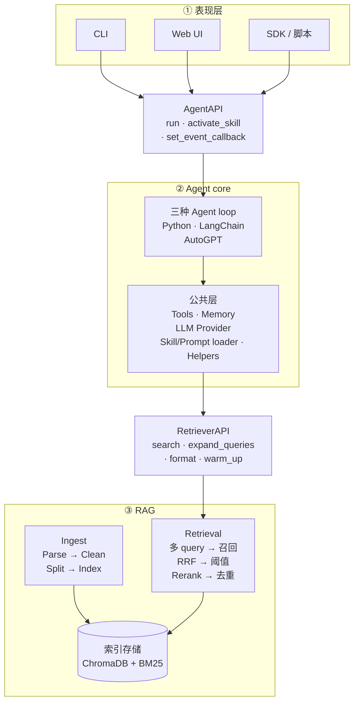

**设计要点**

- **三层职责清晰**：表现层只管 IO，Agent core 只管推理与工具，RAG 只管检索；任一层换实现不影响其它层。
- **两套接口隔离关注点**：`AgentAPI` 隔离表现层与 Agent，`RetrieverAPI` 隔离 Agent 与 RAG。
- **横向可替换正交于纵向分层**：LLM Provider / Embedding / Agent 都可通过配置切换，不影响接口契约。
- **三种实现共享公共层**：三种 Agent 实现共享 Tools / Memory / LLM Provider / Skill/Prompt loader 等公共能力。

## 1.3.两套接口

AgentA 模块间通过两套接口连接：

| 接口 | 边界 | API 简介 |
|---|---|---|
| `AgentAPI` | 表现层 ↔ Agent core | `run`：执行一次完整推理循环，返回最终回答<br/> `activate_skill`：手动注入 Skill 指令到当前会话<br/> `set_event_callback`：注册流式事件回调（思考 / token / 工具调用 / 最终回答） |
| `RetrieverAPI` | Agent core ↔ RAG | `search`：多 query 召回 + RRF 融合 + 阈值过滤 + Rerank，返回 `Hit` 列表<br/> `expand_queries`：把原 query 扩展为 Multi-Query / HyDE / 翻译三轴<br/> `format_search_results`：把 `Hit` 列表格式化为 LLM 可读文本<br/> `warm_up`：启动时预热 embedding 与 reranker 模型 |

详细签名见 [AgentAPI](#agentAPI) 与 [RetrieverAPI](#retrieverapi)


# 2.RAG
## 2.1.Ingestion

将异构本地文档（当前覆盖 PDF / DOCX / PPTX / XLSX / MD / HTML / TXT，可扩展）转换为可被多路检索的索引数据。

### 2.1.1.整体流程

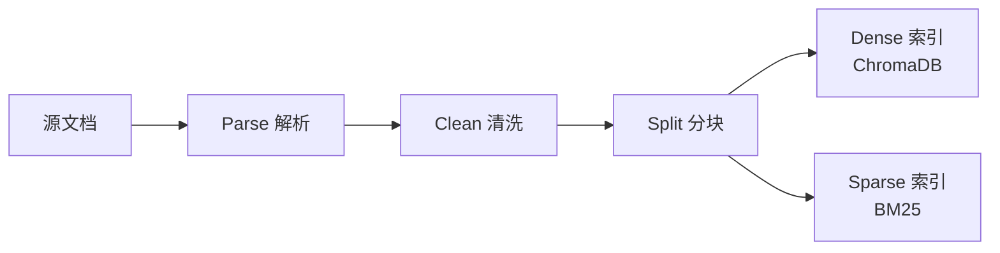

### 2.1.2.Parse解析

把多种异构格式统一抽象为"纯文本 + 页号/标题标记"（如 `[[PAGE:5]]`、`## 章节标题`）的中间表示，让下游 Clean、Split 不再做格式分支；新增格式只需补一个 parser，主链路零侵入。

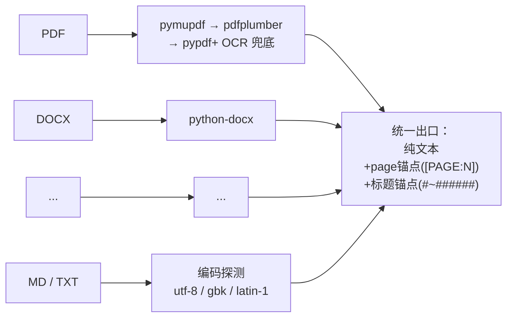

**设计要点**

- **多格式统一抽象 · 易扩展**：每种格式各走专用 parser，出口都收敛到同一形态——"纯文本 + 两类锚点"（`[[PAGE:N]]` 标记页号，`#~######` 标记章节标题）。下游 Clean 、 Split 对格式零感知，未来扩 EPUB / CSV / 邮件等只需新增一个 parser，不动后续链路。
- **结构信号显式注入文本**：HTML 的 h1~h6、DOCX 的 Heading 1~9、PPTX 的 title placeholder、XLSX 的 sheet name 全部在解析阶段翻译成 Markdown `#` 标题写进正文，PDF / PPTX 每页前插 `[[PAGE:N]]`——格式特有的结构信息被"语言化"到正文里，splitter 只需识别这两类锚点就拿到完整结构。
- **PDF 多后端递降**：pymupdf（最快、质量最优）→ pdfplumber（表格/分栏强）→ pypdf（兜底），任一可用且产文非空即采用，缺哪个库都不报错。
- **OCR 兜底是 Parse 子环节**：检测"平均每页字符数 < 阈值"自动触发 RapidOCR，调用方对扫描版/数字版 PDF 无感知。OCR 与 PDF 三后端均为软依赖，缺失时静默禁用而非崩溃。
- **文本编码自适应**：MD / TXT 按 utf-8 → gbk → latin-1 递降探测，兼容 Windows 中文环境与历史文件来源。

### 2.1.3.Clean清洗

剥离页眉页脚、版权声明、纯页码、跨页重复模板等"模板噪声"，避免高频片段污染向量空间与 BM25 IDF。

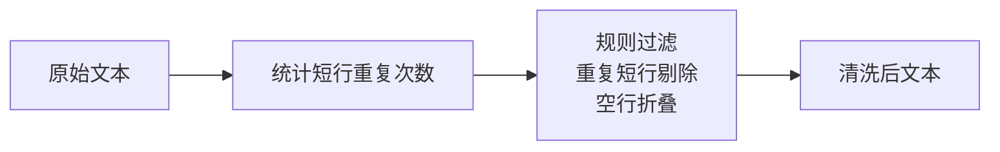

**设计要点**

- **两类噪声分开识别**：单行规则匹配（纯页码、`Page X of Y`、`1/32`、`©®™`、"版权所有"…）覆盖"长得就像噪声"；文档级跨页重复（出现 ≥ 5 次的短行，长度 ≤ 80 字符）覆盖"出现频率说明它是噪声"——两条互补，避免漏掉 PDF 页眉这类无固定模式的模板行。
- **解析层一次清洗 · 全格式覆盖**：所有 parser 出口统一清洗，下游对格式透明。
- **空行折叠**：连续多个空行被压缩为单空行，避免 chunk 内出现大段空白浪费 `chunk_size` 预算。
- **保留两类结构锚点**：`[[PAGE:N]]` 与 `# 标题` 行不在噪声规则覆盖范围内，确保 Split 阶段仍能拿到完整结构信号。

### 2.1.4.Split分块

把清洗后的纯文本切成"既不超长又保留语义边界"的 chunk，并把页号 / 标题层级显式带入下游可检索的 metadata。

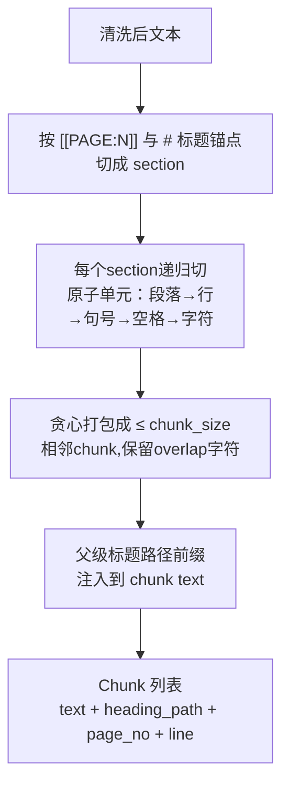

**设计要点**

- **递归回退优先级 · 不在词中间断**：段落(`\n\n`) → 行(`\n`) → 中英文断句(`。！？；./?/!`) → 空格 → 字符。前一级能真正切短文本就用它，全部失败才退化到字符级硬切——保证 chunk 边界尽量落在自然语义边界，不会把术语切成两半。
- **结构化分块元数据**：识别 `[[PAGE:N]]` 与 `#~######` 为切段点，同时维护 `(current_page, heading_stack)` 状态；每个 chunk 自动带上 `heading_path` / `page_no` / `line_start` / `line_end`，下游既可在工具结果里展示"来自 X 文件第 N 页 / 第几章"，也可做溯源跳转。
- **父级标题路径作为前缀注入正文**：把当前 chunk 所属的"父级标题链"（如 `# 第 5 章 物理层` → `## 5.2 子载波间隔`）以 Markdown 形式拼到 chunk 文本开头，与正文之间留空行。这样每个 chunk 自带"我在第几章 / 讲什么"的语义锚点——dense embedding 命中率显著提升，因为孤立短句被父级标题上下文化。
- **贪心打包 + overlap**：原子单元按 `chunk_size` 上限贪心拼接；相邻 chunk 间保留 `overlap` 字符尾巴防止跨边界语义被切断。若 overlap + 下一原子单元仍超长则放弃 tail，保证 chunk 永不超长。
- **标题前缀预算自适应**：正文 budget = chunk_size − 标题前缀长度，但有下限 `max(chunk_size/2, 64)` 防止"标题路径太深把正文挤掉"。
- **防递归不收敛**：分隔符只出现在文本末尾时（split 后只剩 1 个有效 piece），若把 sep 加回原文等于自身、递归调用栈不会收敛——检测到该情形自动跳到下一级 sep，避免 `RecursionError`。

### 2.1.5.ChromaDB（Dense 索引）

捕获语义相似度，让"5G 基站"能匹配"无线接入网络"这类语义近义表达。

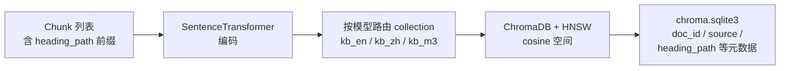

**设计要点**

- **多模型并存 · 分库存储**：每个 embedding 模型对应独立 collection——不同模型的向量维度天然不可比，必须分库。通过别名（`en / zh / m3`）切换默认模型，也支持多库并行召回再融合。
- **统一 cosine 空间**：ChromaDB + HNSW (Hierarchical Navigable Small World, 分层可导航小世界) 索引，统一使用 cosine 空间（与 BGE / MiniLM 等模型训练目标对齐，避免默认 squared L2 造成命中错位）。
- **存量库自动修正**：发现旧 collection 距离空间不是 cosine（如老数据用默认 L2 建的），ingest 时自动 drop & recreate，保证 ingest 与 retriever 的空间始终一致——避免"参数看似一样但底层错位"的隐性事故。
- **物理布局透明可溯源**：每个 collection 一个 UUID 目录存 HNSW 二进制文件，所有元数据集中在 `chroma.sqlite3`，可直接 SQL 查询溯源 doc_id / source / heading_path。
- **幂等增量**：以文件 `content_sha1` 驱动；未变化整文件跳过 re-embed，变化时先删旧 chunks 再写新，重复运行不产生重复或孤儿数据。

### 2.1.6.BM25（Sparse 索引）

捕获字面精确命中，解决 dense 模型对"无语义符号"的盲区——版本号、缩写、项目代号、命令名（如 `3GPP TS 38.211`、`CB014670`、`L2PS`），这些字符串没有可学习的语义，embedding 之后会被完全抹平。

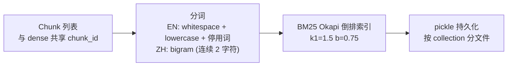

**设计要点**

- **与 dense 互补**：dense 强在语义近义、BM25 强在字面精确，两者通过 RRF 融合形成"语义 + 字面"双签到。
- **自实现 · 零外部依赖**：BM25 Okapi 公式 + 倒排索引 + pickle 持久化足够覆盖需求，无需引入 `rank_bm25` / Lucene 这类重量依赖。
- **混合分词**：英文走 whitespace + lowercase + 轻量停用词；中文走 **bigram**（连续 2 字符）——避免 `jieba` 30MB 词典依赖，且 RAG 场景下 bigram 召回率优于 unigram。
- **与 dense 共 chunk_id**：RRF 融合按 id 对齐的前提；缺这一条会退化为粗暴的跨尺度分数加权。
- **每 collection 一份索引**：按 collection_name 分文件持久化（`bm25_kb_en.pkl` 等），与 ChromaDB collection 一一对应，多语种 / 多模型并行不互扰。
- **按文件粒度可删**：以 `doc_id` 为索引键支持批量删除，与 ChromaDB 在 ingest 文件级 upsert 上行为对齐。

## 2.2.Retrieval

### 2.2.1.整体流程


### 2.2.2.Query rewrite

在检索前对用户原始 query 做语义/词汇扩展，提升召回鲁棒性。

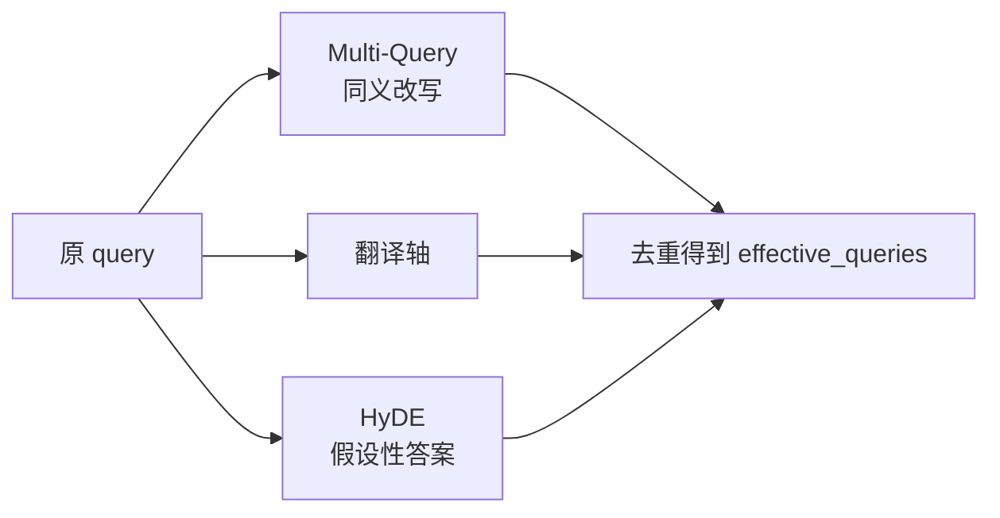

**设计要点**

- **三类策略各打一种盲区，可独立开关**：
  - *Multi-Query* 解决"同义 / 术语化"差异——把口语化或不规范的措辞替换成专业术语；
  - *HyDE*（Hypothetical Document Embeddings，假设性文档嵌入） 解决"口语 → 文档术语"的词汇分布差距，让 LLM 先编一段"假设性答案"作为额外检索 query；
  - *翻译轴* 解决"中文提问、英文文档"的跨语言失衡（dense 跨语言能力有限、BM25 跨语言完全失效）。
- **零侵入 · 静默降级**：query 改写定位为"锦上添花"层，LLM 调用失败时返回空、不打断主链路。
- **进程级 LRU (Least Recently Used, 最近最少使用) 缓存**：同一 query 二次命中零开销，避免重复花 LLM token。
- **不依赖 chat_history**：指代消解由上层 Agent 在 query 入参前自行完成；本模块对会话状态零耦合，便于独立测试与离线评估复用。

### 2.2.3.Hybrid Retrieval

在 Dense + BM25 双索引基础上，对多 query 并行召回结果做"同 collection 内分级融合 + 跨 collection 公平合并 + per-model 阈值过滤"。

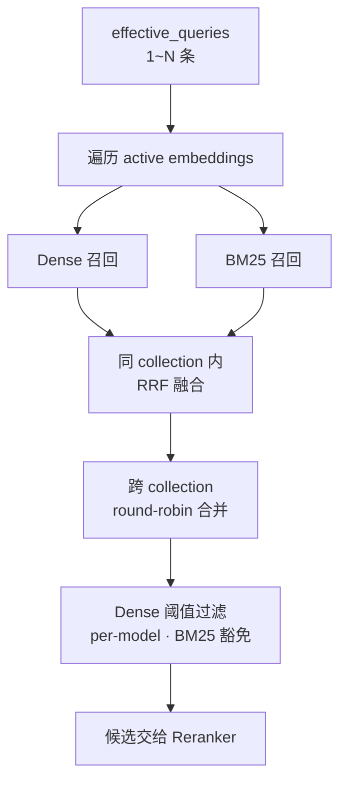

**设计要点**

- **RRF 而非分数加权**：Dense (cosine) 与 BM25 (Okapi raw) 分数尺度完全不可比，强行加权权重几乎不可调；RRF 只看"排第几"，天然解决跨尺度融合，多查询命中的 chunk 自然加权。
- **多 query 召回量自适应**：每条 query 的召回窗口随改写条数收缩，总候选量与单 query 一致——避免改写越多候选越爆炸、Reranker 被洪水冲垮。
- **跨 collection round-robin 合并**：不同 embedding 模型距离空间不同，直接按分数拼接会让某个模型的高分占满名额；round-robin 保证每个库公平出列。
- **Dense 阈值 per-model**：各模型同主题相似度分布差异显著（MiniLM 偏低、bge-zh 偏高），用单一全局阈值会一边误杀好结果、一边放进噪声——按 collection 分别校准。
- **BM25 命中豁免 dense 阈值**：BM25 是强字面信号，若被 dense 低分误杀，将失去"无语义符号"召回的全部价值。
- **检索器溯源**：每条 Hit 保留"由哪些检索器召回"的字段，下游可做差异化阈值策略，也便于评估与排查。

### 2.2.4.Cross-Encoder reranker

对 Bi-Encoder 召回的候选做二阶段精排，弥补"召回阶段双塔模型缺乏 token 级 query-doc 交互"的固有缺陷。

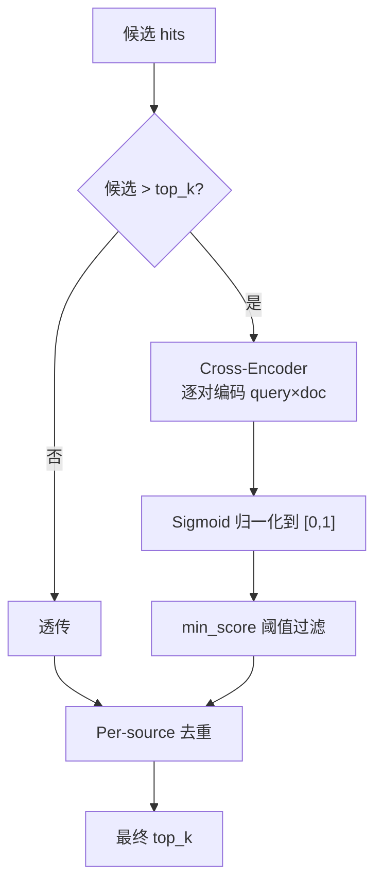

**设计要点**

- **Bi-Encoder + Cross-Encoder 两段式**：召回阶段双塔结构 query 与 doc 各自独立编码，能预算向量、毫秒级检索；精排阶段把 (query, doc) 拼起来过一次 Transformer 做 token 级交互，精度更高但代价 O(N)——故只对召回 top-N 跑。
- **候选 ≤ top_k 直接透传**：精排空间为零时跑 reranker 纯属浪费，前置短路。
- **多模型可切换 · 懒加载缓存**：默认 `bge-reranker-base`（中英双语），可一行配置切换更大/更轻量模型；按模型名缓存到进程，首次调用懒加载，切换模型不重启。
- **Sigmoid 归一化统一刻度**：不同 reranker 输出尺度天然不同（bge 近似概率、ms-marco 是 logit），统一过 sigmoid 后阈值 / 比较 / 展示用同一套尺度，切换模型不必同步调阈值刻度。
- **加载失败降级不崩溃**：模型缺失 / 网络不可达时返回召回前 top_k 条，主链路继续工作并 warning 给出修复指引（offline 开关、模型名拼写、备选轻量模型）。
- **Per-source 去重置后**：放在 reranker 之后保证"被去重的是真的低质重复"，而不是先按 source 限流再被精排选中——顺序颠倒会废掉一部分精排成果。

## 2.3.Evaluation

用"黄金集（golden set）"对当前 RAG 配置做端到端检索评估，输出指标 + 实验上下文，支撑离线调优、回归对比与 ablation 实验。

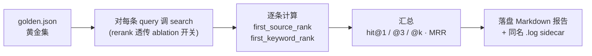

**指标矩阵**

| 指标 | 衡量什么 | 适用场景 |
|---|---|---|
| `hit_source@1` / `@3` / `@k` | 第 1 / 前 3 / 前 K 位是否命中"期望源文件" | 不同档位分别敏感于精排、短列表 UX、整体召回 |
| `hit_keyword@k` | top-K 内是否包含"期望关键词" | 关键词命中与位次弱相关，只看 @k 即可 |
| `hit_either@1` / `@3` / `@k` | 上述任一命中（更宽松）| 综合通过率，三档对齐 source |
| `MRR` | 第一次命中位置的倒数平均 | 衡量"是否早命中"（而非"是否命中"）|

**设计要点**

- **位置敏感的多档指标**：`hit@1` 对精排最敏感，`hit@3` 反映短列表 UX，`hit@k` 反映整体召回；单 `hit@k` 会掩盖召回与精排的不同贡献，三档并报让 ablation 实验能定位差异落在哪一层。
- **`first_source_rank` 与 `first_keyword_rank` 分开追踪**：两者由不同检索能力贡献（source 拼的是 ranking，keyword 拼的是内容覆盖），合并为单一 `first_hit_rank` 会让"source 排第 5 但 keyword 排第 1"这类信号丢失。
- **空目标自动剔除分母**：未标注 `expected_source*` / `expected_keywords` 的 case 不进入对应指标分母，避免"想留宽容评估却被惩罚"——比如纯靠 keyword 评估时不强求每个 case 都标 source 文件。
- **Results-first Markdown 报告**：字段顺序刻意按"核心指标 → 实验开关 → metadata → Miss 用例"排，打开报告第一屏即看到结果，调优时无需滚动；选 Markdown 而非 JSON，是因为评估输出的主要消费者是人（在 IDE 里 diff、贴到对比表），原始 case 列表对人工阅读价值低，放进 Miss 用例小节足够。
- **`.log` sidecar 收集 trace**：`-o report.md` 同时落盘 `report.md.log`，把每条 query 的 retriever 阶段日志（dense / bm25 / rrf / rerank / dedupe 各阶段候选数）落地，事后回溯 ablation 异常结果时无需重跑评估。终端默认仅打进度条与汇总（避免 INFO 倒灌进度行），`-v` 才把 INFO 抬到终端。
- **Metadata 全量留档**：报告头部序列化所有"影响结果的配置因子"（git commit + dirty 标志、LLM provider、active embeddings、KB chunk 实测数、reranker / dense 阈值 / BM25 / query 改写 / 切分参数），保证每次实验可追溯、可 diff、可复现。
- **KB chunk 数实测而非读配置**：直接查 ChromaDB `collection.count()`，因为 ingest 历史会让"配置里写的"和"真实落盘的"分叉——避免"配置看起来一样但 KB 已变"造成误判。
- **Ablation 通过 CLI 开关 + retriever 内层透传**：`--no-rewriter` 跳过 query 改写、`--no-rerank` 经 `search(rerank=False)` 强制关闭 retriever 内层 cross-encoder；报告同时记录"该组件最终是否真生效"（处理过静默降级路径），避免命令行参数与实际行为脱节。
- **Golden 集题型可分组**：每条 item 可选 `type` 字段（baseline / rerank / rewrite / hyde），便于做 per-type 统计——某组件只在自己擅长的题型上有增益时，全量指标会被稀释，按 type 拆分才看得见。


## 2.3.代码

### 2.4.1.文件职责速查

| 路径 | 角色 | 主要入口 |
|---|---|---|
| `src/rag/parser.py` | 多格式 → 纯文本（txt/md/html/pdf/docx/pptx/xlsx + OCR 兜底）| `parse_file(path)` |
| `src/rag/splitter.py` | 结构化分块（识别 Markdown 标题与 PDF 页号作为锚点，把父级标题路径作为前缀注入 chunk 文本）| `split_structured(text, ...)` |
| `src/rag/ingest.py` | 入库主流程（遍历目录 → parse → split → 双索引写盘 + 幂等增量）| `ingest_all(...)` · CLI `python -m src.rag.ingest` |
| `src/rag/bm25_index.py` | BM25 Okapi 自实现（倒排索引 + bigram 中文分词 + pickle 持久化）| `get_index(coll)` |
| `src/rag/query_rewriter.py` | 三轴 query 改写（Multi-Query / HyDE / 翻译轴），LRU 缓存包装 | `expand_queries(query)` |
| `src/rag/retriever.py` | 检索总枢纽：多 query × 多 collection × dense+bm25 → RRF → 阈值 → rerank → dedupe(去重）) | `search(query, ..., rerank=None)` |
| `src/rag/reranker.py` | Cross-Encoder 精排，输出统一 sigmoid 归一化到 [0,1] | `rerank(query, hits, top_k)` |
| `tools/rag_eval/runner.py` | 端到端检索评估（黄金集 → 指标 → Markdown 报告 + `.log` sidecar）| `python -m tools.rag_eval.runner` |
| `tests/test_rag.py` | 单元 + 集成测试（chunk / 阈值 / reranker / search 端到端）| `pytest tests/test_rag.py` |

### 2.4.2.两条主调用链

**生产路径**（Agent 在线检索）：

```
Agent 工具调用
  └─ src/agent/tools.py · _tool_search_knowledge
       └─ src/rag/query_rewriter.py · expand_queries(query)         ← 三轴改写
            └─ src/rag/retriever.py · search(query, queries=...)    ← 总枢纽
                 ├─ _query_collection(...)                          ← Dense 召回
                 ├─ _query_bm25(...) → bm25_index.get_index()       ← Sparse 召回
                 ├─ _rrf_fuse(...)                                   ← RRF 融合
                 └─ src/rag/reranker.py · rerank(...)               ← Cross-Encoder 精排
```

**评估路径**（离线 ablation）：

```
python -m tools.rag_eval.runner [--no-rewriter] [--no-rerank] [-o report.md] [-v]
  └─ tools/rag_eval/runner.py · main() → evaluate()
       ├─ [默认] src/rag/query_rewriter.py · expand_queries(query)  ← 可用 --no-rewriter 关
       └─ src/rag/retriever.py · search(query, queries=..., rerank=...)  ← rerank 透传 ablation
            └─ (dense + BM25 → RRF → 阈值 → rerank → dedupe，同生产路径)
       → 指标聚合（hit@1/@3/@k · MRR）
       → 落盘 Markdown 报告 + 同名 .log sidecar
```

### 2.4.3.推荐阅读顺序

**先读"主线"**，掌握"用户 query 进来后到底走了哪几步"：

1. `src/rag/retriever.py · search()` —— 整个 RAG 的"主函数"，看明白它就掌握了 80% 的检索逻辑。重点关注其中的阶段化日志（`[search]` 前缀），它是流程的天然导览。
2. `src/rag/reranker.py · rerank()` —— 短小，看完能理解 sigmoid 归一化与 score 字段语义。
3. `src/rag/query_rewriter.py · expand_queries()` —— 三轴改写如何各自降级、如何合并去重。

**再按需要往下钻**：

- 想优化召回质量 / 阈值 → `retriever.py` 的 dense 阈值过滤与 RRF 段
- 想加新文档格式 → `parser.py` 的 `parse_file()` 与各 `_parse_*` 私有函数
- 想调分块策略 → `splitter.py · split_structured()`
- 想加 / 改指标 → `tools/rag_eval/runner.py · evaluate()` 与 `_render_markdown()`
- 想理解入库幂等性 → `ingest.py · ingest_all()` 的 `content_sha1` 比对逻辑

### 2.4.4.常见改动落点

| 需求 | 改动文件 | 关键函数 / 配置 |
|---|---|---|
| 切换 embedding 模型 / 加新 alias | `src/config.py` | `EMBEDDING_MODELS` 字典；ingest 后自动新建 collection |
| 调 RRF / 阈值 / 去重 | `.env` | `RRF_K` / `RAG_DENSE_MIN_SCORE_*` / `RAG_K_PER_SOURCE` |
| 切换 reranker 模型 | `.env` | `RERANKER_MODEL` + `RAG_RERANK_MIN_SCORE`（统一 sigmoid 后仍需按分布微调） |
| 关闭某个改写轴 | `.env` | `RAG_QUERY_REWRITE_ENABLED` / `RAG_HYDE_ENABLED` / `RAG_TRANSLATE_QUERY_ENABLED` |
| Agent / 评估临时关 rerank | 调用方 | `search(..., rerank=False)`，无需改全局 config |
| 新增黄金集题目 | `tools/rag_eval/golden.json` | 字段 schema 见 `tools/rag_eval/runner.py` 顶部 docstring |
| 加新指标 | `tools/rag_eval/runner.py` | `EvalReport` 字段 + `evaluate()` 累加 + `_render_markdown()` 渲染 |


# 3.Agent

## 3.1. AgentAPI

`AgentAPI` 是**表现层 ↔ Agent core** 之间的接口，以 `@runtime_checkable Protocol` 定义于 `src/agent/agent_api.py`，三种 Agent（Python / LangChain / AutoGPT）通过 duck typing 满足。

| 项 | 说明 |
|---|---|
| `run` | 执行一轮推理，返回 LLM 最终回答；失败返回 `Error: <msg>` 不抛异常 |
| `activate_skill` | 注入 Skill 到 system_prompt；`True`=新激活、`False`=已激活 |
| `set_event_callback` | 设置统一事件回调（覆盖语义，传 `None` 清空） |

**事件协议（AgentEvent）** —— `src/agent/core/event_bus.py` 的 frozen dataclass，三字段 `type` / `payload` / `ts`。两种订阅方式：

- 简单：`agent.set_event_callback(fn)` —— 一个回调收所有 7 类事件，`fn` 收 `AgentEvent` 对象（含 `type` / `ts`）
- 高级：`agent.events.subscribe(EVENT_X, fn)` —— 按事件类型订阅，`fn` 仅收 `payload`

| event.type | payload | 触发时机 |
|---|---|---|
| `thinking_chunk` | `{text}` | Extended Thinking 流式 |
| `token_chunk` | `{text}` | 正文 token 流式 |
| `tool_call_start` | `{name, args, call_id}` | LLM 决定调用工具 |
| `tool_call_end` | `{call_id, status, preview}` | 工具返回（`ok` / `empty` / `error`） |
| `final_answer` | `{text, usage}` | 最终回答 |
| `error` | `{message, recoverable, phase}` | 运行时异常 |
| `info` | `{message, ...}` | session / skill 切换等元信息 |

## 3.2. RetrieverAPI

`RetrieverAPI` 是 **Agent core ↔ RAG** 之间的接口，以 **module-level 函数** 形式分布在 `src/rag/retriever.py` 与 `src/rag/query_rewriter.py`。

| 函数 | 说明 |
|---|---|
| `search` | 主入口；支持多查询并行（HyDE）与可选 reranker，返回 `list[Hit]` |
| `expand_queries` | LLM 查询改写（HyDE），返回原查询 + 扩展查询 |
| `format_search_results` | 把 hits 拼成可注入 prompt 的 markdown 字符串 |
| `warm_up` | 预热全部 collection，避免首查延迟 |

> **两套 API 风格刻意不对称**：`AgentAPI` 用 Protocol 类是因为 3 个实现并存，需 `isinstance` 校验任一实现没破契约；`RetrieverAPI` 仅 1 实现，按 Python 社区 idiom（`os.path` / `json` / `re` 风格）用 module 函数，未来出现第 2 个 retriever 实现时再升级为 Protocol。

## 3.3 Session 管理

会话状态由 `src/memory/chat_history.py:ChatHistoryStore` 持久化到 SQLite（`./sqlite_db/chat_history.db`），是 Agent 跨进程恢复上下文与跨 session 切换的唯一事实来源。

**表结构**

| 表 | 字段 | 用途 |
|---|---|---|
| `sessions` | `session_id` (PK) / `created_at` / `first_user_msg` / `prompt_name` | 会话元数据；`first_user_msg` 用于 list/搜索预览 |
| `messages` | `id` (PK) / `session_id` (idx) / `role` / `content` / `tool_calls` (JSON) / `tool_call_id` / `timestamp` | 消息全量；`tool_calls` 序列化为 JSON |

**Store API**（`ChatHistoryStore`）

| 方法 | 说明 |
|---|---|
| `append(session_id, msg, prompt_name="")` | 写入单条 message；首次写入自动创建 session 元数据 |
| `load(session_id)` | 全量加载 messages（按 id 升序），供 Agent 恢复上下文 |
| `load_last_n_messages(session_id, n)` | 仅取末尾 n 条，规避长 session I/O 开销 |
| `list_sessions(query=None, limit=None)` | 列出 session；`query` 按 id 前缀 OR `first_user_msg` LIKE（不区分大小写）过滤 |
| `set_prompt_name(session_id, name)` | 更新当前 session 关联的自定义 Prompt 名 |
| `clear / delete_session / clean_all_sessions` | 三档清理：当前重置 / 单 session 删除 / 全删 |

**CLI 命令约定**

按"单数=对一个对象 / 复数=对集合"原则拆分（[iter_2.md §4.9.1](iter_2.md#491-session-列表搜索恢复phase-11)）：

| 命令 | 行为 |
|---|---|
| `/sessions` | 列出全部 session（▶ 标记当前活跃），含相对时间（今天/昨天/N 天前/日期） |
| `/sessions <关键词>` | 按 id 前缀或首问内容过滤 |
| `/session <id>` | 切到指定 session，恢复 prompt + 全量历史，并打印末尾 2 条预览 |
| `/del-session <id>` | 删除指定 session（拒删当前活跃） |
| `/clean-session` | 清空全部 session（需 yes 二次确认） |

**演进点**：当前未做的 punt 列在 [iter_2.md §4.9.1 缺口表](iter_2.md#491-session-列表搜索恢复phase-11)，包括分页（>10K 时再做）、Session 命名/标签（[§5.1 C4](iter_2.md#5-future) 之后）、project 列（[Phase 1.2 Memory 三层](iter_2.md#473-实施顺序) 做时 ALTER TABLE 加列）、Chainlit 端同步（[§4.2 WebUI](#42webui) 一并处理）。


# 4.表现层

表现层负责"采集输入 → 调用 Agent → 渲染输出"三件事，按 IO 形态分为 CLI / Web UI / SDK 三种形态，全部通过 `AgentAPI` 与 Agent core 通信。

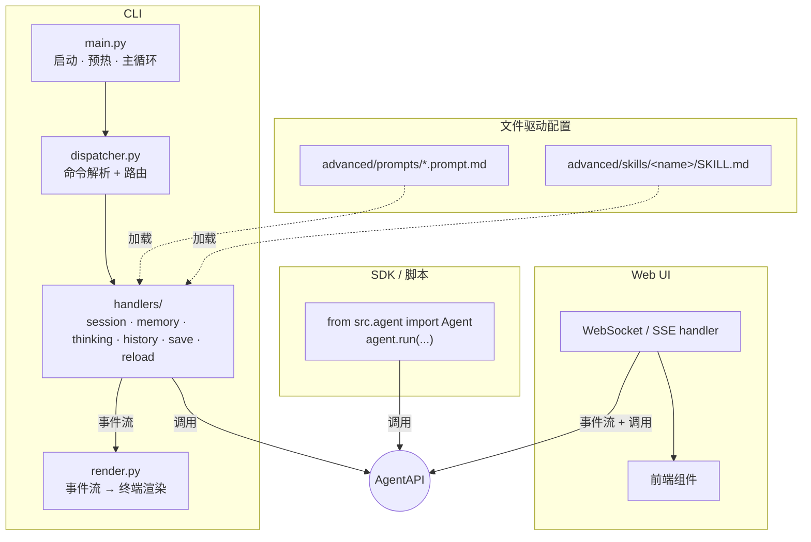

**设计要点**

- **三段分离**：命令解析（`dispatcher`）→ 业务处理（`handlers/`）→ 渲染（`render`）三段独立，替换 IO 形态时只换 render 段。
- **事件流驱动 UI**：handler 不直接 `print`，而是 emit `AgentEvent`；CLI 的 render 把事件转成终端流式输出，Web UI 直接转 WebSocket / SSE。
- **文件驱动配置**：Prompt 与 Skill 都用文件落地，启动时扫描 + 运行时 `/reload-*` 热更新；新增不需要改代码。
- **本期范围**：CLI 形态完成重构（命令解析 / handler / render 三段分离）；Web UI / SDK 留接口位，后续任务实现。

## 4.1.CLI

## 4.2.WebUI

## 4.3.SDK


# 5.IMP

三种 Agent 实现共享公共层，差异只在 loop 编排。每个实现都必须：

1. 满足 `AgentAPI` Protocol（duck-typed，不强制继承；定义在 `src/agent/agent_api.py`）
2. 用 `src/agent/core/` 提供的 helper 组装 loop，而不是重写 helper 内部逻辑
3. 至少 emit `final_answer` 与 `error` 事件；`thinking_chunk` / `token_chunk` 视 framework 能力可选

**公共层复用粒度**

| 共享组件 | 类型 | 职责 | Python | LangChain | AutoGPT |
|---|---|---|---|---|---|
| `tools.py`（工具实现） | 依赖 | 工具 JSON Schema 定义 + `execute_tool` 路由 + 各工具实现 | ✓ | ✓（StructuredTool 包装） | ✓ |
| `LLMProvider` | 依赖 | 多 provider chat + Extended Thinking + 流式 token 抽象 | ✓ | △（可选，framework 自带） | ✓ |
| `ChatHistoryStore` | 依赖 | session 内消息持久化与按 N 条加载（CRUD） | ✓ | ✓（adapter） | ✓ |
| `UserMemoryStore` | 依赖 | 跨 session 用户偏好 / 背景持久化（CRUD） | ✓ | ✓ | ✓ |
| `EventBus` | Helper | 统一流式事件分发（thinking / token / tool / final） | ✓ | ✓ | ✓ |
| `ToolCallEngine` | Helper | 工具调用编排：执行 + 结果格式化 + 引导提示注入 + 写历史 | ✓ | ✓ | ✓ |
| `HistoryManager` | Helper | 历史按轮截断 + skill_pair 完整性保护 + system 拼接 | ✓ | ✓ | △（用 summary 替代） |
| `MemoryManager` | Helper | UserMemory 触发判定 + 提取 + 注入 system_prompt | ✓ | ✓ | ✓ |
| `ThinkingPolicy` | Helper | adaptive thinking budget 估算（LOW / MED / HIGH 三档） | ✓ | ✓ | △（子任务不启用） |

> **类型说明**
> - **依赖**：底层能力，不感知 Agent loop 语义（turn / skill_pair / thinking budget），可独立测试与替换实现（如 SQLite → Postgres）。命名约定：数据存储用 `*Store` 后缀。
> - **Helper**：公共层抽象，封装"何时调依赖、如何编排结果"的业务策略，被三种 Agent 实现共享。命名约定：编排类用 `*Manager` / `*Engine` / `*Policy` / `*Bus` 后缀。

**代码组织**

公共层 helpers 统一放在 `src/agent/core/`，命名遵循上文"类型说明"约定：

```
src/agent/core/
├── __init__.py
├── history_manager.py        # HistoryManager
├── memory_manager.py         # MemoryManager
├── event_bus.py              # EventBus（含 EVENT_* 类型常量）
├── tool_call_engine.py       # ToolCallEngine（含 TOOL_EMPTY_HINT 常量）
└── thinking_policy.py        # ThinkingPolicy + ThinkingConfig 数据类
```

依赖层（`src/memory/chat_history.py` 的 `ChatHistoryStore` / `src/memory/user_memory.py` 的 `UserMemoryStore` / `src/llm/provider.py`）位置不动，被 helper 调用。

**实现进度**

- Python：本期落地，完成公共层抽取与对接；`Agent.events` 暴露 `EventBus` 实例供 UI 多订阅
- AutoGPT：持有 `events: EventBus` 与 `set_thinking/token_callback` 转发方法，接口对齐；流式事件 emit 视后续 LLM 调用是否接入
- LangChain：保留骨架代码，对接公共层放在后续任务（依赖环境 `langchain.agents.create_agent` 修复）


## Python 

## LangChain

## AutoGPT

