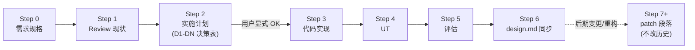

# 开发范式（Dev Paradigm）

> 本文记录 **AgentA 项目沉淀的 feature 开发流程与方法论**，目标读者：
>
> - 本项目后续 phase / feature 的实施者（人 / AI）
> - 新建 Agent / RAG / LLM 类项目时希望复用同套节奏的人
>
> 本文只写**做事顺序与协作模式**，不重复定义：
>
> - **代码 / 文件 / 命名 / 测试 / 错误处理 / 红线** —— 见 [`.cursor/rules/agenta-conventions.mdc`](../.cursor/rules/agenta-conventions.mdc)
> - **实现文档（`iter_X.md`）写作风格** —— 见 [iter_2_agent.md §4.9.0](iter_2_agent.md#490-实现文档风格)
> - **设计文档（`design.md`）写作风格** —— 见 [design.md §3.0](design.md#30-设计文档风格)
>
> 三者关系：本文回答 *"开发流程怎么走"*；`.mdc` 回答 *"代码 / 协作怎么做"*；§4.9.0 + §3.0 回答 *"两类文档怎么写"*。冲突时**本文 < `.mdc` < §4.9.0 / §3.0**（具体规约优先于通用流程）。

---

## 0. 适用范围

适用于以下任一情形：

- AgentA 本仓库新开一个 phase（`### 4.9.x <feature> (phase X.Y)`）
- AgentA 已有 phase 的**后期设计变更 / 路线切换 / 重大重构**
- 用同套"design + iter + .mdc + skill + tools/agent_eval"骨架另起新项目

不适用于：

- 一次性 bugfix（直接改 + UT + commit 即可，不必走完整流程）
- 探索式实验（写 notebook / scratchpad / `tools/sandbox/`，不入主流程）

---

## 1. 核心信条（Principles）

| # | 信条 | 说明 |
|---|---|---|
| 1 | **简洁 > 兼容 > 全面** | 项目偏好简洁；遇到"保留旧 schema 兼容" vs "删 DB 重建"时**默认问用户**而非默认兼容（详 [`.mdc` §6](../.cursor/rules/agenta-conventions.mdc)） |
| 2 | **决策外显** | 设计抉择不藏在代码注释，立 `D1 / D2 / D3...` 摆在 iter doc 决策表里，AI 用 `AskQuestion` 让用户拍板 |
| 3 | **三文档分工** | `design.md` 写"为什么这样"（rationale）/ `iter_X.md` 写"本期做了什么"（log）/ `SKILL.md` 写"LLM 运行时怎么用"（runtime）。不交叉、不复述 |
| 4 | **历史只追加，不改写** | 已完成 phase 的 Step 1-6 文档**不回头改**；新发现 / 变更走 **Step 7 patch 段落**，保留设计演进轨迹 |
| 5 | **UT ≠ 评估** | `tests/test_*.py` 是编码顺带（白盒 / mock LLM）；`tools/*_eval/` 是真 LLM 跑数据集（黑盒）。两套节奏、两套报告位置，不混（详 [`.mdc` §1.6](../.cursor/rules/agenta-conventions.mdc)） |
| 6 | **第 2 次复用才上 framework** | 第 1 次写 inline；第 2 次发现复用时抽 helper；从未上来就 framework 化（避免过度设计） |
| 7 | **可见性优先于巧妙** | LLM 看不到的 state 等于不存在；prompt 注入路径 / 当前 plan / skill 加载状态都要在 system prompt 或 tool 返回中**可见**，不能靠 LLM "猜" |
| 8 | **用户主权 > 系统默认** | 资源占用（context tokens / DB 写入 / 长流程触发）能交给用户显式控制就交给用户；与"零延迟智能"冲突时倾向前者（详 [§3.9.4 路线 C 案例](design.md#394-跨-session-状态可见性)） |

---

## 2. Phase 化迭代节奏（Step 0-6 + Step 7 patch）

每个 feature / phase 走同样的 7 步骨架。Step 0-6 在首次实施时**顺序**走；Step 7 仅在后期变更时**追加**。



### 2.1 每 Step 的边界与交付物

| Step | 输出 | 何时算完 | AI 必须问什么 | 反模式 |
|---|---|---|---|---|
| **0 需求** | 4 行表：用户故事 / 验收标准 / Scope / 依赖（详 [§4.9.0 Step 0 结构](iter_2_agent.md#490-实现文档风格)） | 用户点头 | 若涉及未知外部框架，先 ask"先讲原理 / 先扫现状 / 直接开始？" | 照抄早期想法当需求；写成实现视角（"实现 X 功能"） |
| **1 Review** | 现状表 + gap 列表（对照 Step 0 验收找缺口） | 缺口清单收敛 | — | 边摸底边给方案 → 剥夺用户判断空间 |
| **2 计划** | 决策表（D1 / D2... 每行：决策点 / 推荐 / 备选 / 理由）+ 实施步骤列表 + 影响位置表 | 每个 D 用户拍板 + 实施步骤认可 | 用 `AskQuestion` 选择题（不要让用户打字） | 默认替用户选；预设答案；摆决策矩阵但不等用户拍板 |
| **2 → 3 切换** | — | **用户显式 OK**（沉默 ≠ 同意） | "可以开始 Step 3 吗？" | 看到沉默就开写 |
| **3 编码** | 代码 + 同步 lint（`ReadLints` 0 错）+ `TodoWrite` 跟踪进度 | 全部 todos completed | 遇到 §6 决策边界时 ask | 一口气改十几个文件再统一 lint；漏改 `.env`/`tab_complete`/`HELP_TEXT` |
| **4 UT** | UT 数字（每文件 case 数） + 全量回归 pass 数 | `X passed, 0 failed, 0 regression` | — | 自己宣布"完成"而不给硬证据 |
| **5 评估** | `tools/*_eval/reports/<feature>-<ts>.md`（Markdown，**禁 JSON**） | 双阈值 pass（识别率 + 质量分） | 评估 case 必须**对照 Step 0 验收逐条**生成 | 评估指标跟 Step 0 脱钩自由发挥 |
| **6 design 同步** | `design.md` 对应章节更新 + `.mdc` / `SKILL.md` / `README.md` 三处必要同步 | `ReadLints` clean + 三文档无悬挂引用 | — | 只改 design 不改 skill；遗留历史代号 |

### 2.2 Step 7+ patch 段落（后期变更）

phase 关闭后出现的**设计路线变更 / 实施补丁 / 重要顺带修复**，**不修改原 Step 1-6 记录**，而是在 `### 4.9.x` 章节末尾追加：

```markdown
**Step 7 · <变更主题>（路线 A → C）**

<本变更目的的 1 段话>

| 维度 | 原方案 | 新方案 |
|---|---|---|
| ... | ... | ... |

**变更动机**：<触发本次重构的真实场景 / 用户反馈>

**实施改动**

| 改动 | 实现位置 |
|---|---|
| ... | ... |

**顺带修复**：<被本次变更副作用消除的旧 bug / 待办，cross-ref §4.13.1 编号>

**UT 全绿**：<硬数字>
```

为何要这种"加法式"维护：

- 保留**设计演进轨迹**（路线 A 为什么被否、什么场景下浮现 C 更优）
- 新读者能理解"代码现在长这样"是怎么来的，避免某天有人又"贡献"回路线 A
- 真实案例：[§4.9.7 Step 7（注入路线 A → C）](iter_2_agent.md#497-学习计划生成-phase-22)

---

## 3. 决策驱动设计（D1 / D2 模式）

### 3.1 何时立决策

| 触发信号 | 例 |
|---|---|
| 有 ≥ 2 条可行实现路径且各有 trade-off | "plan 状态寄生 messages vs 独立表" |
| 影响 schema / API / 用户可见行为 | "task status 用 success/failed/skipped 三态还是 success/skipped 二态" |
| 涉及用户主权（资源占用 / 自动化程度） | "active plan 自动注入 vs 手动 load" |
| 抽象层级 / framework 引入 | "judge_with_llm 写函数式 helper 还是 class" |

不立决策的：纯命名 / 行内逻辑 / 显然唯一答案的实现细节。

### 3.2 怎么呈现给用户

用 `AskQuestion` 工具**单选题模式**（多选谨慎用），每题：

```
Question DN: <一句话描述决策点>
A. <选项 1>
B. <选项 2>  ← 推荐
C. <自定义打字>
```

要点：

- **不预设答案**：哪怕"推荐"也要列 ≥ 2 备选 + 写明理由
- **选项 ≤ 4 个**：超过说明拆分不够正交，重新分组
- **避免要求打字**：提供"自定义"选项给用户拒绝既有路径用
- **批量呈现**：一次决策会 5-15 个 D 一起出，让用户一次审完

### 3.3 决策落档

| 落档位 | 内容 |
|---|---|
| `iter_X.md §x.x.x Step 2` 决策表 | D1-DN 全表，每行：决策点 / 用户选项 / 理由 / 影响位置（短） |
| `design.md §x.x` 章节正文 | 把已决策内容转写成"现状 + 不变量"语言，**不带 D 编号**（design 不是会议纪要） |
| 代码注释 | 仅当下一个读者会困惑时引一句 "`D5: ...`" 指向 iter doc，平时不引 |

---

## 4. 三文档分工

| 文档 | 视角 | 时态 | 内容回答 | 不该出现的 |
|---|---|---|---|---|
| `docs/design.md` | "Agent 怎么工作" | **现在时**（永恒视角） | 数据模型 / 不变量 / 设计抉择与理由 / 模块关系 / 评估方法 | "Phase X 完成 Y" / "本期实现" / 代码块 / 实施日志 |
| `docs/iter_X.md` | "本期做了什么" | **过去时 + 计划时** | Step 0-6 + Step 7 patch / 决策表 D1-DN / 改动位置 / UT 数字 / punt list | 业界对比 / 方案选型推理 / 用 design 应有的"为什么" 语言写实现日志 |
| `.agenta/skills/<name>/SKILL.md` | "LLM 怎么用我" | **指令式现在时** | 何时激活该 skill / 调哪些 tool / 反模式清单 / 用户呈现模板 | 实现细节 / 不变量 / DB schema |

### 4.1 单向引用规则

避免循环引用：

```
.mdc  ──► iter_X.md §4.9.0 / design.md §3.0   （操作指引指向风格权威）
iter_X.md ──► design.md                       （实施日志可引设计正名）
design.md ──► iter_X.md（仅 punt list / §4.13）（设计文档只引"哪些没做"）
SKILL.md  ──► design.md（rationale）/ tool 名（API）
```

`design.md` **不**反向引用 `iter_X.md` 的步骤细节（除 punt list 例外）；`SKILL.md` **不**引用 iter 的实施细节。

### 4.2 何时改哪份

| 改动 | design | iter | SKILL | `.mdc` | `.env` / config |
|---|---|---|---|---|---|
| 新 feature 上线 | ✓ 新增章节 | ✓ §4.9.x 全 Step | 可能新增 | — | 可能新增 |
| 现有 feature 的实现层重构（行为不变） | — | ✓ Step 7 段落 | — | — | — |
| 现有 feature 的**行为 / 用户接口**变更 | ✓ 改对应章节 | ✓ Step 7 段落 | ✓ 同步 LLM 指引 | 可能新增红线 | 可能 |
| 修复 bug | — | ✓ Step 7 简短 patch 注或 §4.13.1 RESOLVED 标注 | — | — | — |
| 发现项目级红线（不希望再犯） | — | — | — | ✓ 新增红线 | — |

---

## 5. 后期变更模式（详 §2.2 + 真实案例）

变更触发的典型链路：


要点：

- **不是"想改哪改哪"**，是**一条流水线**：每环节都有"对照源"（store 改了 → agent 必须改 → UT 必须改 → design 必须改）
- AI 用 `TodoWrite` 把上面 9 个环节作为 todo 项跟踪，缺一环都 in_progress 不结
- **顺带修复**机会要主动捞：路线切换可能恰好绕过某个历史 fixture bug / 隔离缺口，要顺手标 RESOLVED 而不是装看不见

---

## 6. 测试 + 评估二分

**严格分**（详 [`.mdc` §1.6](../.cursor/rules/agenta-conventions.mdc) + [§4.10 评估报告输出约定](iter_2_agent.md#410-评估报告输出约定)）：

| 维度 | UT (`tests/test_*.py`) | Eval (`tools/agent_eval/<feature>/`) |
|---|---|---|
| 跑什么 | mock LLM / DB / 网络 | 真 LLM 跑 dataset |
| 何时跑 | 每次编码顺带（pre-commit / CI） | 每次 phase 结束 + 设计变更时 |
| 报告位置 | 终端 `passed/failed` 计数 | `tools/agent_eval/reports/<feature>-<ts>.md` |
| 报告格式 | — | **Markdown 强制，禁 JSON** |
| 判据 | `X passed, 0 failed` | 双阈值（识别率 + 质量分） |
| 出现于 | iter doc Step 4 | iter doc Step 5 + design.md "评估方法" 表 |
| 失败处理 | 编码不通过 | 报告 + 用户决策是否调阈值 / 改 prompt / 改 dataset |

新 feature 必须**两套都有**；只有 UT 没 Eval = "我相信我的实现对" 缺乏外部锚点。

### 6.1 LLM-judge framework

主观评估（plan 质量 / 答案质量 / 学习计划合理性）走通用 helper [`tools/agent_eval/judge/llm_judge.py`](../tools/agent_eval/judge/llm_judge.py)：

- 第 1 次：写 inline
- 第 2 次：抽 helper（兑现信条 #6）
- 接口：`judge_with_llm(prompt, output, criteria, role_intro) -> JudgeResult`
- 软失败：单 case judge 失败不阻断 batch；返 `score=None` + reason

新评估场景接入同接口即可，不应改 helper 本身。

---

## 7. 反过度抽象 + YAGNI

| 场景 | ❌ 过度 | ✅ MVP |
|---|---|---|
| 数据字段预留 | `learning_tasks` 先加 SRS 字段 `srs_ease / srs_interval` 等占位 | 不留；Phase 2.4 真要做 SRS 时 `ALTER TABLE` 加（SQLite 廉价） |
| 抽象层 | 第 1 次写 LLM-judge 就建 `JudgeBase / JudgeRegistry / @judge` 装饰器 framework | 直接 `def _llm_judge_xxx(...): chat(...)` inline 50 行；第 2 次再抽 |
| 配置项 | 题型混合比例 / 难度梯度 / 重试次数 全做成 env 可调 | 写死合理默认（如 60% MCQ + 40% short_answer）；用户报反对再参数化 |
| 命令 | 立刻提供 `/study load`, `/study unload`, `/study reload`, `/study pin`, `/study mute` 全集 | 只提供必需的 `/study load`；不提供 `unload`（新 session 即清空）/ `delete`（用 `abandon` 软删） |
| 评估 | 一次盖 RAG / Agent / Skill / Plan / Quiz 6 维度评估器 | 一个 phase 配一个 evaluator + 一个 dataset |

判定准则：**当下用得到才写**。"将来可能用" = 不写；"将来一定用且现在写成本最低" = 可写但要 cross-ref 后续 phase。

---

## 8. Phase 收尾 Checklist

每个 phase / Step 7 patch 收尾前对照：

- [ ] **代码**：所有 todos completed；`ReadLints` 0 错
- [ ] **UT**：全量回归 pass，给硬数字（含本次 phase 新增数）；0 regression
- [ ] **Eval**：双阈值 pass；报告落 `tools/*_eval/reports/<feature>-<ts>.md`
- [ ] **`.env`**：新 config 项三处同步（`src/config.py` + `.env.example` + `.env`，详 [`.mdc` §5.1](../.cursor/rules/agenta-conventions.mdc)）
- [ ] **CLI**：新命令同步到 `src/cli/ui.py` HELP_TEXT + `src/cli/tab_complete.py`
- [ ] **`design.md`**：对应章节改 / 加；§3.5.2 注入顺序变化要更新；§5 IMP 公共层表要更新
- [ ] **`iter_X.md`**：§4.9.x 全 Step 回填 / 加 Step 7；§4.13.1 / §4.13.2 punt list 同步
- [ ] **`SKILL.md`**：LLM 行为指引同步；反模式清单更新
- [ ] **`.mdc`**：若发现项目级红线 / 新借喻禁区 / 新决策边界，回填
- [ ] **`README.md`**：§1.2 一句话 bullet 同步（新 feature 时）

---

## 9. 反模式（违反 = 必须修正）

继承 [`.mdc` §8 红线](../.cursor/rules/agenta-conventions.mdc)，本文额外补充流程层：

- ❌ Step 2 → Step 3 时**没等用户显式 OK** 就开写代码
- ❌ Step 7 patch 直接**改写** Step 1-6 历史描述（应追加而非覆盖）
- ❌ 设计变更只改 `design.md` 不改 `iter_X.md`（丢失变更动机记录）
- ❌ 设计变更只改 `design.md` 不改 `SKILL.md`（LLM 仍按旧契约行事）
- ❌ 设计变更只改代码不改 UT（默认行为反转后 UT 仍按旧行为断言会自然过，**反向掩盖 bug**）
- ❌ 抽 helper 时**只在新代码用**，没回头改原 inline 调用方（导致同等逻辑两套实现）
- ❌ 看到全量回归"顺带消除某条 punt"时**不主动标 RESOLVED**（积累陈年信息债）
- ❌ 用户问 A，AI 顺手做 B（scope 蔓延，详 [`.mdc` §6](../.cursor/rules/agenta-conventions.mdc)）
- ❌ 在 iter / design / .mdc 三份都重复同一规则（违反"单向引用 + 不重复定义"）

---

## 10. 新项目复用清单

若要 fork 这套范式到新项目：

**必须复制 + 改名的骨架**

| 源文件 | 目标 | 改什么 |
|---|---|---|
| `.cursor/rules/agenta-conventions.mdc` | `.cursor/rules/<your-project>-conventions.mdc` | 把"AgentA 工程"换成你的项目名；§2 文件命名按你的目录布局改；§8 红线按你的痛点改 |
| `docs/design.md` 框架（§1 整体架构 + §3.0 风格 + §5 IMP） | `docs/design.md` | 章节名留架构骨架，删 §3.x 业务章节空出来 |
| `docs/iter_X.md` 框架（§4.9.0 风格 + §4.13 punt list） | `docs/iter_1.md` | 留风格 / punt 框架，§4.9.x 全删 |
| `docs/dev_paradigm.md`（本文） | 直接拷贝 | 改 §0 适用范围里的项目名 / 删 §10（本节）|
| `tools/agent_eval/judge/` | 同位置 | 不改；通用 helper 第 2 次复用就抽出来用 |
| `tests/conftest.py` + pytest.ini | 同位置 | 按新项目目录改 import path / marker |

**应**新建：

- `docs/iter_1.md`（首期 Step 0 起步）
- `.env` / `.env.example`（按新项目的 config 项）

**不要**复制：

- 业务代码（`src/agent/` / `src/cli/` / `src/memory/` 都是 AgentA 特化）
- AgentA 历史 phase 的 §4.9.x 内容（新项目从 §4.9.1 重新写）
- `chroma_db/` / `sqlite_db/` 等运行时数据

**首期建议**：

- 先走 phase 1 = "项目骨架 + 一个最小可跑通路径"（参照 AgentA [§4.9.1 Session 管理](iter_2_agent.md#491-session-管理-phase-11) 的颗粒度，不要一上来做太大）
- Step 0 用户故事必须从 **真实使用场景** 出发，不能是 "实现 X 模块"
- 第 1 个 phase 严格按 Step 0-6 走一遍，校准节奏；第 2 个 phase 起可以根据项目特征适度裁剪（但 Step 0 / Step 2 用户决策环节不可省）

---

## 附录：本项目真实案例索引

| 想看 | 案例锚点 |
|---|---|
| 完整 Step 0-6 范例 | [§4.9.4 引用展示 (phase 1.4)](iter_2_agent.md#494-引用展示-phase-14) |
| Step 7 patch 段落（设计路线变更） | [§4.9.7 Step 7（注入路线 A → C）](iter_2_agent.md#497-学习计划生成-phase-22) |
| 决策表 D1-DN | [§4.9.7 Step 2 决策表](iter_2_agent.md#497-学习计划生成-phase-22) |
| 三路线对比 + 取舍表（设计抉择） | [design.md §3.9.4 跨 session 状态可见性](design.md#394-跨-session-状态可见性) |
| LLM-judge 第 2 次复用抽 helper | [§4.9.7 Step 6 LLM-judge framework](iter_2_agent.md#497-学习计划生成-phase-22) |
| punt list 维护 + RESOLVED 标记 | [§4.13.1 #20](iter_2_agent.md#4131-deferred-backlog暂时不做) |
| 反过度设计的 status 枚举决策 | [design.md §3.9.1 数据模型 "任务 status 枚举"](design.md#391-数据模型) |
| 顺带修复历史 bug | [§4.9.7 Step 7 "顺带修复"段](iter_2_agent.md#497-学习计划生成-phase-22) |
