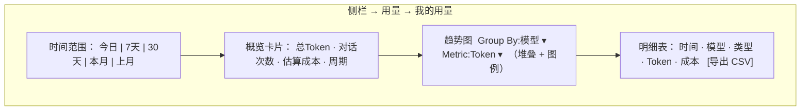
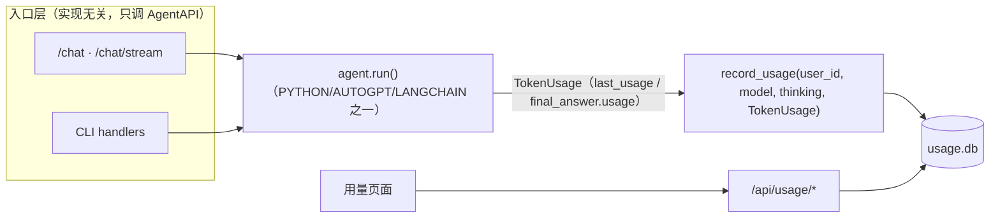

# iter_11 · Token 用量统计

> 本期目标：给 AgentA 加一套**每用户独立**的 token 用量统计，参考 Cursor 的 Usage 页面。
> 本文从**用户视角**写需求——用户看到什么、怎么用——再补一节落地设计。

---

# 1. 背景

AgentA 已是多用户系统（iter_6）：每人有自己的会话、记忆、学习数据，还能各自选模型 / 开关 thinking（§8.6）。每次对话背后是一次或多次 LLM 调用，每次调用都消耗 token（`prompt_tokens` / `completion_tokens`）。

现状：token 只在单次 `Agent.run()` 内被累计成 `last_usage`，对话结束就丢了——**没有落库、没有页面、没有按用户汇总**。用户不知道自己用了多少，admin 也看不到全局消耗，无法回答"谁用得多""哪个模型烧得快""这个月一共多少 token"。

参考 Cursor 的 Usage 页面，本期补齐这块能力。

## 1.1 和 Cursor 的异同（定调）

Cursor 是付费产品，页面核心指标是**钱**（Spend / Included / On-demand）。AgentA 接的多是国产直连或本地 / 免费额度模型，**没有真实账单**。所以：

- **核心指标改成 token 和次数**，"花费"降级为**可估算的「估算成本」**——按每模型可配置单价（每 1M token 的输入 / 输出价）粗算，仅供横向对比，不等于真实账单；没配单价的模型不显示成本。
- 其余照搬 Cursor 的信息架构：概览卡片 + 时间范围切换 + 趋势图（可按模型 / 按指标切换）+ 明细表 + 导出 CSV。
- **每用户独立**是硬要求：普通用户只看自己的；admin 多一个"看全员、按用户分组"的视角。

---

# 2. 用户怎么用（需求主体）

## 2.1 谁能看什么

| 角色 | 能看到的范围 |
|---|---|
| 普通用户（user） | **只有自己**的用量：自己的 token、次数、按模型/按天的分布、自己的明细与导出 |
| 管理员（admin） | 自己的之外，额外有「全员用量」视角：所有人的合计、**按用户分组**排行、可下钻看某个用户；以及**单价配置** |

一句话：**普通用户管好自己那本账，admin 多一本全员的总账（外加定价权）**。越权看别人用量 = 拿不到（和 iter_6 的数据隔离一致）。

## 2.2 入口（对齐当前代码结构）

> 上一版把入口放在「设置」页里是不对的。当前代码（截至 `langchain/autogpt 支持 UI`）里，**功能页都是侧栏顶层视图**（`ViewKind`：聊天 / 知识库 / 记忆 / 规则 / Skills / MCP / 学而时习），而「设置」只装账户与系统配置。用量是个常看的仪表盘，**应作为侧栏顶层视图**，与知识库 / 记忆并列，而不是塞进设置。

具体落点（`frontend/src/components/sidebar/Sidebar.tsx`）：

- 在侧栏视图区新增一个 `ViewNavButton`「用量」（图标用 `BarChart3` / `Activity` 之类），**所有登录用户可见**（不像 Skills / MCP 那样 admin-gated）。
- 新增 `ViewKind` 取值 `'usage'`；`App.tsx` 里 `activeView === 'usage'` 渲染 `UsageView`。
- `UsageView` 内部用**标签页（Tabs）**承载多视角，按角色显示：

| 标签 | 谁可见 | 内容 |
|---|---|---|
| 我的用量 | 所有人 | 本人用量（默认标签） |
| 全员用量 | 仅 admin | 全站用量，按用户分组 |
| 单价配置 | 仅 admin | 维护各模型单价（详 §4.3） |

> 为什么不用 admin-gated 的侧栏按钮：普通用户也要看「我的用量」，所以按钮本身全员可见；admin 专属内容收在标签里按 `isAdmin` 显示，和设置页内 admin 分区的既有做法一致。

## 2.3 「我的用量」长什么样

从上到下四块，对齐 Cursor：

### (1) 概览卡片（顶部）

一行卡片给当前所选时间范围的总数：

| 卡片 | 含义 |
|---|---|
| 总 Token | 本范围内 prompt + completion 的总 token |
| 对话次数 | 本范围内的对话轮次（一次 `Agent.run()` 记一条；含多轮工具调用，详 §3 口径） |
| 估算成本 | 按各模型单价粗算的合计；未配单价的部分标注"部分模型无单价" |
| 周期 | 仿 Cursor 的"本月""重置日"，默认按自然月统计 |

### (2) 时间范围选择器

一排快捷按钮：`今日(1d)` / `近 7 天(7d)` / `近 30 天(30d)` / `本月(MTD)` / `上月`，对齐 Cursor。切换后下面三块全部联动刷新。

### (3) 趋势图

- **X 轴**：按天；**Y 轴**：可在指标下拉里切：`Token` / `对话次数` / `估算成本`（对齐 Cursor 的 "Metric: Spend"）。
- **分组**：下拉切 `按模型`（默认）/ `不分组`（对齐 Cursor 的 "Group By: Model"）。按模型时是**堆叠面积/柱图**，每个模型一种颜色，下方图例列出模型名。
- 图上标出"今天"参考线。

### (4) 明细表 + 导出

逐条记录（= 逐次对话，详 §3）的列表，列对齐 Cursor 的表：

| 列 | 含义 |
|---|---|
| 时间 | 该次对话发生时间 |
| 模型 | 模型显示名（如 `Claude Opus 4.8`），带能力档位徽章（`max`/`high`/…，复用 `ModelConfig.tier`） |
| 类型 | 普通 / Thinking（该次是否开了 Extended Thinking） |
| Token | 该次 prompt + completion（鼠标悬停拆开看 prompt / completion） |
| 估算成本 | 该次估算（无单价显示 `—`） |

- 表头右上角 **导出 CSV**（对齐 Cursor 的 Export CSV）：导出当前时间范围、当前筛选下的**明细**。
- 支持分页 / 懒加载（明细量可能很大）。
- 可选筛选：按模型筛。

### 「我的用量」线框

## 2.4 「全员用量」标签（仅 admin）

结构和「我的用量」一致，差别在**多一个「按用户」维度**：

- 概览卡片：全站合计。
- 趋势图的 Group By 多一个选项 `按用户`（对齐 Cursor team 视图里的 User 维度）。
- 多一块**用户排行表**：每个用户一行（用户名 · 总 Token · 对话次数 · 估算成本），可排序，点某用户**下钻**到他的明细。
- 明细表多一列 **用户**（对齐 Cursor 明细表里的 "User" 列）。

## 2.5 典型使用场景（验收用例的来源）

| 场景 | 用户操作 | 期望 |
|---|---|---|
| 看本月用了多少 | 点侧栏「用量」，默认本月 | 概览卡片显示本月总 token / 对话次数 |
| 看哪个模型最烧 | 趋势图 Group By 模型 | 堆叠图里某模型面积最大，一眼看出 |
| 看 thinking 贵不贵 | 明细表按"类型"看 | Thinking 行的 token 普遍更高 |
| 导出做报表 | 选近 30 天 → 导出 CSV | 下到一份含时间/模型/token/成本的 csv |
| admin 看谁用得多 | 全员标签 → 用户排行 | 按 token 降序，top 用户在最前 |
| admin 改单价 | 单价配置标签改某模型价 → 保存 | 成本卡片/列按新价重算 |
| 普通用户越权 | 普通用户直接调全员/单价接口 | 403，看不到别人 |

---

# 3. 指标定义（口径，避免歧义）

| 指标 | 定义 | 来源 |
|---|---|---|
| prompt_tokens | 输入（含 system / 历史 / 工具结果）token | 本次 run 累计 `usage.prompt_tokens` |
| completion_tokens | 模型输出 token | 本次 run 累计 `usage.completion_tokens` |
| total_tokens | 上两者之和 | 计算得出 |
| 对话次数 | **一次 `Agent.run()` 记 1 条**（= 用户一问一答，内部可能含多轮工具调用 / 多次底层 LLM 请求） | 每次 run 结束记一条 |
| 估算成本 | `prompt/1e6 × in_price + completion/1e6 × out_price`，单价按模型配置；无配置则不计入成本（但 token 照常计） | 单价表 + 计算 |
| 类型 | 该次 run 是否开了 thinking | run 时的 thinking 偏好 |

口径约定（关键，关系到三实现兼容，见 §4.1）：

- **以「一次对话（一次 `run()`）」为最小记录单位**，不是"逐次底层 LLM 调用"。原因：三种实现里只有 PYTHON / AUTOGPT 是逐次走 `provider.chat()` 能拿到 per-call usage；**LangChain 不走 `provider.chat()`**（自建 ChatModel，usage 从消息的 `usage_metadata` 汇总），拿不到统一的 per-call 粒度。取「per-run」作为三者**唯一一致**的口径。
- 一次 run 内模型 / thinking 固定（请求级 contextvar 在该 run 内不变），所以 per-run 记录的「模型 / 是否 thinking」维度准确。**已知小瑕疵**：若该模型开 thinking 时会切到专用思考模型（如 `deepseek-chat`→`deepseek-reasoner`、`glm-4-flash`→`glm-4.6`），记录的是基础模型 id；本期接受此近似。
- thinking 的"思考 token"各 provider 口径不一（部分计入 completion，部分不单列）；本期**不单独拆思考 token**，只标"是否 thinking"，避免给出不可靠的细分。
- 只记**拿到 usage 的 run**；若 provider 未返回 usage（极少数兼容层 / 异常），token 记 0 但仍记 1 条（标注 usage 缺失，可选）。

---

# 4. 落地设计

## 4.1 数据从哪来：三实现的公共路径

这是本期最关键的设计点。三种 Agent 实现拿 token 的方式并不一致：

| 实现 | LLM 调用方式 | usage 来源 |
|---|---|---|
| PYTHON（`Agent.run`） | 逐次 `provider.chat()` / `call_with_thinking()` | 每次 response 的 `usage`，run 内累加 |
| AUTOGPT（`autogpt_agent`） | 同上，逐次 `provider.chat()` | `_accumulate_usage(response)` 累加 |
| LANGCHAIN（`langchain_agent`） | **自建 ChatModel（`build_chat_model`），不经 `provider.chat()`** | `_sum_usage(messages)` 读 `usage_metadata` 汇总 |

所以"在 `provider.py` 放唯一采集点"对 LangChain **无效**（它根本不进 `provider.chat()`）。

**真正的公共路径是 run 收尾时的 `TokenUsage`**——三者都满足这两件事：

1. 都把本次 run 的累计 usage 赋给 `agent.last_usage`（`AgentAPI` Protocol 约定字段）；
2. 都在结束时 `bus.publish(EVENT_FINAL_ANSWER, payload={"text", "usage": TokenUsage|None, ...})`。

于是采集点选在**驱动 `agent.run()` 的入口层**（与具体实现无关，它们只认 `AgentAPI`）：

采集所需的三要素，入口层都已有（iter_6 / iter_10 已铺好）：

- 用户：`current_user_id()`（请求级 contextvar）。
- 模型 / thinking：`config.current_active_model()` / `config.current_thinking_override()`（本 run 的生效值）。
- TokenUsage：流式从 `final_answer` 事件 payload 取（Web 流式 / CLI 都已订阅）；非流式从 `agent.last_usage` / run 返回路径取。

落点（公共、去重）：

- **`src/api/routes/chat.py`**：`/chat`（非流式）与 `/chat/stream`（流式）在 `with use_user(...) / use_llm_prefs(...)` 块内、run 结束后调 `record_usage(...)`。两路由抽一个公共 helper，避免重复。
- **`src/cli/handlers.py`**：CLI 已读 `agent.last_usage` 打印 token，在同处补一行 `record_usage(...)`（`AUTH_ENABLED=false` 时落到 `DEFAULT_USER_ID`）。

这样**三种实现零改动**（不碰 `provider.py` / 三个 agent 文件），只在 2~3 个实现无关的入口加采集，天然覆盖全部实现 + CLI。

> 旁路约束：`record_usage` 只读 contextvar + 一条 insert，**异常只记日志、绝不抛**，不拖慢、不影响对话主链路。

## 4.2 存储

新增独立 SQLite（和 iter_6 分库风格一致，便于单独备份 / 清理），路径配置 `USAGE_DB_PATH`（默认 `./sqlite_db/usage.db`）。单表，**一次 run 一行**：

| 表 `usage_events` | 字段 | 说明 |
|---|---|---|
| id | INTEGER PK | |
| user_id | INTEGER NOT NULL | 归属用户（索引） |
| created_at | INTEGER/TEXT | run 结束时间（索引，按天聚合用） |
| model_id | TEXT | 本 run 生效模型 id（如 `claude-opus-4-8`） |
| thinking | INTEGER(0/1) | 本 run 是否 thinking |
| prompt_tokens | INTEGER | run 内累计 |
| completion_tokens | INTEGER | run 内累计 |
| total_tokens | INTEGER | |
| session_id | TEXT NULL | 便于按会话排错 / 关联 |

索引：`(user_id, created_at)`、`(created_at)`（全员视图）。

> 估算成本**不存**，查询时按当前单价表实时算——单价会调整，存死了会失真。

## 4.3 单价配置（UI 可配，仅 admin）

成本只是「估算」，单价必须好改且不写死在代码里。设计成**带默认值 + admin 可在 UI 覆盖**，两段式（对齐 iter_6 系统配置的 overrides 思路）：

1. **内置默认**：`config.py` 里 `MODEL_PRICING_DEFAULTS`（每 1M token 的 `(input, output)`），按下文实时查到的公开价填好；覆盖 `MODEL_CONFIGS` 里全部模型。
2. **运行时覆盖**：admin 在「单价配置」标签里改的值写进 overrides（文件 `./sqlite_db/usage_pricing.json` 或 usage.db 一张 `pricing` 表），读取时 `默认 ← 覆盖` 合并。改完即时生效，不重启。
3. **币种**：`USAGE_CURRENCY`（默认 `$`，即下表的 USD）。国产厂商按 ¥ 公布的价，默认值里已折算成 USD（约 ¥7.1/$）；admin 可在 UI 改成任意值，所见即所填币种。免费 / 本地模型默认 0。

「单价配置」标签 UI：**按 provider 分组列出当前支持的所有模型**（数据来自后端把 `MODEL_CONFIGS` + 现价吐给前端），每行两个输入框（输入价 / 输出价）+ 档位徽章，顶部一个币种符号，底部「保存」。

### 默认单价表（USD / 1M token，输入 → 输出；2026-06 公开价快照，admin 可改）

| Provider | 模型 id | 输入 | 输出 | 备注 |
|---|---|---|---|---|
| Moonshot Kimi | `kimi-k2.5` | 0.55 | 2.95 | 官网 ¥4/¥21 折算 |
| Moonshot Kimi | `kimi-k2.6` | 0.95 | 4.00 | |
| 通义千问 | `qwen3.5-flash` / `qwen3.5-flash-2026-02-23` | 0.05 | 0.40 | 阶梯价，取低档 |
| 通义千问 | `qwen3.5-plus-2026-04-20` / `qwen3.5-plus-2026-02-15` | 0.12 | 0.69 | 阶梯价，取低档 |
| 通义千问 | `qwen3.5-27b` / `qwen3.5-35b-a3b` | 0.10 | 0.40 | 估算 |
| 通义千问 | `qwen3.5-122b-a10b` | 0.20 | 0.80 | 估算 |
| 通义千问 | `qwen3.5-397b-a17b` | 0.40 | 1.20 | 估算 |
| DeepSeek | `deepseek-v4-flash` / `deepseek-chat` | 0.14 | 0.28 | `deepseek-chat` 现映射 V4 Flash |
| DeepSeek | `deepseek-v4-pro` | 0.44 | 0.87 | 促销价（标准价 1.74/3.48） |
| 智谱 GLM | `glm-4-flash` / `glm-4.5-flash` / `glm-4.7-flash` | 0 | 0 | Flash 系列免费 |
| 智谱 GLM | `glm-4.5` | 0.30 | 0.30 | 估算（不分输入输出） |
| 智谱 GLM | `glm-4.6` | 0.70 | 0.70 | 官网 ¥5/¥5 折算 |
| 智谱 GLM | `glm-5.1` | 0.70 | 2.00 | 估算 |
| MiniMax | `MiniMax-Text-01` | 0.20 | 1.10 | 估算 |
| MiniMax | `MiniMax-M2` | 0.30 | 1.20 | |
| MiniMax | `MiniMax-M2.7-highspeed` | 0.60 | 2.40 | highspeed 翻倍 |
| MiniMax | `MiniMax-M3` | 0.30 | 1.20 | 估算（最新 M 系） |
| Anthropic Claude | `claude-sonnet-4-5` / `claude-sonnet-4-6` | 3.00 | 15.00 | |
| Anthropic Claude | `claude-opus-4-7` / `claude-opus-4-8` | 5.00 | 25.00 | |
| OpenAI | `gpt-4o` | 2.50 | 10.00 | |
| OpenAI | `gpt-5.3-codex` | 1.75 | 14.00 | |
| OpenAI | `gpt-5.4` | 2.50 | 15.00 | <272K 档 |
| Google Gemini | `gemini-2.5-flash-lite` | 0.10 | 0.40 | 标 free，默认可填 0 |
| Google Gemini | `gemini-2.5-flash` | 0.30 | 2.50 | 标 free，默认可填 0 |
| Google Gemini | `gemini-3.1-flash-lite` | 0.25 | 1.50 | 标 free，默认可填 0 |
| Google Gemini | `gemini-3.5-flash` | 0.50 | 3.00 | 估算，标 free |
| xAI Grok | `grok-3-latest` | 1.25 | 2.50 | Grok 3 已退役→现价随 4.3 |
| Ollama 本地 | `qwen2.5:7b` | 0 | 0 | 本地无 API 费 |

> 说明：标 free 的 Gemini / GLM-Flash 默认价给的是其付费档公开价，方便部署方"想算就算"；若该部署确实走免费额度，admin 在 UI 把它改 0 即可。标"估算"的是公开页未直接给该具体 id、按同系/同档推的近似值。所有数字均可被 admin 覆盖。

页面在"有成本"和"无成本"两种部署下都要正常：单价全 0 / 缺失时，成本卡片 / 列显示"未配置单价"，趋势图 Metric 仍可选 token / 对话次数。

## 4.4 API

新增 `src/api/routes/usage.py`，全部要登录（`get_current_user`）：

| 方法 | 路径 | 谁 | 说明 |
|---|---|---|---|
| GET | `/api/usage/summary` | 本人 | 概览卡片：传 `range`，返总 token / 对话次数 / 估算成本 |
| GET | `/api/usage/series` | 本人 | 趋势图：传 `range` + `group_by`(model/none) + `metric`，返按天序列 |
| GET | `/api/usage/events` | 本人 | 明细表：分页，按时间倒序，可按 model 筛 |
| GET | `/api/usage/events.csv` | 本人 | 导出 CSV（同筛选） |
| GET | `/api/usage/admin/summary` | admin | 全员合计 |
| GET | `/api/usage/admin/series` | admin | 全员趋势，`group_by` 多 `user` |
| GET | `/api/usage/admin/users` | admin | 用户排行（每用户合计） |
| GET | `/api/usage/admin/events` | admin | 全员明细（带 user 列），可按 user_id 下钻 |
| GET | `/api/usage/pricing` | 本人 | 当前单价（默认 ← 覆盖 合并）+ 币种 + 模型元数据，给前端算成本/渲染单价表 |
| PUT | `/api/usage/pricing` | admin | 保存单价覆盖（`require_admin`） |

- 普通用户的 `/api/usage/*` 一律**强制按 `current_user.id` 过滤**，不接受传别人的 user_id。
- `admin/*` 与 `PUT pricing` 走 `require_admin`，普通用户访问 → 403。
- `GET pricing` 普通用户也可读（前端要拿单价把成本算出来展示），但只读。
- `range` 取 `1d/7d/30d/mtd/last_month`，后端解析成起止时间，口径统一。

## 4.5 前端

- 侧栏新增「用量」视图按钮（`ViewKind: 'usage'`，全员可见），`App.tsx` 路由到 `UsageView`。
- 新增组件（`frontend/src/components/usage/`）：
  - `UsageView`（容器：Tabs「我的用量 / 全员用量(admin) / 单价配置(admin)」+ 时间范围）。
  - `UsageSummaryCards`、`UsageChart`（堆叠面积/柱，复用现有图表方案）、`UsageTable`（分页 + 导出）。
  - `PricingSettings`（admin：按 provider 分组的单价编辑表 + 保存）。
- 走现有 `api/client.ts`（带 cookie、401 跳登录）。
- 模型显示名 / 徽章复用 `ModelConfig.label` / `tier`（后端 `GET /api/usage/pricing` 一并下发模型元数据，前端不必硬编码模型列表）。

## 4.6 改动清单

| 层 | 文件 | 改动 |
|---|---|---|
| 配置 | `src/config.py` + `.env.example` | 新增 `USAGE_DB_PATH` / `USAGE_CURRENCY` / `MODEL_PRICING_DEFAULTS` |
| 存储 | 新增 `src/memory/usage_store.py` | `UsageStore`：写一条、按范围聚合、明细分页、按用户排行、单价覆盖读写、`delete_all_for_user` |
| 采集 | 新增 `record_usage()`（usage_store 内）+ `src/api/routes/chat.py` + `src/cli/handlers.py` | **公共入口层**调用，三实现零改动、不碰 `provider.py` |
| 级联 | `src/api/routes/admin.py` / 注销流程 | 删用户时连带清其 usage（接 iter_6 §8.5） |
| API | 新增 `src/api/routes/usage.py` + `src/api/schemas/usage.py` | 上表端点（含 pricing 读写） |
| 前端 | 新增 `components/usage/*` + `Sidebar.tsx`（加视图按钮）+ `App.tsx`（路由 `'usage'`）+ `ViewKind` | 页面 + 入口 + 单价配置 |
| 测试 | `tests/test_usage_store.py` / `test_api_usage.py` | 记录、聚合口径、隔离、admin 门禁、导出、三实现均能落库、pricing 覆盖 |

---

# 5. 边界与约定

- **隐私 / 隔离**：用量属于"个人数据"，按 iter_6 口径独享；注销 / 删号时连带清掉本人 usage。普通用户拿不到任何他人用量。
- **不影响主链路**：采集是旁路，异常只记日志不抛；高并发下轻量写（单条 insert + 库自带锁，和现有 store 一致）。
- **三实现兼容**：采集在实现无关的入口层、以 per-run `TokenUsage` 为公共口径，PYTHON / AUTOGPT / LANGCHAIN 全覆盖且都零改动（详 §4.1）。
- **CLI / 关认证**：`AUTH_ENABLED=false` 时全部落到 `DEFAULT_USER_ID`，CLI 用量也照记，行为等同单用户。
- **成本仅供参考**：明确标注"估算，非真实账单"；单价由 admin 维护，默认值为 2026-06 公开价快照，会过时。
- **思考 token 不细分**：本期只标类型，不拆思考 token（口径不可靠，留待后续）。

---

# 6. 验收要点

| 编号 | 操作 | 达标标准 |
|---|---|---|
| U1 记录 | 用户对话一轮（含工具调用） | usage.db 增加 1 条，user_id / model / token 正确 |
| U2 三实现 | 分别在 PYTHON / AUTOGPT / LANGCHAIN 下各对话一轮 | 三者都各落 1 条且 token > 0（验证公共路径覆盖 LangChain） |
| U3 概览 | 点侧栏「用量」选本月 | 卡片总 token = 明细合计；对话次数对得上 |
| U4 趋势按模型 | Group By 模型 | 堆叠图按模型分色，图例齐全，切日期范围联动 |
| U5 指标切换 | Metric 切 token / 对话次数 / 成本 | 图表 Y 轴随之变；无单价时成本项给出提示而非报错 |
| U6 明细+导出 | 明细分页 + 导出 CSV | CSV 列与表一致，行数匹配当前范围 |
| U7 隔离 | A、B 两用户各自看用量 | 互不可见；A 看不到 B 的任何记录 |
| U8 admin 全员 | admin 看「全员」 | 用户排行 / 全员合计正确；可下钻某用户 |
| U9 单价配置 | admin 改某模型单价并保存，刷新页面 | 覆盖生效、持久化；该模型成本按新价重算 |
| U10 门禁 | 普通用户调 `/api/usage/admin/*` 或 `PUT /api/usage/pricing` | 403 |
| U11 级联清理 | 删除某用户 | 其 usage 记录一并清空 |
| U12 不挂主链路 | 故意让记录写入失败 | 对话仍正常返回，仅日志告警 |

---

# 7. 实现决策记录（落地版）

> 实现阶段的关键决策与取舍，遵循"先按业内标准做法"原则。代码已按下表结论落地，测试见 `tests/test_usage_store.py` / `tests/test_api_usage.py`（均通过）。

| 编号 | 决策点 | 结论 | 理由 / 业内依据 |
|---|---|---|---|
| D1 | 采集落点 | 在**入口层**经 `final_answer` 事件抓 per-run `TokenUsage`（Web=`chat.py` 两路由的 `event_callback`；CLI=读 `agent.last_usage`），**不碰 `provider.py`** | LangChain 自建 ChatModel 绕过 provider，provider 非公共点；三实现都在 `run()` 末发 `EVENT_FINAL_ANSWER` 带 usage（已核对三处源码）。在边界统一埋点 = 业界网关式采集，**对三实现零侵入** |
| D2 | 统计粒度 | 以**一次 `agent.run()`** 为最小记账单元（"对话次数"） | LangChain 把多次 LLM 调用聚合成一个 usage，无法稳定拆"单次调用"；per-run 是三实现唯一一致粒度 |
| D3 | 模型/thinking 来源 | 落库直接用路由算好的 `effective_llm_prefs`（`active_model`/`thinking_enabled`）；CLI 回落 `current_active_model()`/`THINKING_ENABLED` | contextvar 不随线程池传播，跨线程读有时序坑；用已算好的值最稳 |
| D4 | 时间存储 | `created_at` 存 epoch 秒（INTEGER），区间 `>= ? AND < ?`；按天用 `strftime(...,'unixepoch','localtime')`；建 `(user_id,created_at)`/`(created_at)` 索引 | 数值区间查询快、可移植；按用户本地时区切天符合直觉 |
| D5 | 成本计算 | 后端**实时算、不落库**；`summary/series/users` 内部先按 model 粒度算成本再 rollup | 单价会变，存死会失真；先 model 再 rollup 保证 group_by=模型/用户/合计 成本都正确 |
| D6 | 未知单价处理 | 范围内出现"无内置单价"的模型时返回 `has_unpriced=true`，前端提示而非报错 | 成本是估算，缺价应降级提示、不应中断展示 |
| D7 | 单价存储 | 两级合并：默认 `config.MODEL_PRICING_DEFAULTS`（2026-06 公开价快照，国产 ¥ 折算 USD）← admin 覆盖（`usage.db: model_pricing`）；`PUT` 仅接受已知模型 id | 默认随代码走、可审计；覆盖可热改、持久化；过滤未知 id 防脏写 |
| D8 | 图表方案 | 趋势图用**纯 SVG 堆叠柱状图**（`TrendChart.tsx`），零三方库 | 现有前端无 recharts 等；不为单页面扩大依赖面 |
| D9 | 单例 + 测试注入 | `UsageStore` 用 `get_shared_store()` 进程单例；读写命中同一实例；测试用 `reset_shared_store_for_testing()` 注入临时库 | 与其它 store 一致；写（`record_usage`）与读（依赖）同源，免 dependency_overrides |
| D10 | 旁路保护 | `record_usage()` try/except 吞异常仅 `logger.warning` | 用量采集**永不影响对话主链路**（验收 U12） |
| D11 | 级联清理 | `admin.purge_user_data()` 加 `get_usage_store().delete_all_for_user(uid)`；自助注销 `DELETE /api/auth/me` 复用 | 用量属个人数据，删号即清，符合 iter_6 隔离口径 |
| D12 | total 缺失兜底 | `record_usage` 中 `total<=0/None` 时回落 `prompt+completion`（review 修复） | 部分 provider 不回总数，避免"有输入输出却存 total=0" |
| D13 | CSV 安全 | 导出对以 `= + - @` 开头的文本单元格前缀 `'`（review 修复） | 防 CSV 公式注入（OWASP 推荐） |
