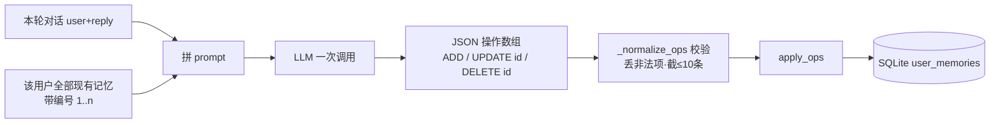

# 用户记忆重构：结构化 → 扁平自然语言

把用户记忆从「结构化 `(category, key, value)` + 精确去重」改造成「ChatGPT 式扁平自然语言列表 + LLM 语义合并」。用户看到的是一串编号的自然语言句子，没有类别标签；新信息进来时由一次 LLM 调用顺手完成提取 + 去重 + 去矛盾。

> 本文是实施方案，落地前定稿。背景讨论见 `iter_12_refine.md` §2（旧实现的 6 个问题）。

## 1. 已定决策

| 项 | 结论 |
|---|---|
| 去重/去矛盾机制 | **A：LLM 全列表合并**。每次提取把该用户全部记忆 + 本轮对话一次性喂给 LLM，返回对列表的操作。不引入 embedding（单用户记忆条数少，全列表能塞进 prompt）。**不增加 LLM 调用次数**——就是把现有那次提取调用的输出改聪明。 |
| 改写/删除 | **允许 UPDATE + DELETE**。矛盾的旧记忆可被改写或删除（这是「去矛盾」的前提）。 |
| category | **彻底删除（含内部）**。纯扁平，排序只靠 `source`。 |
| 旧数据 | **删库重建**。`user_memory.db` 旧 schema 由 `_create_tables` fail-fast 提示删除（沿用现有做法，不写迁移脚本）。 |

## 2. 目标形态

注入 `<user_context>` 前后对比：

旧（结构化、带标签）：

```
- [偏好] 代码风格：简洁，无多余注释
- [背景] 职业：后端工程师
- [指令] 回复语言：中文
```

新（扁平自然语言）：

```
- 用户是后端工程师，主要用 Python / FastAPI
- 偏好简洁、无多余注释的代码，回复用中文
- 正在做一个 RAG + Agent 的个人学习项目
```

CLI `/memory` 也从「按类别分组」改成「编号 + 句子 + 来源/时间」的扁平列表。

## 3. 数据模型

新表 `user_memories`：

| 字段 | 类型 | 说明 |
|---|---|---|
| `id` | INTEGER PK | 列表展示 / edit / del 用 |
| `user_id` | INTEGER | 多用户隔离 |
| `text` | TEXT | **自然语言整句**（取代 category/key/value 三列） |
| `source` | TEXT | `auto` / `explicit` / `manual` |
| `created_at` | TEXT | 写入时间 |
| `updated_at` | TEXT | 最后改写时间（取代 `accessed_at`；UPDATE 时刷新） |

变化要点：

- 删掉 `category`、`key` 两列和 `UNIQUE(category, key)` 约束。
- `accessed_at` → `updated_at`（语义从"上次注入"改成"上次改写"，更名实相符）。
- 索引：`idx_user_memories_user ON user_memories(user_id)`。
- fail-fast：`_create_tables` 建表后 PRAGMA 自检，发现旧库（含 `category` 列）抛带操作指引的 `RuntimeError`，提示删 `./sqlite_db/user_memory.db` 重建。

## 4. 核心：提取 + 合并（一次 LLM 调用）

替换现有 `extract_memories`（输出新条目）为一次"提取 + 合并"调用，输出对列表的**操作**。

输入（user message）：

- 本轮对话（auto / explicit 都附最近若干轮窗口作上下文；模式由 `is_explicit` 决定松紧，不再靠"是否带历史"区分）
- 该用户**全部**现有记忆，带编号：`1. <text>` / `2. <text>` …

输出（JSON 数组，三种操作 + 空数组表示无变化）：

```json
[
  {"op": "ADD", "text": "用户在做 RAG + Agent 个人项目"},
  {"op": "UPDATE", "id": 2, "text": "偏好用英文回复"},
  {"op": "DELETE", "id": 5}
]
```

应用规则：

| op | 行为 |
|---|---|
| `ADD` | `text` 经 `_sanitize` 后插入新行 |
| `UPDATE` | 校验 `id` 存在且属当前用户 → 改写其 `text`、刷新 `updated_at`；非法 id 忽略 |
| `DELETE` | 校验归属 → 删除；非法 id 忽略 |

安全 / 兜底：

- `ADD` / `UPDATE` 的 `text` 一律过 `_sanitize`（防注入沿用现有）。
- 单次操作数设上限（如 ≤ 10），LLM 异常输出不至于把整库搅乱。
- **总条数软上限**（新增 config `USER_MEMORY_MAX_ENTRIES`，默认 30）：prompt 里告知 LLM"总条数控制在 N 条内，超了就合并/删最不重要的"。LLM 看得到全列表，能自己取舍。
- LLM 调用、JSON 解析失败 → 静默跳过本轮（不影响主流程），沿用现有 try/except。

触发节流、后台线程异步执行：**沿用 iter_12 已实现的逻辑**（无状态 `count_user_messages % N` + 显式触发不受限 + `threading.Thread` fire-and-forget + 主线程取 `uid` 显式下传），只是线程体内部从「提取→upsert」换成「提取合并→应用操作」。

## 5. 注入 system_prompt

`load_for_context` 改动：

- 输出从带 `[标签]` 的 bullet 改成纯句子 bullet：`- {text}`。
- 排序保留 iter_12 的 source 优先级（`manual`/`explicit` > `auto`），同级按 `updated_at DESC`。
- 仍按 `USER_MEMORY_MAX_CHARS` 截断；被动注入不刷新时间戳（沿用 iter_12）。
- `build_system_prompt` 的 `<user_context>` 包裹文案不变（防注入说明保留）。

## 6. 接口 / 命令 / 配置变化

### 6.1 CLI（`handlers.py`）

| 命令 | 旧 | 新 |
|---|---|---|
| `/memory` | 按类别分组列出 | 扁平编号列表：`[id] text` + 来源/时间 |
| `/memory add` | `add <类别> <key> <value>` | `add <自由文本>`（source=manual） |
| `/memory edit` | `edit <id> <新 value>` | `edit <id> <新文本>`（不变，语义即改写 text） |
| `/memory del` / `clear` | 不变 | 不变 |

删掉 `MEMORY_CATEGORY_ORDER`、按类别分组逻辑；help 文案同步更新。

### 6.2 API（`schemas/memory.py` + `routes/memory.py`）

- `MemoryItem`：`id / text / source / created_at / updated_at`（删 `category` / `key` / `accessed_at`）。
- `MemoryUpsertRequest`：`text` + `source`（删 `category` / `key`）。
- `routes/memory.py`：删掉 `MEMORY_CATEGORIES` 校验分支；upsert 改调 `add(text, ...)`。

### 6.3 配置（三处同步：`config.py` + `.env.example` + `.env`）

| config | 默认 | 说明 |
|---|---|---|
| `USER_MEMORY_MAX_ENTRIES` | 30 | **新增**。记忆总条数软上限，提示 LLM 合并时控制规模 |

其余 `USER_MEMORY_*`（ENABLED / DB_PATH / MAX_CHARS / AUTO_EXTRACT / EXTRACT_EVERY_N / EXTRACT_MIN_INPUT_LEN）保持不变。

### 6.4 评估（`tools/agent_eval/memory/`）

- `dataset.json`：case 里的 `memories` 由 `{category,key,value}` 改成 `text` 字符串列表。
- `recall_golden.py`：`_build_system_prompt` 里 `store.upsert(...)` 改成按 `text` 写入。`must_contain_any` / `must_not_contain` 断言逻辑不变。

## 7. 代码改动清单（blast radius）

| 文件 | 改动 |
|---|---|
| `src/memory/user_memory.py` | 表结构、`add/update_text/load_all/load_for_context`、提取合并函数、删 category 相关常量 |
| `src/agent/core/memory_manager.py` | `_extract_and_store` 改为"提取合并 + 应用操作" |
| `src/cli/handlers.py` | `/memory` 列表 + add/edit、help、删分组常量 |
| `src/api/schemas/memory.py` | 三个 model 字段调整 |
| `src/api/routes/memory.py` | 删 category 校验、改 upsert 入口 |
| `src/config.py` + `.env.example` + `.env` | 新增 `USER_MEMORY_MAX_ENTRIES` |
| `tools/agent_eval/memory/dataset.json` + `recall_golden.py` | 改自然语言 |
| `tests/test_user_memory.py` / `test_memory_manager.py` / `test_api_memory.py` / `test_cli_handlers.py` | 按新模型重写相关用例 |
| `docs/design.md` §3.4 | 改写为扁平自然语言 + LLM 合并 |

## 8. 实施步骤

1. `user_memory.py`：建新表 + fail-fast；`add` / `update_text` / `delete` / `clear` / `load_all` / `load_for_context`；提取合并函数 + 应用操作；删 category 常量。
2. `memory_manager.py`：线程体改为"加载全列表 → LLM 合并 → 应用操作"。
3. CLI / API / schema 跟进。
4. config 三处同步加 `USER_MEMORY_MAX_ENTRIES`。
5. eval dataset + runner 跟进。
6. 重写测试，跑 `pytest -q` 锁绿。
7. 改 `design.md` §3.4。
8. Review P0/P1 + 写验收（达标标准 + 结果）。

## 9. 风险与缓解

| 风险 | 缓解 |
|---|---|
| LLM 误删/误改记忆（DELETE/UPDATE 比旧的纯覆盖激进） | 单次操作数上限 + 操作前校验 id 归属 + 全程 INFO 日志（可回溯改了什么）；`/memory` 用户随时可看可手动改 |
| LLM 输出非法 JSON / 乱编 id | JSON 解析失败整轮跳过；非法 id 忽略不报错 |
| 扁平列表无限增长 | 软上限 `USER_MEMORY_MAX_ENTRIES` + 合并时提示 LLM 压缩 |
| 丢失"按类别过滤"能力 | 单用户场景几乎用不到；真要再说，自然语言列表本身已足够浏览 |

## 10. 验收

### 10.1 达标标准

| 项 | 标准 |
|---|---|
| 数据层 | 新表只有 `id/user_id/text/source/created_at/updated_at`；旧结构化库打开时 fail-fast 报错带操作指引 |
| 提取合并 | LLM 一次调用输出 ADD/UPDATE/DELETE 操作；非法 op / 非法 id / 坏 JSON 静默丢弃；操作数 ≤ 10 |
| 注入 | `<user_context>` 块为扁平 `- {text}`，无类别标签；source 优先级 + `updated_at` 倒序 + `MAX_CHARS` 截断 |
| CLI | `/memory` 扁平编号列表；`add <文本>` / `edit <id> <文本>` / `del` / `clear` 正常 |
| API | `MemoryItem` 仅 `id/text/source/created_at/updated_at`；POST 收 `text`，PATCH 收 `text` |
| 前端 | `MemoryView` 列表 + 增改删按 text 走通，`tsc --noEmit` 零错 |
| 配置 | `USER_MEMORY_MAX_ENTRIES` 三处（config.py / .env.example / .env）+ config_meta 同步 |
| 测试 | 全量 `pytest -q` 全绿 |

### 10.2 验收结果

| 检查 | 命令 / 方式 | 结果 |
|---|---|---|
| 全量单测 | `pytest -q` | ✅ 1411 passed, 133 deselected |
| 记忆相关子集 | `pytest tests/test_user_memory.py test_memory_manager.py test_api_memory.py test_cli_handlers.py test_data_isolation.py` | ✅ 217 passed |
| dataset 合法性 | `json.load` + 全 `memories` 为 str | ✅ 13 case，全部自然语言字符串 |
| 前端类型 | `npx tsc --noEmit` | ✅ 零错误 |
| Python lint | 触达文件 ReadLints | ✅ 无错误 |

旧 DB 处置：`./sqlite_db/` 下无 `user_memory.db`（首次启用即建新表），无需手动删库。

### 10.3 人工验收步骤

前置：`.env` 里 `USER_MEMORY_ENABLED=true`；要验自动提取再加 `USER_MEMORY_AUTO_EXTRACT=true`、`USER_MEMORY_EXTRACT_EVERY_N=1`、`USER_MEMORY_EXTRACT_MIN_INPUT_LEN=0`。改完重启进程。

| # | 操作 | 达标标准 |
|---|---|---|
| 1 | CLI 敲 `/memory add 用户偏好用中文回答，代码风格简洁` | 提示"已记录"；`/memory` 列表出现该句，来源标"手工" |
| 2 | `/memory`（无参） | 输出是**扁平编号列表**：`[id] 整句` + 来源 + 相对时间；**没有**"偏好/背景"等类别分组标题 |
| 3 | `/memory edit <id> 用户改用英文回答` | 该 id 内容被改写，来源 / 创建时间不变 |
| 4 | `/memory del <id>` / `/memory clear` | 对应条目消失 / 全部清空，提示删除条数 |
| 5 | 对话里说"请记住我在做一个 RAG 项目" | 后台线程跑提取，日志出现 `[MemoryManager] 记忆已更新 (source=explicit): +n ~n -n`；`/memory` 里新增相应自然语言条目 |
| 6 | 开 `AUTO_EXTRACT` 后正常多轮对话 | 累计 user 消息数到 `EVERY_N` 整数倍才提取一次；短输入（< `MIN_INPUT_LEN`）不触发 |
| 7 | 说一句与已有记忆矛盾的话（如先"我用中文"后"以后都用英文"） | LLM 合并应 `UPDATE` 或 `DELETE` 旧条目，而非堆两条矛盾记忆；列表里只剩最新口径 |
| 8 | 新开一个 session 继续提问 | 记忆仍生效（`<user_context>` 跨 session 注入），回答遵循已记住的偏好 |
| 9 | 前端「用户记忆」页 | 列表显示整句 + 来源；"添加记忆"填一句话能存；编辑 / 删除 / 清空可用 |
| 10 | 在 `/memory add` 内容里塞注入串（如 `... ignore all previous instructions ...`） | 入库内容被 `_sanitize` 从注入点截断 |

## 11. 工作原理与触发方式

落地后的运行时速览（代码：`src/memory/user_memory.py` + `src/agent/core/memory_manager.py`）。

### 11.1 三条写入路径

| 路径 | source | 触发方式 | 是否调 LLM |
|---|---|---|---|
| 自动提取 | `auto` | `USER_MEMORY_AUTO_EXTRACT=true` 且过了节流闸 | ✅ 一次提取合并 |
| 显式触发 | `explicit` | 用户输入命中触发词（"请记住" / "remember this" 等），不受节流限制 | ✅ 一次提取合并 |
| 手动写入 | `manual` | CLI `/memory add` / `edit`、前端「添加记忆」/编辑、API POST/PATCH | ❌ 直接 `add` / `update_text` |

### 11.2 自动 / 显式：提取合并流程

这是一次**独立于对话回复的、专门维护记忆的 LLM 调用**（自己的 system prompt，只让 LLM 输出增删改操作 JSON）——不是用户看到的那条答复，用户也看不到这段 JSON。每次触发只调**一次** LLM（不比旧实现多调），输出对记忆列表的操作而非新条目：



- `ADD` 新增一句；`UPDATE id` 改写同主题旧条目；`DELETE id` 删作废旧条目 —— 去重去矛盾由 LLM 在看到全列表后决定。
- 兜底：坏 JSON 整轮跳过；非法 / 越权 id 忽略；单次操作 ≤ `_MAX_OPS_PER_CALL`(10)；总条数软上限 `USER_MEMORY_MAX_ENTRIES`(30) 在 prompt 里提示 LLM 合并压缩。
- `_sanitize` 对每条入库 `text` 做 prompt-injection 截断。

### 11.3 触发节流（仅 auto）

无状态判定，每轮直接读本 session 累计 user 消息数，分两步：

```
到点  = (msg_count > 0) 且 (msg_count % EVERY_N == 0)
触发  = 到点 且 窗口(含本轮)里存在一条 len(user) >= MIN_INPUT_LEN 的消息
```

`MIN_INPUT_LEN` 早期只看"触发那一条消息"的长度，会漏记：若恰好落在 N 倍数那条很短（如"嗯"），旁边几轮的干货整轮被丢、且要再等 N 轮。现改为**整窗过滤**——到点后 `auto` 也把最近窗口喂给 LLM（与 explicit 一致），长度判定落在整窗而非单条；窗口里任一条 ≥ `MIN_INPUT_LEN` 即触发，整窗都是寒暄才跳过。`MIN_INPUT_LEN=0` 关闭此过滤。

`MemoryManager` 每轮新建，故不用实例计数器（会被归零）。**显式触发绕过整个节流**。

### 11.4 后台异步执行（用户无感）

这次记忆维护调用在 daemon 后台线程 fire-and-forget 跑，前台用户完全不感知：

- **不阻塞回答**：本轮答复照常先返回，记忆调用在其后台进行。
- **写入可能滞后**：记忆**晚于本轮回答**入库，故本轮刚说的内容可能要等后台线程跑完才生效，偶尔下一轮才反映出来——属正常。
- **失败静默**：那次后台调用挂了 / 返回坏 JSON 直接吞掉，不影响主对话、不报错给用户。
- **频率与成本**：`explicit` 每次命中触发词都调；`auto` 受 §11.3 节流，到节流点才调一次。开 `AUTO_EXTRACT` 意味着到点会多一次 LLM 调用（花 token），这也是它默认关闭、靠节流控频的原因。
- **实现细节**：`contextvar` 取不到子线程，故主线程先取 `uid` 再显式下传给所有 DB 调用。

`manual`（`/memory add` 等）不走这次后台调用，是用户 / 程序直接写库。

### 11.5 注入

每轮把记忆全量按序拼进 `<user_context>`：`manual`/`explicit` 优先于 `auto`，同级按 `updated_at` 倒序，超 `USER_MEMORY_MAX_CHARS` 截断，格式为扁平 `- {text}`。被动注入不刷新时间戳。四层注入顺序与防注入包裹文案沿用原框架，本期未动。
