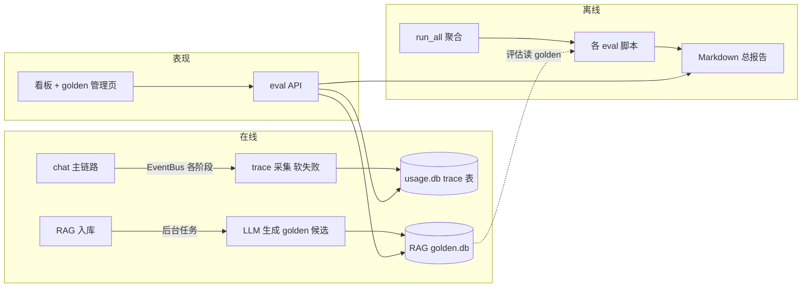
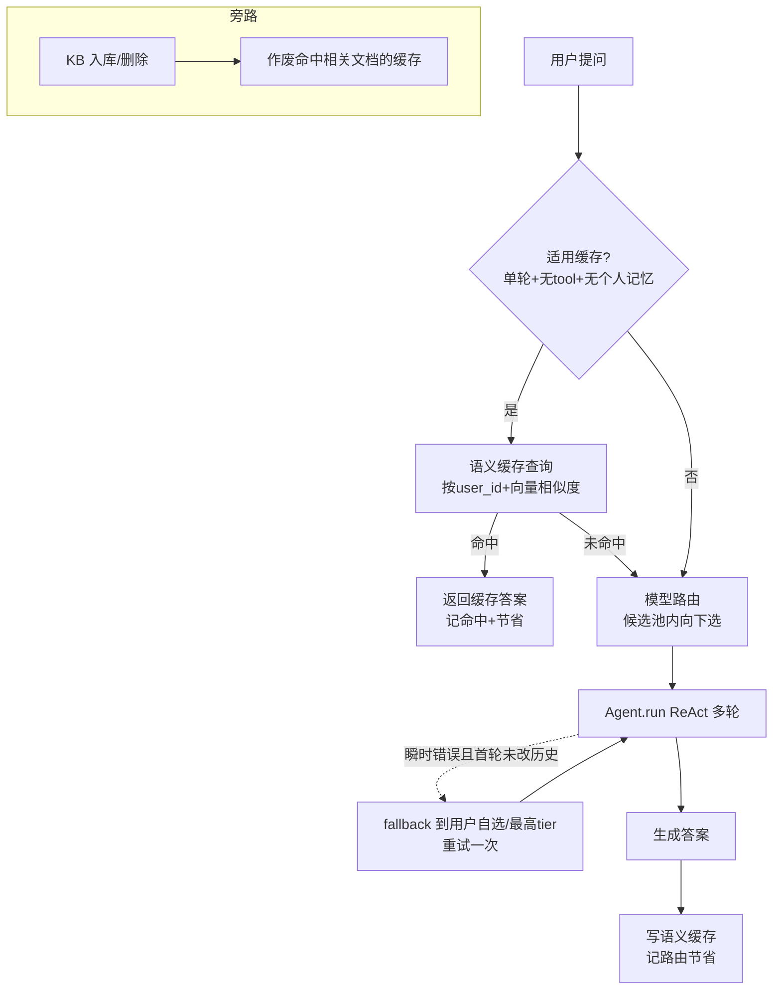

本阶段实现 [iter_7_retro 2.4 选定feature](iter_7_retro.md#2.4-选定feature) 

# 1. 评估 + 可观测
## 1.1. 需求分析

### 1.1.1. 目标与价值

让 AgentA 的质量**能用数据说话**：改动是变好还是变坏，靠跑评估出指标判断，而不是凭感觉；线上每次对话的耗时、token、成本**看得见、能定位**。这一层不增加业务面积，而是把工程成熟度做厚——求职叙事上比再铺一个业务更稀缺（"能度量一个 LLM 系统好不好，并系统性地改好、守住、压成本"）。

原始需求见 [iter_7_retro §3.1](iter_7_retro.md#31-评估--可观测闭环)，本节把它拆成可落地的能力项，并对照现状标出差距。

### 1.1.2. 需求拆解

原始需求拆成五块能力：

| 编号 | 能力 | 说明 |
|---|---|---|
| N1 | 离线评估统一化 | 统一 golden（评估基准数据集）入口 + 补齐指标，跑一条命令出全量 Markdown 报告 |
| N2 | 指标补全 | 检索 recall@k（前 k 召回率）/ MRR（Mean Reciprocal Rank，平均倒数排名）已有；新增 RAG faithfulness（答案忠实度，回答是否忠于检索资料、不编造）/ answer-relevance（答案相关度）；Agent 成功率、安全拦截率已有需归一 |
| N3 | CI 回归检查点 | 把离线评估接进 CI，指标跌破阈值就拦住合并（现仅 perf 一项进了 CI） |
| N4 | 入库自动更新 golden | RAG 入库时按入库资料调 LLM 自动生成 / 补充 golden，后台跑、用户不感知、log 可查 |
| N5 | 在线可观测 trace | 每次 chat 记录检索 / LLM / tool 各阶段耗时、token、成本，写入结构化指标库（与 Markdown 报告职责分开） |
| N6 | 看板 | 前端展示：概览 + 单次请求各阶段瀑布 + 成本 / 延迟趋势 |

### 1.1.3. 现状盘点（可复用资产）

本期不是从零开始，已有不少基础（详见对 [评估与可观测现状调研](9906433d-7a22-4289-ad2f-b79b09cd9418)）：

| 资产 | 位置 | 复用方式 |
|---|---|---|
| 离线评估脚手架 | `tools/agent_eval/`（10+ 脚本）、`tools/rag_eval/` | golden 用 JSON 约定、报告落 Markdown、`judge_with_llm()` 已封装 |
| 检索指标 | `tools/rag_eval/runner.py` | recall / hit@k / MRR 已算 |
| LLM 评委 | `tools/agent_eval/judge/llm_judge.py` | `judge_with_llm()` 出 0-5 分 + 理由，可扩展 faithfulness 等 prompt |
| token / 成本采集 | `src/memory/usage_store.py`（`usage.db`）+ `src/api/routes/usage.py` | 每次 run 一行（token + model），成本查询时按单价实时算 |
| 成本看板雏形 | 前端「用量」页 `frontend/src/components/usage/` | 已有汇总卡 + 趋势图 + 明细 + CSV 导出 |
| CI 门禁模式 | `.github/workflows/AgentA_CI.yml`（perf job） | 跑脚本 → grep 报告里 `FAIL` → 失败则 exit 1 → 上传 artifact |
| 事件流 | `src/agent/core/event_bus.py`（`EventBus`） | 已有 tool / plan 各阶段事件，可作 trace 埋点起点 |

### 1.1.4. 差距分析

对照 N1-N6，标出"已有 / 部分 / 待建"：

| 能力 | 现状 | 差距（待建部分） |
|---|---|---|
| N1 统一入口 | 各脚本可单独跑，但没有"一条命令出全量报告"的聚合层 | 聚合 runner + 汇总报告 |
| N2 指标 | recall@k / MRR / 安全拦截率 / 各类 LLM-judge 已有 | faithfulness、answer-relevance 未实现；Agent 端到端成功率口径不统一 |
| N3 CI 门禁 | 仅 perf 进 CI；recall / plan / security 等未进（需真实 KB + API key + 耗 token） | CI 扩展 + LLM 评估的成本控制策略 |
| N4 入库更新 golden | ingest 链路纯入库，**无任何扩展点 / 后台任务 / 回调** | ingest 后置钩子 + 后台任务 + LLM 生成 golden + 写入策略 |
| N5 trace | 有 `usage.db`（每 run 一行 token），有日志 `session_id` / `request_id`；**无分阶段耗时、无持久化 trace** | 分阶段计时埋点 + 结构化 trace 存储 |
| N6 看板 | 有「用量」页（成本 / token） | 评估报告浏览、trace 瀑布、检索 / Agent 指标面板均无；缺只读后端 API |

### 1.1.5. 范围与分档

原始需求给了三档（最小 → 进阶 → 完整），本期需先定**做到哪一档**：

| 档位 | 包含能力 | 大致工作量 |
|---|---|---|
| 最小 | N1 + N2 + N3（离线评估统一 + 指标补全 + CI 门禁） | 中，主要复用现有脚手架 |
| 进阶 | 最小 + N5 + N6（trace + 看板） | 中-高，需新建 trace 存储 + 前端页 |
| 完整 | 进阶 + N4（入库自动更新 golden）+ 指标趋势展示 | 高，需后台任务 + LLM 生成 + 失效策略 |

明确**不做**（本期边界）：

- 不引入外部可观测平台（OpenTelemetry / Langfuse 等），trace 存自有 sqlite，保持轻量。
- 不做告警 / 通知（指标超阈值主动提醒）：完整档只做指标趋势展示，告警留后续。
- 埋点必须**软失败**：采集 / 写指标出错只记 log，绝不阻断主对话链路。

### 1.1.6. 待确认决策点

下列决策有多条可行路径，已与用户确认（§1.6 工程公约）：

| 编号 | 决策 | 结论 |
|---|---|---|
| D1 | 本期做到哪一档 | **完整**：N1~N6 全做 + 指标趋势展示（不含告警） |
| D2 | trace / 指标存哪 | **复用 `usage.db`** 同库加 trace 表（保持简洁，少一个 db 文件） |
| D3 | LLM 评估如何进 CI 控成本 | CI **只跑不耗 token 的**（mock / 检索指标 / 安全拦截）；faithfulness 等 LLM 评估本地或手动跑，不进 PR 门禁 |
| D4 | 入库自动更新 golden 的写入方式 | **入库时直接写入，但带状态标记**（来源=AI 生成、未审核）；新增**仅 admin 可见的 golden 管理页**，可在线 CRUD（增删改查 + 审核），评估时可按状态筛选 |

## 1.2. 设计

只讲"怎么做"的大方向，不抠实现细节。设计中冒出的几个小决策按"简洁优先"默认选定，列在 §1.2.7。

### 1.2.1. 总体架构

依赖方向守住：评估脚本与存储都在底层，表现层（api / 前端）向下依赖，不反向。新增模块：

| 模块 | 位置 | 职责 |
|---|---|---|
| 评估聚合入口 | `tools/agent_eval/run_all.py` | 一条命令跑全部 eval，汇总成一份总报告 |
| 新指标评委 | `tools/agent_eval/judge/`（扩展） | 新增 faithfulness / answer-relevance 两个评委 prompt |
| trace 存储 | `src/memory/trace_store.py`（`TraceStore`，写 `usage.db`） | 每次 chat 各阶段耗时 / token / 成本落库 |
| golden 存储 | `src/memory/golden_store.py`（`GoldenStore`，新 `golden.db`） | **仅 RAG golden** 转此库（带状态 + CRUD）；其余 `dataset.json` 不动 |
| 入库生成钩子 | `src/rag/ingest.py`（后置回调）+ 后台任务 | 入库后调 LLM 生成 golden 候选 |
| 只读 / 管理 API | `src/api/routes/eval.py` | golden CRUD（admin）+ trace / 报告只读 |
| 看板前端 | `frontend/src/components/eval/` | 概览 + 单请求阶段瀑布 + 趋势；golden 管理页（admin） |

### 1.2.2. 离线评估统一 + 指标补全（N1 / N2）

- **聚合入口**：`run_all.py` 顺序跑现有各 eval 脚本，收集各自结果，汇总成一份总报告（含每项 PASS/FAIL + 关键指标）。各脚本保持可单独跑，不重写。
- **新指标**：faithfulness（答案是否忠于检索资料、不编造）、answer-relevance（答案是否切题），都用现成 `judge_with_llm()` 出 0-5 分 + 理由，新增两个 prompt 文件。Agent 成功率沿用现有 keyword / judge 口径，在总报告里归一展示。

### 1.2.3. 在线 trace（N5）

- **存储**：`usage.db` 加一张 trace 表（trace_id、session_id、user_id、阶段名、耗时 ms、token、成本、时间戳），与现有 `usage_events` 同库不同表。
- **埋点**：复用现有 `EventBus` 事件 + `chat.py` 里 usage 采集那套旁路模式，按阶段（检索 / 每轮 LLM / 每次 tool）记耗时，run 结束一次性落库。
- **红线**：采集 / 写库出错只记 log，**绝不阻断主对话**（与 `usage_store.record_usage` 一致的软失败）。

### 1.2.4. 看板（N6）

- **后端**：`eval.py` 提供只读端点——概览汇总、单次请求各阶段瀑布数据、成本 / 延迟趋势、评估报告列表。
- **前端**：Sidebar 加一个「质量看板」视图，页面复用现有「用量」页的卡片 + 趋势图组件，新增阶段瀑布图。趋势只展示，不做告警。

### 1.2.5. 入库自动更新 golden（N4 / D4）

- **golden 存储**：只把 **RAG golden** 转 `GoldenStore`（sqlite `golden.db`），字段含：内容（query + 期望，JSON）、来源（manual / ai）、状态（pending / approved / rejected）、时间戳。现有 `tools/rag_eval/golden.json` 作为初始导入；plan / quiz / skills / security 等 `dataset.json` 保持文件不动。
- **生成**：`ingest_one` 后置回调触发后台任务（`asyncio.to_thread`，复用现有上传那套），按入库资料调 LLM 生成评估题，写入 `status=pending, source=ai`。用户不感知，log 可查。
- **管理**：admin CRUD API + 前端管理页（增删改查 + 审核改状态）。
- **评估取用**：默认只用 `approved` 的 golden；可配开关是否纳入 pending。

### 1.2.6. CI 门禁（N3）

- CI 新增一个 eval job，**只跑不耗 token 的项**：检索指标（固定小 KB）、安全拦截率、judge 用 mock。沿用现有 perf 门禁模式（跑脚本 → grep 报告 `FAIL` → 失败 exit 1 → 传 artifact）。
- faithfulness 等耗 token 的 LLM 评估**不进 PR 门禁**，留 `run_all` 本地 / 手动跑。

### 1.2.7. 配置项（三处同步 `config.py / .env.example / .env`）

| 配置项 | 用途 |
|---|---|
| `RAG_GOLDEN_DB_PATH` | RAG golden 库路径 |
| `EVAL_AUTO_GOLDEN_ENABLED` | 入库是否触发 LLM 自动生成 golden（默认 true） |
| `EVAL_GOLDEN_USE_PENDING` | 评估是否纳入未审核 golden（默认 false） |
| `TRACE_ENABLED` | 是否采集在线 trace（默认 true，软失败） |

设计中按"简洁优先"定的小决策：golden 用独立 sqlite（支持 CRUD + 状态）；后台任务用 `asyncio.to_thread`，不引任务队列；trace 只记大阶段（检索 / 每轮 LLM / 每次 tool），不做更细粒度。

### 1.2.8. 测试 + 验收

- **UT**：trace 采集软失败（写库异常不影响对话）、`GoldenStore` CRUD + 状态流转、聚合 runner 汇总、judge mock、ingest 钩子触发后台任务。
- **验收标准**：`run_all` 一条命令出总报告；新指标有分数；chat 后 `usage.db` 有 trace；入库后 golden 库出现 pending 候选；admin 管理页可 CRUD + 审核；看板能看概览 / 瀑布 / 趋势；CI eval job 能拦回归。

# 2. 模型路由 + 语义缓存 + 降本

## 2.1. 需求分析

### 2.1.1. 目标与价值

让 AgentA 在**不牺牲质量**的前提下，自动把对话 / RAG 的**延迟和成本压下来**：简单问题走小而便宜的模型，重复 / 相近的问法直接命中历史结果跳过重复检索与生成，并用看板把"省了多少"展示出来。

这是 LLMOps（LLM 运维）里"成本治理"的一块，求职叙事上能接上 §1（评估 + 可观测）的成本数据，形成"既能度量成本、又能主动压成本"的完整故事。

原始需求见 [iter_7_retro §3.2](iter_7_retro.md#32-模型路由--语义缓存--降本)，本节把它拆成可落地的能力项，并对照现状标出差距。

### 2.1.2. 需求拆解

原始需求拆成四块能力（编号 C 表示本期"降本"能力，仅本节内有效）：

| 编号 | 能力 | 说明 |
|---|---|---|
| C1 | 模型路由 | 按问题难度 / 类型选模型：简单问走便宜小模型（低 tier），复杂问走强模型（高 tier）。判定本身要快、可解释 |
| C2 | 语义缓存 | 相近 query 命中历史问答，跳过重复的检索 + LLM 生成，直接返回缓存答案 |
| C3 | 缓存失效 | 缓存可能返回过期 / 不精确结果，需失效策略：知识库（KB）变更时作废相关缓存、缓存带过期时间 |
| C4 | 降本看板 | 复用 §1 的 `usage.db` 成本数据，展示路由命中分布 + 缓存命中率 + 估算节省，对比"不优化时的成本" |

### 2.1.3. 现状盘点（可复用资产）

本期不是从零开始，已有不少基础：

| 资产 | 位置 | 复用方式 |
|---|---|---|
| 模型能力分档 | `src/config.py` `ModelConfig.tier`（min / low / medium / high / max） | 路由的"目标档位 → 具体模型"映射现成，无需另建一套难度分级 |
| 每请求模型覆盖 | `src/config.py` `_MODEL_OVERRIDE` + `use_llm_prefs()`（contextvar） | 路由判定出的模型可经此覆盖落到本请求 / 本次 LLM 调用，对 provider / agent 透明 |
| 统一 LLM 出口 | `src/llm/provider.py` `chat()` / `get_active_model()` | 路由只需改"当前生效 model id"，不动调用逻辑 |
| 成本数据 | `src/memory/usage_store.py`（`cost_of` / `merged_pricing` / `usage.db`） | 降本看板直接复用单价合并 + 成本计算 |
| 成本看板雏形 | 前端「用量」页 `frontend/src/components/usage/` | 已有汇总卡 + 趋势图，降本看板可同构扩展 |
| 向量化能力 | `src/rag/retriever.py` `_get_embedding_fn` + ChromaDB | 语义缓存的 query 向量化 + 相似度检索可复用现成 embedding + 向量库 |
| 旁路软失败范式 | `chat.py` per-run usage 采集 + `record_usage` | 缓存读写 / 路由判定出错只记 log、不阻断主对话，可照搬此模式 |
| KB 变更入口 | `src/rag/ingest.py`（`ingest_one` / `delete_kb_document` / `delete_all`） | C3 缓存失效可挂在这些写盘点之后（与 §1 N4 入库钩子同源） |

### 2.1.4. 差距分析

对照 C1-C4，标出"已有 / 部分 / 待建"：

| 能力 | 现状 | 差距（待建部分） |
|---|---|---|
| C1 模型路由 | model 有 tier 分档；模型由用户手动选 / 全局默认，**无任何自动路由** | 难度判定逻辑 + "档位→模型"选择 + 接入 `use_llm_prefs` 覆盖点 + 是否覆盖用户手选的策略 |
| C2 语义缓存 | 有 embedding + 向量库，但**无缓存层**，每次都走完整检索 + 生成 | 缓存存储 + query 向量相似度命中 + 命中阈值 + 缓存写入时机 + 多用户隔离 |
| C3 缓存失效 | 无缓存，自然也无失效 | 过期时间 + KB 变更作废策略（挂 ingest / delete 钩子） |
| C4 降本看板 | 「用量」页只展示"实际成本"，无"路由 / 缓存省了多少"维度 | 路由命中分布、缓存命中率、估算节省的采集 + 只读 API + 前端面板 |

### 2.1.5. 范围与分档

| 档位 | 包含能力 | 大致工作量 |
|---|---|---|
| 最小 | C1（模型路由） | 中，主要复用 tier + 模型覆盖点 |
| 进阶 | 最小 + C2 + C3（语义缓存 + 失效） | 中-高，需新建缓存存储 + 相似度命中 + 失效钩子 |
| 完整 | 进阶 + C4（降本看板） | 高，需采集节省指标 + 只读 API + 前端面板 |

明确**不做**（本期边界）：

- 不引入外部缓存中间件（Redis / GPTCache 等），缓存存自有 sqlite + 向量库，保持轻量。
- 不做"训练 / 微调路由模型"，路由判定走轻量方案（规则 / 关键词 / 现成 judge），不另起一套 ML 模型。
- 路由判定与缓存读写必须**软失败**：判定 / 命中出错只记 log，回落到正常流程，绝不阻断主对话。

### 2.1.6. 已确认决策点

下列决策有多条可行路径（§1.6 工程公约要求实现前拍板），已与用户确认：

| 编号 | 决策 | 结论 |
|---|---|---|
| D1 | 本期做到哪一档 | **完整**：C1~C4 全做（路由 + 语义缓存 + 失效 + 降本看板，与 §1 成本数据打通） |
| D2 | 路由难度判定方式 | **做成配置可选 + admin UI 可配**：规则启发（长度 / 是否带 tool / 关键词）与轻量 LLM 分类器两种方式可切换 |
| D3 | 路由作用方式 | 见下方 D3 细化三条 |
| D4 | 语义缓存作用范围 | **仅缓存「单轮 + 无 tool + 无个人记忆注入」的纯问答（含其 RAG 检索答案）**；多轮 / 带 tool / 走个人记忆的一律不缓存（上下文相关，命中易出错） |
| D5 | 缓存存哪 | **独立 ChromaDB collection**，存 query 向量 + 答案 + 元数据（命中文档 id、过期时间、user_id）；相似度检索复用现成 embedding，不污染 `usage.db` |
| D6 | 缓存隔离 + 失效 | **按 `user_id` 隔离**（查询带 user_id 过滤，杜绝跨用户泄露）+ **每条带过期时间**（可配，默认值待定）+ **KB 变更作废相关缓存**（命中了被改 / 删文档的条目作废，挂 `ingest_one` / `delete_kb_document` 之后，与 §1 入库钩子同源） |

D3 路由作用方式细化（已确认）：

1. **可用模型勾选**：在「配置 API key」页加勾选，只有勾中（已充值可用）的模型才进入本 feature 的路由候选池。
2. **只能向下路由**：用户选定某 LLM 后，路由只在候选池内向**更便宜**的模型选，不会向上升级。
3. **auto 档启用**：选「auto」档时启用路由策略；手选具体模型时尊重用户（仍可在候选池内向下降本）。
4. **路由粒度 = 单次提问（run）**：每次用户提问开始时判定一次，整个 ReAct 多轮 LLM 调用沿用同一模型；同一会话的不同提问各自独立路由。不在循环内逐轮换模型——跨厂商中途换模型有 tool 格式 / 历史回传风险，且 `usage.db` 是一次 run 记一行一个 `model_id`。
5. **运行时不可用 fallback**：候选池预过滤已挡掉"没配 key / 没充值"的模型；路由选中的便宜模型在调用时遇**瞬时错误（429 / 5xx / 超时，不含 400 这类请求本身错）**时回退重试一次——手选模型场景回退到**用户自选模型**（更高档、天然安全），auto 档无自选则回退到候选池**最高 tier** 的模型（默认值，可调）。为避开 run 内换厂商风险，fallback **仅在该 run 尚未跑 tool / 未改历史时**生效；循环中途失败照现状抛 error。

### 2.1.7. 与已有 LRU 缓存的区别（澄清）

代码已有 `functools.lru_cache`（`query_rewriter.py` 改写结果、`retriever.py` query 编码、`reranker.py` 模型实例），但与本期语义缓存是两回事：

| 维度 | 已有 LRU 缓存 | 本期语义缓存 |
|---|---|---|
| 命中方式 | 精确字符串 hash | 向量相似度（相近问法也命中） |
| 缓存对象 | 流程中间产物（改写 / 编码 / 模型实例） | 最终答案（命中即跳过整条检索 + 生成） |
| 省的开销 | 少量 CPU / 一次小调用 | 整次 RAG 检索 + 主 LLM 生成（降本主力） |
| 持久化 | 进程内，重启即丢、多 worker 不共享 | 落库，跨请求 / 跨重启、可统计命中率 |
| 失效 | 不需要（只依赖 query） | 必须（答案依赖 KB，须过期 + KB 变更作废） |
| 多用户隔离 | 不需要（不含用户数据） | 必须（答案可能含个人化内容） |

两层是**叠加协作**关系，不是替代：

- 语义缓存在整条流程最前面（run 开始时查一次）：**命中** → 整条管线（含上述 LRU 子步骤）全跳过；**未命中** → 管线照常跑，LRU 照常生效。
- 语义缓存查相似度时要把 query 编码成向量，这一步**复用** `retriever._embed_query_cached`（LRU），相同 query 零重复编码。

结论：已有 LRU 是"子步骤缓存"，两者并存互不替代；本期新增的是缓存最终答案、向量命中的"语义答案缓存"，叠在已有缓存之上做高层短路。

## 2.2. 设计

只讲"怎么做"的大方向，不抠实现细节。设计中冒出的小决策按"简洁优先"默认选定，列在 §2.2.8。

### 2.2.1. 总体架构

一次提问的处理顺序：**先查语义缓存 → 未命中再路由选模型 → 跑 Agent（带 fallback）→ 写缓存 + 记节省**。KB 变更旁路触发缓存失效。新增 / 改动模块：

| 模块 | 位置 | 职责 |
|---|---|---|
| 路由判定 | `src/llm/model_router.py`（`route_model()`） | 按候选池 + query 特征选模型；规则 / 轻量分类器两方式可配；只向下选更便宜 |
| 候选池配置 | 「配置 API key」页 + 配置存储 | 用户勾选已充值可用模型，路由只在池内选 |
| 语义缓存 | `src/memory/semantic_cache.py`（`SemanticCacheStore`，独立 ChromaDB collection） | query 向量命中 + 答案存取；按 `user_id` 隔离 + 过期 + 失效 |
| 缓存失效钩子 | `src/rag/ingest.py` 后置回调 | KB 入库 / 删除后作废命中相关文档的缓存（与 §1 入库钩子同源） |
| 降本采集 | `src/memory/usage_store.py` 扩展（`usage.db` 加 `saving_events` 表） | 记录每次路由降级 / 缓存命中的估算节省 |
| 降本看板 API | `src/api/routes/usage.py` 扩展 | 路由命中分布 / 缓存命中率 / 估算节省只读端点 |
| 降本看板前端 | `frontend/src/components/usage/` | 「用量」页加「降本」面板 |
| run 接入点 | `src/api/routes/chat.py` | run 开始查缓存 → 路由 → fallback 的编排点 |

依赖方向：`model_router` / `semantic_cache` 在底层（LLM / memory 层），`chat.py` 编排向下调用，不反向依赖。缓存失效由 `ingest.py` 旁路触发，不让缓存层反向感知 RAG。

### 2.2.2. 模型路由（C1）

- **候选池**：在「配置 API key」页（admin-only）勾选"已充值可用"的模型，存为**全局 admin** 配置（`.agenta/routing_pool.json`）。路由只在池内选，从源头避免选到没 key 的模型；未显式配置时回落到"provider 已配 api_key"的全部模型。
- **判定方式（可配，admin UI 可切）**：
  - **规则启发**（默认，近乎零开销）：按 query 长度、是否会带 tool、是否命中"难/简单"关键词，映射到目标 tier。
  - **轻量 LLM 分类器**：用便宜小模型给 query 难度打分，多一次小调用（有成本 / 延迟）。
  - 可选"两者结合"：规则先判，拿不准再调分类器。
- **向下约束**：判定出目标 tier 后，在候选池里**只选不高于用户当前选定档位**的模型（auto 档以候选池最高档为基准），永不向上升级。
- **粒度**：单次提问判定一次（经 `use_llm_prefs` 把选定模型压进本 run 的 contextvar），整个 ReAct 循环沿用；同一会话不同提问各自独立路由。
- **运行时 fallback**：路由的便宜模型调用遇瞬时错误（429 / 5xx / 超时，不含 400）→ 回退重试一次：手选场景回退**用户自选模型**，auto 档回退候选池**最高 tier**。仅在该 run 尚未跑 tool / 未改历史时生效，循环中途失败照现状抛 error。

### 2.2.3. 语义缓存 + 失效（C2 / C3）

两层缓存的关系见 §2.1.7（叠加协作、不替代）。本期新增的是高层"语义答案缓存"：

- **适用判定**：只对「单轮 + 无 tool + 无个人记忆注入」的纯问答启用；其余（多轮 / 带 tool / 走个人记忆）直接跳过缓存，照常跑。
- **存储**：独立 ChromaDB collection，一条缓存 = query 向量 + 答案 + 元数据（`user_id`、原 query、写入时间、过期时间、模型 id）。query 编码复用 `retriever._embed_query_cached`（RAG 默认 embedding 模型）。
- **命中**：按 `user_id` 过滤 + 向量相似度检索，相似度 ≥ 阈值（可配）且未过期才算命中；命中即返回缓存答案，跳过整条检索 + 生成。**软失败**：查询出错只记 log，回落正常流程。
- **写入**：未命中且本次是"可缓存纯问答"时，run 结束把 query 向量 + 答案 + 关联 KB 文档 id + 过期时间写入。**软失败**：写库出错只记 log，不影响已返回给用户的答案。
- **失效（C3）**：
  - **过期**：每条带过期时间，查询时过滤掉过期条目（惰性），另可配定期清理。
  - **KB 变更**：`ingest_one`（入库成功）/ `delete_kb_document` / `delete_all_kb_documents` 写盘后旁路**全量作废**整个缓存 collection。答案依赖 KB 但精确追踪"每条答案命中了哪些文档"成本高、KB 变更又不频繁，故按"简洁优先"全量清，绝不返回过期答案。删号时按 `user_id` 清该用户缓存。

### 2.2.4. 降本看板（C4）

- **采集**：`usage.db` 加 `saving_events` 表，每次"路由降级"或"缓存命中"记一行：类型（route / cache）、原模型、实际用模型、估算节省（按 `merged_pricing` 算"若用原模型的成本 − 实际成本"）、`user_id`、时间。**软失败**旁路写入，与 `record_usage` 一致。
- **后端**：`usage.py` 加只读端点——缓存命中率、路由命中分布（各 tier 占比）、估算累计节省、趋势。复用现有单价合并 + 成本计算。
- **前端**：「用量」页新增「降本」面板，复用现有汇总卡 + 趋势图组件，展示命中率 / 节省金额 / 趋势。只展示，不做告警。

### 2.2.5. 日志方案

日志给人排查，`saving_events` / 看板给聚合，两者分工。沿用现有 `logger` + `session_id` 上下文，全程可查：

| 环节 | 记录内容 |
|---|---|
| 路由判定 | 候选池（选定模型 + 可向下候选）、判定输入（长度 / 是否带 tool / 命中关键词 or 分类器打分）、判定方式 + 耗时、结果（原模型 → 路由后模型 + tier + 降级原因） |
| fallback | 触发的错误类型、从哪个模型回退到哪个、是否成功；分类器调用失败记 warning |
| 缓存查询 | query、`user_id`、阈值；命中（条目 id + 相似度分 + 是否将过期）/ 未命中（最相似分，差多少没命中，便于调阈值） |
| 缓存写入 | 新条目 id、关联 KB 文档 id、过期时间 |
| 缓存失效 | 触发源（ingest / delete）、作废条目数 |
| 软失败 | 路由 / 缓存读写异常一律 warning + 回落，不阻断对话 |

### 2.2.6. 性能与收益分析

写明取舍，避免后续误用。

**模型路由**

| 维度 | 内容 |
|---|---|
| 收益 | 简单问走便宜小模型，吃单价差（可达 10x，如免费档 vs 高档）；小模型延迟更低 |
| 负面 | 误判把难题路由到小模型 → 质量降；判定有开销；多一层逻辑增复杂度 |
| 性能 | 规则方案近乎零开销（µs 级）；分类器方案每请求加一次小模型往返（数百 ms + token），对简单问可能得不偿失——故做成可配，分类器仅在规则拿不准时调 |

**语义缓存**

| 维度 | 内容 |
|---|---|
| 收益 | 命中即跳过整条检索 + 生成，延迟从数秒降到几十 ms、成本≈0；对常见重复问法收益最大 |
| 负面 | 过期 / 不精确（靠 C3 失效）；误命中（阈值过松，靠调严 + 限纯问答）；维护成本；冷启动无收益 |
| 性能 | **未命中是净增延迟**（编码 query + 查缓存库 + 阈值判断，约几十 ms；query 编码复用 LRU，相同 query 零编码）；**命中是巨幅降延迟**。命中率是回本关键，太低则得不偿失 |

**总权衡**：路由——规则近乎免费、分类器需权衡；缓存——拿"每请求 +几十 ms 固定开销"换"命中请求 −几秒"，靠命中率回本。两者都软失败，绝不阻断对话。

### 2.2.7. 配置项（三处同步 config.py / .env.example / .env）

| 配置项 | 用途 |
|---|---|
| `MODEL_ROUTING_ENABLED` | 是否启用模型路由（默认 true） |
| `MODEL_ROUTING_MODE` | 路由判定方式：rule / classifier / hybrid（默认 rule） |
| `MODEL_ROUTING_CLASSIFIER_MODEL` | classifier / hybrid 模式下做难度打分的小模型 id |
| `SEMANTIC_CACHE_ENABLED` | 是否启用语义缓存（默认 true，软失败） |
| `SEMANTIC_CACHE_COLLECTION` | 缓存用的 ChromaDB collection 名 |
| `SEMANTIC_CACHE_THRESHOLD` | 命中相似度阈值（默认偏严，如 0.95） |
| `SEMANTIC_CACHE_TTL_DAYS` | 缓存条目过期天数（默认值待定，如 7） |

### 2.2.8. 小决策（简洁优先默认）

- 候选池配置粒度：定为**全局 admin**（API key 页本就 admin-only，模型可用性是全局事实，不分用户）；未配置时回落"已配 api_key"的全部模型。
- fallback 范围：仅瞬时错误（408/425/429/5xx）+ 仅 run 首轮未改历史（fresh 会话），回退一次到基准模型（手选=自选、auto=池内最高档），不做多级链；流式下首轮 error 帧暂存，成功回退则丢弃。
- 缓存隔离：严格按 `user_id`，不做"公共问答全局共享池"（避免跨用户泄露，简洁优先）。
- 缓存可写判定：单轮起步（fresh 会话，无历史）+ 无 tool + 未注入个性化（rules/记忆/学习计划），三者皆满足才写；`used_tools` / `personalized` 由 agent `final_answer` 事件透传。
- 缓存失效粒度：KB 任一变更全量作废（不按文档精确作废），简洁优先。
- 降本节省口径：估算 = 按 `merged_pricing` 算"假设用原模型的成本 − 实际成本"，缓存命中按"假设完整生成的成本"（按答案长度粗估 token）估，标注为估算值。

### 2.2.9. 测试 + 验收

- **UT**：路由规则判定（各 tier 映射 + 向下约束 + 候选池过滤）、fallback（瞬时错误回退一次 / 中途失败不回退 / 400 不回退）、缓存命中与未命中（阈值边界、`user_id` 隔离、过期过滤）、缓存软失败（读 / 写异常不影响对话）、KB 变更触发失效、`saving_events` 记录。judge / LLM 调用一律 mock，不真发请求。
- **验收标准**：auto 档下简单问被路由到更便宜模型、复杂问不降级；手选模型遇瞬时错误回退到自选模型；相近问法命中缓存且延迟显著下降；KB 更新后相关缓存失效、不返回过期答案；跨用户查不到彼此缓存；「降本」面板能看命中率 / 估算节省 / 趋势；全程 log 可还原路由 + 缓存决策。

