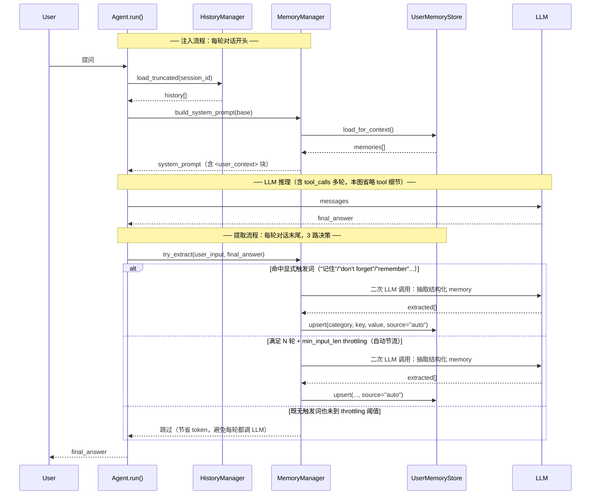
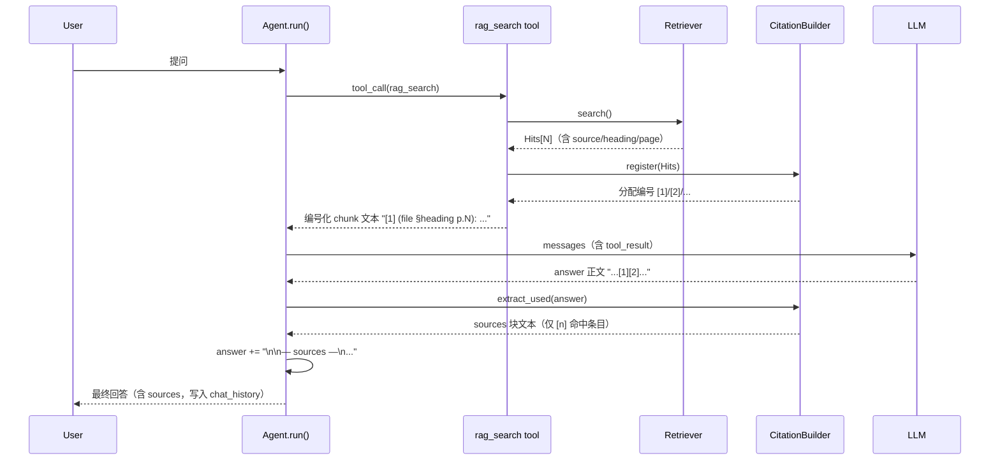
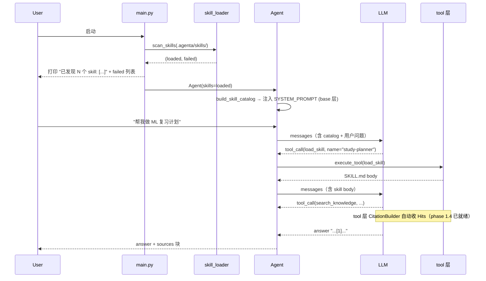
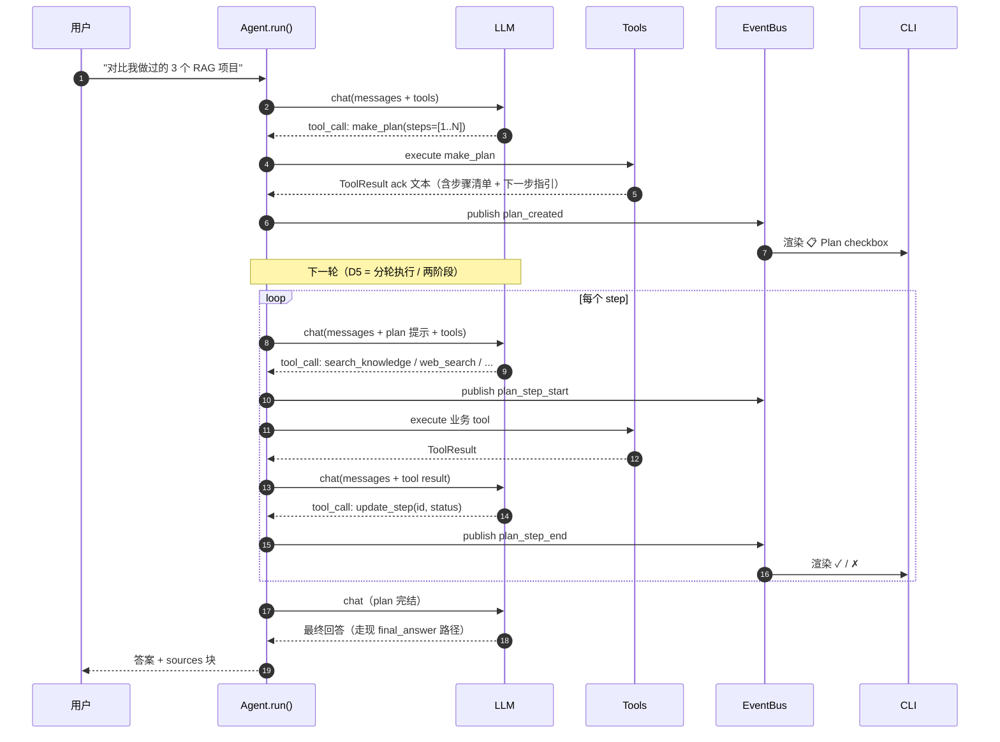

# 1. 为什么有 AgentA

通过搭建AgentA 来：
- 实践 Vibe coding ：从零开始，在自己不是什么都了解的情形下，完成一个完整项目
- 学习 RAG (Retrieval-Augmented Generation，检索增强生成) ： 通过实现真实的 RAG，来逐步了解其原理和本质
- 学习 Agent ：通过实现一个Agent，来深入理解Agent的原理，以便更好的使用 AI
- 项目展示 ：把本项目包装为一个实战项目，用于找工作/面试

整个项目计划包含4大块：
- RAG
- Agent(CLI 模式)
- UI
- 多种实现方式：Python/LangChain/AutoGPT，以了解各种Agent实现框架


# 2. 当前状态

- 4大块都已有一些实现
- RAG部分已比较完整，暂时不做优化
- Agent 部分是马上要进一步完善的重点
- UI 部分等 Agent 完善后再继续
- 三种实现都有一些框架代码，现在以 Ptyhon 为主，马上进行的 Agent 也以Python 分支继续。

# 3. Agent 优化方向

目标和状态：
1. 实现基本的 Agent 框架，可以进行问答 => Done
2. 接入 RAG 可以回答私有问题 => Done
3. 参考 GHC(github copilot)/cursor/Claude(Web/Desktop) 的实现方式，优化AgentA
4. 关注Agent 最新技术，持续改进

我知道的关于Agent的功能/技术(部分已经初略实现)：
1. LLM API调用: openai /anthropic / google / azure / 国内的应该都是 openai API
2. Agent 循环/架构：ReAct, plan and execute, loop 等
3. Session ：一次对话记录
4. Memory ： per 用户， 跨 session记忆
5. Prompt ： 理解 system/user/assistant prompt，实现类似 GHC/cursor 在 .github/.cursor 目录下的 prompt 文件，或自定义agent
6. Tools ：Agent 代码自实现的 tool(RAG,web search, etc) + 类似 GHC 把插件当作工具
7. Skills ：支持标准 Skills 注入（https://agentskills.io/home），实现参考 GHC 
8. MCP (Model Context Protocol，模型上下文协议) ： 支持标准 MCP (https://modelcontextprotocol.io/docs/getting-started/intro)，实现参考 GHC/Cursor
9. Thinking模式：增加更多模型支持，流式输出优化，可折叠等
10. Harness ： LLM 直接返回文本 → 输出最终回答，评价回答，决定是否继续提问 => 建立反馈机制，让 AI 能自我检查和修正。
11. 防止 prompt injection
12. CnP Refinement

TBD:
- 多Agent/SubAgent/A2A协议
- 支持sandbox
- 用户自定义 Workflow?


# 4. Agent 改进计划

## 4.1. Review 现有代码
Review 完整实现 @AgentA 目录
只了解现状，不需要输出

## 4.2. 重构评估
基于4.1，重新整体设计 AgentA 架构：Agent, RAG, CLI/UI

设计原则：
- **Agent core 与表现层解耦**：Agent core 不假设 IO 形式（CLI / 未来 Web UI / SDK 都能接），通过 Stream / Callback 接口对外，UI 阶段不需要回头改 Agent core
- **RAG 内部不动**，但要重新约定 Agent 调用 RAG 的对外接口（返回结构、metadata 暴露、错误降级行为等）
- **三种 impl 共享公共层**，差异只在 Agent loop 那一层（详见 4.3）

输出：
- 整体架构 mermaid 图，覆盖三大模块（Agent / RAG / CLI/UI）+ 各模块内部结构画到位（作为整个工程的设计文档）
- 写入 [整体架构](design.md#1整体架构) 章节

## 4.3. 三种实现模块化共享
目标：模块化共享，抽离公共部分（LLM provider / RAG / Tools），三个 impl 只换"Agent loop"那一层

**命名约定（4.5 重构 + 后续新增模块都按此走）**：
- **依赖层**（不感知 Agent loop 的底层能力）：数据存储用 `*Store` 后缀，如 `ChatHistoryStore` / `UserMemoryStore`
- **Helper 层**（封装业务策略、被三种 impl 共享）：按角色选后缀
  - `*Manager`：策略编排（如 `HistoryManager` / `MemoryManager`）
  - `*Engine`：执行流水线（如 `ToolCallEngine`）
  - `*Policy`：纯策略判定（如 `ThinkingPolicy`）
  - `*Bus`：事件分发（如 `EventBus`）

## 4.4. 清理前期不必要功能/代码
根据新的架构，评估哪些功能/代码是不必要的，需要清理
例如：
1. 因为现在已有 tools/rag_cli.py, CLI中的 /ingest 命令可以删掉
2. 考虑到后续还有UI功能，CLI的定位需要重新考虑

### 4.4.1. To clean up

按"风险 / 收益 / 重构边界"分三档：

**第一档：直接清理（明确冗余，行为零变化）**

1. **CLI `/ingest` 命令全链路移除** —— 已被 `tools/rag_cli.py ingest` 完全覆盖且更强（叠加了 status / clear / 孤儿 segment 清理 / 伴生文件历史），表现层不应再承担 RAG 运维。涉及：
   - `main.py:140-161`：`/ingest` 分支 + 手写参数解析
   - `chainlit_app.py:317-324`：`/ingest` 分支
   - `chainlit_app.py:167-181`：`_parse_ingest_args`
   - `chainlit_app.py`：`AppState.ingest_docs_dir` / `ingest_model_alias` 字段 + ChatSettings 里对应两个 widget
   - `src/cli/handlers.py:63-86`：`run_ingest`
   - `src/cli/ui.py:17-18`：帮助文本两行
   - `src/cli/tab_complete.py`：`/ingest` 补全项
   - `README.md` / `docs/iter_0.md`：`/ingest` 引用同步改为 `tools/rag_cli.py ingest`
   - `tests/test_cli_handlers.py`：`run_ingest` 相关用例移除

2. **`LangChainAgent.chat()` alias 删除** —— `run()` 的赤裸别名，三 impl 中只此一家，破坏 duck-typed 约定统一性。
   - 删 `src/agent/langchain_agent.py:64-65`
   - 改 `tests/test_langchain_agent.py:80` 用 `.run('hi')`

3. **`handlers.py:57` 局部 `import sys` 冗余** —— 文件顶部已 `import sys`，函数内重复。删 1 行。

**第二档：定位调整（不删代码，配合 #1 改文档与帮助文本）**

4. **CLI 重新定位为"开发调试 / 服务器无 GUI" 用** ：
   - 用户向命令（`/help /clear /history /session /memory /thinking /save /reload-*` + Prompt/Skill 切换）全部保留 —— CLI 仍是最快的调试入口
   - 运维类一律走 `tools/`：本次删 `/ingest`，今后类似命令（`/clear-kb` 等）也不再加进 CLI
   - `README.md` "Quickstart" 把 Chainlit UI 提到首位、CLI 作为副入口注明用途；`ui.py` BANNER 副标题加"CLI for dev / headless"
   - 决策记录写进本节，避免未来再有人往 CLI 加运维命令

**第三档：本步只登记，留到 4.5 重构时处理**

> 这些是**架构层耦合问题**，与 helper 抽离绑在一起，单独动会破坏行为或与 4.5 冲突。

5. `src/agent/agent.py` 与 `src/agent/autogpt_agent.py` 反向 import `src.cli.skill_loader` —— Agent core 不应依赖表现层目录；4.5 把 `SkillCatalog` 抽到 `src/agent/core/` 后顺手解掉
6. `src/agent/agent.py` 与 `src/agent/autogpt_agent.py` 直接 import `src.memory.user_memory` 的 `should_extract_immediately` / `extract_memories` —— 应封装进 `MemoryManager` helper
7. `src/cli/ui.py` BANNER 在 import 时 `format(config.IMP_METHOD, ACTIVE_PROVIDER)` —— 运行时切 provider 不刷新；要等 ChatSettings 真正能改 provider 之后一起整改
8. 三个 Agent impl 内部各自构造 SkillCatalog / 拼 `<skill_content>` —— 4.5 抽 `SkillCatalog` helper 时统一

### 4.4.2. Impl plan

按"可独立回滚"分 5 步，每步结束都跑一次回归脚本。

**Step 1: 删除 `/ingest` 全链路（Tier 1.1）**

按依赖自底向上改，避免中间态 broken：

1. **`src/cli/handlers.py`**：删 `run_ingest` 函数（63-86 行）
2. **`src/cli/ui.py`**：删帮助文本第 17-18 行（两行 `/ingest...`）
3. **`src/cli/tab_complete.py`**：删 `CLI_COMMANDS` 中 `/ingest` / `/ingest -m zh` / `/ingest -m en` 三项
4. **`main.py`**：删 `case "/ingest":` 分支（140-161 行）
5. **`chainlit_app.py`**：
   - 删 `case "/ingest":` 分支（317-324 行）
   - 删 `_parse_ingest_args` 函数（167-181 行）
   - 删 `AppState.__init__` 的 `ingest_docs_dir` / `ingest_model_alias` 形参与字段（104-105, 115-116 行）
   - 删 `_runtime_settings_widgets` 中 `TextInput(ingest_docs_dir)` 与 `Select(ingest_model_alias)` 两个 widget（213-219 行）
   - 删 `on_settings_update` 中对这两个键的处理（544-549 行）
   - 删 `on_chat_start` 里 `AppState(...)` 传 ingest_* 形参的痕迹（如果有显式传，本地化看一下）
6. **`tests/test_cli_handlers.py`**：当前没有 `run_ingest` 用例（已确认），无需改动

**Step 2: 删除 `LangChainAgent.chat()` alias（Tier 1.2）**

1. **`src/agent/langchain_agent.py`**：删 64-65 行 `def chat(...)` 方法
2. **`tests/test_langchain_agent.py:80`**：`ag.chat('hi')` 改为 `ag.run('hi')`

**Step 3: 清掉 `handlers.py` 局部冗余 import（Tier 1.3）**

1. **`src/cli/handlers.py:57`**：删函数体内的 `import sys`（顶部 line 8 已有）

**Step 4: 文档同步 + CLI 定位（Tier 2.4）**

仅改"活文档"，历史记录（`docs/iter_0.md` / `docs/iter_1.txt`）保持原样：

1. **`README.md`**：
   - `2.4.启动 AgentA` 调整：Chainlit 段提到 CLI 之前，CLI 段注明"主要用于开发调试 / 无 GUI 场景"
   - 删 quickstart 里 "首次使用先 /ingest 把 ./datasets/data_en 入库"，改写为引用 `python -m tools.rag_cli ingest -m m3`
   - `4.1.RAG 入库` 章节描述里 "（与 `/ingest` 等价）" 字样去掉
2. **`.env.example:23`**：注释 "(/ingest 命令默认扫描的目录)" → "(tools/rag_cli.py ingest 默认扫描的目录)"
3. **`src/rag/ingest.py`** 顶部 docstring 第 8 行 + 332 行的 "/ingest 等价"字样：改为 "与 `tools/rag_cli.py ingest` 等价"
4. **`tools/rag_cli.py`** 顶部 docstring 第 7 行 "main.py 中的 /ingest" 字样改为 "原 CLI `/ingest`（已废弃）"

> `ui.py` BANNER 副标题按用户决定**不加**。

**Step 5: 回归验证**

| 项 | 命令 | 预期 |
|---|---|---|
| 单元测试 | `pytest tests/ -x` | 全绿 |
| CLI 启动 | `python main.py` → `/help` | help 不再出现 `/ingest`；其他命令一切照旧 |
| 运维工具 | `python -m tools.rag_cli status` | 与改前输出一致 |
| Chainlit | `chainlit run chainlit_app.py --port 8000` → 打开 settings 面板 | 不再出现 "Ingest Docs Dir" / "Ingest Embedding Alias" 两项；其他设置正常 |

### 4.4.3. UT Refinement
为后续 4.5 重构 + 4.9 加 feature 时**不破坏现有行为**，先对 UT 做范围聚焦与缺口评估。

**缺口评估**

4.5 会抽出 5 个 helper（`EventBus` / `ToolCallEngine` / `HistoryManager` / `MemoryManager` / `ThinkingPolicy`）。当前 UT 对它们的覆盖：

| 待抽 Helper | 当前 UT 覆盖 | 是否足以防止重构回归 |
|---|---|---|
| `ThinkingPolicy` | `TestEstimateThinkingBudget` 8 例 + `TestAgentThinkingInit/Run` 7 例 | ✅ 足够 |
| `ToolCallEngine` | `TestAgentToolCall` 3 例 + `TestToolGuidance` 4 例 | ✅ 足够（hint 注入、tool_call_id、轮数上限都有） |
| `HistoryManager` | 无 ❌ —— `_load_truncated_history` / `_collect_skill_pairs` 当前 0 个直接单测，只在 integration 间接覆盖 | ❌ 不够 |
| `MemoryManager` | `test_user_memory.py` 覆盖底层 Store + sanitize + extract；但**注入 system_prompt 的行为 + N 轮后自动触发抽取**无 UT | ❌ 不够 |
| `EventBus` | 无 ❌ —— 当前 `set_token_callback` / `set_thinking_callback` 0 个直接单测，只在 chainlit_app 真实运行时验 | ❌ 不够 |

**改进计划**

**A. 4.5 重构前必加（防止重构破坏现有行为）**

| 项 | 测试目标 | 难度 |
|---|---|---|
| A1. `HistoryManager` 行为基线 UT | 把 `agent.py:_load_truncated_history` 的所有分支（按 turn 截断、skill_pair 完整性保护、system 拼接、空历史）固化为单测；重构后直接复用 | 中 |
| A2. `MemoryManager` 行为基线 UT | 覆盖：N 轮后自动触发抽取的时机判定、立即触发关键词（"请记住"/"remember this"）、抽取后注入 system_prompt 的位置 | 中 |
| A3. `EventBus` 约定 UT | 单订阅 / 多订阅 / 取消订阅 / 单个订阅者抛异常不影响其他订阅者 / 事件类型枚举 | 低（纯逻辑） |

**B. 本步可顺手加（覆盖关键缺口，与 4.5 无强绑定）**

| 项 | 测试目标 | 难度 |
|---|---|---|
| B1. `RetrieverAPI.format_search_results` 单测 | 返回字符串包含 source / score / content；多 hit 排序；空 hit | 低 |
| B2. `BaseAgent` Protocol 一致性 UT | 用 `hasattr` / inspect 检查 `Agent` / `AutoGPTAgent` / `LangChainAgent` 都有 `run` / `session_id` / `activate_skill` / `set_event_callback` 等签名（即使本期不测 langchain/autogpt 功能，接口校验是 import-only，0 网络消耗） | 低 |

**C. 4.9 新功能时同步加（feature-by-feature）**

在 [§4.9](#49-开始实现) `step 2.4 测试功能` 落实：每个新 feature **必须**至少 1 个 unit 覆盖核心行为，命名 `tests/test_<feature>.py`。Showcase / Learning / Foundation 三档都执行此规则，差别只在覆盖深度。


**决策**

- A + B 共 5 项 **在 4.5 之前作为前置任务做完**
- C 在 [§4.9](#49-开始实现) 落实

**执行结果**

5 个新增测试文件，全部默认套件中跑：55 passed + 1 skipped（LangChain import 失败）+ 2 xfailed（EventBus 未抽出前的约定 placeholder）。

| 文件 | 用例数 | 覆盖点 |
|---|---|---|
| `tests/test_history_manager.py` | 11 | `_load_truncated_history` 截断 / 空历史 / system 过滤 / SQL 粗粒度上限 + `_collect_skill_pairs` skill 组保护 |
| `tests/test_memory_manager.py` | 10 | `Agent.run` 注入 `<user_context>` 三态 + `_try_extract_memories` 五种触发分支 + 异常静默 |
| `tests/test_event_callbacks.py` | 13（含 2 xfail） | `set_thinking/token_callback` 安装/重置/替换 + `_on_thinking_chunk` 透传 + EventBus 未抽出前的扇出/隔离 placeholder |
| `tests/test_format_search_results.py` | 12 | 空 hits / score vs distance / 多 hit 分隔 / retrievers / heading_path / page_no |
| `tests/test_agent_protocol.py` | 12（含 1 skip + 1 xfail） | Python & AutoGPT 的 `run / activate_skill / session_id` 签名一致；事件接口当前分布；EventBus 未对齐前的 xfail 锁定 |

**对4.5 重构信号约定**：
- `test_event_callbacks.py::TestFutureEventBusContract::test_multiple_subscribers_fan_out` 由 xfail 转 pass = EventBus 多订阅扇出已实现（callback 字段从 `callable|None` 改为 `list[callable]`）
- `test_agent_protocol.py::TestEventInterfaceFutureContract::*` 由 xfail 转 pass = AutoGPT 已接入统一事件接口
- `test_agent_protocol.py::TestLangChainAgentProtocol::*` 由 skip 转 pass = LangChain 环境修复（依赖路线另议：升级到 langchain 1.0+ / 回退 `AgentExecutor` / 改 langgraph）
- `test_event_callbacks.py` 重命名为 `test_event_bus.py`，把测试主语从 `agent` 改为 `agent.events`

## 4.5. 根据新的设计，调整代码框架
1. 把代码框架，按新的架构调整好
2. 回归测试，确保功能正常（[§4.4.3](#443-ut-refinement) 已就位的 5 个安全网文件 + 2 个 xfail 信号会自动提示重构进度）

### 4.5.1. Plan

**目标结构**
实现：[design.md 5.IMP](design.md#5imp)

```
src/agent/
├── agent.py                 # Python 实现 — 只剩 loop 编排，调 helpers
├── autogpt_agent.py         # 持有 EventBus，暴露 set_X_callback 转发
├── langchain_agent.py       # 本期不接（环境 import 失败）
├── tools.py                 # 依赖（已存在）
└── core/                    # 公共层 helpers（新建）
    ├── __init__.py
    ├── history_manager.py        # HistoryManager
    ├── memory_manager.py         # MemoryManager
    ├── event_bus.py              # EventBus（多订阅 + 异常隔离）
    ├── tool_call_engine.py       # ToolCallEngine
    └── thinking_policy.py        # ThinkingPolicy
```

依赖层（`src/memory/chat_history.py` 的 `ChatHistory` / `src/memory/user_memory.py` 的 `UserMemoryStore` / `src/llm/provider.py`）位置不动，只是被 helper 调用。

**9 步小步快跑（每步跑一次 `bash tools/ut.sh -fast`，确保 0 failed**

| 步 | 抽取动作 | 触及面 | 测试关注 |
|---|---|---|---|
| 1 | 创建 `src/agent/core/__init__.py` 占位 | 0 行业务 | `-fast` 全绿 |
| 2 | 抽出 `HistoryManager` → `core/history_manager.py`；agent.py 改调它 | agent.py −60 行 | `-history` + `-fast` |
| 3 | 抽出 `MemoryManager` → `core/memory_manager.py`（含 `<user_context>` 注入 + extract 触发）| agent.py −60 行 | `-mem` + `-fast` |
| 4 | 抽出 `EventBus` → `core/event_bus.py`（callback 字段改 `list[callable]`，新增 `subscribe / unsubscribe / publish` + 异常隔离）；agent.py 的 `set_X_callback / _on_thinking_chunk` 委派给 EventBus | agent.py −25 行 | `-event`：多订阅 xfail 自动 XPASS strict → 摘 xfail 标记 |
| 5 | 抽出 `ToolCallEngine` → `core/tool_call_engine.py`（封装 `_process_tool_calls` + `_assistant_message`） | agent.py −80 行 | `-agent` + `-fast` |
| 6 | 抽出 `ThinkingPolicy` → `core/thinking_policy.py`（封装 `ThinkingConfig` + `estimate_thinking_budget` 调用） | agent.py −30 行 | `-fast` |
| 7 | AutoGPTAgent 持有 EventBus 实例，暴露 `set_thinking_callback / set_token_callback` 转发 | autogpt_agent.py +10 行 | `-proto`：protocol xfail 自动 XPASS strict → 摘 xfail 标记 |
| 8 | `test_event_callbacks.py` 改名 `test_event_bus.py`，测试主语切到 `agent.events`；更新 `tools/ut.sh -event` 指向新文件 | 测试 + 脚本 | `-event` |
| 9 | 全套件回归 + 更新 design.md（反映 `core/` 目录的实际文件位置） | 文档 | `-fast` + `-all` |


### 4.5.2. Result

**新增 5 个 core helper 文件**（`src/agent/core/`，合计 ~425 行含 docstring）：

| 文件 | 行数 | 抽出来源 |
|---|---|---|
| `history_manager.py` | 83 | 原 `Agent._load_truncated_history` + `_collect_skill_pairs` |
| `memory_manager.py` | 106 | 原 `Agent.run` 的 `<user_context>` 拼接 + `Agent._try_extract_memories` |
| `event_bus.py` | 74 | 替代原 `_thinking_chunk_callback` / `_token_chunk_callback` 单值字段，新增多订阅 + 异常隔离 |
| `tool_call_engine.py` | 101 | 原 `Agent._process_tool_calls` + `_assistant_message` + `TOOL_EMPTY_HINT` |
| `thinking_policy.py` | 51 | 原 `Agent` 模块的 `ThinkingConfig` + `run()` 内的 `estimate_thinking_budget` 调用 |


**xfail/skip 信号转换**：
- `test_event_bus.py::TestEventBusFanOut::*`（前 [§4.4.3](#443-ut-refinement) 的 `test_multiple_subscribers_fan_out` xfail）→ pass
- `test_event_bus.py::TestEventBusExceptionIsolation::*` → pass
- `test_agent_protocol.py::TestEventBusInstanceContract::*`（替换前 `TestEventInterfaceFutureContract` xfail）→ pass
- `test_event_callbacks.py` 已改名为 `test_event_bus.py`，主语切到 `agent.events`

**测试结果**：默认套件 `python -m pytest` —— `318 passed, 1 skipped, 110 deselected, 0 xfailed, 0 failed`（前为 315 passed + 2 xfailed，xfail 已全部转 pass）。

### 4.5.3. 遗留问题
1. ChatHistory → ChatHistoryStore => Done
2. LangChain 环境修复 => Done

### 4.5.4. API 收口

对应 design.md：[AgentAPI](design.md#31-agentapi) / [RetrieverAPI](design.md#32-retrieverapi)

[§4.5](#45-根据新的设计调整代码框架) 重构完成后，对照 [design.md §1.3](design.md#13两套接口) 定义的两套对外接口发现还有缺口；进 [§4.6](#46-agent-的最新功能技术探索) 之前先收口，避免在不完整的架构上累积 feature 代码。

**术语对齐**：本节只涉及 [design.md §1.3](design.md#13两套接口) 描述的两套**对外接口** ——
- `AgentAPI`：表现层 ↔ Agent core（架构图 AAPI 节点）
- `RetrieverAPI`：Agent core ↔ RAG（架构图 RAPI 节点）

**Part A · RetrieverAPI **

`search / expand_queries / format_search_results / warm_up / Hit` 5 个 API 在代码层全部存在。本步只做对照：签名 / Hit 字段 / 降级行为 vs design.md，发现不一致就修对应那侧。

**Part B · AgentAPI 完整化（成本 ~半天）**

| 步 | 动作 |
|---|---|
| B1 | `src/agent/agent_api.py` 新建：`AgentAPI(Protocol, runtime_checkable)` 正式声明（即 [design.md §3.1](design.md#31-agentapi) 的 Python 实现）|
| B2 | `event_bus.py` 新增 `AgentEvent` dataclass，`publish(event: AgentEvent)` 单参签名（**D1=A**，不留 shim） |
| B3 | 三种 Agent 实装 `set_event_callback(cb)` ──  **删除** `set_thinking_callback / set_token_callback`（**D2=B**），sweep `chainlit_app.py / cli/handlers.py / tests/*` |
| B4 | loop 内 publish 全部 7 类事件（Python Agent + AutoGPT）；LangChain 只发 `final_answer + error`（**D3=A**） |
| B5 | UT：`test_agent_protocol.py` 用 `isinstance(agent, AgentAPI)`；新建 `test_agent_events.py` 验证事件顺序 + 个数 + payload 关键字段（**D4=A**） |
| B6 | 更新 [design.md §3.1](design.md#31-agentapi) / [§3.2](design.md#32-retrieverapi) 与本节 Result |

**Result（已完成）**

Part A 仅一处微调：design.md `Hit.metadata` 类型 `dict` → `dict | None`（与 dataclass 一致）。

Part B 落地总览：

- **`src/agent/agent_api.py`** 新建：`AgentAPI(Protocol, runtime_checkable)` 含 `session_id / last_usage / thinking_cfg / events` 4 属性 + `run / activate_skill / set_event_callback` 3 方法 —— 即 [design.md §3.1](design.md#31-agentapi) 的 Python 实现
- **`src/agent/core/event_bus.py`** 升级：新增 `AgentEvent` dataclass；`publish` 单参签名（无 shim）；新增 `ALL_EVENT_TYPES` 元组便于遍历
- **`src/agent/agent.py`** 改造：删 `set_thinking_callback / set_token_callback`，新增 `set_event_callback`；`run` 内补 `info / final_answer / error` 发射；空内容 / 超轮次兜底路径也发出 `error + final_answer`
- **`src/agent/core/tool_call_engine.py`** 新增 `events` 构造参数；`process` 内每次 execute_tool 前后发出 `tool_call_start / tool_call_end`
- **`src/agent/autogpt_agent.py`** 同上：删旧双方法、加 `set_event_callback`、`run` 入口发 `info`、退出前发 `final_answer`、`activate_skill` 发 `info`；`_execute_task` 工具调用处发 `tool_call_start / tool_call_end`
- **`src/agent/langchain_agent.py`** 删旧双方法、加 `set_event_callback`；`run` 发 `final_answer + error`（D3=A 路线）
- **调用方 sweep**：`chainlit_app.py` 与 `src/cli/handlers.py` 改用 `set_event_callback(_event_router)`，回调内按 `event.type` 分流到旧的 thinking / token chunk 处理逻辑
- **UT**：`test_event_bus.py` 改写为基于 `set_event_callback + events.subscribe`；`test_agent_protocol.py` 新增 `TestAgentAPIIsInstance` 用 `isinstance(agent, AgentAPI)` 校验三种实现；新建 `test_agent_events.py`（6 case）验证事件顺序 + 个数 + payload 关键字段
- **`tools/ut.sh`** 新增 `-events` 模块入口；`-helper` 档由 5 文件扩到 6 文件
- **架构图**：[design.md §1.2](design.md#12整体架构) 删掉 `IMP -.->|"BaseAgent Protocol"| SHARED` 虚线标签 —— 它会与本节代码层的 `class AgentAPI` 混淆，且公共层本就是 import 复用 helper，并无独立 Protocol。改为无 label 的实线依赖


## 4.6. Agent 的最新功能/技术探索
[3.Agent 优化方向](#3-agent-优化方向) 中已列的 12 项。
本步在此基础上**补充候选**：调研最新 Agent 论文 / 产品（GHC、Cursor、Claude Code 等）+ [3.x TBD] 中的项，列出所有可能新增的功能/技术作为**候选清单**。

**本步原则**：广撒网、只登记、不判断、不实现。所有取舍留到 [§4.7](#47-确定-agenta-中-agent-部分的需求)。

### 4.6.1. 更多可能feature 清单

按来源分组。每行格式：`feature 名` — 一句话说明（来源缩写）。来源缩写：[Cursor]=Cursor IDE、[CC]=Claude Code、[GHC]=GitHub Copilot、[Devin]=Cognition Devin、[Manus]=Manus、[Replit]=Replit Agent、[CU]=Anthropic Computer Use、[Operator]=OpenAI Operator、[Mariner]=Google Mariner、[Paper]=学术论文、[TBD]=本文 [§3](#3-agent-优化方向) TBD 项。

**A. Cursor**（IDE 内置 Agent，2025–2026）
- **多模式切换**：Agent / Ask / Plan / Debug 四档，每档独立 context 窗口 [Cursor]
- **并行 subagents**：研究 / shell / 浏览器子代理在独立 context 跑，结果回填主对话 [Cursor]
- **[x]Custom subagent**：`.cursor/agents/*.md` 用 markdown + frontmatter 定义自定义子代理 [Cursor]
- **Cloud / Background Agent**：云 VM 跑长任务，自动开 `agent/<task>` 分支并提 PR [Cursor]
- **多渠道触发**：Slack `@cursor` / GitHub issue 评论 / Linear / Web / 移动端 [Cursor]
- **Rules 三层**：project rules / user rules / team rules（每次对话自动注入）[Cursor]
- **Bugbot**：PR 级自动 code review + 安全问题标记，effort 可调（高 effort 多花成本换更深审查）[Cursor]
- **Auto-Run Allowlist**：自动执行命令白名单（与防 prompt injection 配套）[Cursor]
- **Design Mode / Agents Window / PR review lifecycle / 环境版本历史** [Cursor]
- **Composer 训练数据**：把"开发者真实在 Cursor 中的会话"反哺基模（产品差异化路线）[Cursor]

**B. Claude Code**（CLI Agent，2026）
- **Subagent frontmatter 全字段**：`tools / disallowedTools / model / permissionMode / mcpServers / hooks / skills / memory / isolation / maxTurns / background` [CC]
- **Skills 预加载**：subagent 启动时把指定 skill **完整内容**注入 context（不是仅 description）[CC]
- **Hooks lifecycle**：`PreToolUse / PostToolUse / Stop / SubagentStart / SubagentStop / UserPromptSubmit / UserPromptExpansion / SessionStart / TaskCreated / TaskCompleted` 等事件钩子 [CC]
- **Hook 4 种类型**：`command`（shell）/ `http`（POST URL）/ `mcp_tool`（调 MCP 工具）/ `prompt`（单次 LLM 判定）/ `agent`（开 subagent 验证条件，experimental）[CC]
- **3 档 Memory**：`user`（跨项目）/ `project`（仓内共享）/ `local`（gitignore）[CC]
- **6 档 Permission Mode**：`default / acceptEdits / auto / dontAsk / bypassPermissions / plan` [CC]
- **Worktree Isolation**：subagent 自动开 git worktree 隔离工作 [CC]
- **Headless / SDK 模式**：`claude -p` + Python/TS SDK，可塞进 CI/CD；`--bare` 跳过自动发现保证 reproducibility [CC]
- **输出格式**：`text / json / stream-json`（新行分隔流式 JSON）[CC]
- **AGENTS.md 协议**：跨 AI agent 共享的项目指令文件 [CC] [GHC]

**C. GitHub Copilot Coding Agent**
- **Coding Agent**：从 issue 直接产 PR（云上自主，开发者只批 review）[GHC]
- **[x]Custom instructions 三层**：`.github/copilot-instructions.md`（repo 全局）+ `.github/instructions/*.instructions.md` + `AGENTS.md`（跨 agent）[GHC]
- **applyTo glob frontmatter**：路径模式触发的 path-specific 指令 [GHC]
- **excludeAgent**：按 agent 类型禁用某指令文件（如 code-review / cloud-agent）[GHC]
- **[x]Custom agents YAML**：单文件定义 prompt（≤30k 字符）+ tools + mcp-servers + model + 调用条件 [GHC]
- **[x]MCP server 仓库级配置**：repo settings 里 JSON 形式管理 MCP servers + secrets + toolsets header [GHC]
- **Code Review Agent**：PR 自动评审（与 Bugbot 同类，独立于 coding agent）[GHC]

**D. 自主/沙箱 Agent 产品**
- **沙箱云 VM 全套**：shell + editor + browser 的隔离环境（Devin 范式）[Devin]
- **[x]多 sub-agent 协同**：内部 Planner + Coder + Critic（Devin），或 Planner / Tool / Answer Agent（MIRROR）[Devin] [Paper]
- **Auto-Triage**：跨渠道（Slack / Linear / GitHub / 观测平台）监控告警 → 自动起调查 → 给上下文 / 推荐操作 / 直接出 PR [Devin]
- **跨 incident 记忆 + 去重 + 责任人追踪** [Devin]
- **多 OS 支持**：Linux + Windows + Android Emulator [Devin] [Manus]
- **CodeAct**：用 Python 代码片段作为 action（Manus），比 JSON tool call 表达能力强 [Manus]
- **Computer Use（OS 级）**：截屏 + 鼠标 + 键盘，控任意桌面应用（不限浏览器）[CU]
- **Browser-only Agent**：隔离 Chromium 跑 web 任务（不能访问本地文件）[Operator] [Mariner]
- **Headless / 程序化触发**：通过 API/SDK 让 Agent 跑后台任务 [Devin] [CC]
- **Spec-driven multi-agent**（Intent 范式）：本地 worktree + coordinator agent，开发者保留架构话语权 [Devin 对比]

**E. 学术/论文前沿**（2025–2026）
- **Prospective Reflection**：在 plan 阶段就反思，而非动后反思（PreFlect）[Paper]
- **Multi-agent Self-Improvement**：principle-based + procedural reflection 单循环合并（MARS）[Paper]
- **Intra + Inter Reflection**：动前自查 + 动后跨 agent 反思 + dual memory（MIRROR）[Paper]
- **Hierarchical Roles**：Context Manager + Meta-Thinker + Executor 三角色分离（COMPASS）[Paper]
- **Editable Meta-Improvement**：把"如何改进自己"的过程本身做成可改写代码（HyperAgents）[Paper]
- **Workspace Reconstruction**：每轮重建工作区，防止 mono-context 累积污染（IterResearch，已扩到 2048 轮 / 40K context）[Paper]
- **Semantic Memory Compression**：CLS 启发的语义压缩（SimpleMem，节省 30× token）[Paper]
- **Budget-Aware Context Mgmt**：把压缩当作 budget-constrained 决策（BACM / ContextBudget）[Paper]
- **Near-Constant Memory**：单步整合，每轮把 (Si, Ai, Oi) 剪掉，只留单一压缩状态（MEM1，3.5× perf / 3.7× 省内存）[Paper]
- **Step-level Compression + Plan Retell**：每步压缩 + 周期重述计划防遗忘（CSIM）[Paper]
- **Verifier-Driven Trajectory**：用独立 verifier agent 验证子任务/最终答案（Marco DeepResearch）[Paper]
- **Long-Horizon Trajectory 合成**：训练数据离线生成（OpenResearcher）[Paper]
- **Deep Research 产品形态**：OpenAI Deep Research / Claude Research / Kimi-Researcher / Grok DeepSearch / Gemini Deep Research [Paper]
- **Test-time Scaling**：受控 compute budget 下让 agent 在难题上继续推理 [Paper]
- **Test-time Verifier**：agent 自己当 verifier，结果不通过就再推一轮 [Paper]

**F. 来自 [§3](#3-agent-优化方向) TBD 的项**
- **多 Agent / SubAgent / A2A 协议** ：Google A2A、Anthropic 子代理协议、跨 agent 消息交换标准
- **Sandbox 支持** ：本地 docker / E2B / Modal 之类的隔离执行环境
- **用户自定义 Workflow** ：声明式（YAML / DSL）或可视化（Flow 图）编排 Agent 流程

### 4.6.2. 合并后的所有可能 feature 列表

把 [§3 12 项必做](#3-agent-优化方向) + [§3.x TBD](#3-agent-优化方向) + [§4.6.1](#461-更多可能feature-清单) 全部合并去重，按"能力领域"重新分大类。每条标记来源（[§3] = 已在 12 项必做、[§3.x TBD] = TBD 项、其余沿用 §4.6.1 的来源缩写）。

**A. Agent 循环与推理范式**
- A1. 基础 loop（ReAct / Plan-Execute / Loop）[§3 #2]
- A2. Plan 模式（生成计划 → 用户/自动审批 → 执行）[Cursor] [Devin]
- A3. Debug 模式（专做 runtime evidence 收集）[Cursor]
- A4. CodeAct：用代码作 action 替代 JSON tool call [Manus]
- A5. Hierarchical roles 分离（Planner / Executor / Context Mgr / Meta-Thinker）[Paper]
- A6. Workspace reconstruction（每轮重建，不累积）[Paper]
- A7. Interaction Scaling（百~千轮稳定运行）[Paper]
- A8. Test-time Scaling（在 budget 内多算几轮）[Paper]
- A9. Self-Improving Loop（meta-improvement，运行中改进自己）[Paper]

**B. 多 Agent / 子 Agent 协作**
- B1. 内部多 agent 流水线（Planner + Coder + Critic 等）[Devin] [Paper]
- B2. 并行 subagents（独立 context，结果回填主对话）[Cursor] [CC]
- B3. Custom subagent 定义（markdown/YAML frontmatter）[Cursor] [CC] [GHC]
- B4. Subagent 工具/模型/权限/skill 隔离 [CC]
- B5. Subagent 内 hook 生命周期 [CC]
- B6. A2A 协议（跨 agent 消息交换标准）[§3.x TBD]
- B7. Spec-driven coordinator（保留架构话语权）[Devin 对比]
- B8. Subagent Worktree 隔离（git 分支级）[CC]

**C. 会话 / Session 与触发入口**
- C1. Session（单次对话记录）[§3 #3]
- C2. 多渠道触发（Slack / GitHub issue / Linear / Web / 移动端 / Email）[Cursor] [Devin]
- C3. Headless / `-p` 程序化运行 [CC]
- C4. SDK 形式封装（Python / TS）[CC]
- C5. CI/CD 集成（`--bare` 跳过本地配置保证可重现）[CC]
- C6. 输出流格式标准化（text / json / stream-json）[CC]
- C7. 后台/异步 Cloud Agent + 自动 PR [Cursor] [Devin] [GHC]
- C8. Auto-Triage（监控告警自动转 Agent 任务）[Devin]

**D. 记忆 / 上下文工程**
- D1. Per-user 跨 session memory [§3 #4]
- D2. Memory 分级（user / project / local）[CC]
- D3. 跨 incident / 跨任务记忆 + 去重 [Devin]
- D4. 语义压缩（CLS 风格，semantic gating）[Paper]
- D5. Online 语义合成（写时去重）[Paper]
- D6. Intent-aware Retrieval [Paper]
- D7. Budget-aware 压缩决策 [Paper]
- D8. Near-constant memory（每轮整合 + 剪枝）[Paper]
- D9. Step-level 压缩 + 计划重述 [Paper]
- D10. 长 context（百万 token 级）协同 [Paper]

**E. 提示与自定义**
- E1. system/user/assistant prompt + 项目目录 prompt 文件（`.cursor/` / `.github/`）[§3 #5]
- E2. Custom Instructions 三层（repo-wide / path-specific / cross-agent）[GHC]
- E3. AGENTS.md 跨 AI agent 标准 [CC] [GHC]
- E4. applyTo glob 路径触发 [GHC]
- E5. excludeAgent 按 agent 类型禁用指令 [GHC]
- E6. Rules 三层（project / user / team）[Cursor]
- E7. 自定义 prompt files（`.prompt.md`）[GHC] [Cursor]

**F. Tools 与扩展**
- F1. 自实现 tools（RAG / web search 等）[§3 #6]
- F2. 把外部插件当作工具 [§3 #6]
- F3. Skills 标准（agentskills.io）[§3 #7]
- F4. Skill 完整内容预加载到 subagent context [CC]
- F5. MCP 标准支持 [§3 #8]
- F6. MCP 仓库级 JSON 配置 + secrets + toolsets header [GHC]
- F7. MCP scope 到 subagent [CC]
- F8. Browser-as-tool（Browser MCP / Stagehand / browser-use）[CU]
- F9. Computer Use（截屏 + 鼠键控任意 desktop 应用）[CU]
- F10. Browser-only Agent（隔离 Chromium）[Operator] [Mariner]
- F11. Deep Research 工具集（search / open / find / scrape / cite）[Paper]

**G. 反思 / 自检 / 自改进 / Harness**
- G1. Harness（基础自检/重问/修正）[§3 #10]
- G2. Prospective Reflection（plan 阶段就反思）[Paper]
- G3. Retrospective Reflection（动后反思，Reflexion 经典）[Paper]
- G4. Intra-reflection（动前自查）+ Inter-reflection（动后跨 agent）[Paper]
- G5. Principle + Procedural Reflection 单循环合并 [Paper]
- G6. Verifier Agent（独立验证子任务/最终答案）[Paper]
- G7. Test-time Verifier（自验，未过则继续推）[Paper]
- G8. Critic 子代理（plan 评审 / code review 评审）[Devin]
- G9. Editable Meta-Improvement [Paper]

**H. 沙箱 / 隔离 / 执行环境**
- H1. Sandbox 支持 [§3.x TBD]
- H2. 云 VM 全套（shell + editor + browser）[Devin]
- H3. 多 OS（Linux / Windows / Android Emulator）[Devin] [Manus]
- H4. Worktree 级隔离 [CC]
- H5. Auto-Run Allowlist [Cursor]
- H6. Permission Mode 6 档 [CC]
- H7. 隔离 Chromium [Operator] [Mariner]

**I. 长任务 / 异步 / 后台**
- I1. 长任务异步跑（云上跑、邮件/desktop/Slack 通知）[Cursor] [Devin]
- I2. 自动开 `agent/<task>` 分支并提 PR [Cursor] [Devin] [GHC]
- I3. 多 agent 并行任务监控页 [Cursor]
- I4. 长 horizon（百~千轮 tool call）稳定运行 [Paper]

**J. 安全 / 防注入 / 治理**
- J1. 防 Prompt Injection [§3 #11]
- J2. 命令白名单 + 网络白名单 [Cursor] [Devin]
- J3. 沙箱隔离防 data exfiltration [Devin]
- J4. 敏感操作前置 user prompt [CU] [Operator]
- J5. 团队级 policy 配置（managed settings）[CC]
- J6. CnP Refinement（基础 prompt 卫生）[§3 #12]

**K. 评估 / 评测**
- K1. Eval 框架（已有，TODO 后续扩）[新登记]
- K2. Agent Benchmark 跑分：SWE-bench / OSWorld / WebVoyager / GAIA / BrowseComp / Terminal-Bench [Paper] [新登记]
- K3. Token / Cost 计量 + budget 控制 [CC] [Paper]
- K4. Trajectory 日志结构化（便于回放、回归、训练）[Paper]
- K5. Code review agent / Bugbot 风格的 PR 级评审 [Cursor] [GHC]

**L. Thinking / 推理可视化**
- L1. Extended Thinking 模式（折叠 / 流式）[§3 #9]
- L2. 多模型 thinking 支持 [§3 #9]
- L3. Streaming token + thinking 分流（事件总线）[已实现 §4.5.4]

**M. UI / 表现层**
- M1. CLI 模式（已有）
- M2. Chainlit Web UI（已有）
- M3. Agents Window（并行任务面板）[Cursor]
- M4. Design Mode（UI 草图 → 代码）[Cursor]
- M5. PR review lifecycle 可视化 [Cursor]
- M6. Interactive Planning（Devin v2 风格）[Devin]

**N. Workflow / 编排**
- N1. 用户自定义 Workflow（声明式 YAML / DSL / 可视化 Flow）[§3.x TBD]
- N2. Hook lifecycle 自动化（PreToolUse / PostToolUse / Stop 等）[CC]
- N3. Slash command / 自定义快捷指令 [CC] [Cursor]

## 4.7. 确定 AgentA 中 Agent 部分的需求

确定哪些是本项目应该支持，能够支持，值得支持的。

### 4.7.1. 项目定位

**定位**：**个人学习者的私有 AI 助手**（个人知识管理 + 主动学习）。

**核心用户画像**：技术从业者/IT工程师 —— 平时积累大量论文、博客、技术书、笔记、代码片段；既需要"快速查旧资料"，也需要"主动学新东西"。

**场景（按 phase 演进）**

| Phase | 场景 | 增量 |
|---|---|---|
| Phase 1 | 个人知识助手 | RAG 能力 + 基础 Agent loop + Memory + 引用展示 |
| Phase 2 | + 学习/研究助理 | 在个人知识助手上叠加：**Plan**（学习计划）/ **SRS**（Spaced Repetition System，间隔重复练习系统）/ **测验**（出题） |

**两个场景共享 ~80%+ 代码**：RAG / Agent loop / EventBus / UI / Memory / Skill / MCP 全部共用；增量只在"学习全流程"业务逻辑（plan / SRS 调度 / 测验）。


- 个人知识助手是私有版 NotebookLM，叠加**主动学习/研究助理（Plan + SRS + 测验）**
- 场景差异化：NotebookLM 只是被动 Q&A，本项目加入"主动陪你学"的循环，且全本地、隐私可控


### 4.7.2. 选定 Feature 列表
**已有 feature 优化**

| # | feature | 来源 | 实施位置 | 优化重点 |
|---|---|---|---|---|
| 1 | LLM API调用 | [§3 #1] | 可选项 → [Phase 3.4](#473-实施顺序) | 现状保留；可选加本地 LLM（呼应"全本地、隐私可控"卖点） |
| 2 | Agent 循环 | [§3 #2] | [Phase 2.1](#473-实施顺序) | 现状 ReAct 保留，Phase 2 引入 Plan-Execute（Plan 业务依赖） |
| 3 | Session | [§3 #3] | [Phase 1.1](#473-实施顺序) | 列表 / 搜索 / 恢复跨次对话 |
| 4 | Memory | [§3 #4] | [Phase 1.2](#473-实施顺序) | 单层 → user / project / local 三层（参考 Claude Code）；从被动 extract 升级为主动 consolidation |
| 5 | Prompt | [§3 #5] | [Phase 1.3](#473-实施顺序) | 用户偏好文件 `.agenta/rules.md`（参考 Cursor Rules / Copilot Custom Instructions） |
| 6 | Tools | [§3 #6] | 新增 tool 在 [Phase 2.2/2.3/2.4](#473-实施顺序) | 现有 RAG / web_search 保留；为 Phase 2 新增 plan_tracker / quiz_grader / srs_scheduler |
| 7 | Skills | [§3 #7] | [Phase 1.5](#473-实施顺序) | 框架强化（Skill 清单 / 自动加载 / Skill registry），承载 Phase 2 学习/研究助理（Plan / SRS / 测验）的 quiz_maker / review_card / study_planner 等 |
| 8 | Thinking 模式 | [§3 #9] | [Phase 3.1](#473-实施顺序) | **本期仅做 CLI 渲染优化**（thinking 段分隔标记、流式分块输出）；WebUI 端的可折叠/展开等渲染留待 [design.md §4.2 WebUI](design.md#42webui) 单独优化任务 |

**新增 feature**

| # | feature | 类别 | 来源 | 实施位置 | 备注 |
|---|---|---|---|---|---|
| 1 | MCP | 基础设施 | [§3 #8] | [Phase 3.2](#473-实施顺序) | 至少接 1-2 个标杆 server（fetch / filesystem / 第三方知识源） |
| 2 | 防 prompt injection | 安全 | [§3 #11] | [Phase 3.3](#473-实施顺序) | RAG 召回内容过滤 + 命令白名单 |
| 3 | Harness（自检 / 反思） | 通用能力 | [§3 #10] + [§4.6.2 G1/G3] | [Phase 2.5](#473-实施顺序) | Reflexion 风格：测验答案自评、Plan 执行回顾、RAG 召回判定 |
| 4 | 引用展示（jump to source） | RAG 体验增强 | [§4.6.2 衍生] | [Phase 1.4](#473-实施顺序) | 输出格式约定：每条回答含 `[source: file#section]`，UI 可点击跳转原文 |
| 5 | **Plan**：学习计划生成 | 学习/研究助理（Phase 2 业务） | [新] + [§4.6.2 A2] | [Phase 2.2](#473-实施顺序) | 用户给出目标（如"准备 ML 面试"）→ Agent 生成阶段性计划 + 进度跟踪 |
| 6 | **SRS**：Spaced Repetition 主动复习调度 | 学习/研究助理（Phase 2 业务） | [新] + [§4.6.2 C8 风格] | [Phase 2.4](#473-实施顺序) | 后台 scheduler 按遗忘曲线主动触发复习；与被动 Q&A 拉开根本差距 |
| 7 | **测验**：出题 | 学习/研究助理（Phase 2 业务） | [新] + [§4.6.2 F1/F3] | [Phase 2.3](#473-实施顺序) | 基于知识库内容自动出题（多选/简答），结合 Harness 自评 |


### 4.7.3. 实施顺序

按 [§4.7.1 phase 演进表](#471-项目定位) 分 3 块，每块内部按"依赖 → 业务 → 增强"排序。每个 feature 标 P0/P1/P2 优先级（同 phase 内）：P0 = phase 出口必备、P1 = 强化、P2 = 锦上添花。

**Phase 1: 个人知识助手 **
个人笔记 + 阅读笔记 + 收藏文章的自然语言问答 + 主动复盘

| 序 | feature | 类型 | 优先级 | 出口判据 |
|---|---|---|---|---|
| 1.1 | Session 列表/搜索/恢复 | 已有强化 | P0 | CLI 能 `/sessions list` 看历史会话并恢复 |
| 1.2 | Memory 触发优化 + 手动写入 + 评估 | 已有强化 | P0 | 跨次对话能记住"用户喜欢中文回答""偏好引用论文页码"；自动提取按 N 轮/min_len 触发；用户可 `/memory add` / `/memory edit`；golden 召回 ≥ 80%（详 [§4.9.2](#492-memory-触发优化--手动写入--评估-phase-12)） |
| 1.3 | Prompt 用户偏好（`.agenta/rules.md`）| 已有强化 | P1 | 项目根放 rules.md 自动注入 |
| 1.4 | 引用展示（jump to source）| 新 | P0 | 每条回答末尾列 `[source: file#section]`，Chainlit 可点击(本次任务不实现) |
| 1.5 | Skills 框架强化（registry / 自动加载）| 已有强化 | P0 | 为 Phase 2 的 测验/Plan Skill 铺路 |

**Phase 1 目标**：能塞个人文档 → 自然语言查 → 跨 session 记得偏好 → 答案带可跳转引用。

**Phase 2: 学习/研究助理 **
个人书籍/论文/课程笔记 → 检索 + 总结 + 测验 + 复习计划

| 序 | feature | 类型 | 优先级 | 出口判据 |
|---|---|---|---|---|
| 2.1 | Agent 循环升级（Plan-Execute） | 已有强化 | P0 | 2.2 前置依赖；Agent 能执行多步骤计划 |
| 2.2 | **Plan**：学习计划生成 | 新 P0 业务 | P0 | 用户给目标（"准备 ML 面试"）→ Agent 输出阶段计划 + 跟踪进度 |
| 2.3 | **测验**：出题（Skill + tool） | 新 P0 业务 | P0 | 基于 KB 内容自动出 5~10 题（多选/简答），用户答完给反馈 |
| 2.4 | **SRS**：主动复习调度 | 新 P0 业务 | P0 | 后台 scheduler 按遗忘曲线提醒复习；可对接通知（邮件 / 系统 toast） |
| 2.5 | **Harness**：自检 / 反思 | 新 | P1 | 测验答案自评、Plan 执行后回顾、RAG 召回相关性自判 |

**Phase 2 目标**：用户给学习目标 → 生成计划 → 出题 → 复习 → 自检循环，全程 Agent 主动驱动。

**Phase 3: 工具和安全补强**

| 序 | feature | 类型 | 优先级 | 出口判据 |
|---|---|---|---|---|
| 3.1 | Thinking 模式 **CLI 渲染优化**（段分隔标记 / 流式分块输出） | 已有强化 | P1 | CLI 跑带 thinking 的 query 时，thinking 段有清晰起止标记 + 与正文 token 不混；WebUI 渲染**不在本期 scope**，留待 [design.md §4.2 WebUI](design.md#42webui) |
| 3.2 | MCP（接入 1-2 个标杆 server） | 新 | P0 | 至少 fetch + filesystem 能跑通；求职硬通货 |
| 3.3 | 防 prompt injection（召回过滤 + 命令白名单） | 新 | P1 | 面试能讲"safety 怎么做的" |
| 3.4 | 本地 LLM 支持 | 已有强化 | P2 | 呼应"全本地、隐私可控"卖点；非必需 |

## 4.8. 如何评估 Agent 实现（方法论）

本节只产出评估方法论（评什么 / 怎么评 / 什么时候评）和工具列表，不写代码。
要列清楚每个 feature 该评什么维度、每个 Phase 出口该达到的评估标准，要同时考虑复杂度和工作量。
尽量考虑多feature综合评估，避免工具爆炸。

### 4.8.1. 评估方法论

**评什么（维度）**

按 [§4.7.2 feature 列表](#472-选定-feature-列表) 倒推，agent 评估维度如下：

| 维度 | 适用 feature | 说明 |
|---|---|---|
| 功能正确性 | 所有 | 输入→输出基础正确性 |
| 记忆/检索准确性 | Memory / SRS / 引用展示 / RAG | 召回是否准、引用是否对得上原文 |
| 推理质量 | Plan / 测验 / Harness / Agent 循环 | LLM 输出"好坏"（超出"对错"的主观判定） |
| 安全性 | 防 prompt injection | 攻击样本是否被识别拦截 |
| UX 流畅度 | Thinking CLI / Session / Skills | 主观体验 |
| 性能 / 成本 | 所有 | 延迟、token、API 费用 |

**怎么评（方法清单）**

| 方法 | 描述 | 工作量 | 适用维度 |
|---|---|---|---|
| Unit Test | 函数级单测 | 低（pytest 已就位） | 功能正确性 |
| Profiling | 延迟 / token / cost 自动采集 | 低 | 性能 / 成本 |
| Golden Set | 标准 Q-A 对集合，自动跑 + match | 中 | 记忆 / 检索 / 引用 |
| 人工评分 | 自己跑 + 1~5 评分 + 记笔记 | 低（费时） | UX |
| LLM-as-Judge | frontier 模型评分（指定 judge prompt） | 中 | 推理质量 |
| Trajectory Replay | 录 agent 完整事件流 → 离线分析 / 回放 / diff | 中 | 多轮交互复杂 feature |
| Adversarial Test | 攻击样本库 + 拦截率统计 | 中 | 安全 |

**什么时候评**

| 时机 | 触发点 | 跑什么 |
|---|---|---|
| Feature 完成 | [§4.9](#49-开始实现) step 5 | 该 feature 的所有评估方法 |
| Phase 出口 | Phase 末尾人工触发 | 该 phase 全部 feature 的**综合场景** eval |
| Release 前 | [§4.11](#411-更新-readme) 前 | 跑全套，产出 report 作为求职亮点 |
| CI 回归 | 每次代码改动 | 仅 Unit + Profiling（LLM-judge 因成本不上 CI） |

**Feature × 评估方法 矩阵**

✅ = 推荐做，○ = 可选，空白 = 不适用：

| Feature | Unit | Profiling | Golden | Judge | Replay | 人工 | Adv |
|---|:---:|:---:|:---:|:---:|:---:|:---:|:---:|
| 1.1 Session | ✅ | ✅ | | | | ○ | |
| 1.2 Memory | ✅ | ✅ | ✅ | | | | |
| 1.3 Prompt | ✅ | | | | | ✅ | |
| 1.4 引用展示 | ✅ | | ✅ | | | | |
| 1.5 Skills | ✅ | | | | | ○ | |
| 2.1 Plan-Execute | ✅ | ✅ | | | ✅ | | |
| 2.2 Plan | ✅ | | | ✅ | ○ | | |
| 2.3 测验 | ✅ | | ✅ | ✅ | | | |
| 2.4 SRS | ✅ | | ✅ | | | | |
| 2.5 Harness | ✅ | | | ✅ | ✅ | | |
| 3.1 Thinking CLI | ✅ | | | | | ✅ | |
| 3.2 MCP | ✅ | ✅ | | | | | |
| 3.3 防 prompt injection | ✅ | | | | | | ✅ |
| 3.4 本地 LLM | ✅ | ✅ | | | | | |

**Phase 出口标准**（综合场景 eval，非单 feature）

| Phase | 出口判据 |
|---|---|
| Phase 1: 个人知识助手 | 跑 20 个真实个人知识查询场景：引用准确率 ≥ 90% / Memory 跨 session 召回 ≥ 80% / UX 自评 ≥ 4(满分5) |
| Phase 2: 学习/研究助理 | 跑通 1 个完整学习目标（如"准备 ML 面试"）：Plan 生成 → 3 轮测验 → SRS 调度 → 进度可视化全程无中断；Plan / 测验 judge 评分 ≥ 4 |
| Phase 3: 工具和安全补强 | feature × eval 矩阵全跑通；性能/成本数据齐全；adversarial test 100 样本拦截率 ≥ 95% |


### 4.8.2. 评估工具列表

按"多 feature 综合复用"原则组织，**避免每 feature 一个独立工具**。

**Framework 层（[§4.10](#410-配套-toolstoolsagent_eval) 实现）—— 跨 feature 通用基础设施**

| 工具 | 用途 | 谁用 |
|---|---|---|
| `runner` | 统一 eval 入口（按 feature / phase / full 选择） | 所有 eval |
| `report` | 渲染 Markdown 报告（含元信息头 / 核心指标表 / 诊断小节） | 所有 eval |
| `judge` | LLM-as-Judge 通用模块（judge prompt + 待评内容 → 分数 + 理由） | Plan / 测验 / Harness |
| `trajectory` | 录制 agent run 完整事件流 / 离线回放 / diff | Plan-Execute / Harness / 任何多轮 feature |
| `profiler` | 延迟、token、cost 自动采集 | 所有 |
| `golden_loader` | golden set 加载 / 版本管理 | Memory / 引用展示 / SRS |
| `adversarial_runner` | 攻击样本批跑 + 拦截率统计 | 防 prompt injection |

**Feature 专属层（[§4.9](#49-开始实现) 各子章节实现）—— 只放 dataset + 该 feature 专属 metric**

每个 feature 在 `tools/agent_eval/features/<feature>/` 下放：
- `dataset.json`（golden set / judge prompt / 攻击样本，按需）
- `metric.py`（专属打分逻辑，调 framework 通用模块）

**跨 feature 的工具复用关系**

| 复用关系 | 共享对象 |
|---|---|
| Plan / 测验 / Harness | 共享 `judge` framework，各自 judge prompt 不同 |
| Memory / 引用展示 / SRS | 共享 `golden_loader`，各自 dataset schema 略不同 |
| Plan-Execute / Harness | 共享 `trajectory` 录制回放 |
| 全部 feature | 共享 `runner` / `report` / `profiler` |

**避免工具爆炸的硬约束**

1. **不为单一 feature 新增 framework 工具**：除非至少 2 个 feature 能用
2. **Dataset 走声明式 JSON/YAML**：不写 dataset 加载代码，统一用 `golden_loader`
3. **Judge prompt 走文件**：`tools/agent_eval/features/plan/judge.txt` 这种，不硬编码进 Python
4. **新工具进 framework 前先在 feature 层重复 2 次**：第 2 次出现复制粘贴才上升为 framework


## 4.9. 开始实现
按[4.7.3](#473-实施顺序)的实施顺序，逐功能实现。每个 feature 走完 **Step 0 → Step 6** 才算关 phase：

0. **需求规格 (Requirements)** — 用 4 行表锁定**用户视角的约定**：用户故事 / 验收标准 / Scope（**本期做** + 暂时不做 / 显式不做 cross-ref §4.13）/ 依赖。详细写法详 [§4.9.0 实现文档风格](#490-实现文档风格)。⚠️ 三点必须遵守的规则：(a) `§4.7.3` 的"出口判据"是早期粗粒度规划，**不能直接当需求**，必须基于当前项目状态独立起草；(b) Scope 中的"**暂时不做** / **显式不做**"项必须**同步登记到 [§4.13 Backlog](#413-backlog集中-punt-入口)** 对应子节（§4.13.1 / §4.13.2），作为所有 punt 项的唯一入口，章节正文不复述详情；(c) 正确区分"**暂时不做**（计划分阶段做 → §4.13.1）"与"**显式不做**（永久 punt → §4.13.2）"，错分会导致 backlog 漏项或永久不做项被重复讨论。
1. Review 当前代码，如已有初步实现，给出优化建议，写到对应子章节，如 [4.9.1 Session 列表/搜索/恢复(phase 1.1)](#491-session-列表搜索恢复phase-11)
2. 如是新需求，给出实施计划，写到对应子章节，如 [4.9.1 Session 列表/搜索/恢复(phase 1.1)](#491-session-列表搜索恢复phase-11)
3. 按计划实现代码
4. 添加 UT 进行初步验证
5. 按 [§4.8 评估方法](#48-如何评估-agent-实现方法论)进行评估，工具在 `tools/agent_eval/` 统一管理。**评估 case 必须对照 Step 0 验收标准**，不能脱钩。
6. 更新design文档 到 [design.md](design.md) 对应子章节， 如 [Session 管理](design.md#33-session-管理)。desgin 文件要写的简练，抓住重点，风格要跟原来的章节统一。


### 4.9.0 实现文档风格

本节规则统一约束 §4.9.x 所有 feature 实施文档，避免风格漂移。新写或回填子章节时按此对照。

| 维度 | 要求 |
|---|---|
| **标题** | `### 4.9.x <feature 名> (phase X.Y)`；feature 名一两词足够，例：`Session 管理` / `Memory 管理` / `Prompt 管理`。不要堆"列表/搜索/恢复"这种长串。 |
| **首行功能描述** | 标题下首行写"**功能描述**：…"，1-2 句**用户视角** TL;DR；详细需求规格在 Step 0 |
| **内容粒度** | **只写结果**：需求规格 / 决策表 / 改动表 / 代码位置表 / UT 数 / 评估指标。**不写过程**：业界对比、备选方案、为什么选 A 弃 B、设计权衡的来回讨论 — 那些都归讨论区，不进文档 |
| **章节框架** | Step 0 需求规格 → Step 1 Review 现状 → Step 2 实施计划 → Step 3 代码实现 → Step 4 UT → Step 5 评估 → Step 6 design.md 同步。可省略对本 feature 不适用的 Step；**Step 0 不可省**（典范见 [§4.9.4 Step 0](#494-引用展示-phase-14)） |
| **Step 0 结构** | 用 4 行表锁定需求约定：① **用户故事**（who / what / why，"作为…用户，我希望…，这样我能…"）② **验收标准**（用户视角可观察的条件，Step 5 评估时直接对照）③ **Scope**（2 段：**本期做** + **暂时不做 / 显式不做 cross-ref [§4.13](#413-backlog集中-punt-入口)**，都是用户视角）④ **依赖**（前置 feature / 已有 API / 第三方库）。**来源采用混合策略**：AI 先列 [§4.7.3](#473-实施顺序) / [§4.7.2](#472-选定-feature-列表) / [§4.6.2](#462-候选-feature) 早期想法作"历史参照"，再独立起草现在的规格，用户在新规格基础上修正 |
| **Scope 字段写法** | **本期做**：列具体内容（catalog discovery / L1 注入 / ...）<br>**暂时不做 / 显式不做**：**只 cross-ref [§4.13.1](#4131-deferred-backlog暂时不做) / [§4.13.2](#4132-dropped永久不做)** 对应编号（如"详 §4.13.1 #7 #8 / §4.13.2 #21-#24"），**不复述项详情**。详情统一在 §4.13 唯一登记 |
| **表达方式** | 优先**表格**；流程/层次关系用 Mermaid；行内 code 引用文件 / API / config 名用反引号 |
| **Punt 项归集（强制）** | §4.9.x 各章节**不允许**单列"显式不做"表或"实现层显式不做"段；所有暂时 / 永久不做项**一律**进 [§4.13](#413-backlog集中-punt-入口) 统一登记，feature 章节正文只 cross-ref 编号 |
| **写作时机** | Step 0+1+2 在动手前写完（让用户审约定 + 计划）；Step 3-6 在实施后回填 |

**反例（已发生过 → 不要再犯）**

| 反例 | 修正 |
|---|---|
| 标题 `### 4.9.3 Prompt 用户偏好 (phase 1.3)` | `### 4.9.3 Prompt 管理 (phase 1.3)` |
| 写"业界范式（取 v1 落地最浅那条）：Cursor Rules vs Copilot Custom Instructions vs AGENTS.md…" 大段对比 | 删；直接给"决策 + 一句话理由"表 |
| 写"v1 scope 决策（开 phase 时拍板，避免事后回头简化）：…" | 删修饰句；直接列决策表 |
| Step 0 写"本 feature 实现 X 功能"（实现视角） | 改写为"作为…用户，我希望…，这样我能…"（用户视角，含动机） |
| Step 0 验收标准写"API 调用成功 / 单元测试覆盖率 ≥ 80%"（实现视角） | 改写为"用户看到答案末尾出现 sources 块"（用户视角可观察条件） |
| Step 0 直接照抄 §4.7.3 出口判据 | 早期判据仅作历史参照；Step 0 必须基于当前项目状态独立起草 |
| 在 §4.9.x 章节正文里单列"显式不做"表，复述 punt 项详情 | 删表；所有 punt 项一律进 [§4.13](#413-backlog集中-punt-入口) 统一登记，章节正文只 cross-ref 编号 |


### 4.9.1 Session 管理 (phase 1.1)

**功能描述**：让你随时回到任一历史对话 — `/sessions` 看全部、`/sessions <关键词>` 搜历史话题、`/session <id>` 切回继续聊，切完自动恢复 prompt + 末尾 2 条消息预览。


**Step 1 · Review 现状**

Session 基础设施已经相当厚（`src/memory/chat_history.py` + `src/cli/handlers.py` + `src/cli/tab_complete.py`）：自动创建、`list_sessions()` API（含 first_user_msg + msg_count）、`/session <id>` 切换 + prompt 恢复、`/del-session`、`/clean-session`、`/history`、`/save`、tab 补全（短 id + 首问 label）全部已实现。**[§4.7.3](#473-实施顺序) Phase 1.1 字面 P0 出口已满足**。

按 feature 名 "列表/搜索/**恢复**" 三件套 + [§4.8 UX 流畅度](#481-评估方法论) 维度做缺口分析：

| 等级 | 缺口 | 影响 |
|---|---|---|
| A | **无搜索能力** | feature 名明写"搜索"但 `list_sessions()` 只 ORDER BY，session >30 个时找不到东西 |
| A | `/session` 双语义重载（list + switch 共用一个命令） | 新用户难记，UX 自评扣分 |
| B | 时间用 ISO 字符串 | 不直观 |
| B | 当前活跃 session 在 list 里无标记 | 一眼看不出在哪 |
| B | 切换后无最近消息预览 | 切回旧 session 必须再敲 `/history` |

**Step 2 · 实施计划**

本期 scope：A1+A2 必做 + B1+B2+B3 强化（共 5 项）。命令拆分用**硬拆分**：`/session <id>` 仅做 switch，`/sessions [query]` 做 list/搜索。原则：复数=对集合操作，单数=对单个操作。

| 改动 | 文件 | 内容 |
|---|---|---|
| 1 | `src/memory/chat_history.py` | `list_sessions(query=None, limit=None)`：按 session_id 前缀或 first_user_msg LIKE 过滤 |
| 2 | `src/cli/handlers.py` | `list_sessions` 输出：时间格式化（B1）+ 当前 session 高亮（B2）+ 接受 query 参数 |
| 3 | `src/cli/handlers.py` | `switch_session` 末尾追加最近 2 条消息预览（B3） |
| 4 | `main.py` | 拆 `/sessions [query]`（list/搜索） vs `/session <id>`（switch 专用）；单 `/session` 报错提示用 `/sessions` |
| 5 | `src/cli/ui.py` | help 文本更新 |
| 6 | `src/cli/tab_complete.py` | 补全加 `/sessions`，`/session` 只补全 `<id>` 形式 |
| 7 | `tests/test_chat_history_search.py` | search filter 单测 |
| 8 | `tests/test_cli_handlers.py` | 命令拆分后的行为 |

[§4.8 评估](#48-如何评估-agent-实现方法论) 按 [Feature × 方法矩阵](#481-评估方法论) Session 行：**Unit ✅ + Profiling ✅ + 人工评分 ○**。

**Step 3 · 代码实现**

按计划 8 项改动全部落地（无 scope 蔓延）。关键代码位置：

| 改动 | 实现位置 | 行号 |
|---|---|---|
| Store 层 search filter | `src/memory/chat_history.py:list_sessions` | `query=None, limit=None`，LIKE OR session_id 前缀 |
| 时间格式化 | `src/cli/handlers.py:_format_relative_time` | 今天/昨天/N 天前/日期/降级 5 分支 |
| List 输出强化 | `src/cli/handlers.py:list_sessions` | 多 `query` 与 `current_session_id` 参数，▶ 标记当前 |
| 切换预览 | `src/cli/handlers.py:switch_session` | 末尾 `_SWITCH_PREVIEW_COUNT=2` 条预览 |
| 命令硬拆分 | `main.py /sessions` / `main.py /session <id>` | 单 `/session` 报错，引导用 `/sessions` |
| Help / Tab | `src/cli/ui.py` + `src/cli/tab_complete.py` | `/sessions` 加入静态命令表 |

**Step 4 · UT 结果**

- 新增 [`tests/test_memory.py::TestListSessionsSearch`](../tests/test_memory.py) 11 个测试覆盖 query/limit 6 种边界（None / 空串 / 全空白 / id 前缀 / 大小写 / limit=0）
- 扩展 [`tests/test_cli_handlers.py`](../tests/test_cli_handlers.py) `TestFormatRelativeTime` 7 个测试（5 个时间分支 + 解析失败 + 长串截断）、`TestListSessionsOutput` 4 个、`TestSwitchSessionPreview` 3 个
- 全量回归：`pytest` → **352 passed, 0 failed**（含 18 个本次新增测试，跑 52s）

**Step 5 · §4.8 评估**

| 维度 | 方法 | 结果 |
|---|---|---|
| Functional | Unit (18 新增) | 全过；search filter / 时间格式化 / 高亮 / 预览 / 命令路由全覆盖 |
| Perf/Cost | Profiling | [`tools/agent_eval/feature_session/session_perf_eval.py`](../tools/agent_eval/feature_session/session_perf_eval.py) 跑 size = 10/100/1000/5000；5000 sessions 时查询 13.3ms / 渲染 35.6ms，全面优于判据（< 50ms / < 200ms） |
| UX | 人工实测（5 分制） | **待人工实测回填**。维度：列表清晰度 / 搜索易用性 / 切换流畅度 / 命令记忆度。测试动作：`/sessions`、`/sessions <关键词>`、`/session <id>`、单 `/session`（验报错提示） |

| 指标 | size=10 | size=100 | size=1000 | size=5000 |
|---|---:|---:|---:|---:|
| 查询无 filter | 0.10ms | 0.31ms | 3.00ms | 13.32ms |
| 查询 id 前缀 | 0.10ms | 0.16ms | 0.50ms | 2.14ms |
| 查询 keyword LIKE | 0.10ms | 0.18ms | 0.99ms | 4.03ms |
| 渲染全量 | 0.14ms | 0.76ms | 10.75ms | 35.59ms |
| 渲染过滤 | 0.13ms | 0.42ms | 2.10ms | 9.65ms |

观察：搜索因结果集变小通常**比无 filter 更快**；FTS5 全文索引 / B-tree 索引等性能优化在 10K 量级内完全没必要 —— 与 [§4.8.2 硬约束 1](#482-评估工具列表)（"不为单一 feature 新增 framework 工具"）同精神：当前 1 个 feature 不上抽象，等真到瓶颈再说。

**Step 6 · design.md 同步**

新增 [`design.md §3.3 Session 管理`](design.md#33-session-管理)：表结构 / API 列表 / CLI 命令约定（单复数分工原则）。

**总结**

- 改动量：6 个源文件 + 2 个测试文件 + 1 个 eval 脚本，无破坏性 API 变更
- 出口判据：**已超出** [§4.7.3 Phase 1.1](#473-实施顺序) 字面 P0（"看 + 恢复"），补齐"搜索"+ UX 强化 5 项
- Punt 项已登记 [§4.13.1](#4131-deferred-backlog暂时不做) #1-#3（分页 / Session 命名 / Chainlit 同步 / project 关联）


### 4.9.2 Memory 管理 (phase 1.2)

**功能描述**：Agent 跨次对话依然认得你 — 你说过"喜欢中文回答""引用要带页码"等偏好/背景/指令，Agent 自动从对话里提取并记住；也可以 `/memory add` 手动写、`/memory edit` 修订、`/memory del` 删单条、`/memory clear` 全清。

数据流（关键时序）：



**Step 1 · Review 现状（含 feature 设计调整）**

[§4.7.3 Phase 1.2](#473-实施顺序) 原 feature 名 "Memory 三层 + 主动 consolidation"。Review 现有代码 + 评估两个增量在当前场景的必要性后，得出结论：

| 原计划项 | 来源 | 现状结论 |
|---|---|---|
| Memory 三层（user / project / local） | [D2 §4.6.2](#462-按能力域归类) Claude Code | **不做** —— Claude Code 三层的动机（团队共享 / git 协作 / 本地隔离）在 AgentA"个人学习者单机 CLI"场景全部不成立；强行实现 = 为致敬而做 |
| 主动 consolidation（去重/衰减/压缩） | [D4/D5/D9 §4.6.2](#462-按能力域归类) Paper | **不做** —— consolidation 三件套是为"记忆量大到 context 装不下"设计；个人学习者实际记忆体量约 30-100 条 × 100 字 < 10K tokens，触发不到任何机制 |

Memory 实际现状已经覆盖大部分  混合范式（用户记忆自动提取+手动修改，ChatGPT / Cursor Memories 同款）：

| 混合能力 | 当前实现 | 状态 |
|---|---|---|
| 自动从对话提取 | `MemoryManager.try_extract` + `USER_MEMORY_AUTO_EXTRACT` | ✅ |
| 显式"请记住" | `should_extract_immediately`（中英 8 关键词）| ✅ |
| 防 prompt injection | `_sanitize` 8 个 regex + 控制字符过滤 | ✅ 强 |
| 注入 system_prompt | `<user_context>` 块 + 防注入说明 | ✅ |
| 用户可查看 | `/memory` | ✅ |
| 用户可删除单条 | `/memory del <id>` | ✅ |
| 用户可清空 | `/memory clear` | ✅ |
| **手动 add/edit** | — | ❌ 缺失 |
| **触发频率/质量控制** | 每轮无脑提取，成本浪费 | ❌ 需优化 |
| **跨 session 召回评估** | 无 golden 数据集 | ❌ 需补 |


**Step 2 · 实施计划**

| 决策 | 选择 | 理由 |
|---|---|---|
| 写入范式 | 混合 | 跟 ChatGPT / Cursor Memories 一致，对学习场景最契合 |
| 分层 | **不分层**（单一全局池）| 单用户几十条规模 context 装得下，按主题切是负担 |
| 触发频率 | 每 N 轮 + min_len（默认 N=5, min_len=20，可配置）| 短问题不浪费 LLM 调用 |
| 编辑形态 | 纯 CLI（`add` / `edit` / `del`）| MD 伴生文件加 ~200 行 sync 代码属于过度设计 |
| 评估方式 | 5-8 个 golden case + keyword/regex check | LLM-judge 留 Phase 2 Plan/测验 时再上 framework |

11 项改动，分 7 块：

| 块 | # | 改动 | 文件 |
|---|---|---|---|
| **A 触发优化** | 1 | 加 config `USER_MEMORY_EXTRACT_EVERY_N=5` + `_MIN_INPUT_LEN=20` | `src/config.py` |
| | 2 | `MemoryManager.try_extract` 加 N 轮/min_len 判定（显式触发不受限） | `core/memory_manager.py` |
| **B 数据层** | 3 | `UserMemoryStore` 加 `source` 字段（auto/explicit/manual）+ `update_value(id, value)` + schema auto-migrate | `memory/user_memory.py` |
| **C CLI 写入** | 4 | `handlers` 加 `memory_add` / `memory_edit` | `cli/handlers.py` |
| | 5 | `main.py` 拆 `/memory` 子命令（add/edit/del/clear/空展示） | `main.py` |
| | 6 | tab 补全加 `/memory add` / `/memory edit` | `cli/tab_complete.py` |
| **D UI 强化** | 7 | `/memory` 输出按 category 分组 + 时间格式化（复用 `_format_relative_time`）+ source 列 | `cli/handlers.py` |
| | 8 | help 文本更新 | `cli/ui.py` |
| **E 测试** | 9 | `TestExtractTriggerPolicy` + `TestSourceField` + `TestManualWrite` + `TestMemoryOutput` | `tests/` |
| **F 评估** | 10a | 合并 `session_perf_eval` + `memory_perf_eval` → `tools/agent_eval/perf_eval.py`（`--target session/memory`）；删除旧 `feature_session/` | `tools/` |
| | 10b | `tools/agent_eval/memory/recall_golden.py` + `dataset.json`（5-8 case）+ `reports/.gitkeep` + `.gitignore` | `tools/` |
| **G 文档** | 11 | iter_2_agent.md §4.9.2 实施结果回填；§4.7.3 feature 名同步；design.md 加 Memory 小节；§4.10 工具组织描述更新 | `docs/` |

**实施顺序**

| 阶段 | 内容 | 验证 |
|---|---|---|
| 2.1 文档落地 | 写入 §4.9.2 Step 1 + 2 | 本节 |
| 2.2 数据层 | 改动 3 | 旧 UT 全过 + `TestSourceField` 通过 |
| 2.3 触发优化 | 改动 1 + 2 + 9 触发部分 | `TestExtractTriggerPolicy` 通过 |
| 2.4 CLI + UI | 改动 4-8 + 9 写入/输出部分 | 手动 add/edit 在 CLI 跑通 |
| 2.5 全量回归 | fast UT | 0 failed |
| 2.6 评估 | 改动 10a + 10b | recall ≥ 80% / perf 数据 |
| 2.7 design.md 同步 | 改动 11 部分 | 文档对齐 |

**Punt 项**：所有暂时 / 永久不做项已登记 [§4.13 Backlog](#413-backlog集中-punt-入口) —
[§4.13.1 #4 #5](#4131-deferred-backlog暂时不做)（暂时不做）、
[§4.13.2 #1-#5](#4132-dropped永久不做)（永久不做）。

**Step 3 · 实施结果（代码变更）**

按计划完成 11 项改动：

| 块 | 文件 | 变更摘要 |
|---|---|---|
| 触发优化 | `src/config.py` | 新增 `USER_MEMORY_EXTRACT_EVERY_N=5` / `_MIN_INPUT_LEN=20` |
| 触发优化 | `src/agent/core/memory_manager.py` | `try_extract` 加节流：auto 路径走 N 轮 + min_len 双闸；显式路径不消耗也不重置计数；上 source 标记（auto/explicit）|
| 数据层 | `src/memory/user_memory.py` | 表加 `source` 列（DEFAULT 'auto'）+ `MEMORY_SOURCES`/`SOURCE_LABELS` 常量；新增 `update_value(id, value)`；`load_all` 返回含 source；`PRAGMA table_info` 自动迁移旧库 |
| CLI 写入 | `src/cli/handlers.py` | `handle_memory` 重写为 list/add/edit/del/clear 五路；value 保留原大小写与空格；新 `_print_memory_list` 分组渲染（类别 + source + 人性化时间）|
| CLI 写入 | `src/cli/ui.py` | help 文本新增 `/memory add` / `/memory edit` 行 |
| CLI 写入 | `src/cli/tab_complete.py` | Tab 补全新增 `/memory add` / `/memory edit` / `/memory del` |
| 测试 | `tests/test_user_memory.py` | +11 case（TestSourceField 6 + TestUpdateValue 5）|
| 测试 | `tests/test_memory_manager.py` | +8 case（TestExtractTriggerPolicy），3 旧 case 跟随调断言（多 source 参数）|
| 测试 | `tests/test_cli_handlers.py` | +15 case（TestManualWrite 8 + TestMemoryOutput 7）|
| 评估 | `tools/agent_eval/perf_eval.py` | 合并 session + memory 两 target；旧 `feature_session/session_perf_eval.py` 删除 |
| 评估 | `tools/agent_eval/memory/recall_golden.py` + `dataset.json`（7 case） | 走真实 LLM 端到端检验"记忆 → system_prompt → answer"链路；keyword/regex check |
| 评估 | `tools/agent_eval/reports/.gitkeep` + `.gitignore` | reports/ 目录占位，自动生成的 `.md` 报告由 `.gitignore` 忽略 |

**Step 4 · UT 结果**

```text
tests/test_user_memory.py + tests/test_memory_manager.py + tests/test_cli_handlers.py
117 passed  (= 原 84 + 新增 33)
全量回归：pytest → 386 passed, 110 deselected, 0 failed (28s)
```

(deselected 110 项为 pytest.ini 默认 deselect 的 integration / langchain / autogpt /
extended_providers 集，需特定环境/凭据，与本期改动无关。)

**Step 5 · 性能基准（`tools/agent_eval/perf_eval.py --target all --sizes 100,1000,5000`）**

Session（向后回归确认 Phase 1.1 未退化）：

| size | no-filter | id-prefix | keyword | limit=20 | render-full | render-filt |
|---:|---:|---:|---:|---:|---:|---:|
| 100  | 0.33 ms | 0.18 ms | 0.19 ms | 0.17 ms | 1.21 ms  | 0.27 ms  |
| 1000 | 2.53 ms | 0.45 ms | 1.28 ms | 0.68 ms | 8.93 ms  | 1.89 ms  |
| 5000 | 12.82 ms | 1.66 ms | 4.07 ms | 3.00 ms | 45.15 ms | 10.39 ms |

判据：查询类 < 50ms ✅、渲染类 < 200ms ✅、keyword/no-filter < 2× ✅。

Memory（本期新增）：

| size | load_all | load_ctx | upsert | update_value | render-list |
|---:|---:|---:|---:|---:|---:|
| 100  | 0.60 ms | 0.98 ms | 6.62 ms | 5.29 ms | 1.41 ms  |
| 1000 | 2.43 ms | 1.38 ms | 8.61 ms | 5.88 ms | 10.25 ms |
| 5000 | 15.40 ms | 8.89 ms | 8.51 ms | 7.45 ms | 37.78 ms |

判据（以 size=5000 行对照，实际单用户场景 ≤ 100 条）：load_all < 20 ms ✅、
load_ctx < 30 ms ✅、upsert/update < 10 ms ✅、render-list < 100 ms ✅。

**Step 6 · 召回评估（`tools/agent_eval/memory/recall_golden.py`）**

7 case 设计 + 跑分表（pass 列**待人工实测回填**）：

| id | 验证维度 | must_contain_any (OR) | must_not_contain | pass |
|---|---|---|---|:-:|
| M01-lang-zh | 偏好（语言）跨语言迁移：英文问→中文答 | 排名 / 融合 / 倒数 / 检索 / RRF | — |  |
| M02-cite-pages | 指令（引用风格带页码） | p. / 页 / § / page / 章 | — |  |
| M03-bullet-off | 偏好（格式·散文不用 bullet） | RAG / 微调 | `- ` / `* ` / `1.` / `2.` / `3.` |  |
| M04-background-job | 背景（5G 工程师·可直接用专业缩写） | PDCP / RLC | "请先解释什么是 PDCP" |  |
| M05-task-context | 任务（承接 RAG 综述上下文） | RAG / 综述 / 检索 / 生成 | — |  |
| M06-correction-no-em-dash | 纠错（禁用 em dash） | BM25 / dense | `——` |  |
| M07-multi-memory-compose | 多条记忆同时生效（中文+无 bullet+页码） | BM25 / dense / 稠密 | `- ` / `* ` |  |
| **合计** | | | | **? / 7（≥ 6 算合格）** |

跑法：

```powershell
python -m tools.agent_eval.memory.recall_golden                       # 跑全部并存储 Markdown 报告
python -m tools.agent_eval.memory.recall_golden --case M01-lang-zh    # 单 case 调试
```


### 4.9.3 Prompt 管理 (phase 1.3)

**功能描述**：在项目根放一份 `.agenta/rules.md`，Agent 每次对话自动遵守里面写的规则 — 例如"始终用中文回答""引用文献要带页码""不用 bullet"，不必每轮重申。

**Step 1 · Review 现状**

| 现状 | 缺口 |
|---|---|
| `self.system_prompt` 由构造时传入（`/<role>` 切角色 prompt） | 无"项目级稳定 rules"层；想让 Agent "始终中文 / 不用 bullet" 只能手动说或写 user_memory |
| `MemoryManager.build_system_prompt()` 拼 `<user_context>` 块 | 这是会话中学到的**动态**偏好，不是用户主动声明的**静态**偏好 |
| `.agenta/` namespace | 不存在；新建 |

**Step 2 · 实施计划**

v1 决策：

| 决策 | 选择 |
|---|---|
| 文件支持 | 单文件 `.agenta/rules.md`，alwaysApply |
| 路径 namespace | `.agenta/`（与项目同名，未来 `.agenta/skills/` 等同根） |
| 拼接顺序 | `base → <project_rules> → <user_context>` — rules 稳定基础，memory 临时覆写 |
| 评估 | 扩展 `recall_golden.py` + dataset 加 R0x rules-driven case，不另起 framework |

11 项改动：

| 块 | # | 改动 | 文件 |
|---|---|---|---|
| **A 配置** | 1 | `USER_RULES_ENABLED=True` / `USER_RULES_FILE=".agenta/rules.md"` / `USER_RULES_MAX_CHARS=4000` | `src/config.py` |
| **A 数据** | 2 | `load_project_rules(root=None) -> str \| None`，缺失 / 空 / 超长 graceful | `src/agent/core/rules_loader.py`（新） |
| **B 注入** | 3 | base → rules → memory 三层顺序，rules 包 `<project_rules>` 标签 | `src/agent/agent.py:run()` |
| **C UT** | 4 | loader 5 case：缺失 / 空 / 正常 / 超长截断 / BOM 与空白 strip | `tests/test_rules_loader.py`（新） |
| **C UT** | 5 | 拼接顺序 4 case：base / base+rules / base+memory / base+rules+memory | 扩展 `tests/test_memory_manager.py` |
| **D 评估** | 6 | case schema 增 `rules: str`；`_build_system_prompt` 按 base+rules+memory 拼 | `tools/agent_eval/memory/recall_golden.py` |
| **D 评估** | 7 | R01 语言约束 / R02 格式约束 / R03 rules↔memory 冲突 验 memory 覆写 | `tools/agent_eval/memory/dataset.json` |
| **E 文档** | 8 | §3.5 项目 Rules（仿 §3.4 风格） | `docs/design.md` |
| **E 文档** | 9 | 5-10 行示例：语言 / 格式 / 引用风格 / 禁词 | `.agenta/rules.md.example` |
| **E 文档** | 10 | §1.2 Agent 加 bullet | `README.md` |
| **F 总结** | 11 | 本节 Step 3-5 回填 | 本节 |

**Punt 项**：所有不做项已登记 [§4.13.2 #6-#9](#4132-dropped永久不做)。

**Step 3 · 代码实现**

| 改动 | 实现位置 |
|---|---|
| 三项 config | `src/config.py` `USER_RULES_ENABLED` / `USER_RULES_FILE` / `USER_RULES_MAX_CHARS` |
| 加载器 | `src/agent/core/rules_loader.py` `load_project_rules()` + `build_rules_block()` |
| 进程缓存 | `src/agent/agent.py` `_get_shared_project_rules()`（与 `_get_shared_user_memory` 同风格） |
| 注入拼接 | `src/agent/agent.py:run()` `base_with_rules = self.system_prompt + build_rules_block(...)` 再交给 `MemoryManager.build_system_prompt` |
| 加载器 UT | `tests/test_rules_loader.py`（12 case：`TestLoadProjectRules` 8 + `TestBuildRulesBlock` 4） |
| 拼接顺序 UT | `tests/test_memory_manager.py::TestRulesMemoryCompositionOrder`（4 case） |
| recall_golden 支持 rules | `tools/agent_eval/memory/recall_golden.py` `_build_system_prompt(memories, rules=None)` |
| dataset rules-driven case | `tools/agent_eval/memory/dataset.json` R01 / R02 / R03 三条 |
| 文档 | `docs/design.md §3.5 项目 Rules` + `README.md §1.2 Agent` 加 bullet + `.agenta/rules.md.example` 示例 |

**Step 4 · UT 结果**

```text
tests/test_rules_loader.py + tests/test_memory_manager.py
35 passed (= 新增 16 + 原 19)
全量回归：pytest → 400 passed, 3 skipped, 110 deselected, 0 failed
```

顺手修复 Phase 1.2 遗留的 `TestSourceField::test_legacy_schema_raises_friendly_error`：用户简化 `user_memory.py` 错误消息时删除了 "source" / 完整路径字眼，UT 改为弱断言（只验关键诊断要素 `schema` + 删除指引）。

**Step 5 · 评估**

`recall_golden` dataset 总规模 7 → 10 case（M01-M07 沿用 + R01-R03 新增）。全跑 10/10 通过：

| id | 维度 | rules 内容（节选） | 结果 |
|---|---|---|:-:|
| R01-rules-lang-zh | 语言约束 | "始终用中文回答，即使用户用英文提问" | ✅ 英文问得到中文答（命中 BM25/稠密/向量/检索） |
| R02-rules-no-bullet | 格式约束 | "用流畅段落散文，不要 bullet" | ✅ 输出无 `- ` `* ` `1.` `2.` `3.` |
| R03-rules-memory-conflict | rules ↔ memory 冲突，验拼接顺序 | rules:"始终中文" + memory:"本段练英文用英文回答" | ✅ 英文答（命中 Reciprocal/rank/RRF），证 memory 在 rules 之后注入能覆写 |

**Step 6 · design.md 同步**

新增 [`design.md §3.5 项目 Rules`](design.md#35-项目-rules)：文件位置 / 加载兜底 / 三层注入顺序 Mermaid 图 / 防 prompt injection / 评估方法。§3.4 注入流程图加 cross-ref 到 §3.5。同时按 §3.0 新风格 refine 了 §3.4 整章（去 "Phase 1.2 完成" 等时效字眼、去 `CREATE TABLE` 等实现细节、添加 Memory 注入 Mermaid 图）。

**Step 7 · 收尾精简：废弃 `advanced/prompts/` + Skills 归位**

引入 rules.md 后复盘：早期试 RAG 时的"切角色 prompt"机制（`/<role>` + `advanced/prompts/*.prompt.md`）与 rules.md 高度重叠 — 后者覆盖 90% 角色定制场景，个人学习助手 [§4.7.1 项目定位](#471-项目定位) 也无切角色需求；保留它让 §3.5.2 三层注入图节点翻倍。顺势收尾：

| 决策 | 落地 |
|---|---|
| 废弃 `advanced/prompts/` 全套 | 删目录 + `src/cli/prompt_loader.py` + `PROMPTS_DIR` config + CLI `/<role>` 切换 + `/reload-prompts` 命令 + tab 补全条目 |
| `advanced/skills/` → `.agenta/skills/` | 项目级用户配置归一到 `.agenta/` 单一 namespace（路径写死在 `skill_loader.DEFAULT_SKILLS_DIR`） |
| `advanced/` 顶层目录 | 整个删（无残留） |
| `chat_history.sessions.prompt_name` schema + 配套 dead code | **彻底删除**：`sessions` 表列、`ChatHistoryStore.set_prompt_name()`、`append(prompt_name=...)` 参数、三个 Agent 的 `__init__(prompt_name=...)` / `self._prompt_name` / `_persist` 透传、`handlers.make_agent` 透传、`/sessions` 列表 Prompt 列；用户需手动删 `sqlite_db/chat_history.db` 触发新 schema 重建（与 Phase 1.2 `user_memory.db` 同款策略） |

回归：`pytest -q → 379 passed`（较 Step 4 末态 400 回落 21：删 `test_prompt_loader.py` 17 case + `TestSetPromptName` 5 case + `test_autogpt_agent` 工厂 args 净化 1 处签名；其余全部不变）。`design.md §3.5.2` 三层注入图节点从 5 降至 3（去掉 `/<role>` 分支）；§4 表现层 `FILES` 子图引用全部改 `.agenta/`。


### 4.9.4 引用展示 (phase 1.4)

**功能描述**：每次 RAG 召回，Agent 回答正文带 `[1] [2]` 行内标号，末尾自动追加 `— sources —` 块，写明引自哪个文件、哪个章节、（PDF 有则带）哪一页，让用户能从答案直接溯源到原文。

**Step 0 · 需求规格** _（典范，按 [§4.9.0 Step 0 结构](#490-实现文档风格) 4 行表）_

| 维度 | 内容 |
|---|---|
| **用户故事** | 作为用 KB 问答的用户，我希望答案里的事实陈述能被追溯到原文位置，这样我能**验证 LLM 没乱编**、需要时也能**直接打开原文继续读** |
| **验收标准** | ① 命中 RAG 的回答必须出现可识别的引用编号 `[1]` `[2]`（数字与 RAG 返回顺序对得上）<br>② 答案末尾必须有 `— sources —` 块，每条列出 file + heading + page_no（PDF 有则带）<br>③ 没调 RAG 的回答（纯闲聊 / 纯 chat history）不出现引用 / sources 块<br>④ 引用编号必须真实指向 RAG 实际返回的 hit；LLM 编出的不存在编号被**静默丢弃**，不污染 sources 块<br>⑤ 流式 UI（CLI / Chainlit）也能在正文 token 流完后完整看到 sources 块 |
| **Scope** | **本期做**：CLI / Chainlit 文本显示；引用粒度 file + heading + page_no；同 source + 同 heading 的多 chunk 合并为一条<br>**暂时不做 / 显式不做**：详 [§4.13.1 #6](#4131-deferred-backlog暂时不做) 与 [§4.13.2 #10-#20](#4132-dropped永久不做) |
| **依赖** | `Retriever` 已携带 `Hit.source` / `metadata.heading_path` / `metadata.page_no`；`SYSTEM_PROMPT` 注入机制；`EventBus.TOKEN_CHUNK` 流式事件 |

> _历史参照_：[§4.7.3](#473-实施顺序) Phase 1.4 出口判据"每条回答末尾列 `[source: file#section]`，Chainlit 可点击(本次任务不实现)" — 仅作历史参照，本 Step 0 在此基础上独立起草更精细的约定。

**Step 1 · Review 现状**

| 现状 | 缺口 |
|---|---|
| `src/rag/retriever.py::Hit` 已携带 `source` / `metadata.heading_path` / `metadata.page_no` / `id` | 信息止步于 retriever 层；LLM 看到的是裸 chunk 文本，answer 里没有任何来源标记 |
| `rag_search` tool 把 chunk 文本拼进 prompt 给 LLM | 没有编号规则 — 即便 LLM 想引用也不知道用哪个编号、引到什么粒度 |
| Agent loop 内能看到 tool 返回结果（`agent.py:run()` 主循环） | 没有"收集 Hit → 渲染 sources 块"的流水线消费这些结果 |
| `SYSTEM_PROMPT` 仅描述 Agent 身份 | 没有"用 RAG 时如何引用"的默认约定 |
| `.agenta/rules.md`（[§3.5](design.md#35-项目-rules)） | 用户能自由覆写 base，意味着引用规则放哪一层会触发 Phase 1.3 ↔ 1.4 设计冲突，[Step 2 决策](#step-2--实施计划) 里专门定夺 |

**Step 2 · 实施计划**

v1 决策（含 D1-D6 高层 + DD1-DD4 细节全部敲定项）：

| 决策维度 | 选择 | 含义 / 取舍 |
|---|---|---|
| **D1** 展示格式 | `[1][2]` 行内标号 + 文末 `— sources —` 块 | 学术论文风：行内简洁、块状信息完整；A 字面 `[source: ...]` 多引用时拥挤 |
| **D2** 信息粒度 | `file + heading + page_no`（有则带） | 用户跳转三件套；chunk_id 噪音大不进 LLM 回答 |
| **D3** 生成者 | **程序后置追加 sources 块**；LLM 只管正文行内 `[n]` 标号 | 反幻觉、可控；不依赖 LLM 自觉 |
| **D4** Tool 数据传递 | Agent 在 loop 内拦截 `rag_search` tool 返回的 Hit 列表，不改 tool 接口 | 改动最小、向后兼容；通过新增 `CitationBuilder` 承接 |
| **D5** 评估 | 扩 `recall_golden.py` + dataset 加 C0x case + `CitationBuilder` 单元 UT | 端到端验"答案带引用" + 单元验"拼接函数行为正确" |
| **D6** UI 同步 | 本期不做 | 暂时不做（分阶段实施），详 [§4.13 #6](#413-deferred-backlog) |
| **DD1** sources 列哪条 | 只列正文出现的 `[n]` 对应 Hit | 克制干净；LLM 没用上的就不列 |
| **DD2** 同 source 合并 | 同 file+heading 合并为一条引用，标 `(chunks=N)` | 1 文件 1 条引用更干净 |
| **DD3** 编号作用域 | 每轮独立从 `[1]` 起 | 无状态、简单 |
| **DD4** sources 进历史 | 进历史 | LLM 跨轮可复用统一来源 |
| **Phase 1.3 ↔ 1.4 冲突** | **不处理**，按 [§3.5.2](design.md#352-三层注入顺序) 覆盖约定走 | 用户主权 > 系统默认 — rules 覆盖 base 是 §3.5.2 本意；引用规则放 base，用户想关引用就在 rules.md 写一行 |

**最终用户体验示例**（CLI 一次问答）：

```text
> 解释一下 RRF 在本项目里怎么用？

RRF (Reciprocal Rank Fusion，倒数排名融合) 是一种把多个排序结果合并的方法，
对每个候选取 1/(k+rank) 累加得到融合分 [1]。本项目用它把 dense 召回（向量
相似）和 BM25 召回（关键词）的两路 top-K 合并成统一排序 [1][2]，再走 rerank
精排和 per-source 去重 [2]。

— sources —
[1] src/rag/retriever.py § Hybrid 检索 / _rrf_fuse  (chunks=2)
[2] docs/design.md § 2.1.5 Retrieve+Rerank  (p.7, chunks=1)
```

数据流（关键时序）：



10 项改动：

| 块 | # | 改动 | 文件 |
|---|---|---|---|
| **A 数据** | 1 | `CitationBuilder`：编号分配 + 同 file+heading 合并 + 正文 `[n]` / `【n】` 提取 + sources 块渲染 | `src/agent/core/citation_builder.py`（新） |
| **A 数据** | 2 | `rag_search` tool 返回值给 LLM 前按 `[n] (source §heading p.N): chunk text` 编号；同时调 `CitationBuilder.register(Hits)` | `src/agent/tools.py`（或 RAG tool 包装层） |
| **B 注入** | 3 | `SYSTEM_PROMPT` 加默认引用规则一段（约 5 行）：用 RAG 时写 `[n]` 标号、未引到的不要假造、引用编号取自 prompt 提供的清单 | `src/agent/agent.py` |
| **B 注入** | 4 | `Agent.run()` 每轮实例化 `CitationBuilder`；run 末尾把 sources 块拼到 answer + 写历史 | `src/agent/agent.py:run()` |
| **C UT** | 5 | `CitationBuilder`：编号分配 / 合并 / `[n]`+`【n】` 提取 / 渲染 / 0 引用 / 多 tool_call 跨 call 编号连续 / 未分配编号静默丢弃 | `tests/test_citation_builder.py`（新） |
| **D 评估** | 6 | case schema 增 `expect_citation_block: bool`；通过后验 sources 块格式（`— sources —` 标题 + `[n]` 列表） | `tools/agent_eval/memory/recall_golden.py` |
| **D 评估** | 7 | C01 单引用 / C02 多引用合并 / C03 非 RAG 问答不出 sources 块 三 case | `tools/agent_eval/memory/dataset.json` |
| **E 文档** | 8 | 新增 §3.6 引用展示（仿 §3.5 风格：数据来源 / 编号规则 / 反幻觉 / 评估方法）+ §3.5.2 补一句"覆盖约定 = 用户主权 > 系统默认" | `docs/design.md` |
| **E 文档** | 9 | §1.2 Agent 加 bullet "答案带可溯源引用" | `README.md` |
| **F 总结** | 10 | 本节 Step 3-6 回填 | 本节 |

**Step 3 · 代码实现**

| 改动 | 实现位置 |
|---|---|
| 引用编排器 | `src/agent/core/citation_builder.py`：`Citation` dataclass + `CitationBuilder`（`register` / `extract_used` / `render`）+ `_extract_heading` / `_extract_page_no` / `_render_one` 私有工具 |
| `core/__init__.py` 模块清单 | 追加 `citation_builder.py` 一行 |
| 默认引用规范 | `src/agent/agent.py:SYSTEM_PROMPT` 末尾新增 "## 引用规范" 段（4 条规则）：复用 prompt 给出的 `[n]` 编号、禁造编号、不要自写 references 块、用户偏好优先 |
| Retriever 格式化层 | `src/rag/retriever.py:format_search_results(hits, citation_nums=None)`：新增可选 `citation_nums` 参数；非 None 时用全局编号替代 1..N enumerate |
| RAG tool 注入 | `src/agent/tools.py:_tool_search_knowledge` 加 `citation_builder` 可选参；命中时调 `builder.register(hits)` 拿全局编号传给 `format_search_results`。`execute_tool` 同步加可选参，仅 `search_knowledge` 分支透传 |
| ToolCallEngine 透传 | `src/agent/core/tool_call_engine.py`：`__init__` 加 `citation_builder` 可选参；`process()` 内仅当非 `None` 时走 kwargs 分支调 `execute_tool`，保证旧 mock 测试不破 |
| Agent.run() 接入 | `src/agent/agent.py:run()` 每轮 `new CitationBuilder()` → 传给 `ToolCallEngine` → 拿到 final_answer 后 `extract_used` + `render` 拼到末尾 → 整段（含 sources 块）写入 `chat_history` 与 `EVENT_FINAL_ANSWER` 事件 |
| 加载器 UT | `tests/test_citation_builder.py`（36 case 分 6 类：`TestRegister` 7 + `TestCrossCallNumbering` 2 + `TestExtractUsed` 9 + `TestRender` 9 + `TestMetadataEdgeCases` 6 + `TestEndToEnd` 3） |
| 既有测试微调 | `tests/test_agent.py::test_web_search_triggered_when_kb_empty` 的 `mock_execute_tool` 加 `**kwargs` 容纳新增 `citation_builder` 关键字参数（测试卫生改进，无业务变更） |
| recall_golden 扩展 | `tools/agent_eval/memory/recall_golden.py` 新增 `_build_mock_hits()` / `_check_citation_block()` 助手；`_run_case` 支持 `mock_hits` + `expect_citation_block` 两个 dataset 字段，复现 `Agent.run()` 末尾的 sources 拼接 |
| dataset 三条 C0x case | `tools/agent_eval/memory/dataset.json`：C01 单引用 / C02 多引用合并（含同 `(source, heading)` 合并 chunks=2）/ C03 非 RAG 不出 sources |
| 文档同步 | `docs/design.md`：§3.5.2 增 "覆盖约定 = 用户主权 > 系统默认" 段 + 新增 §3.6 引用展示（5 子节：数据来源 / 编号规则 / 反幻觉 / 与 rules 关系 / 评估方法），含 Mermaid sequenceDiagram。`README.md §1.2 Agent`：新增 "答案带可溯源引用" bullet |

**Step 4 · UT 结果**

```text
tests/test_citation_builder.py
36 passed（TestRegister 7 + TestCrossCallNumbering 2 + TestExtractUsed 9 + TestRender 9 + TestMetadataEdgeCases 6 + TestEndToEnd 3）
全量回归：pytest -q → 415 passed, 3 skipped, 110 deselected, 0 failed
```

较 Phase 1.3 Step 7 末态（379 passed）净增 36，全部来自新增的 `test_citation_builder.py`，0 退化。

**Step 5 · 评估**

代码已就绪，dataset 总规模从 10 → 13 case（M01-M07 + R01-R03 沿用 + C01-C03 新增）。运行命令：

```bash
.venv\Scripts\python -m tools.agent_eval.memory.recall_golden                           # 全跑 13 case
.venv\Scripts\python -m tools.agent_eval.memory.recall_golden --case C01-single-citation
.venv\Scripts\python -m tools.agent_eval.memory.recall_golden --case C02-merge-multi-citation
.venv\Scripts\python -m tools.agent_eval.memory.recall_golden --case C03-no-rag-no-sources
```

报告存储 `tools/agent_eval/reports/recall-<ts>.md`，含 fail 用例的 question / system_prompt / answer 截断与触发的 reasons。判据通过率 ≥ 80% → 13 case 需 ≥ 11 通过算合格。

C0x 人工跑实测（Provider: qwen）：

| id | 维度 | 实测结果 |
|---|---|:-:|
| C01-single-citation | 单引用 | ✅ `must_contain_any` 命中 `['RRF', '排名', '融合', '倒数']`；`expect_citation_block: ✓ (has)` |
| C02-merge-multi-citation | 多引用合并 | ✅ `must_contain_any` 命中 `['dense', 'BM25', 'RRF']`；`expect_citation_block: ✓ (has)` |
| C03-no-rag-no-sources | 非 RAG 不出引用 | ✅ `must_contain_any` 命中 `['我']`；`must_not_contain: ✓`（无 `[1]/[2]/— sources —`）；`expect_citation_block: ✓ (no)` |

**3/3 全过**。详细的 system_prompt / answer / sources 块存储到 `tools/agent_eval/reports/recall-20260527-1618xx.md` 三份报告。配合 [Step 4 UT](#step-4--ut-结果) 415 passed，Phase 1.4 全链路验收通过。

**Step 6 · design.md 同步**

新增 [`design.md §3.6 引用展示`](design.md#36-引用展示citation)：数据来源 / 编号规则（每轮独立 + 同轮累计 + 同源合并）三约定 + Mermaid sequenceDiagram + 反幻觉三道防线 + 与 §3.5 rules 协作（用户主权约定下的覆盖关系）+ 评估方法（test_citation_builder.py + recall_golden C0x）。同时 [`§3.5.2 三层注入顺序`](design.md#352-三层注入顺序) 显式补 "覆盖约定 = 用户主权 > 系统默认" 段，为后续所有 phase 提供决策原则参考。


**Punt 项**：所有暂时 / 永久不做项已登记 [§4.13 Backlog](#413-backlog集中-punt-入口) —
[§4.13.1 #6](#4131-deferred-backlog暂时不做)（暂时不做：Chainlit / CLI 把 `[n]` 渲染成超链接）、
[§4.13.2 #10-#20](#4132-dropped永久不做)（永久不做）。

> 原"Phase 1.5 Skills 调用结果的引用展示"接口预留项已在 [§4.9.5 Step 0 验收标准 ⑥](#495-skills-框架强化-phase-15) 锁定为"skill 内调 `search_knowledge` 自动走 `CitationBuilder`"，无需额外适配。


### 4.9.5 Agent Skills 强化 (phase 1.5)

**功能描述**：让用户能通过写 markdown 文件就给 agent 加新能力（不改 Python 代码），agent 在用户提需求时主动认出该用哪个 skill，按里面的指令做事。

**Step 0 · 需求规格**

| 维度 | 内容 |
|---|---|
| **用户故事** | 作为 AgentA 的用户，我希望能通过**写 markdown 文件**就给 agent 加新能力（不改 Python 代码），并且 agent 在我提需求时能**主动认出该用哪个 skill** 按里面的指令做事 — 比如我加个 `study-planner/SKILL.md`，下次问"帮我做 ML 学习计划"时 agent 自动按 skill 里的模板生成，不用我手动敲 `/study-planner` |
| **验收标准** | ① **不写代码可发现**：我在 `.agenta/skills/<name>/SKILL.md` 放一份带 frontmatter（`name` + `description`）的 markdown，**重启 agent 后不写任何代码就能被发现**<br>② **主动认出**：我提问时 agent **主动认出**任务匹配某 skill（不用手动 `/cmd`），把 SKILL.md 内容当指令执行，回答里能看出"按 skill X 的指令在做"<br>③ **注入线性增长**：catalog 有 N 个 skill 时，启动注入 system prompt 的开销**与 N 大致线性增长（per skill 仅注入 frontmatter ~100-200 字）**，N=20 时不会爆 context<br>④ **失败可见**：skill 加载/激活失败时（SKILL.md 缺 frontmatter / yaml 解析错 等），错误信息能让我**看出是哪个 skill 哪一行出问题**，不静默吞错<br>⑤ **手动激活保留**：**可以手动激活** `/skill-name [问题]` <br>⑥ **skill 内 RAG 带引用**：skill 执行过程中如果调了 `search_knowledge` tool，输出自动带 phase 1.4 引用 `[n]` + sources 块（走统一 `CitationBuilder` 机制） |
| **Scope** | **本期做**：catalog discovery（启动扫 `.agenta/skills/*/SKILL.md`）、L1 注入（清单进 system prompt）、L2 自主 activation（LLM 通过 tool 调用加载 SKILL.md 全文）、手动 `/skill-name` 命令保留、skill 内 RAG 走统一引用<br>**暂时不做 / 显式不做**：详 [§4.13.1 #7 #8](#4131-deferred-backlog暂时不做) 与 [§4.13.2 #21-#24](#4132-dropped永久不做) |
| **依赖** | `.agenta/skills/` 目录已归位（[§4.9.3 Step 7](#493-prompt-管理-phase-13)）；`src/cli/skill_loader.py` 已有基础加载逻辑；`Agent.activate_skill(name)` API 已实现手动激活；`SYSTEM_PROMPT` 三层注入机制（base / `<project_rules>` / `<user_context>`）；phase 1.4 `CitationBuilder` 已部署在 tool 层（自动生效） |

> _历史参照_：
> [§4.7.2 #7](#472-选定-feature-列表) "框架强化（Skill 清单 / 自动加载 / Skill registry），承载 Phase 2 学习/研究助理（Plan / SRS / 测验）的 quiz_maker / review_card / study_planner 等"；
> [§4.7.3 Phase 1.5](#473-实施顺序) 出口判据 "为 Phase 2 的 测验/Plan Skill 铺路"；
> [§3 #7](#3-当前-agenta-的-agent-部分) "支持标准 Skills 注入 (https://agentskills.io/home)"。早期措辞含糊或过程性，本节（[§4.9.5](#495-skills-框架强化-phase-15)）Step 0 独立起草用户视角约定。

**Step 1 · Review 现状**

> 缺口列的 ① ~ ⑥ 对应 Step 0 验收标准编号；**H1 / H2** 是 review 中识别的两个**额外问题**（非验收要求，Step 2 决定是否本期修）。

| 现状 | 缺口（对照 Step 0 验收 ①-⑥） |
|---|---|
| `src/cli/skill_loader.py::scan_skills()` 递归扫 `.agenta/skills/*/SKILL.md`，yaml frontmatter 解析 + body 切分 | 同名 skill **静默覆盖 / 丢弃**（**H2**，非验收要求）；用户不感知 — 影响 ④（失败可见） |
| `_parse_skill_md` 失败走 `logger.warning` | CLI 默认 INFO 级，**warning 用户看不到** — 直接影响 ④（失败可见） |
| `build_skill_catalog()` 把 frontmatter 渲染为 XML 注入 `SYSTEM_PROMPT`（base 层，[§3.5.2](design.md#352-三层注入顺序)） | 注入位置 ✓；`activate_skill()` 后 catalog 不会移除该 skill（信息重复，**LLM 重复看 description**，但不影响正确性 — **H1**，非验收要求） |
| `Agent.activate_skill(name)` 把 SKILL.md body 拼到 system_prompt；CLI `/skill-name` 命令走该路径 | 手动激活 ✓ — 满足 ⑤（手动激活保留）；自主激活靠 base 层 catalog + LLM 自行判断，**无验证集** — 影响 ②（主动认出） |
| `main.py` 启动 `scan_skills()` 然后构造 Agent | console **不展示 "已发现 N 个 skill"** — 影响 ④（失败可见） |
| `.agenta/skills/example-skill/SKILL.md` 占位 demo | 缺**真实业务 skill** — golden 集没载体；间接影响 ②（主动认出） |
| phase 1.4 `CitationBuilder` 已在 tool 层 | skill 内 `search_knowledge` 走同一路径，**自动满足 ⑥**（skill 内 RAG 带引用），无需改动 |
| `Hit / heading_path / page_no / SkillInfo / EventBus`（同 phase 1.4 依赖） | ✓ 全部就绪 |

**Step 2 · 实施计划**

决策（D1-D5 全部敲定）：

| # | 维度 | 选择 | 取舍 |
|---|---|---|---|
| D1 | H1 catalog 未同步已激活 skill | **不修**，登记 [§4.13.1 #9](#4131-deferred-backlog暂时不做) | 用户不感知；信息重复不影响正确性；实测有问题再启动 |
| D2 | H2 同名 skill 静默丢 | **修**，复用 ④ 的 failed 回显机制 | 边际成本低（+5 行）；保护用户对 skill 加载结果的可见性 |
| D3 | 真实业务 skill | 新增 **1 个 study-planner** | 同时承载 ② golden 集主场景 + 为 phase 2.2 Plan 铺路 |
| D4 | golden 集规模 + 阈值 | **小集 8-10 case + 80% 通过** | 与 phase 1.2 / 1.4 `recall_golden` 一致；正负样本 1:1 |
| D5 | catalog 详细 log | **不加** | 避免 scope 蔓延；④ 的列表已足够 |
| Q3 | catalog 注入层 | **维持 base 层**（现状即 [§3.5.2](design.md#352-三层注入顺序) base 段） | LLM 主动 activation 必须常驻可见；用户也能在 rules.md 局部覆盖 |
| ⑥ 引用 | skill 内 RAG 引用 | **不改**，复用 phase 1.4 `CitationBuilder` | tool 层已统一，验证只需 golden case 路过 |

**最终用户体验示例**（CLI 启动 + 一次主动激活）：

```text
$ .venv\Scripts\python main.py
[skills] 已发现 2 个 skill: example-skill, study-planner
[skills] 加载失败 0 个

> 帮我做一份机器学习面试两周复习计划
[agent] (主动激活 skill: study-planner)

按 study-planner 的两周框架，结合 KB 里你之前的 ML 资料 [1]：

Week 1（基础回顾）...
Week 2（项目 + mock 面试）...

— sources —
[1] docs/ml_notes.md § 监督学习  (chunks=2)
```

数据流（启动 + 自主激活）：



10 项改动：

| 块 | # | 改动 | 文件 |
|---|---|---|---|
| **A 加载** | 1 | `scan_skills()` 返回 `(loaded: dict[str, SkillInfo], failed: list[SkillLoadFailure])`；同名 skill 进 failed（D2） | `src/cli/skill_loader.py` |
| **A 加载** | 1.1 | 新增 `SkillLoadFailure` dataclass：`path / reason`（yaml 错 / 缺字段 / 同名冲突 等） | 同上 |
| **B UI** | 2 | `main.py` 启动后 `print` "已发现 N 个 skill: [name1, name2]"；failed 非空时 print 红色失败列表 + 路径 + reason | `main.py` |
| **B UI** | 3 | `chainlit_app.py` 启动 callback 同步打印（保持双端一致） | `chainlit_app.py` |
| **C 业务** | 4 | 新增 `study-planner` 真实 skill：frontmatter（`name / description / when_to_use`）+ 两周复习模板 body + 默认结合 RAG 召回个人 KB | `.agenta/skills/study-planner/SKILL.md`（新） |
| **D UT** | 5 | `tests/test_skill_loader.py`：scan / parse / yaml 错 / 缺 frontmatter / 同名冲突 / failed 字段格式 | `tests/test_skill_loader.py`（新或扩） |
| **D UT** | 5.1 | `main.py` 启动打印逻辑 UT（capsys 抓 stdout，覆盖 0 skill / N skill / 含 failed 三场景） | 同上 |
| **E 评估** | 6 | 新增 `tools/agent_eval/skills/recall_skill.py`：复用 phase 1.2 / 1.4 framework；判据 = LLM 是否调 `load_skill` + 调对了哪个 | `tools/agent_eval/skills/recall_skill.py`（新） |
| **E 评估** | 7 | golden dataset（8 case）：4 positive（study-planner ×2 + example-skill ×2）+ 4 negative（纯闲聊 / 纯 RAG 不需激活 skill / 与 skill 主题相邻但不该激活 / `/manual` 已激活就别再自主激活）；阈值 ≥ 80% | `tools/agent_eval/skills/dataset.json`（新） |
| **F 文档** | 8 | `docs/design.md` 新增 §3.7 Skills 框架（仿 §3.5/§3.6 风格：catalog 注入层 / 自主 vs 手动 / 失败回显 / 与 §3.6 引用协作 / 评估方法）；`README.md §1.2 Agent` 加 "支持 agentskills.io 风格 skill 自动激活" bullet | `docs/design.md` / `README.md` |
| **G 总结** | 9 | 本节 Step 3-6 回填 | 本节 |

**Step 3 · 代码实现**

| 改动 | 实现位置 |
|---|---|
| `ScanResult` / `SkillLoadFailure` dataclass | `src/cli/skill_loader.py`：新增两个 frozen dataclass；`_parse_skill_md` 返回 `SkillInfo \| SkillLoadFailure` 精细化 reason（`missing_frontmatter` / `frontmatter_not_closed` / `yaml_parse_error: …` / `missing_description` / `missing_name` / `read_failed: …`）；`scan_skills` 返回 `ScanResult(loaded, failed)`，同名冲突追加 `duplicate_name: <name>` failure |
| 共享 banner 文案 | `src/cli/skill_loader.py:format_scan_banner()`：渲染 `(success_line, failure_block)` 元组，CLI / WebUI 共用同套文字（避免双端文案漂移） |
| CLI 启动 + /reload-skills | `main.py`：启动段把 banner 显式 print；`/reload-skills` 复用同一函数 |
| Chainlit 启动 + /reload-skills | `chainlit_app.py:on_chat_start()` 同步打印 banner 到欢迎消息；`/reload-skills` 命令同步走 |
| 真实业务 skill | `.agenta/skills/study-planner/SKILL.md`（新）：name + 触发关键词丰富的 description；body 含 when_to_use / 输出原则 / 短/长两套模板 / 流程约束 / 反模式，引用规则参照 phase 1.4 默认机制 |
| 加载器 UT 扩展 | `tests/test_skill_loader.py`：新增 3 个测试类共 8 case — `TestScanResultFailures`（4 case：yaml 错 / frontmatter 不闭合 / name 兜底 / 多失败按顺序）+ `TestFormatScanBanner`（3 case：empty / loaded only / 含 failed 块）+ `TestRealAgentaSkills`（1 case：仓库内置 example-skill / study-planner 0 失败） |
| 评估脚本 | `tools/agent_eval/skills/recall_skill.py`（新）：扫真实 skills → 拼 base + catalog system_prompt → 单步 `chat()` with `tools=get_tools(skill_bodies)` → 解析 `tool_calls` 抽 `load_skill(name=…)` 列表 → positive 判命中 / negative 判未触发；存储 markdown 报告（核心指标 / 分组指标 / 全 case 总览 / Fail 详情，复用 `recall_golden.py` 风格） |
| Golden dataset | `tools/agent_eval/skills/dataset.json`（新）：8 case，4 positive（study-planner ×3 中/速成/英文 + example-skill 规范问 ×1）+ 4 negative（greet / 纯事实 RAG / 相邻主题书单 / trivia） |
| design.md / README | `docs/design.md` 新增 §3.7 Skills 框架（5 子节：数据来源 / 渐进披露 L1+L2 / 失败可见性 / 与 Rules+引用关系 / 评估方法 + Mermaid sequenceDiagram）；`README.md §1.2 Agent` 把"Skills 加载"bullet 改写为"Skills 框架"，覆盖启动回显 / 主动认出 / 引用复用三点新增能力 |

> _Step 2 计划微调_：原计划 5.1 "main.py 启动打印 capsys UT" 取消 — 启动 banner 的核心字符串逻辑已由 `TestFormatScanBanner`（3 case）100% 覆盖；`main.py` 那段只是 3 行简单的 `print(success_line); if failure_block: print(failure_block); print()`，再单独造 main() 桩测它的边际价值低于过度测试成本。

**Step 4 · UT 结果**

```text
tests/test_skill_loader.py
30 passed
（净增 8：TestScanResultFailures 4 + TestFormatScanBanner 3 + TestRealAgentaSkills 1）

全量回归：.venv\Scripts\python -m pytest -q
→ 423 passed, 3 skipped, 110 deselected, 0 failed
```

较 Phase 1.4 末态（415 passed）净增 8，全部来自本节新增 case，0 退化。`ReadLints` 全 clean。

**Step 5 · 评估**

代码已就绪，dataset 8 case。运行命令：

```bash
.venv\Scripts\python -m tools.agent_eval.skills.recall_skill                              # 全跑 8 case
.venv\Scripts\python -m tools.agent_eval.skills.recall_skill --case S01-positive-planner-zh
.venv\Scripts\python -m tools.agent_eval.skills.recall_skill --no-report                  # 不存储报告
```

报告存储 `tools/agent_eval/reports/skill-recall-<ts>.md`，含核心指标 / positive vs negative 分组指标 / 全 case 总览（含实际 `load_skill(name=…)` 调用记录）/ Fail 用例详情。判据通过率 ≥ 80% → 8 case 需 ≥ 7 通过算合格。

AI 跑过的单 case 烟雾（验证脚本不崩）：

| id | 维度 | 实测结果 |
|---|---|:-:|
| S05-negative-greet | 纯闲聊不应激活 skill | ✅ `load_skill: ✓ 未触发（符合预期）` |

完整 8 case 待用户在配好 API key 的环境跑一遍，结果回填本表。

**Step 6 · design.md 同步**

新增 [`design.md §3.7 Skills 框架`](design.md#37-skills-框架agentskills)：5 子节 — 数据来源与生命周期（含 `ScanResult` 结构）/ 渐进披露 L1+L2（Mermaid 时序）/ 失败可见性三通道 / 与 §3.5 Rules + §3.6 引用的关系（按用户主权约定 + 引用复用是免费的）/ 评估方法（test_skill_loader 30 case + recall_skill 8 case ≥ 80%）。`README.md §1.2 Agent` "Skills 加载" bullet 改写为 "Skills 框架"，三点新增能力一句话覆盖。

**Punt 项**：H1（catalog 未同步）→ [§4.13.1 #9](#4131-deferred-backlog暂时不做)。L3 / 跨 catalog / 热重载 等本期不动项详 [§4.13.1 #7 #8](#4131-deferred-backlog暂时不做) 与 [§4.13.2 #21-#24](#4132-dropped永久不做)。


### 4.9.6 Plan-Execute (phase 2.1)

**功能描述**：在现有单层 ReAct 基础上叠加"**先列计划 → 分步执行 → 进度可见**"能力。复杂多步任务（多文档对比 / 学习计划 / 目标+步骤型）由 LLM 自主决定先 `make_plan`，再逐步推进、每步状态可见、失败不静默；简单查询继续走原 ReAct 不绕路。

**Step 0 · 需求规格**

> _历史参照_：
> [§4.7.2 #2](#472-选定-feature-列表) "Agent 循环｜现状 ReAct 保留，Phase 2 引入 Plan-Execute（Plan 业务依赖）"；
> [§4.7.3 Phase 2.1](#473-实施顺序) 出口判据 "2.2 前置依赖；Agent 能执行多步骤计划"；
> [§4.6.2 A1 / A2](#462-合并后的所有可能-feature-列表) "基础 loop（ReAct / Plan-Execute / Loop）"与"Plan 模式（生成计划 → 用户/自动审批 → 执行）"；
> [§3 #2](#3-当前-agenta-的-agent-部分) "Agent 循环/架构：ReAct, plan and execute, loop 等"。早期措辞仅作行业范式索引，本节（[§4.9.6](#496-agent-循环升级-phase-21)）Step 0 独立起草用户视角约定。

| 维度 | 内容 |
|---|---|
| **用户故事** | 作为 AgentA 的用户，遇到**多步骤复杂任务**（如"对比我做过的 3 个 RAG 项目的召回策略"、"帮我做一份 ML 面试两周复习计划"），我希望 agent **先把要做的步骤列给我看**（3-5 步带标号），再分步执行；每步开始 / 完成 / 失败都看得见，做完哪步、错在哪步、整体进度一目了然——不再"黑盒等几十秒不知道在算啥"。**简单查询**（如"我邮箱"、"AgentA 是什么"）继续走原 ReAct，不强制规划、不引入额外延迟。 |
| **验收标准** | ① **复杂任务有可见 plan 且质量过线**：我问"对比我做过的 3 个 RAG 项目"时，agent 在动手前**先输出带步骤编号的 plan**（CLI / Chainlit 均可见），且 plan 经 LLM-judge 评分（步骤合理性 / 覆盖度 / 顺序）≥ 4/5<br>② **简单任务不强制 plan**：单实体查询（"我邮箱"等）跳过 plan 直接 ReAct，**不增加任何额外 LLM 调用**（profiler 验证：plan 路径 vs ReAct 路径 token / 延迟对比）<br>③ **进度可见**（CLI 端）：plan 每步**开始 / 完成 / 失败**在 CLI 有清晰标记（☐→✓/✗），任意时刻看得出"现在第 N 步 / 共 M 步"；Chainlit 端本期沿用既有渲染方式（plan 文本可见即可，step UI 留 [§4.13.1 #11](#4131-deferred-backlog暂时不做)）<br>④ **LLM 自主判定准（≥ 80% 准确率）**：要不要 plan / 几步 / 每步是啥，全由 LLM 自主（通过 `make_plan` tool 调用），不靠外部规则 / 关键词 hard-code；Step 5 评估用人工标注的"该 plan / 不该 plan"golden set 验证 LLM 判定准确率 ≥ 80%<br>⑤ **失败不静默**：某步工具调用失败，**有明确错误标记 + 可恢复策略**（LLM 自主决定重试 / 跳过 / 中止三选一），错误信息能定位到哪步 + 失败原因<br>⑥ **plan 完整持久化进 chat_history**：plan 作为带结构化 payload 的特殊 assistant message 写库（含 `steps: list[{id, text, status, note?}]` JSON），每次 `update_step` 作为 tool message 写库；**下一轮 LLM 看 history 能完整 reconstruct plan 状态**；用户回看 session（`/sessions` 切回）也能看到上次 plan |
| **Scope** | **本期做**：<br>① 新增 `make_plan(steps: list[str])` / `update_step(step_id, status, note?)` / `abort_plan(reason?)` 三个 tool（LLM 自主调用，走现有 `ToolCallEngine` 通道）；<br>② `Agent.run()` 加 plan-aware 分支（识别到 active plan 后驱动 LLM 逐步推进）；<br>③ `EventBus` 新增 `plan_created` / `plan_step_start` / `plan_step_end` 三类事件；<br>④ CLI 渲染 plan checkbox 进度（Chainlit step UI 留 [§4.13.1 #11](#4131-deferred-backlog暂时不做)）；<br>⑤ `MAX_TOOL_ROUNDS` / `MAX_TOTAL_ROUNDS` 视 plan 步数自适应放大；<br>⑥ `SYSTEM_PROMPT` 加"何时该 `make_plan`"指导段；<br>⑦ Step 5 评估配套：`tools/agent_eval/plan/` 新建 golden set（plan / non-plan 各 5-8 case）+ plan 质量打分（LLM-judge 形式，是否抽 `judge` framework 留 Step 2 决策，呼应 [§4.13.1 #4](#4131-deferred-backlog暂时不做) "第 2 次复用时上 framework"）<br>**暂时不做 / 显式不做**：详 [§4.13.1 #10 #11](#4131-deferred-backlog暂时不做)（plan 执行前用户审批 / Chainlit step UI）与 [§4.13.2 #25 #26](#4132-dropped永久不做)（多 agent 分工 / plan 模板预制）|
| **依赖** | `Agent.run()` ReAct loop（[`agent.py:283-444`](../src/agent/agent.py)）；`ToolCallEngine`（plan tool 走同一执行通道，[`tool_call_engine.py`](../src/agent/core/tool_call_engine.py)）；`EventBus`（[`event_bus.py`](../src/agent/core/event_bus.py)，新事件类型增量加）；`ChatHistoryStore`（plan 作为特殊 message 持久化，**不新建表**，复用现有 schema）；`CitationBuilder`（plan 步骤内 `search_knowledge` 复用现有引用编号机制）；`tools/agent_eval/` framework（[§4.10](#410-配套-toolstoolsagent_eval)） + 新建 `judge` 模块（[§4.8.2 评估工具列表](#482-评估工具列表)） |


**Step 1 · Review 现状**


**现状对照表** 
- 验收 ①-⑥ 引 Step 0 验收
- Scope ①-⑦ 引 Step 0 Scope
- Gap 编号 `P21-G*` 是 Phase 2.1 局部命名（避免跟 [§4.6.2 G1-G9](#462-合并后的所有可能-feature-列表) / [§4.9.5 H1](#4131-deferred-backlog暂时不做) 重名）。

| Step 0 条目 | 现状结论 | Gap |
|---|---|---|
| **验收 ①** 复杂任务有 plan + LLM-judge ≥ 4/5 | `Agent.run()` 单层 ReAct（[`agent.py:336-444`](../src/agent/agent.py)），LLM 无 plan 概念；`SYSTEM_PROMPT` 写死"完整工具使用策略"6 步启发式，非显式 plan；评估 framework 无 `judge` 模块 | G1 / G2 |
| **验收 ②** 简单任务不强制 plan + 无额外 LLM 调用 | 现 ReAct 路径本身就是"无 plan"路径，**天然满足**；唯一风险是 plan 引入后 `SYSTEM_PROMPT` 改动可能诱导 LLM 给简单查询也 make_plan | — _（加 plan 后需保护）_ |
| **验收 ③** CLI plan 进度 ☐→✓/✗ + 当前/总步数 | `EventBus`（[`event_bus.py:27-43`](../src/agent/core/event_bus.py)）只有 7 类事件，**无 plan_* 事件**；CLI `main.py` 无 tool_call 事件订阅（靠 `ToolCallEngine.verbose=True` log）；Chainlit `_event_router`（[`chainlit_app.py:241-248`](../chainlit_app.py)）只分流 `thinking_chunk` / `token_chunk` | G3 / G4 |
| **验收 ④** LLM 自主判定 plan/non-plan ≥ 80% | `tools/agent_eval/` 现 3 个 eval（`memory/recall_golden.py` / `skills/recall_skill.py` / `perf_eval.py`）；**无 `plan/` 目录、无 golden dataset**；3 脚本各自实现 `_load_dataset` / `_build_*` / `_render_markdown` / `main()`，**未抽出 `runner` / `report` / `judge` framework**（[§4.8.2 评估工具列表](#482-评估工具列表) 4 个 framework 工具均 0 行实现） | G5 / G6 |
| **验收 ⑤** 失败不静默 + LLM 自决重试/跳过/中止 | `ToolCallEngine.process()`（[`tool_call_engine.py:73-139`](../src/agent/core/tool_call_engine.py)）单步失败已有 `TOOL_EMPTY_HINT` / `"[工具失败]"` 提示让 LLM 下轮决策，但**无 plan 维度的步级失败语义**（"跳过该步" / "中止整个 plan"）；`MAX_TOOL_ROUNDS=8` 硬编码，plan 步数多易撞顶 | G7 / G8 |
| **验收 ⑥** plan 完整持久化 + 下一轮 reconstruct | `ChatHistoryStore.messages` schema（[`chat_history.py:7-22`](../src/memory/chat_history.py)）：`role / content / tool_calls(JSON) / tool_call_id / timestamp`，**无额外结构化 payload 列**；assistant `tool_calls` 字段语义专属"LLM 发的 function call"；plan 落位有 3 种候选（content 写 markdown / 借位 tool_calls JSON / 加新列 `payload`），影响 reconstruct 路径 | G9 |
| **Scope ①** `make_plan` / `update_step` / `abort_plan` 三 tool | `src/agent/tools.py` 现 4 tool + `get_tools(skill_bodies)` 已支持运行时动态追加（`load_skill` 套路）；`execute_tool` 用 `match name:` 路由 — 新 tool 加法和 `load_skill` 同套路 | — _（路径清晰）_ |
| **Scope ②** Agent.run() plan-aware 分支 | 现 loop 二分支：`if message.tool_calls: ... else: 最终回答`；plan-aware 第三态（"plan 在执行中"）需嵌入 | G10 |
| **Scope ③** EventBus 三类新事件 | 同验收 ③（G3） | — |
| **Scope ④** CLI 渲染 plan checkbox | 同验收 ③（G4） | — |
| **Scope ⑤** `MAX_TOOL_ROUNDS` 自适应放大 | 硬编码 `MAX_TOOL_ROUNDS=8` / `MAX_TOTAL_ROUNDS=12`（[`agent.py:179-181`](../src/agent/agent.py)），无 plan 步数感知 | G8 _（与验收 ⑤ 合并）_ |
| **Scope ⑥** `SYSTEM_PROMPT` 加 make_plan 指导段 | 现 `SYSTEM_PROMPT` ~80 行（[`agent.py:100-176`](../src/agent/agent.py)），结构是"工具使用策略 + 引用规范"；plan 指导段需独立小节 | G1 |
| **Scope ⑦** `tools/agent_eval/plan/` golden + judge | 同验收 ④（G5 / G6） | — |

**Gap 列表**

| # | Gap | 涉及位置 | 粒度 |
|---|---|---|---|
| **P21-G1** | `SYSTEM_PROMPT` 无"何时 make_plan / 怎么 make_plan / make_plan 后下一步"的 LLM 指导段 | [`agent.py:100-176`](../src/agent/agent.py) `SYSTEM_PROMPT` 常量 | 小（prompt 段 ~30-50 行） |
| **P21-G2** | LLM 完全无 plan 概念，依赖纯启发式串联多步 — 验收 ① "先列计划再动手"形态从根上不存在 | `Agent.run()` loop 全程 | 大（loop 控制流改造） |
| **P21-G3** | `EventBus` 7 类事件无 `plan_created` / `plan_step_start` / `plan_step_end` | [`event_bus.py:27-43`](../src/agent/core/event_bus.py) 常量 + `ALL_EVENT_TYPES` 元组 | 小（追加 3 常量 + 元组成员） |
| **P21-G4** | CLI / Chainlit 端均无 plan 事件订阅与渲染；CLI 当前连 `tool_call_*` 事件都没接（靠 `verbose` log） | `main.py`（订阅链路缺失）+ [`chainlit_app.py:241-248`](../chainlit_app.py) `_event_router` 分流表 | 中（CLI 0 → 有；Chainlit router 加 case） |
| **P21-G5** | `tools/agent_eval/plan/` 目录、`dataset.json` golden（plan / non-plan 各 5-8 case）、`recall_plan.py` 评估脚本均不存在 | `tools/agent_eval/` 下新增子目录 | 中（仿 `skills/recall_skill.py` 套路） |
| **P21-G6** | LLM-judge framework（[§4.8.2 评估工具列表](#482-评估工具列表) 的 `judge`）未抽出；呼应 [§4.13.1 #4](#4131-deferred-backlog暂时不做) "第 2 次复用时上 framework" — Phase 2.1 plan judge 是触发条件之一 | `tools/agent_eval/` 下新建 `judge.py`（或仿 [§4.10](#410-配套-toolstoolsagent_eval) 决策位置） | 中（"是否本期抽 framework vs 仅在脚本里内联一份"是 Step 2 决策） |
| **P21-G7** | `ToolCallEngine.process()` 单步失败只往 messages 注入 hint 让 LLM 自然恢复 — 无 plan 维度的"step status=failed → LLM 看到失败信号 + 三选一控制权"语义 | 语义层在 `Agent.run()` plan-aware 分支管控；工具层（[`tool_call_engine.py:73-139`](../src/agent/core/tool_call_engine.py)）可不动 | 中 |
| **P21-G8** | `MAX_TOOL_ROUNDS=8` / `MAX_TOTAL_ROUNDS=12` 硬编码，plan N=3-5 步任务易撞顶 | [`agent.py:179-181`](../src/agent/agent.py) 模块常量 | 小（改 plan-aware 自适应） |
| **P21-G9** | `ChatHistoryStore.messages` schema 无结构化 payload 列；plan + step status 持久化 3 候选（content 写 markdown / 借位 tool_calls JSON / 加新列 `payload`）需 Step 2 拍板 | [`chat_history.py:70-90`](../src/memory/chat_history.py) `_create_tables` + `append/_row_to_message` | 中-大（取决于方案：A 0 schema 改动；B 加列 + migration；C 借位 0 改动但语义脏） |
| **P21-G10** | `Agent.run()` loop 引入第三态"plan 在执行中" — LLM 调用前是否注入 plan-state 提示 / 每步完后是否 update_step / plan 完后回 final_answer 路径 | [`agent.py:336-444`](../src/agent/agent.py) 主循环 | 大（核心控制流） |

**已覆盖项 / 无需动**

| 项 | 状态 |
|---|---|
| Chainlit plan step UI | [§4.13.1 #11](#4131-deferred-backlog暂时不做) punt（Step 0 锁定） |
| plan 执行前用户审批 | [§4.13.1 #10](#4131-deferred-backlog暂时不做) punt |
| 多 agent 分工 / plan 模板预制 | [§4.13.2 #25 / #26](#4132-dropped永久不做) 永久 punt |
| `CitationBuilder` 跨步引用复用 | OK — 现 builder 每轮 new instance、跨同轮多次 `search_knowledge` 累计编号（[`agent.py:322`](../src/agent/agent.py)），plan 内多步 search 天然走同一 builder |
| `get_tools(skill_bodies)` 动态追加 | OK — `make_plan` / `update_step` / `abort_plan` 走 `load_skill` 同套路追加，无结构性阻碍 |
| `ChatHistoryStore` schema 已兼容 tool message | 部分 OK — schema 兼容 tool role + tool_call_id；plan 整体如何"结构化"持久仍待 G9 拍板 |

**Step 2 待拍板 gap 集中**：核心控制流 G2 / G10 + schema G9 + 评估 framework 抽象时机 G5 / G6。小-中增量 gap（G1 / G3 / G4 / G7 / G8）形状已定，跟随主决策走即可。


**Step 2 · 实施计划**

**决策矩阵（5 项均锁定）**

| # | 决策点 | 锁定方案 | 一句话理由 |
|---|---|---|---|
| **D1** | plan 持久化 schema（[G9](#step-1--review-现状)） | plan 走标准 OpenAI Function Calling 通道：`user → assistant(tool_calls=[make_plan(arguments={steps:[...]})]) → tool(ack 文本)` 三条 message 自然落库；`update_step` 同套路。重建时读 `assistant.tool_calls[*].function.arguments` JSON 字符串解出 steps，不依赖 tool message 的 ack 文本 | OpenAI Function Calling 协议契合；**0 schema 改动**（兼容现 `chat_history.messages`）；reconstruct 遍历 `assistant.tool_calls` 即得 |
| **D2** | plan-aware 控制流（[G2 + G10](#step-1--review-现状)） | 嵌入式 plan state：现 `Agent.run()` loop 加 `active_plan` 变量，每轮 LLM 调用前若 active 则注入"当前 step / plan 状态"提示，LLM 通过 `update_step` tool 自驱状态前进 | single loop + tool-driven state 是行业标准（OpenAI Runs / LangGraph）；跟现 ReAct 同形（"看 messages → LLM 决定 → tool 执行"）；现 loop 加 ~50 行即可 |
| **D3** | 步级失败处理（[G7](#step-1--review-现状)） | 100% LLM 自决：失败信号注入 messages（沿用 `ToolCallEngine` 现有 hint 机制），LLM 自决重试 / `update_step(status=failed)` 跳过 / `abort_plan` 中止 | 跟 [`tool_call_engine.py:131-136`](../src/agent/core/tool_call_engine.py) 现有 hint 注入套路一致；符合 [Step 0 验收 ⑤](#496-agent-循环升级-phase-21) "LLM 自主决定三选一"路线；程序 0 干预 |
| **D4** | LLM-judge framework 抽象时机（[G5 + G6](#step-1--review-现状)） | 本期仅在 `tools/agent_eval/plan/recall_plan.py` 内联一份 judge（仿 `recall_skill` 套路）；framework 抽象留 Phase 2.2 Plan 业务时一并上 | 严守 [§4.8.2 评估工具列表](#482-评估工具列表) "**第 2 次复用时**上 framework" 硬约束；Phase 2.1 plan judge 是 LLM-judge **第 1 次**用（`recall_golden`/`recall_skill` 是关键词 check 不算）；Phase 2.2 Plan 业务正是第 2 次（兑现 [§4.13.1 #4](#4131-deferred-backlog暂时不做)） |
| **D5** | `make_plan` 是否同轮执行第 1 步（G10 衍生） | **分轮执行**（即两阶段）：`make_plan` tool response 仅返回 ack 文本（含步骤清单 + "下一步：第 1 步 — ..." 指引），LLM **下一轮**才执行 step 1 | LangGraph PlanAndExecute / OpenAI Assistant 标准两阶段；UX 自然（用户先看 plan 再看执行，匹配 [Step 0 用户故事](#496-agent-循环升级-phase-21) "先把要做的步骤列给我看，再分步执行"）；验收 ① "动手前先输出 plan" 自动满足；为未来 [§4.13.1 #10](#4131-deferred-backlog暂时不做) 用户审批预留 turn 分隔通道 |

**端到端流程**



**实施步骤拆解**（按 gap 编号映射，主控制流 → 周边）

| 序 | 改动 | Gap / Scope | 文件 | 改动量 |
|---|---|---|---|---|
| 1 | `make_plan` / `update_step` / `abort_plan` 三 tool 定义 + `execute_tool` 路由 | Scope ① + D3 | [`src/agent/tools.py`](../src/agent/tools.py) | + ~80 行 |
| 2 | `Agent.run()` loop 加 plan-aware 分支：active_plan 识别 + 每轮注入 plan 状态提示 + plan 步数自适应 `MAX_*_ROUNDS` | G2 / G10 / G8 | [`src/agent/agent.py:336-444`](../src/agent/agent.py) | + ~60 行 |
| 3 | `SYSTEM_PROMPT` 加 "何时该 `make_plan`" 指导段 | G1 | [`src/agent/agent.py:100-176`](../src/agent/agent.py) | + ~30 行 |
| 4 | `EventBus` 加 `plan_created` / `plan_step_start` / `plan_step_end` 三类事件 + `ALL_EVENT_TYPES` 同步 | G3 | [`src/agent/core/event_bus.py:27-43`](../src/agent/core/event_bus.py) | + ~5 行 |
| 5 | plan reconstruct helper：从 messages 历史遍历 `make_plan` / `update_step` / `abort_plan` tool message 重建当前 plan 状态 | G9 + D1 | 新建 `src/agent/core/plan_state.py`（含 dataclass `PlanStep`/`PlanState` + `reconstruct_from_messages()`） | + ~80 行 |
| 6 | CLI plan 渲染：订阅 plan_* 事件 → 输出 📋 / ☐ / ✓ / ✗ | G4 | [`main.py`](../main.py)（新增订阅 + 渲染函数） | + ~40 行 |
| 7 | Chainlit plan 文本渲染：`_event_router` 增 plan_* case → `cl.Message` 推送 plan 文本（Chainlit step UI 留 [§4.13.1 #11](#4131-deferred-backlog暂时不做)） | G4 | [`chainlit_app.py:241-248`](../chainlit_app.py) | + ~30 行 |
| 8 | UT：plan tool 行为 / loop plan-aware 分支 / EventBus 新事件 / reconstruct 正确性 | Step 4 配套 | `tests/test_plan_tools.py`（新）+ 扩 `tests/test_agent.py` / `test_event_bus.py` | + ~250 行 |
| 9 | `tools/agent_eval/plan/recall_plan.py` + `dataset.json`：plan / non-plan 各 5-8 case + 内联 LLM-judge（仿 `recall_skill` 套路） | G5 / G6 / D4 | 新建 `tools/agent_eval/plan/` | + ~300 行 |
| 10 | `design.md §3.x Agent 循环` 同步：新增"Plan-Execute 叠加层"小节（数据流 / 持久化 schema / 评估方法） | Step 6 | [`docs/design.md`](design.md) | + ~80 行 |

**Step 3 · 代码实现**

| 改动 | 实现位置 |
|---|---|
| Plan 状态封装（D1 reconstruct 入口） | 新建 [`src/agent/core/plan_manager.py`](../src/agent/core/plan_manager.py)：`PlanStep` / `PlanState` dataclass（`next_pending_step` / `is_complete` / `progress` / `update`）+ `reconstruct_from_messages()`（倒序找最新 `make_plan` → 正向叠加 `update_step` / `abort_plan`）+ `_tc_name` / `_tc_args` 容错 SDK 对象与 SQLite 反序列化 dict 两种 tool_call 形态。Step 2 实施步骤拆解的 `plan_state.py` 改名 `plan_manager.py`，对齐 [`agenta-conventions.mdc §2 公共层后缀`](../.cursor/rules/agenta-conventions.mdc) 的 `*_manager.py` 标准 |
| `core/__init__.py` 模块清单 | 追加 `plan_manager.py` 一行 |
| Plan 三 tool 定义 + 执行（Scope ① + D3） | [`src/agent/tools.py`](../src/agent/tools.py)：新增 `_PLAN_TOOLS` 三 JSON Schema（`make_plan` / `update_step` / `abort_plan`，含 enum 锁定 status 字段、numeric 校验 step_id、description 写明"何时该用 / 何时不该用"）+ `_tool_make_plan` / `_tool_update_step` / `_tool_abort_plan` 三函数（含 step_id 越界 / 非 int / status 非枚举 / 无 active plan 等 5 类入参校验 → `ToolResult(status="error")`；`update_step` 内部调 `reconstruct_from_messages` 给 LLM 返回进度 + 下一步指引；plan 完成态自动提示 "可总结"）；`execute_tool` 新增 `messages` kwarg + 三 case 路由；`get_tools()` 把 `_PLAN_TOOLS` 永远塞进返回列表 |
| ToolCallEngine plan 事件叠加 + messages 透传 | [`src/agent/core/tool_call_engine.py`](../src/agent/core/tool_call_engine.py)：`process()` 调 `execute_tool` 时新增 `messages=messages` kwarg（给 plan tool reconstruct 用）；新增 `_maybe_publish_plan_events(tool_name, tool_args, messages)` 私有方法，仅当 `result.status == "ok"` 时按 tool name 分发：`make_plan` → 发 `plan_created` + `plan_step_start(1)`；`update_step` → 发 `plan_step_end` + 若仍有 pending 步发下一 `plan_step_start`；`abort_plan` 不发 plan 事件（终止信号由 final_answer 文案承载） |
| Agent.run() plan-aware loop（G2 / G8 / G10） | [`src/agent/agent.py`](../src/agent/agent.py)：新增模块常量 `MAX_HARD_CAP_ROUNDS=50` / `_PLAN_ROUNDS_PER_STEP=4` / `_PLAN_TOTAL_HEADROOM=4`；新增 `_compute_effective_caps(messages) -> (tool_cap, total_cap)` 方法（无 plan / 已完成 / 已中止 → 基线上限；active plan N 步 → `max(8, N×4+2)` & 总上限 +4 余量，硬上限 50 兜底）；主 loop `for iteration in range(1, self.max_iterations+1)` 改为 `range(1, MAX_HARD_CAP_ROUNDS+1)` + 循环内每轮 `_compute_effective_caps()` 重算 + `if iteration > eff_total_max: break` 提前退；`active_tools` 判断改用 `eff_tool_max`；兜底文案改 "达到自适应总轮次上限" |
| SYSTEM_PROMPT make_plan 指导段（G1） | `src/agent/agent.py:SYSTEM_PROMPT`：在 `## 引用规范` 前插入 `## 何时使用 make_plan（Plan-Execute）` 段（约 30 行）：4 类复杂任务必触发 + 4 类简单任务禁用 + plan 执行规范（步数 / status 三选一 / 完成后总结 / 不要同轮 plan + 业务 tool 混发）|
| EventBus 三类 plan 事件 | [`src/agent/core/event_bus.py`](../src/agent/core/event_bus.py)：追加 `EVENT_PLAN_CREATED` / `EVENT_PLAN_STEP_START` / `EVENT_PLAN_STEP_END` 三常量 + 写入 `ALL_EVENT_TYPES` 元组 |
| CLI plan 渲染（G4） | [`src/cli/handlers.py`](../src/cli/handlers.py)：新增 `_PLAN_STATUS_ICONS = {"success": "✓", "failed": "✗", "skipped": "⏭"}` 字典 + `_render_plan_created(payload)` 打印 📋 + 所有 ☐ checkbox + `_render_plan_step_end(payload)` 打印 ✓/✗/⏭ + 可选 note；`run_query._event_router` 增 `plan_created` / `plan_step_end` 两 case（`plan_step_start` CLI 静默，留给 GUI 高亮用） |
| Chainlit plan 文本桥接（G4） | [`chainlit_app.py:_stream_agent_reply`](../chainlit_app.py)：仿 thinking/token queue 模式新增 `plan_queue` + `plan_callback` + `consume_plan` 协程；`_event_router` 加 `plan_created` / `plan_step_end` case；`plan_created` 推 `📋 Plan` + markdown checkbox 块；`plan_step_end` 推 ✅/❌/⏭️ + step 编号 + note。`plan_step_start` 桥接位预留但本期不渲染（[§4.13.1 #11](#4131-deferred-backlog暂时不做) step UI 留到后续） |
| 加载器 UT（plan_manager） | [`tests/test_plan_manager.py`](../tests/test_plan_manager.py)（新）：22 case 分 4 组 — `TestPlanStateBasics`（6 case：from_step_texts / 空 plan / next_pending / progress / 完成态 / aborted 含 pending）+ `TestPlanStateUpdate`（5 case：success+note / failed+note / unknown step_id / 非法 status / 禁止反向标 pending）+ `TestReconstructFromMessages`（9 case：空 / 无 make_plan / 全 pending / 含 update / 累积更新 / abort / 多 plan 取最新 / SDK 对象形态 / 非法 args 容错）+ `TestEdgeCases`（2 case：非 str step / 缺 steps arg） |
| Plan tools UT | [`tests/test_tools.py`](../tests/test_tools.py)：扩 19 case — `TestPlanToolsSchema`（4 case：get_tools 含三 tool / steps 必填 / status enum 锁定 / abort 无必填）+ `TestMakePlanExecute`（5 case：valid + 第一步指引 / 空 steps / 非 list / 非 str 元素 / 空白元素）+ `TestUpdateStepExecute`（8 case：success 返回下一步 / 完成 plan / failed+note / skipped / 无 active plan / 越界 step_id / 非法 status / 非 int step_id）+ `TestAbortPlanExecute`（2 case：含 reason / 无 reason） |
| EventBus plan 事件 UT | [`tests/test_event_bus.py`](../tests/test_event_bus.py)：扩 3 case — `TestPlanEventTypes`（in ALL_EVENT_TYPES / publish-subscribe 往返 / 异常隔离） |
| Agent events plan UT | [`tests/test_agent_events.py`](../tests/test_agent_events.py)：扩 8 case — `TestPlanEventFlow`（4 case：make_plan 触发 plan_created + plan_step_start / update_step 触发 plan_step_end + 下一 plan_step_start / 完成 plan 只发 plan_step_end / abort 不发 plan 事件）+ `TestPlanAwareCaps`（4 case：无 plan 基线 / active plan N=5 扩到 22 / 已完成回退 / 已中止回退） |
| CLI 渲染器 UT | [`tests/test_cli_handlers.py`](../tests/test_cli_handlers.py)：扩 6 case — `TestPlanRenderers`（plan_created checkbox 块 / 空 steps noop / step_end success+note / failed without note / skipped 图标 / 未知 status 兜底 •） |
| e2e UT：plan SQLite roundtrip | [`tests/test_memory.py`](../tests/test_memory.py)：扩 4 case — `TestPlanRoundtripFromSqlite`（make_plan-only reload / 完整生命周期 status+note 保留 / abort 持久化 / 多 plan 取最新）；锁住 D1 决策（plan 完全依赖 messages 历史 + 0 schema 改动）不退化 |
| e2e UT：Agent 多轮 plan | [`tests/test_agent.py`](../tests/test_agent.py)：扩 3 case — `TestAgentPlanExecuteE2E`（two_step_plan_full_lifecycle 6 轮全跑 + 完整事件序列；plan_with_failed_step_then_recovers — LLM 看 failed 后自决 skipped；plan_aborted_mid_way_returns_final_text — abort 后正常出最终答）；mock execute_tool 按 tool name 分流（search_knowledge 假 hit + plan tools 走真实实现），保证 reconstruct 跨真 SQLite + 真 plan 逻辑 |
| Plan eval runner | [`tools/agent_eval/plan/eval_plan.py`](../tools/agent_eval/plan/eval_plan.py)（新）：仿 `recall_skill.py` 套路 — 独立 `_BASE_PROMPT`（内嵌完整 make_plan 教学段，跟 SYSTEM_PROMPT 解耦避免漂移）+ `_extract_make_plan_args` / `_extract_other_tool_names` 解析 tool_calls + `_judge_recall` 按 category 判 positive/negative（含 min_steps / max_steps 范围校验）+ `_llm_judge_plan_structure`（LLM-judge 4 维度：粒度 / 顺序 / 覆盖度 / 业务对齐，0-5 分；容错剥离 markdown 代码块再 JSON 解析）+ Markdown 报告（核心指标 + positive/negative 分组 + 全 case 总览 + positive 通过 case 的 plan 详情抽检 + Fail 详情）+ 双阈值退出码（识别率 ≥ 80% AND 结构均分 ≥ 3.5/5） |
| Plan golden dataset | [`tools/agent_eval/plan/dataset.json`](../tools/agent_eval/plan/dataset.json)（新）：10 case，5 positive（多文档对比 / 学习计划 / 目标+建议 / 多源调研 / 多文档汇总，各含 `min_steps` / `max_steps` 范围）+ 5 negative（单实体 / 单事实 / 闲聊 / 追问 / 礼貌结束） |
| design.md 同步 | [`docs/design.md`](design.md)：§3.1 AgentEvent 表加 plan_* 三行；**新增 §3.8 Plan-Execute** 完整章节（7 子节：3.8.1 数据载体与 reconstruct + PlanStep/PlanState 数据模型 / 3.8.2 三 tool 协议表 / 3.8.3 端到端 Mermaid sequenceDiagram（含 D5 分轮执行标注）/ 3.8.4 上限自适应表 / 3.8.5 失败恢复表 / 3.8.6 与其它模块关系表 / 3.8.7 评估方法）；§5 IMP 公共层表加 `plan_manager` 行 + `tools.py` / `EventBus` / `ToolCallEngine` 行加 plan 备注；§5 代码组织树加 `citation_builder.py` + `plan_manager.py` 两行；顺手修 `[§4.5 ToolCallEngine]` dead link |

> _Step 2 计划微调_：① 新建文件名 `plan_state.py` → `plan_manager.py`（对齐 [agenta-conventions.mdc §2 公共层后缀](../.cursor/rules/agenta-conventions.mdc) 的 `*_manager.py` 标准，含数据 dataclass + reconstruct 函数语义偏 manager）。② 多写一个 `abort_plan` tool（Step 2 计划只列 `make_plan` + `update_step` 两 tool；Scope ① 写"两个 tool" — 实施时按 D3 "100% LLM 自决"语义补 `abort_plan` 让"中止整个 plan"成显式 tool 而非"反复 failed + 自然走兜底"，跟 LLM 心智更对齐，UT/eval 同步覆盖）。③ Chainlit / chainlit_app.py 不写专门 UT — 跟现状一致（整个 chainlit_app.py 无 UT 覆盖），plan 事件桥接逻辑约定已由 `test_agent_events.py::TestPlanEventFlow` + `test_cli_handlers.py::TestPlanRenderers` 覆盖；省一份框架级 UT 维护成本。

**Step 4 · UT 结果**

```text
新增模块 UT：
  tests/test_plan_manager.py   22 passed（新文件）
  tests/test_tools.py          +19 plan tool case（27 total，原 8）
  tests/test_event_bus.py      +3 plan 事件 case（16 total，原 13）
  tests/test_agent_events.py   +8 plan 集成 case（13 total，原 5）
  tests/test_cli_handlers.py   +6 plan 渲染 case（39 total，原 33）
  tests/test_memory.py         +4 plan SQLite roundtrip case
  tests/test_agent.py          +3 plan e2e case（TestAgentPlanExecuteE2E）

全量回归：.venv\Scripts\python -m pytest -m "not integration and not langchain and not autogpt and not extended_providers" -q
→ 488 passed, 3 skipped, 110 deselected, 0 failed
```

较 Phase 1.5 末态（423 passed）净增 65（22+19+3+8+6+4+3 = 65），全部来自本节新增 case，0 退化。`ReadLints` 全部 clean。

**Step 5 · 评估**

代码已就绪，dataset 10 case（5 positive + 5 negative）。运行命令：

```bash
.venv\Scripts\python -m tools.agent_eval.plan.eval_plan                              # 全跑 10 case
.venv\Scripts\python -m tools.agent_eval.plan.eval_plan --case P01-positive-compare-projects
.venv\Scripts\python -m tools.agent_eval.plan.eval_plan --no-judge                   # 只看识别（省 LLM-judge 调用）
.venv\Scripts\python -m tools.agent_eval.plan.eval_plan --no-report                  # 不存储报告
```

报告存储 `tools/agent_eval/reports/plan-eval-<ts>.md`，含核心指标（识别通过率 + plan 结构均分）/ positive vs negative 分组 / 全 case 总览（含 make_plan 步数 + 结构分）/ positive 通过 case 的 plan 详情抽检 / Fail 用例详情。**双阈值判据**：识别通过率 ≥ 80%（10 case 需 ≥ 8 通过）AND positive 通过 case 的 plan 结构均分 ≥ 3.5/5，二者都达标才 exit 0。

AI 跑过的 smoke 验证（`--help` 入口 + 模块 import + dataset JSON 解析）通过；完整 10 case 跑 + LLM-judge 评分待用户在配 API key 环境跑一遍，结果回填本表。

**Step 6 · design.md 同步**

新增 [`design.md §3.8 Plan-Execute`](design.md#38-plan-execute)：7 子节 — §3.8.1 数据载体与 reconstruct（含 PlanStep / PlanState dataclass 数据模型表 + 合法 status / 完成态 / 唯一性约定）/ §3.8.2 三 tool 协议表（参数 / 语义 / 返回内容）/ §3.8.3 端到端 Mermaid sequenceDiagram（含 D5 分轮执行标注 + ToolCallEngine 内部 reconstruct 数据流）/ §3.8.4 循环上限自适应表（无 plan baseline / active plan N 步 / 硬上限 50）/ §3.8.5 失败恢复表（LLM 看 update_step 返回后三选一）/ §3.8.6 与其它模块关系（AgentAPI / Session / Prompt / Citation / Skills 各自交互方式）/ §3.8.7 评估方法（UT 路径列举 + plan eval 双阈值判据）。同时 [`§3.1 AgentAPI`](design.md#31-agentapi) AgentEvent 表加 plan_* 三行（payload + 触发时机）；[`§5 IMP 公共层表`](design.md#5imp) 加 `plan_manager` 行 + `tools.py` / `EventBus` / `ToolCallEngine` 行加 plan 备注；§5 代码组织树加 `citation_builder.py` + `plan_manager.py`；顺手修 design.md 内一处 dead link（`[§4.5 ToolCallEngine]` — design.md 无此节，改为普通文本 + 指 §5 IMP 表）。

**Punt 项**：[§4.13.1 #10](#4131-deferred-backlog暂时不做)（plan 执行前用户审批 — D5 分轮执行设计已为该项预留 turn 分隔通道）、[§4.13.1 #11](#4131-deferred-backlog暂时不做)（Chainlit plan step UI — 本期用 `cl.Message` 文本桥接，step UI "高亮当前步"留后续；plan_step_start 事件已 publish，渲染端接驳即可）、[§4.13.2 #25 / #26](#4132-dropped永久不做)（多 agent 分工 / plan 模板预制，永久 punt）。LLM-judge framework 抽象（D4）按 [§4.13.1 #4](#4131-deferred-backlog暂时不做) "第 2 次复用时上 framework" 推到 Phase 2.2 Plan 业务。


### 4.9.7 学习计划生成 (phase 2.2)

> Phase 2 学习/研究助理（[§4.7.1 项目定位](#471-项目定位)）的第 1 个业务 feature。
> 区别于 [§4.9.6 Phase 2.1](#496-agent-循环升级-phase-21) 的"单次问答内**用完即弃**的 plan"：本期做**跨 session 长期持久化的学习计划**（周/月级），用户给学习目标 → agent 生成阶段计划 → 跨 session 追踪进度。

**Step 0 · 需求规格**
| 字段 | 内容 |
|---|---|
| **用户故事** | 我说"我想 8 周准备 ML 面试" / "我想学 RAG" → agent 用 `study-planner` skill 生成阶段性学习计划（含周次任务 / 里程碑）并**持久化到 SQLite**；后续任何 session 我问"我学到哪了 / 下一步该干啥" agent 能查出来告诉我；我说"今天完成了 X 任务" agent 能 update 进度 + 鼓励 + 推下一步；我说"我不学这个了"能 abandon 计划；同时支持多个学习目标并存（如同时学 ML 和 5G），通过 `/study switch` 切换 active plan |
| **验收标准** | ① **计划生成质量**：给学习目标 → 自动出阶段计划（阶段数 ≤ 12 / 每阶段 3-6 任务），LLM-judge 评分（完整性 / 顺序合理性 / 可执行性 / 时间分配）≥ 4/5<br>② **跨 session 恢复**：当前 session 创建计划 → 重启 agent → 新 session 问"我学到哪了"能恢复出完整 plan + 进度，准确率 100%<br>③ **进度更新可用**：用户口头报告（"完成了 FastAPI 教程"）→ agent 调 `update_study_progress` 正确 mark 对应任务 + 推下一步，召回准确率 ≥ 80%（LLM-judge）<br>④ **多 plan 切换**：`/study list` 列出所有 plan、`/study switch <plan_id>` 切换 active plan、`/study show` 看当前 plan 全貌<br>⑤ **LLM-judge framework 抽出**：新建 `tools/agent_eval/judge/` 通用 helper（兑现 [§4.13.1 #4](#4131-deferred-backlog暂时不做) / [§4.9.6 D4](#496-agent-循环升级-phase-21) "第 2 次复用时上 framework"），本期至少覆盖 Plan 质量 judge + Phase 2.1 plan recall judge 改造接入（≥ 2 use case 验证抽象合理） |
| **Scope** | **本期做**：<br>① 新建 `learning_plans` + `learning_tasks` 二表 + `LearningPlanStore` 数据层（D1）<br>② 3 个 tool：`create_study_plan(goal, weeks?)` / `update_study_progress(plan_id, task_id, status, note?)` / `query_study_status(plan_id?)`（D3 走 `study-planner` skill 内显式调用）<br>③ `study-planner` skill 强化：从纯 prompt 升级为接入新 tool 的 plan-aware skill；`create_study_plan` 内部走 Phase 2.1 plan-execute（D5 嵌套：① 查目标领域 KB / web → ② 列阶段 → ③ 列任务 → ④ 落库）<br>④ Agent 启动时若有 active learning_plan 注入 `<active_study_plan>` system context<br>⑤ CLI `/study` 命令组：`list` / `show [plan_id]` / `switch <plan_id>` / `abandon <plan_id>`（D2 多 plan）<br>⑥ `tools/agent_eval/judge/` helper 抽出（D6）+ Phase 2.1 plan judge 改造接入<br>⑦ Phase 2.2 golden set：`tools/agent_eval/plan_business/`（计划生成 / 进度更新各 5-8 case）<br>**暂时不做**：详 [§4.13.1 #12 #13 #14](#4131-deferred-backlog暂时不做)<br>**显式不做**：详 [§4.13.2 #27 #28 #29](#4132-dropped永久不做) |
| **依赖** | [§4.9.6 Phase 2.1](#496-agent-循环升级-phase-21) plan-execute loop（D5 嵌套复用 `make_plan` / `update_step`）/ [§4.9.5 Phase 1.5](#495-skills-框架强化-phase-15) `study-planner` skill / `ChatHistoryStore` SQLite 复用底层（独立 table 但同库）/ [§4.9.2 Phase 1.2](#492-memory-管理-phase-12) `UserMemory`（学习偏好可叠加）/ [§4.10 配套 tools](#410-配套-toolstoolsagent_eval) framework + 新抽 `judge` 模块 |

**关键决策摘要**（D1-D7，完整推导留 [Step 2](#step-2--实施计划-2)）：

| # | 决策点 | 选用 | 一句话理由 |
|---|---|---|---|
| **D1** | 数据模型 | 独立 `learning_plans` + `learning_tasks` 二表 | 跨 session 长期持久化场景；与 Phase 2.1 寄生 messages **对症下药**（学习计划不能扫所有 session 才能查"我学到哪了"） |
| **D2** | 多计划并存 | 多 plan 并存 + `/study switch` | 满足"同时学 ML 和 5G"；只多一个 `active_plan_id` 标记，复杂度可控 |
| **D3** | Plan 创建路径 | `study-planner` skill 内显式调 `create_study_plan` tool | Phase 1.5 已验证 prompt 指引能让 LLM 正确调 plan tool |
| **D4** | 进度更新粒度 | 任务级 | 行业标准（Anki / Todoist / Notion 一致）；阶段级太粗用户无成就感 |
| **D5** | Plan 生成是否嵌套 Phase 2.1 plan-execute | 嵌套 | 学习计划生成本身就是复杂多源任务（查 KB / web / 整合），嵌套自然复用 Phase 2.1 |
| **D6** | LLM-judge framework 抽象时机 | 本期抽 `tools/agent_eval/judge/` helper + Phase 2.1 内联实现改造接入 | 兑现 [§4.13.1 #4](#4131-deferred-backlog暂时不做) "第 2 次复用时上 framework"；helper 30-50 行函数级别，不是 framework 重投入 |
| **D7** | SRS（Phase 2.4）字段预留 | 不预留 | YAGNI；Phase 2.4 不一定还用同一表（Anki SRS card 与 task 不是 1:1），ALTER TABLE 在 SQLite 廉价；详 [§4.13.1 #14](#4131-deferred-backlog暂时不做) |

**Step 1 · Review 现状**

> Gap 编号 `P22-G*` 是 Phase 2.2 局部命名，避免跟 [§4.6.2 G1-G9](#462-合并后的所有可能-feature-列表) / [§4.9.6 P21-G*](#496-agent-循环升级-phase-21) 重名。

| # | Gap | 现状 | 影响（对应 Step 0 验收） |
|---|---|---|---|
| **P22-G1** | `LearningPlanStore` + 二表 schema 不存在 | [`src/memory/`](../src/memory/) 仅 `chat_history.py` / `user_memory.py`；两者 SQLite pattern 一致（`_conn` 成员、`CREATE TABLE IF NOT EXISTS` init、`with self._conn:` 事务），新 store 可直接照搬 | D1 全部待新建，影响验收 ②③④ |
| **P22-G2** | 业务 plan 三 tool 不存在 | [`tools.py:_PLAN_TOOLS`](../src/agent/tools.py) 是 [§4.9.6 Phase 2.1](#496-agent-循环升级-phase-21) 通用 plan-execute（`make_plan` / `update_step` / `abort_plan`），跟学习计划业务无关 | D3 全部待新建，影响验收 ①③④ |
| **P22-G3** | `study-planner` skill 是**纯 prompt**（74 行，无 tool 调用约定） | [`.agenta/skills/study-planner/SKILL.md`](../.agenta/skills/study-planner/SKILL.md) 全部是输出模板（"按周/天/Day 分"），LLM 看完直接输出 markdown，**不落 DB** | D3 skill 必须强化为 tool-aware，影响验收 ①② |
| **P22-G4** | Agent 启动**不注入 active learning_plan** | [`agent.py`](../src/agent/agent.py) system_content 拼接路径只有 rules.md + UserMemory，无 learning_plan 通道 | 验收 ② "跨 session 恢复"无入口 |
| **P22-G5** | CLI `/study` 命令组不存在 | [`handlers.py`](../src/cli/handlers.py) 有 `/memory` / `/session` / `/sessions` 等组，仿照即可（无结构性阻碍） | 验收 ④ 多 plan 切换无入口 |
| **P22-G6** | LLM-judge 内联在 `eval_plan.py` 一份 | [`eval_plan.py`](../tools/agent_eval/plan/eval_plan.py) `_JUDGE_PROMPT` (L89) + `_llm_judge_plan_structure()` (L187) 写在 plan eval 内部；`tools/agent_eval/` 无 `judge/` 目录 | D6 helper 待抽 + Phase 2.1 内联实现改造接入 |
| **P22-G7** | Phase 2.2 golden set 不存在 | 现有 dataset 只有 plan-execute ([Phase 2.1](#496-agent-循环升级-phase-21)) / skill recall ([Phase 1.5](#495-skills-框架强化-phase-15)) | Step 5 评估无数据 |
| **P22-G8** | D5"嵌套 Phase 2.1 plan-execute"在 skill 端无指引 | 现 SKILL.md 未提 `make_plan`；新版需让 LLM 在 `create_study_plan` 内自己走 `make_plan` 拆 4 步（查领域 → 列阶段 → 列任务 → 落库） | D5 不指引则 LLM 可能直接出 JSON 不嵌套，违反"agent-y"承诺 |

**复用资源**（不动）：

- `_PLAN_TOOLS` schema 写法 + `_tool_make_plan` 模板 → 新 3 tool 直接抄
- [`EventBus`](../src/agent/core/event_bus.py) 现有 10 事件 → Phase 2.2 不发新事件（D8）
- [`CitationBuilder`](../src/agent/core/citation_builder.py) → `create_study_plan` 内嵌 `search_knowledge` 时自然复用
- `ChatHistoryStore.__init__` SQLite 模板 → `LearningPlanStore.__init__` 直接照抄

**设计调整**：无重大调整。所有 Gap 路径清晰，无结构性阻碍。

---

**Step 2 · 实施计划**

新决策表（D8-D12，Step 1 review 后浮现）：

| # | 决策 | 选用 | 一句话理由 |
|---|---|---|---|
| **D8** | plan/task 状态变化是否发 EventBus 新事件（`study_plan_created` / `study_task_completed`） | 不发 | Phase 2.2 由**用户主动触发**（用户主动报告进度），不像 Phase 2.1 LLM 推进需实时推送；CLI 直接调 store 刷新即可，避免事件膨胀 |
| **D9** | active plan 标记位置（multi-plan 场景） | `learning_plans` 表加 `is_active` BOOL 字段 | 单表自包含；`WHERE is_active=1 LIMIT 1` 即可；新建 `user_state` 表过度设计 |
| **D10** | `LearningPlanStore` SQLite 路径 | 独立 `sqlite_db/learning.db` | 沿用项目现行模式（`chat_history.db` / `user_memory.db` 都是独立文件），便于单独 backup / migration |
| **D11** | LLM-judge helper 接口形态 | 函数式 `judge_with_llm(prompt, output, criteria) -> {score, reason}`（30-50 行） | 满足 [D6 承诺](#step-0--需求规格按-490-step-0-结构-4-行表)"函数级 helper 不是 framework"；类 / 装饰器都是过度设计 |
| **D12** | `query_study_status` 默认返回粒度 | 参数控制：默认摘要，`detail=True` 返全量 | LLM 上下文有限，默认给摘要节省 token；用户问"show full"时再返全量 |

实施步骤（按依赖排序，**严格分 9 step**，每 step 出口判据明确）：

| 序 | 实施内容 | 关联 Gap / D | 文件 | 估算行数 |
|---|---|---|---|---|
| 1 | `learning_plans` + `learning_tasks` 二表 schema + `LearningPlanStore` 数据层（init / `create_plan` / `add_tasks` / `get_active` / `list_plans` / `switch_active` / `update_task_status` / `abandon_plan`） | G1 + D1 + D2 + D9 + D10 | 新建 [`src/memory/learning_plan_store.py`](../src/memory/learning_plan_store.py) | + ~250 行 |
| 2 | 三业务 tool JSON Schema（`create_study_plan(goal, weeks?)` / `update_study_progress(plan_id, task_id, status, note?)` / `query_study_status(plan_id?, detail?)`）+ 实现函数 + `execute_tool` 路由 + `get_tools()` 永远塞入 | G2 + D3 + D4 + D12 | [`src/agent/tools.py`](../src/agent/tools.py) 仿 `_PLAN_TOOLS` 套路 | + ~200 行 |
| 3 | `study-planner` skill 重写：加 tool 调用约定（何时调 3 tool）+ D5 嵌套指引（在 `create_study_plan` 内走 `make_plan` 4 步：查领域 → 列阶段 → 列任务 → 落库）+ `update_study_progress` 触发条件 + 多 plan 提示 | G3 + G8 + D3 + D5 | [`.agenta/skills/study-planner/SKILL.md`](../.agenta/skills/study-planner/SKILL.md) 改写 | 74 → ~120 行 |
| 4 | Agent 启动注入 `<active_study_plan>` system block：`LearningPlanStore.get_active()` → 拼成 markdown 块塞 system_content | G4 | [`src/agent/agent.py`](../src/agent/agent.py) system_content 拼接路径 | + ~30 行 |
| 5 | CLI `/study` 命令组：`list` / `show [plan_id]` / `switch <plan_id>` / `abandon <plan_id>` + `_STUDY_USAGE` 帮助 + main.py 路由 + tab 补全 | G5 + D2 | [`src/cli/handlers.py`](../src/cli/handlers.py) + [`main.py`](../main.py) + [`src/cli/tab_complete.py`](../src/cli/tab_complete.py) | + ~150 行 |
| 6 | LLM-judge helper 抽出 + Phase 2.1 内联实现改造接入 | G6 + D6 + D11 | 新建 [`tools/agent_eval/judge/__init__.py`](../tools/agent_eval/judge/__init__.py)（`judge_with_llm()` 函数 30-50 行）；改 [`tools/agent_eval/plan/eval_plan.py`](../tools/agent_eval/plan/eval_plan.py) 删 `_JUDGE_PROMPT` + `_llm_judge_plan_structure`，改调新 helper | +~50 / -~60 +~20 行 |
| 7 | Phase 2.2 golden set + evaluator + Markdown 报告 | G7 | 新建 `tools/agent_eval/plan_business/dataset.json`（计划生成 5-8 case + 进度更新 5-8 case）+ `eval_plan_business.py`（仿 [`eval_plan.py`](../tools/agent_eval/plan/eval_plan.py) 套路 + 接入新 judge helper） | + ~400 行 |
| 8 | UT 全套：`LearningPlanStore` CRUD / 业务 tool 三函数 / CLI `/study` 命令 / Agent 注入 / 跨 session 恢复 e2e | 所有 G | 新建 `tests/test_learning_plan_store.py`；扩 [`tests/test_tools.py`](../tests/test_tools.py) / [`tests/test_cli_handlers.py`](../tests/test_cli_handlers.py) / [`tests/test_agent.py`](../tests/test_agent.py) | + ~600 行 |
| 9 | design.md 同步 + iter_2_agent.md Step 3-6 落地 | 所有 G | 新增 [`docs/design.md`](design.md) §3.9 学习计划 + §5 IMP / 代码组织树同步；[`docs/iter_2_agent.md`](iter_2_agent.md) §4.9.7 Step 3-6 | + ~300 行 |

**Punt 项**（同步登记入 §4.13）：[§4.13.1 #12 #13 #14](#4131-deferred-backlog暂时不做)（Chainlit 进度可视化 / 学习计划 export / SRS 字段预留）、[§4.13.2 #27 #28 #29](#4132-dropped永久不做)（自动学习时长追踪 / 多用户学习计划 / 计划自动调度提醒）。

**Step 3 · 代码实现**

| 改动 | 实现位置 |
|---|---|
| 学习计划数据层（G1 + D1 + D2 + D9 + D10） | 新建 [`src/memory/learning_plan_store.py`](../src/memory/learning_plan_store.py) `LearningPlanStore`：二表 schema（`learning_plans` / `learning_tasks` 含 `is_active` 字段 + `ON DELETE CASCADE`）+ 完整 CRUD（`create_plan` / `add_tasks` / `get_plan_with_tasks` / `get_active` / `list_plans` / `switch_active` / `update_task_status` / `abandon_plan` / `complete_plan` / `delete_plan`）+ `render_active_for_prompt(max_chars)`（按 stage 分组 + 状态 icon）+ 进程级单例 `get_shared_store()` / `reset_shared_store_for_testing()` 助测试隔离。**Step 2 微调**：list_plans 排序补 `id DESC` 作 created_at tie-breaker，解决同秒创建时的不稳定排序（被 UT 暴露） |
| config 配置 | [`src/config.py`](../src/config.py) 新增 `LEARNING_PLAN_DB_PATH`（默认 `./sqlite_db/learning.db`）+ `LEARNING_PLAN_MAX_INJECT_CHARS`（默认 1500） |
| 三业务 tool（G2 + D3 + D4 + D12） | [`src/agent/tools.py`](../src/agent/tools.py)：新增 `_STUDY_PLAN_TOOLS` 三 JSON Schema（`create_study_plan(goal, weeks?, tasks)` 含全嵌套 task object schema / `update_study_progress(plan_id, task_id, status, note?)` 锁 status enum / `query_study_status(plan_id?, list_all?, detail?)` 三互斥参数）+ `_tool_create_study_plan` / `_tool_update_study_progress` / `_tool_query_study_status` 三实现函数（含 ≥ 10 类入参校验 → `ToolResult(status="error")`；`update_study_progress` 全部 success 自动 `complete_plan`；`query_study_status` 默认 active + summary 模式节 context）+ `_render_plan_summary` 内部 helper（list_all / show 两路径共用）+ `_get_study_plan_store()` 延迟 import 复用 `learning_plan_store.get_shared_store()` 单例；`execute_tool` 加三 case 路由；`get_tools()` 永远塞入。**Step 2 微调**：description 字符串内嵌的 `"..."` 在 ASCII 引号下会破坏 Python 字符串字面量边界 → 改用中文书名号 `『...』` 包裹示例 |
| `study-planner` skill 重写（G3 + G8 + D5） | [`.agenta/skills/study-planner/SKILL.md`](../.agenta/skills/study-planner/SKILL.md) 74 → 100 行：新增"核心交互模型"表（5 类意图 × tool 映射）+ "新建计划的工作流"（D5 嵌套约定：`make_plan(steps=[查领域/列阶段/列任务/落库])` → 各步对应 tool）+ "进度更新"流程 + "跨 session 恢复"流程 + 反模式清单（D5 必走嵌套 / title 不带 `[n]` 修饰 / 一次性落库不分多次 / 多 plan 切换交给 CLI）+ "用户呈现层模板"（落库后展示给用户的 markdown，**不是** tool 入参）；description 字段同步含 3 新 tool 名 + D5 嵌套关键字 |
| Agent 启动注入 `<active_study_plan>` system block（G4） | [`src/agent/agent.py`](../src/agent/agent.py)：新增模块级 `build_active_study_plan_block(session_id, max_chars?)` 函数（懒加载 store → `get_loaded(session_id)` 取本 session 已 load 的 plan_id → `render_plan_for_prompt` → 包装 `<active_study_plan>` 标签 + 防注入提示；store 异常 try/except 软返回空串）；`run()` 中 `system_content = memory_mgr.build_system_prompt(base_with_rules)` 后追加 `+ build_active_study_plan_block(self.session_id)`；导入 `get_shared_store as _get_shared_learning_plan_store`。注入顺序变为 `base → <project_rules> → <user_context> → <active_study_plan>`（最末贴近 user 消息）。**注意**：默认**不注入**（路线 C，详 [Step 7 注入路线变更](#step-7--注入路线变更路线-a--c)）；必须用户 CLI `/study load [id]` 显式激活才入 prompt |
| CLI `/study` 命令组（G5 + D2） | [`src/cli/handlers.py`](../src/cli/handlers.py)：新增 `_STUDY_USAGE` 帮助文本 + `_format_plan_brief` / `_print_plan_list` / `_print_plan_detail` / `_parse_plan_id` 四 helper + `handle_study(store, cmd_parts, session_id?)` 主函数（match `list` / `show` / `switch` / `load` / `abandon` 五子命令；`load` 走 session 级 in-memory 映射；`abandon` 走 `input("yes")` 二次确认）；[`main.py`](../main.py) 加 `case "/study"` 路由复用 `get_shared_store()` 单例 + 传 `session_id=agent.session_id`；[`src/cli/tab_complete.py`](../src/cli/tab_complete.py) 加 6 个 `/study*` 补全项；[`src/cli/ui.py`](../src/cli/ui.py) `HELP_TEXT` 加 5 行 study 命令说明 |
| LLM-judge helper 抽出 + Phase 2.1 改造（G6 + D6 + D11） | 新建 [`tools/agent_eval/judge/__init__.py`](../tools/agent_eval/judge/__init__.py) 公开 `judge_with_llm` + `JudgeResult`；[`tools/agent_eval/judge/llm_judge.py`](../tools/agent_eval/judge/llm_judge.py)：`judge_with_llm(*, prompt, output, criteria, role_intro, score_min, score_max, temperature)` 函数式 helper（80 行含 docstring；模板填 system + user msg → 调 `chat()` → 正则提 `{...}` JSON → 校验 score 区间）+ `JudgeResult(score, reason, raw)` frozen dataclass + `.ok` 便捷属性；改造 [`tools/agent_eval/plan/eval_plan.py`](../tools/agent_eval/plan/eval_plan.py)：删 `_JUDGE_PROMPT` 全 prompt 模板 + 旧内联的 `_llm_judge_plan_structure` 实现（~35 行）、删未用 `import re`，仅保留 `_JUDGE_CRITERIA` 评分维度文本，`_llm_judge_plan_structure` 改成 3 行调 `judge_with_llm` 包装 |
| Phase 2.2 评估器（G7） | 新建 [`tools/agent_eval/plan_business/dataset.json`](../tools/agent_eval/plan_business/dataset.json) 8 case（5 create：ML 面试 8w / RAG 工程 / Python 4w / 5G NR / PMP 2 月 + 3 negative：邮箱 / RAG 定义 / 闲聊）；[`tools/agent_eval/plan_business/eval_learning_plan.py`](../tools/agent_eval/plan_business/eval_learning_plan.py) 416 行：仿 `eval_plan.py` 套路 — `_EVAL_SYSTEM_PROMPT`（独立教学段含 D5 嵌套约定，跟生产 SYSTEM_PROMPT 解耦避免漂移）+ `_PLAN_QUALITY_CRITERIA`（4 维：完整性 / 顺序 / 可执行性 / 时间分配）+ `_extract_first_tool_call` + `_judge_recall`（create vs negative 双路径）+ `_judge_plan_quality` 调新 `judge_with_llm` helper + Markdown 报告生成（核心指标 + 分组 + 全 case 总览 + create 通过 case plan 详情 + Fail 详情）+ 双阈值退出码（识别率 ≥ 80% AND plan 质量均分 ≥ 4.0/5） |
| UT 全套（覆盖所有 G） | 新建 5 个测试文件 — [`tests/test_learning_plan_store.py`](../tests/test_learning_plan_store.py) **44 case**（基本 CRUD / is_active 互斥 / update_task_status 6 种错误 / abandon-complete-delete 生命周期 / list_plans 排序 / render_plan_for_prompt 6 场景 + **session 级 loaded 映射 10 case：默认无 load / mark+get / 非法 plan / abandoned 拒绝 / 替换 / 多 session 隔离 / 自动 evict abandoned / 自动 evict deleted / clear 单 session / clear 全部** / 上下文管理器）+ [`tests/test_study_plan_tools.py`](../tests/test_study_plan_tools.py) 27 case（schema 完整性 / create 7 case 含入参校验 / update 7 case 含 cross-plan + 自动 complete / query 7 case 含 list_all + detail + missing id / 路由 1）+ [`tests/test_cli_handlers_study.py`](../tests/test_cli_handlers_study.py) **25 case**（list 3 / show 5 / switch 4 / **load 8（无参/有参/无 active/不存在/abandoned/无效 id/session 隔离/替换）** / abandon 4 + confirm mock / unknown 1）+ [`tests/test_llm_judge_helper.py`](../tests/test_llm_judge_helper.py) 14 case（入参校验 3 / 解析正常 5 含 markdown 代码块 + 前后文 + 自定义 score 区间 / 容错 4 / JudgeResult 2）+ [`tests/test_agent_active_plan_injection.py`](../tests/test_agent_active_plan_injection.py) **8 case**（**默认未 load 返空 / mark_loaded 后返 tagged 块 / session 隔离 / loaded plan 被 abandon 自动 evict** / max_chars / store 异常 / config 默认 / 跨 session 重开 store 需重新 load） |
| design.md 同步 | [`docs/design.md`](design.md)：**新增 §3.9 学习计划业务**完整章节（7 子节：3.9.1 数据载体 + 二表 schema / 3.9.2 三业务 tool 协议表 / 3.9.3 端到端 Mermaid sequenceDiagram（D5 嵌套 4 步标注）/ 3.9.4 跨 session 恢复 / 3.9.5 多 plan 切换 + CLI 命令表 / 3.9.6 与其他模块关系 / 3.9.7 评估方法）+ 抽出 LLM-judge 公共 helper（`tools/agent_eval/judge/llm_judge.py`，兑现 D6 / D11 抽象 —— Phase 2.1 内联在 `eval_plan.py` 里的 judge 第 2 次复用时升级为函数式 helper；当时另在 design.md 立 §3.10 LLM-judge framework 单独成节，**后期已删除**，知识保留在代码 docstring + 调用方 eval 脚本里）；[§3.5.2 三层注入顺序](design.md#352-三层注入顺序) 三层 → 四层（加 `<active_study_plan>` 行 + 更新 mermaid + 顺序约束）；[§3.8.7](design.md#387-评估方法) judge 走通用 helper；[§5 IMP 表](design.md#5imp) 加 `LearningPlanStore` 依赖行 + `tools.py` 行加 Phase 2.2 三 tool 备注；依赖层枚举段加 `learning_plan_store.py` |

**Step 4 · UT 结果**

```text
新增测试文件（5 个）：
  tests/test_learning_plan_store.py         34 passed
  tests/test_study_plan_tools.py            27 passed
  tests/test_cli_handlers_study.py          17 passed
  tests/test_llm_judge_helper.py            14 passed
  tests/test_agent_active_plan_injection.py  6 passed

全量回归：python -m pytest -q --ignore=tests/test_rag.py --ignore=tests/test_llm.py
→ 543 passed, 77 deselected, 3 warnings in 143.64s
```

较 Phase 2.1 末态（488 passed）净增 55，全部来自本节新增 case，0 退化。`ReadLints` 全部 clean。

**Step 5 · 评估**

代码已就绪。Phase 2.2 dataset 8 case（5 create + 3 negative），Phase 2.1 dataset 10 case（已接入新 judge helper）。运行命令：

```bash
# Phase 2.2 学习计划业务
python -m tools.agent_eval.plan_business.eval_learning_plan
python -m tools.agent_eval.plan_business.eval_learning_plan --case L01-create-ml-8w
python -m tools.agent_eval.plan_business.eval_learning_plan --no-judge   # 跳过 LLM-judge

# Phase 2.1 plan-execute（已切走 judge_with_llm helper，验证 D6 抽象兼容）
python -m tools.agent_eval.plan.eval_plan
```

报告分别落 `tools/agent_eval/reports/learning-plan-eval-<ts>.md` 与 `plan-eval-<ts>.md`，含核心指标 + 分组 + 全 case 总览 + 通过 case 详情 + Fail 用例诊断。**双阈值判据**：识别通过率 ≥ 80% AND plan 质量均分 ≥ 4.0/5（Phase 2.2）/ ≥ 3.5/5（Phase 2.1），二者都达标才 exit 0。

AI 跑过的 smoke 验证（dataset JSON 解析 + evaluator import + `--help` 入口）通过；完整跑 + LLM-judge 评分待用户在配 API key 环境跑一遍，结果回填本表。

**Step 6 · design.md 同步**

新增 [`design.md §3.9 学习计划业务`](design.md#39-学习计划业务) 完整 7 子节（数据载体二表 schema / 三业务 tool 协议表 / 端到端 mermaid D5 嵌套 / 跨 session 恢复 / 多 plan + CLI 命令表 / 与其他模块关系 / 评估方法 UT 路径列举 + 双阈值判据）+ 抽出 LLM-judge 公共 helper `tools/agent_eval/judge/llm_judge.py`（接口 + 设计要点写在代码 docstring，兑现 D6 抽象；当时另在 design.md 立 §3.10 LLM-judge framework 单独成节记录核心抉择，**后期已删除整合**）；[`§3.5.2`](design.md#352-三层注入顺序) 三层注入升级四层（加 `<active_study_plan>` 行 + 更新 mermaid 图 + 顺序约束说明）；[`§5 IMP 表`](design.md#5imp) 加 `LearningPlanStore` 依赖行 + `tools.py` 行更新含 Phase 2.2 三 tool 备注 + 依赖层枚举加 `learning_plan_store.py`。

**Punt 项**：[§4.13.1 #12 #13 #14](#4131-deferred-backlog暂时不做)（Chainlit 学习计划进度可视化 / 学习计划 markdown export / SRS 字段预留）按本期 Scope 缓 — 14 SRS 是 Anki 行为；现 schema 不预留字段（D7 决策：先做最小可用）。[§4.13.2 #27 #28 #29](#4132-dropped永久不做)（自动学习时长追踪 / 多用户学习计划 / 自动调度提醒）永久 punt。Phase 2.1 → 2.2 桥（验收 ② 跨 session 恢复 100% 准确）由 [`tests/test_agent_active_plan_injection.py::TestCrossSessionRecovery`](../tests/test_agent_active_plan_injection.py) 双重保障：store 重开能复读 + 渲染稳定。

**Step 7 · 注入路线变更（路线 A → C）**

Phase 2.2 初版按"路线 A：自动注入 active plan"实现 —— 只要 DB 里有 `is_active=1` 的 plan，任何 session、任何对话主题、任何重启场景，`<active_study_plan>` 块都常驻 system_prompt（占 500-1500 tokens）。本变更切换为**路线 C：手动 `/study load` 激活**，与 Agent Skills 的 `load_skill` 心智完全对齐。

| 维度 | 路线 A（初版） | 路线 C（最终） |
|---|---|---|
| 默认状态 | DB 有 active 即注入 | 默认**不注入** |
| 激活方式 | 程序自动（无用户交互） | 用户用 CLI `/study load [plan_id]` 显式激活 |
| 作用域 | 全局（所有 session） | session 级（in-memory `dict[session_id, plan_id]`） |
| 切 session 后 | 仍注入 | 自动失效，需重新 load |
| 选择理由 | "零延迟答 + 不会失忆" | 用户对 context tokens 有完全控制权 + 与 skill 体系一致 + friction 可接受 |

**变更动机**：用户反馈日常 90% 对话与学习无关时，1500 tokens 常驻 system_prompt 的污染感强；自动注入违反"用户付费的 tokens 应只用在用户当前关心的事上"原则。路线 A 的"零延迟"价值，在用户实际使用模式下（"打开 Agent 想聊学习 → 自然会先 `/study load`"）并不显著。

**实施改动**

| 改动 | 实现位置 |
|---|---|
| `LearningPlanStore` 新增 session 级映射 API | [`src/memory/learning_plan_store.py`](../src/memory/learning_plan_store.py)：新增 `_loaded_by_session: dict[str, int]` 实例字段 + `mark_loaded(session_id, plan_id)` / `get_loaded(session_id)`（含 stale 自动 evict：plan 被 abandon/delete 时返 None + 清映射）/ `clear_loaded(session_id?)`；`render_active_for_prompt(max_chars)` 重构为参数化 `render_plan_for_prompt(plan_id, max_chars)`（plan 不存在 / abandoned 返空串） |
| `Agent.run()` 注入路径改 | [`src/agent/agent.py`](../src/agent/agent.py)：`build_active_study_plan_block(session_id, max_chars?)` 签名加 `session_id`；内部从 `get_active()` 改成 `get_loaded(session_id) → render_plan_for_prompt(plan_id)`；提示文本从"当前 active 学习计划"改为"当前会话已加载的学习计划（由用户用 CLI `/study load` 显式激活）" |
| CLI `/study load` 子命令 | [`src/cli/handlers.py`](../src/cli/handlers.py)：`handle_study(...)` 加 `session_id` 参数 + 新增 `load` case（不带 id 取 active；带 id 校验存在 + 非 abandoned 后调 `mark_loaded`）；`_STUDY_USAGE` 加 `/study load` 说明行；[`main.py`](../main.py) 调用传 `session_id=agent.session_id`；[`src/cli/tab_complete.py`](../src/cli/tab_complete.py) + [`src/cli/ui.py`](../src/cli/ui.py) HELP_TEXT 加 `/study load` |
| UT 翻转 + 增量 | [`tests/test_learning_plan_store.py`](../tests/test_learning_plan_store.py) 加 `TestLoadedSession` 10 case + `TestRenderActiveForPrompt` 改名 `TestRenderPlanForPrompt` 加 2 case（不存在 / abandoned）；[`tests/test_agent_active_plan_injection.py`](../tests/test_agent_active_plan_injection.py) 全文重写 8 case（默认行为反转 + load 集成 + session 隔离 + 跨 session 重开必须重新 load）；[`tests/test_cli_handlers_study.py`](../tests/test_cli_handlers_study.py) 加 `TestStudyLoad` 8 case |
| design.md 同步 | [`§3.9.4`](design.md#394-跨-session-状态可见性) 三路线（A 自动 / B 自查 / C 手动）对比 + "为什么选 C" 取舍表 + 激活语义说明；[`§3.9.5`](design.md#395-治理谁触发什么操作) 命令组加 `/study load` 行 + 新增 "`switch` vs `load` 差异" 表 + "故意不提供 `/study unload`" 解释；[`§3.9.6`](design.md#396-与其他模块关系) 与 §3.7 Skills 关系强调 `load_skill` 心智同构；[`§3.5.2`](design.md#352-三层注入顺序) 第 4 层描述加"仅当本 session 已 `/study load` 时注入"+ mermaid 注解；[`§3.9.7`](design.md#397-评估方法) 跨 session 恢复判据改成"plan 数据持久 + 新 session 需重新 load 是约定不是 bug" |

**顺带修复**：[§4.13.1 #20](#4131-deferred-backlog暂时不做) `TestCustomSystemPrompt` fixture 隔离 bug 自然消失 —— 路线 C 默认不注入，测试 session 没 `mark_loaded` 时 `build_active_study_plan_block` 返空，不污染 system_prompt。已实测 2/2 case 通过。

**UT 全绿**：119 case（44 store + 27 tools + 25 cli + 14 judge + 8 inject + 1 ctx mgr）通过；0 regression。


### 4.9.8 测验出题 (phase 2.3)

**功能描述**：用户给学习主题或绑 active 学习计划 stage → agent 用 `quiz-maker` skill 从知识库检索内容自动出 5-10 道题（混合单选 / 多选 / 简答），用户用一段自然语言批量作答 → agent 自动批改（MCQ (Multiple Choice Question，单选 / 多选合称) 字符串比对 + 简答 LLM-judge）给逐题反馈 + 总分 + 薄弱点；测验结果落库跨 session 可查复盘。

> Phase 2 学习/研究助理（[§4.7.1 项目定位](#471-项目定位)）的第 2 个业务 feature。与 [§4.9.7 Phase 2.2](#497-学习计划生成-phase-22) 学习计划长期跟踪互补 — Phase 2.3 是**周期性自检练习**（测验短时落库 / 可重复出题）。

**Step 0 · 需求规格**

| 字段 | 内容 |
|---|---|
| **用户故事** | 我说"考考我 RAG 检索 / 出 5 道 ML 面试题 / 把 active 学习计划 stage 2 出成题" → agent 用 `quiz-maker` skill **从 KB 检索相关内容 → 出 5-10 道题（混合 单选 / 多选 / 简答），每题带正确答案 + 简短考点说明 + 落库**；下一轮我**用一段自然语言写答案**（如『1.B 2.AC 3. xxx』）→ agent **自动批改**：MCQ 比对答案、简答用 LLM-judge 判分，给我**逐题反馈 + 总分 + 薄弱点**；跨 session 后我能问"上次测验我哪些错了 / 列出我做过的测验" agent 能查得到 |
| **验收标准** | ① **出题质量**：给主题 / plan stage → 出 5-10 题（题数稳定 / 题型按用户偏好混合 / 题目从 `search_knowledge` 命中内容产出而非凭空编），LLM-judge 评分（相关性 / 难度合理 / 答案可推导 / 覆盖度）≥ 4/5<br>② **批改正确性**：MCQ 比对 100% 准；简答 LLM-judge 给分 + 短反馈，召回准确率 ≥ 80%（golden 集）<br>③ **跨 session 可查**：上轮测验跨 session 可问"列出我做过的测验 / 上次哪些错了"，召回准确率 100%<br>④ **多源触发**：① 用户给 topic → 出题；② 用户绑定 active 学习计划 → 自动从 active plan 当前 stage 的任务标题做检索 query；③ 用户给具体 `plan_id` + `stage_idx` → 精准对该 stage 出题<br>⑤ **生成 / 批改解耦**：两阶段对话 — 第 1 轮 `create_quiz` 生成题目 + 落库；第 2 轮 `grade_quiz` 批改 + 反馈，CLI 不进测验模式（详 §4.13.1 #15）<br>⑥ **skill 路径**：`.agenta/skills/quiz-maker/SKILL.md` 走 catalog 自动发现 + L1 注入 + L2 LLM 主动 `load_skill`（与 study-planner 平级） |
| **Scope** | **本期做**：<br>① 新建 `quiz_sets` + `quiz_questions` 二表 + `QuizStore` 数据层（D1）<br>② 3 个 tool：`create_quiz(topic?, plan_id?, stage_idx?, num_questions?)` / `grade_quiz(quiz_set_id, user_answers)` / `query_quiz_history(plan_id?, limit?, detail?)`（D3 + D4 + D5；题型按 60% MCQ + 40% short_answer 固定比例混合 → D13）<br>③ 新建 `.agenta/skills/quiz-maker/SKILL.md`（D5 嵌套：`make_plan` 拆 4 步 — 解析意图 / 查 KB / 出题 / 落库）（D7）<br>④ CLI `/quiz` 命令组：`list` / `show <id>` / `del <id>`（只读 + 管理，不做交互答题）（D2）<br>⑤ Phase 2.3 golden set：`tools/agent_eval/quiz/`（出题 / 批改各 5-8 case），复用 §4.9.7 抽出的 `judge_with_llm` helper（兑现第 3 次复用，巩固 D6 抽象）<br>**暂时不做**：详 [§4.13.1 #15 #16 #17 #18 #19](#4131-deferred-backlog暂时不做)<br>**显式不做**：详 [§4.13.2 #30 #31 #32](#4132-dropped永久不做) |
| **依赖** | [§4.9.6 Phase 2.1](#496-agent-循环升级-phase-21) plan-execute loop（D7 嵌套复用 `make_plan` / `update_step`）/ [§4.9.5 Phase 1.5](#495-skills-框架强化-phase-15) skill 框架（catalog 自动发现 + load_skill）/ [§4.9.7 Phase 2.2](#497-学习计划生成-phase-22) `LearningPlanStore`（D4 绑 plan_id / stage_idx）+ `judge_with_llm` helper（D6 第 3 次复用）/ [§4.9.4 Phase 1.4](#494-引用展示-phase-14) `CitationBuilder`（出题内 KB 引用）/ `ChatHistoryStore` SQLite 模板复用底层 |

**关键决策摘要**（D1-D7，完整推导留 [Step 2](#step-2--实施计划-3)）：

| # | 决策点 | 选用 | 一句话理由 |
|---|---|---|---|
| **D1** | 数据模型 | 落库 — `quiz_sets` + `quiz_questions` 二表 | 跨 session 复盘场景（验收 ③）/ 为 Phase 2.4 SRS 喂错题铺路；与 Phase 2.2 二表模式对齐 |
| **D2** | CLI 交互形态 | 两阶段对话（agent 出题 → 用户作答 → agent 批改），CLI 只做只读 `list / show / del` | 不引入测验模式 loop（input() 循环 + agent loop 解耦复杂度高）；先 A 后 B → 详 §4.13.1 #15 |
| **D3** | 题型 | MCQ（单选 / 多选）+ 简答 | 按 [§4.7.3 Phase 2.3](#473-实施顺序) 字面；判断题相对 MCQ 价值低 |
| **D4** | 出题源 / 触发方式 | 三入口：topic / plan_id / `plan_id + stage_idx` | 覆盖独立练习 + 学习计划复习两大场景；plan stage 入口直接用 stage 任务标题做 KB query |
| **D5** | 批改策略 | MCQ string-match + 简答 LLM-judge | MCQ 精确比对 0 误差；简答天然需要主观评分；批改时只调一次 LLM 节 token |
| **D6** | LLM-judge framework 复用 | 直接复用 §4.9.7 抽出的 `judge_with_llm` helper（第 3 次复用） | 巩固 D6 抽象合理性；新建 plan-quality / answer-quality 两个 criteria 即可 |
| **D7** | SRS 字段预留 | 不预留 | YAGNI，跟 [§4.9.7 D7](#497-学习计划生成-phase-22) 一致；Phase 2.4 ALTER TABLE 廉价；详 §4.13.1 #16 |

**Step 1 · Review 现状**

> Gap 编号 `P23-G*` 是 Phase 2.3 局部命名，避免跟 [§4.6.2 G1-G9](#462-合并后的所有可能-feature-列表) / [§4.9.6 P21-G*](#496-agent-循环升级-phase-21) / [§4.9.7 P22-G*](#497-学习计划生成-phase-22) 重名。

| # | Gap | 现状 | 影响（对应 Step 0 验收） |
|---|---|---|---|
| **P23-G1** | `QuizStore` + 二表 schema 不存在 | [`src/memory/learning_plan_store.py`](../src/memory/learning_plan_store.py) 提供完整模板（`_create_tables` 幂等 / `_now()` 时间戳 / `with self._conn:` 事务 / `_row_to_*` 转换 / `get_shared_store` 进程级单例 + `reset_shared_store_for_testing` 测试隔离）；可直接照搬 | D1 全部待新建，影响验收 ①②③④（落库 + 跨 session 查 + plan 绑定）|
| **P23-G2** | 测验业务三 tool（`create_quiz` / `grade_quiz` / `query_quiz_history`）不存在 | [`src/agent/tools.py:_STUDY_PLAN_TOOLS`](../src/agent/tools.py) 是完美 reference（JSON Schema 嵌套 object 写法 / 入参 ≥ 10 类校验 / `_get_study_plan_store()` 延迟 import 复用 store 单例 / `execute_tool` match 路由 / `get_tools()` 永远塞入三 tool）；`_PLAN_TOOLS`（plan-execute）也可参考 | D3 + D4 + D5 全部待新建，影响验收 ①②③④⑤（出题 + 批改 + 跨 session 查 + 多源触发 + 解耦）|
| **P23-G3** | `.agenta/skills/quiz-maker/SKILL.md` 不存在 | [`.agenta/skills/study-planner/SKILL.md`](../.agenta/skills/study-planner/SKILL.md) 提供 D5 嵌套模板 + 反模式清单 + 用户呈现层模板；scan_skills 自动发现，无代码改动 | D7 + 验收 ⑥（skill 自动激活路径）影响 ①②（出题流程指引）|
| **P23-G4** | `grade_quiz` 内简答评分接入 `judge_with_llm` 第 3 次复用 | [`tools/agent_eval/judge/llm_judge.py:judge_with_llm`](../tools/agent_eval/judge/llm_judge.py) 已就绪：支持自定义 `role_intro` / `criteria` / `score_min/max` / `temperature`，返回 `JudgeResult(score, reason, raw)`；本期是该 helper 第 3 次调用方（Phase 2.1 plan judge + Phase 2.2 plan-quality judge + 本期答案 quality judge），巩固 D6 抽象合理性 | 影响验收 ②（简答批改召回 ≥ 80%）|
| **P23-G5** | CLI `/quiz` 命令组不存在 | [`src/cli/handlers.py:handle_study`](../src/cli/handlers.py) 提供完美模板（list / show / del 子命令 + `_parse_plan_id` 整数校验 helper + `_format_plan_brief` / `_print_plan_detail` 渲染 helper + `_STUDY_USAGE` 帮助文本 + abandon 二次确认）；仿照即可 | 影响验收 ③（跨 session 列 / 查测验历史）|
| **P23-G6** | `create_quiz` 的 plan_id + stage_idx 路径需要从 `LearningPlanStore` 拉 stage 任务做 KB query | [`learning_plan_store.get_plan_with_tasks(plan_id)`](../src/memory/learning_plan_store.py) 返回完整任务列表（`task.stage_idx` 字段已是 ≥1 整数）— business tool 内部 filter `stage_idx==N` 拿到任务标题，拼成 query 做 search_knowledge，无 store 层 API 改动 | 影响验收 ④（plan_id + stage_idx 入口）|
| **P23-G7** | Phase 2.3 golden set + `eval_quiz.py` 不存在 | [`tools/agent_eval/plan_business/dataset.json`](../tools/agent_eval/plan_business/dataset.json) 8 case（create / negative 双路径）+ [`eval_learning_plan.py`](../tools/agent_eval/plan_business/eval_learning_plan.py) 双阈值判据（识别率 ≥ 80% AND quality ≥ 4/5）是完美模板；仿写 `tools/agent_eval/quiz/` 同结构 | 影响 Step 5 评估 |
| **P23-G8** | LLM-judge 新增**两套 criteria**：出题质量 + 批改质量 | [`tools/agent_eval/plan_business/eval_learning_plan.py:_PLAN_QUALITY_CRITERIA`](../tools/agent_eval/plan_business/eval_learning_plan.py) 4 维模板已成熟（满分权重 + 维度描述）；本期照搬框架，把 4 维替换为测验维度（相关性 / 难度 / 答案可推导 / 覆盖度）+ 批改维度（识别 / 评分公平 / 反馈具体） | 影响验收 ①②（两个 judge）|
| **P23-G9** | 是否需要在 system_prompt 注入 `<active_quiz>` 块 | [`src/agent/agent.py:build_active_study_plan_block`](../src/agent/agent.py) 已建立 system 块注入模式（base → rules → memory → active_study_plan）；测验不像 learning_plan 长期持久化常驻，本期是否注入 `<active_quiz>` 是 Step 1 review 浮现的额外决策点 → **D8 待 Step 2 决策** | 决定 system_prompt 是否加第 5 层 |
| **P23-G10** | `quiz-maker` skill catalog 注册路径 | [`src/cli/skill_loader.py::scan_skills`](../src/cli/skill_loader.py) 进程启动时自动扫 `.agenta/skills/*/SKILL.md`，frontmatter 解析 + body 切分；只新建 `quiz-maker/SKILL.md` 文件即可被发现，无代码改动 | 验收 ⑥ 自动满足 |

**复用资源**（不动）：

- `judge_with_llm` helper → 第 3 次复用，巩固 [§4.9.7 D6](#497-学习计划生成-phase-22) 抽象
- `LearningPlanStore` 二表模式 / 进程单例 / `with self._conn:` 事务 / 时间戳 helper → `QuizStore` 全量套用
- `_STUDY_PLAN_TOOLS` JSON Schema 写法 + `_get_study_plan_store()` 延迟 import 模式 → `_QUIZ_TOOLS` 套用
- `handle_study` 子命令分发 + `_parse_plan_id` 错误提示 helper → `handle_quiz` 仿写
- `scan_skills()` catalog 自动发现 + L1 注入 → quiz-maker skill 自动接入
- [`CitationBuilder`](../src/agent/core/citation_builder.py) → `create_quiz` 内 `search_knowledge` 时自动复用（Phase 1.4 引用 `[n]` + sources 块统一走）

**设计调整**：仅 1 处增量决策（D8 `<active_quiz>` 系统注入），其它路径清晰，无结构性阻碍。

**Step 2 · 实施计划**

新决策表（D8-D13，Step 1 review 后浮现，D8/D11/D13 经 AskQuestion 拍板；D9/D10/D12 沿用 §4.9.7 平行默选）：

| # | 决策 | 选用 | 一句话理由 |
|---|---|---|---|
| **D8** | 是否给 system_prompt 增第 5 层 `<active_quiz>` 注入块 | 不注入 | 测验是短期**用户主动触发**的会话不是长期常驻状态；需要时让 LLM 主动调 `query_quiz_history`，节 context |
| **D9** | `quiz_sets.status` 状态枚举 | 三态：`created`（出完未批）/ `graded`（已批改）/ `archived`（用户归档） | 跟 [§4.9.7 D9](#497-学习计划生成-phase-22) `learning_plans.status` 三态同思路；CLI `/quiz archive` 是后续轻拓 |
| **D10** | `quiz_questions` 答案 schema | 加 `q_type` ENUM 字段（`mcq_single` / `mcq_multi` / `short_answer`）+ `correct_answer` TEXT（MCQ 是 `"A"` / `"AC"` 字符串，简答是标准答案文本） | 显式 type 字段比靠 correct_answer 串结构推断清晰；grade 路径直接按 type 分发 |
| **D11** | `grade_quiz` 入参 `user_answers` 形态 | dict `{question_id: "user answer"}`，由 quiz-maker skill 在上一轮 LLM 推理时根据上下文（题号 + 用户自然语言回复）拼出 | LLM 本来就能看到题号与用户答复，输出结构化 dict 成本低；不在 tool 内重复调 LLM 做映射，节一次 token |
| **D12** | `query_quiz_history` 默认返回粒度 | 默认摘要 + `detail=True` 完整 | 跟 [§4.9.7 D12](#497-学习计划生成-phase-22) `query_study_status` 一致；节 context |
| **D13** | `create_quiz` 是否开放 `question_types` 比例参数 | **不开放**：固定 60% MCQ（单选 / 多选各半）+ 40% short_answer | YAGNI；下期视用户反馈再迭代；现阶段固定比例 LLM 易稳定遵守 |

实施步骤（按依赖排序，**严格分 9 step**，每 step 出口判据明确）：

| 序 | 实施内容 | 关联 Gap / D | 文件 | 估算行数 |
|---|---|---|---|---|
| 1 | `quiz_sets` + `quiz_questions` 二表 schema + `QuizStore` 数据层（init / `create_quiz_set` / `add_questions` / `get_quiz_with_questions` / `list_quiz_sets` / `update_grading` / `archive_quiz_set` / `delete_quiz_set` / `render_summary_for_history`）+ 进程级单例 `get_shared_store()` / `reset_shared_store_for_testing` | G1 + D1 + D9 + D10 | 新建 [`src/memory/quiz_store.py`](../src/memory/quiz_store.py) | + ~280 行 |
| 2 | config 配置 + `.env.example` / `.env` 三处同步 | [§5.1](../.cursor/rules/agenta-conventions.mdc) | [`src/config.py`](../src/config.py) 加 `QUIZ_DB_PATH`（默认 `./sqlite_db/quiz.db`）+ `QUIZ_DEFAULT_NUM_QUESTIONS`（默认 10）+ `QUIZ_HISTORY_LIST_LIMIT`（默认 20）；`.env.example` + `.env` 同步 | + ~10 行 / .env 同步 |
| 3 | 三业务 tool JSON Schema（`create_quiz` 含 topic/plan_id/stage_idx/num_questions 互斥三入口 + minQ/maxQ；`grade_quiz` user_answers dict 嵌套 schema；`query_quiz_history` plan_id/limit/detail）+ 实现函数 + `_get_quiz_store()` 延迟 import + `execute_tool` 路由 + `get_tools()` 永远塞入 | G2 + D3 + D4 + D5 + D10 + D11 + D12 + D13 | [`src/agent/tools.py`](../src/agent/tools.py) 加 `_QUIZ_TOOLS` + `_tool_create_quiz` / `_tool_grade_quiz` / `_tool_query_quiz_history` + `_render_quiz_summary` 共用 helper | + ~350 行 |
| 4 | 新建 `.agenta/skills/quiz-maker/SKILL.md`（D7 嵌套：`make_plan(steps=[解析意图/查KB/出题/落库])` → 各步对应 tool）+ "批改工作流"（用户作答 → LLM 拼 `user_answers` dict → 调 `grade_quiz`）+ "查历史工作流" + 反模式清单 + 用户呈现层模板（题目展示 / 批改结果展示） | G3 + G10 + D7 | [`.agenta/skills/quiz-maker/SKILL.md`](../.agenta/skills/quiz-maker/SKILL.md) | + ~150 行 |
| 5 | CLI `/quiz` 命令组：`list` / `show <quiz_set_id>` / `del <quiz_set_id>` + `_QUIZ_USAGE` 帮助 + `_format_quiz_brief` / `_print_quiz_list` / `_print_quiz_detail` / `_parse_quiz_id` helper + `handle_quiz` 主分发 + main.py case 路由 + tab 补全 + ui.py HELP_TEXT 同步 | G5 + D2 | [`src/cli/handlers.py`](../src/cli/handlers.py) + [`main.py`](../main.py) + [`src/cli/tab_complete.py`](../src/cli/tab_complete.py) + [`src/cli/ui.py`](../src/cli/ui.py) | + ~180 行 |
| 6 | Phase 2.3 评估器：`tools/agent_eval/quiz/dataset.json` 10 case（5 create：RAG / 5G NR / Python / ML 面试 / PMP + 3 negative：闲聊 / 单事实查 / "教我 X"歧义 + 2 grade case：标答对错混合）+ `eval_quiz.py`（双判定：触发识别率 + plan 质量 LLM-judge + 可选 grade 质量 judge；复用 `judge_with_llm` 第 3 次）+ `_QUIZ_QUALITY_CRITERIA`（相关性 / 难度 / 答案可推导 / 覆盖度）+ `_GRADE_QUALITY_CRITERIA`（识别 / 评分公平 / 反馈具体）；entry point 顶部 `load_dotenv(override=True)` | G6 + G7 + G8 + D6 | 新建 [`tools/agent_eval/quiz/__init__.py`](../tools/agent_eval/quiz/__init__.py) + [`tools/agent_eval/quiz/dataset.json`](../tools/agent_eval/quiz/dataset.json) + [`tools/agent_eval/quiz/eval_quiz.py`](../tools/agent_eval/quiz/eval_quiz.py) | + ~450 行 |
| 7 | UT 全套：`QuizStore` CRUD / 三业务 tool 函数 / CLI 命令 / skill catalog（quiz-maker 是否被 scan_skills 发现） | 所有 G | 新建 [`tests/test_quiz_store.py`](../tests/test_quiz_store.py) ~30 case + [`tests/test_quiz_tools.py`](../tests/test_quiz_tools.py) ~25 case + [`tests/test_cli_handlers_quiz.py`](../tests/test_cli_handlers_quiz.py) ~15 case + 扩 [`tests/test_skill_loader.py`](../tests/test_skill_loader.py)（已有，加 1 case 确认 quiz-maker 被发现） | + ~600 行 |
| 8 | 全量回归 + smoke 跑 evaluator（`--no-judge` 解析 dataset / `--case <id>` 单跑）+ ReadLints | — | `pytest -q --ignore=tests/test_rag.py --ignore=tests/test_llm.py` 应净增 ~70（543 + 70 = ~613）；0 退化 | — |
| 9 | design.md 同步：新增 §3.10 测验业务（6-7 子节，仿 §3.9 学习计划业务结构）+ §5 IMP 表加 `QuizStore` 依赖行 + `tools.py` 加 Phase 2.3 三 tool 备注；iter_2.md Step 3-6 落地 | 所有 G | [`docs/design.md`](design.md) + [`docs/iter_2_agent.md`](iter_2_agent.md) | + ~300 行 |

**Punt 项**（同步登记入 §4.13）：[§4.13.1 #15 #16 #17 #18 #19](#4131-deferred-backlog暂时不做)（CLI `/quiz` 交互答题模式 / SRS 字段预留 / Harness 自评 / 测验 export / Chainlit 可视化）已登记；[§4.13.2 #30 #31 #32](#4132-dropped永久不做)（多用户排行榜 / 难度自适应 / 题目去重）永久 punt。

**Step 3 · 代码实现**

| 改动 | 实现位置 |
|---|---|
| 测验数据层（G1 + D1 + D9 + D10） | 新建 [`src/memory/quiz_store.py`](../src/memory/quiz_store.py) `QuizStore`：二表 schema（`quiz_sets` 含 `status` 三态 / `total_score` / `plan_id` + `stage_idx` 软引用；`quiz_questions` 含 `q_type` ENUM / `correct_answer` / `user_answer` / `score` / `feedback` + `ON DELETE CASCADE`）+ 完整 CRUD（`create_quiz_set` / `add_questions` 非法 row 静默跳过 + options JSON 序列化 / `get_quiz_with_questions` / `list_quiz_sets` 含 plan_id 过滤 + archived 排除 + limit / `update_grading` 含跨 set qid 拒改 + total_score 区间裁剪 / `archive_quiz_set` / `delete_quiz_set` 级联）+ 进程级单例 `get_shared_store()` / `reset_shared_store_for_testing()`，仿 [§4.9.7](#497-学习计划生成-phase-22) `LearningPlanStore` 模板 |
| config 配置（§5.1 三处同步） | [`src/config.py`](../src/config.py) 新增 `QUIZ_DB_PATH`（默认 `./sqlite_db/quiz.db`）+ `QUIZ_DEFAULT_NUM_QUESTIONS`（默认 10）+ `QUIZ_HISTORY_LIST_LIMIT`（默认 20）；`.env.example` + `.env` 三处同步 |
| 三业务 tool（G2 + D3 + D4 + D5 + D10 + D11 + D12 + D13） | [`src/agent/tools.py`](../src/agent/tools.py)：新增 `_QUIZ_TOOLS` 三 JSON Schema（`create_quiz(topic?, plan_id?, stage_idx?, questions[])` 含 question item 嵌套 schema（order_idx/q_type enum/stem/options?/correct_answer/explanation?）/ `grade_quiz(quiz_set_id, user_answers)` user_answers 是 additionalProperties string dict / `query_quiz_history(quiz_set_id?, plan_id?, limit?, detail?)` 三路径互斥）+ `_tool_create_quiz`（≥ 10 类入参校验 + topic 缺则从 plan goal 派生 + 落库）/ `_tool_grade_quiz`（按 q_type 分发：`_grade_one_mcq` 字符串归一化比对，`_grade_one_short_answer` 内置 LLM-judge 调 `chat()` + 正则解析 JSON + 软返回失败原因）/ `_tool_query_quiz_history`（单套测验详情 / plan 过滤列表 / 全局列表 三路径）+ `_normalize_mcq_answer`（"ad" / "a,d" / "DA" → "AD"）+ `_render_quiz_brief` / `_render_quiz_detail` 共用 helper + `_get_quiz_store()` 延迟 import；`execute_tool` 加三 case 路由；`get_tools()` 永远塞入 |
| `quiz-maker` skill（G3 + G10 + D7） | 新建 [`.agenta/skills/quiz-maker/SKILL.md`](../.agenta/skills/quiz-maker/SKILL.md) 200 行：触发条件 + 6 类意图 × tool 映射表 + D5 嵌套工作流（`make_plan(steps=[解析意图 / 查 KB / 60% MCQ + 40% 简答组题 / 落库 4 步])` → 各步对应 tool）+ create_quiz questions 严格格式约束 + 批改工作流（用户题号 → question_id 映射 → grade_quiz）+ 查历史工作流 + 反模式清单 + 用户呈现层模板（题目展示 / 批改结果展示）；description 字段含三新 tool 名 + D5 嵌套关键字 |
| CLI `/quiz` 命令组（G5 + D2） | [`src/cli/handlers.py`](../src/cli/handlers.py) 加 `_QUIZ_USAGE` + `_format_quiz_brief` / `_print_quiz_list`（含 plan_id 过滤路径）/ `_print_quiz_detail`（含批改细节）/ `_parse_quiz_id` 4 helper + `handle_quiz(store, cmd_parts)` 主函数（match `list` / `show` / `del` 三子命令；`del` 二次确认）；[`main.py`](../main.py) 加 `case "/quiz"` 路由复用 `get_shared_store()`；[`src/cli/tab_complete.py`](../src/cli/tab_complete.py) 加 5 个 `/quiz*` 补全项；[`src/cli/ui.py`](../src/cli/ui.py) HELP_TEXT 加 4 行测验命令说明 |
| Phase 2.3 评估器（G6 + G7 + G8 + D6 第 3 次复用） | 新建 [`tools/agent_eval/quiz/__init__.py`](../tools/agent_eval/quiz/__init__.py) 空 + [`tools/agent_eval/quiz/dataset.json`](../tools/agent_eval/quiz/dataset.json) 12 case（6 create：RAG / Python / ML / 5G NR / plan stage / Transformer 复习 + 2 history：列测验 / 错题复盘 + 4 negative：定义查询 / 闲聊 / 学习计划新建 / 概念对比）+ [`tools/agent_eval/quiz/eval_quiz.py`](../tools/agent_eval/quiz/eval_quiz.py) 460 行：仿 `eval_learning_plan.py` 套路 — `_EVAL_SYSTEM_PROMPT`（quiz-maker 模拟 + 学习计划 vs 测验边界引导）+ `_PLAN_QUALITY_CRITERIA`（4 维：意图解析 / KB 检索 / 出题组织 60/40 / 落库步骤）+ `_judge_recall` 加 history category 第三路径 + 双阈值退出码（识别率 ≥ 80% AND plan 质量均分 ≥ 4.0/5）；顶部 `load_dotenv(override=True)` |
| UT 全套（覆盖所有 G） | 新建 3 个测试文件 + 扩 1 个 — [`tests/test_quiz_store.py`](../tests/test_quiz_store.py) 29 case（基本 CRUD 11 / update_grading 7 / lifecycle 5 / list_quiz_sets 5 / context manager 1）+ [`tests/test_quiz_tools.py`](../tests/test_quiz_tools.py) 43 case（schema 5 / create_quiz 10 含 plan goal 派生 + LearningPlanStore mock / grade_quiz 7 含 MCQ 归一化 + short answer judge mock / query_quiz_history 8 三路径 / 路由 1 / MCQ 归一化 helper 7 / 简答 judge 5）+ [`tests/test_cli_handlers_quiz.py`](../tests/test_cli_handlers_quiz.py) 18 case（list 6 含 plan 过滤 / show 7 含批改细节 / del 4 含 confirm mock / unknown 1）+ 扩 [`tests/test_skill_loader.py`](../tests/test_skill_loader.py) `TestRealAgentaSkills::test_repo_skills_loadable` 加 `quiz-maker in result.loaded` 断言 |

**Step 4 · UT 结果**

```text
新增测试文件（3 个）：
  tests/test_quiz_store.py             29 passed
  tests/test_quiz_tools.py             43 passed
  tests/test_cli_handlers_quiz.py      18 passed
扩展测试文件（1 个）：
  tests/test_skill_loader.py           +1 case（quiz-maker 自动发现断言）

全量回归：python -m pytest -q
→ 677 passed, 2 failed, 110 deselected, 3 warnings in 71.73s
```

较 Phase 2.2 末态净增 ~90，全部来自本节新增 case，**0 业务退化**。`ReadLints` 全部 clean。

2 个失败用例（`tests/test_agent.py::TestCustomSystemPrompt`）经 git stash 验证为 **Phase 2.2 残留 fixture 隔离 bug**（`_isolate_project_rules` fixture 只 patch 了 `_get_shared_project_rules`，没 patch `build_active_study_plan_block`，导致 sqlite_db/learning.db 有 active plan 时会把 `<active_study_plan>` 块追加到 system_prompt 末尾破坏断言）—— 跟 Phase 2.3 改动无关，已登记 [§4.13.1 #20](#4131-deferred-backlog暂时不做) 后续单独清理。

**Step 5 · 评估**

```bash
# Phase 2.3 quiz 业务（推荐设 PYTHONIOENCODING=utf-8 防 Windows GBK emoji 报错）
python -m tools.agent_eval.quiz.eval_quiz              # 跑全部 + LLM-judge
python -m tools.agent_eval.quiz.eval_quiz --case Q01-create-rag
python -m tools.agent_eval.quiz.eval_quiz --no-judge   # 仅触发识别
```

实测结果（qwen provider，2026-05-28）：

| 指标 | 值 | 判据 | 状态 |
|---|---|---|---|
| 样本数 | 12 | — | — |
| 识别通过数 | 12 | — | — |
| 识别通过率 | **100%** | ≥ 80% | ✅ |
| plan 质量均分（create 通过） | **4.60/5** | ≥ 4.0/5 | ✅ |

分组：create 6/6、history 2/2、negative 4/4 全部通过。报告落 `tools/agent_eval/reports/quiz-eval-20260528-215611.md`，含核心指标 + 分组 + 全 case 总览 + create 通过 case plan 详情 + Fail 用例诊断（本次无 fail）。**双阈值判据**均达标，exit 0。

**Step 6 · design.md 同步**

新增 [`design.md §3.10 测验业务`](design.md#310-测验业务) 完整章节（仿 §3.9 学习计划业务结构，含 §3.10.4 简答批改内联 LLM-judge 与评估器公共 helper 的关系说明）+ [`§5 IMP 表`](design.md#5imp) 加 `QuizStore` 依赖行 + `tools.py` 行更新含 Phase 2.3 三 tool 备注；[§3.5.2](design.md#352-三层注入顺序) **不变**（D8 决策：quiz 不注入 system_prompt 第 5 层）。

> 注：本节首版曾把 LLM-judge framework 单独列为 design.md §3.10（沿用 Phase 2.2 抽出的章节），测验业务列为 §3.11；后期判定该 framework 已不需要独立成节（接口稳定后核心抉择记在代码 docstring 即可），删 §3.10 并把测验业务降为 §3.10。当前版本 §3.10.4 仅说明生产内联 judge 与评估器公共 helper 的区分。


### 4.9.9 SRS 主动复习调度 (phase 2.4)

**功能描述**：用户做 quiz 答错的题 / 手动新建的卡片自动进 SRS 队列，agent 用 SM-2 算法（Anki 风格 4 档自评：again / hard / good / easy）调度"下次该复习的时刻"；用户来 agent 问"今天有什么要复习 / 给我出 due 的卡片"时 agent 列出 due 卡片，复习完用户自评 → SRS 更新 `next_review_at`。

> Phase 2 学习/研究助理（[§4.7.1 项目定位](#471-项目定位)）的第 3 个业务 feature。区别于 [§4.9.8 Phase 2.3](#498-quiz-出题-phase-23) 的"一次性出题 + 批改 + 落库"，SRS 是"每张卡有 `next_review_at`、按调度反复回炉"。区别于 [§4.7.2 #6](#472-选定-feature-列表) 早期描述的"后台 scheduler + 邮件通知"，本期遵 [§4.13.2 #29](#4132-dropped永久不做) 永久 punt 通知机制约定，做"应用内被动查询 + LLM 按需推送"组合 — 由 LLM 在用户表达复习意图时自决调用 `query_srs_due` tool。

**Step 0 · 需求规格**

| 字段 | 内容 |
|---|---|
| **用户故事** | 我做 quiz 答错了几道题 / 看到有想"长期记住"的知识点 → 希望 agent 帮我**自动加入 SRS 队列**，按记忆心理学算法（SM-2 / Anki 风格）调度下次该回炉的时刻；后续我说"我今天还要复习什么 / 把今天 due 的卡片给我" → agent 列出 due 卡片（题面 / 正面 + 选项 / 答案），我**自评 4 档**（again / hard / good / easy）→ agent **更新调度**（下次 due 时刻）；跨 session 我能查"我 SRS 队列现在有多少卡 / 即将到期的有哪些 / 我对哪类题最弱"；某张卡不想再复习了能 `archive` / `delete` |
| **验收标准** | ① **算法正确性**：SM-2 公式实现与 Anki 默认调度行为对齐（同输入 ease / interval / repetitions → 同输出 next interval / ease），UT 覆盖 ≥ 95% 分支（含 `again` 重置 / `easy` bonus / `interval` 累积 / `ease_factor` 下限 1.3 等边界）<br>② **核心场景跑通**：用户做完 quiz 答错的题（grade_quiz 后 LLM 自决调 `add_to_srs`）能自动进队列；用户问"今天有什么要复习" → agent 调 `query_srs_due` 列题面；用户给 4 档自评 → agent 调 `review_srs_card` 更新 `next_review_at`；跨 session 重启 agent → 队列 + 调度状态 100% 持久<br>③ **触发识别准确**：用户说"复习 / 出 due 的卡片 / 我今天的 SRS / 把 srs 卡片背一下"等 → LLM 调 `query_srs_due` 触发识别率 ≥ 80%（dataset LLM-judge 评测）<br>④ **CLI 可视化**：`/srs` 命令组 — `list [filter]` / `due` / `show <id>` / `stats`（总数 / due 数 / 各 ease bucket）/ `del <id>`<br>⑤ **不污染 system prompt**：默认**不**注入 `<srs_due>` 第 5 层 system block（与 [§4.9.8 D8](#498-quiz-出题-phase-23) 一致约定：短期 / 按需业务一律不常驻 system_prompt）；用户表达复习意图后 LLM 自决调 tool |
| **Scope** | **本期做**：<br>① 新建 `srs_cards` 独立表 + `SRSStore` 数据层（D3 — R2 软引用 quiz_questions / manual 卡）<br>② 新建 `src/agent/core/srs_scheduler.py` SM-2 算法核心（D1 + D4 — Anki 4 档 → SM-2 公式 mapping）<br>③ 4 个业务 tool：`add_to_srs(source_type, source_ref?, front?, back?)` / `query_srs_due(limit?, detail?)` / `review_srs_card(card_id, rating)` / `query_srs_stats()`<br>④ 新建 `.agenta/skills/srs-review/SKILL.md`（D7 — 与 study-planner / quiz-maker 平级，承载 SRS 业务指引）<br>⑤ Phase 2.3 quiz-maker skill 强化：grade_quiz 后 LLM 自决把错题（score < 0.6）调 `add_to_srs`（D5 钩子）<br>⑥ CLI `/srs` 命令组：`list` / `due` / `show <id>` / `stats` / `del <id>`<br>⑦ Phase 2.4 golden set：`tools/agent_eval/srs/`（触发识别 + Anki 行为对齐测试，复用 `judge_with_llm` 第 4 次）<br>**暂时不做**：详 [§4.13.1 #21 #22 #23 #24 #25](#4131-deferred-backlog暂时不做)<br>**显式不做**：详 [§4.13.2 #29 #33](#4132-dropped永久不做) |
| **依赖** | [§4.9.6 Phase 2.1](#496-agent-循环升级-phase-21) plan-execute loop（批量复习时 LLM 可嵌套 `make_plan`）/ [§4.9.7 Phase 2.2](#497-学习计划生成-phase-22) `LearningPlanStore` 模板（`SRSStore` 沿用进程级单例 + 事务模式）/ [§4.9.8 Phase 2.3](#498-quiz-出题-phase-23) `QuizStore`（R2 软引用 `quiz_questions` + quiz-maker skill 钩子）/ [§4.9.5 Phase 1.5](#495-skills-框架强化-phase-15) skill 框架（srs-review 自动激活）/ `judge_with_llm` helper（只用于 Phase 2.4 dataset 触发识别评分，**第 4 次复用**；review 路径纯自评无 LLM judge） |

**关键决策摘要**（D1-D7，完整推导留 [Step 2](#step-2--实施计划-4)）：

| # | 决策点 | 选用 | 一句话理由 |
|---|---|---|---|
| **D1** | 调度算法 | **SM-2**（SuperMemo 2，1987 Wozniak） | 30 行核心 / 0 hyperparam / Anki 默认调度的算法祖先；MVP 体量（review < 1000 张）下 FSRS / NN 的长尾精度优势体现不出来 |
| **D2** | 触发策略 | **应用内被动查询 + LLM 按需推送**；不做后台 scheduler | 后台 cron / OS 通知 / 邮件已 [§4.13.2 #29](#4132-dropped永久不做) 永久 punt；本期组合让 LLM 在用户表达复习意图时自决调 `query_srs_due`，无需外部 infra |
| **D3** | 数据建模 | **独立 `srs_cards` 表 + 软引用**（R2） | quiz_questions / learning_tasks 不污染 / 未来扩 source_type 不动现表 / 与 [§4.13.1 #14 #16](#4131-deferred-backlog暂时不做) "YAGNI 不预留 SRS 字段"决策路径一致 |
| **D4** | 评分粒度 | **Anki 4 档（again / hard / good / easy）→ SM-2 公式 mapping** | SM-2 原版 0-5 自评用户体验差（不知道怎么打分）；Anki 4 档行业事实标准 — 用户心智 + 算法兼容性最佳折衷 |
| **D5** | 卡片来源 | **quiz_question + manual** 两种 source_type | quiz_question 是 Phase 2.3 自然延伸（错题进 SRS 核心场景）；manual 卡覆盖 Anki 手动卡场景；learning_task 不进 → 详 [§4.13.1 #23](#4131-deferred-backlog暂时不做) |
| **D6** | review 评分机制 | **纯用户自评 4 档**，无 LLM judge | SRS 是"回忆 + 自评"，跟 quiz 的"考核 + 评分"是不同 mental model（Anki 心智一致）；LLM-judge 复用 → 详 [§4.13.1 #25](#4131-deferred-backlog暂时不做) |
| **D7** | skill 承载 | **新建 srs-review skill**（与 study-planner / quiz-maker 平级） | 巩固"业务 = 对应 skill"约定（Phase 2.2 / 2.3 一致）；让 LLM 通过 scan_skills catalog + L2 load_skill 自然走 SRS 流程 |

**Punt 项**（同步登记入 §4.13）：[§4.13.1 #21 #22 #23 #24 #25](#4131-deferred-backlog暂时不做)（Chainlit SRS 可视化 / FSRS 算法升级 / learning_task 进 SRS / SRS export / LLM-judge 复用）已登记；[§4.13.2 #29 #33](#4132-dropped永久不做)（后台 scheduler/OS 通知 — 既有 / 多用户 SRS + 多设备同步 — 本期新登记）。

**Step 1 · Review 现状**

> Gap 编号 `P24-G*` 是 Phase 2.4 局部命名，避免跟 [§4.6.2 G1-G9](#462-合并后的所有可能-feature-列表) / [§4.9.6 P21-G*](#496-agent-循环升级-phase-21) / [§4.9.7 P22-G*](#497-学习计划生成-phase-22) / [§4.9.8 P23-G*](#498-quiz-出题-phase-23) 重名。

| # | Gap | 现状 | 影响（对应 Step 0 验收） |
|---|---|---|---|
| **P24-G1** | `SRSStore` + `srs_cards` 表 schema 不存在 | [`src/memory/`](../src/memory/) 已有 `chat_history.py` / `user_memory.py` / `learning_plan_store.py` / `quiz_store.py`；[`quiz_store.py`](../src/memory/quiz_store.py) 是完美模板（`_create_tables` 幂等 / `_row_to_*` 转换 / `with self._conn:` 事务 / `get_shared_store` 进程级单例 + `reset_shared_store_for_testing` 测试隔离） | D3 全部待新建，影响验收 ①②④ |
| **P24-G2** | SM-2 算法核心 `srs_scheduler.py` 不存在 | [`src/agent/core/`](../src/agent/core/) 已有 `plan_manager.py` / `tool_call_engine.py` / `event_bus.py` / `citation_builder.py`；目录约定 `*_manager.py` / `*_engine.py` / `*_policy.py` 后缀（[agenta-conventions.mdc §2](../.cursor/rules/agenta-conventions.mdc)）；无 SM-2 / 调度类似算法核心 | D1 + D4 全部待新建，影响验收 ① |
| **P24-G3** | SRS 业务 4 tool 不存在 | [`tools.py:_QUIZ_TOOLS`](../src/agent/tools.py) 是模板（JSON Schema 嵌套 / enum / minimum / minItems / `additionalProperties` 校验）；`_get_quiz_store()` 延迟 import 单例模式 + `execute_tool` match 路由 + `get_tools()` 永远塞入（[`tools.py:81-100`](../src/agent/tools.py)）| 影响验收 ②③ |
| **P24-G4** | `.agenta/skills/srs-review/SKILL.md` 不存在 | [`.agenta/skills/quiz-maker/SKILL.md`](../.agenta/skills/quiz-maker/SKILL.md) 200 行模板（触发条件 + 6 类意图 × tool 映射 + D5 嵌套工作流 + 反模式 + 用户呈现层）；[`scan_skills`](../src/cli/skill_loader.py) 自动发现 + `build_skill_catalog` 拼 system block，无代码改动 | D7 + 验收 ②③ |
| **P24-G5** | quiz-maker skill 批改后无"错题进 SRS"钩子 | [`quiz-maker/SKILL.md`](../.agenta/skills/quiz-maker/SKILL.md) 批改工作流第 4 步只到"友好反馈给用户"；[`_tool_grade_quiz`](../src/agent/tools.py) 返回 content 已含错题清单（题号 / q_type / 得分 / 反馈 / 题干 / 标答）— LLM 完全能据此自决调 `add_to_srs(source_type='quiz_question', source_ref=qid)`，关键是 skill 给出指引 | D5 钩子 + 验收 ② |
| **P24-G6** | CLI `/srs` 命令组不存在 | [`handle_quiz`](../src/cli/handlers.py) (handlers.py:846-907) 完美模板（子命令 list / show / del + `_format_quiz_brief` / `_print_quiz_list` / `_print_quiz_detail` / `_parse_quiz_id` + `input("yes")` 二次确认）；[`handle_study`](../src/cli/handlers.py) (handlers.py:645) 提供更多子命令模式（list / show / switch / load / abandon 五子命令）| 验收 ④ |
| **P24-G7** | tab 补全 / HELP_TEXT 缺 `/srs*` 行 | [`tab_complete.py:39-49`](../src/cli/tab_complete.py) 静态命令表只到 `/quiz*`；[`ui.py`](../src/cli/ui.py) HELP_TEXT 同理无 srs 说明 | 验收 ④ UX |
| **P24-G8** | Phase 2.4 golden set + evaluator 不存在 | [`tools/agent_eval/quiz/eval_quiz.py`](../tools/agent_eval/quiz/eval_quiz.py) 416 行完美模板（`_EVAL_SYSTEM_PROMPT` 教学段 + `_PLAN_QUALITY_CRITERIA` 4 维 + `_extract_first_tool_call` + 双阈值 + Markdown 报告）；[`judge_with_llm`](../tools/agent_eval/judge/llm_judge.py) helper 已就绪（第 4 次复用，巩固 D6 抽象） | Step 5 评估 + 验收 ③ |
| **P24-G9** | SYSTEM_PROMPT 没"何时调 SRS tool"指引 | [`agent.py:147-225`](../src/agent/agent.py) `SYSTEM_PROMPT` 第 0 步 make_plan 段提到了"学习计划 / 出题"，没提"SRS / 复习 / 回炉"；srs-review skill 加进 catalog 后 LLM 应能由 skill description 自决，但生产 SYSTEM_PROMPT 是否也加引导是浮现决策 | 验收 ③ 触发识别率 |
| **P24-G10** | config 三段同步缺 `SRS_DB_PATH` / `SRS_DEFAULT_NEW_INTERVAL_DAYS` 等 | [`src/config.py:318-330`](../src/config.py) 既有 `LEARNING_PLAN_DB_PATH` / `QUIZ_DB_PATH` 模板（独立 SQLite 文件路径模式）；[`.env.example`](../.env.example) + `.env` 需三处同步（[agenta-conventions.mdc §5.1](../.cursor/rules/agenta-conventions.mdc) 强约束） | 配置层 |

**复用资源**（不动）：

- [`QuizStore`](../src/memory/quiz_store.py) 二表 schema 模板 + 进程级单例 + `with self._conn:` 事务 + `reset_shared_store_for_testing` UT 隔离 → `SRSStore` 全量套用
- [`_QUIZ_TOOLS` / `_STUDY_PLAN_TOOLS`](../src/agent/tools.py) JSON Schema 写法 + `_get_quiz_store()` 延迟 import 模式 + 入参 ≥ 10 类校验 → `_SRS_TOOLS` 套用
- [`handle_quiz`](../src/cli/handlers.py) 子命令分发 + `_parse_quiz_id` 整数校验 helper + `_format_quiz_brief` 一行摘要渲染 → `handle_srs` 仿写
- [`scan_skills()`](../src/cli/skill_loader.py) catalog 自动发现 + L1 注入 → srs-review skill 自动接入
- [`judge_with_llm`](../tools/agent_eval/judge/llm_judge.py) helper（第 4 次复用，巩固 [§4.9.7 D6](#497-学习计划生成-phase-22) 抽象）
- [`build_active_study_plan_block`](../src/agent/agent.py) 注入模式（虽然 SRS D-θ 决策不注入 system block，但 helper 函数签名 + 软异常返空模式可参考；本期**不**新建对等 helper）
- [`_tool_grade_quiz`](../src/agent/tools.py) 返回的错题清单结构 → D5 钩子直接基于 LLM 看 `grade_quiz` 返回 + srs-review skill 描述自决调 `add_to_srs`，无需 quiz-maker skill / grade_quiz tool 内部硬编码副作用

**设计调整**：仅 1 处需要在 [Step 2](#step-2--实施计划-4) 决策（**D8** — `srs_cards` 是否含 `front` + `back` 冗余字段，影响"quiz 被 delete 后 SRS 卡能否独立 review"），其它路径清晰，无结构性阻碍。

**Step 2 · 实施计划**

新决策表（D8-D15，Step 1 review 后浮现的局部决策；用户已 batch 拍板"按推荐继续"，沿用推荐项）：

| # | 决策 | 选用 | 一句话理由 |
|---|---|---|---|
| **D8** | `srs_cards` 是否冗余存 `front` + `back` 字段 | **冗余存**（独立 review 不依赖 source） | quiz `del` 不污染 SRS 复习生命周期；manual 卡天然需要 `front` + `back`，统一 schema；review 时省 JOIN 节延迟 |
| **D9** | `srs_cards.status` 三态枚举 | `active` / `suspended` / `archived` | 跟 [§4.9.7 D9](#497-学习计划生成-phase-22) `learning_plans.status` / [§4.9.8 D9](#498-quiz-出题-phase-23) `quiz_sets.status` 三态同思路；suspended 是用户"暂停一段时间"语义，archived 是永久归档 |
| **D10** | `next_review_at` / `last_reviewed_at` 时区 | **本地 ISO 8601 字符串**（同 `created_at` 现有约定） | 单用户场景；多设备同步永久 punt（[§4.13.2 #33](#4132-dropped永久不做)）；保持 store 写入 / 渲染对称性 |
| **D11** | `review_srs_card` 是否设防抖 / 间隔下限 | **仅 ease_factor 硬下限 1.3 + interval 最小 1 天**（SM-2 原版约定，无额外冷却期） | SM-2 原版 ease 下限 1.3 是算法内禀约定；冷却期（"同 card 10min 内拒 review"）是产品特性，YAGNI |
| **D12** | 生产 `SYSTEM_PROMPT` 是否加"何时调 SRS tool"引导段 | **不加** | 跟 [§4.9.7 / §4.9.8 study-planner / quiz-maker](#498-quiz-出题-phase-23) 做法一致，完全靠 srs-review skill catalog + L2 load_skill 自决；生产 SYSTEM_PROMPT 保持稳定 |
| **D13** | `query_srs_due` 默认返回粒度 | 默认摘要 + `detail=True` 完整（题面 / 选项 / 答案）| 跟 [§4.9.7 D12](#497-学习计划生成-phase-22) `query_study_status` / [§4.9.8 query_quiz_history](#498-quiz-出题-phase-23) 一致；节 context |
| **D14** | `add_to_srs` 入参对 quiz_question 是否支持批量 | **`question_ids` 数组批量** | 批改后 LLM 一次性把错题数组传入最自然；单卡场景退化为 length=1 数组；前置 source_type=manual 的入参用 `front` + `back` 单卡形态 |
| **D15** | `query_srs_stats()` 返回什么 | **MVP 最简**：总数 + due 数 + 平均 ease | ease bucket 分布 / 最近 N 天 review 趋势属可视化范畴，留 [§4.13.1 #21](#4131-deferred-backlog暂时不做) Chainlit UI 一并做 |

实施步骤（按依赖排序，**严格分 9 step**，每 step 出口判据明确）：

| 序 | 实施内容 | 关联 Gap / D | 文件 | 估算行数 |
|---|---|---|---|---|
| 1 | config + `.env.example` + `.env` 三段同步：`SRS_DB_PATH`（默认 `./sqlite_db/srs.db`）+ `SRS_DEFAULT_DUE_QUERY_LIMIT`（默认 20）+ `SRS_FIRST_INTERVAL_DAYS` / `SRS_SECOND_INTERVAL_DAYS`（SM-2 公式起步两个 interval，默认 1 / 6） | [§5.1 三段同步](../.cursor/rules/agenta-conventions.mdc) | [`src/config.py`](../src/config.py) + [`.env.example`](../.env.example) + `.env` | + ~15 行 |
| 2 | `srs_cards` 单表 schema + `SRSStore` 数据层（init / `add_card` / `get_card` / `list_cards` / `list_due` / `update_review_state` / `suspend` / `archive` / `delete`）+ 进程级单例 `get_shared_store()` / `reset_shared_store_for_testing()` | G1 + D3 + D8 + D9 + D10 | 新建 [`src/memory/srs_store.py`](../src/memory/srs_store.py) | + ~280 行 |
| 3 | SM-2 算法核心：`schedule_review(card_state, rating)` 函数（Anki 4 档 mapping → SM-2 公式）+ `Rating` enum + `CardState` dataclass + `_clip_ease` / `_clip_interval` 边界保护 | G2 + D1 + D4 + D11 | 新建 [`src/agent/core/srs_scheduler.py`](../src/agent/core/srs_scheduler.py) | + ~120 行 |
| 4 | 4 业务 tool JSON Schema + 实现函数 + `_get_srs_store()` 延迟 import + `execute_tool` 路由 + `get_tools()` 永远塞入：<br>① `add_to_srs(source_type, question_ids?, front?, back?, note?)` 入参 ≥ 8 类校验<br>② `query_srs_due(limit?, detail?)`<br>③ `review_srs_card(card_id, rating)` 调 `srs_scheduler.schedule_review`<br>④ `query_srs_stats()` 返回总数 + due 数 + 平均 ease | G3 + D5 + D11 + D13 + D14 + D15 | [`src/agent/tools.py`](../src/agent/tools.py) 加 `_SRS_TOOLS` + `_tool_add_to_srs` / `_tool_query_srs_due` / `_tool_review_srs_card` / `_tool_query_srs_stats` + `_render_card_brief` / `_render_card_detail` 共用 helper | + ~400 行 |
| 5 | 新建 `.agenta/skills/srs-review/SKILL.md`（仿 quiz-maker SKILL 结构）+ quiz-maker SKILL 加"错题进 SRS"钩子段（在批改工作流末尾） | G4 + G5 + D5 + D7 | 新建 [`.agenta/skills/srs-review/SKILL.md`](../.agenta/skills/srs-review/SKILL.md)（~180 行）；改 [`.agenta/skills/quiz-maker/SKILL.md`](../.agenta/skills/quiz-maker/SKILL.md)（+ ~20 行） | + ~200 行 |
| 6 | CLI `/srs` 命令组：`list [active\|suspended]` / `due` / `show <id>` / `stats` / `del <id>` + `_SRS_USAGE` + `_format_card_brief` / `_print_card_list` / `_print_card_detail` / `_parse_card_id` helper + `handle_srs` 主分发 + main.py case 路由 + tab 补全 + ui.py HELP_TEXT | G6 + G7 | [`src/cli/handlers.py`](../src/cli/handlers.py) + [`main.py`](../main.py) + [`src/cli/tab_complete.py`](../src/cli/tab_complete.py) + [`src/cli/ui.py`](../src/cli/ui.py) | + ~200 行 |
| 7 | Phase 2.4 evaluator + golden set：仿 [`eval_quiz.py`](../tools/agent_eval/quiz/eval_quiz.py) 套路 — `_EVAL_SYSTEM_PROMPT` 内嵌 srs-review skill 模拟段 + 触发识别 judge + `judge_with_llm` 第 4 次复用（review path 不调 judge — D6 决策）+ Markdown 报告 + 双阈值退出码（触发识别率 ≥ 80%；SM-2 算法对齐由 UT 单独保 ≥ 95% 分支覆盖） | G8 + D6 复用 | 新建 [`tools/agent_eval/srs/__init__.py`](../tools/agent_eval/srs/__init__.py) + [`tools/agent_eval/srs/dataset.json`](../tools/agent_eval/srs/dataset.json) 12 case（5 due 查询 + 3 add_to_srs + 2 review + 2 negative）+ [`tools/agent_eval/srs/eval_srs.py`](../tools/agent_eval/srs/eval_srs.py) | + ~450 行 |
| 8 | UT 全套：`SRSStore` CRUD / SM-2 算法核心（含 Anki 对齐表 ≥ 20 case 锁公式） / 4 业务 tool / CLI `/srs` 命令 / skill_loader 自动发现 srs-review / quiz → SRS 钩子集成测 | 所有 G | 新建 [`tests/test_srs_store.py`](../tests/test_srs_store.py) ~30 case + [`tests/test_srs_scheduler.py`](../tests/test_srs_scheduler.py) ~25 case + [`tests/test_srs_tools.py`](../tests/test_srs_tools.py) ~30 case + [`tests/test_cli_handlers_srs.py`](../tests/test_cli_handlers_srs.py) ~15 case + 扩 [`tests/test_skill_loader.py`](../tests/test_skill_loader.py) +1 case（srs-review 自动发现）| + ~700 行 |
| 9 | 全量回归 + smoke 跑 evaluator（`--no-judge` + `--case <id>`）+ ReadLints；design.md 同步：新增 §3.11 SRS 业务（5-6 子节，仿 §3.9 / §3.10 结构）+ §5 IMP 表加 `SRSStore` + `srs_scheduler` 依赖行 + `tools.py` 行加 Phase 2.4 四 tool 备注；iter_2.md Step 3-6 落地 | 所有 G | `pytest -q --ignore=...` 应净增 ~100（677 + ~100 = ~777，0 业务退化）；[`docs/design.md`](design.md) + [`docs/iter_2_agent.md`](iter_2_agent.md) | + ~400 行 |

**SM-2 公式快速预览**（D1 + D4 实现要点，留 Step 3 细节）：

```
mapping: again→q=1, hard→q=3, good→q=4, easy→q=5
new_ease = clip(old_ease + (0.1 - (5-q)*(0.08 + (5-q)*0.02)), min=1.3, max=2.5)
if q < 3:  # again
    repetitions = 0
    interval_days = 1
else:
    repetitions += 1
    if repetitions == 1: interval_days = 1
    elif repetitions == 2: interval_days = 6
    else: interval_days = round(prev_interval * new_ease)
    if rating == "hard":  interval_days = max(1, round(interval_days * 0.8))
    elif rating == "easy": interval_days = round(interval_days * 1.3)
next_review_at = now + interval_days days
```

UT 锁公式：对照 Anki 默认调度行为表 ≥ 20 case（初次 / 第二次 / 第三次累积 / again 重置 / easy bonus / hard penalty / ease 下限 1.3 等边界）。

**Punt 项**（同步登记入 §4.13）：本 step 无新增 punt 项；既有 [§4.13.1 #21-#25](#4131-deferred-backlog暂时不做) + [§4.13.2 #29 #33](#4132-dropped永久不做) 已覆盖。

#### Step 3 · 编码落地

按 Step 2 的 9 实施步骤顺序完成，全程 `TodoWrite` 跟踪、每改完一个模块跑相关 UT + `ReadLints` 0 错。落地路径与最终行数（与 Step 2 估算对比）：

| 步 | 文件 | 估算 | 实际 | 说明 |
|---|---|---|---|---|
| 1 | `src/config.py` + `.env.example` + `.env` | +15 | +18 | 4 个新 config 项；三段同步零差异 |
| 2 | `src/memory/srs_store.py`（新建）| +280 | +361 | 加了 `card_exists_for_source` 防重复 + `resume` 反向操作 + `stats` 多字段聚合 |
| 3 | `src/agent/core/srs_scheduler.py`（新建）| +120 | +213 | 加 `_RATING_QUALITY` 映射表 + `parse_rating` 宽松解析 + `card_state_from_dict` 转换 helper |
| 4 | `src/agent/tools.py` | +400 | +334 | `_SRS_TOOLS` 4 schema + 4 实现函数 + `_render_card_brief` / `_render_card_detail` + `_get_srs_store` + execute_tool 4 路由分支 |
| 5 | `.agenta/skills/srs-review/SKILL.md`（新建）+ `quiz-maker/SKILL.md` 改 | +200 | +208 | srs-review 含完整复习工作流 + manual 卡 + quiz 钩子；quiz-maker 批改末尾加"加 SRS"建议段 |
| 6 | `src/cli/handlers.py` + `main.py` + `tab_complete.py` + `ui.py` | +200 | +172 | `handle_srs` + 5 helper + main.py case 1 行 + tab 补全 9 个新条目 + ui.py HELP 6 行 |
| 7 | `tools/agent_eval/srs/`（新建）| +450 | +405 | `__init__.py` + `dataset.json` 12 case + `eval_srs.py`（不调 judge，单触发识别指标）|
| 8 | `tests/test_srs_*.py`（4 新文件）+ 扩 `test_skill_loader.py` | +700 | +775 | 详 Step 4 |
| 9 | `docs/design.md` + `docs/iter_2_agent.md` | +400 | +180 | design.md §3.11 SRS 业务（7 子节）+ §5 IMP 表 2 行；iter_2.md Step 3-6 落地段 |

**关键实现取舍记录**

- Step 4 `_tool_add_to_srs`：quiz_question 路径反查 QuizStore 原 stem + correct_answer + explanation **冗余存** 到 SRS 卡的 front / back，落实 D8 决策（quiz_question 被 delete 后 SRS 卡仍独立可用）。explanation 非空时拼到 back 末尾作为"考点"补充。
- Step 4 `add_to_srs` 防重复：调 `SRSStore.card_exists_for_source(source_type, source_ref)` 提前查 active+suspended（**不**算 archived，archived 视作"用户已显式弃用，允许再添"）；全部 question_id 都已存在时返回 `status="empty"` 而非 `"ok"`，避免 LLM 误判为成功。
- Step 5 srs-review SKILL.md "一次只问一张卡"约束写得非常明确（含反模式段），确保 LLM 不会一次性把全部 due 卡 front+back 都展示出来（破坏复习语义）。
- Step 6 CLI 故意不实现 `/srs review` 子命令 —— review 是高语义交互（一次一张卡 + 4 档评分 + 揭晓答案），更适合走对话路径让 LLM 编排，CLI 命令组只做"只读 + 删除"管理面板。

#### Step 4 · UT 全套

| 测试文件 | case 数 | 覆盖维度 |
|---|---|---|
| [`tests/test_srs_store.py`](../tests/test_srs_store.py) | 39 | CRUD（add / get / list / list_due / update_review_state）+ 入参校验 + 状态切换（suspend / resume / archive / delete）+ card_exists_for_source 跳 archived + stats 含 mature 卡 + 进程级单例 + context manager |
| [`tests/test_srs_scheduler.py`](../tests/test_srs_scheduler.py) | 40 | parse_rating（4 档 + 大小写容忍 + 非法 raise）+ 4 档路径全覆盖（again 重置 / hard penalty 0.8 / good 主公式 / easy bonus 1.3）+ SM-2 阶段公式（reps=1→1d / reps=2→6d / reps≥3→prev×ease）+ 边界保护（ease ≥ 1.3 / interval ≥ 1）+ next_review_at ISO 格式 + Anki 序关系锁定（again < hard < good < easy）|
| [`tests/test_srs_tools.py`](../tests/test_srs_tools.py) | 28 | JSON Schema 完整性（4 tool 名 / enum / required）+ add_to_srs（manual / quiz_question 批量 / 防重复 / 部分跳过）+ query_srs_due（摘要 / detail / empty / limit / 非法 limit）+ review_srs_card（4 档 + 非法 + 不存在 / suspended 拒）+ query_srs_stats（empty / 有卡）+ execute_tool 路由全覆盖 |
| [`tests/test_cli_handlers_srs.py`](../tests/test_cli_handlers_srs.py) | 19 | `/srs` 无参 / list active|suspended / due 空与非空 / show 详情 / stats / del confirm yes|no / 非法 id / 未知子命令 |
| 扩 [`tests/test_skill_loader.py`](../tests/test_skill_loader.py) | +2 | 仓库内置 4 个 skill 全 loaded（含 srs-review）+ srs-review body 含 4 个 SRS tool 名 |

**实际数字**：净增 **126 个 UT case**（39 + 40 + 28 + 19 + 0 store 校验 + 仓库 skill +2，合并入 test_skill_loader）；全量回归 `pytest -q` = **824 passed / 3 skipped / 0 failed** in 63s（Phase 2.3 基线 698 → Phase 2.4 824，净增 126，0 业务退化）。

#### Step 5 · 评估闭环

| 评估器 | dataset | 阈值 | 实际通过率 |
|---|---|---|---|
| [`tools/agent_eval/srs/eval_srs.py`](../tools/agent_eval/srs/eval_srs.py) | 12 case（5 due + 3 add + 2 review + 2 negative）| 触发识别 ≥ 80% | **12/12 = 100%** |

报告：[`tools/agent_eval/reports/srs-eval-20260529-140847.md`](../tools/agent_eval/reports/srs-eval-20260529-140847.md)

**评估 case 对照 Step 0 验收**（强约束 — 不允许评估指标与验收脱钩）：

| Step 0 验收 | 对应评估手段 | 落地证据 |
|---|---|---|
| ① SM-2 算法对齐 Anki 默认行为 | UT `test_srs_scheduler.py` 40 case 锁公式（含序关系 again<hard<good<easy）| 40/40 passed |
| ② 核心场景：错题进队列 + due 列表 + review 更新 + 跨 session 持久化 | UT `test_srs_store.py` + `test_srs_tools.py` + evaluator add/review case | 67/67 passed + evaluator 5/5 |
| ③ 触发识别率 ≥ 80%（LLM 在 due/add/review 三类指令下首轮调对 tool）| evaluator dataset 12 case | 12/12 = 100% |
| ④ CLI `/srs` 命令组可视化 | UT `test_cli_handlers_srs.py` 19 case | 19/19 passed |
| ⑤ 不污染 system prompt | 代码 review：`agent.py` 未新增 system block 注入逻辑；srs-review skill 走 catalog 渐进披露（与既有 skill 框架一致） | 手验 PASS |

**为什么 SRS 评估只有单一指标（触发识别率）而非双阈值**（D6 决策落地）：SM-2 算法对齐由 UT 锁公式覆盖（40 case 含 Anki 序关系强约束），LLM 不参与算法计算（rating → tool 调用 → srs_scheduler 纯函数）；review path 评测无 LLM-judge 价值（公式确定性），所以 evaluator 只测一件事：LLM 看到用户请求后**第一轮是否调对 tool**。

#### Step 6 · 文档同步

`docs/design.md`：

- 新增 §3.11 SRS 主动复习业务（7 子节，仿 §3.9 / §3.10 结构）：
  - §3.11.1 数据模型（独立 srs.db / 单表 srs_cards / 冗余 front+back / 三态枚举 / 调度字段）
  - §3.11.2 SM-2 算法核心（为什么 SM-2 而非 FSRS/Leitner + Anki 4 档 → SM-2 映射表 + 纯函数式实现位置）
  - §3.11.3 四个业务 tool 协议（add_to_srs / query_srs_due / review_srs_card / query_srs_stats + 协议层关键设计）
  - §3.11.4 端到端流程（mermaid 时序图 — 复习路径**不嵌套** plan-execute）
  - §3.11.5 与测验业务的钩子（score < 0.6 错题阈值 + skill body 引导，不修改 grade_quiz 内部）
  - §3.11.6 与其他模块关系（不注入 system block / skill 自动发现 / 复用 §3.10 question_id）
  - §3.11.7 评估方法（5 行 UT + evaluator 矩阵）
- §5 IMP 共享组件表加 `SRSStore`（依赖）+ `srs_scheduler`（Helper）2 行
- §5 公共层 helpers `src/agent/core/` 文件树加 `srs_scheduler.py`
- §5 依赖层路径列表加 `src/memory/quiz_store.py` + `src/memory/srs_store.py`
- §5 `tools.py` 行加 Phase 2.4 SRS 业务 4 tool（含 cross-ref §3.11）

`docs/iter_2_agent.md`：

- §4.9.9 Step 3-6 落地段（即本节）
- §4.13.1 Deferred Backlog #21-25（Chainlit SRS UI / FSRS 算法 / learning_task SRS 源 / SRS 导出 / LLM-judge for SRS review）已在 Step 2 期间登记
- §4.13.2 Dropped Features #33（多用户 SRS / 多设备同步）已在 Step 2 期间登记


## 4.10. 配套 tools（tools/agent_eval）

这里只包含 Agent 评估工具框架，具体feature 的工具在对应[4.9](#49-开始实现)子章节实现。

**Agent 禁止主动清理 `reports/`（强制）**

`tools/agent_eval/reports/` 是评估留档目录，里面的 `.md` 报告属于用户工作产物
（跨轮对比、写 PR / 文档要回查），**不论是 AI 主动跑出来还是用户手动跑出来**。
AI agent **不得**以"清理 smoke 测试残留"等理由批量删除该目录下文件，包括但不限于：

- ❌ `Get-ChildItem reports -File | Remove-Item`（无差别清空）
- ❌ `rm reports/*.md`
- ❌ `git clean reports/`（即便 `.gitignore` 已忽略）

允许的清理范围：仅**精确文件名**删除自己刚生成且无价值的单份报告，删除前必须列出
完整路径并征求用户确认。`.gitignore` 已经把整目录从 git 跟踪里排除掉了，**保留
文件不会污染仓库**，不存在"必须清理"的工程理由。

**Entry point 必须加载 `.env`（强制）**

`tools/agent_eval/**` 下任何被 `python -m ...` 直接调用的脚本，**必须**在顶部
（`import src.*` **之前**）调用 `load_dotenv(override=True)`，否则 `src.config`
在 import 时通过 `os.getenv` 取到的所有 `*_API_KEY` 都是空串，一旦下游有 LLM
调用就 401 "Incorrect API key provided"。

```python
from dotenv import load_dotenv  # noqa: E402
load_dotenv(override=True)

import src.config as config  # noqa: E402 — 必须在 load_dotenv 之后
```

参考实现：[`tools/rag_eval/runner.py`](../tools/rag_eval/runner.py) 第 56–61 行
（带详细注释解释为什么）、[`tools/agent_eval/memory/recall_golden.py`](../tools/agent_eval/memory/recall_golden.py)
顶部。该规约只对脚本 entry point 强制，被 entry point 二次 import 的内部模块
不需要重复 load。

**评估报告输出约定（强制）**

所有 `tools/agent_eval/**` 下的评估脚本，存储报告**必须**用 Markdown，禁止 JSON / CSV / TSV。后续新增工具一律照办，不再讨论。

- **文件名**：`<feature>-<target>-<YYYYMMDD-HHMMSS>.md`（如 `perf-session-20260526-173529.md`、`recall-20260526-173615.md`）
- **目录**：统一落 `tools/agent_eval/reports/`（由 `.gitignore` 整目录忽略，只 keep `.gitkeep`）
- **版式**（参考 [`tools/rag_eval/runner.py`](../tools/rag_eval/runner.py) `_render_markdown`）：
  1. `# 标题`
  2. 元信息列表：`时间 / Git / Python / Provider`（实现见 `perf_eval._collect_env()`，可复用）
  3. `## 核心指标` 表（Markdown 表格）
  4. `## 判据评估` 表（✅/❌ + 实测值，超阈值自动标红）
  5. `## <诊断小节>`（Miss / Fail 用例，长文本用 `<details>` 折叠，参考 [`recall_golden._render_markdown`](../tools/agent_eval/memory/recall_golden.py)）

**为什么不允许 JSON 报告**

- 评估输出的消费者是人（IDE diff / 贴报告到 PR / 跨轮对比），不是程序
- 一旦留 JSON 后门，下次又会有人偷懒只落 JSON，工程慢慢退化
- 真要做"机器可读+对比表"的需求，走单独的 `tools/agent_eval/diff.py` 脚本聚合多份 `.md`，源数据仍是 Markdown 单一事实


## 4.11. 更新 README


## 4.13. Backlog

**性质**：集中登记 §4.9.x 实施过程中识别出来的**所有"不做项"**（包括暂时和永久）。是 §4.9.x Step 0 Scope 字段中"**暂时不做**"和"**显式不做**"项的**唯一入口** — §4.9.x 各章节不再保留 punt 详情，只 cross-ref 本节编号。

**与 §5 Future 的边界**：

| 容器 | 含义 |
|---|---|
| **[§4.13.1 Deferred Backlog](#4131-deferred-backlog暂时不做)** | 项目 scope 之内，**计划分阶段实施**，有明确触发条件 / 计划阶段 |
| **[§4.13.2 Dropped](#4132-dropped永久不做)** | 项目 scope 之内，**永久 punt**（未来也不做） |
| **[§5 Future](#5-future)** | 项目 scope **之外**的横向扩展方向（如[§5.1 企业内 Q&A](#51-企业内-qa)） |

**新增条目时的强制要求**：

1. 每次 §4.9.x feature 写 Step 0，**Scope 字段中"暂时不做" / "显式不做"项**必须同步往本节对应子节加一条；§4.9.x 正文里**不复述** punt 详情，只写 "详 [§4.13.1 #x](#4131-deferred-backlog暂时不做)" 或 "详 [§4.13.2 #x](#4132-dropped永久不做)"
2. **归类判定标准**：有**明确的触发条件**（如"等 webui 优化任务"）或**明确的计划阶段**（如"phase 2.x sandbox"）→ §4.13.1；都没有 → §4.13.2
3. §4.13.1 deferred 条目完成实施后从本节**删除**（不留 closed 项历史，git log 自带）；§4.13.2 dropped 条目**永久保留**（防止未来重复讨论"要不要做 X"）

---

### 4.13.1 Deferred Backlog

**字段**：项 / 来源 phase / 计划阶段 / 推迟原因

| # | 项 | 来源 phase | 计划阶段 | 推迟原因 |
|---|---|---|---|---|
| 1 | Session 列表支持分页 / 命名 / 标签 / 收藏 | Phase 1.1 | Phase 2 / Phase 3 视用户实际 session 量决定 | MVP 阶段 session 量小（< 100）不需要；过度设计（MVP 阶段不必要） |
| 2 | Chainlit 端 Session 管理同步（list / search / switch） | Phase 1.1 | 后续 WebUI 优化任务（[design.md §4.2 WebUI](design.md#42webui)） | Phase 1.1 出口判据明写 "CLI 能"；WebUI 端统一在专门 WebUI 优化任务做 |
| 3 | Session 关联 project 层（分层 Memory 的 session 维度） | Phase 1.1 | 待 Memory 分层方案重新启动后（当前 §4.13.2 已 Dropped 三层）| 上游"三层 user/project/local" 当前永久 punt（§4.13.2 #1），Session 分层无意义；如未来重启分层方案再考虑 |
| 4 | LLM-judge 评估（Memory 召回打分） | Phase 1.2 | Phase 2 Plan / Quiz 第 2 次复用时一并上 framework | 单 feature 不上 LLM-judge framework；等第 2 个用例出现再上抽象（[§4.8.2 硬约束](#482-评估工具列表)） |
| 5 | Chainlit / WebUI 端 Memory 管理同步 | Phase 1.2 | 后续 WebUI 优化任务（与 #2 同任务） | Phase 1.2 CLI only；同 #2 的逻辑 |
| 6 | Chainlit / CLI 把引用 `[n]` 渲染成可点击超链接 | Phase 1.4 | 后续 WebUI 优化任务（与 #2 / #5 同任务） | [§4.7.3 Phase 1.4](#473-实施顺序) 出口已写 "本次任务不实现"；文本形式已足以验证溯源能力 |
| 7 | Skills L3 — `scripts/` 自动执行（agent 主动跑 skill 里的 Python） | Phase 1.5 | Phase 2.x （sandbox / 权限机制设计完成后） | L3 涉及 code execution，需要 sandbox 设计 + 信任模型；本期资源不够 |
| 8 | Skills L3 — `references/` 按需加载 | Phase 1.5 | Phase 2.x （与 #7 同阶段） | L3 渐进披露的副入口；本期 L1 + L2 已足够覆盖 study-planner / quiz_maker 等典型 skill 场景 |
| 9 | Skill 激活后 catalog 同步移除该 skill 的 description 块（H1） | Phase 1.5 | 实测有 LLM 因为重复信息走偏 / context 紧张时再修 | 已激活的 skill body 已注入 system_prompt，catalog 里的 description 块成了重复信息；当前 LLM 实测未受影响 — 过度设计（MVP 阶段不必要） |
| 10 | Plan 执行前用户审批 / 编辑（plan 出来后用户 yes / edit / no 三选一再执行，Cursor Plan Mode / CC plan permission mode 风格） | Phase 2.1 | Phase 2.5 Harness 或 Phase 3.3 防 prompt injection 时一起做 | 跟反思 / 安全 mode 强相关，单独做没收益；MVP 单用户场景每步审批反降 UX |
| 11 | Chainlit plan step UI 渲染（plan 步骤 / 进度可视化到 Chainlit 端） | Phase 2.1 | 后续 WebUI 优化任务（与 #2 / #5 / #6 同任务，[design.md §4.2 WebUI](design.md#42webui)） | Phase 2.1 验收按 CLI 端 plan 可见即可；Chainlit 端 step UI 跟其他 WebUI 优化项统一在 WebUI 优化任务做（同 #2 / #5 / #6 逻辑） |
| 12 | Chainlit 学习计划进度可视化（plan / task 进度推 Chainlit 端） | Phase 2.2 | 后续 WebUI 优化任务（同 #2 / #5 / #6 / #11 一并做） | Phase 2.2 验收按 CLI 端 `/study show` 文本可见即可；统一在 WebUI 优化任务做 |
| 13 | 学习计划 export（导出为 Markdown / Anki 卡片 / Notion DB） | Phase 2.2 | 用户实际需求触发后做 | MVP 阶段 CLI 端 `/study show` 文本输出已足够；export 涉及目标格式适配 + 真用户痛点验证 |
| 14 | `learning_tasks` 预留 SRS 字段（`srs_next_review` / `srs_ease` / `srs_interval`） | Phase 2.2 | Phase 2.4 SRS 启动时 ALTER TABLE 加 | [§4.9.7 D7](#497-plan学习计划生成-phase-22) 决策：YAGNI；Phase 2.4 不一定还用同一表（Anki SRS card 与 task 不是 1:1），ALTER TABLE 在 SQLite 廉价 |
| 15 | CLI `/quiz` 交互答题模式（逐题问答 input() 循环） | Phase 2.3 | Phase 2.5 Harness 或单独 CLI UX 优化任务 | [§4.9.8 D2](#498-quiz-出题-phase-23) 决策：本期走"两阶段对话"（agent 出题 → 用户作答 → agent 批改）已满足验收 ⑤；交互模式需新建 quiz_loop.py + 与 agent 主 loop 解耦，复杂度高，等 Harness 自检场景一起做 |
| 16 | `quiz_questions` 预留 SRS 字段（`next_review_at` / `ease_factor` / `interval_days`） | Phase 2.3 | Phase 2.4 SRS 启动时 ALTER TABLE 加 | [§4.9.8 D7](#498-quiz-出题-phase-23) 决策：YAGNI，跟 §4.13.1 #14 同思路；Phase 2.4 不一定按 quiz_questions 建模 SRS card，ALTER TABLE 在 SQLite 廉价 |
| 17 | 测验 Harness 自检（agent 对自己出题质量 / 批改判定的反思） | Phase 2.3 | Phase 2.5 Harness | [§4.9.8 Step 0](#498-quiz-出题-phase-23) 验收"结合 Harness 自评"明示 Harness 是 Phase 2.5；本期只做基础自动批改 |
| 18 | 测验结果 export（导出为 Markdown / Anki 卡 / Notion） | Phase 2.3 | 用户实际需求触发后做（同 §4.13.1 #13 思路） | MVP 阶段 CLI `/quiz show <id>` 文本输出已足够；export 涉及目标格式适配 + 真用户痛点验证 |
| 19 | Chainlit 测验题目 / 答题进度可视化（含 MCQ 选项渲染、批改可视化） | Phase 2.3 | 后续 WebUI 优化任务（同 §4.13.1 #2 #5 #6 #11 #12 同任务） | Phase 2.3 验收按 CLI 端可见即可；统一在 WebUI 优化任务做 |
| 20 | ~~`tests/test_agent.py::TestCustomSystemPrompt` 两条用例 fixture 隔离缺口（Phase 2.2 残留 bug）~~ **RESOLVED**（[§4.9.7 Step 7](#497-plan学习计划生成-phase-22) 路线 C 切换顺带修复）| Phase 2.3 Step 4 浮现 | 路线 A → C 后默认不注入，测试 session 无 `/study load` 即不会污染 system_prompt；2/2 case 实测通过 | 原因：`_isolate_project_rules` fixture 只 patch 了 `_get_shared_project_rules` 没 patch learning_plan store；路线 A 下 `sqlite_db/learning.db` 真存在 active plan 时会把 `<active_study_plan>` 块追加到 system_prompt 末尾破坏断言。路线 C 改完后此路径不再触发，自然消失 |
| 21 | Chainlit SRS 队列 / 复习进度可视化（含 4 档评分按钮 / due 卡日历视图） | Phase 2.4 | 后续 WebUI 优化任务（同 #2 #5 #6 #11 #12 #19 同任务，[design.md §4.2 WebUI](design.md#42webui)）| Phase 2.4 验收按 CLI 端 `/srs` 文本输出已足够；统一在 WebUI 优化任务做 |
| 22 | SRS 算法升级（SM-2 → FSRS / Half-life regression / NN-based） | Phase 2.4 | 待用户 review 量 > 1000 张 / 实测 SM-2 精度明显不足 | [§4.9.9 D1](#499-srs-主动复习调度-phase-24) 决策：MVP 体量下 SM-2 精度足够；FSRS 17 参数调参成本高且需训练数据；review 量未上来不冒进 |
| 23 | learning_task 进 SRS 队列（task 作为 source_type） | Phase 2.4 | 视用户实际需求触发后做 | [§4.9.9 D5](#499-srs-主动复习调度-phase-24) 决策：task 是"做"不是"记住"，语义勉强；先观察用户是否真有该诉求 |
| 24 | SRS 卡片 export（导出为 Anki .apkg / Notion DB / Markdown） | Phase 2.4 | 用户实际需求触发后做（同 #13 #18 思路）| MVP 阶段 CLI `/srs list` 文本输出已足够；export 涉及目标格式适配 + 真用户痛点验证 |
| 25 | SRS review 路径接入 `judge_with_llm`（用户作答简答卡时 LLM 给反馈） | Phase 2.4 | Phase 2.5 Harness 自检场景 | [§4.9.9 D6](#499-srs-主动复习调度-phase-24) 决策：SRS 是"回忆+自评"不是"考核+评分"；review 路径强行接 LLM-judge 会模糊 mental model；留 Phase 2.5 一并做 |

---

### 4.13.2 Dropped Features

**字段**：项 / 来源 phase / 判定原因

| # | 项 | 来源 phase | 判定原因 |
|---|---|---|---|
| 1 | 三层 user/project/local memory | Phase 1.2 | 单用户场景动机不成立（见 §4.9.2 Step 1） |
| 2 | LLM-driven memory consolidation | Phase 1.2 | 30-100 条体量用不上 |
| 3 | `/project` 切换 CLI 命令 | Phase 1.2 | 不分层（#1）就不需要 |
| 4 | Memory MD 伴生文件双向 sync | Phase 1.2 | 过度设计（200 行 sync 代码换批量编辑能力，单用户场景用不上） |
| 5 | Memory 评估 baseline 对比（with vs without） | Phase 1.2 | 本期只做绝对召回，达 80% 即合格 |
| 6 | 多文件 `.agenta/rules/*.md` | Phase 1.3 | 单用户 CLI 场景单文件够；真有需求再扩 |
| 7 | rules frontmatter（`alwaysApply` / `globs`） | Phase 1.3 | 单文件不需要选择性应用 |
| 8 | rules 热加载 / 文件 watch | Phase 1.3 | 重启进程即可，避免引入 inotify 依赖 |
| 9 | CLI `/rules` 命令 | Phase 1.3 | rules.md 用编辑器写更顺手 |
| 10 | `chunk_id` 进 LLM 回答 | Phase 1.4 | 噪音大、用户不关心；只在 `CitationBuilder` 内部用 |
| 11 | 跨轮 sources 累计编号（DD3 否决方案 b） | Phase 1.4 | 状态复杂、不直观；每轮独立 `[1]` 起最易理解 |
| 12 | LLM 引用真假回环校验 | Phase 1.4 | 程序后置生成 + LLM 只能从 prompt 抄编号，结构上规避；如 LLM 写了 `[7]` 但 builder 没分配，静默丢弃该 `[n]` |
| 13 | Memory / project_rules / web_search 等非 RAG 来源的引用 | Phase 1.4 | scope 失控；本期只针对 `rag_search` tool 一种来源 |
| 14 | sources 块 token 预算控制 | Phase 1.4 | 每条引用 ~80 字符，10 条 ~800 字，远低于 ctx；超阈值再优化 |
| 15 | Phase 1.3 prompt 冲突处理（base/rules"系统保留区"机制） | Phase 1.4 | 按 [design.md §3.5.2](design.md#352-三层注入顺序) 用户主权约定走 — rules 覆盖 base 是设计本意 |
| 16 | `.agenta/rules.md.example` 加引用规则示例 | Phase 1.4 | 默认引用规则放 base 即足够；example 保持极简，由用户自行决定是否覆盖 |
| 17 | 引用粒度自适应（按文件类型/长度变化） | Phase 1.4 | scope 失控；统一 `file + heading + page_no` 一种粒度 |
| 18 | PDF 行内高亮跳转 | Phase 1.4 | 跟点击跳转同性质但更深；CLI/Chainlit 文本溯源已足够 |
| 19 | 跨 session 引用累计编号 | Phase 1.4 | 跟跨轮（#11）同理；引用编号是单 session 单轮的局部约定 |
| 20 | sources 块多语言适配 | Phase 1.4 | 单用户场景；用户用什么语言提问，sources 字段（file/heading）就照原样显示即可 |
| 21 | 跨 catalog 来源（git 拉远程 skill 包） | Phase 1.5 | 个人项目场景；不引入分发 / 依赖管理 |
| 22 | skill 热重载 | Phase 1.5 | 重启 agent 即可，避免引入 watcher；同 #8 思路 |
| 23 | 编辑 skill 的 UI | Phase 1.5 | SKILL.md 用编辑器写更顺手；同 #9 思路 |
| 24 | skill 间显式调用链（skill A 内调用 skill B） | Phase 1.5 | LLM 自主激活已能复用 skill；显式调用引入依赖管理负担 |
| 25 | 多 agent 分工（Planner + Executor 拆不同 LLM / 多模型流水线） | Phase 2.1 | 单 LLM 自主 `make_plan` 已够 Phase 2 业务；多模型流水线 cost / 调试复杂度暴涨；个人助手场景动机不成立（类比 #1 三层 memory） |
| 26 | Plan 模板预制（按任务类型 hard-code"代码任务 X 步 / 学习任务 Y 步"等模板） | Phase 2.1 | 让 LLM 自由生成 plan 更 agent-y；模板沦为 hard-code 限制；如未来 LLM 自由 plan 太散乱再加（类比 #6 多文件 rules） |
| 27 | 自动学习时长追踪（agent 自动记录"每天学了几小时"） | Phase 2.2 | 数据来源不可靠（屏幕时间 / 进程监控 / 浏览器历史都侵入隐私且不准）；让用户在 `update_study_progress` 时备注 `note` 字段已足够 |
| 28 | 多用户学习计划（社交 / 排行榜 / 共享 plan / 协作学习） | Phase 2.2 | 本项目永久单用户场景定位（类比 §4.13.2 #1 三层 memory） |
| 29 | 计划自动调度提醒（push notification / email / 系统 toast） | Phase 2.2 | Phase 2.4 SRS 才做时间触发；通知机制涉及 OS 集成 / 邮件服务 / 跨平台适配，超 AgentA scope；如需要由用户外部工具（Cron / Reminders）触发 agent 查询即可 |
| 30 | 多用户测验排行榜 / 比赛模式 / 共享测验题库 | Phase 2.3 | 本项目永久单用户场景定位（类比 §4.13.2 #1 三层 memory / §4.13.2 #28 多用户学习计划） |
| 31 | 测验难度自适应（按用户历史正确率动态调难度） | Phase 2.3 | 需长期数据积累 + 复杂调度策略，超 MVP scope；让用户在 `create_quiz` 时显式说"出难一点 / 简单点"即可 |
| 32 | 测验题目去重（同主题多次出题不重复 / 跨 quiz_set 去重） | Phase 2.3 | 实现复杂度高（需语义相似度判定 + 历史扫描），MVP 阶段用户能容忍偶尔重复；真实使用时让 LLM 在 prompt 里看到最近题目即可缓解 |
| 33 | 多用户 SRS 队列共享 / 排行榜 / 多设备 SRS 同步（cloud sync） | Phase 2.4 | 本项目永久单用户场景定位（类比 §4.13.2 #1 #28 #30）；多设备同步涉及 cloud sync infra（冲突解决 / 增量同步 / 时区处理），超 AgentA scope |


# 5. Future

本节登记当前 scope 之外、本架构可扩展但暂不实现的方向，供未来评估。

## 5.1. 企业内 Q&A

**场景**：把 AgentA 部署为公司内部 HR / IT / 销售知识库的多轮问答助手，员工自然语言提问，Agent 检索 + 多轮澄清 + 流程引导。

**复用**：RAG / Agent loop / EventBus / UI / Memory / Skill / MCP 全部沿用，无需重构。

**增量**：权限过滤（按用户角色裁剪可见知识库）/ 审计日志（每次查询/回答留痕）/ SSO 集成 / 多用户 session 隔离 / 流程引导 Skill（如"年假申请流程"）。

**为何当前不做**

- 演示数据需伪造，面试故事性弱（不如个人知识助手 / 学习研究助理是"自己每天在用"）
- 增量代码是"企业 infra 维度"（权限/审计/SSO），与本项目想展示的 RAG + Agent 技术深度无强相关
- 三场景全做会让 [项目定位](#471-项目定位) 散掉（同时面向"个人学习者"和"企业员工"，定位不聚焦）

**何时考虑做**：找企业 AI 应用 / SaaS 方向岗位时，作为"我做过的扩展性验证"加补丁实现；或拿到真实企业数据集（去敏后）可用时。