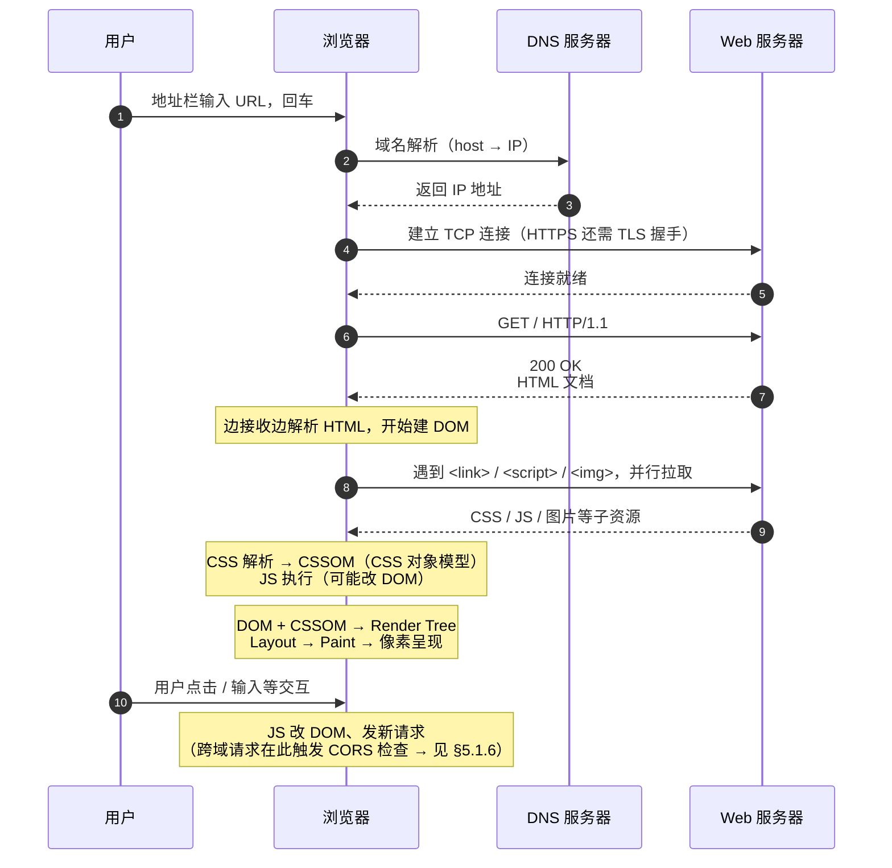
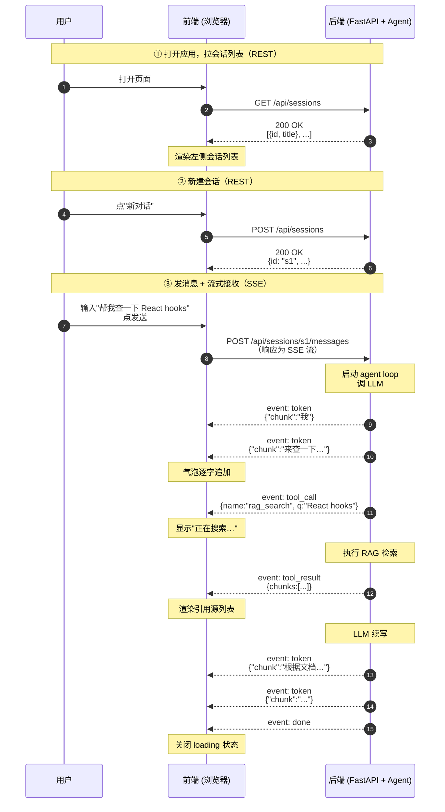
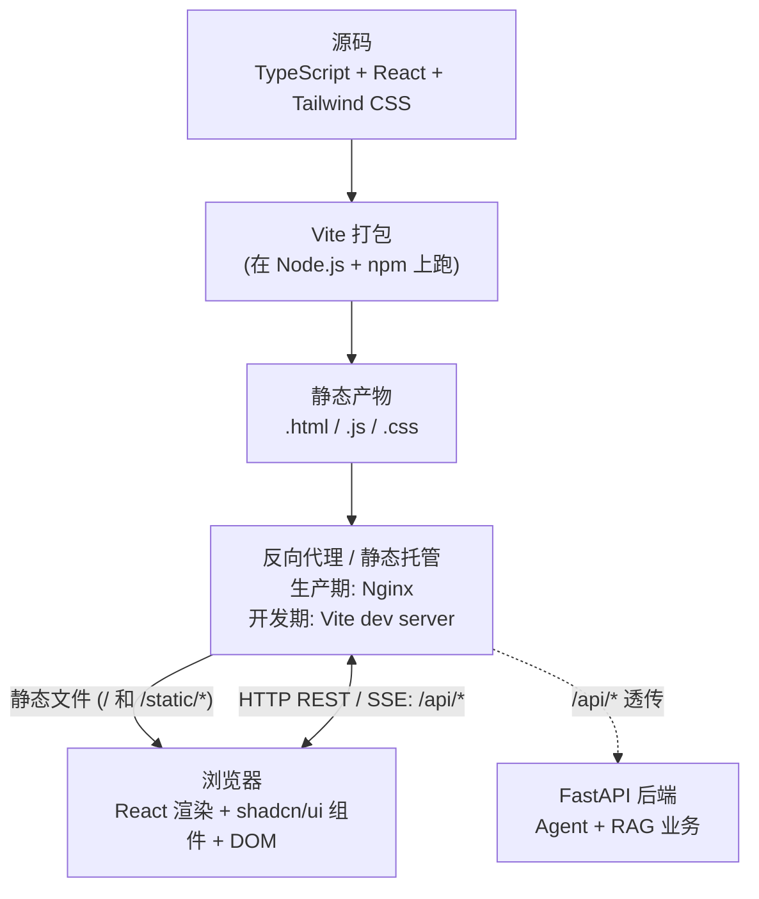

# 1. 背景

RAG 和 Agent 部分都进行了优化和升级，现在开始 UI 部分。

# 2. 现状与思考

当前 Web UI 是当时的一个尝试，并非真实需求，也没有仔细设计。是对当时CLI 功能的界面化，完全不符合 UI 本身的特性，要从头全新设计。

当前项目实现了 web UI draft，选择的是用 chainlit 来实现。
思考：当前项目做 desk app UI 还是 Web UI？→ 选 Web UI
技术选型：Vite + React vs Next.js -> 在学习完基础知识后决定

学习方式：实践 > 理论
1. 理解前/后端基本概念和框架
2. 需求定义：先知道要什么，然后再决定用什么做、如何做。
3. 技术选型：了解技术栈，知道什么工具是干什么的
4. 在 AI 辅助下完成代码

# 3. chainlit 现状清单

| 文件 | 怎么改 |
|---|---|
| `chainlit_app.py` | 删 |
| `.chainlit/` 目录 | 删 |
| `chainlit.md` | 删 |
| `public/custom.css` | 删 |
| `public/custom.js` | 删 |
| `tools/ui_debug.ps1` | 删（新 UI 启动脚本另写） |
| `requirements.txt` | 删 `chainlit` 那行 |
| `.gitignore` | 删 `.chainlit/translations/` 段 |
| `README.md` | 删 3 处 chainlit 启动 / 介绍引用 |
| `docs/design.md` | 删 3 处架构图里 `chainlit_app._event_router` 引用 |
| `src/agent/*.py` | 删注释里的 "Chainlit" / "chainlit_app.py" 提及 |
| `src/llm/provider.py` | 删注释里的 "Chainlit" / "chainlit_app.py" 提及 |
| `src/cli/skill_loader.py`| 删注释里的 "Chainlit" / "chainlit_app.py" 提及 |
| `tests/conftest.py` | 删注释里的 "Chainlit" / "chainlit_app.py" 提及 |


# 4. 需求定义

## 4.1. 功能

chat 主区交互：
- 流式输出（thinking + token）
- 停止生成
- 消息编辑 + 重发
- 回答 regenerate（同 / 换 provider）
- 代码块 syntax highlight + copy

Agent 状态可视化：
- 📋 Plan checkbox + 单步状态
- 💭 Thinking 折叠
- 🛠 Tool call 折叠 + 详情
- 📊 Token 消耗（每轮 / 累计）
- 引用 [n] hover 预览 + jump to source

资源管理：
- 会话：新建 / 改名 / 切换 / 删除 / 清空 / 导出 md / 全文搜索
- 用户记忆：列表 / 增删改
- prompt -> `.agenta/rules.md`（查看 / 编辑）
- skills：列表 / 启停 / reload
- mcp server：列表 / 健康状态 / config 查看
- 知识库：文档列表 / 上传入库 / 入库进度 / 清库

业务面板（学习/研究助理，可扩展）：
- 学习计划
- Quiz：出题 / MCQ 答题 / 批改
- SRS：日历 + 卡片复习 + 4 档评分

系统配置：
- LLM provider（含 Thinking 开关 / budget / adaptive）
- RAG top_k 等检索参数
- 主题（亮 / 暗）
- 语言
- .env 中挑一些主要的

调试：
- 复用/优化 CLI 的调试功能 /logs 下的日志

反馈机制：
- toast（角落小条幅，自动消失）
- loading（异步进行中提示）
- error inline（错误就近显示，不弹窗）


## 4.2. UX 风格

参考 Claude 的 Web 版：

- 配色：暖白主背景 + 深灰文本 + 暖橙 accent；暗色模式翻成深棕灰 + 暖白
- 字体：英文 Inter / system-ui；中文 PingFang SC / Microsoft YaHei
- 圆角：气泡 / 卡片 ~12px；按钮 / 输入框 ~6px
- 间距：留白宽松；消息间距 ≥ 16px
- 过渡动画：温和（150–200ms ease），不夸张
- 具体 hex / 字号 / 字重实施时定

布局（参照 Claude Web）：
- 左侧栏：顶部 `[+ 新对话]` → 资源菜单（知识库 / Skills / MCP / Rules / 记忆）→ Recents 列表 → 底部用户区（账号 / 设置入口 / 主题切换 / 折叠）
- 主区顶部细条：当前 chat 标题 + model / provider 切换
- 主区 chat：消息流；sources / tools / token 作为**内嵌折叠按钮**显示在回答下方，点击才弹出
- 主区底部输入框区：输入框 + 附件 + skill 触发 + Thinking 开关
- 右侧 detail panel：**默认折叠**，点 sources / tools / token 按钮时滑出；可常驻 pin

页面布局图：

```
┌──────────────────────┬──────────────────────────────────────────────┐
│ ⚡ AgentA      ◀     │   💬 当前 chat 标题            [Qwen ▾]      │
│ ──────────────────── │ ──────────────────────────────────────────── │
│ [+ 新对话]            │                                              │
│                      │  user: …                                     │
│ 📚 知识库             │                                              │
│ 🔧 Skills            │  ai:  📋 Plan                                │
│ 🔌 MCP               │      ✅ Step 1                               │
│ 📝 Rules             │      ⏳ Step 2                               │
│ 🧠 用户记忆           │      💭 Thinking ▾                          │
│                      │      正文（流式打字中…）                       │
│ ──────────────────── │                                              │
│ 🔍 Recents           │   [📚 sources(2)] [🛠 tools(3)] [📊 token]   │
│ 今日                  │                                              │
│ · …                  │  Tabs: [Chat][计划][Quiz][SRS]               │
│ · …                  │                                              │
│ 昨日                  │  ┌───────────────────────────────────────┐  │
│ · …                  │  │ + 📎 [输入框…]                    [↑] │  │
│                      │  │   Thinking ◯                          │  │
│ ──────────────────── │  └───────────────────────────────────────┘  │
│ 👤 Michael · ⚙ · 🌙  │                                              │
└──────────────────────┴──────────────────────────────────────────────┘
```

注：sources / tools / token 内嵌按钮点击 → 右侧滑出 detail panel（默认折叠）；
左侧栏可整体折叠收成图标列。


# 5. 技术选型

## 5.1. 基础知识

### 5.1.1. 前端与后端
现在要做的 UI 就是前端，后端是 agent 和 RAG 部分。
Agent Core 提供的 agent API + agent Event 可以给 CLI 和 UI 共用。

JS/TS 常用于前端开发
python/java/go/rust 常用于后端开发

### 5.1.2. 流式输出
流式输出是指在网页上实时显示文本，而不是一次性加载所有内容。
LLM 回答是一个字一个字往外吐的。前端如果没法处理"一段一段进来的数据"，就只能等全部生成完再一次性显示，体验差很多。

后端推流给前端的两种主流方式：
- SSE（Server-Sent Events）：单向，后端 → 前端推消息，HTTP 长连接。对 chat 场景最合适，简单可靠。
- WebSocket：双向通讯，前后端都能主动发消息。比 SSE 复杂，只在双向流式场景必要（如语音对讲 / 多人协作）。

### 5.1.3. 前后端怎么对话

前端要读 / 改后端数据，靠 **HTTP 请求**。
- 请求 = method（GET / POST / PATCH / DELETE）+ URL + body
- 返回 = status code（200 OK / 4xx 客户端错 / 5xx 服务端错）+ body
- body 通常是 **JSON**（key-value 字典，前后端通用）

**REST**：一种约定 —— URL 表达"资源"，method 表达"操作"。例：
- `GET /api/sessions` 取会话列表
- `POST /api/sessions` 新建会话
- `PATCH /api/sessions/abc123` 改某个会话（如重命名标题）
- `DELETE /api/sessions/abc123` 删某个会话

URL 两种粒度：
- **集合** `/sessions` —— 所有会话
- **单体** `/sessions/{id}` —— 某一个

method 大致对应 **CRUD**（Create / Read / Update / Delete）：GET = Read，POST = Create，PATCH 或 PUT = Update，DELETE = Delete。

业界实际很少严格"纯 REST"，常被叫 "REST-like" 或 "JSON-over-HTTP"。

### 5.1.4. 网页是怎么渲染的

一张网页 = HTML（骨架）+ CSS（样式）+ JS（交互）：

- **HTML**：页面结构，嵌套标签组成（如 `<div>`、`<button>`、`<p>`）
- **CSS**（Cascading Style Sheets, 层叠样式表）：视觉样式 —— 颜色、字体、间距、布局。用法分两端：
  - HTML 端给标签贴名字：`<button class="btn">点我</button>`。`class` 是 HTML 标签的一个属性，相当于"分类标签"，名字自取，多个元素可共用同一个
  - CSS 端按名字选中、上样式：`.btn { color: white; background: blue; padding: 8px }`，开头的点号 `.` 表示"按 class 选"，意思是"凡 class 含 `btn` 的元素，涂成蓝底白字、内边距 8px"
- **JS**：跑在浏览器里的脚本，负责交互（点击、输入、网络请求……）

浏览器加载页面后，把 HTML 解析成 **DOM**（Document Object Model, 文档对象模型），内存中的一棵标签树，每个 HTML 标签是一个节点。
CSS 和 JS 都基于这棵树工作：
- CSS 按选择器匹配 DOM 节点、给它们上色 / 排版；
- JS 通过 DOM 读写页面，如 `document.getElementById('msg').textContent = '新内容'` 把某段文字换掉。后续会看到的现代 UI 框架其实也是封装了一层，最终还是改 DOM。

同一个页面，HTML 可以**在不同时机、由不同角色**生成，演化出三种主流渲染模式：

| 模式 | HTML 何时生成 / 谁来生成 | 优点 | 缺点 |
|---|---|---|---|
| **CSR**（Client-Side Rendering, 客户端渲染） | 服务器先送一个**空壳 HTML + JS 文件**；JS 在浏览器里跑起来后，动态生成页面内容 | 后端只负责返回数据，前端打包后是一堆静态文件，部署简单 | 首屏会白屏一小段（要等 JS 下载并执行完才出内容），对 SEO 不友好 |
| **SSR**（Server-Side Rendering, 服务端渲染） | 用户每次请求时，**服务端实时拼好完整 HTML** 返回 | 首屏立刻看到内容、SEO 友好（爬虫直接读到文字） | 必须 7×24 运行一个 Node.js 服务端，架构更复杂 |
| **SSG**（Static Site Generation, 静态生成） | **打包构建时**一次性把每页 HTML 全部预生成，部署为静态文件 | 部署最便宜（任何静态托管都行）、加载最快 | 内容在构建时就定死了，要更新得重新打包发布 |

相关概念说明：

- **SEO**（Search Engine Optimization, 搜索引擎优化）—— 让 Google / 百度 这类搜索引擎能抓到并收录你的页面，用户搜关键词时能搜到你。爬虫主要读 HTML 文本：CSR 给爬虫的是空壳 HTML、抓不到内容；SSR / SSG 直接把内容写进 HTML、爬虫秒读，收录效果好。
- **静态托管 vs Node.js 服务端** —— CSR / SSG 打包出来的是一堆**静态文件**（`.html` / `.js` / `.css`），扔到 Nginx 目录、对象存储、GitHub Pages 这类静态托管就行，没有进程要养。SSR 不一样：每次用户请求都要在**服务端跑 JS 代码**临时拼 HTML 返回，所以必须有一个 24/7 运行的 Node.js 进程 —— 装 Node 运行时 → `npm start` 起进程 → 用 PM2 / systemd / 容器守护（崩了自动重启）→ 配 Nginx 反向代理 → 监控、日志、按流量扩容…… 跟部署一个 FastAPI 服务一个套路，只是技术栈换成 Node。

### 5.1.5. 浏览器加载流程

输入网址 → 看到页面:



几个关键点：

- **DNS / TCP / TLS** 是 HTTP 之下的网络层基础，浏览器自动完成。
- **HTML 流式解析**：浏览器拿到 HTML 是边下载边解析的，不等全部下完。所以越靠前的内容能越早出现在屏幕上
- **子资源并行加载**：HTML 里出现 `<link rel="stylesheet" href="style.css">` / `<script src="app.js">` / `` 时，浏览器**立即并行发起**这些请求，不等 HTML 解析完
- **JS 默认会阻塞 HTML 解析**：遇到 `<script>` 标签浏览器要停下 HTML 解析、先下载并执行 JS，再继续解析。可以加 `async`（下完就执行、不保证顺序）或 `defer`（下完先存着，等 HTML 解析完再执行）来避免阻塞
- **渲染**：DOM（HTML 解析结果）+ CSSOM（CSS 解析结果）合成 **Render Tree**（实际要画的节点）→ **Layout**（算每个节点的位置和大小）→ **Paint**（往屏幕上画像素）
- **交互期**：页面首次渲染完后，用户的每次操作（点击 / 输入 / 滚动）触发 JS 跑，JS 可能改 DOM（视图更新）、可能发新请求（fetch / SSE / WebSocket），这条线一直跑到关闭页面

### 5.1.6. 浏览器安全机制：CORS

**CORS**（Cross-Origin Resource Sharing, 跨域资源共享）：浏览器的一项安全机制 —— 默认不允许网页向**不同来源**的服务发请求。"来源"指 URL 的 `scheme + host + port` 三者组合（**scheme** = 协议，如 `http` / `https`；**host** = 域名或 IP；**port** = 端口号），任意一个不同就算"跨域"。例如 `http://localhost:8000` 三段分别是 `http` / `localhost` / `8000`。

**谁跟谁比、什么时候比**：浏览器记住"当前网页是从哪个 URL 加载来的"（地址栏 URL 对应的来源）。当网页里的 JS 发起请求（`fetch` / `XHR` / 打开 SSE 流等，对应 §5.1.5 流程图最后一段"交互期"）时，浏览器拿**网页自身的来源** vs **请求目标的来源**比一下 —— 不同则触发 CORS 检查。

例：你访问 `http://localhost:5173/index.html`（**网页来源** = `http://localhost:5173`），网页里的 JS 跑 `fetch('http://localhost:8000/api/sessions')`（**请求目标来源** = `http://localhost:8000`），端口不同 → 跨域 → 浏览器拦下请求、抛 CORS 错。**注意：拦截发生在浏览器这一层、不在后端**，后端代码很可能根本不知道有这次失败请求。

两种思路（互补，开发期和生产期都各有对应办法）：

**思路 A：让浏览器看到同源 → 跨域检查根本不触发**

把前端和后端"伪装"成同一来源，浏览器查不出跨域。开发期 / 生产期各自有现成方案：

- **开发期**：前端 dev server（开发期间在本机临时起的 HTTP 服务，给前端代码用 —— 详见 §5.1.7）配置一个代理，把所有 `/api/*` 请求转发给后端
- **生产期**：Nginx / Caddy 等反向代理把前端静态文件和后端 API 挂在**同一个域名**下、按路径分发（如 `https://myapp.com/` 给前端、`https://myapp.com/api/*` 转后端）

这是**主流单用户 / 单部署**项目的默认做法 —— 既无 CORS 烦恼、也避免暴露后端真实端口给外网。

**思路 B：后端启用 CORS → 浏览器放行真正的跨域请求**

如果前后端**就是要部署在不同域**（例如 `app.myapp.com` ↔ `api.myapp.com`，或后端给多个不同前端共用），那真有跨域 —— 这时让后端在响应里加 `Access-Control-Allow-Origin` 这类 header，明确告诉浏览器"这些来源我允许"。例如 FastAPI 加一行 `app.add_middleware(CORSMiddleware, allow_origins=[...])` 即可。

回到你可能的疑问：**dev server 只在开发期跑，那生产 CORS 怎么办？**—— dev server 在开发期顶替了思路 A 中"反向代理"那个角色；生产期换成 Nginx 接手，**同一个"让浏览器看到同源"思路** 跑两套实现。两边底层逻辑一致，不存在断层。

### 5.1.7. 前端工程化基础

写前端真正的"开发体验"，绕不开下面 6 件配套设施。**它们都属于工具链**，跟最终浏览器里跑的代码无关，但每次开发都会用到。

**(1) Node.js**：脱离浏览器的 JavaScript 运行时。和 §5.1.4 SSR 提到的"Node 服务端"是同一个东西，但**前端工具链跑在 Node 上是另一码事** —— 即便最终产物给浏览器跑（CSR），打包、压缩、起 dev server 这些**开发时**的脚本都靠 Node。**你写 CSR 前端、可以不部署 Node 服务端，但开发机上必须装 Node**。

**(2) npm**（Node Package Manager）：JS 圈的包管理器，类比 Python 的 `pip`。命令也很像：

| Python | JS |
|---|---|
| `pip install requests` | `npm install react`（简写 `npm i react`） |
| `pip install -r requirements.txt` | `npm install`（自动读 `package.json`） |
| `python -m my_module` | `npm run <script名>` |

`yarn` / `pnpm` 是 npm 的替代品，能力近似、`pnpm` 更省磁盘，本项目用哪个不影响概念理解。

**(3) `package.json` + `node_modules/`**：

- `package.json`：项目清单，**类比 `requirements.txt` + `setup.py` 合体**。列出依赖、版本、可执行脚本（`scripts` 字段定义 `npm run dev` 这种快捷命令）
- `node_modules/`：依赖装在这里（**类比 venv 的 `site-packages/`**）；体积大、不进 git，靠 `package.json` + `package-lock.json` 锁定版本，重装就 `npm install`

**(4) 模块系统**（`import` / `export`）：JS 也有 import / export，类比 Python：

| Python | JS |
|---|---|
| `from utils import format_time` | `import { formatTime } from './utils'` |
| `import utils` | `import utils from './utils'`（默认导出） |
| 文件即模块 | 文件即模块 |

每个组件 / 工具放一个 `.ts` / `.tsx` 文件、跨文件 `import`，跟 Python 一个习惯。

**(5) 打包**（bundle）：浏览器只认 `.html` / `.js` / `.css`，不认 `.tsx`、不认 `import './foo'` 这种相对路径源码。**打包工具**把整个项目源码：

- 编译：`.tsx`（TypeScript + JSX）→ `.js`
- 合并：解析 `import` 图，把几百个源文件合成几个 bundle 文件
- 压缩：删空格、混淆变量名、tree-shaking 砍掉没用到的代码
- 输出：一个 `dist/` 目录，里面是浏览器能直接消化的产物

**(6) dev server**：工程化工具链的另一件核心 —— **开发期间**临时起的本地 HTTP 服务（典型 `http://localhost:某端口`），让浏览器能直接访问你正在改的前端代码。除了起服务，通常还包含：

- **实时编译**：浏览器请求时把 `.tsx` 这类源码现场转译成 `.js` 发回
- **热刷新**（Hot Module Replacement, HMR）：改源文件后**浏览器自动**显示新结果，不用手动 F5
- **代理转发**：把 `/api/*` 之类请求转到后端（§5.1.6 CORS 思路 A 在开发期就靠它）

注意：dev server 只在**开发时**跑；打包发布后前端产物变成纯静态文件由 Nginx / 静态托管直接吐给浏览器，dev server 不再参与。

类比 Python：dev server ≈ FastAPI 的 `uvicorn --reload` 模式，区别是它服务的不是 API、是**前端代码**给浏览器消化。

打包和 dev server 通常由**同一套工具**一起提供（如 Vite、Webpack、Parcel、Rsbuild 等）；具体选哪个放 §5.2 / §5.3 聊。

### 5.1.8. 浏览器开发者工具

浏览器自带的调试面板，前端开发必备。Chrome / Edge / Firefox 按 **F12** 或右键"检查"打开。三个最常用 tab：

| Tab | 干什么用 |
|---|---|
| **Elements** | 看当前页面实时 DOM 树、看每个元素的 CSS 样式、改样式即时生效（验证效果用） |
| **Console** | JS 报错、`console.log()` 输出（前端的 `print`）、可现场跑 JS 表达式 |
| **Network** | 监听所有 HTTP 请求 / 响应：URL、method、status、headers、body 都能看。**SSE 流也能看到事件一条条进来**，调试 chat 流式特别有用 |

后面调前后端联调遇到问题，第一反应就是开 Network 看请求；遇到页面挂了开 Console 看报错。

### 5.1.9. 声明式 vs 命令式

现代主流 UI 框架（React / Vue / Svelte / Solid / Angular…）都基于同一种思路写 UI。先看两种风格的区别：

- **命令式**（imperative）：一步步告诉机器**怎么做** —— 先找到元素、再改它的属性。`document.getElementById('msg').textContent = '新内容'`（§5.1.4 出现过）就是典型命令式：你亲自操刀 DOM
- **声明式**（declarative）：只描述"**结果长啥样**"，怎么从当前状态变成目标状态由框架算

类比一下"你跟机器说的话"：

| 风格 | 说法 |
|---|---|
| 命令式 | "把那个 div 的字改成『新内容』；再加一个 div 显示『又一条』；再隐藏第三个 div……" |
| 声明式 | "这块区域应该显示当前 `messages` 数组里的每一条消息" |

声明式的核心是 **UI = f(state)**：你只管维护**数据状态**（state），UI 是数据的**函数**；状态变了，框架自动 diff 出哪些 DOM 节点要改、再去改。写交互的脑力负担小很多。

命令式时代以 jQuery 为代表；现在主流 UI 框架基本都是声明式。

### 5.1.10. 完整流程：一次 agent 对话



关键点：

- **拉列表 / 新建会话**用普通 REST：请求一次、响应一次，body 是完整 JSON
- **发消息后改用 SSE**：单向长连接，后端边产 token 边推；前端边收边渲染，不等全部完成
- **Agent 内部 loop 在后端展开**（LLM → tool call → tool result → 续写）；前端只需识别 SSE 事件类型（`token` / `tool_call` / `tool_result` / `done`），不必懂 agent 状态机
- **同一个 session id 串起来**：之后所有对话事件都挂在 `/api/sessions/s1/...` 下，刷新页面也能从 DB 恢复

## 5.2. 相关技术

### 5.2.1. 概述

**加粗** 的是目前倾向。

| 层 | 角色 | 候选 / 倾向 |
|---|---|---|
| **语言层** | 浏览器最终消化的代码 + 写代码用的语言 | HTML / CSS / JavaScript / **TypeScript** |
| **工程化层** | 开发期工具链：运行时 + 包管理 + 构建打包 | **Node.js**（运行时）/ **npm**（包管理）/ **Vite**（或 Webpack）|
| **前端 UI 层** | 浏览器里运行时的框架、样式方案、组件库 | UI 框架 **React**（或 Vue / Svelte / Next.js）<br/>样式 **Tailwind CSS**（或原生 CSS / CSS-in-JS）<br/>组件库 **shadcn/ui**（或 MUI / Ant Design）|
| **通信层** | 前后端通信协议 | **HTTP REST**（常规请求）/ **SSE**（chat 流式响应）/ WebSocket（本项目不用）|
| **后端层** | Python 服务 + 业务代码 | **FastAPI** + 项目已有 **Agent + RAG** |
| **部署层** | 生产环境反向代理 + 静态托管 | **Nginx**（或 Caddy / 静态托管平台）|

整体架构与数据流：



读图要点：

- **垂直流向是构建管线**：源码 → Vite 打包 → 静态产物 → 反向代理托管 → 浏览器消化。整个链路在**部署一次**之后就稳定不变
- **水平流向是请求往返**：浏览器和后端之间的通信都走**同一道反向代理**：静态文件请求落到代理本地、`/api/*` 透传到后端进程（同源化，规避 CORS —— §5.1.6 思路 A）
- **开发期 vs 生产期**：架构同构、中间那层"反向代理"的实现不一样 ——
  - 开发期 = Vite dev server 顶替（同时承担打包 + 转译 + 代理 + HMR 热刷新）
  - 生产期 = Nginx 顶替（只做静态托管 + 代理，不再编译；JS 真正在浏览器里跑）

### 5.2.2. HTML
### 5.2.3. CSS
### 5.2.4. FastAPI
### 5.2.5. React
### 5.2.6. Tailwind CSS
### 5.2.7. shadcn/ui
### 5.2.8. TypeScript
### 5.2.9. Vite

## 5.3. 选型决策

FastAPI + Vite + React + shadcn/ui
VS
FastAPI + Next.js + shadcn/ui

拖拽入库？

# 6. 实现

