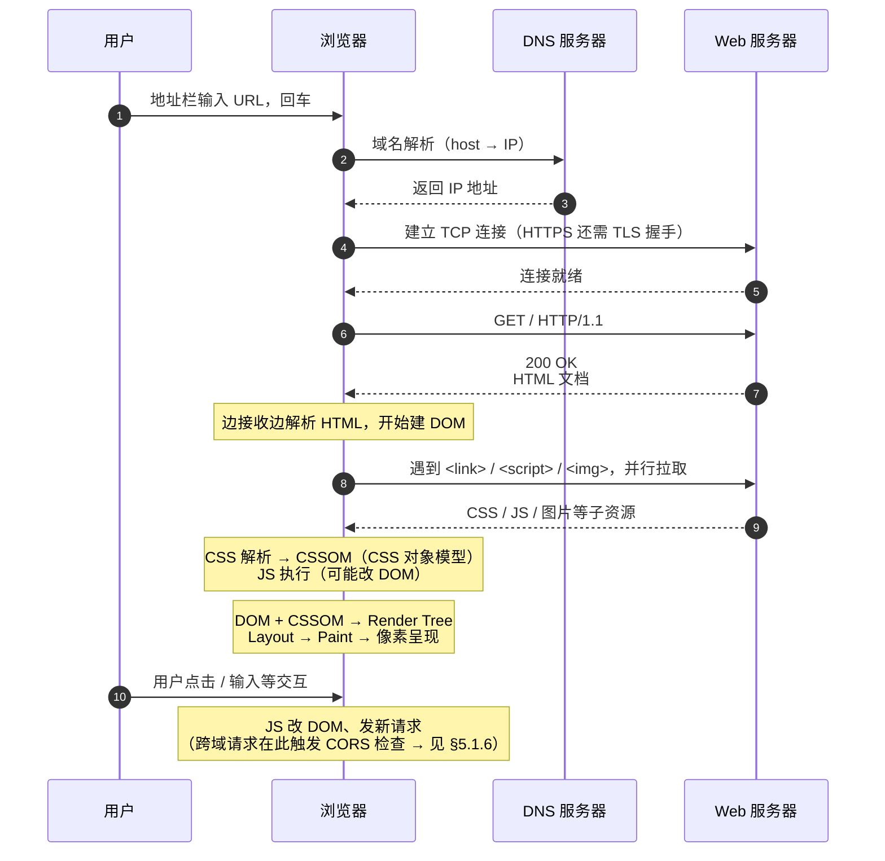
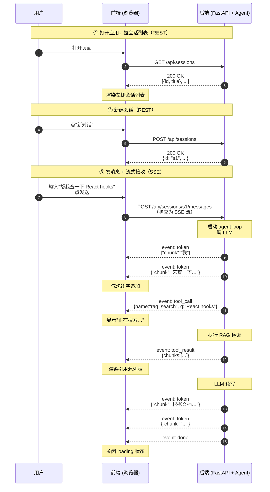
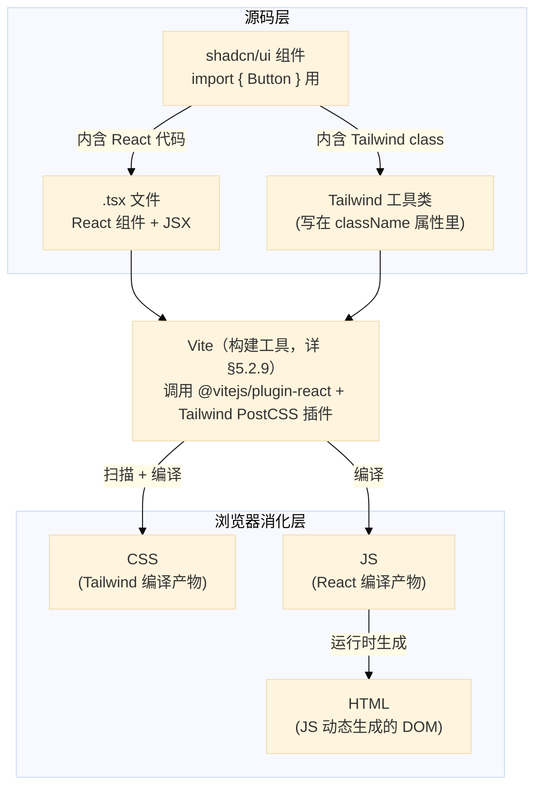
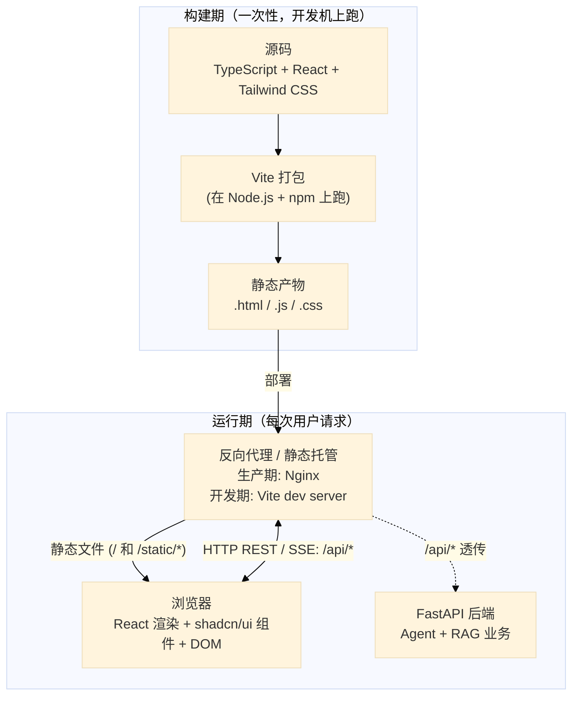
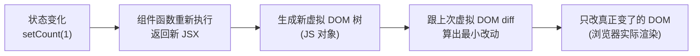
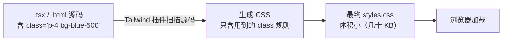
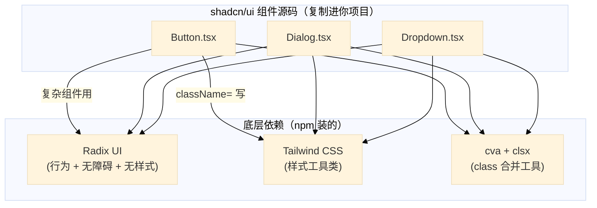
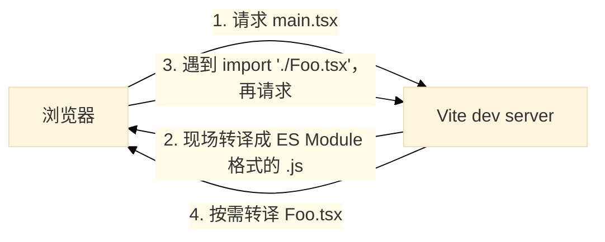
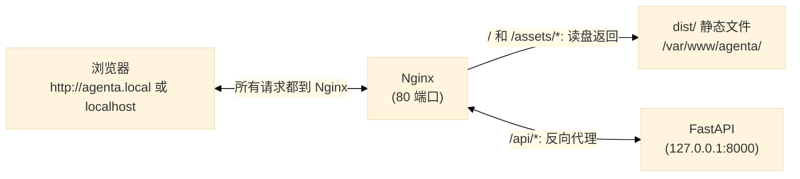
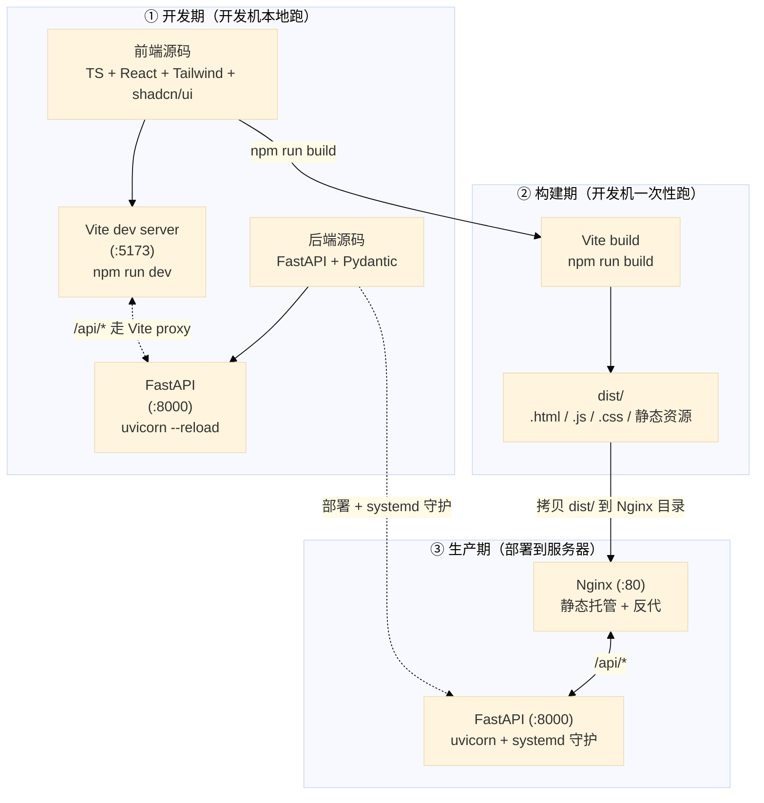

# 1. 背景

RAG 和 Agent 部分都进行了优化和升级，现在开始 UI 部分。

# 2. 现状与思考

当前 Web UI 是当时的一个尝试，并非真实需求，也没有仔细设计。是对当时CLI 功能的界面化，完全不符合 UI 本身的特性，要从头全新设计。

当前项目实现了 web UI draft，选择的是用 chainlit 来实现。
思考：当前项目做 desk app UI 还是 Web UI？→ 选 Web UI
技术选型：Vite + React vs Next.js -> 在学习完基础知识后决定

学习方式：实践 > 理论
1. 理解前/后端基本概念和框架
2. 需求定义：先知道要什么，然后再决定用什么做、如何做。
3. 技术选型：了解技术栈，知道什么工具是干什么的
4. 在 AI 辅助下完成代码

# 3. chainlit 现状清单

| 文件 | 怎么改 |
|---|---|
| `chainlit_app.py` | 删 |
| `.chainlit/` 目录 | 删 |
| `chainlit.md` | 删 |
| `public/custom.css` | 删 |
| `public/custom.js` | 删 |
| `tools/ui_debug.ps1` | 删（新 UI 启动脚本另写） |
| `requirements.txt` | 删 `chainlit` 那行 |
| `.gitignore` | 删 `.chainlit/translations/` 段 |
| `README.md` | 删 3 处 chainlit 启动 / 介绍引用 |
| `docs/design.md` | 删 3 处架构图里 `chainlit_app._event_router` 引用 |
| `src/agent/*.py` | 删注释里的 "Chainlit"  |
| `src/llm/provider.py` | 删注释里的 "Chainlit"  |
| `src/cli/skill_loader.py`| 删注释里的 "Chainlit"  |
| `tests/conftest.py` | 删注释里的 "Chainlit"  |


# 4. 需求定义

## 4.1. 功能

chat 主区交互：
- 流式输出（thinking + token）
- 停止生成
- 消息编辑 + 重发
- 回答 regenerate（同 / 换 provider）
- 代码块 syntax highlight + copy

Agent 状态可视化：
- 📋 Plan checkbox + 单步状态
- 💭 Thinking 折叠
- 🛠 Tool call 折叠 + 详情
- 📊 Token 消耗（每轮 / 累计）
- 引用 [n] hover 预览 + jump to source

资源管理：
- 会话：新建 / 改名 / 切换 / 删除 / 清空 / 导出 md / 全文搜索
- 用户记忆：列表 / 增删改
- prompt -> `.agenta/rules.md`（查看 / 编辑）
- skills：列表 / 启停 / reload
- mcp server：列表 / 健康状态 / config 查看
- 知识库：文档列表 / 上传入库 / 入库进度 / 清库

业务面板（学习/研究助理，可扩展）：
- 学习计划
- Quiz：出题 / MCQ 答题 / 批改
- SRS：日历 + 卡片复习 + 4 档评分

系统配置：
- LLM provider（含 Thinking 开关 / budget / adaptive）
- RAG top_k 等检索参数
- .env 中挑一些主要的
- 主题（亮 / 暗）
- 语言

反馈机制：
- toast（角落小条幅，自动消失）
- loading（异步进行中提示）
- error inline（错误就近显示，不弹窗）

调试：
- 复用/优化 CLI 的调试功能 /logs 下的日志


## 4.2. UX 风格

参考 Claude 的 Web 版：

- 配色：暖白主背景 + 深灰文本 + 暖橙 accent；暗色模式翻成深棕灰 + 暖白
- 字体：英文 Inter / system-ui；中文 PingFang SC / Microsoft YaHei
- 圆角：气泡 / 卡片 ~12px；按钮 / 输入框 ~6px
- 间距：留白宽松；消息间距 ≥ 16px
- 过渡动画：温和（150–200ms ease），不夸张
- 具体 hex / 字号 / 字重实施时定

布局（参照 Claude Web）：
- 左侧栏：顶部 `[+ 新对话]` → 资源菜单（知识库 / Skills / MCP / Rules / 记忆）→ Recents 列表 → 底部用户区（账号 / 设置入口 / 主题切换 / 折叠）
- 主区顶部细条：当前 chat 标题 + model / provider 切换
- 主区 chat：消息流；sources / tools / token 作为**内嵌折叠按钮**显示在回答下方，点击才弹出
- 主区底部输入框区：输入框 + 附件 + skill 触发 + Thinking 开关
- 右侧 detail panel：**默认折叠**，点 sources / tools / token 按钮时滑出；可常驻 pin

页面布局图：

```
┌──────────────────────┬──────────────────────────────────────────────┐
│ ⚡ AgentA      ◀     │   💬 当前 chat 标题            [Qwen ▾]      │
│ ──────────────────── │ ──────────────────────────────────────────── │
│ [+ 新对话]            │                                              │
│                      │  user: …                                     │
│ 📚 知识库             │                                              │
│ 🔧 Skills            │  ai:  📋 Plan                                │
│ 🔌 MCP               │      ✅ Step 1                               │
│ 📝 Rules             │      ⏳ Step 2                               │
│ 🧠 用户记忆           │      💭 Thinking ▾                          │
│                      │      正文（流式打字中…）                       │
│ ──────────────────── │                                              │
│ 🔍 Recents           │   [📚 sources(2)] [🛠 tools(3)] [📊 token]   │
│ 今日                  │                                              │
│ · …                  │  Tabs: [Chat][计划][Quiz][SRS]               │
│ · …                  │                                              │
│ 昨日                  │  ┌───────────────────────────────────────┐  │
│ · …                  │  │ + 📎 [输入框…]                    [↑] │  │
│                      │  │   Thinking ◯                          │  │
│ ──────────────────── │  └───────────────────────────────────────┘  │
│ 👤 Michael · ⚙ · 🌙  │                                              │
└──────────────────────┴──────────────────────────────────────────────┘
```

注：sources / tools / token 内嵌按钮点击 → 右侧滑出 detail panel（默认折叠）；
左侧栏可整体折叠收成图标列。


# 5. 技术选型

## 5.1. 基础知识

### 5.1.1. 前端与后端
现在要做的 UI 就是前端，后端是 agent 和 RAG 部分。
Agent Core 提供的 agent API + agent Event 可以给 CLI 和 UI 共用。

JS/TS 常用于前端开发
python/java/go/rust 常用于后端开发

### 5.1.2. 流式输出
流式输出是指在网页上实时显示文本，而不是一次性加载所有内容。
LLM 回答是一个字一个字往外吐的。前端如果没法处理"一段一段进来的数据"，就只能等全部生成完再一次性显示，体验差很多。

后端推流给前端的两种主流方式：
- SSE（Server-Sent Events）：单向，后端 → 前端推消息，HTTP 长连接。对 chat 场景最合适，简单可靠。
- WebSocket：双向通讯，前后端都能主动发消息。比 SSE 复杂，只在双向流式场景必要（如语音对讲 / 多人协作）。

### 5.1.3. 前后端怎么对话

前端要读 / 改后端数据，靠 **HTTP 请求**。
- 请求 = method（GET / POST / PATCH / DELETE）+ URL + body
- 返回 = status code（200 OK / 4xx 客户端错 / 5xx 服务端错）+ body
- body 通常是 **JSON**（key-value 字典，前后端通用）

**REST**：一种约定 —— URL 表达"资源"，method 表达"操作"。例：
- `GET /api/sessions` 取会话列表
- `POST /api/sessions` 新建会话
- `PATCH /api/sessions/abc123` 改某个会话（如重命名标题）
- `DELETE /api/sessions/abc123` 删某个会话

URL 两种粒度：
- **集合** `/sessions` —— 所有会话
- **单体** `/sessions/{id}` —— 某一个

method 大致对应 **CRUD**（Create / Read / Update / Delete）：GET = Read，POST = Create，PATCH = Update，DELETE = Delete。

业界实际很少严格"纯 REST"，常被叫 "REST-like" 或 "JSON-over-HTTP"。

### 5.1.4. 网页是怎么渲染的

一张网页 = HTML（骨架）+ CSS（样式）+ JS（交互）：

- **HTML**：页面结构，嵌套标签组成（如 `<div>`、`<button>`、`<p>`）
- **CSS**（Cascading Style Sheets, 层叠样式表）：视觉样式 —— 颜色、字体、间距、布局。用法分两端：
  - HTML 端给标签贴名字：`<button class="btn">点我</button>`。`class` 是 HTML 标签的一个属性，相当于"分类标签"，名字自取，多个元素可共用同一个
  - CSS 端按名字选中、上样式：`.btn { color: white; background: blue; padding: 8px }`，开头的点号 `.` 表示"按 class 选"，意思是"凡 class 含 `btn` 的元素，涂成蓝底白字、内边距 8px"
- **JS**：跑在浏览器里的脚本，负责交互（点击、输入、网络请求……）

浏览器加载页面时，会把 HTML 解析成 **DOM**（Document Object Model, 文档对象模型）—— 内存中的一棵标签树，每个 HTML 标签是一个节点。
CSS 和 JS 都基于这棵树工作：
- CSS 按选择器匹配 DOM 节点、给它们上色 / 排版；
- JS 通过 DOM 读写页面，如 `document.getElementById('msg').textContent = '新内容'` 把某段文字换掉。现代 UI 框架（React / Vue / Svelte / Solid / Angular…）是封装了一层，最终还是改 DOM。

同一个页面，HTML 可以**在不同时机、由不同角色**生成，演化出三种主流渲染模式：

| 模式 | HTML 何时生成 / 谁来生成 | 优点 | 缺点 |
|---|---|---|---|
| **CSR**（Client-Side Rendering, 客户端渲染） | 服务器先送一个**空壳 HTML + JS 文件**；JS 在浏览器里跑起来后，动态生成页面内容 | 后端只负责返回数据，前端打包后是一堆静态文件，部署简单 | 首屏会白屏一小段（要等 JS 下载并执行完才出内容），对 SEO 不友好 |
| **SSR**（Server-Side Rendering, 服务端渲染） | 用户每次请求时，**服务端实时拼好完整 HTML** 返回 | 首屏立刻看到内容、SEO 友好（爬虫直接读到文字） | 必须 7×24 运行一个 Node.js 服务端，架构更复杂 |
| **SSG**（Static Site Generation, 静态生成） | **打包构建时**一次性把每页 HTML 全部预生成，部署为静态文件 | 部署最便宜（任何静态托管都行）、加载最快 | 内容在构建时就定死了，要更新得重新打包发布 |

相关概念说明：

- **SEO**（Search Engine Optimization, 搜索引擎优化）—— 让 Google / 百度 这类搜索引擎能抓到并收录你的页面，用户搜关键词时能搜到你。爬虫主要读 HTML 文本：CSR 给爬虫的是空壳 HTML、抓不到内容；SSR / SSG 直接把内容写进 HTML、爬虫秒读，收录效果好。
- **静态托管 vs Node.js 服务端** —— CSR / SSG 打包出来的是一堆**静态文件**（`.html` / `.js` / `.css`），扔到 Nginx 目录、对象存储、GitHub Pages 这类静态托管就行，没有进程要养。SSR 不一样：每次用户请求都要在**服务端跑 JS 代码**临时拼 HTML 返回，所以必须有一个 24/7 运行的 Node.js 进程 —— 装 Node 运行时 → `npm start` 起进程 → 用 PM2 / systemd / 容器守护（崩了自动重启）→ 配 Nginx 反向代理 → 监控、日志、按流量扩容…… 跟部署一个 FastAPI 服务一个套路，只是技术栈换成 Node。

### 5.1.5. 浏览器加载流程

输入网址 → 看到页面:



几个关键点：

- **DNS / TCP / TLS** 是 HTTP 之下的网络层基础，浏览器自动完成。
- **HTML 流式解析**：浏览器拿到 HTML 是边下载边解析的，不等全部下完。所以越靠前的内容能越早出现在屏幕上
- **子资源并行加载**：HTML 里出现 `<link rel="stylesheet" href="style.css">` / `<script src="app.js">` / `` 时，浏览器**立即并行发起**这些请求，不等 HTML 解析完
- **JS 默认会阻塞 HTML 解析**：遇到 `<script>` 标签浏览器要停下 HTML 解析、先下载并执行 JS，再继续解析。可以加 `async`（下完就执行、不保证顺序）或 `defer`（下完先存着，等 HTML 解析完再执行）来避免阻塞
- **渲染**：DOM（HTML 解析结果）+ CSSOM（CSS 解析结果）合成 **Render Tree**（实际要画的节点）→ **Layout**（算每个节点的位置和大小）→ **Paint**（往屏幕上画像素）
- **交互期**：页面首次渲染完后，用户的每次操作（点击 / 输入 / 滚动）触发 JS 跑，JS 可能改 DOM（视图更新）、可能发新请求（fetch / SSE / WebSocket），这条线一直跑到关闭页面

### 5.1.6. 浏览器安全机制：CORS

**CORS**（Cross-Origin Resource Sharing, 跨域资源共享）：浏览器的一项安全机制 —— 默认不允许网页向**不同来源**的服务发请求。"来源"指 URL 的 `scheme + host + port` 三者组合（**scheme** = 协议，如 `http` / `https`；**host** = 域名或 IP；**port** = 端口号），任意一个不同就算"跨域"。例如 `http://localhost:8000` 三段分别是 `http` / `localhost` / `8000`。

**谁跟谁比、什么时候比**：浏览器记住"当前网页是从哪个 URL 加载来的"（地址栏 URL 对应的来源）。当网页里的 JS 发起请求（`fetch` / `XHR` / 打开 SSE 流等，对应 §5.1.5 流程图最后一段"交互期"）时，浏览器拿**网页自身的来源** vs **请求目标的来源**比一下 —— 不同则触发 CORS 检查。

例：你访问 `http://localhost:5173/index.html`（**网页来源** = `http://localhost:5173`），网页里的 JS 跑 `fetch('http://localhost:8000/api/sessions')`（**请求目标来源** = `http://localhost:8000`），端口不同 → 跨域 → 浏览器拦下请求、抛 CORS 错。**注意：拦截发生在浏览器这一层、不在后端**，后端代码很可能根本不知道有这次失败请求。

两种思路（互补，开发期和生产期都各有对应办法）：

**思路 A：让浏览器看到同源 → 跨域检查根本不触发**

把前端和后端"伪装"成同一来源，浏览器查不出跨域。开发期 / 生产期各自有现成方案：

- **开发期**：前端 dev server（开发期间在本机临时起的 HTTP 服务，给前端代码用 —— 详见 §5.1.7）配置一个代理，把所有 `/api/*` 请求转发给后端
- **生产期**：Nginx / Caddy 等反向代理把前端静态文件和后端 API 挂在**同一个域名**下、按路径分发（如 `https://myapp.com/` 给前端、`https://myapp.com/api/*` 转后端）

这是**主流单用户 / 单部署**项目的默认做法 —— 既无 CORS 烦恼、也避免暴露后端真实端口给外网。

**思路 B：后端启用 CORS → 浏览器放行真正的跨域请求**

如果前后端**就是要部署在不同域**（例如 `app.myapp.com` ↔ `api.myapp.com`，或后端给多个不同前端共用），那真有跨域 —— 这时让后端在响应里加 `Access-Control-Allow-Origin` 这类 header，明确告诉浏览器"这些来源我允许"。例如 FastAPI 加一行 `app.add_middleware(CORSMiddleware, allow_origins=[...])` 即可。

回到你可能的疑问：**dev server 只在开发期跑，那生产 CORS 怎么办？**—— dev server 在开发期顶替了思路 A 中"反向代理"那个角色；生产期换成 Nginx 接手，**同一个"让浏览器看到同源"思路** 跑两套实现。两边底层逻辑一致，不存在断层。

### 5.1.7. 前端工程化基础

前端工程化涉及以下 6 个方面：运行时、依赖、约定、语言特性、构建、开发服务（开发期用，跟最终浏览器里跑的代码无关）：

**(1) Node.js**：浏览器之外的 JavaScript 运行时。既能跑后端服务，也是前端工具链（打包、dev server 等）的运行环境。

**(2) npm**（Node Package Manager）：JS 包管理器。常用命令：

| 命令 | 作用 |
|---|---|
| `npm install <pkg>`（简写 `npm i <pkg>`） | 装单个依赖到当前项目 |
| `npm install` | 按 `package.json` 一次性装全部依赖 |
| `npm run <script名>` | 跑 `package.json` 里 `scripts` 字段定义的命令（如 `npm run dev`、`npm run build`）|

`yarn` / `pnpm` 是 npm 的替代品，能力近似、`pnpm` 更省磁盘，本项目用哪个不影响概念理解。

**(3) `package.json` + `node_modules/`**：

- `package.json`：项目清单，**类比 `requirements.txt` + `setup.py` 合体**。列出依赖、版本、可执行脚本（`scripts` 字段定义 `npm run dev` 这种快捷命令）
- `node_modules/`：依赖装在这里（**类比 venv 的 `site-packages/`**）；体积大、不进 git，靠 `package.json` + `package-lock.json` 锁定版本，重装就 `npm install`

**(4) 模块系统**（`import` / `export`）：JS 也有 import / export，类比 Python：

| Python | JS |
|---|---|
| `from utils import format_time` | `import { formatTime } from './utils'` |
| `import utils` | `import utils from './utils'`（默认导出） |
| 文件即模块 | 文件即模块 |

每个组件 / 工具放一个 `.ts` / `.tsx` 文件、跨文件 `import`，跟 Python 一个习惯。

**(5) 打包**（bundle）：浏览器只认 `.html` / `.js` / `.css`，不认 `.tsx`、不认 `import './foo'` 这种相对路径源码。**打包工具**把整个项目源码：

- 编译：`.tsx`（TypeScript + JSX）→ `.js`
- 合并：解析 `import` 图，把几百个源文件合成几个 bundle 文件
- 压缩：删空格、混淆变量名、tree-shaking 砍掉没用到的代码
- 输出：一个 `dist/` 目录，里面是浏览器能直接消化的产物

**(6) dev server**：工程化工具链的另一件核心 —— **开发期间**临时起的本地 HTTP 服务（典型 `http://localhost:某端口`），让浏览器能直接访问你正在改的前端代码。除了起服务，通常还包含：

- **实时编译**：浏览器请求时把 `.tsx` 这类源码现场转译成 `.js` 发回
- **热刷新**（Hot Module Replacement, HMR）：改源文件后**浏览器自动**显示新结果，不用手动 F5
- **代理转发**：把 `/api/*` 之类请求转到后端（§5.1.6 CORS 思路 A 在开发期就靠它）

注意：dev server 只在**开发时**跑；打包发布后前端产物变成纯静态文件由 Nginx / 静态托管直接吐给浏览器，dev server 不再参与。

类比 Python：dev server ≈ FastAPI 的 `uvicorn --reload` 模式，区别是它服务的不是 API、是**前端代码**给浏览器消化。

打包和 dev server 通常由**同一套工具**一起提供（如 Vite、Webpack、Parcel、Rsbuild 等）；具体选哪个放 §5.2 / §5.3 聊。

### 5.1.8. 浏览器开发者工具

浏览器自带的调试面板，前端开发必备。Chrome / Edge / Firefox 按 **F12** 或右键"检查"打开。三个最常用 tab：

| Tab | 干什么用 |
|---|---|
| **Elements** | 看当前页面实时 DOM 树、看每个元素的 CSS 样式、改样式即时生效（验证效果用） |
| **Console** | JS 报错、`console.log()` 输出（前端的 `print`）、可现场跑 JS 表达式 |
| **Network** | 监听所有 HTTP 请求 / 响应：URL、method、status、headers、body 都能看。**SSE 流也能看到事件一条条进来**，调试 chat 流式特别有用 |

后面调前后端联调遇到问题，第一反应就是开 Network 看请求；遇到页面挂了开 Console 看报错。

### 5.1.9. 声明式 vs 命令式

现代主流 UI 框架（React / Vue / Svelte / Solid / Angular…）都基于同一种思路写 UI。先看两种风格的区别：

- **命令式**（imperative）：一步步告诉机器**怎么做** —— 先找到元素、再改它的属性。`document.getElementById('msg').textContent = '新内容'`（§5.1.4 出现过）就是典型命令式：你亲自操刀 DOM
- **声明式**（declarative）：只描述"**结果长啥样**"，怎么从当前状态变成目标状态由框架算

类比一下"你跟机器说的话"：

| 风格 | 说法 |
|---|---|
| 命令式 | "把那个 div 的字改成『新内容』；再加一个 div 显示『又一条』；再隐藏第三个 div……" |
| 声明式 | "这块区域应该显示当前 `messages` 数组里的每一条消息" |

声明式的核心是 **UI = f(state)**：你只管维护**数据状态**（state），UI 是数据的**函数**；状态变了，框架自动 diff 出哪些 DOM 节点要改、再去改。写交互的脑力负担小很多。

命令式时代以 jQuery 为代表；现在主流 UI 框架基本都是声明式。

### 5.1.10. 完整流程：一次 agent 对话



关键点：

- **拉列表 / 新建会话**用普通 REST：请求一次、响应一次，body 是完整 JSON
- **发消息后改用 SSE**：单向长连接，后端边产 token 边推；前端边收边渲染，不等全部完成
- **Agent 内部 loop 在后端展开**（LLM → tool call → tool result → 续写）；前端只需识别 SSE 事件类型（`token` / `tool_call` / `tool_result` / `done`），不必懂 agent 状态机
- **同一个 session id 串起来**：之后所有对话事件都挂在 `/api/sessions/s1/...` 下，刷新页面也能从 DB 恢复

## 5.2. 相关技术

### 5.2.1. 概述

先建立"前端三件套 vs 工具栈"的对应（理解后面各节都靠它），再列本期各层候选 + 整体架构图。

**(1) 前端三件套 vs 工具栈对应**

一张网页 = **HTML（结构骨架）+ CSS（样式）+ JavaScript（交互）** —— 这是浏览器最终消化的三种产物形式。但前端工程化时源码不是直接这三种，而是通过工具链编译出这三种。下面这套技术怎么落到三件套：

| 工具 | 你写的源码长啥样 | 最终落到浏览器哪一层 |
|---|---|---|
| **Tailwind CSS** | `class="p-4 bg-blue-500"`（直接写在 HTML 标签的 `class` 属性里） | **CSS** —— 构建时 Tailwind 扫源码、把用到的工具类生成成 CSS 规则、产出一份 `.css` 文件 |
| **React** | `.tsx` 文件（JSX 描述结构 + JS 逻辑） | **JS（兼管动态生成 HTML）** —— JSX 被编译成 JS 函数调用、运行时**动态产出 HTML 元素**插入 DOM；交互（`onClick` 等）也在 JS 里 |
| **shadcn/ui** | `import { Button } from '@/components/ui/button'`（用 React 组件） | **横跨三层** —— 它就是"已经封好的 React 组件 + 内嵌 Tailwind class"，所以同时落 JS（React 部分）、HTML（组件渲染出的结构）、CSS（内嵌 Tailwind class 编译出的样式） |

几个关键澄清：

- **React 实际上"管两层"：JS + 动态 HTML** —— 回扣 §5.1.4 的 CSR（客户端渲染）：浏览器拿到的 `index.html` 几乎是空壳（只有 `<div id="root"></div>`），整个页面结构是 JS 跑起来后**动态生成**塞进去的。React 干的就是这件事
- **Tailwind 反常的地方：不切到 `.css` 文件写** —— 传统写 CSS 是建个 `styles.css` 文件、写 `.card { padding: 1rem; ... }` 规则。Tailwind 反过来 —— 你直接在 HTML 标签 `class` 属性里组合**预定义工具类**，构建时 Tailwind 扫描源码、把用到的类生成最终 CSS。**写法上几乎不碰 `.css` 文件，但最终产物还是 CSS**
- **shadcn/ui = React + Tailwind 的成品组件套装** —— shadcn 每个组件源码大概长这样（简化版）：


React 那部分（`function Button` + JSX 标签 + `{...props}`）→ JS / 动态 HTML；`className=` 里那串 Tailwind 工具类 → CSS。用的时候 `<Button>确定</Button>` 一行调用，背后复杂 class 列表已经被组件吸收掉了 —— 这就是 §5.2.6 (5) 里"组件化封装解决 Tailwind class 一长串看着乱"的具体例子。

源码层 ↔ 浏览器层映射总览：



**(2) 按层看候选技术**

**加粗** 的是 §5.3 待决的主候选。**所有候选 §5.2 后续小节都会展开**，方便对比后再拍板。

| 层 | 角色 | 候选 |
|---|---|---|
| **语言层** | 浏览器最终消化的代码 + 写代码用的语言 | HTML / CSS / JavaScript / **TypeScript** |
| **工程化层** | 开发期工具链：运行时 + 包管理 + 构建打包 | **Node.js**（运行时）/ **npm**（包管理）/ 打包工具见 UI 层（Vite 或 Next.js 内置）|
| **前端 UI 层** | 浏览器里运行时的框架、样式方案、组件库 | UI 库 **React**（确定要用）<br/>**是否套元框架**：直接 **React + Vite**（纯 CSR） vs **Next.js**（内含 React + 自带构建 / SSR / SSG）<br/>样式 **Tailwind CSS**（或原生 CSS / CSS-in-JS）<br/>组件库 **shadcn/ui**（或 MUI / Ant Design）|
| **通信层** | 前后端通信协议 | **HTTP REST**（常规请求）/ **SSE**（chat 流式响应）/ WebSocket（本项目不用）|
| **后端层** | Python 服务 + 业务代码 | **FastAPI**（本期新加，包项目已有的 **Agent + RAG** 核心成 HTTP 接口） |
| **部署层** | 生产环境反向代理 + 静态托管 | **Nginx**（或 Caddy / 静态托管平台）|

整体架构与数据流（**以 React + Vite 候选**为例 —— Next.js 候选会内置 Vite 那一层，整体管线略有不同，§5.2.5 对比展开）：



读图要点：

- **构建期（上方框）**：源码 → Vite 打包 → 静态产物。**部署一次**之后不再跑
- **运行期（下方框）**：浏览器跟后端的所有通信都走**同一道反向代理**：静态文件请求落到代理本地、`/api/*` 透传到后端进程（同源化，规避 CORS —— §5.1.6 思路 A）
- **开发期 vs 生产期**：架构同构、中间那层"反向代理"的实现不一样 ——
  - 开发期 = Vite dev server 顶替（同时承担打包 + 转译 + 代理 + HMR 热刷新）
  - 生产期 = Nginx 顶替（只做静态托管 + 代理，不再编译；JS 真正在浏览器里跑）

### 5.2.2. JavaScript / TypeScript

**JavaScript（JS）**：浏览器原生唯一支持的脚本语言。其他语言要在浏览器跑，**必须先编译/转译到 JS**（这也是 TypeScript 存在的前提）。

几个关键点：

- **动态弱类型**：变量类型运行时定，会做**隐式转换**（如 `"1" + 1 === "11"`、`[] + {} === "[object Object]"`）—— 反直觉行为是 JS 的"坑"主要来源
- **版本叫 ECMAScript（ES）**，每年一版。**ES6（即 ES2015）是分水岭**：引入 `class` / `let` / `const` / 箭头函数 / 模板字符串 / 模块系统 等；之后大家说"现代 JS"基本指 ES6+ 的写法
- **运行环境**：浏览器是主场，**Node.js** 让它也能跑服务端 / 工具链（详 §5.1.7 (1)）

**TypeScript（TS）**：JS 的**超集** + 静态类型层。微软出品，2012 年起，现在是大型前端项目事实默认（**新 React 项目 90%+ 都用 TS**）。

- **"超集"含义**：合法 JS 就是合法 TS（不必改逻辑就能跑），TS 只是在 JS 之上**加类型标注**
- **类型擦除**：`.ts` / `.tsx` 源码经打包工具编译后变成**纯 JS**；**运行时只有 JS 在跑、TS 类型不存在**。类型只在**编译期**帮你查错 + 帮编辑器做自动补全 / 跳转 / 重构
- **为什么大家加 TS**：少踩 `undefined is not a function` 这种运行时翻车；IDE 体验明显更好；项目大起来后可维护性强

同一段代码 JS vs TS 对比：

```js
// JS
const send = async (msg) => {
  const result = await fetchData(msg.content)
  return result.text
}
```

```ts
// TS：加了类型标注
interface Message { id: string; content: string }

const send = async (msg: Message): Promise<string> => {
  const result = await fetchData(msg.content)
  return result.text
}
```

**类比 Python**：跟 Python 类型注解（`def f(x: int) -> str`）思路一致 —— **编译/编辑期检查、运行时不强制**。Python 用过类型注解的人上手 TS 概念上差别不大；差别仅在 Python 的类型是语言原生、TS 的类型是后加层。

### 5.2.3. Node.js

Node.js 是 JS 运行时、npm 是包管理器 —— 这一节从**实操**角度补全：怎么装、怎么开新项目、几个包管理器怎么选、npx 又是什么。

**(1) 安装 + 验证**

Windows 下两种装法：

| 方式 | 优点 | 缺点 |
|---|---|---|
| **官网安装包**（[nodejs.org](https://nodejs.org)） | 简单，下完即用 | 多版本切换麻烦 |
| **多版本管理工具**（如 nvm-windows / fnm） | 多版本并存，按项目切换 | 多装一层工具 |

选最新的 **LTS（Long-Term Support, 长期支持）** 版本（偶数版本号，如 22.x、24.x），维护周期长、企业项目都用它。

装完验证：

```bash
node -v   # 如 v22.10.0
npm -v    # 如 10.9.0
```

**(2) 跑 JS 脚本**


```bash
node script.js        # 跑一个文件
node                  # 进入 REPL（交互式，类似 python 命令）
```

**(3) 项目级流程：从 package.json 装齐依赖 + 跑命令**

先记住一条**核心模式**：

> **只要当前目录有 `package.json` 但缺 `node_modules/`，就 `npm install`（无参数）一把装齐**。`package.json` 怎么来的不影响 —— 脚手架生成、git clone、手写都一样。

`npm install` 命令有**两种语义**，区分清楚：

| 命令形式 | 干什么 | 典型场景 |
|---|---|---|
| `npm install`（无参数） | 读当前 `package.json`，**按清单装齐**所有依赖到 `node_modules/` | 脚手架刚生成完 / git clone 完 / 清掉 `node_modules` 想重装 |
| `npm install <包名>` | **加一个新依赖**到当前项目（同时写进 `package.json` 清单） | 开发过程中需要引入新工具 / 新库 |

**(3a) 从零起一个新项目** —— 通常**用脚手架一键生成骨架**，不会手动一步步建：

```bash
npx create-vite my-app    # 脚手架生成项目骨架：package.json、index.html、src/ 等（不装依赖）
cd my-app                 # 此时有 package.json，没有 node_modules/
npm install               # 按上面那条核心模式：读 package.json 装齐依赖
npm run dev               # 跑起来
```

教学用，也可以**手动一步步建**（实际很少这样）：

```bash
mkdir my-app && cd my-app
npm init -y                          # 手动生成最简 package.json
npm install vite                     # 加一个新依赖（自动写入 package.json）
npm install --save-dev typescript    # -D / --save-dev = 装为"开发依赖"（开发 / 构建用、运行时不需要）
# 之后手动编辑 package.json 加 scripts、自己建目录、自己写代码……
```

**(3b) 接手别人的项目**（从 git clone 拿到的代码） —— `package.json` 在仓库里，但 `node_modules/` **不进 git**（被 `.gitignore` 排除，体积大且可从清单还原）：

```bash
git clone <repo> && cd <repo>     # 此时有 package.json，没有 node_modules/
npm install                       # 同一条核心模式：读 package.json 装齐依赖
npm run dev                       # 跑起来
```

可以看到 **(3a) 和 (3b) 的 `npm install` 是同一回事** —— 都是"按 package.json 装齐"。区别只在 `package.json` 的**来源**：脚手架现写 vs git 拉下来。

**(3c) `scripts` 字段是怎么工作的**

`package.json` 里的 `scripts` 字段定义快捷命令（脚手架或前任已写好）：

```json
{
  "scripts": {
    "dev": "vite",
    "build": "vite build",
    "lint": "eslint ."
  }
}
```

执行 `npm run dev` 时，npm 找到 `scripts.dev = "vite"`，于是去 `node_modules/.bin/vite` 跑这个命令。`npm run build` / `npm run lint` 同理。
**`node_modules/.bin/` 里的工具不在系统 PATH 里、不能直接命令行调用**，必须靠 `npm run`（或 `npx`）来跑。

**(4) npm / yarn / pnpm**

三个包管理器，都能装 npm 仓库里的包：

| 工具 | 特点 | 命令示例 |
|---|---|---|
| **npm** | Node 自带、最广用、最稳定 | `npm install` / `npm run dev` |
| **yarn** | Facebook 出品，2016 因速度优势火过一阵；现在 npm 也补齐了 | `yarn add react` / `yarn dev` |
| **pnpm** | **省磁盘**：用硬链接共享全局缓存（同一个包不会被 100 个项目各装 100 份）；启动也快 | `pnpm install` / `pnpm dev` |

**命令大同小异、行为基本兼容**。本项目用 **npm**（跟 Node.js 一起装、无需额外工具）就够；如果你同时维护多个前端项目，可考虑 pnpm 省点磁盘。

**(5) npx**

**本质**：一个**智能命令运行器**。你跑 `npx <工具> <参数>` 时，它按下面顺序找 `<工具>` 然后执行：

1. **当前项目 `node_modules/.bin/` 里有？** → 直接跑
2. **没有？** → 从 npm registry **临时下载**该包到一个缓存目录（默认 `~/.npm/_npx/`）、跑完留着备下次用 —— **不写进 `package.json`、不污染 `node_modules/`、不动全局 PATH**

随 npm 5.2+ 自带（装了 Node 就有），不用额外装。

**为什么需要它**：npm 包里的 CLI 工具（`vite` / `eslint` / `create-vite` 等）必须装在 `node_modules/.bin/` 才能跑，但这目录**不在系统 PATH**，命令行打 `vite` 找不到。在 npx 出现前你只有两个不爽的选项：

| 老办法 | 怎么做 | 痛点 |
|---|---|---|
| **全局装** | `npm install -g vite` | 污染全局；不同项目要不同版本会冲突 |
| **本地装 + 写 `scripts`** | 装到本地 → `package.json` 加 `"vite": "vite"` → `npm run vite` | 一次性的命令也要写进 `scripts`，烦 |

npx 把这两个痛点一起解了：

| 场景 | npx 用法 | npx 帮你做的事 |
|---|---|---|
| 跑**本项目装好的**工具、不想加进 `scripts` | `npx vite` | 自动去 `node_modules/.bin/` 找，比敲 `./node_modules/.bin/vite` 短 |
| 跑**没装的**一次性工具 / 脚手架 | `npx create-vite my-app`<br/>`npx prettier --write .` | 自动下载、跑完缓存（下次更快），不污染项目 |
| 跑**特定版本** | `npx vite@4` | 跟项目里装的版本无关，临时切到指定版本 |

**跟 `npm run` 的关系**：

| 命令 | 跑什么 | 来源 |
|---|---|---|
| `npm run <script>` | `package.json` 里 `scripts` 字段定义的快捷命令 | **本项目长期要跑的命令** |
| `npx <pkg> [args]` | 任意 npm 包的可执行入口 | **本地装的 或 临时下载** |

简记：**`npm run` 跑自家长期脚本；`npx` 跑别人家工具（一次性或临时）**。

实务里你最常见的就两种场景：

- `npx create-xxx my-app` —— 用脚手架起新项目（§5.2.3 (3a) 那个例子就是这个）
- `npx prettier --write .` / `npx eslint --fix .` —— 临时跑代码格式化 / 检查

补一句：`yarn dlx` / `pnpm dlx` 是 yarn / pnpm 的等价物（`dlx` = download & execute），概念完全一样。

### 5.2.4. React

**(1) 是什么**

React 是 Meta 开源（2013）的**前端 UI 库**。它自己定义自己是"库"（library）而非"框架"（framework）：**只管把"状态 → 视图"这件事渲染好**，其他事（路由、构建、数据获取、状态管理）都不管，留给生态。

定位决定了：用 React 时你需要**自己拼套件**（详 (5)），但每件事都能换、职责清晰。

**(2) 跟传统 DOM 操作的思路差异**

跟传统 jQuery / 原生 DOM 操作风格反过来（§5.1.9 讲过命令式 vs 声明式）：

| 风格 | 怎么写 |
|---|---|
| **命令式**（jQuery / 原生 DOM） | 你**亲自操刀**：找到 DOM 元素 → 改它的属性 / 文本 / 类名；每次状态变化都要手动同步 |
| **React（声明式）** | 你只描述"**当前状态下 UI 长啥样**"；状态变了 React 自动算出 DOM 怎么改 |

直观对比"点击按钮、计数 +1"：

```javascript
// 命令式（jQuery / 原生）
let count = 0;
document.getElementById('btn').addEventListener('click', () => {
  count++;
  document.getElementById('display').textContent = count;
});
```

```jsx
// React（声明式）
function Counter() {
  const [count, setCount] = useState(0);
  return (
    <div>
      <span>{count}</span>
      <button onClick={() => setCount(count + 1)}>+1</button>
    </div>
  );
}
```

React 这边你**没碰任何 DOM**，只描述 "UI = `count` 这个状态对应的样子"；`setCount` 一调用、React 自动 diff 出 `<span>` 该改、改之。

**(3) 核心概念**

| 概念 | 一句话 |
|---|---|
| **组件**（component） | UI 的最小复用单位，本质是个**返回 JSX 的 JavaScript 函数**（如上面的 `Counter`） |
| **JSX** | "在 JS 里写 HTML"的语法糖，编译期被翻译成 `React.createElement(...)` 调用；同时支持 `{表达式}` 嵌入 JS |
| **props**（属性） | 父组件传给子组件的"参数"（**只读**），类似函数参数：`<Button text="确定" />` |
| **state**（状态） | 组件内部"可变数据"，靠 `useState` 等 Hook 管理；状态变 → 组件重新渲染 |
| **单向数据流** | 数据靠 props 父 → 子；子要改父的数据，靠父传一个回调下来（如 `<input onChange={...}>`） |
| **Hooks** | `useState` / `useEffect` 等以 `use` 开头的函数，React 16.8 后的标准 API，给函数组件加状态 / 副作用 |

**(4) 工作原理**



**虚拟 DOM**：React 在内存里维护一份 UI 的 JS 对象表示，**比直接操作浏览器真实 DOM 便宜得多**（真实 DOM 操作会触发 reflow / repaint）。状态变时 React 先在虚拟 DOM 里算清要改啥、再批量同步到真实 DOM。

实际写代码时这层完全**对你透明** —— 你只写组件函数、调 `setState`，diff 算法是 React 内部的事。

**(5) "用 React" 实际上是拼一套**

React 不带这些能力，要自己挑：

| 责任 | 典型选择 |
|---|---|
| 构建 / dev server | **Vite**（§5.2.9）/ Webpack / Rsbuild |
| 路由 | React Router |
| 全局状态（跨组件） | Context API / Zustand / Redux |
| 数据获取（带缓存 / 重试） | TanStack Query / SWR / 自己 `fetch` |
| 样式方案 | **Tailwind CSS**（§5.2.6）/ CSS Modules / CSS-in-JS |
| 组件库 | **shadcn/ui**（§5.2.7）/ MUI / Mantine / Ant Design |
| 表单 | React Hook Form / Formik |

加粗的是本项目候选。**Vite + Tailwind + shadcn/ui** 是当前社区里跟 React 配的"黄金组合"之一，社区有现成模板（如 `npx create-vite -- --template react-ts`），不会真的从零拼。

**(6) 编辑器体验 / 生态**

- **TypeScript**：React 跟 TS 配合极顺（组件 props 直接当 TS interface 类型）。本项目走 TS 不走 JS（§5.2.2）
- **React DevTools**：浏览器扩展（Chrome / Firefox），看组件树、看每个组件当前的 props / state，调试比命令式时代香多了（§5.1.8 浏览器 DevTools 的延伸）
- **AI 友好**：训练语料里 React 占绝对大头，Copilot / Cursor 写 React 组件相当熟

**(7) 对本项目为什么用 React**

- 候选竞品里 **Vue 也很优秀**，但：
  - **shadcn/ui 只支持 React** —— shadcn 是本项目想要的组件库（§5.2.7），Vue 对应方案（shadcn-vue 是社区移植）社区规模小一档
  - React 生态规模更大，AI 写 React 组件更熟
  - 单用户私有工具不需要 Vue 的"渐进增强"优势
- React 跟 **FastAPI + Vite + Tailwind + shadcn** 这套组合的耦合最自然
- 声明式 + 组件化匹配 Claude / ChatGPT 这类聊天 UI 的天然组件分解（消息气泡 / 工具调用块 / 侧栏 session 列表等）

跟 Next.js 的对比 + 选型决策见 §5.2.5。

### 5.2.5. React vs Next.js

这是真正需要选型的地方 —— 两者都是当前前端主流，但定位差异大。React 已在 §5.2.4 详讲，本节聚焦 Next.js 的差异 + 整体对比 + 对本项目的初步看法。

**(1) React** —— 详 §5.2.4。简言之：库 + 自拼套件（构建 / 路由 / 状态 / 样式 / 组件库都自挑），灵活、职责清晰；典型组合 `React + Vite + Tailwind + shadcn/ui + React Router + ...`。

**(2) Next.js**

Vercel 主导（2016），**基于 React 的全栈框架**。在 React 之上**预装预配**了一整套，开箱即用：

| 维度 | Next.js 做了啥 |
|---|---|
| 构建 / dev server | 内置（Turbopack / Webpack） |
| 路由 | **文件系统路由** —— `app/foo/page.tsx` 自动对应 `/foo` |
| 渲染模式 | CSR / SSR / SSG / ISR 全支持，按需混用（详见 §5.1.4） |
| 后端能力 | **API routes** / **Server Components** / **Server Actions** —— 自带一个 Node 服务端，能在同一项目里写后端接口 |
| 优化 | 图片 / 字体 / 元数据 / 代码分割 一系列开箱优化 |
| SEO | 天然友好（SSR / SSG） |

**优点**：**约定胜配置**（convention over configuration）、一站式；中大型内容站 / 电商 / 重 SEO 场景里**省事优势**明显。
**代价**：Next.js 自带的能力**大半绑定它的 Node 后端**，你不用那部分就是白搭；学习坡度也比"裸 React"陡（特别 App Router 引入 Server Components 之后）。

**(3) 整体对比**

| 维度 | React + Vite | Next.js |
|---|---|---|
| 类型 | 库 + 自己拼套件 | 一站式框架 |
| 是否带 Node 服务端 | ❌（纯前端，部署纯静态产物） | ✅（要 Node 进程跑 SSR / API routes，除非用纯静态导出） |
| 渲染模式 | CSR 为主 | CSR / SSR / SSG / ISR 灵活混用 |
| 路由 | React Router 等（显式声明） | 文件系统约定（隐式） |
| 后端 API | **不带** —— 用你自己的后端（如 FastAPI） | **内置** —— 同项目写 API routes，或调外部 |
| SEO | 默认弱（CSR），要好得自己上 SSR / 预渲染 | 默认强 |
| 学习曲线 | React 本身简单，拼装散件要花时间 | 概念多（路由约定 / RSC / 缓存策略 / Server Actions），跟模板能跑、深入要花时间 |
| 适合场景 | SPA、内部工具、跟非 Node 后端搭、个人项目 | 内容站、重 SEO 场景、要 SSR 的大型应用、想用一个项目搞前后端 |
| 部署 | `dist/` 一坨静态文件，Nginx / 任意静态托管 | 部署 Node 服务（Vercel 一键 / 自托管），或退化成静态导出 |

**(4) 对本项目的初步看法**

需求侧关键事实（来自 §1 / §4）：

- 单用户、本地 / 私有部署
- 已有 **Python 写的 Agent + RAG 核心**（`src/agent/` + `src/rag/`），目前对外只有 CLI 入口；**本期会在它之上新加一层 FastAPI** 把核心包成 HTTP 接口（详 §6 实现）
- **不需要 SEO**（私有工具，没人 Google 它）
- 主要交互：聊天、文件拖拽入库、看 session 历史；流式输出用 SSE
- "我不学前端、只提需求"

把 Next.js 的核心卖点逐条对一下：

| Next.js 卖点 | 本项目用得上吗 |
|---|---|
| SSR / SEO | ❌ 私有工具，没人搜 |
| API routes / Server Components / Server Actions | ❌ 后端确定走 FastAPI（包 Python 写的 Agent + RAG 核心），不需要再起一层 Node API |
| 文件系统路由 | 用得上，但 React Router 也能做，差别不大 |
| 图片 / 字体 / 元数据优化 | ❌ 不是内容站 |

也就是 **Next.js 给的额外能力本项目大半用不到，却要为此承担一个 Node 服务端 + 一堆复杂概念**。反观 **React + Vite**：纯静态产物 → Nginx 直接服务 → 调 FastAPI；shadcn/ui 在 React + Vite + Tailwind 这组合下也最舒服 —— 整条流程简单、可控。

所以 §5.3 会倾向 **FastAPI + Vite + React + shadcn/ui** 这条线；正式决定留给 §5.3。

### 5.2.6. Tailwind CSS

**(1) 是什么**

Tailwind CSS 是个 **utility-first CSS 框架**（utility-first = "工具类优先"）。Adam Wathan 2017 出，现在 React 生态最主流的 CSS 方案之一。

它跟传统 CSS 的思路**反过来**：

| 风格 | 怎么写 |
|---|---|
| **传统 CSS** | 自己定义 class（如 `.card`） → 给 class 写一坨样式 → HTML 里引用 class 名 |
| **Tailwind** | 框架预定义一大堆**原子级工具类**（如 `p-4` = padding 1rem、`bg-blue-500` = 蓝色背景） → 你直接在 HTML 里**组合**它们、不自己写 CSS |

直观对比同一个卡片：

```css
/* 传统 CSS */
.card {
  padding: 1rem;
  background: white;
  border-radius: 0.5rem;
  box-shadow: 0 1px 3px rgba(0,0,0,0.1);
}
```
```html
<!-- 传统 CSS：HTML 引用 class -->
<div class="card">...</div>

<!-- Tailwind：不写 CSS 文件，直接 HTML 组合工具类 -->
<div class="p-4 bg-white rounded-lg shadow">...</div>
```

**(2) 为什么这种"反常"做法反而火了**

传统 CSS 痛点 → Tailwind 怎么解：

| 传统 CSS 痛点 | Tailwind 的解法 |
|---|---|
| **命名困难** —— 给每个组件想 class 名（`card` / `card-header` / `card-title-active` ...）很累 | 不命名了，直接用预定义工具类组合 |
| **样式越积越多** —— 项目久了 CSS 几千行，改一处怕影响别处 | 样式直接在 HTML 里，删元素 = 删样式，无残留 |
| **HTML 和 CSS 文件来回跳** | 全在一个文件 |
| **没用的 class 难清理** | 构建时**自动 tree-shake**：扫描源码、只把**用到过**的 class 编译进最终 CSS，没用的全去掉 → **最终 CSS 体积非常小**（一般几十 KB） |
| **样式天马行空、跨页面不统一** | 预定义的**设计 token** 约束你的选择（见下） |

**(3) 设计 token（约束你不要乱写）**

Tailwind 不是"啥都能写"。颜色、间距、字号等都是**预定义离散值**：

| 类别 | 工具类示例 | 对应 CSS 值 |
|---|---|---|
| 间距 | `p-1` / `p-2` / `p-4` / `p-8` | `padding: 4px` / `8px` / `16px` / `32px`（按 4px 步进） |
| 颜色 | `bg-blue-500` / `text-gray-900` | 预定义色阶（每色 50/100/.../900） |
| 字号 | `text-sm` / `text-base` / `text-lg` | 14px / 16px / 18px |
| 圆角 | `rounded` / `rounded-lg` / `rounded-full` | 4px / 8px / 9999px |
| 响应式 | `md:p-8` | 中屏以上 `padding: 32px`（移动优先思路） |
| 状态 | `hover:bg-blue-600` / `focus:ring-2` | 鼠标悬停 / 聚焦时的样式 |

这种**离散约束**反过来是个优点 —— 你不会随便写 `padding: 13px` 让 UI 稀奇古怪，组件之间天然协调。需要例外时也能逃生：`p-[13px]` / `bg-[#abc123]` 用方括号包任意值。

**(4) 工作原理**



Tailwind 是个 **构建期工具**（跟 Vite 集成），运行时浏览器看到的就是一份普通 CSS。

**(5) "HTML 里 class 一长串、看着乱" 怎么办**

实际写 Tailwind 经常一个元素 class 列表很长：

```html
<button class="px-4 py-2 bg-blue-500 hover:bg-blue-600 text-white rounded-md transition">
  确定
</button>
```

确实视觉上比传统 `<button class="btn-primary">` 脏。两个常见缓解办法：

1. **组件化封装** —— React 里写一个 `<Button>` 组件、把 class 列表封进去，使用方就清爽 —— **这就是 shadcn/ui 在做的事（§5.2.7 详讲）**
2. **Prettier 插件自动排序** class —— 按一个标准顺序排，至少让长 class 列表有规律

**(6) 编辑器体验**

- VS Code 装 **Tailwind CSS IntelliSense** 插件 → 输入 `p-` 自动补全所有间距类、悬停看到对应 CSS 值
- AI 工具（Copilot / Cursor）对 Tailwind 也很熟，写起来基本是"描述意图、AI 补 class"

**(7) 对本项目为什么用 Tailwind**

- 跟 React + Vite 集成简单（一行 npm 安装 + 几行配置）
- 跟 **shadcn/ui 强绑定** —— shadcn 的组件全部用 Tailwind class 写，**用 shadcn 就要用 Tailwind**（§5.2.7）
- 默认设计 token 已经够好，单用户私有工具不需要复杂主题
- 单页应用、组件不多，最终 CSS 体积极小

### 5.2.7. shadcn/ui

**(1) 是什么**

shadcn/ui 是个人开发者 @shadcn（Vercel 工程师）2023 年发布的一套 **React 组件集合**，基于 **Radix UI**（无样式的行为层）+ **Tailwind CSS**（样式层）构建。**它不是传统意义上的"组件库"**，而是一种**新型分发方式**：你不 `npm install` 它、而是**用 CLI 把组件源码复制进你的项目**。

GitHub 80k+ 星，当前 React + Tailwind 生态里最火的组件方案，已经是事实标准。

**(2) 反常的"安装方式"：复制源码进项目**

跟传统组件库（MUI / Ant Design / Mantine）的核心差异：

| 维度 | 传统组件库 | shadcn/ui |
|---|---|---|
| 安装 | `npm install antd` → 装到 `node_modules/` | `npx shadcn@latest add button` → CLI **把 Button 的源码文件直接复制到 `src/components/ui/button.tsx`** |
| 引用 | `import { Button } from 'antd'`（从 `node_modules`） | `import { Button } from '@/components/ui/button'`（从**你自己的项目**） |
| 代码位置 | `node_modules/` 里，你不动 | 你的项目里，**你可以随便改** |
| 升级方式 | `npm update antd` | 重新跑 `npx shadcn@latest add button`（覆盖原文件） |
| 定制深度 | 受限于库提供的 API（theme / className） | **完全自由** —— 它就是你的代码，直接编辑 |

为什么这么反常？解决传统组件库两大痛点：

1. **定制难** —— 传统库每个组件只暴露有限的 props，想改细节要么硬用 `className` 强行覆盖 CSS（脆弱）、要么 fork 库（更脆弱）。shadcn 让组件源码就在你项目里，**改就行**
2. **bundle 膨胀** —— 传统库即使 tree-shake 也可能拖入运行时依赖。shadcn 只复制你用到的组件、依赖也明确（Radix + Tailwind），最终 bundle 小

代价：组件**没有自动更新**。但聊天 UI / 后台工具这类应用，组件升级频率很低，**自由度比自动更新更重要**。

**(3) 组件结构（一个 Button 长啥样）**

跑完 `npx shadcn@latest add button`，`src/components/ui/button.tsx` 大概长这样（简化版）：

```tsx
import { cva } from "class-variance-authority"
import { cn } from "@/lib/utils"

const buttonVariants = cva(
  "inline-flex items-center justify-center rounded-md text-sm font-medium ...",
  {
    variants: {
      variant: {
        default: "bg-primary text-primary-foreground hover:bg-primary/90",
        outline: "border border-input bg-background hover:bg-accent ...",
        ghost: "hover:bg-accent hover:text-accent-foreground",
      },
      size: { sm: "h-8 px-3", default: "h-9 px-4", lg: "h-10 px-8" },
    },
    defaultVariants: { variant: "default", size: "default" },
  }
)

export function Button({ className, variant, size, ...props }) {
  return (
    <button
      className={cn(buttonVariants({ variant, size }), className)}
      {...props}
    />
  )
}
```

读这段就懂结构：

- **`cva`**（class-variance-authority）—— 小工具，定义"基础 class + 按 `variant` / `size` 切不同 class"的规则
- **`cn`** —— shadcn 自带的 helper，合并 class（智能去重、支持外部 `className` 覆盖）
- **Tailwind class** —— 所有样式都靠 Tailwind 工具类堆出来（§5.2.6）
- **Radix UI** —— 这里 Button 没用到；复杂组件（Dialog / Dropdown / Tooltip 等）会用 Radix 拿到无样式的**行为基础**：焦点管理、键盘导航、屏幕阅读器支持、动画过渡

**(4) 跟 Radix / Tailwind / cva 的关系**



shadcn/ui 本质 = **把 Radix（行为）+ Tailwind（样式）+ cva（变体管理）三者粘合在一起的、可读可改的源码模板**。

**(5) 实际使用流程**

```bash
npx shadcn@latest init
# 跟着 CLI 问答选：TypeScript、Tailwind 配置位置、color scheme（默认 / new-york / ...）等

npx shadcn@latest add button
npx shadcn@latest add dialog
npx shadcn@latest add input
# 用哪个 add 哪个；每次 add 都会在 src/components/ui/ 下生成一个 .tsx 文件
```

业务代码里调用跟传统组件库**几乎一样**：

```tsx
import { Button } from "@/components/ui/button"

<Button variant="outline" onClick={handleClick}>取消</Button>
```

差别只在它的源码**就在你项目里**、你可以改。

**(6) 对本项目为什么用 shadcn/ui**

- 跟 **React + Vite + Tailwind** 组合最自然（这套组合的当前事实标准）
- 聊天 UI 需要的组件 shadcn 都有：`Button` / `Input` / `Textarea` / `ScrollArea` / `Sheet` / `Dialog` / `Tooltip` / `DropdownMenu` / `Avatar` / `Card` ……
- 美学接近 Claude / Vercel / Linear 这类现代极简风，匹配 §4.2 UX 风格目标
- **可改的源码**对自定义聊天气泡 / 工具调用块这类**非标准 UI** 很友好 —— 想改直接动源码、不用跟库的 API 较劲
- AI 友好：Cursor / Copilot 训练语料里 shadcn 出现频率极高，AI 写起来熟

替代方案为啥不选：

| 方案 | 不选的理由 |
|---|---|
| MUI / Ant Design / Mantine | 设计风格偏企业级、自带主题系统笨重、bundle 大、改细节难 |
| 完全裸 Radix + 自己写 Tailwind | 工作量太大；shadcn 已经做完了"裸 Radix + Tailwind 粘合"的最佳实践 |
| 自己从 0 写组件 | 重复造轮子 |

### 5.2.8. FastAPI

**(1) 是什么**

FastAPI 是 Sebastián Ramírez 2018 年发布的 **Python 现代 web 框架**，基于 **Starlette**（异步 web 基础库）+ **Pydantic**（基于类型提示的数据校验库）+ Python `async`/`await`。GitHub 80k+ 星，当前 Python 后端增长最快的框架之一。

定位：**API 优先**（注意是 API、不是全栈页面渲染） —— 适合给前端 / SDK / 其他服务提供 HTTP 接口。本项目正是这个用法（包 Python Agent + RAG 核心成 HTTP API 给前端调）。

**(2) 跟其他 Python web 框架的对比**

| 框架 | 定位 | 适合 |
|---|---|---|
| **Django** | 全栈 / batteries-included（电池全自带：ORM、Admin 后台、模板引擎一应俱全） | 内容站、传统 CRUD 应用、需要管理后台 |
| **Flask** | 微框架，自由组合 | 小项目、传统同步 API、教学 |
| **FastAPI** | API 优先、async-first、强类型 | 现代 RESTful API、需要高性能 / OpenAPI 文档 / 强类型 |

FastAPI 为啥火起来，靠三个东西：

1. **基于 Python 类型提示做参数校验和文档**（靠 Pydantic）
2. **原生 async/await 支持**（性能跟 Node.js / Go 不相上下）
3. **自动生成 OpenAPI / Swagger 交互式文档**

**(3) 核心：类型提示驱动一切**

最简单的例子：

```python
from fastapi import FastAPI
from pydantic import BaseModel

app = FastAPI()

class ChatRequest(BaseModel):
    session_id: str
    message: str

@app.post("/api/chat")
def chat(req: ChatRequest) -> dict:
    return {"reply": f"收到: {req.message}"}
```

就这几行，FastAPI 帮你做了：

- **请求体反序列化**：客户端发 JSON，FastAPI 按 `ChatRequest` 类型解析；字段缺失 / 类型错自动返回 422
- **请求体校验**：`session_id` 必须 str、`message` 必须 str
- **响应序列化**：函数返回 dict，FastAPI 自动 JSON 化
- **自动生成交互文档**：访问 `http://localhost:8000/docs` 看到一个 Swagger UI，能直接在网页上发请求测试
- **TypeScript 类型同步**：基于 OpenAPI 可以一键生成前端 TypeScript 类型定义（避免前后端类型不一致）

跟传统 Flask 对比，校验和错误处理的工作量差距：

```python
# Flask 写法：校验、错误处理全部手写
@app.route("/api/chat", methods=["POST"])
def chat():
    data = request.get_json()
    session_id = data.get("session_id")
    if not session_id or not isinstance(session_id, str):
        return jsonify({"error": "session_id 必须是非空字符串"}), 400
    message = data.get("message")
    if not message or not isinstance(message, str):
        return jsonify({"error": "message 必须是非空字符串"}), 400
    return jsonify({"reply": f"收到: {message}"})
```

FastAPI 把这些都交给类型系统了。

**(4) async / sync 自动适配**

路由函数可以是 sync（普通 `def`）也可以是 async（`async def`），FastAPI 自动适配：

```python
@app.get("/api/sessions")
async def list_sessions():
    return await db.fetch_sessions()  # async：FastAPI 直接 await

@app.get("/api/health")
def health():
    return {"ok": True}  # sync：FastAPI 放进 thread pool 跑、不阻塞事件循环
```

为啥这个对本项目重要：

- **LLM 调用是慢 I/O**（等 OpenAI 响应可能几秒到几十秒）→ async 让单进程能并发处理多个用户请求
- **某些库（比如 `sqlite3` / `chromadb`）不支持 async** → 用 sync 写、FastAPI 自动塞进 thread pool 跑，不用为了 async 改一切

**(5) SSE 流式响应**

§5.1.3 / §5.1.10 都提过聊天 UI 要靠 SSE 实时把 LLM 的 token 推给前端。FastAPI 写 SSE 直接：

```python
from fastapi.responses import StreamingResponse

@app.post("/api/chat/stream")
async def chat_stream(req: ChatRequest):
    async def generator():
        async for chunk in agent.stream(req.message):
            yield f"data: {chunk}\n\n"  # SSE 协议格式
    return StreamingResponse(generator(), media_type="text/event-stream")
```

浏览器侧只需 `new EventSource('/api/chat/stream')` 就能实时收到 chunk —— 是聊天 UI 流式输出的标准做法。

**(6) 部署：uvicorn**

FastAPI 自己不带 HTTP 服务器，需要 **uvicorn**（一个 ASGI 服务器）跑它：

```bash
pip install fastapi uvicorn
uvicorn src.api.main:app --host 0.0.0.0 --port 8000 --reload
# --reload: 开发期热重载，改代码自动重启（类似 §5.1.7 dev server 的 HMR）
```

生产期通常 `uvicorn + gunicorn`（多进程 worker）。本项目单用户，单进程 `uvicorn` 就够。

**(7) 对本项目为什么用 FastAPI**

- **后端核心是 Python**（Agent + RAG 在 `src/agent/` + `src/rag/`），用 Python web 框架最自然 —— 比起来要是用 Node 框架包 Python，得多一层进程交互（Subprocess 或 gRPC），徒增复杂度
- **聊天 UI 主要数据流是 SSE** —— FastAPI 的 `StreamingResponse` 写起来直接
- **Pydantic 强类型 + OpenAPI 文档** —— 哪怕单人开发也享受到 API 改动后前端类型自动同步
- **async-first** 对 LLM 这种慢 I/O 场景天然合适
- 用 Flask 理论上也行，但要自己写 JSON 校验、自己写 SSE、没自动文档；本项目用 FastAPI 不会比 Flask 写得复杂，长期省事

### 5.2.9. Vite

**(1) 是什么**

Vite（法语"快"的意思，发音 /vit/）是 **Evan You**（Vue 框架作者）2020 年出的下一代前端构建工具。"开发服务器 + 生产构建"一体，**只在开发期 + 构建期用，部署后不参与运行**（部署的是它打出的静态产物，不是 Vite 本身）。

现在是 React / Vue / Svelte / Solid 等社区的事实标准 build tool；Vue 官方脚手架、Svelte 官方脚手架、shadcn/ui 的推荐模板都基于 Vite。

**(2) 解决了 Webpack 时代的痛点**

老的 Webpack 全量打包：

- 大项目启动慢（几十秒到几分钟）
- 每次保存代码 HMR 也慢（要算依赖图、增量打包）
- 配置复杂（一个 `webpack.config.js` 动辄几百行）

Vite 做的两件事革命性改进：

| 阶段 | Webpack 做法 | Vite 做法 |
|---|---|---|
| **开发期** | 先把所有源文件打包成几个大 bundle、再让浏览器加载 | **不打包**。浏览器要哪个文件、dev server 现场转译那个文件返回（用浏览器原生 ES Modules） |
| **生产期** | 自己的 bundler 打包 | 用 **Rollup**（业界公认产物质量最高的打包器之一）打包 |

第一点是 Vite 的核心创新 —— 启动时**几乎瞬间**起，且**项目多大都一样快**（因为根本没打包）。

**(3) 开发期工作原理**



浏览器**请求一个、转译一个** —— 不是先全量打包再给浏览器，所以**项目多大、启动多快没关系**。

`node_modules/` 里的依赖（npm 包，跨项目相对稳定）走一次性预打包：用 **esbuild**（Go 写的、比传统 JS 打包器快 10-100 倍）一次性预打包成 ES Modules、缓存到 `node_modules/.vite/` 下；之后浏览器请求依赖直接从缓存返回。

**(4) HMR（Hot Module Replacement，热模块替换）**

改一行代码 → 保存 → 浏览器**毫秒级**更新；且**保留页面状态**（你已经填了一半的表单、滚到一半的位置、打开的 modal 都不丢）。

工作原理：

- Vite dev server 监听源文件变化
- 检测到改动 → 算出受影响的模块
- 通过 WebSocket 通知浏览器："这几个模块替换一下"
- 浏览器只替换那几个模块、不刷整个页面

跟传统"改完代码手动 F5"对比，HMR 极大提速反复调样式 / 调交互的过程。

**(5) 生产构建**

```bash
npm run build       # 实际跑 vite build，内部用 Rollup
```

输出到 `dist/` 目录：

```
dist/
├── index.html                       # 入口 HTML
├── assets/index-a3b9c2f1.js         # 业务 JS（合并 + 压缩 + tree-shake）
├── assets/index-d8e7f3a5.css        # 业务 CSS（Tailwind 编译产物 + 其他）
└── assets/logo-7c1f2e9b.png         # 图片 / 字体等静态资源
```

文件名带 hash → **浏览器缓存友好**（内容变 hash 变、缓存自动失效；内容不变就一直命中缓存）。

`dist/` 整个目录扔给 Nginx 静态托管即可上线（§5.2.10 详讲）。

**(6) `vite.config.ts` 关键配置**

本项目 Vite 配置文件大概长这样：

```typescript
import { defineConfig } from 'vite'
import react from '@vitejs/plugin-react'

export default defineConfig({
  plugins: [react()],
  server: {
    port: 5173,
    proxy: {
      '/api': {
        target: 'http://localhost:8000',
        changeOrigin: true,
      },
    },
  },
})
```

关键两件事：

- **`plugins: [react()]`** —— 装 React 插件（让 Vite 知道怎么转译 JSX、启用 Fast Refresh）
- **`server.proxy`** —— 开发期把所有 `/api/*` 请求代理到 FastAPI 后端（`http://localhost:8000`）。这就是 §5.1.6 CORS "思路 A：让浏览器看到同源" 在开发期的具体实现 —— 浏览器只跟 `localhost:5173` 一个来源对话，Vite dev server 在后台帮你转发 `/api/*` 到 FastAPI，**完全绕过 CORS**

**(7) 对本项目为什么用 Vite**

- 跟 **React + Tailwind + shadcn/ui** 生态深度集成，社区现成模板（`npx create-vite -- --template react-ts`）
- 启动 / HMR 速度极快，写起来体验好
- 生产构建（Rollup）产物质量高
- 配置简单（一个 10 行左右的 `vite.config.ts` 就能跑起来），跟 Webpack 配置量差一个数量级
- 内置 dev server proxy → 开发期 CORS 一行配置直接解决（§5.1.6）
- 不选 Next.js 内置 build tool 的理由：Next.js 是个全栈框架、绑定 Node 服务端，本项目用不上那些（§5.2.5 已分析）

### 5.2.10. Nginx

**(1) 是什么**

Nginx 是俄罗斯工程师 Igor Sysoev 2004 年发布的**高性能 HTTP 服务器 + 反向代理**。最初为了解决 Apache 在高并发下的性能问题，用**事件驱动 + 异步非阻塞**模型。现在是全球最广用的 web 服务器之一（活跃站点占比超过 30%，跟 Apache 并列前茅）。

发音：**engine-X**。开源 + 有商业版（Nginx Plus）。

**(2) 在本项目里干啥**

3 件事：

1. **静态文件托管** —— 把前端 `dist/` 里的 `.html` / `.js` / `.css` / 图片直接吐给浏览器
2. **反向代理** —— 把 `/api/*` 请求透传到 FastAPI 后端进程（同源化、规避 CORS —— **§5.1.6 思路 A 的生产期实现**）
3. **运维标配** —— 可选的 HTTPS、gzip 压缩、缓存 header、访问日志等

> **Nginx 不是必需的、但是最稳的选择**。本项目单用户私有部署，理论上 FastAPI 自己也能 mount 静态文件（用 `StaticFiles`）—— 但 Nginx 处理静态文件比 Python 进程快好几倍、且抗压能力强，行业惯例是用 Nginx 分担这个职责。

**(3) 跟 Vite dev server 的关系（呼应 §5.1.6 思路 A）**

| 阶段 | 谁负责"同一来源 + 路由分发"角色 |
|---|---|
| **开发期** | Vite dev server（`localhost:5173`）—— 同时承担打包 + HMR + 代理 |
| **生产期** | Nginx —— 静态文件 + `/api/*` 代理到 FastAPI |

两个不同的工具、**同一个角色**：让浏览器看到所有请求都是同源（同一个 scheme + host + port），完全绕过 CORS。

**(4) 典型 `nginx.conf` 配置**

```nginx
server {
    listen 80;
    server_name agenta.local;          # 或 localhost / IP

    # 1. 前端静态文件
    root /var/www/agenta;              # dist/ 解压到这里
    index index.html;

    # SPA 路由兜底：所有未匹配路径都返回 index.html（让 React Router 接管）
    location / {
        try_files $uri $uri/ /index.html;
    }

    # 2. /api/* 转发到 FastAPI
    location /api/ {
        proxy_pass http://127.0.0.1:8000;
        proxy_set_header Host $host;
        proxy_set_header X-Real-IP $remote_addr;

        # SSE 流式响应必需：禁用缓冲、保持长连接
        proxy_buffering off;
        proxy_read_timeout 3600s;
    }
}
```

关键 4 点：

- **`root` + `index`** —— 告诉 Nginx 静态文件在哪、默认入口是 `index.html`
- **`try_files ... /index.html`** —— **SPA 路由兜底**：浏览器访问 `/sessions/abc` 这种深链接时 Nginx 找不到该文件、返回 `index.html`、让前端 React Router 接管路由
- **`location /api/ { proxy_pass ... }`** —— `/api/*` 透传到 `localhost:8000`（FastAPI 跑在那）
- **SSE 必须 `proxy_buffering off`** —— 默认 Nginx 会**缓冲**后端响应（攒成大块再发），SSE 流式输出就废了；必须关掉缓冲 + 调大 `proxy_read_timeout` 应对长会话

**(5) HTTPS（可选，本项目暂不需要）**

如果将来需要 HTTPS（公网部署、对接需要 secure context 的浏览器 API 等）：

- 用 **Let's Encrypt** 免费证书（`certbot` 一键申请 + 自动续期）
- Nginx 监听 443 + 配 SSL 证书路径 + 80 端口跳转到 443

本项目纯本地 / 内网部署，**用 HTTP 就够**（`localhost` 浏览器视为 secure context、对应 API 限制都不触发）。

**(6) 替代品**

| 替代 | 跟 Nginx 对比 |
|---|---|
| **Caddy** | 配置文件更简洁、**自动 HTTPS**（带 Let's Encrypt 集成）；社区比 Nginx 小但够用 |
| **Traefik** | 容器原生（Docker 标签自动配路由）；适合微服务 / 多服务场景 |
| **FastAPI 直接 `app.mount(StaticFiles(...))`** | 跳过 Nginx；最简单但静态文件性能差、生产不推荐 |
| **GitHub Pages / Vercel / Netlify** | 静态托管平台、零运维；但**无法**反向代理到你的 FastAPI 后端 —— 适合纯前端 demo |

本项目用 **Nginx**，最稳、网上配置示例最多、AI 也最熟。

**(7) 对本项目的部署架构**



整套部署流程：

1. 开发机跑 `npm run build` 出 `dist/` → 拷到服务器的 Nginx 静态目录（`/var/www/agenta/`）
2. 服务器跑 `uvicorn src.api.main:app --port 8000` 起 FastAPI（用 systemd / supervisord 守护进程）
3. Nginx 配置好两个 `location` 块（静态 + `/api/*` 代理）
4. 浏览器访问域名 → Nginx → 按路径分发到静态文件 / FastAPI

部署细节（systemd 守护、容器化、备份等）放 §6 实现 / 后续运维 iter。


## 5.3. 选型决策

**最终选型**：`Python + TypeScript + FastAPI + Vite + React + Tailwind CSS + shadcn/ui + Nginx`

**技术栈分层职责**：

| 层 | 工具 / 技术 | 负责干啥 | 详见 |
|---|---|---|---|
| **前端语言** | TypeScript | 前端源码语言（JS + 类型系统） | §5.2.2 |
| **前端 UI 库** | React | 声明式 UI 渲染 + 组件化 | §5.2.4 |
| **前端样式** | Tailwind CSS | utility-first CSS 工具类 | §5.2.6 |
| **前端组件库** | shadcn/ui | 复制源码的 React 组件套装（基于 Radix UI + Tailwind） | §5.2.7 |
| **前端路由** | React Router | 浏览器内多页面切换（聊天主页 / session 详情等） | §5.2.4 (5) |
| **前端工程化运行时** | Node.js | 跑构建工具 / dev server 的 JS 运行时 | §5.2.3 |
| **前端包管理** | npm | 装依赖、跑 scripts | §5.2.3 |
| **前端构建 / dev server** | Vite | 开发期现场转译 + HMR、构建期用 Rollup 打包 | §5.2.9 |
| **后端语言** | Python | 后端源码语言（项目已有 Agent + RAG 核心） | — |
| **后端 web 框架** | FastAPI | HTTP API 路由 + Pydantic 校验 + SSE 流式响应 + OpenAPI 文档 | §5.2.8 |
| **后端 HTTP 服务器** | uvicorn | ASGI 服务器，跑 FastAPI；开发期 `--reload` 热重载 | §5.2.8 (6) |
| **通信协议** | HTTP REST + SSE | 常规请求走 REST、聊天流式响应走 SSE | §5.1.3 |
| **生产部署：反向代理 + 静态托管** | Nginx | 静态文件托管 + `/api/*` 反向代理到 FastAPI | §5.2.10 |
| **生产部署：进程守护** | systemd | 让 uvicorn 24/7 跑、崩了自动重启 | §6 |

**项目已有（不变）**：

- `src/agent/` —— Python Agent core（含三种实现：Python / LangChain / AutoGPT）
- `src/rag/` —— RAG 检索 + 重排
- `src/memory/` —— 会话历史 + memory + 复习计划存储

本期新加的就是上面表格里**所有非 Python 的工具** + 一层 FastAPI（在新目录 `src/api/` 里写）把上面三个 Python 模块包成 HTTP 接口。

**整体开发流程**：



读图要点：

- **① 开发期**：前端写 `.tsx` 源码 → Vite dev server 实时编译 + HMR；后端写 FastAPI 路由 → uvicorn 热重载。两边都跑在 localhost，浏览器只跟 `:5173` 一个来源对话，`/api/*` 由 Vite proxy 透传到 `:8000`（同源化、避 CORS —— §5.1.6 思路 A 开发期实现）
- **② 构建期**：前端 `npm run build` 一次性产出 `dist/` 静态产物
- **③ 生产期**：`dist/` 拷到服务器 Nginx 静态目录；FastAPI 用 uvicorn + systemd 守护跑在 `:8000`；Nginx 配两个 location，`/` 给静态文件、`/api/*` 反代到 FastAPI（同源化、避 CORS —— §5.1.6 思路 A 生产期实现）


# 6. 实现
## 6.1 环境准备

我用的是公司电脑，没有 admin 权限。前面实现 MCP 时已经装过 Node.js，过程详见 [`knowlege.md §8.12`](./knowlege.md) 和 [`iter_2_agent.md` 附录"环境摸底"](./iter_2_agent.md)。

**Node.js 侧现状**（2026-05-31 实证，继承 MCP 实施期）：

| 项 | 状态 | 备注 |
|---|---|---|
| Node.js v22.22.3 | ✅ | portable zip 装在 `C:\DiskD\sourceCode\node-v22.22.3-win-x64\`，已加用户 PATH（无 admin） |
| npm 10.9.8 / npx 10.9.8 | ✅ | `where.exe node` 优先解析到上述路径；Cursor IDE 自带的 helper `node.exe` 排第二位 |
| `registry.npmjs.org` 公司网络可达 | ✅ | `npx -y` 正常工作（MCP 阶段已验证 `cowsay` / `server-filesystem`） |

本期 Node 侧**无需重装**。

**Python 侧**（在现有 venv 装，全部用户级、无 admin 影响）：

| 包 | 作用 | 备注 |
|---|---|---|
| `fastapi` | Web 框架（详 §5.2.8） | 核心包 |
| `uvicorn[standard]` | **ASGI 服务器** —— 在端口监听 HTTP 请求、把请求 dispatch 给 FastAPI 应用对象、把响应写回 socket。跟 FastAPI 是"服务器 + 框架"的关系（类比 Flask + gunicorn） | `[standard]` 是 pip 的 extras 语法，多装一组可选加速 / 便利包：`httptools`（C 实现的 HTTP 解析器）/ `uvloop`（高性能 asyncio 事件循环，Linux/Mac 生效、Windows 自动跳过）/ `websockets` / `watchfiles`（`--reload` 监听文件变化）/ `python-dotenv`。不带 `[standard]` 也能跑，性能略降；装 `[standard]` 是社区惯例 |
| `python-multipart` | 解析 HTTP `multipart/form-data` 请求体（浏览器表单 + 文件上传协议格式） | 纯 Python、单一职责库。FastAPI 核心不内置 multipart 解析；只要写 `File(...)` / `Form(...)` 接收文件就必须装它，否则启动报 `Form data requires "python-multipart" to be installed`。本期 [Step 4 知识库拖拽上传](#645-step-4---知识库--拖拽入库) 必用，一次装上免得到时漏 |

`requirements.txt` 加 3 行：

```diff
+ # Web API (iter 4)
+ fastapi
+ uvicorn[standard]
+ python-multipart
```

一次性装：

```bash
pip install fastapi uvicorn[standard] python-multipart
```

**前端依赖怎么走？**

前端依赖不在 `requirements.txt`（那是 Python 那套），而在 `frontend/package.json`。这个文件**当前还不存在**，会在 [Step 0](#641-step-0---项目骨架) 通过脚手架命令自动生成 / 增量写入：

| 命令 | 自动加进 `package.json` 的典型依赖 |
|---|---|
| `npm create vite@latest frontend -- --template react-ts` | `react` / `react-dom` / `typescript` / `vite` / `@vitejs/plugin-react` |
| `npm install -D tailwindcss postcss autoprefixer` | `tailwindcss` / `postcss` / `autoprefixer` |
| `npx shadcn@latest init`（含后续 `npx shadcn@latest add <component>`） | `@radix-ui/react-*` / `class-variance-authority` / `clsx` / `tailwind-merge` / `lucide-react` |

也就是说：**前端依赖列表不需要在这里预先列**，跑完 Step 0 自然到位。本节只需关心 Python 侧。

**编辑器扩展**（Cursor / VS Code 插件市场装，可选但推荐）：

- **Tailwind CSS IntelliSense** —— class 名补全 + 悬停看对应 CSS 值（§5.2.6 (6)）
- **ESLint + Prettier** —— 前端代码风格 / 静态检查

**端口确认**：

```powershell
netstat -ano | findstr ":5173 :8000"
```

5173（Vite dev）+ 8000（FastAPI），启动前确认两个端口空闲。


## 6.2 目录/文件结构

```
AgentA/                              # 项目根
├── src/                             # 后端 Python
│   ├── agent/                       # 已有，不动
│   ├── rag/                         # 已有，不动
│   ├── memory/                      # 已有，不动
│   ├── llm/                         # 已有，不动
│   ├── cli/                         # 已有，不动
│   ├── config.py                    # 已有，按需加 API 相关配置项
│   └── api/                         # 【本期新增】FastAPI 层
│       ├── __init__.py
│       ├── main.py                  # FastAPI app + 路由挂载入口
│       ├── deps.py                  # 依赖注入：单例 Agent / Store / ...
│       ├── routes/                  # 各业务路由
│       │   ├── __init__.py
│       │   ├── health.py            # /api/health
│       │   ├── chat.py              # /api/chat/*
│       │   ├── sessions.py          # /api/sessions/*
│       │   ├── kb.py                # /api/kb/*
│       │   ├── memory.py            # /api/memory/*
│       │   ├── rules.py             # /api/rules/*
│       │   ├── skills.py            # /api/skills/*
│       │   ├── mcp.py               # /api/mcp/*
│       │   ├── config.py            # /api/config/*
│       │   └── learning.py          # /api/learning/*（业务面板）
│       └── schemas/                 # Pydantic 请求 / 响应模型
│           ├── __init__.py
│           ├── chat.py
│           ├── session.py
│           └── ...
│
├── frontend/                        # 【本期新增】前端项目（独立目录）
│   ├── package.json
│   ├── tsconfig.json
│   ├── vite.config.ts               # 含 /api/* proxy 到 :8000
│   ├── tailwind.config.ts
│   ├── postcss.config.js
│   ├── components.json              # shadcn/ui 配置
│   ├── index.html                   # 入口 HTML
│   └── src/
│       ├── main.tsx                 # React 挂载入口
│       ├── App.tsx                  # 根组件 + 路由
│       ├── components/
│       │   ├── ui/                  # shadcn/ui 组件（CLI 复制进来）
│       │   ├── chat/                # 聊天主区（MessageList / Composer / ...）
│       │   ├── sidebar/             # 左侧栏（资源菜单 / 会话列表 / ...）
│       │   └── panel/               # 右侧 detail panel
│       ├── pages/                   # 顶级页面（按 React Router 组织）
│       ├── hooks/                   # 自定义 hooks（useChatStream / useSession / ...）
│       ├── lib/                     # 通用工具（cn / 时间格式化 / ...）
│       ├── api/                     # 后端 API 客户端封装（fetch / SSE）
│       ├── store/                   # 全局状态（Zustand）
│       └── types/                   # TS 类型（部分由后端 OpenAPI 自动生成）
│
├── tests/
│   ├── test_agent_*.py              # 已有
│   ├── test_rag_*.py                # 已有
│   └── test_api_*.py                # 【本期新增】API 层 UT（用 FastAPI TestClient）
│
├── docs/
│   ├── design.md                    # 本 iter 完成后回写 "§N Web UI + API 层" 章节
│   └── iter_4_UI.md                 # 本文档
│
├── tools/
│   └── dev.ps1                      # 【可选】一键起前后端两进程
│
└── requirements.txt                 # 加 fastapi / uvicorn / python-multipart
```

**设计约定**：

- **前端独立 `frontend/`**，跟 `src/` 平行 —— 前后端依赖 / 构建 / 锁定文件互不影响
- **后端 API 层 `src/api/`，不动现有 `src/agent/` / `src/rag/`** —— API 通过 `deps.py` 拿核心模块实例（依赖注入），保持 Agent core 跟 HTTP 解耦
- **路由按业务功能拆文件**，每个文件一个 `APIRouter`，`main.py` 统一挂载 —— 避免单文件膨胀
- **Pydantic schema 单独放 `schemas/`** —— 跟路由解耦，方便复用 + 生成 OpenAPI

## 6.3 `design.md` 同步策略

**本 iter 期间**：所有 UI + API 设计写在 `iter_4_UI.md`（§6 本节就够），**不动 `docs/design.md`**。

**本 iter 完成后**：往 `docs/design.md` 加一节 **"§N. Web UI + API 层"**，写：

- 新增目录结构（`src/api/` + `frontend/`）的角色 / 边界
- API 路由总览（端点列表 + 各自职责）
- 前后端边界（什么放前端、什么放后端）
- SSE / CORS / 部署（开发 vs 生产）

**理由**：`docs/design.md` 是"**当前态架构**"文档（工程公约 §3）。本 iter 进行中代码不稳定、写进去容易过时；做完一次回写、跟最新代码对齐。这也跟之前定的"README / design 等新 UI 好了再更新"对齐。

## 6.4 分步实现

按"**先架子、后填肉**"拆 8 个 Step。每个 Step 一个里程碑、独立可验收。

| Step | 主题 | 里程碑（看得到的效果） |
|---|---|---|
| **Step 0** | 项目骨架 | 后端 `/api/health` + 前端空页 + Vite proxy 跑通 |
| **Step 1** | 最小聊天回路（非流式） | 输入框发消息、Agent 返回完整答案（一次性） |
| **Step 2** | 流式输出 + Agent 状态 | SSE 流式打字 + Thinking / Plan / Tool 折叠块 |
| **Step 3** | Session 管理 | 左侧栏会话列表、新建 / 切换 / 改名 / 删除、刷新不丢 |
| **Step 4** | 知识库 + 拖拽入库 | 拖文件 → 进度 → 入库；文档列表 / 删除 |
| **Step 5** | 其他资源管理 | rules / memory / skills / mcp 4 类 CRUD |
| **Step 6** | 系统配置 + 主题 + 反馈 + 调试 | LLM 参数面板 + 暗色模式 + toast / error / loading + 日志查看 |
| **Step 7** | 业务面板 | 学习计划 / Quiz / SRS |
| **Step 8** | 总体验收 | 端到端跑通全功能 + UT 全量回归 |

每个 Step 用同一份模板：① 目标 ② 实现内容 ③ 修改 / 新增列表（表格） ④ UT 策略 ⑤ 人工验收步骤。

---

### 6.4.1 Step 0 - 项目骨架

**目标**：把架子搭起来 —— 前端能调到后端 `/api/health`，开发期"改代码 → 浏览器自动更新"的回路跑通。

**实现内容**：

- 后端：建 `src/api/main.py` + `routes/health.py`，跑起 `uvicorn`
- 前端：`npm create vite@latest frontend -- --template react-ts` 初始化
- 前端：装 Tailwind CSS + 配 PostCSS
- 前端：装 shadcn/ui（`npx shadcn@latest init`）
- 前端：`vite.config.ts` 配 `/api/*` proxy → `:8000`
- 前端：`App.tsx` 调一次 `/api/health`、把结果显示在页面（验证管线通了）

**修改 / 新增列表**：

| 操作 | 文件 / 目录 | 说明 |
|---|---|---|
| 新增 | `src/api/__init__.py` | API 包标识 |
| 新增 | `src/api/main.py` | `app = FastAPI(...)` + 挂 `health_router` + CORS 中间件（dev 期允许 `:5173`） |
| 新增 | `src/api/routes/__init__.py` | routes 包标识 |
| 新增 | `src/api/routes/health.py` | `GET /api/health` → `{"ok": true, "version": "..."}` |
| 修改 | `requirements.txt` | 加 `fastapi` / `uvicorn[standard]` / `python-multipart`（详 §6.1） |
| 新增 | `frontend/` 整个目录 | `npm create vite@latest` 生成（react-ts 模板） |
| 新增 | `frontend/tailwind.config.ts` + `postcss.config.js` + `src/index.css` | Tailwind 初始化 |
| 新增 | `frontend/components.json` + `src/lib/utils.ts` | `npx shadcn@latest init` 生成 |
| 修改 | `frontend/vite.config.ts` | 加 `server.proxy` 配 `/api` → `http://localhost:8000` |
| 修改 | `frontend/src/App.tsx` | `useEffect` 里调 `/api/health`、显示 `API health: OK ✓` 或错误 |
| 修改 | `.gitignore` | 加 `frontend/node_modules/` / `frontend/dist/` / `frontend/.vite/` |
| 新增 | `tools/dev.ps1`（可选） | 一键起前后端两进程的 PowerShell 脚本 |

**UT 策略**：

- 后端：`tests/test_api_health.py` —— 用 `fastapi.testclient.TestClient` 测 `GET /api/health` 返回 200 + `{"ok": true}`
- 前端：本 Step 不写 UT（前端 UT 整个 iter 都不上）
- `pytest -q` 默认 fast set 不挂

**人工验收步骤**：

1. 终端 1：`.\.venv\Scripts\python -m uvicorn src.api.main:app --reload --reload-dir src --port 8000` —— 看到 `Will watch for changes in these directories: ['...\src']` + `Uvicorn running on http://127.0.0.1:8000`。`--reload-dir src` 限制只盯 Python 源码（不加的话默认 watch 项目根，改前端 / 文档也会误触发后端重启）
2. 浏览器开 `http://localhost:8000/docs` —— 看到 Swagger UI，有 `GET /api/health` 端点；点 `Try it out` → `Execute`，返回 200 + `{"ok": true, "version": "..."}`
3. 终端 2：`cd frontend && npm install`（首次）→ `npm run dev` —— 看到 `Local: http://localhost:5173/`
4. 浏览器开 `http://localhost:5173` —— 页面显示 `API health: OK ✓`（或类似字样）
5. F12 → Network → 刷新页面，能看到一条请求 `GET http://localhost:5173/api/health` 实际响应来自 `:8000`（说明 Vite proxy 工作）
6. 改一行 `App.tsx` 里的文字（比如把 `OK ✓` 改成 `OK 🎉`）、保存 —— 浏览器**毫秒级**显示新文字、不刷整页（HMR 工作）

通过以上 6 条 = Step 0 完成。

---

### 6.4.2 Step 1 - 最小聊天回路（非流式）

**目标**：建立"前端发消息 → 后端跑 Agent → 返回完整答案 → 前端显示"的最小闭环。一次性返回（**等几秒看到答案、不打字效果**），但**多轮对话在内存中有记忆**（同一进程不重启时）。

**本 Step 不做**：

| 项 | 留给 |
|---|---|
| 流式打字 / SSE | Step 2 |
| Thinking / Plan / Tool 可视化 | Step 2 |
| Session 列表 / 切换 / 持久化 | Step 3 |
| 错误就近显示 / toast | Step 6 |
| 暗色模式 / 设置 / 引用渲染 | Step 6 / Step 5 |

**对接现有代码的策略**：

- 复用 [`AgentAPI` Protocol](../src/agent/agent_api.py)（表现层 ↔ Agent core 的对外契约）—— API 层只依赖此契约，不绑定具体实现（Python / LangChain / AutoGPT）
- **API 层 Agent 用单例**（FastAPI app 启动时建一个、跨请求复用）—— 一个浏览器开发期内对话有记忆；服务器重启 / 进程换就丢
- 单例 Agent 用**最朴素的默认值**（`Agent(verbose=False)`），不加载 skills / rules / prompt 文件
- Step 5（其他资源管理）再统一抽出 composition root 跟 CLI 共享配置

**实现内容**：

后端：

- `src/api/deps.py` —— 单例 Agent 工厂（`get_agent()`）
- `src/api/schemas/chat.py` —— `ChatRequest` / `ChatResponse` Pydantic 模型
- `src/api/routes/chat.py` —— `POST /api/chat` 端点
- `src/api/main.py` —— 挂载 chat router

前端：

- `npx shadcn@latest add input textarea scroll-area` —— 装 3 个组件
- `src/types/chat.ts` —— `Message` / `ChatRequest` / `ChatResponse` TypeScript 类型
- `src/api/client.ts` —— 后端 API 客户端封装（基于 `fetch`）
- `src/components/chat/MessageList.tsx` —— 消息列表（user / assistant 区分气泡）
- `src/components/chat/Composer.tsx` —— 输入框 + 发送按钮（`Textarea` + `Button`，Cmd/Ctrl+Enter 发送）
- `src/App.tsx` —— 改成聊天主界面（用上面两个组件 + 自管 `messages` state）

**修改 / 新增列表**：

| 操作 | 文件 | 说明 |
|---|---|---|
| 新增 | `src/api/deps.py` | `get_agent()` 单例工厂；`@lru_cache` 或模块级变量都行 |
| 新增 | `src/api/schemas/__init__.py` | 包标识 |
| 新增 | `src/api/schemas/chat.py` | `ChatRequest(message: str)` / `ChatResponse(reply: str, session_id: str)` |
| 新增 | `src/api/routes/chat.py` | `POST /api/chat`，`Depends(get_agent)` 注入，`reply = agent.run(req.message)` |
| 修改 | `src/api/main.py` | `include_router(chat.router, prefix="/api", tags=["chat"])` |
| 新增 | `tests/test_api_chat.py` | mock `Agent.run`，测路由 200 / 422 / 异常兜底 |
| 新增 | `frontend/src/types/chat.ts` | TS 类型（跟后端 Pydantic 对齐） |
| 新增 | `frontend/src/api/client.ts` | `postChat(message): Promise<ChatResponse>` |
| 新增 | `frontend/src/components/chat/MessageList.tsx` | `<ul>` 渲染 messages；user 右对齐、assistant 左对齐；shadcn 颜色 tokens |
| 新增 | `frontend/src/components/chat/Composer.tsx` | shadcn `<Textarea>` + `<Button>`；`Enter` 发送、`Shift+Enter` 换行；`loading` 时禁用 |
| 新增 | `frontend/src/components/ui/{input,textarea,scroll-area}.tsx` | `npx shadcn add` 自动生成 |
| 修改 | `frontend/src/App.tsx` | 改成聊天界面：管 `messages: Message[]` 和 `loading` state；调 `postChat` 把 user message 推进 messages、等响应后 push assistant message |

**UT 策略**：

| 层 | 怎么测 |
|---|---|
| 后端 | `tests/test_api_chat.py`：用 `monkeypatch` mock `Agent.run` 返回固定字符串，`TestClient.post("/api/chat", json={"message":"hi"})` 断言 200 + reply 字段；缺字段返 422；Agent.run 抛异常时返 500（或 fallback 字符串 —— 按 `AgentAPI` 契约 "失败时返回 'Error: <msg>' 而非抛异常"，理论上 Agent.run 不该抛，但要兜底） |
| 前端 | 不写 UT（前端 UT 整个 iter 都不上） |

**人工验收步骤**：

1. 后端 + 前端两个进程都在跑（沿用 Step 0 的命令）
2. 浏览器开 `http://localhost:5173/` —— 看到聊天界面：上方消息区（空）、下方输入框 + 发送按钮
3. 输入 `hello`，回车发送 —— 自己的消息立刻出现在右侧（user 气泡）；输入框被禁用、显示 "thinking…" 提示
4. **等几秒**（LLM 调用同步、非流式）—— assistant 回复整段出现在左侧（assistant 气泡）；输入框恢复可用
5. **测多轮记忆**：再输 `我刚才说了什么？` —— agent 应该能答出 "你刚才说了 hello"（说明 chat_history 在内存里被复用）
6. **F12 → Network**：找到一条 `POST /api/chat`，状态 200，Request Body `{"message":"..."}`，Response Body `{"reply":"...","session_id":"..."}`
7. **测异常**：把后端 uvicorn `Ctrl+C` 杀掉，再发一条消息 —— 应该看到红字 "ERROR" 或类似（Step 6 才做精细错误展示，本 Step 红字 / 错误码即可）

通过以上 7 条 = Step 1 完成。

**风险点 / 已知限制**（不影响本 Step 验收）：

| 项 | 说明 |
|---|---|
| LLM 调用很慢时浏览器看起来"假死" | 同步等待，本 Step 接受；Step 2 上 SSE 解决 |
| `Agent.run` 是同步 + IO bound | FastAPI 会自动把同步路由扔到 thread pool 跑、不阻塞 event loop —— 写 `def chat()`（不带 `async`）即可 |
| 服务器重启 = chat 历史全丢 | 本 Step 接受；Step 3 上 session 持久化 |
| `system_prompt` / skills / rules 都是默认值 | 体感比 CLI 简陋（agent "傻"一些），本 Step 接受。**实际后续 Step 5 没做 composition root 抽取**：Agent 实例化路径跟 CLI 仍是两份代码，只是各自正常加载 rules / skills / memory（行为基本一致），属于代码重复 backlog，不阻塞功能 |

---

### 6.4.3 Step 2 - 流式输出 + Agent 状态

**目标**：把 Step 1 的"等几秒一次性返回"改成**实时打字流**，并把 Agent 内部的 `thinking` / `plan` / `tool` 三类过程信号也推到前端可视化。完成后体验对齐 ChatGPT / Claude 网页版。

**本 Step 不做**：

| 项 | 留给 |
|---|---|
| 真正中止正在跑的 Agent（前端只断流，后端继续跑完） | Step 6 / 后续 |
| Session 列表 / 切换 / 历史持久化 | Step 3 |
| 暗色模式 / 错误 toast / 重试按钮 | Step 6 |
| Citation / 引用渲染 | Step 5 |

**对接现有代码的策略**：

- 复用 `agent.set_event_callback(fn)` —— Step 1 的单例 Agent 直接订阅事件 → SSE 推给前端
- **Agent core 一行不动**：[`EventBus`](../src/agent/core/event_bus.py) 已就位，10 种事件 + payload schema 早已稳定，参 [`src/agent/agent.py`](../src/agent/agent.py) 各 `publish(AgentEvent(...))` 点
- 流式协议用 **SSE（Server-Sent Events）**，不上 WebSocket：单向流足够、HTTP 兼容、免握手

**Agent 事件 → SSE 帧映射**（按 [`event_bus.py`](../src/agent/core/event_bus.py) 现有 10 种）：

| 事件类型 | payload schema（实证） | 前端怎么渲染 |
|---|---|---|
| `thinking_chunk` | `{"text": str}` | 累加到当前消息的 `ThinkingBlock`（默认折叠，仅显示 header） |
| `token_chunk` | `{"text": str}` | 累加到当前消息正文 markdown 区 |
| `tool_call_start` | `{"name": str, "args": dict, "call_id": str}` | 在正文上方插一张 `ToolBlock` 卡片（默认折叠，仅显示 `🔧 name`） |
| `tool_call_end` | `{"call_id": str, "status": str, "preview": str}` | 找到对应 `call_id` 的卡片，置 status + preview |
| `plan_created` | `{"steps": [{"id": int, "text": str}, ...], ...}` | 渲染 `PlanBlock` checklist |
| `plan_step_start` | `{"step_id": int, "text": str}` | 高亮该步为"进行中"（⏳） |
| `plan_step_end` | `{"step_id": int, "status": str, "note": str}` | 该步标 ✓ / ✗ / ⏭ |
| `final_answer` | `{"text": str, "usage": ..., "aborted_by_user"?: bool}` | 收到即关流；用作"流结束"信号；正文 fallback（若 token_chunk 累加结果跟 text 不一致就以 text 为准） |
| `error` | `{"message": str, "recoverable": bool, "phase": str}` | 红字插在消息底部；不一定关流（后续可能仍有 final_answer 兜底） |
| `info` | `{"message": str, ...}` | 调试用，本 Step 不渲染（开发者 Network tab 看即可） |

**关键决策**：

| 决策点 | 选择 | 理由 |
|---|---|---|
| 流式协议 | SSE | 单向流足够；HTTP 友好；不用 ws 升级握手 |
| POST body 携带 message | 前端用 [`@microsoft/fetch-event-source`](https://github.com/Azure/fetch-event-source) | 浏览器原生 `EventSource` 只支持 GET，message 太长走 URL 不优雅 |
| 服务器 SSE 库 | `sse-starlette` 的 `EventSourceResponse` | 内置 ping / disconnect 处理；免手写 SSE 帧 |
| 同步 Agent ↔ 异步流的桥 | `Agent.run` 扔 `loop.run_in_executor`；事件回调用 `loop.call_soon_threadsafe(queue.put_nowait, ...)` 入 `asyncio.Queue` | `Agent.run` 同步阻塞 + 事件回调同步；`asyncio.Queue` 非线程安全，必须 `call_soon_threadsafe` |
| 一次请求一条流 | POST → 一条 SSE 流 → 收到 `final_answer` 或线程结束就关流 | 跟 ChatGPT 同款；不维持长连接 |
| 帧格式 | 统一 `event: message` + `data: {"type": "...", "payload": {...}}` | 前端单 listener、按 type 派发；跟 `AgentEvent` 一一对应；OpenAPI 文档化 |
| Thinking / Plan / Tool 折叠 | shadcn `collapsible` 组件 | 让长 thinking / 大 args 不刷屏 |
| 取消语义 | 前端 `AbortController` 断 SSE → UI 停渲染；后端 Agent 继续跑完 | 真正中止 Agent 涉及 core 改造，本 Step 明确不做 |
| 自动滚动 | 用户在底部 → 新 token 跟随滚动；用户向上滚 → 暂停跟随；用户重新滚到底 → 恢复跟随 | 业界标准体感 |
| Step 1 的 `POST /api/chat` 怎么办 | **保留** | 非流式 fallback / 测试入口；前端默认调 `/api/chat/stream`，老接口不删 |

**实现内容**：

后端：

- `requirements.txt` 加 `sse-starlette`（同步 `.env` 不涉及 —— 它是纯库不读环境变量）
- `src/api/routes/chat.py` —— 新增 `POST /api/chat/stream`：
  - 路由内建临时 `asyncio.Queue`
  - `set_event_callback` 把所有事件经 `loop.call_soon_threadsafe` 入队
  - `loop.run_in_executor(None, agent.run, req.message)` 异步跑 Agent
  - async generator 从 queue 取事件 yield 给 `EventSourceResponse`
  - 收到 `final_answer` 或 `error(recoverable=False)` 或 executor 完成 → 关流
  - `finally` 里 `set_event_callback(None)` 解绑（沿用 Step 1 单例 Agent，必须解绑避免泄漏到下一轮）

前端：

- `npm install @microsoft/fetch-event-source react-markdown`（markdown 顺带装上，正文渲染加分项）
- `npx shadcn@latest add collapsible`
- `src/types/chat.ts` 加 `AgentStreamEvent` discriminated union（10 种 type 各自对应 payload）
- `src/api/client.ts` 加 `streamChat(message, handlers, signal)` —— `fetchEventSource` POST + 按 type 派发到 handlers
- `src/components/chat/MessageBubble.tsx` —— 一条消息完整渲染：user 简版 / assistant 含 `ThinkingBlock` + `PlanBlock` + `ToolBlock[]` + 正文 markdown
- `src/components/chat/ThinkingBlock.tsx` —— 折叠展示 thinking 流，默认折叠，header 显示字数
- `src/components/chat/PlanBlock.tsx` —— plan checklist（每步带 status icon）
- `src/components/chat/ToolBlock.tsx` —— tool 调用卡片（name / args / status / preview，默认折叠）
- `src/components/chat/MessageList.tsx` —— 改用 `MessageBubble`；管理"用户滚动到底"状态做条件自动滚动
- `src/App.tsx` —— 改调 `streamChat`；维护"当前 in-flight assistant 消息"对象（含 thinking / plan / tools / content 子块）

**修改 / 新增列表**：

| 操作 | 文件 | 说明 |
|---|---|---|
| 修改 | `requirements.txt` | 加 `sse-starlette` |
| 修改 | `src/api/routes/chat.py` | 加 `POST /api/chat/stream` 端点；保留旧 `POST /api/chat` |
| 修改 | `src/api/schemas/chat.py` | 加 `ChatStreamEvent` Pydantic（仅 OpenAPI 文档化；实际 SSE 帧用 `EventSourceResponse` 手组装） |
| 新增 | `tests/test_api_chat_stream.py` | mock Agent，按序 publish 几种事件，断言 SSE 帧序列对得上 |
| 修改 | `frontend/package.json` | 加依赖：`@microsoft/fetch-event-source`、`react-markdown` |
| 新增 | `frontend/src/components/ui/collapsible.tsx` | `shadcn add collapsible` 生成 |
| 修改 | `frontend/src/types/chat.ts` | 加 `AgentStreamEvent` 类型 |
| 修改 | `frontend/src/api/client.ts` | 加 `streamChat`；保留 `postChat`（开发期 fallback） |
| 新增 | `frontend/src/components/chat/MessageBubble.tsx` | 一条消息的完整渲染 |
| 新增 | `frontend/src/components/chat/ThinkingBlock.tsx` | 思考折叠块 |
| 新增 | `frontend/src/components/chat/PlanBlock.tsx` | plan checklist |
| 新增 | `frontend/src/components/chat/ToolBlock.tsx` | tool 调用卡片 |
| 修改 | `frontend/src/components/chat/MessageList.tsx` | 改用 `MessageBubble`；条件自动滚动 |
| 修改 | `frontend/src/App.tsx` | 改调 `streamChat`；维护 in-flight assistant 消息子块状态 |

**UT 策略**：

| 层 | 怎么测 |
|---|---|
| 后端 | `tests/test_api_chat_stream.py`：用 `dependency_overrides` 注入 `FakeAgent`（`run` 内同步连发几个 `events.publish(...)` 再返回 final_answer）。`TestClient` 的 `stream("POST", "/api/chat/stream", json=...)` 读 SSE 帧、解析 data 字段、断言 type 序列匹配 |
| 后端 | 错误路径：FakeAgent 直接 publish `error(recoverable=False)` → 断言客户端收到 error 帧 + 流随后关闭 |
| 后端 | 取消路径：客户端主动 close → 服务端日志可见、`set_event_callback(None)` 已解绑（下一轮 Agent 调用不触发上一轮 handler） |
| 前端 | 不写 UT（前端 UT 整个 iter 不上） |

**人工验收步骤**：

1. 后端 + 前端两进程都在跑（沿用 Step 0 命令；首次跑前 `pip install -r requirements.txt` 装 `sse-starlette`）
2. 浏览器开 `http://localhost:5173/`，输入 `用 3 句话讲一下牛顿三定律` → 正文 token **逐字浮现**（不再等 5-10 秒一次性出现）
3. **F12 → Network → 找到 `POST /api/chat/stream`**：状态 200，Type 列 `eventsource`；点 `EventStream` 标签能看到 10+ 帧（`token_chunk` 一连串 + 最后一个 `final_answer`）
4. 问一个需要工具的问题（前提：Step 2 范围内 Agent 默认已加载部分 builtin tool，没有也可以发 `调用 file_read 工具读 README.md` 触发）→ 正文上方先冒出 **🔧 工具调用** 卡片（默认折叠），点开看 name / args；几秒后状态变 ✓ + preview 出现
5. 问一个会触发 plan 的问题（例：`帮我设计一份 4 周的『Rust 入门 → 写一个小项目』学习计划`）→ 上方出现 **📋 Plan** checklist；每步状态从 ⏳ 实时翻 ✓
6. **滚动行为**：长回答打字到一半，手指往上滚看历史 → 新 token 不再强行把页面拉到底；再手动滚到底 → 恢复自动跟随
7. **断流测试**：长回答中途**关闭当前浏览器 tab** → 后端 uvicorn 日志可见 `disconnected`；后端 `agent.set_event_callback(None)` 已解绑（新开 tab 发新消息流式正常，不会收到上一轮的残留事件）
8. `pytest -q tests/test_api_chat_stream.py` 全过

通过以上 7-8 条 = Step 2 完成。

**风险点 / 已知限制**（不影响本 Step 验收）：

| 项 | 说明 |
|---|---|
| 取消按钮"假停" | 后端 Agent 仍跑完整轮（真正中止涉及 Agent core 改造，未做）。**Step 7 review 时补了前端主动 abort**（`App.tsx` 用 `AbortController`，session 切换时断流），前端体验改善；后端单轮跑完后才释放锁，资源占用接受 |
| `asyncio.Queue` 无大小限制 | Agent 比前端消费快的极端情况下内存涨；本 Step 接受（实测一轮事件数 ≤ 几百） |
| ~~单例 Agent + 并发请求~~ **（Step 7 review 已修）** | 原文档以为"Step 3 session 隔离后自然解决"——**错的**，Step 3 不解决。Step 7 review 时在 `src/api/routes/chat.py` 加 `_AGENT_LOCK = threading.Lock()` 串行化 `agent.run` + `set_event_callback`，并发请求按到达顺序排队执行，不再覆盖 `session_id`。**单用户工具 scope 下牺牲并发换 thread-safety 可接受**；多用户场景需要换 per-request Agent 实例 |
| `thinking` 体量大可能比正文还长 | 默认折叠（header 显示字数 + "展开" 按钮） |
| 浏览器 6 个 HTTP/1.1 同域并发上限 | 本期单 tab 单流不踩；生产部署用 HTTP/2 / 反代解决 |
| **`token_chunk` 颗粒度依赖 provider，不是统一逐 token** | 实测 3 家行为差异巨大：**kimi** 真 token 级（约 200 chunks）/ **qwen** 半流式大块（约 7 chunks）/ **glm** 几乎非流式（2 chunks）。详 [knowlege.md §10](./knowlege.md#10-llm-streaming--tool-call-行为差异)。AgentA 不做客户端均匀化（无意义且增加假打字延迟）—— 流式打字体验依赖 provider 实际能力 |
| **GLM + 计划类 query 触发 plan 自适应死循环**（已知 backlog） | 用 glm 问"制定一个 X 学习计划"类 query，LLM 反复调 `make_plan` refine 直到 8 轮上限。表现：UI 看到 `make_plan(steps=[...])` 像伪文本 + 后端日志 `工具调用已达上限 8 轮`。**跟 streaming 无关**（LLM 决策层问题）；切 kimi / qwen 不复现。独立 task 跟进 |

---

### 6.4.4 Step 3 - Session 管理

**目标**：左侧栏显示所有历史会话，支持新建 / 切换 / 重命名 / 删除；刷新页面或重启后端历史不丢。完成后体验对齐 ChatGPT / Claude Web 的左侧 Recents 列表（带可折叠标签，折叠状态 `localStorage` 持久化）。

**本 Step 不做**：

| 项 | 留给 |
|---|---|
| 多 tab 并发的 session_id 互相覆盖问题 | 接受为已知风险（Step 2 已列出），单用户场景实际不踩 |
| 文件夹 / 标签 / 收藏 等高级组织 | 无计划 |
| LLM 自动起标题 | 暂不做（默认显示 `first_user_msg` 预览或 `id 前 8 位`） |
| 跨设备同步 | 无计划 |
| 软删除 / 撤销 | 暂不做（DELETE 直接级联清掉 messages + sessions 两表） |
| Citation / 引用 | Step 5 |

**对接现有代码的策略**：

- 复用 [`ChatHistoryStore`](../src/memory/chat_history.py) —— 已有 `list_sessions / load / delete_session / append`，只补一个 `rename_session(session_id, title) -> bool`
- `Agent.session_id` 是 mutable 字段，每次 `Agent.run()` 内重新构造 `HistoryManager / MemoryManager`（[agent.py:413+](../src/agent/agent.py)），改单例 Agent 的 session_id 不破坏不变量
- session 标题字段复用 `sessions.first_user_msg` 列（不动 schema）—— 这个字段承担"自动从首条用户消息生成预览" + "用户手动改名"双语义；改名后用户看不到原始预览，但聊天历史里有原文，不损失信息
- API 路径按本文档 §5.1.10 / §6.2 既有规划：`GET/POST/PATCH/DELETE /api/sessions` + `GET /api/sessions/{id}/messages`

**API 设计**：

| Method | Path | Request Body | Response | 含义 |
|---|---|---|---|---|
| `GET` | `/api/sessions` | - | `{sessions: [{id, title, created_at, msg_count}]}` | 全量列表，按 `created_at` 倒序 |
| `POST` | `/api/sessions` | `{title?: str}` | `{id, title, created_at, msg_count: 0}` | 新建空 session（后端 `uuid.uuid4()` 生成 id） |
| `PATCH` | `/api/sessions/{id}` | `{title: str}` | `{id, title, ...}` | 重命名 |
| `DELETE` | `/api/sessions/{id}` | - | `{deleted: bool}` | 硬删 |
| `GET` | `/api/sessions/{id}/messages` | - | `{messages: [{role, content, tool_calls?, tool_call_id?}, ...]}` | 拉某 session 完整历史（OpenAI messages 格式，含 tool 调用） |
| `POST` | `/api/chat/stream` | `{message, session_id}` | SSE | **修改**：加 `session_id` 字段；服务端 `agent.session_id = req.session_id` 后再 `agent.run` |

**关键决策**：

| 决策点 | 选择 | 理由 |
|---|---|---|
| session_id 在哪生成 | 后端 `uuid.uuid4()`，`POST /api/sessions` 返回 | 单源真理；防客户端冲突 |
| "新建会话"按钮行为 | 前端点击 → `POST /api/sessions` 立刻创建空 session → 切换到新 id | 跟 ChatGPT / Claude Web 一致；列表立刻看到新 session |
| 标题字段 | 复用 `sessions.first_user_msg`（不动 schema） | 简洁 > 全面；语义略偏可接受 |
| Session 切换怎么传 | 请求 body 加 `session_id`；服务端按需覆盖 `agent.session_id` | stateless；Agent 内每次 `run()` 都 fresh 构造 history/memory manager |
| 删除策略 | 硬删（级联清 messages + sessions） | 简洁；用户预期"删了就是删了"，软删 + 回收站属于 Step 6 / 后续 |
| 第一次启动无 session 时 | 前端首屏 `GET /api/sessions`，空则立刻 `POST` 新建一个 | 用户进来就能直接发消息 |
| Delete 时若删的是当前 active | 前端自动切到列表第一个；列表空则再创建一个 | 永远保证 active session 存在 |
| 重命名 UI | shadcn `Dialog` + 输入框 + 确定/取消 | 复用 shadcn 风格；轻于 inline edit |
| 列表项菜单 | hover 显示 `⋯` 按钮 → shadcn `DropdownMenu`（重命名 / 删除） | 节省屏幕宽度；ChatGPT 同款 |
| 列表项标题 | 优先 `first_user_msg`（首 60 字截断），fallback `session_id 前 8 位` | 首次新建未发消息时 `id 前 8 位` 也比"未命名"易识别 |

**实现内容**：

后端：

- `src/memory/chat_history.py` 加 `rename_session(session_id, title) -> bool` 方法（UPDATE `sessions.first_user_msg`；返回是否找到记录）
- `src/api/schemas/session.py` 新建：`SessionInfo` / `SessionCreateRequest` / `SessionRenameRequest` / `SessionListResponse` / `SessionMessagesResponse`
- `src/api/routes/sessions.py` 新建：5 个 endpoint，全部 thin handler 转 `ChatHistoryStore`
- `src/api/main.py` 注册 sessions router
- `src/api/schemas/chat.py` `ChatRequest` 加 `session_id: str | None = None`（None 时不动 `agent.session_id`，保兼容）
- `src/api/routes/chat.py` `/api/chat/stream` & `/api/chat` 都加 `if req.session_id: agent.session_id = req.session_id` 一行
- `src/api/deps.py` 加 `get_chat_history() -> ChatHistoryStore` 单例依赖（用 `lru_cache`，跟 `get_agent` 共用 `Agent._chat_history` 实例—— 同一 SQLite 文件就行）

前端：

- `npx shadcn@latest add dialog dropdown-menu`
- `src/types/session.ts` 新建：`Session` 类型
- `src/api/client.ts` 加：`listSessions / createSession / renameSession / deleteSession / loadSessionMessages`
- `src/components/sidebar/Sidebar.tsx` 新建：左侧栏容器（含"新建会话"按钮 + `SessionList`）
- `src/components/sidebar/SessionList.tsx` 新建：列表（active 高亮 + hover `⋯` 菜单）
- `src/components/sidebar/SessionItem.tsx` 新建：单条 list item（标题 + 菜单触发器）
- `src/components/sidebar/RenameDialog.tsx` 新建：shadcn Dialog 包输入框
- `src/components/sidebar/DeleteConfirm.tsx` 新建：shadcn AlertDialog 确认（也用 `npx shadcn@latest add alert-dialog`）
- `src/App.tsx` 改：
  - 首屏拉 session list；空则 `createSession` 自动建一个
  - 维护 `activeSessionId` state
  - 切换 session 时调 `loadSessionMessages` 拉历史 + 替换 `messages` state
  - `streamChat` 调用时带 `session_id: activeSessionId`
- 主布局：原 `App.tsx` 单列改成左右分栏（左 Sidebar 固定 ~260px，右 chat 区 flex-1）

**修改 / 新增列表**：

| 操作 | 文件 | 说明 |
|---|---|---|
| 修改 | `src/memory/chat_history.py` | 加 `rename_session` 方法 |
| 新增 | `src/api/schemas/session.py` | Pydantic 5 个 schema |
| 新增 | `src/api/routes/sessions.py` | 5 个 endpoint |
| 修改 | `src/api/main.py` | 注册 sessions router |
| 修改 | `src/api/schemas/chat.py` | `ChatRequest` 加 `session_id: str \| None = None` |
| 修改 | `src/api/routes/chat.py` | `/api/chat` + `/api/chat/stream` 都加按需切 session_id 逻辑 |
| 修改 | `src/api/deps.py` | 加 `get_chat_history` 依赖 |
| 新增 | `tests/test_api_sessions.py` | 5 endpoint × 各种场景 UT |
| 新增 | `tests/test_chat_history_rename.py` | `rename_session` 单独 UT（也可合并进 `test_chat_history.py` 如果存在） |
| 修改 | `frontend/package.json` | 加 shadcn 依赖（自动） |
| 新增 | `frontend/src/components/ui/dialog.tsx` | shadcn 生成 |
| 新增 | `frontend/src/components/ui/dropdown-menu.tsx` | shadcn 生成 |
| 新增 | `frontend/src/components/ui/alert-dialog.tsx` | shadcn 生成 |
| 新增 | `frontend/src/types/session.ts` | Session 类型 |
| 修改 | `frontend/src/api/client.ts` | 加 5 个 API client function |
| 新增 | `frontend/src/components/sidebar/Sidebar.tsx` | 左侧栏容器 |
| 新增 | `frontend/src/components/sidebar/SessionList.tsx` | 列表 |
| 新增 | `frontend/src/components/sidebar/SessionItem.tsx` | 单条 item |
| 新增 | `frontend/src/components/sidebar/RenameDialog.tsx` | 重命名 dialog |
| 新增 | `frontend/src/components/sidebar/DeleteConfirm.tsx` | 删除确认 |
| 修改 | `frontend/src/App.tsx` | 左右分栏 + activeSessionId 状态 + 切换拉历史 |

**UT 策略**：

| 层 | 怎么测 |
|---|---|
| 后端 (`test_api_sessions.py`) | 用 `TestClient` + 临时 `ChatHistoryStore`（tmp_path SQLite）：列表空 / 创建 / 列表非空 / 重命名 / 重命名不存在的 / 删除 / 删除不存在的 / 拉某 session messages / messages 空 |
| 后端（chat_history） | `rename_session` 单独 1-2 个 UT（更新成功 / session 不存在返回 False） |
| 后端 | `/api/chat/stream` 带 session_id 时切换正确（mock Agent，验证 `agent.session_id` 被设置） |
| 前端 | 不写 UT（前端 UT 整个 iter 不上） |

**人工验收步骤**：

1. 后端 + 前端两进程都在跑；首屏左侧栏出现 **1 个空 session**（自动创建），右侧聊天区空
2. 发条消息（如"你好"）→ 等响应完成；left list 上该 session 标题变成 `你好`（首条消息预览）
3. 点 **"新建会话"** 按钮 → list 顶部多一个 session（标题为 id 前 8 位），自动切换到它；右侧聊天区清空
4. 在新 session 里发"再问个问题" → 该 session 标题变成 `再问个问题`；切回老 session → 历史 `你好` + AI 回复都还在
5. hover 任意 session → 出现 `⋯` → 点 **重命名** → 弹 Dialog 改成"测试会话" → 列表立刻更新
6. hover 任意 session → 点 **删除** → 弹确认 → 确认后列表移除；若删的是当前 active 自动切到列表第一个
7. **关浏览器**重新打开 / **重启 uvicorn** 后重开 → session 列表还在、消息不丢
8. 逐个删完所有 session（每条从 ⋯ 菜单单删，没有"清空"按钮）后，删到 0 条时前端**自动新建一个**空 session（永远保持至少一个 active）
9. `pytest -q tests/test_api_sessions.py tests/test_chat_history_rename.py` 全过

通过以上 8-9 条 = Step 3 完成。

**风险点 / 已知限制**：

| 项 | 说明 |
|---|---|
| ~~多 tab 并发的 session_id 互相覆盖~~ **（Step 7 review 已修）** | Step 3 当时确实没解决（原列为已知限制）。Step 7 review 时在 chat route 加 `threading.Lock` 串行化，已彻底闭合，详见 [Step 2 风险点](#643-step-2---流式输出--agent-状态) |
| 重命名复用 `first_user_msg` 列 | 改名后看不到原始首条预览（但聊天历史里有原文）。简化代价可接受 |
| session 创建未发消息 | 标题是 `id 前 8 位`，不友好。后续 Step 可加"LLM 自动起标题"或允许新建时手动命名 |

---

### 6.4.5 Step 4 - 知识库 + 拖拽入库

**目标**：用户能在 Web UI 里看到当前已入库的文档列表，**拖文件**到上传区即可入库（自动 parse / chunk / embed / upsert），不再要求开终端跑 `python tools/rag_cli.py ingest`。完成后体验对齐 Notion / Claude Project 的知识库。

**本 Step 不做**：

| 项 | 留给 |
|---|---|
| 入库进度细化（每个 chunk 实时 percent） | 后续 Step / SSE 化（同步阻塞 + 处理中 spinner 够用） |
| 多 collection / 多 embedding 模型切换 | 后续 Step（默认走 `config.DEFAULT_EMBEDDING_ALIAS`） |
| 清库（一键删全部） | 后续 Step（防误操作；用户可一条条删） |
| 文档预览 / chunks 详情查看 | 后续 Step（点文档名展开看 chunks 不在本期） |
| 引用源 hover 预览（chat 里点 sources 跳转知识库） | Step 5 |
| 后台异步 ingest 任务队列 | 后续；本期同步阻塞 |
| 重新索引（rebuild）按钮 | 不做（`ingest_all` 已经幂等增量，**等价于"重新上传相同文件"**） |

**对接现有代码的策略**：

- 复用 [`src/rag/ingest.py`](../src/rag/ingest.py) 的 `ingest_all(docs_dir, model)` —— **不开新底层函数**，落盘到子目录后调它
- 复用 [`src/rag/parser.py`](../src/rag/parser.py) 的 `SUPPORTED_EXTENSIONS`（`.md/.txt/.html/.htm/.pdf/.docx/.pptx/.xlsx`）做服务端校验
- 文档查询：直接 query Chroma collection 的 chunks 按 `doc_id` 聚合 —— 不另设 doc registry 表
- 删除：`collection.delete(where={"doc_id": ...})` + 同步删 BM25 索引中该 `doc_id` 的 chunks（复用 `BM25Index.delete_by_doc_id`）+ 删 `web_uploads/` 下的物理文件

**API 设计**：

| Method | Path | Body | Response | 含义 |
|---|---|---|---|---|
| `GET` | `/api/kb/documents` | - | `{documents: [{doc_id, filename, ext, lang, chunks, total_chars, mtime}]}` | 列出当前默认 collection 的所有文档（按 doc_id 聚合 chunks） |
| `POST` | `/api/kb/upload` | `multipart/form-data` field=`file` | `{doc_id, filename, chunks, status, message}` | 上传一个文件 + 同步 ingest（一次只传一个；前端循环传多个） |
| `DELETE` | `/api/kb/documents/{doc_id}` | - | `{deleted: bool, chunks_removed: int}` | 删除单文档（Chroma + BM25 + 物理文件） |

**关键决策**：

| 决策点 | 选择 | 理由 |
|---|---|---|
| 文件落盘位置 | `datasets/web_uploads/<原始 filename>` | 现有 `doc_id` 算法基于 `rel_path` SHA1，必须落盘才能稳定 doc_id；独立子目录避免污染 git tracked `datasets/data_*` |
| 默认 collection | `config.DEFAULT_EMBEDDING_ALIAS`（通常 `en` / `m3`） | 简洁；不让用户选模型 |
| 重名上传 | 直接覆盖物理文件；ingest 走 content_sha1 幂等 | 用户可"上传同名文件刷新内容"；doc_id 不变，chunks 自动 re-embed |
| ingest 调用 | 把上传文件存到 `web_uploads/`，调 `ingest_all(docs_dir=web_uploads_dir, model=default_alias)` | 不引新底层函数；扫描整个目录的代价就是扫一次幂等表 —— 实测 ms 级 |
| 上传进度 | 前端"上传中 / 处理中 / 完成 / 失败"四态 spinner；不细化 percent | 后端是同步阻塞 ingest，"上传"快、"embedding"慢；细化进度涉及 SSE，本期不做 |
| 文件大小上限 | 默认 10 MB（`WEB_MAX_UPLOAD_MB` 配置项）；超限返回 413 | 防 OOM / 单次 embed 时长爆炸 |
| 支持的扩展名 | 跟 `SUPPORTED_EXTENSIONS` 一致 | 复用已有；服务端 + 前端 `accept` 都列上 |
| 文档列表数据源 | Chroma collection 的 chunks metadata 聚合 | 不引新表；`source` / `filename` / `lang` / `mtime` / `doc_id` 都在 metadata 上 |
| 删除时是否清 BM25 | **同步清** —— `BM25Index.delete_by_doc_id` + `save_index` | 不清的话 BM25 召回会出"已删的 chunk"造成检索 ghost |
| 删除时是否删物理文件 | 同步删 `web_uploads/<filename>`（如存在） | 否则下次 ingest 又会扫到、又入库进来 |
| 是否暴露 collection / model 选择 | 不暴露 | 简洁；多模型切换属于 Step 6 系统配置范围 |
| 入口 | Sidebar 顶部加 "📚 知识库" 按钮 → 主区 view 切到 KB | 不引入 react-router；用 state 切 view 最简 |
| 主区 view 切换 | App.tsx 加 `activeView: 'chat' \| 'kb'` state | 简洁；后续 Step 5/6/7 沿用这套切换 |
| 拖拽实现 | HTML5 native drag & drop（`onDragOver` + `onDrop`），不引入 dropzone 库 | 浏览器内置；功能足够（drag highlight + 多文件循环上传）|
| 多文件拖拽 | 前端循环串行调用 POST，逐个等返回 | 同步逐个：第 N 个失败不阻塞已成功的 N-1 个 |

**实现内容**：

后端：

- `src/config.py` 加 `WEB_UPLOAD_DIR`（默认 `./datasets/web_uploads`）、`WEB_MAX_UPLOAD_MB`（默认 `10`）配置项（同步 `.env.example` + `.env`）
- `src/rag/ingest.py` 加 `list_kb_documents(model) -> list[dict]` 辅助函数 —— 聚合 chunks metadata 按 doc_id 返回
- `src/rag/ingest.py` 加 `delete_kb_document(doc_id, model) -> tuple[bool, int]` —— Chroma + BM25 + 物理文件 一并清
- `src/api/schemas/kb.py` 新建：`KBDocument` / `KBDocumentListResponse` / `KBUploadResponse` / `KBDeleteResponse`
- `src/api/routes/kb.py` 新建：3 个 endpoint
- `src/api/main.py` 注册 kb router

前端：

- `src/types/kb.ts` 新建：`KBDocument` 类型
- `src/api/client.ts` 加：`listKBDocuments / uploadKBFile / deleteKBDocument`
- `src/components/sidebar/Sidebar.tsx` 改：顶部加 "📚 知识库" / "💬 聊天" 切换按钮（控制 `activeView`）；高亮当前 view
- `src/components/kb/KnowledgeBaseView.tsx` 新建：主面板（拖拽区 + 列表 + 删除按钮 + toast）
- `src/components/kb/DropZone.tsx` 新建：拖拽上传组件（HTML5 native）
- `src/components/kb/DocumentList.tsx` 新建：文档列表（每行：文件名 / chunks / lang / ext / mtime / 删除 icon）
- `src/App.tsx` 改：加 `activeView` state；条件渲染 `<ChatView>` / `<KnowledgeBaseView>`（ChatView 需要从现有 App 主区抽出来）

**修改 / 新增列表**：

| 操作 | 文件 | 说明 |
|---|---|---|
| 修改 | `src/config.py` | 加 `WEB_UPLOAD_DIR` / `WEB_MAX_UPLOAD_MB` |
| 修改 | `.env.example` + `.env` | 三处同步（公约 §2.4） |
| 修改 | `src/rag/ingest.py` | 加 `list_kb_documents` / `delete_kb_document` 辅助函数 |
| 新增 | `src/api/schemas/kb.py` | Pydantic 4 个 schema |
| 新增 | `src/api/routes/kb.py` | 3 个 endpoint |
| 修改 | `src/api/main.py` | 注册 kb router |
| 新增 | `tests/test_api_kb.py` | 上传 / 列表 / 删除 / 大小超限 / 扩展名拒绝 |
| 新增 | `frontend/src/types/kb.ts` | KBDocument 类型 |
| 修改 | `frontend/src/api/client.ts` | 加 3 个 KB API client |
| 修改 | `frontend/src/components/sidebar/Sidebar.tsx` | 顶部加 view 切换 |
| 新增 | `frontend/src/components/kb/KnowledgeBaseView.tsx` | KB 主面板 |
| 新增 | `frontend/src/components/kb/DropZone.tsx` | 拖拽上传 |
| 新增 | `frontend/src/components/kb/DocumentList.tsx` | 文档列表 |
| 修改 | `frontend/src/App.tsx` | activeView state + ChatView 抽出 |
| 新增 | `frontend/src/components/chat/ChatView.tsx` | 把 App.tsx 里 chat 主区抽出去（解耦） |

**UT 策略**：

| 层 | 怎么测 |
|---|---|
| 后端（API） | `tests/test_api_kb.py`：构造临时 `WEB_UPLOAD_DIR` + mock `ingest_all`（避免真跑 embedding）+ mock chroma client/collection；测 list 空 / list 含 N 个 / upload 成功 / upload 不支持的扩展名 → 415 / upload 超限 → 413 / delete 成功 / delete 不存在的 → 200 + deleted=False |
| 后端（list/delete 辅助函数） | 单测 `list_kb_documents` / `delete_kb_document`：构造 fake collection / fake BM25Index，验证聚合 + 级联清理 |
| 后端（ingest 真集成测试） | **不在本期 UT 跑**：embedding 太重；放 `tools/agent_eval/` 或本地手动 |
| 前端 | 不写 UT（前端 UT 整个 iter 不上） |

**人工验收步骤**：

1. 启动后端 + 前端；左侧 Sidebar 顶部出现 "💬 聊天" / "📚 知识库" 两个 view 切换按钮
2. 点 "📚 知识库" → 主区切到 KB 面板：上方是拖拽区（带"拖文件到这里 或 点击选择"），下方是文档列表（首次启动可能为空 或 列出已 ingest 的 `data_en` 文档）
3. 拖一个 `.md` 文件到拖拽区 → 区域高亮 → 松开 → 按钮变 spinner "处理中..." → 几秒后变 ✓ + 列表出现新文档 + toast "已入库，N chunks"
4. 同一份 `.md` 再拖一次（同名）→ 提示"内容未变化，已跳过"或后端日志 `跳过（内容未变化）`
5. 改一下本地 `.md` 内容、再拖 → 列表对应文档的 chunks 数 / mtime 更新（content_sha1 变了，重 embed）
6. 拖一个 `.exe` 之类不支持的文件 → 前端 toast "不支持的格式"，不发请求（或后端 415）
7. 拖一个 >10 MB 的文件 → 后端 413 → 前端 toast "文件过大"
8. 列表里点某文档的删除 icon → 弹 AlertDialog 确认 → 确认后该行消失 + toast "已删除，X chunks 移除"
9. 切回 "💬 聊天" view，新建 session 问"我刚上传的 X 文档讲了什么？" → Agent 调 `search_knowledge` 工具能命中（验证上传后的内容真的进了向量库）
10. `pytest -q tests/test_api_kb.py` 全过

通过以上 9-10 条 = Step 4 完成。

**风险点 / 已知限制**：

| 项 | 说明 |
|---|---|
| 上传期间 LLM embedding 阻塞 uvicorn worker | 单用户场景接受；多并发上传请求会排队。后续可加任务队列 |
| 默认 collection 跟 `data_*/` 共用 | 上传文档跟 git tracked 的 data 在同一个 collection 里；列表会一起显示。这是**有意为之**（用户能看到完整的知识库），但分类显示留给后续 |
| BM25 索引同步删除依赖 `BM25_ENABLED` | 若运行环境关了 BM25，删文档只清 Chroma；下次有人开 BM25 重新 ingest 自动重建 |
| 大文件 / PDF 处理慢 | 同步阻塞 endpoint 可能十几秒；用户看到"处理中..."loading 但没 percent。可接受 |
| 同名文件覆盖会丢历史 | 没有版本管理；按"用户上传 = 当前最新"语义。简化代价可接受 |
| 重启后 `web_uploads/` 仍在磁盘 | 物理文件保留是预期行为（重启 = 重 ingest 走幂等，跳过）；删 doc 时才真删 |

---

### 6.4.6 Step 5 - 其他资源管理（Memory / Rules / Skills / MCP）

**目标**：把 Agent 的 4 类"非会话型资源"暴露到 UI 上，让用户不用开 CLI 也能：

- 看 / 改 / 删 LLM 自动学到的**用户记忆**（`UserMemoryStore`）
- 看 / 改**项目级 rules**（`.agenta/rules.md`）
- 看当前加载的 **Skills** 清单 + 失败原因
- 看 **MCP server** 健康状态 + 暴露的工具列表

完成后 Sidebar 多出一个**资源菜单区**，跟 "聊天" / "知识库" 并列。

**本 Step 不做**：

| 项 | 留给 / 不做 |
|---|---|
| Skills 在 UI 里编辑 / 启停 | 不做：用户实际改 `.agenta/skills/*/SKILL.md` 文件更直接；UI 编辑 markdown frontmatter 收益不高 |
| MCP server 在 UI 里增删 / 重启 | 不做：MCP server config 在 `.agenta/mcp.json`，重启 uvicorn 即生效；UI reload 涉及 manager lifecycle 改造 |
| Memory 手动新增条目 | 不做：手动新增基本没价值（自然语言对话自动提取就行）；只暴露 list / update value / delete / clear |
| Rules 改完热加载 | 不做：`load_project_rules` 进程内只读一次；Web UI 改完提示 "下次新 session 生效" |
| 跨 session 的 memory 可见性 | 不做：memory 本来就跨 session 共享（这是 design.md §5.3 的设计） |
| Memory 按类别筛选 / 搜索 | 不做：当前总量小（数十条级），先全列；筛选留给后续 |

**对接现有代码的策略**：

- **Memory**：复用 [`UserMemoryStore`](../src/memory/user_memory.py) 的 `load_all` / `update_value` / `delete` / `clear` / `upsert`，零改动
- **Rules**：复用 [`load_project_rules`](../src/agent/core/rules_loader.py) 读；写直接 `path.write_text(...)`（路径取 `config.USER_RULES_FILE`）
- **Skills**：复用 [`scan_skills`](../src/cli/skill_loader.py) 的 `ScanResult.loaded / failed`；返回 dataclass → dict
- **MCP**：复用 [`MCPManager.status`](../src/agent/core/mcp_manager.py) + `list_tools`；从 `get_agent()` 拿到 manager（Agent 实例持有引用）

**API 设计**：

Memory（5 个）：

| Method | Path | Body | Response | 含义 |
|---|---|---|---|---|
| `GET` | `/api/memory` | - | `{memories: [{id, category, key, value, source, created_at, accessed_at}]}` | 全量 list |
| `POST` | `/api/memory` | `{category, key, value, source?}` | `SAME as item` | upsert（手动添加 / 修改 key 入口）|
| `PATCH` | `/api/memory/{id}` | `{value}` | `{updated: bool}` | 只改 value（保留 category/key/source）|
| `DELETE` | `/api/memory/{id}` | - | `{deleted: bool}` | 删单条 |
| `DELETE` | `/api/memory` | - | `{cleared: int}` | 清空全部（需前端确认）|

Rules（2 个）：

| Method | Path | Body | Response | 含义 |
|---|---|---|---|---|
| `GET` | `/api/rules` | - | `{text: str, path: str, exists: bool}` | 读 `.agenta/rules.md`；不存在 → text="" + exists=False |
| `PUT` | `/api/rules` | `{text: str}` | `{path, length, restart_required: true}` | 写文件；提醒重启或新 session 生效 |

Skills（6 个）：

| Method | Path | Body | Response | 含义 |
|---|---|---|---|---|
| `GET` | `/api/skills` | - | `{loaded: [{name, description, location, body, frontmatter_extra}], disabled: [...], failed: [{path, reason}]}` | 扫描结果含 body + disabled 数组 + frontmatter passthrough 字段 |
| `POST` | `/api/skills/reload` | - | `{loaded_count, disabled_count, failed_count}` | 重新扫盘 + 清 Agent 单例缓存（免重启 uvicorn）|
| `POST` | `/api/skills` | `{name, description, body, frontmatter_extra?}` | `SkillItem` (201) | 新建 skill：创建 `.agenta/skills/{name}/SKILL.md` |
| `PUT`  | `/api/skills/{name}` | `{description, body, frontmatter_extra?}` | `SkillItem` | 更新 SKILL.md（name 不可改，走 rename）。`frontmatter_extra=null` 保留磁盘原值；`{}` 清空；非空 dict 整体替换 |
| `POST` | `/api/skills/{name}/rename` | `{new_name}` | `SkillItem` | 改名：移动目录 + 同步 frontmatter `name:` 字段 + 迁移 disabled list 状态 |
| `DELETE` | `/api/skills/{name}` | - | 204 | 递归删除 `.agenta/skills/{name}/` 整个目录 |
| `POST` | `/api/skills/{name}/toggle` | `{enabled: bool}` | `{name, enabled}` | 启用 / 禁用（写 `.agenta/skills_disabled.json`，SKILL.md 不动）|

CRUD / toggle 后会自动 `cache_clear()` Agent 单例，**下一轮新对话立即生效**；当前对话因 system prompt 已下发不可撤回。

**禁用状态持久化**（详 design.md §3.5.5）：走"状态分离"模式 —— 禁用名单存独立的 `.agenta/skills_disabled.json`（JSON 数组），原子写（temp + rename）防并发交错，启动 scan 时自动清理已被删除的孤儿条目。SKILL.md 本身保持纯净（仅 name / description / 标准字段），可跨 agent 移植到 Claude.ai / VS Code / Cursor。

MCP（2 个）：

| Method | Path | Body | Response | 含义 |
|---|---|---|---|---|
| `GET` | `/api/mcp/servers` | - | `{servers: [{name, status, tool_count, error, command}]}` | server 列表 + 健康状态 |
| `GET` | `/api/mcp/tools` | - | `{tools: [{name, description, inputSchema, server}]}` | 所有已连接 server 合流的工具清单 |

**关键决策**：

| 决策点 | 选择 | 理由 |
|---|---|---|
| Memory 是否允许新增 | 允许（POST upsert） | UI 偶尔想"手动加一条偏好"；upsert 内部已限制 category 必须在 `MEMORY_CATEGORIES`，安全 |
| Rules 写入是否热加载 | 不热加载 | `load_project_rules` 设计是启动一次；Web UI 写完 toast 提示 "重启或新 session 生效"，符合 rules_loader 既有约束 |
| Skills UI 是只读还是完整 CRUD | **完整 CRUD + 改名 + 启停 toggle + 一键 reload + 搜索 / 排序 / 批量启停**（对齐 Claude.ai / Cursor / VS Code Copilot 业内主流）| 早期只读版要"切到 IDE 改文件再重启 uvicorn"体验断裂；做完 CRUD 后 web UI 是完整闭环。disabled 状态用独立 JSON 持久化（SKILL.md 保持纯净）；编辑器用 CodeMirror 6 提供 markdown 语法高亮 + 三态预览（Edit / Split / Preview）|
| MCP servers 是否允许 UI add / delete | 不允许 | Server config 在 `.agenta/mcp.json` + 启动 lifecycle 复杂；现阶段只读够用 |
| 资源菜单区放哪 | Sidebar `[+ 新建会话]` + view 切换块 下方，sessions 列表 上方 | 跟需求文档 §4.2 布局对齐：资源菜单在会话列表上方 |
| 4 套资源的入口形态 | 4 个固定 icon-text 行（不可折叠） | 简洁；后续 Step 加更多资源时再考虑分组 |
| Memory category 标签 | 用现有 `CATEGORY_LABELS` 翻译 | 比 raw category id（如 `pref_style`）更友好 |
| 选中某资源时主区切换 | `activeView: 'chat' \| 'kb' \| 'memory' \| 'rules' \| 'skills' \| 'mcp'` | 6 种 view，沿用 Step 4 的 view 切换模式 |
| 4 个 panel 用统一容器壳 | 都用 `<ResourcePage title="..." subtitle="...">` 包一层 | 视觉一致；少重复代码 |

**实现内容**：

后端：

- `src/api/schemas/memory.py` 新建：Pydantic 4 个 schema
- `src/api/schemas/rules.py` 新建：2 个 schema
- `src/api/schemas/skills.py` 新建：3 个 schema（`SkillItem` / `SkillFailure` / `SkillsResponse`）
- `src/api/schemas/mcp.py` 新建：3 个 schema（`MCPServer` / `MCPTool` / 两个 list response）
- `src/api/routes/memory.py` 新建：5 个 endpoint
- `src/api/routes/rules.py` 新建：2 个 endpoint
- `src/api/routes/skills.py` 新建：1 个 endpoint
- `src/api/routes/mcp.py` 新建：2 个 endpoint
- `src/api/deps.py` 加 `get_user_memory_store` 依赖（从 Agent 拿 `_user_memory` 字段引用）
- `src/api/main.py` 注册 4 个新 router

前端：

- `src/types/resources.ts` 新建：Memory / Rules / Skills / MCP 共用类型
- `src/api/client.ts` 加：4 套资源对应的 client function
- `src/components/sidebar/Sidebar.tsx` 改：加资源菜单区（4 个固定行）+ `activeView` 扩展为 6 种
- `src/components/resources/ResourcePage.tsx` 新建：统一容器壳
- `src/components/resources/MemoryView.tsx` 新建：列表 + 编辑 value Dialog + 删除 / 清空
- `src/components/resources/RulesView.tsx` 新建：textarea + 保存按钮 + 重启提示
- `src/components/resources/SkillsView.tsx` 新建：loaded 列表 + failed 列表
- `src/components/resources/MCPView.tsx` 新建：servers 列表 + 各 server 工具数 + 全工具列表
- `src/App.tsx` 改：`activeView` 类型扩展 + 6 种 view 条件渲染

**修改 / 新增列表**：

| 操作 | 文件 |
|---|---|
| 新增 | `src/api/schemas/memory.py` / `rules.py` / `skills.py` / `mcp.py` |
| 新增 | `src/api/routes/memory.py` / `rules.py` / `skills.py` / `mcp.py` |
| 修改 | `src/api/deps.py` / `src/api/main.py` |
| 新增 | `tests/test_api_memory.py` / `test_api_rules.py` / `test_api_skills.py` / `test_api_mcp.py` |
| 新增 | `frontend/src/types/resources.ts` |
| 修改 | `frontend/src/api/client.ts` |
| 修改 | `frontend/src/components/sidebar/Sidebar.tsx` |
| 新增 | `frontend/src/components/resources/ResourcePage.tsx` |
| 新增 | `frontend/src/components/resources/MemoryView.tsx` |
| 新增 | `frontend/src/components/resources/RulesView.tsx` |
| 新增 | `frontend/src/components/resources/SkillsView.tsx` |
| 新增 | `frontend/src/components/resources/MCPView.tsx` |
| 修改 | `frontend/src/App.tsx` |

**UT 策略**：

| 层 | 怎么测 |
|---|---|
| 后端 Memory | mock `UserMemoryStore` 或用 tmp_path 真实例；测 list / upsert / patch / delete / clear / 404 不存在 |
| 后端 Rules | 用 tmp_path + monkeypatch `USER_RULES_FILE`；测 read 不存在 / read 已有 / write 创建 / write 覆盖 |
| 后端 Skills | 用 tmp_path 构造 SKILL.md 文件结构，monkeypatch `DEFAULT_SKILLS_DIR`；测 loaded / failed 分类 |
| 后端 MCP | mock `MCPManager.status` / `list_tools` 返回固定数据；测 list servers / list tools |
| 前端 | 不写 UT |

**人工验收步骤**：

1. 启动后端 + 前端；Sidebar 中间出现 4 个资源入口（记忆 / 规则 / Skills / MCP），跟"聊天" / "知识库"并列
2. 点 **记忆** → 主区列表显示当前所有 user_memory（之前 LLM 自动提取的应该有几十条）；hover 一行点 ✏️ → Dialog 改 value → 保存后列表更新；点 🗑️ → 确认 → 该行消失
3. 点 **规则** → textarea 显示 `.agenta/rules.md` 内容（若文件不存在则空）；改完点保存 → toast "已保存，新 session 生效"；切回聊天问一句新 session 应该按新 rules 行为
4. 点 **Skills** → 列表显示 `.agenta/skills/` 下扫到的 skills（loaded 部分含 name / description / location）+ failed 部分（reason）
5. 点 **MCP** → 列表显示 `.agenta/mcp.json` 里配置的 servers + 状态（connected / failed / connecting）+ tool_count + 错误信息；下方"工具清单"展示所有合流后的 tool
6. 切回聊天 → 在 chat session 里发"我喜欢什么颜色？" → LLM 应该能引用 memory 给答案
7. `pytest -q tests/test_api_memory.py tests/test_api_rules.py tests/test_api_skills.py tests/test_api_mcp.py` 全过

通过以上 6-7 条 = Step 5 完成。

**风险点 / 已知限制**：

| 项 | 说明 |
|---|---|
| Memory upsert 后 Agent 不立刻看到新条目 | Agent `MemoryManager.build_system_prompt` 在每次 `run` 开头重新加载 memory，所以**实际上立刻看到**。无风险 |
| Rules 写完不热加载 | `load_project_rules` 进程内只读一次。新 session 会重新走 `Agent.__init__` → 应能加载（取决于 `get_agent` 是 lru_cache 单例 → **实际上需要重启 uvicorn**）。UI toast 明示 |
| Skills 失败列表的 reason 是英文 prefix | 直接展示 `read_failed: xxx` / `yaml_parse_error: xxx`，用户可自行 google；不做翻译 |
| MCP server 实时状态可能 stale | `status` 返回的是 `_handles` 里的内存快照；server 在 web UI 查询瞬间挂了不会即时反映。下次发请求会重试时更新 |
| 多用户场景 memory 是全局共享 | 设计上 AgentA 是单用户工具；多用户隔离不在本期 scope |

**顺手 fix 的 pre-existing 问题**（Step 5 暴露 + 修复）：

| 问题 | 根因 | 修复 |
|---|---|---|
| `USER_MEMORY_ENABLED` 等 env var 在 uvicorn 进程里永远拿默认值 | `src/api/main.py` 没 `load_dotenv`；CLI 入口 `main.py` 有；Step 1~4 因为 KB 走 `ingest.py`（里面有 load_dotenv）侥幸没暴露 | `src/api/main.py` 顶部加 `load_dotenv(override=True)`，必须在 `import src.config` 之前 |
| MCP server 在 uvicorn 进程里**从未被启动** | `_bootstrap_mcp()` 只在 CLI `main.py` 启动时调；uvicorn 启动时没有等价 hook | 复制 `_bootstrap_mcp` 逻辑到 `src/api/main.py` 的 FastAPI `lifespan` async context manager |
| `UserMemoryStore.upsert` 返回值无法定位新插入条目 | 原签名返回 `None`；API 路由 `upsert_memory` 不得不复制 store 的 key 清洗逻辑去反查刚插入的条目，紧耦合 | `upsert` 改成显式 SELECT-then-UPDATE/INSERT 路径并返回 `id: int \| None`；API 路由直接用返回值查回创建后的条目 |
| `patch_memory` 路由复用了 `MemoryDeleteResponse` | 历史遗留，名字误导（patch 返回的不是删除信息） | 新增 `MemoryPatchResponse(updated: bool)`，路由 / 前端 / UT 三处同步修正 |

---

### 6.4.7 Step 6 - 系统配置 + 主题 + 反馈

**目标**：把"运行时的整体状态可见性"和"前端用户体验细节"补齐：

- 用户能看到当前 Agent 在用哪个 LLM provider / model、RAG 参数、各 feature flag（**只读**）
- 用户能切换暗色 / 浅色 / 跟系统主题
- 全局统一 toast 反馈系统，把 Step 4 / Step 5 各自抽的 toast 模板归一

完成后 Sidebar 多 1 个"设置"入口；Sidebar 底部右侧有主题切换按钮；所有"操作反馈"统一走 sonner toast。

**本 Step 不做**：

| 项 | 留给 / 不做 |
|---|---|
| **LLM 参数 runtime 编辑**（在 UI 改 provider / temperature / max_tokens） | 不做：要清 `get_agent` lru_cache + 写 `.env` + 处理在跑 session 的 race。改 `.env` + 重启 uvicorn 更可靠 |
| **日志查看**（前端实时 tail `logs/agenta.log`） | 不做：开发者向功能；需要第二条 SSE 流 + tail 滚动 / 暂停 / 过滤；用 `Get-Content -Wait` / `tail -f` 替代 |
| **错误 Boundary**（React 整页崩溃后的 fallback UI） | 不做：Step 1~5 没出过整页崩；遇到再加 |
| **API key 在 UI 显示**（即使脱敏） | 不做：直接不返回，避免任何泄漏路径 |
| **配置写入端点**（PUT /api/config） | 不做：跟 LLM 参数 runtime 编辑一起留给后续；只读视图 |

**对接现有代码的策略**：

- **后端**：新加 `GET /api/config` 直接从 `src.config` 模块拿 scalar，按分组打包；`api_key` 一律剔除
- **前端主题**：用 Tailwind 自带 `dark:` class variant + `class` 模式；CSS 已存在的 `.dark` 选择器都会自动 work，**无须改任何 view 组件**
- **前端 toast**：装 [sonner](https://sonner.emilkowal.ski/)（shadcn 推荐的 toast 库），抽 `lib/toast.ts` 提供 `toast.success / toast.error` helper；改 KB/Memory/Rules 用 sonner 替代各自 inline notice

**API 设计**：

| Method | Path | Body | Response | 含义 |
|---|---|---|---|---|
| `GET` | `/api/config` | - | 见下 | 只读：分组的当前配置摘要 |

返回结构（JSON）：

```json
{
  "llm": {
    "active_provider": "kimi",
    "model": "kimi-k2.5",
    "force_temperature": 0.6,
    "thinking_enabled": false,
    "thinking_budget": 8000,
    "available_providers": ["kimi", "qwen", "glm", "deepseek", "openai", ...]
  },
  "rag": {
    "top_k": 8,
    "k_per_source": 3,
    "active_embeddings": ["en", "zh"],
    "default_embedding": "en",
    "reranker_enabled": true,
    "reranker_model": "BAAI/bge-reranker-base",
    "query_rewrite_enabled": true,
    "ocr_fallback_enabled": true,
    "chunk_size": 600,
    "chunk_overlap": 100
  },
  "memory": {
    "enabled": true,
    "auto_extract": false,
    "max_chars": 1500
  },
  "rules": {
    "enabled": true,
    "file": ".agenta/rules.md",
    "max_chars": 4000
  },
  "mcp": {
    "enabled": true,
    "config_file": ".agenta/mcp/config.json",
    "connect_timeout_sec": 10,
    "call_timeout_sec": 30
  },
  "security": {
    "mode": "normal",
    "plan_permission_mode": false
  },
  "web": {
    "upload_dir": "./datasets/web_uploads",
    "max_upload_mb": 10
  },
  "log": {
    "level": "INFO"
  }
}
```

**关键决策**：

| 决策点 | 选择 | 理由 |
|---|---|---|
| 配置是否允许 UI 编辑 | 否 | 改 `.env` 重启更可靠；UI 写文件 + 清 cache 复杂度高 |
| API key 是否返回（脱敏后） | 不返回 | 即使脱敏（`sk-...xxx`）也是泄漏路径；用户自己看 `.env` 即可 |
| 主题用什么实现 | Tailwind `class` + 加 `.dark` class 到 `<html>` | shadcn 默认机制；现有所有组件 already 用 `dark:` variant 写好 |
| 主题存哪 | `localStorage` key `agenta-theme` | 不上后端；纯前端偏好 |
| 主题选项 | `light` / `dark` / `system` | `system` 用 `prefers-color-scheme` media query；默认 `system` |
| Toast 库 | sonner | shadcn 官方推荐；体积小（10KB）；支持 promise + dismiss + position |
| Toast 在哪挂载 | App.tsx 根；`<Toaster />` 一次 | 全局生效；视图组件直接 import `toast` 用 |
| KB / Memory / Rules 是否重构 | 重构 | KB 自抽的 toast 数组、Memory / Rules 自抽的 inline notice 都改成 sonner；统一交互体验 |
| 设置入口放哪 | Sidebar 资源菜单区底部 | 跟"记忆 / 规则 / Skills / MCP"并列；"⚙️ 设置"图标 |

**实现内容**：

后端：

- `src/api/schemas/config.py` 新建：嵌套 Pydantic 模型（按上面 JSON 分组）
- `src/api/routes/config.py` 新建：1 个 endpoint `GET /api/config`，逻辑直接拼 `src.config` 模块常量
- `src/api/main.py` 注册 config router

前端：

- `package.json` 加 `sonner`
- `src/types/config.ts` 新建：跟后端 schema 同构的 TS 类型
- `src/api/client.ts` 加 `getConfig()`
- `src/lib/toast.ts` 新建：sonner 的轻封装，统一 `success / error / info` API
- `src/lib/theme.ts` 新建：theme state hook + localStorage + apply class
- `src/components/settings/ThemeToggle.tsx` 新建：Sidebar 底部右侧按钮（3 态切换）
- `src/components/settings/SettingsView.tsx` 新建：只读分组展示
- `src/components/sidebar/Sidebar.tsx` 改：加 ⚙️ 设置 入口，`ViewKind` 加 `settings`
- `src/App.tsx` 改：根挂 `<Toaster />`；初始化 theme；条件渲染 SettingsView
- `src/components/chat/ChatView.tsx` 改：顶部加 ThemeToggle（或放 Sidebar 底部，按视觉决定）
- `src/components/kb/KnowledgeBaseView.tsx` 改：删自抽 toast 数组，改 `toast.success / toast.error`
- `src/components/resources/MemoryView.tsx` 改：error inline notice 改 toast（保留 loading / empty 内联文案）
- `src/components/resources/RulesView.tsx` 改：success / error notice 改 toast

**UT 策略**：

| 层 | 怎么测 |
|---|---|
| `GET /api/config` | 测返回结构对齐（用 monkeypatch 改几个 config 常量后看 response 反映）；测 API key 字段**不出现**在响应里 |
| 主题 hook | 不写 UT；前端目测验收 |
| toast | 不写 UT；前端目测验收 |

**人工验收步骤**：

1. 启动后端 + 前端
2. Sidebar 底部应该有"⚙️ 设置"入口
3. 点击"⚙️ 设置" → 主区显示 LLM / RAG / Memory / Rules / MCP / Security / Web / Log 8 个分组；每组展示当前值；**确认看不到任何 API key**
4. Sidebar 底部右侧主题切换按钮（图标 Sun / Moon / Monitor）→ 点一次切到 dark；点第二次切到 light；点第三次切到 system
5. 在 dark 模式下逐个 View 切一遍（chat / KB / memory / rules / skills / mcp / settings），UI 全部正确显示成深色
6. 刷新浏览器 → 主题选择保留
7. 上传一个文档到 KB → 右下角弹 sonner toast（不再是 Step 4 自抽的 box）
8. 在 Memory view 改一条 value 保存 → toast 而不是 inline notice
9. 在 Rules view 改 rules 保存 → toast 提示"已保存，重启 uvicorn 或新 session 生效"
10. `pytest -q tests/test_api_config.py` 全过

通过以上 = Step 6 完成。

**风险点 / 已知限制**：

| 项 | 说明 |
|---|---|
| 主题在第一帧可能闪烁 | `useEffect` 内才 apply class；为减闪烁，在 `index.html` 加 inline script 提前 apply。可选优化 |
| sonner Toaster 渲染层级跟 shadcn Dialog 冲突 | 实测：sonner z-index 高于 dialog backdrop，二者并存 ok；如有问题加 `position="top-right"` 错位 |
| 后端 `available_providers` 字段从 `PROVIDER_CONFIGS.keys()` 拿 | 顺序非确定（dict 在 Python 3.7+ 保插入序）；前端按字母重排避免 UI 抖动 |
| `force_temperature` 可能是 `None` | TS 类型用 `number \| null`；显示成"—" |
| ~~`useTheme` 跨组件状态不同步~~ **（Step 7 review 已修）** | 首版 `useTheme` 用普通 hook 模式，`App.tsx` 跟 `ThemeToggle.tsx` 各持一份状态：切主题后 Toaster（在 App 渲染）颜色不跟随，需刷新页面。Step 7 review 改用 React Context（`src/lib/theme.tsx` 暴露 `ThemeProvider` + `useTheme`），`main.tsx` 顶层包一层 Provider，全应用共享主题状态 |

---

### 6.4.8 Step 7 - 业务面板（学习计划 / Quiz / SRS）

**目标**：把 Agent 已经在跑的 3 套业务数据**只读**展示到 UI，让用户不用问 LLM 就能直接看：

- **学习计划**：当前 active plan + 历史 plan 列表 + 每个 plan 的 tasks 完成进度
- **Quiz**：历史 quiz 列表 + 每张 quiz 的题目 / 用户答案 / 批改反馈
- **SRS**：到期 due 卡片队列 + 全部 cards 列表 + 单卡详情

完成后 Sidebar 多 3 个业务入口，跟"记忆 / 规则 / Skills / MCP / 设置"并列。

**本 Step 不做**：

| 项 | 留给 / 不做 |
|---|---|
| 在 UI 新建 plan / 出 quiz / 加 SRS 卡 | 留给 chat：LLM 已有 `create_study_plan` / `create_quiz` / `add_to_srs` 工具，自然语言触发更顺 |
| 在 UI 答 quiz / 复习 SRS（4 档评分） | 留给 chat：答题 / 复习是**多轮对话型**任务，UI 表单做不出反馈节奏 |
| 在 UI 把 plan abandon / quiz archive | 留给 chat：低频操作；chat 让 LLM 调对应工具即可 |
| 编辑 task status | 留给 chat：`update_study_progress` 工具已存在 |
| 跨 plan 切 active | 留给 chat |

**对接现有代码的策略**：

- **LearningPlan**：复用 `LearningPlanStore.list_plans` / `get_active` / `get_plan_with_tasks`
- **Quiz**：复用 `QuizStore.list_quiz_sets` / `get_quiz_with_questions`
- **SRS**：复用 `SRSStore.list_cards` / `list_due` / `get_card`
- 3 套 store 已经有 `get_shared_store()` 模块级单例 helper；API deps 直接用，避免 API 层另起 connection

**API 设计**：

学习计划（3 个）：

| Method | Path | Response | 含义 |
|---|---|---|---|
| `GET` | `/api/plans` | `{plans: [PlanSummary]}` | 列全部非 abandoned plan（带 task_count / done_count）|
| `GET` | `/api/plans/active` | `Plan \| null` | 当前 active plan（含 tasks） |
| `GET` | `/api/plans/{plan_id}` | `Plan` | 单 plan + 全 tasks；404 不存在 |

Quiz（2 个）：

| Method | Path | Response | 含义 |
|---|---|---|---|
| `GET` | `/api/quizzes` | `{quizzes: [QuizSetSummary]}` | 列非 archived quiz_set（按时间倒序） |
| `GET` | `/api/quizzes/{quiz_set_id}` | `QuizSet` | quiz_set + 全 questions（含 user_answer / score / feedback） |

SRS（3 个）：

| Method | Path | Response | 含义 |
|---|---|---|---|
| `GET` | `/api/srs/due` | `{cards: [Card]}` | 到期 due 队列（按 next_review_at 升序） |
| `GET` | `/api/srs/cards` | `{cards: [Card]}` | 全 cards（非 archived） |
| `GET` | `/api/srs/cards/{card_id}` | `Card` | 单卡详情 |

**关键决策**：

| 决策点 | 选择 | 理由 |
|---|---|---|
| 是否允许 UI 修改业务数据 | 否 | 创建 / 完成 / 评分都依赖 LLM 推理（出题、批改、SRS 间隔计算）；UI 直接调底层 store 绕过这套推理，反而打破语义 |
| Plan 列表是否含 abandoned | 否 | 跟 `list_plans` 默认行为一致；UI 简洁 |
| Quiz 列表是否含 archived | 否 | 同上 |
| SRS 列表是否含 archived | 否 | 同上 |
| Due 队列上限 | 走 store 默认（`SRS_DEFAULT_DUE_QUERY_LIMIT=20`） | 跟 CLI `/srs due` 一致 |
| 是否在 list response 里附带 question / task 全文 | 否 | list 只返摘要；详情走 `/{id}` —— 减少首屏 payload |
| Sidebar 业务入口顺序 | 学习计划 → Quiz → SRS | 用户学习闭环：计划 → 出题 → 复习 |
| 业务入口放哪 | 跟资源菜单区合并 | 当前 sidebar 顶部只有 chat / KB / 资源 / 设置；业务跟资源同属"非聊天"功能，放一起；插在 MCP 和 设置 之间 |

**实现内容**：

后端：

- `src/api/schemas/plan.py` 新建：`PlanTask` / `PlanSummary` / `Plan` / `PlanListResponse`
- `src/api/schemas/quiz.py` 新建：`QuizQuestion` / `QuizSetSummary` / `QuizSet` / `QuizListResponse`
- `src/api/schemas/srs.py` 新建：`SRSCard` / `SRSCardListResponse`
- `src/api/routes/plans.py` 新建：3 个 endpoint
- `src/api/routes/quizzes.py` 新建：2 个 endpoint
- `src/api/routes/srs.py` 新建：3 个 endpoint
- `src/api/deps.py` 加 `get_plan_store` / `get_quiz_store` / `get_srs_store`（用各自的 `get_shared_store()`）
- `src/api/main.py` 注册 3 个新 router

前端：

- `src/types/business.ts` 新建：3 套业务的 TS 类型
- `src/api/client.ts` 加 8 个 API 函数
- `src/components/business/PlansView.tsx` 新建：左侧 plan list，右侧 detail（tasks 按 stage 分组）
- `src/components/business/QuizzesView.tsx` 新建：左侧 quiz list，右侧 detail（questions 含答案对比）
- `src/components/business/SRSView.tsx` 新建：上方 due 队列，下方全卡列表；点卡进 detail
- `src/components/sidebar/Sidebar.tsx` 改：`ViewKind` 加 `plans` / `quizzes` / `srs`；3 个入口
- `src/App.tsx` 改：3 个新 view 条件渲染

**修改 / 新增列表**：

| 操作 | 文件 |
|---|---|
| 新增 | `src/api/schemas/plan.py` / `quiz.py` / `srs.py` |
| 新增 | `src/api/routes/plans.py` / `quizzes.py` / `srs.py` |
| 修改 | `src/api/deps.py` / `src/api/main.py` |
| 新增 | `tests/test_api_plans.py` / `test_api_quizzes.py` / `test_api_srs.py` |
| 新增 | `frontend/src/types/business.ts` |
| 修改 | `frontend/src/api/client.ts` |
| 新增 | `frontend/src/components/business/PlansView.tsx` / `QuizzesView.tsx` / `SRSView.tsx` |
| 修改 | `frontend/src/components/sidebar/Sidebar.tsx` / `src/App.tsx` |

**UT 策略**：

| 层 | 怎么测 |
|---|---|
| Plan API | 用 tmp_path 真实 SQLite + LearningPlanStore；create_plan + add_tasks 注数据；测 list / active / detail / 404 |
| Quiz API | 用 tmp_path + QuizStore；create_quiz_set + add_questions 注数据；测 list / detail / 404 |
| SRS API | 用 tmp_path + SRSStore；add_card 注数据；测 due 队列（含时间过滤）/ list / detail / 404 |
| 前端 | 不写 UT；目测验收 |

**人工验收步骤**：

1. 启动后端 + 前端；Sidebar 资源区出现 **学习计划 / Quiz / SRS** 3 个新入口（在 MCP 和 设置 之间）
2. 在 chat 里发一句"做一份 ML 学习计划"让 LLM 调 `create_study_plan` 工具创建 plan
3. 切到 **学习计划** view → 左侧出现新 plan；点进去右侧显示 stages + tasks，active plan 应该高亮
4. 在 chat 里发"考我 5 道 attention 机制的题"让 LLM 调 `create_quiz` 工具
5. 切到 **Quiz** view → 列表出现新 quiz；点进去显示所有 question + 当前未答状态
6. 回 chat 答题，让 LLM 调 `grade_quiz` 批改；再切回 Quiz view，应该看到 user_answer / score / feedback
7. 在 chat 里发"把刚才错的题进 SRS"或手动 `add_to_srs`
8. 切到 **SRS** view → 上方"到期"队列；下方全卡列表；点卡详情看 SM-2 字段
9. `pytest -q tests/test_api_plans.py tests/test_api_quizzes.py tests/test_api_srs.py` 全过

通过以上 = Step 7 完成 → **整个 iter_4_UI 收尾**。

**风险点 / 已知限制**：

| 项 | 说明 |
|---|---|
| `LearningPlanStore.get_shared_store()` 等 3 个单例 manager 复用进程内连接 | API 跟 Agent 用同一 store；多线程下 SQLite 已有 lock；OK |
| Quiz 的 grading_summary 字段未在 API 返回 | `_row_to_quiz_set` 已含 `total_score`；前端按需展示足够 |
| SRS 的 `next_review_at` 是 ISO 字符串 + 本地时区 | 前端不做时区转换，直接展示；跟 CLI 行为对齐 |
| SRS 的 `source_ref` 是 int（quiz_question id 或 NULL） | schema 用 `int \| None`；前端 `number \| null`。首版误写成 str，smoke 时被 500 抓到已修 |
| Plan 的 tasks 按 stage_idx + order_idx 排序 | API 直接信任 store 顺序；前端按 stage_idx 分组渲染 |
| 数据为空时 UI 显示 | 各 view 提供 "暂无 X，去 chat 里问 LLM 创建" 引导文案 |

---

### 6.4.9 Step 8 - 总体验收

**目标**：把 Step 0~7 的能力按一条**端到端用户旅程**串起来跑通。后续 Step 覆盖前面 Step 的所有效果（流式聊天必然覆盖非流式、session 管理必然覆盖单轮聊天……），因此**只要 Step 8 全过 = Step 0~7 全过**，不再重复每个 Step 自己的细分验收。

**前置准备**：

1. `.venv` 已建好、`requirements.txt` 装齐：`.\.venv\Scripts\pip install -r requirements.txt`
2. `frontend/node_modules` 已装好：`cd frontend && npm install`
3. `.env` 至少配好 1 个 LLM provider 的 API key（kimi / qwen 任一即可，glm 因 [Step 2 风险点](#643-step-2---流式输出--agent-状态) `make_plan` 死循环不建议作为主测 provider）
4. 当前目录在项目根（`AgentA/`）下，PowerShell 5.1+ 

#### 启停工具 `tools\ui.ps1`

为了避免每次手动开两个终端 + 记忆 uvicorn / vite 命令，封装了一个 PowerShell 启停工具：

| 命令 | 作用 |
|---|---|
| `.\tools\ui.ps1 start` | 后台启动 uvicorn (`:8000`) + vite (`:5173`)；自动写 `.run/<name>.pid`、`logs/<name>.log` |
| `.\tools\ui.ps1 stop` | 一起停；用 `taskkill /T /F` 杀整个进程树（避免 npm/node、uvicorn reloader/worker 留孤儿） |
| `.\tools\ui.ps1 stop uvicorn` / `stop vite` | 只停一个（用于"只重启后端 / 只重启前端"场景） |
| `.\tools\ui.ps1 status` | 表格列出两个服务的 status / PID / 端口 / URL |
| `.\tools\ui.ps1 logs uvicorn` / `logs vite` | `tail -f` 对应日志；Ctrl+C 只退出查看，服务继续跑 |
| `.\tools\ui.ps1 help` | 帮助（不带参数也是这个） |

工具内置幂等检测：PID 文件存在 + 进程还在 / 或端口已被占用，则 `start` 跳过 + 警告，不会重复启起 2 份。

---

#### A. 后端 UT 全量回归

```powershell
.\.venv\Scripts\python -m pytest -q
```

预期：全过（默认 deselect `integration` / `langchain` / `autogpt` / `extended_providers` markers，约 1100+ case，跑约 30s 内）。

如果只想跑 web API 相关：

```powershell
.\.venv\Scripts\python -m pytest -q tests/test_api_*.py
```

---

#### B. 前端构建检查

```powershell
cd frontend
npx tsc --noEmit          # 类型检查，应零错
npx eslint . --max-warnings 0  # lint，应零 error 零 warning（详见 `frontend/eslint.config.js` 的规则说明）
npm run build             # vite build，应 5s 内出 dist/（warning 提示 chunk > 500KB 可忽略）
cd ..
```

---

#### C. 端到端冒烟

**1) 启动服务**

```powershell
.\tools\ui.ps1 start
.\tools\ui.ps1 status
```

预期：`uvicorn` 和 `vite` 两行都是 `RUNNING`、列出 PID、URL（`http://localhost:8000/docs` + `http://localhost:5173/`）。

如果 status 显示某个 `stopped` 或 start 报失败：

```powershell
.\tools\ui.ps1 logs uvicorn   # 看后端启动日志
.\tools\ui.ps1 logs vite      # 看前端启动日志
```

排错后再 `.\tools\ui.ps1 stop` + `start` 重试。

**2) 后端健康检查**（覆盖 Step 0）

浏览器开 `http://localhost:8000/docs` → 应看到 Swagger UI，列出 `/api/health` / `/api/chat` / `/api/chat/stream` / `/api/sessions` / `/api/kb/*` / `/api/memory` / `/api/rules` / `/api/skills` / `/api/mcp` / `/api/config` / `/api/plans` / `/api/quizzes` / `/api/srs` 等所有路由。

点 `GET /api/health` → `Try it out` → `Execute` → 200 + `{"ok": true, "version": "..."}`。

**3) 前端首屏**（覆盖 Step 0 / Step 3 / Step 5 / Step 6 / Step 7）

浏览器开 `http://localhost:5173/` → 应看到：

- 左侧 Sidebar 自上而下：
  - 顶部"新建会话"按钮
  - 资源菜单区（聊天 / 知识库 / 记忆 / 规则 / Skills / MCP / 学习计划 / Quiz / SRS / 设置 共 10 个入口）
  - "Recents" 标签 + 会话列表（点标签可折叠/展开，chevron 跟着旋转；折叠状态写 localStorage 持久化）
  - 底部右侧：主题切换按钮（Sun / Moon / Monitor 三态）
- 主区：当前 session 的聊天界面（消息区空 + 输入框）

**4) 流式聊天 + 多轮记忆 + Plan / Tool 可视化**（覆盖 Step 1 + Step 2）

- 在输入框发 `用 3 句话讲一下牛顿三定律` → 正文 token 逐字浮现（不是等 5 秒整段出）
- F12 → Network → 找到 `POST /api/chat/stream` → 状态 200、Type `eventsource`、EventStream 标签里能看到一串 `token_chunk` + 最后 `final_answer`
- 再发 `我刚才问的是什么？` → assistant 应答出 "牛顿三定律"（说明 chat_history 复用）
- 发 `帮我设计一份 4 周的 Rust 入门学习计划` → 正文上方先出 Plan checklist（每步从 ⏳ 翻 ✓）、可能伴随 `make_plan` / `create_study_plan` 工具调用卡片

**5) Session 管理 + 持久化 + SSE 断流**（覆盖 Step 3 + Step 7 review fix #9）

- 点"新建会话" → list 顶部多一个 session（标题前 8 位 uuid）、自动切到它
- **关键测**：在新 session 里发一句长回答的问题（如"详细讲讲深度学习的发展史"）；token 流到一半时**立刻点回上一个 session** → 旧 SSE 应该被前端主动 abort（Network 看到 `EventStream` 列变成 `(canceled)`）；切回来不会看到混乱的中间 token
- hover session → 弹 `⋯` → 重命名为"测试会话" → 列表立刻更新
- hover session → 删除 → 确认 Dialog → 该 session 从列表消失
- 逐个删完所有 session（每条单删，没有"清空"按钮）→ 删到 0 条时前端 `handleDelete` 兜底自动 `createSession()` 建一个新空 session（默认显示标题为 "New Chat"，首条 user 消息一来就被覆盖为该消息摘要），保持至少 1 个 active
- 点 "Recents" 标签 → 会话列表折叠（chevron 从朝下转到朝右）；再点一次 → 展开；刷新浏览器后折叠状态保留（localStorage 持久化）
- **重启后端**：`.\tools\ui.ps1 stop uvicorn` → `.\tools\ui.ps1 start uvicorn` → 浏览器刷新 → session 列表 / 消息历史全部还在

**6) 知识库 拖拽入库 + 列表 + 删除 + Agent 检索**（覆盖 Step 4）

- 点 `知识库` view → 主区切到 KB 面板
- 拖一个 `.md` 文件到拖拽区 → 高亮 → 松开 → spinner → toast "已入库，N chunks"、列表新增一行
- 同名文件再拖一次 → toast 提示"内容未变化，已跳过"（content_sha1 去重）
- 拖一个 `.exe` → toast "不支持的格式"，不发请求
- 列表里删一个文档 → AlertDialog 确认 → 行消失 + toast "已删除"
- 切回聊天，新 session 问"我刚上传的 X 文档讲了什么？" → assistant 应该能调 `search_knowledge` 工具命中

**7) 资源管理（Memory / Rules / Skills / MCP）**（覆盖 Step 5）

**记忆**（点 `记忆`）：

- 列表每行显示 category 中文标签（偏好 / 背景 / 指令 / 任务 / 纠错）+ source 标签（自动 / 请记住 / 手工）+ key + value + 创建时间
- hover 行 → 右侧浮出 ✏️ 编辑 / 🗑️ 删除按钮
- 点 ✏️ → 弹 Dialog（key 只读、value 可改）→ 改完 Enter / 保存 → toast + 列表更新
- 点 🗑️ → AlertDialog 确认 → 行消失 + toast "已删除"
- 点顶部 `+ 添加记忆` → 弹 Dialog：选 category（默认偏好）→ 输入 key（如 `favorite_language`）→ 输入 value（如 `Python`，支持多行；Ctrl+Enter 提交）→ 添加 → 列表新增一行，source 标 "手工"
- 点顶部 `清空全部` → AlertDialog 二次确认（显示当前条数）→ 清空 → toast "已清空 N 条"

**规则**（点 `规则`）：

- textarea 显示 `.agenta/rules.md` 内容（撑满主区高度，不再写死 400px）
- 改内容 → 编辑框下方的"保存"按钮可点 → 保存 → toast "已保存，新 session 生效"

**Skills**（点 `Skills`）：

- 默认看到「**已启用 (N)**」区块（绿色 ✓ 图标）+「**已禁用 (M)**」区块（仅当有禁用项时出现，灰色暂停图标）+「**加载失败**」区块（仅当有 failed 项，琥珀色 ⚠ 图标）
- 「已启用」标题**同行右侧**有 4 个工具按钮：搜索框（按 name / description 模糊匹配）/ 名称 A→Z 切换（再点变 Z→A）/ `+ 新建 Skill` / `重新加载`（带刷新图标）
- 行左侧自上而下：Switch toggle（绿底=启用 / 灰底=禁用）/ 展开折叠箭头 / name + description + location 路径
- 行尾 ✏️ 编辑、🗑️ 删除
- **toggle**：点一下绿色 Switch → 灰色 → toast "X 已禁用，新对话生效" → 该行从「已启用」搬到「已禁用」区
- **展开看 body**：点行任意位置（除按钮外）→ 下方按 Markdown 渲染显示 SKILL.md body（不是裸 pre 文本，列表 / 标题 / code 都有样式）
- **编辑**：点 ✏️ → 行内展开编辑表单：
  - 顶部行：「编辑：&lt;name&gt;」+ 取消 / 保存按钮（**底部同行也有一份**，长 body 时不用滚回顶部）
  - name 输入框（改了显示 "（修改将触发改名）" 黄字提示，保存时会调 `POST /api/skills/{old}/rename`）
  - description 输入框
  - body 区：右上 `Edit | Split | Preview` 三态切换（默认 Split）；CodeMirror 6 提供 markdown 语法高亮（dark 模式自动 oneDark）；Split 模式左编辑右实时预览
- **新建**：点 `+ 新建 Skill` → 弹**接近全屏的对话框**（最大 1400×900）→ name + description 在顶部一行 → body 编辑器**撑满中间剩余高度** → body 已预填中文骨架（"何时使用 / 步骤 / 注意事项"）→ 创建后立即出现在「已启用」区
- **改名**：编辑现有 skill → 改 name 字段 → 保存 → 磁盘上 `.agenta/skills/{old}/` 整目录搬到 `{new}/`，`scripts/` 等子文件一起搬，frontmatter `name:` 字段同步更新；若该 skill 原本被禁用，改名后仍在「已禁用」区（状态迁移）
- **删除**：点 🗑️ → AlertDialog 确认 → `.agenta/skills/{name}/` 整目录消失
- **重新加载**：手工编辑 `.agenta/skills/foo/SKILL.md` 或 `.agenta/skills_disabled.json` 后 → 点重新加载 → toast 报告"X 个加载，Y 个禁用，Z 个失败"
- **frontmatter passthrough**：手工在 SKILL.md 里加 `allowed-tools: [tool_a]` 等非标准字段 → UI 改 description / body 保存 → 磁盘上 `allowed-tools` 字段仍在（不丢失）

**MCP**（点 `MCP`）：

- 列表显示 servers 状态（connected / failed）+ tool_count；下方"工具清单"展示合流后的所有 tool

**8) 主题切换 + 全局 Toast 同步**（覆盖 Step 6 + Step 7 review fix #2）

- Sidebar 底部右侧主题按钮点一次 → dark；二次 → light；三次 → system
- **关键测**：切换主题时，**正在显示中的 toast 颜色应该跟着翻转**（不再需要刷新页面，验证 review #2 ThemeProvider Context 修复）
- 在 dark 模式下逐个 view 切一遍（聊天 / KB / 记忆 / 规则 / Skills / MCP / 学习计划 / Quiz / SRS / 设置）→ 全部深色显示正确
- 刷新浏览器 → 主题保留

**9) 设置面板（只读）**（覆盖 Step 6）

- 点 `设置` → 主区显示 LLM / RAG / Memory / Rules / MCP / Security / Web / Log 8 个分组
- **关键测**：确认看不到任何完整 API key（被脱敏成 `***`）

**10) 业务面板（学习计划 / Quiz / SRS）**（覆盖 Step 7）

- 回 chat 发 `做一份机器学习入门 4 周学习计划` → 让 LLM 调 `create_study_plan` 创建 plan
- 切 `学习计划` → 左侧列出 plan；点进右侧显示 stages + tasks，active plan 高亮
- chat 发 `考我 5 道 attention 机制的题` → 让 LLM 调 `create_quiz`
- 切 `Quiz` → 列表出现新 quiz；点进显示 questions + 未答状态
- chat 答题 → `grade_quiz` 批改 → 切回 Quiz view → 看到 user_answer / score / feedback
- chat 发 `把刚才错的题加进 SRS` → 切 `SRS` → 上方"到期"队列 / 下方全卡列表都能看到新卡

**11) 并发请求 thread-safety**（覆盖 Step 7 review fix #1）

- **关键测**：开两个浏览器 tab，同时分别问不同的问题（同时按回车）→ 两边都应该按提交顺序得到正确答案，**不会出现答案串到对方 session 的情况**（验证 `_AGENT_LOCK` 串行化修复）

**12) 重启 / 持久化总验**

```powershell
.\tools\ui.ps1 stop
.\tools\ui.ps1 start
```

刷新浏览器 → 上面建立的 session / KB 文档 / memory / plan / quiz / SRS 卡片**全部还在**（持久化 store + sqlite_db + chroma_db 工作正常）。

**13) 干净停服**

```powershell
.\tools\ui.ps1 stop
.\tools\ui.ps1 status
```

预期：两个服务都 `stopped`、`.run/*.pid` 已清。

---

#### D. Step 7 review 后的 10 项 fix

| Fix | 验收点 |
|---|---|
| #1 `_AGENT_LOCK` 串行化 | C.11 两 tab 并发问答不串台 |
| #2 ThemeProvider Context | C.8 切主题时 toast 颜色跟随 |
| #3 PlansView/QuizzesView refreshList 优化 | C.10 切 plan / quiz 点击不闪 + Network 不重复拉列表 |
| #4 deps.py docstring 更新 | 仅文档；走读 `src/api/deps.py` |
| #5 user_memory.upsert 返回 id | C.7 memory 编辑保存后立刻看到（不再依赖 key 反查） |
| #6 MemoryPatchResponse 新增 | UT 已覆盖（`tests/test_api_memory.py`） |
| #7 SSE AbortController | C.5 session 切换时旧流被 cancel |
| #8 kb.py 删 dead import | 仅静态检查，B 步骤 tsc/eslint/build 覆盖 |
| #9 SRSView 移除 emoji | C.10 SRS view 空状态文案"没有到期卡片，继续保持" |
| #10 asChild 警告修复 | F12 Console 无 `<button> cannot contain a nested <button>` / `React does not recognize the asChild prop` 警告 |
