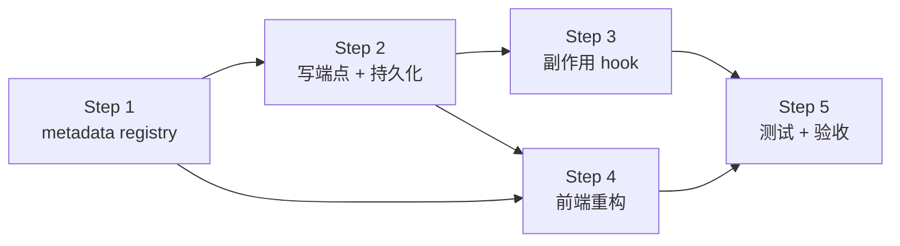

# 1. 配置优化

## 1.1 需求

### 1.1.1 已列方向（用户原始）

- 配置可修改并立即生效
- bool 选项用 Switch（开关）—— 注：bool 配置业界惯例用 Switch 而非 RadioGroup，一眼看清状态、一步切换
- 多选 / 单选枚举用下拉框（单选枚举若 ≤4 项可用 RadioGroup，少一次点击）
- 配置项有简要说明，悬停显示详细说明

### 1.1.2 业界标杆补充

**A. 分组与导航**

- 配置分组沿用后端 8 组：LLM / RAG / Memory / Rules / MCP / Security / Web / Log（与 `routes/config.py` 一致）
- 顶部搜索框：按 key 或描述模糊匹配（VSCode 设置面板风格）
- 已修改项视觉标记（左侧蓝点 / 边框高亮）+ 顶部"未保存改动"状态条
- 关闭页面 / 切走 view 时，有未保存改动给浏览器原生 `beforeunload` 警告

**B. 控件按值类型自动匹配**

| 值类型 | 控件 | 备注 |
|---|---|---|
| bool | Switch | 单步切换 |
| 单选枚举 ≤4 项 | RadioGroup | 选项一眼看完 |
| 单选枚举 >4 项 | Select 下拉 | 节省空间 |
| 多选 | MultiSelect / Checkbox 列表 | 如 `RAG_ACTIVE_EMBEDDINGS` |
| 数字（有范围） | NumberInput；连续值再加 Slider | 限制非法值 |
| 路径 | Input + 文件 / 目录选择器 | 如 `WEB_UPLOAD_DIR` |
| 长文本 / JSON | Textarea；JSON 加语法高亮 | 如 MCP `config_file` 内容 |
| API key 等敏感字符串 | **本期只读展示"已设置 / 未设置"徽章；不开放修改**（仍只能改 `.env` 后重启） | 详 §1.1.3 |

**C. 说明与帮助层级**

- 每项 label 下一行**简要说明**（一句话讲意义；常驻显示）
- 行尾 info 图标，hover / focus 弹 Tooltip 显示**详细说明**：含义 + 取值范围 + 影响范围（影响哪个模块）+ 默认值
- 标注**配置来源**：`.env` / runtime override / 内置默认值 —— 用户能一眼看出改动会写到哪、重启后是否还在

**D. 默认值与重置**

- 每项行尾"重置为此项默认值"图标按钮（仅当当前值 ≠ 默认值时出现）
- 每组顶部"全组重置为默认"按钮（带确认 Dialog）

**E. 校验与反馈**

- 前端基础校验（类型 / 范围 / 必填）+ 后端 Pydantic 再校验；保存失败回滚到原值，错误就近 inline 显示（不弹窗）
- 危险项二次确认 Dialog —— 如关闭 `SECURITY_MODE`、改 `PLAN_PERMISSION_MODE` 为更宽松值
- 保存成功 toast；批量保存显示进度条

**F. "立即生效 vs 重启"清单**

下表覆盖当前 `routes/config.py` 暴露的全部项。判定原则：调用方如果是**每次调用读 `_cfg.X`**，就立即生效；如果是**启动时读一次缓存到 local var**，就需要重启。

| 组 | key | 生效方式 | 副作用 / 注意点 |
|---|---|---|---|
| **LLM** | `active_provider` | 立即 | 触发下一次 LLM call 时重建 client；无需重启 |
| | `force_temperature` | 立即 | — |
| | `thinking_enabled` | 立即 | 仅 Claude / Qwen3 实际生效，其他 provider 静默降级 |
| | `thinking_budget` | 立即 | — |
| **RAG** | `top_k` / `k_per_source` | 立即 | — |
| | `active_embeddings` / `default_embedding` | 立即 | 首次切到新 alias 会触发 embedding 模型加载（几秒到几十秒） |
| | `reranker_enabled` | 立即 | — |
| | `reranker_model` | 立即 | 切换会重新加载 cross-encoder（几秒），改完第一次检索慢 |
| | `query_rewrite_enabled` / `ocr_fallback_enabled` | 立即 | — |
| | `chunk_size` / `chunk_overlap` | 立即（仅新入库） | **已入库的 chunk 不会重切**；改完要重新 ingest 旧文档才有效 |
| **Memory** | `enabled` / `auto_extract` / `max_chars` | 立即 | — |
| **Rules** | `enabled` / `file` / `max_chars` | 立即 | 下一次组 system prompt 时读 |
| **MCP** | `enabled` | 立即 | true→false 触发 stop_all；false→true 触发 start_all |
| | `config_file` | 立即 | 切换路径会 stop 当前所有 server + 加载新文件重连 |
| | `connect_timeout_sec` / `call_timeout_sec` | 立即 | 仅影响下一次握手 / call |
| **Security** | `mode` / `plan_permission_mode` | 立即 | 改 `mode=normal→strict` 立即收紧 tool 白名单，注意提示 |
| **Web** | `upload_dir` | 立即（仅新上传） | **已上传文件不搬家**；前端列表会切到新目录 |
| | `max_upload_mb` | 立即 | — |
| **Log** | `level` | 立即 | 调 `logging.getLogger().setLevel()`；已写入文件的日志不回填 |

**结论**：本期暴露的全部项都能做到立即生效，无需在 UI 上显示"重启后生效"徽章；但 4 类项要有 inline 提示：

1. `chunk_size` / `chunk_overlap`：保存后 toast "仅影响新入库文档"
2. `WEB_UPLOAD_DIR`：保存后 toast "仅影响新上传，旧文件留在原目录"
3. `reranker_model` / `default_embedding` / `active_embeddings`：保存后 toast "首次使用新模型时会加载几秒"
4. `SECURITY_MODE` 切到 `strict`：保存前二次确认 Dialog（避免误把所有 tool 关掉）

### 1.1.3 本期不做（已决定）

- API key 等敏感字段的修改 —— 仍只能改 `.env` 后重启；UI 只展示"已设置 / 未设置"徽章
- 多用户场景下的 audit log（谁 / 何时 / 改了哪个 key）
- 配置导入 / 导出（备份 / 跨机迁移）
- 修改历史与撤销（最近 N 次）

## 1.2 实现步骤

按"后端能力先行 → 前端消费"分 5 步；每步独立可验收，互不阻塞。



| Step | 内容 | 关键产物 |
|---|---|---|
| **1. metadata registry** | 集中描述每项的：key / 类型 / 默认值 / 取值范围 / 简要说明 / 详细说明 / 副作用提示 / 危险标记。`GET /api/config` 返回"当前值 + metadata"组合 | `src/api/config_meta.py` + 扩展 `ConfigResponse` |
| **2. 写端点 + 持久化** | `PATCH /api/config` 接收 `{key, value}`、Pydantic 校验、运行时写回 `src.config` 模块属性；持久化到 `.agenta/config_overrides.json`；启动时优先加载该文件覆盖 `os.getenv` 默认值 | `routes/config.py` + 新增 overrides loader |
| **3. 副作用 hook** | 按 key 注册"改后触发什么"：`active_provider` → 重建 LLM client；`MCP_*` → manager reload；`LOG_LEVEL` → `logging.setLevel`；embedding / reranker → 清模型缓存；其他无副作用项 noop | `src/api/config_hooks.py` |
| **4. 前端重构** | 控件工厂（按 metadata.type 渲染 Switch / RadioGroup / Select / NumberInput / Input / Textarea）+ 顶部搜索 + 分组导航 + dirty 状态 + info Tooltip + 行内校验报错 + 重置按钮 + 副作用提示 toast + 危险项二次确认 Dialog | 重写 `frontend/src/components/settings/SettingsView.tsx`，拆出控件子组件 |
| **5. 测试 + 验收** | 后端 UT 覆盖每组至少 1 个 key 的：读 / 写 / 校验失败 / 持久化 / 副作用 hook 触发；端到端手测走 §1.1.2 F 4 类副作用提示 + §E 危险二次确认 | 扩充 `tests/test_api_config.py` + §1.3 |

**推进策略**：

- Step 1+2 是前后端共同依赖的契约层，建议合并做完再分头展开
- Step 3 副作用 hook 按 key 增量补：先做 `LOG_LEVEL` / `top_k` 这种 noop / setter 型试通链路，再做 `active_provider` / `MCP_*` 这种带重建逻辑的
- Step 4 前端先做骨架（搜索 / 分组 / 控件工厂 / Switch + NumberInput），再补 Select / MultiSelect / 文件选择器等长尾控件
- 不追求一次到位；Step 5 验收只看"已实现 key 的全链路通"，未接入的 key 仍走只读展示

### 1.2.1 实现期决策记录

实现过程遇到的多路径决策一并记下，后续讨论 / 复盘对照：

| 决策点 | 选择 | 理由 |
|---|---|---|
| 持久化文件位置 | `.agenta/config_overrides.json` | 跟 `.agenta/rules.md` / `skills/disabled.json` / `mcp/config.json` 同目录、同命名风格；个人本地修改，已加入 `.gitignore` |
| 优先级模型 | `os.getenv` 默认值 → runtime override（覆盖） | 启动时 snapshot `_cfg` 当前值（即 .env 解析后的值）作为 reset 目标；override 文件加载时再覆盖 `_cfg` 模块属性 |
| 来源标识 | 二态：`default` / `override` | UI 只展示 "已修改" 徽章，不区分 .env 与硬编码默认（用户视角无关紧要） |
| GET 响应 shape | `{groups: [{name, label, items: [{key, value, default, source, type, brief, detail, options, min, max, side_effect_hint, danger, editable}]}]}` | 一次性返回值 + metadata，前端纯按 metadata 渲染控件，未来加新 key 不改前端 |
| 写端点风格 | `PATCH /api/config/{key}` body `{value}` + `DELETE /api/config/{key}` reset | RESTful；按 key 单项操作，避免批量 partial-failure 复杂性 |
| 文件外部修改同步 | 加 `POST /api/config/reload` + UI "从文件重载" 按钮（不做文件 watcher 自动刷新） | 跟 Skills / MCP 已有 "重新加载" 模式一致；自动 watcher 在编辑器频繁保存时会触发多次 hook，不可控 |
| Step 1+2 合并 | 合并实现 | 单独 metadata 没用；合并一次到位 |
| 副作用 hook 范围 | `LOG_LEVEL` / `MCP_ENABLED` / `MCP_CONFIG_FILE`，其他 noop | 多数 key 在调用方每次读 `_cfg.X`，setattr 后下次调用即生效，无需 hook；embedding / reranker 缓存按 model_name 索引，切换模型自动加载，也无需 hook |
| 控件库 | 直接用 `@base-ui/react/switch` + `<Input type=number>` + 原生 `<select>` + 原生 `<input type=radio/checkbox>` | 已有依赖 / 满足需求；不引入额外 ui 包 |
| Tooltip 实现 | 原生 HTML `title` 属性（多行 `\n` 分隔） | 零依赖 + a11y 自带；后续若要富文本可升级 base-ui Tooltip |
| 控件类型 enum 阈值 | enum_str 选项 ≤4 用 RadioGroup，>4 用 Select | 跟 §1.1.1 用户原话约定一致 |
| 保存方式 | 自动保存，无保存按钮：离散控件（Switch / Radio / Select / Checkbox）立即存，文本 / 数字框停手 600ms 防抖后存 | 与用户 "改完立即生效、不要保存按钮" 的要求一致；防抖避免文本每按一键都 PATCH |
| 保存反馈 | 成功不弹 toast（行左蓝条 + 行右 "保存中" + 工具栏 "N 项保存中…"），失败才 toast + 行内红字 | 每拨一次 Switch 都弹 toast 太吵；副作用提示改为行内常驻一行灰字 |
| 误关保护 | 仅当有保存在飞 / 防抖排队时触发 `beforeunload`（不做常驻 "未保存改动" 状态条） | 自动保存下不存在长期未保存态，只需兜住 "改完瞬间就关页" 的窗口 |
| 危险项 UX | `danger=True` 项改动时立即弹 AlertDialog 二次确认（离散控件本就一改即存），取消则回滚控件视觉态 | 与 §1.1.2 §E 对齐 |
| API key | 不写进 registry，UI 不可见 | 与 §1.1.3 决定一致；防泄漏的红线在 routes/config.py + UT 双层兜底 |
| 暂不暴露的项 | `IMP_METHOD` / `AUTOGPT_*` / `HARNESS_*` / `BM25_*` / `RAG_DENSE_MIN_SCORE_*` / `QUIZ_DEFAULT_*` / `SRS_*` / `LEARNING_PLAN_*` / `THINKING_BUDGET_*` 子项等 | 操作 / 调优内部参数，非典型用户面板需求；想改可走 `.env` |

**当前 registry 覆盖范围**：8 组 27 个 key。新增 key 的成本：在 `src/api/config_meta.py` `REGISTRY` 列表加一条 `ConfigItem`，无需改前端。

## 1.3 人工验收

后端 UT 已覆盖契约层（GET shape / PATCH 校验 / DELETE reset / `LOG_LEVEL` hook / 持久化跨重启 / 从文件重载 / API key 不泄漏，详 `tests/test_api_config.py` 23 条），本节只列**端到端手测**点。

**交互前提（与下面所有用例相关）**：

- **无保存按钮，改完自动存**：离散控件（Switch / Radio / Select / Checkbox）一动就立即存；文本 / 数字框停手约 600ms（防抖）才存。
- **保存中的视觉**：该行左侧出现蓝条 + 行右出现转圈 "保存中"；顶部工具栏出现 "N 项保存中…"。存完蓝条消失、行右出现 "已修改" 徽章 + 重置按钮。
- **成功不弹 toast**：避免每拨一次 Switch 都弹；只有出错才 toast + 行内红字。

**前置**：`.\tools\ui.ps1 start` 启动后端 + 前端；浏览器开 `http://localhost:5173/` 进 `设置` view。

> 说明：`LOG_LEVEL` / `logs uvicorn` —— `LOG_LEVEL` 控制的是 AgentA 自己的 root logger。AgentA 跑在 uvicorn 进程里，其日志被 `ui.ps1` 重定向到 `logs/uvicorn.log`（文件名只是按启动进程命名，里面混着 uvicorn 访问日志 + AgentA 业务日志）。下面 "看 `logs uvicorn`" 都指在该文件里看 **AgentA 自己的日志行**。

### 1.3.1 UI 渲染与导航

| 检查 | 预期 |
|---|---|
| 标题一致 | 左侧边栏入口与中间标题都叫 "设置"，不再出现 "系统配置" |
| 左侧分组导航 | 左边竖排 8 组：LLM / RAG / Memory / Rules / MCP / Security / Web / Log；点某组**只显示该组**（不是滚动定位）|
| 搜索 `top_k` | 跨组只剩 `RAG_TOP_K` 一条；左导航对应组右侧显示命中数徽章；点任一组名清空搜索回到单组视图 |
| 搜索 `mcp` | MCP 组各项命中 |
| 6 种控件类型至少 1 个走通 | bool 显 Switch（如 `RERANKER_ENABLED`）／int 显数字框（`RAG_TOP_K`）／enum_str ≤4 项显 RadioGroup（`SECURITY_MODE` 两选）／enum_str >4 项显下拉（`ACTIVE_PROVIDER`）／multi_enum_str 显 checkbox 列表（`RAG_ACTIVE_EMBEDDINGS`）／path 显文本框（`USER_RULES_FILE`）|
| 下拉框配色 | `ACTIVE_PROVIDER` / `LOG_LEVEL` 下拉的弹出项跟 "添加记忆" 下拉一致，亮 / 暗模式都正常 |
| info 图标 hover | 显示详细说明 + 取值范围 + 默认值 + 来源（多行） |

### 1.3.2 改完即生效

| 改 | 怎么验 |
|---|---|
| `LOG_LEVEL` → `DEBUG`，再切 `WARNING` | 在 `logs/uvicorn.log`（`.\tools\ui.ps1 logs uvicorn`）看到 AgentA 日志行密度变化（DEBUG 大量行 / WARNING 几乎沉默）|
| `RAG_TOP_K` → `2` | 进 chat 问需检索的问题，应答附带 sources 折叠最多 2 条 |
| `RERANKER_ENABLED` → `false` | 同上提问，sources 不再带 reranker 分数 |
| `THINKING_ENABLED` → `true`（先把 provider 切到 claude / qwen3） | 应答前出现 thinking 折叠块 |
| `ACTIVE_PROVIDER` 切 provider | 主区顶部 model 标签换；下一次发问 Network 看到对应 base_url |

### 1.3.3 持久化与重置

| 步骤 | 预期 |
|---|---|
| 拨动一个 Switch（如 `RERANKER_ENABLED`） | 立即触发保存：行左短暂蓝条 + 右侧 "保存中" → 完成后蓝条消失、出现 "已修改" 徽章 + 重置按钮 |
| 改数字框（如 `RAG_TOP_K`）后停手 | 约 600ms 后才发保存（连续按键不会每键一存）|
| 检查 `.agenta/config_overrides.json` | 文件出现，含已改的 key |
| `.\tools\ui.ps1 stop uvicorn` → `start uvicorn` → 刷新浏览器 | 改过的值仍在；徽章仍是 "已修改" |
| 点行右 重置 按钮 | toast `xxx 已重置`；值回 `.env` / 默认；徽章消失；overrides.json 对应 key 也删了（此项是文件里唯一时文件留 `{}`）|
| 改文本 / 数字框后趁保存还没落地立刻刷新浏览器 | 弹出原生 "离开页面？" 警告（有保存在飞 / 防抖排队时才弹）；保存落地后再刷新则无警告 |
| 改值再改回原值 | 取消尚未发出的保存，行回到干净态（无需任何按钮）|

### 1.3.4 从文件重载（手改文件后同步）

| 步骤 | 预期 |
|---|---|
| 编辑器手改 `.agenta/config_overrides.json`（如加 `"RAG_TOP_K": 23`）→ 只点工具栏 `刷新` | 值**不变**：刷新只把后端内存现状读回 UI，没读磁盘文件 |
| 同上手改后点工具栏 `从文件重载` | toast 提示同步了哪些 key；列表立刻显示新值 + "已修改" 徽章；后端 `_cfg` 已被文件覆盖 |
| 文件里删掉某 key 后点 `从文件重载` | 该项回到启动时初值（`.env` / 默认）|
| 文件无变化时点 `从文件重载` | toast `overrides 文件已是最新，无变化` |

### 1.3.5 校验失败

| 操作 | 预期 |
|---|---|
| `RAG_TOP_K` 输入 `999` 停手 | 防抖后发请求 → 行下方红字 "RAG_TOP_K 不能大于 50" + 行左红条；server 值不变 |
| `RAG_TOP_K` 输入空 | 数字框本地兜底（空 / NaN 不发请求），不报错也不保存 |
| 后端伪造非法 enum_str（curl `PATCH /api/config/SECURITY_MODE` body `{"value":"yolo"}`） | 400 + detail `SECURITY_MODE 取值必须在 ['normal', 'strict'] 中` |

### 1.3.6 副作用提示（行内常驻）

带 `side_effect_hint` 的项在控件下方**常驻**一行灰字 "提示：…"（不是 toast）；检查文案：

| key | 行内提示包含 |
|---|---|
| `CHUNK_SIZE` / `CHUNK_OVERLAP` | "仅影响新入库文档" |
| `WEB_UPLOAD_DIR` | "仅影响新上传" |
| `RERANKER_MODEL` / `DEFAULT_EMBEDDING_ALIAS` / `RAG_ACTIVE_EMBEDDINGS` | "首次使用新模型时会加载几秒" |
| `MCP_ENABLED` / `MCP_CONFIG_FILE` | 触发 MCP manager 重载 / 切路径停 server 重连 相关文案 |

### 1.3.7 危险项二次确认

危险项是离散控件，**一改动就直接弹确认**（没有中间的保存按钮）：

| 操作 | 预期 |
|---|---|
| `SECURITY_MODE` 切到 `strict` | 立即弹 AlertDialog "确认修改敏感配置"（含 key 名）；点取消 → 控件视觉态回滚、server 不变；点确认 → 实际写入 |
| `PLAN_PERMISSION_MODE` 拨到开 | 同上，确认才写入；取消则开关弹回 |
| 行内 "敏感" 徽章 | 上述两项标题旁带琥珀色 "敏感" 标签 |

### 1.3.8 副作用 hook 真触发

| key | 验证手段 |
|---|---|
| `LOG_LEVEL` | 改完后在 `logs/uvicorn.log` 立刻看到 AgentA 日志级别变化（无需重启）；手改文件后点 `从文件重载` 同样触发 |
| `MCP_ENABLED` true→false | 浏览器开 `http://localhost:8000/api/mcp/servers` 看全部 server `closed`、`tool_count=0` |
| `MCP_ENABLED` false→true | 同上看到 server 重新 `connected` |
| `MCP_CONFIG_FILE` 切到一个空 / 不存在的路径 | 全部 server 停掉、不抛 500 |

### 1.3.9 安全红线

| 检查 | 预期 |
|---|---|
| 浏览器 F12 Network 看 `GET /api/config` body | **不出现**任何 `api_key` / `MOONSHOT_API_KEY` / `OPENAI_API_KEY` 等字段或值 |
| `PATCH /api/config/MOONSHOT_API_KEY` 试探 | 404 `Unknown or non-editable config key` |
| 设置面板里搜 `api_key` / `MOONSHOT` | 无结果（registry 不含敏感字段） |


# 2. chat 页面优化

## 2.1 需求

### 2.1.1 已列方向（用户原始）

**视觉**

- 字体颜色优化（对比度 / 暗色模式可读性）

**Composer（消息发送框）**

- 停止生成
- Think 模式开关
- LLM 选择
- 上传文件

**User 消息**

- 消息编辑 + 重发 + 复制
- 回答 regenerate（多结果可切换）

**Assistant 应答区**

- 流式输出（thinking 折叠 + 正文）
- Plan 动态更新，详情可折叠
- 工具展示，详情可折叠
- fetch 工具网页链接列表，可点击
- RAG 引用展示
- 回答 regenerate（同已发送消息，但独立按钮在应答下）

### 2.1.2 业界标杆补充

参考：ChatGPT / Claude.ai / Cursor / Perplexity / Linear AI / Gemini / Cody。

**A. Composer**

| 项 | 业界做法 | 备注 |
|---|---|---|
| 多行自动增高 | 已实现（`max-h-32`），可加底部拉手放大 | 现有 |
| 草稿持久化 | 按 session 存 localStorage，切回不丢 | Claude / Cursor |
| 字数 / token 估算 | 右下角实时显示当前输入估算 token，超限红字 | OpenAI Playground |
| 上传文件细化 | 拖拽进 composer / 粘贴图片直接 attach / 多文件批量；附件 chip 可移除 + 缩略图预览 | ChatGPT / Claude 标杆 |
| LLM 选择 | 下拉 + "最近 3 个 / 收藏"快捷切；当前 provider 不支持的能力（如 thinking）按钮自动灰显 + Tooltip 解释 | Cursor 模型选择风格 |
| Think 模式 | 仅在 active provider 支持时可点；不支持时灰显 + Tooltip "X 不支持 thinking" | — |
| 停止生成 | Esc 快捷键；按钮文案"停止生成"（流式中）/"发送"（空闲） | ChatGPT |
| 全局快捷键 | Cmd+/ 聚焦输入、Cmd+Enter 发送、Esc 中止 | 现代 SaaS 通用 |
| Slash command | `/` 触发 skill 选择菜单（与现有 skills 对接） | Cursor / Linear |
| @ 提及上下文 | `@file:xxx` / `@kb:doc` / `@msg:N` 引用进 prompt | 高级，列入 §2.1.3 |

**B. Assistant 应答区**

| 维度 | 业界做法 | 备注 |
|---|---|---|
| 流式光标 | 正文末尾闪烁 cursor 区分"还在写"vs"卡住" | ChatGPT |
| 折叠默认 | thinking 折叠 / plan 展开 / tool 折叠 | Claude 风格 |
| Plan 进度 | 在现有 step checkbox 之外加整体 N/M 步进度条 + 每步 ✓/✗/⏸ 状态徽章 | — |
| Tool 详情 | 参数 / 结果分两栏；长 preview 截断 + "展开全部" 按钮 | 现有 ToolBlock 扩展 |
| fetch 链接列表 | 每条 favicon + 标题 + URL + 摘要片段；点击新标签打开 | Perplexity |
| RAG 引用 | 内联 `[1] [2]` hover 预览 chunk；点击跳到底部 sources 折叠面板，含 score / source 文件 | Perplexity / Bing Chat |
| 代码块 | syntax highlight（shiki / highlight.js）+ 右上角 copy 按钮（hover 出现）+ 语言标签 | Cursor / ChatGPT |
| 数学公式 | KaTeX 渲染（`$...$` / `$$...$$`） | 学习场景必备 |
| Mermaid 图 | ` ```mermaid ` 自动渲染流程图 / 时序图 | Notion / GitHub |
| 元数据底栏 | provider / model + 耗时（s）+ token（prompt / completion / total）+ thinking budget（如开） | 与 §3 token 统计对齐 |
| 操作按钮（hover 出现） | Copy 全文 / Regenerate / 多结果切换 `N/M` 翻页箭头 | ChatGPT / Claude |
| 错误重试 | 红框 + "重试 / 换 provider 重试" 按钮 | Cursor |
| Regenerate 多分支 | 同 user msg 可重生成 N 次，箭头切换；切换会改写后续 chat_history 路径 | ChatGPT 标杆 |

**C. User 消息**

- hover 浮出 action chip：Edit / Resend / Copy / Delete
- **Edit 重发的语义**：丢弃此条 user msg 之后的全部消息（包括 assistant 应答 + 后续轮次），编辑前给确认 Dialog 警示。业界（ChatGPT / Claude）统一这个语义，避免 chat_history 分叉混乱
- 附件 chip 内嵌在 user msg 顶部（缩略图 / 文件名 / 大小）

**D. MessageList / 整体**

- 自动滚到底；用户向上滚时**暂停自动滚** + 右下浮动 "↓ 回到最新" 按钮
- 时间戳分隔：消息间隔 > 30 分钟插入一行 "今天 14:23" / "昨天 09:11"
- **空状态欢迎屏**：3-5 个推荐 prompt 卡片（学习模板 / 知识库提问 / quiz 演示），点击直接填到 composer
- 全局 Cmd+F：当前 session 内搜消息（命中高亮 + 跳转）
- 长对话虚拟滚动：消息数 > 200 时启用 `@tanstack/react-virtual`，避免过早优化

**E. 视觉 / 字体 / a11y**（对应用户"字体颜色优化"）

- 正文字号 14-15px / `leading-relaxed`（1.625）；mono 用 Geist Mono / JetBrains Mono
- 中文 PingFang SC / Microsoft YaHei，英文 Inter / Geist
- 用户气泡 vs assistant 气泡强对比：右对齐 + 主色填充 vs 左对齐 + 弱底色（现有）
- 代码块亮 / 暗模式各有专属配色，**避免裸 `bg-background`** 跟正文气泡同色（当前 MD code 块视觉边界弱）
- thinking / plan / tool 折叠 chevron 旋转动画 150ms ease
- 焦点环：所有可点元素 focus-visible 显环
- WCAG AA：正文 vs 背景对比度 ≥ 4.5:1

**F. Skill / Command palette（可选，影响面较大）**

- Cmd+K 拉起 command palette：列出 skills + 最近 prompt + 快速跳转 view（KB / Memory / Settings…）
- composer 内 `/skill_name` 自动补全（与 A 里的 Slash command 共享底层 skill 列表）
- 业界 Cursor / Linear / Notion / Raycast 通用；本项目 skills 后端已就绪

### 2.1.3 本期不做（候选，待拍板）

| 项 | 业界 | 暂搁理由 |
|---|---|---|
| @ 提及上下文（`@file` / `@kb` / `@msg`） | Cursor / Linear | autocomplete + 上下文检索集成，工作量大 |
| Skill / Command palette（§F） | Cursor / Linear | UI 改动大，先把 chat 主流程打磨完 |
| Mermaid 图渲染 | Notion / GitHub | 引入 mermaid.js（数百 KB），先看是否真有用户需求 |
| KaTeX 数学公式 | ChatGPT / Claude | 学习场景重要，但需 KaTeX 包；可后置 |
| "继续生成"（中断后续写） | Claude / Cursor | 后端要支持 SSE 续连 + chat_history 拼接 |
| Like / Dislike 反馈通道 | ChatGPT | 需建反馈存储 + 评估管线，单用户场景收益小 |
| Read aloud / TTS | ChatGPT | 浏览器 TTS 质量差；接 ElevenLabs 等成本高 |
| Anchor link / Share message | ChatGPT | 多用户场景才有意义 |
| 长对话虚拟滚动 | 大型 IM | 当前消息量普遍 <100，过早优化；待真需要再加 |

# 3. token 统计
（每轮 / 累计）

# 4. 业务优化

# 5. 皮肤/主题切换
Logo

# 6. 多用户支持
