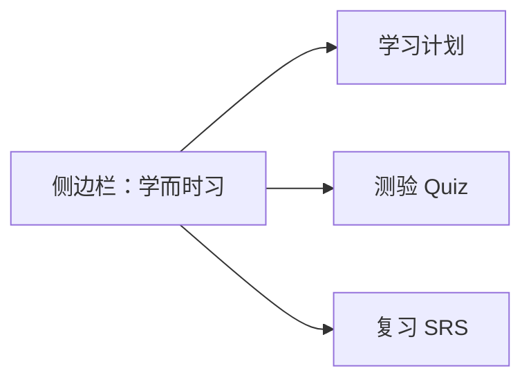
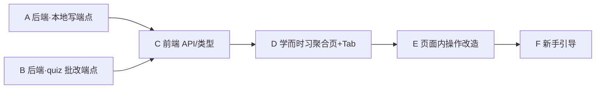

# 1.背景
AgentA 的 RAG 和 Agent loop 的功能（包括后端+前端）基本稳定。
现在要在此基础上添加一些使用功能。
前面在实现后端时，定义了一个“学习/研究助理” 方向，包含制定学习计划、测验和SRS 三个子功能。
本阶段的目的是：
1. 现有3功能原来是在后端开发时添加的，后来前端只简单做了一下，本期需要重新优化后端+前端。
2. 回顾现有功能，看看是否有更出彩，更实用的功能可以添加。

# 2.功能优化

## 2.0 新名字

把"学习/研究助理"升级为一个统一的产品名，定为 **学而时习**（出自"学而时习之"——学了再反复练习，正好对应"计划 + 测验 + 间隔复习"三项）。

代码里用英文 `mastery` 做路由 / 组件命名（如 `MasteryView`、`/mastery`）。下文统一用"学而时习"指代这块业务。名字若要换，只改这一处定义即可。

## 2.1 侧边栏合并

现状：侧边栏有"学习计划 / Quiz / SRS"三个独立入口（`Sidebar.tsx` L192-209）。目标：合成一个"学而时习"入口，三项变成它内部的子模块。

- `ViewKind` 把 `plans` / `quizzes` / `srs` 收敛成一个 `mastery`，进页面后用顶部 Tab（计划 / 测验 / 复习）切换子模块。
- `PlansView` / `QuizzesView` / `SRSView` 三个组件保留，改成"学而时习"页内的 Tab 内容，不再各自占侧边栏。

## 2.2 三项功能页面内可操作

这是本期改动量最大的一块。现状：三项面板都是**只读**，新建计划、出题答题、复习评分全得回聊天里让大模型做（见 `routes/srs.py` 等注释"留给 chat"）。目标：常规操作直接在页面完成。

按"是否必须调大模型"区分，决定走直连后端写端点还是仍经对话：

| 子模块 | 页面要支持的操作 | 是否需要大模型 | 后端做法 |
|---|---|---|---|
| 学习计划 | 手动新建 / 改任务状态 / 放弃计划 | 否 | 新增直连写端点 `POST /api/plans`、`PATCH /api/plans/{id}/tasks/{tid}` 等，直接调 `LearningPlanStore` |
| 学习计划 | "让 AI 帮我拟计划" | 是 | 页面发起 → 走 chat 流式 → 完成后刷新列表 |
| 测验 Quiz | 出题 | 是 | 同上，经对话生成后落库，页面刷新 |
| 测验 Quiz | 在页面答题、提交 | 选择题否 / 简答是 | 新增 `POST /api/quizzes/{id}/submit`：选择题本地判分，简答调大模型批改 |
| 复习 SRS | 看到期卡、翻面、四档评分 | 否 | 新增 `POST /api/srs/cards/{id}/review`，本地跑 SM-2，纯页面闭环 |

设计取舍：**纯本地能算的（SRS 评分、选择题判分、改状态）一律开直连写端点，做到页面闭环；必须靠大模型的（拟计划、出题、简答批改）仍复用对话流，页面只负责发起和回显。** 不为了"全页面化"在 REST 端点里再塞一套大模型调用逻辑，避免和对话路径重复。

这会打破现有"写操作只走对话"的约定，需同步：

- 后端：`routes/plans.py` / `quizzes.py` / `srs.py` 从只读扩成可写；补对应 schema 与 UT。
- 前端：三个 Tab 加上表单 / 答题卡 / 评分按钮，调新端点后本地刷新。

## 2.3 新手引导

让新用户进"学而时习"页一眼会用，不用看文档：

| 场景 | 引导方式 |
|---|---|
| 三个 Tab 都为空 | 每个 Tab 给一句话说明 + 一个主操作按钮（如"新建学习计划""出一套题""开始复习"），不再只甩一句"去 chat" |
| 首次进入 | 顶部一段话讲清"学而时习 = 定计划 + 做测验 + 间隔复习"三步闭环，可关闭、不再提示 |
| 操作控件 | 关键按钮 / 字段配 Tooltip（如 SRS 四档"重来/困难/良好/容易"各代表多久后再见） |
| 概念解释 | 页面内首次出现 SRS 时一句话解释"间隔重复：答得越熟，下次间隔越长" |

## 2.4 实现步骤

## 2.5 决策记录

## 2.6 人工验收

## 2.7 AI验收结果
## 2.4 实现步骤

按"后端写端点先行 → 前端聚合页消费"分 6 个阶段（Phase A-F）。每阶段独立可验收。现有三个 Store 的写方法都已具备（`create_plan`/`add_tasks`/`update_task_status`/`abandon_plan`/`switch_active`、`update_grading`+批改 helper、`add_card`/`schedule_review`/`update_review_state`/`set_status`），本期主要补 **HTTP 写端点** + **前端交互**。

### Phase A — 后端本地写端点（plans + srs，无需大模型）

| 端点 | 作用 | 复用 Store 方法 |
|---|---|---|
| `POST /api/plans` | 手动新建计划（goal/weeks/tasks） | `create_plan` + `add_tasks` |
| `PATCH /api/plans/{id}/tasks/{task_id}` | 改任务 status / note | `update_task_status` |
| `POST /api/plans/{id}/activate` | 设为当前 active | `switch_active` |
| `POST /api/plans/{id}/abandon` | 放弃计划 | `abandon_plan` |
| `POST /api/srs/cards` | 手动建卡（front/back/note） | `add_card` |
| `POST /api/srs/cards/{id}/review` | 4 档评分，跑 SM-2 | `schedule_review` + `update_review_state` |
| `POST /api/srs/cards/{id}/suspend\|resume\|archive` | 卡片状态流转 | `set_status` 系列 |

### Phase B — 后端 quiz 答题批改端点（简答需大模型）

| 端点 | 作用 | 复用 |
|---|---|---|
| `POST /api/quizzes/{id}/submit` | 提交答案批改：选择题本地判分、简答 LLM-judge | `_grade_one_mcq` / `_grade_one_short_answer` + `update_grading` |
| `POST /api/quizzes/{id}/archive` | 归档 | `archive_quiz_set` |

### Phase C — 前端 API 封装 + 类型

`api/client.ts` 补上述写端点对应函数；`types/business.ts` 视需要加请求体类型。

### Phase D — 「学而时习」聚合页 + Tab

- `ViewKind` 用 `mastery` 取代 `plans`/`quizzes`/`srs`（激进清理，不保留旧入口）。
- 侧边栏单一入口"学而时习"。
- 新建 `MasteryView`：顶部 Tab（计划 / 测验 / 复习），内容复用改造后的三个子视图。

### Phase E — 页面内操作改造（三个子视图）

| 子视图 | 新增页面操作 |
|---|---|
| 计划 | 新建计划 Dialog、点任务切换状态、激活/放弃按钮 |
| 测验 | 答题模式（选项点选 / 简答输入）→ 提交批改 → 就地看分 |
| 复习 | 建卡 Dialog、due 卡翻面 + 4 档评分、暂停/归档 |

### Phase F — 新手引导

空状态主操作按钮、Tab 顶部一句话闭环说明、关键控件 Tooltip、SRS 概念解释（详 §2.3）。

### Phase G — Review + 测试 + 验收

后端 UT 覆盖新端点（mock LLM）；§2.5 记录决策、§2.6 写人工验收清单、§2.7 写 AI 验收结果。

## 2.5 决策记录

| # | 决策点 | 选择 | 理由（行业标杆 / 工程偏好）|
|---|---|---|---|
| 1 | 旧侧边栏入口去留 | 删除 `plans`/`quizzes`/`srs` 三个 `ViewKind`，合并为单一 `mastery` | 工程偏好"简洁 > 兼容"；没有外部依赖旧入口，无需保留 |
| 2 | quiz 批改逻辑 | 复用 `tools.py` 的 `_grade_one_mcq` / `_grade_one_short_answer`，不另写一套 | DRY；两条路径（chat tool / HTTP）批改口径必须一致 |
| 3 | submit 端点是否跑 harness critic | 不跑 | critic 会额外发 LLM 调用、拖慢页面交互；自检留给 chat 的 `grade_quiz` |
| 4 | 写端点文件位置 | 加在已有 `routes/plans.py`/`quizzes.py`/`srs.py` 内，不新开文件 | 符合 §2.5 命名规则"先在已有文件加" |
| 5 | submit 请求体格式 | `answers: [{question_id, answer}]` 列表，而非 `{qid: answer}` 字典 | JSON 对象键只能是字符串，列表表达 int id 更明确、好校验 |
| 6 | 写端点返回值 | 直接返回更新后的完整对象（Plan / QuizSet / SRSCard） | 前端免再拉一次（REST 惯例：写操作回传最新资源）|
| 7 | "出题" / "AI 拟计划"是否页面化 | 保留在 chat（页面只提供"手动新建计划 / 手动建卡 / 答题批改"）| 出题与拟计划要检索知识库 + 调大模型生成，最自然是走对话流；页面用引导文案指向 chat。手动新建作为不依赖大模型的补充，已能在页面独立跑通 |
| 8 | 任务状态如何在页面切换 | 点圆圈在 待办→已完成→已跳过 循环 | 单控件循环比三个按钮/下拉更省点击（业界 todo 类应用常见交互）|

**Review 结论（问题分级）**：未发现 P0 / P1。P2（已知、本期不改）：① 切 Tab 会丢失测验答题中途输入（组件卸载重置 state）；② 已批改的测验不支持页面内"重做"（需重新出题）；③ Tab 按钮缺 aria 标注。均不影响主流程。

## 2.6 人工验收

对照 §2.1-2.3 需求逐条验收。在浏览器打开 `http://localhost:5173`。

| # | 验收项 | 期望结果 |
|---|---|---|
| **侧边栏合并（§2.1）** | | |
| 1 | 侧边栏只剩一个"学而时习"入口 | 旧的"学习计划 / Quiz / SRS"三项消失，合为一项 |
| 2 | 点"学而时习"进入页面 | 顶部有"学习计划 / 测验 / 复习"三个 Tab，可切换 |
| **计划页面化（§2.2）** | | |
| 3 | 点"新建计划"，填目标+周数+任务，提交 | 列表出现新计划且为"当前计划"，详情显示任务 |
| 4 | 点任务前的圆圈 | 状态在 待办→已完成→已跳过 间循环，完成数实时更新 |
| 5 | 对非当前计划点"设为当前" | 该计划变为 active，原 active 取消 |
| 6 | 点"放弃"并确认 | 计划从列表消失 |
| **测验页面化（§2.2）** | | |
| 7 | 选一个未答测验，选项可点选 / 简答可输入 | 选中项高亮，可改 |
| 8 | 点"提交批改" | 就地显示每题得分 + 总分，状态变"已批改" |
| 9 | 选择题判分即时（无需等大模型） | MCQ 正确得 1.0、错误 0.0 |
| **复习页面化（§2.2）** | | |
| 10 | 点"新建卡片"，填正反面，提交 | 卡片出现在"全部卡片"且立即进"待复习" |
| 11 | 在"待复习"点"显示答案"→ 选 4 档之一 | 翻面看到背面；评分后进入下一张，间隔/下次时间更新 |
| 12 | 对卡片点"暂停 / 恢复 / 归档" | 状态相应变化 |
| **新手引导（§2.3）** | | |
| 13 | 首次进入页面 | 顶部有可关闭的三步闭环说明 |
| 14 | 三个 Tab 空状态 | 各有一句话说明 + 主操作按钮，不再只甩"去 chat" |
| 15 | SRS 4 档按钮悬停 / 概念说明 | 有"间隔重复"一句话解释 + 各档 Tooltip |
| **回归** | | |
| 16 | 后端原只读端点 + 新写端点 | UT 全绿 |
| 17 | 前端类型检查 + 构建 | `tsc` / `vite build` 通过 |

## 2.7 AI 验收结果

验收方式：后端用 `pytest` 端点 UT + 对运行中服务（:8000）的真实 API 冒烟；前端用 `tsc` + `vite build` + 浏览器（:5173）实操点击。

| # | 验收项 | 结果 | 证据 |
|---|---|---|---|
| 1 | 侧边栏只剩"学而时习"一项 | ✅ | 浏览器截图：旧三项消失 |
| 2 | 进入后有三步说明 + 三 Tab | ✅ | 截图确认标题/说明/Tab |
| 3 | 页面新建计划 | ✅ | 创建后置顶为"当前计划"，详情显示 2 任务 |
| 4 | 点圆圈循环任务状态 | ✅ | 待办→已完成（删除线），计数 0/2→1/2 |
| 5 | 设为当前 | ✅ | API 冒烟：`switch_active` 互斥生效 |
| 6 | 放弃计划 | ✅ | 列表移除；API 返回 status=abandoned |
| 7 | 测验作答（选项点选 / 简答输入） | ✅ | UI 控件正常；当前库内仅有已批改测验，空状态文案正确 |
| 8 | 提交批改就地出分 | ✅ | UT：MCQ 50 分、简答 LLM-judge 80 分；状态转 graded |
| 9 | 选择题即时判分 | ✅ | UT：对 1.0 / 错 0.0，无需大模型 |
| 10 | 页面新建卡片 | ✅ | 浏览器：卡片进"全部卡片"+"待复习"，计数 +1 |
| 11 | 翻面 + 4 档评分 | ✅ | 显示答案→点"良好"→进入下一张；API：reps=1 interval=1d |
| 12 | 暂停/恢复/归档 | ✅ | API 冒烟三态流转正确 |
| 13 | 首屏三步引导可关闭 | ✅ | 截图确认 |
| 14 | 三 Tab 空状态有引导 + 主操作按钮 | ✅ | 计划/复习空态带"新建"按钮；测验空态引导去 chat 出题 |
| 15 | SRS 概念说明 + 4 档 Tooltip | ✅(代码)／⚠️(自动化) | 顶部有"间隔重复"解释；4 档按钮用原生 `title`，自动化无法触发 hover，需人工鼠标确认 |
| 16 | 后端 UT 全绿 | ✅ | 新增写端点 35 UT 通过；全量 1300 通过（唯一失败 `test_all_providers_registered` 与本期无关，是 gemini provider 注册的既有问题）|
| 17 | 前端 tsc + build | ✅ | `tsc -b` 0 错；`vite build` 成功 |

附加冒烟（真实服务 :8000）：非法 rating→400、不存在 quiz→404（同时证明 `submit` 端点对 `tools.py` 批改 helper 的导入在真实应用中正常）。验收测试数据已全部清理（未触及用户真实计划/卡片）。

**结论**：§2.1-2.3 需求全部达成。唯一需人工补认的是 #15 的 hover Tooltip（实现已就位，仅自动化受限）。无 P0/P1 遗留。

# 3.新功能探索

在"学而时习"闭环基础上，挑几个**更出彩、更实用**的方向，按价值/成本排序，本期先不全做，作为候选：

| 方向 | 一句话 | 价值 | 成本 |
|---|---|---|---|
| 一键"知识库→计划→题→卡" | 选一篇知识库文档，自动生成学习计划，并预埋测验题和复习卡 | 把三项串成真闭环，体现"学而时习"整体价值 | 中（编排已有 tool）|
| 学习仪表盘 | 首屏看连续学习天数、本周做题数、SRS 到期数、计划完成度 | 给"坚持"一个可见反馈，提升留存 | 中 |
| 复习提醒 | 有到期 SRS 卡时，侧边栏"学而时习"入口标红点 / 数字角标 | 主动拉用户回来复习，是 SRS 的关键一环 | 低 |
| 错题自动入库 | 测验答错的题，一键 / 自动转成 SRS 卡 | 打通"测验→复习"，错题不浪费 | 低（已有 `add_to_srs`）|
| 计划进度联动 | 完成某阶段任务后，提示"测一测本阶段掌握情况" | 让计划、测验互相驱动 | 中 |

建议本期优先做**复习提醒**和**错题自动入库**（成本低、直接补全闭环），其余列入后续迭代。
