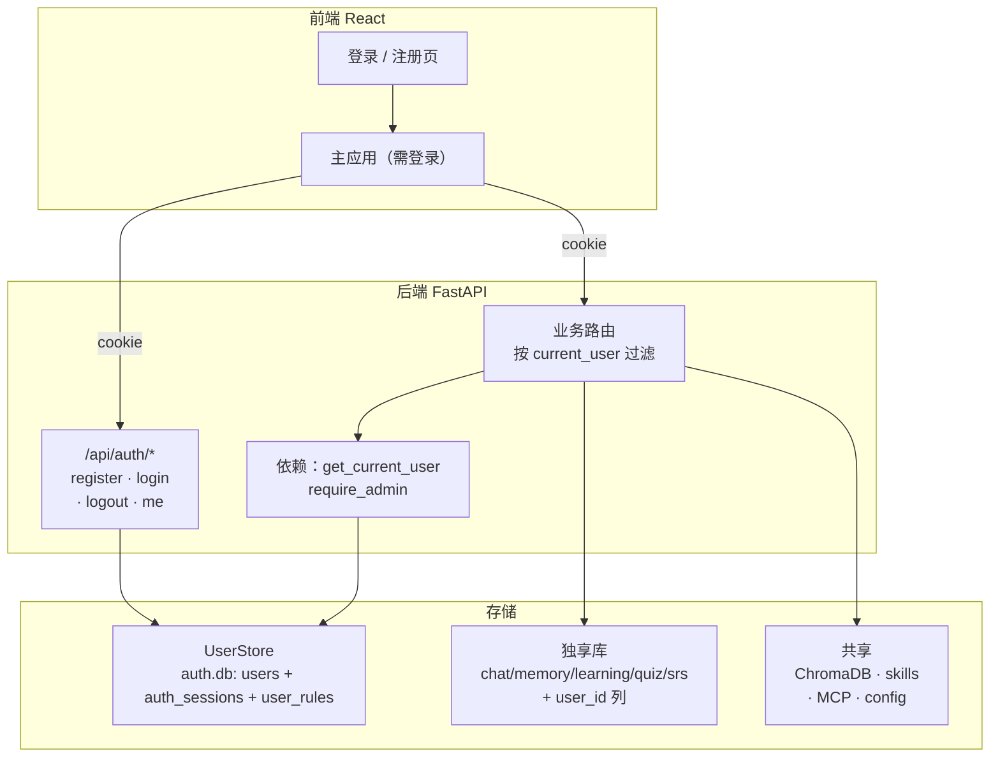
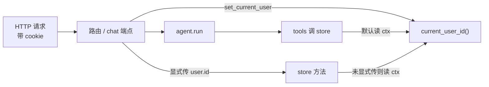
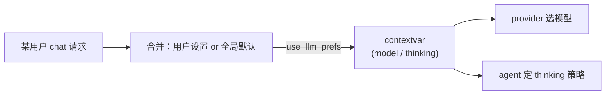

# 1.背景
AgentA 单用户功能 MVP 完成（后端+前端）， 包括：RAG知识库、Agent功能、session管理、用户记忆管理、工具调用、skills、MCP、配置、学而时习业务等等。
本期实现多用户支持。

# 2.需求

最基本需求：注册、登录、退出。在此之上，让多个用户共用一套部署，但各自的对话与学习数据互不可见。

## 2.1 共享 vs 独享划分

核心问题是"哪些数据全体共用、哪些按用户隔离"。结论如下：

| 数据 | 归属 | 谁能改 |
|---|---|---|
| 知识库（ChromaDB + BM25 + 上传文档） | **共享** | 所有登录用户都能上传 / 删除 |
| skills（`.agenta/skills/`） | **共享** | 仅 admin |
| MCP server 配置（`.agenta/mcp/`） | **共享** | 仅 admin |
| 系统配置（`config_overrides.json` / `/api/config`） | **共享** | 仅 admin |
| 对话会话（chat session + messages） | **按用户独享** | 本人 |
| 用户记忆（user memory） | **按用户独享** | 本人 |
| 学习计划（learning plan） | **按用户独享** | 本人 |
| 测验（quiz） | **按用户独享** | 本人 |
| SRS 复习卡 | **按用户独享** | 本人 |
| 偏好规则（rules） | **按用户独享**（每人一份） | 本人 |

一句话：**知识与系统级配置共享，个人学习轨迹与偏好独享**。

> 取舍说明：知识库选共享是因为它是"大家共建的资料库"，让普通用户也能上传更利于积累；skills / MCP / config 影响所有人且有安全面，收归 admin；rules 从原来的"项目级一份"改成"每人一份"，因为它是个人回答偏好。

## 2.2 角色

| 角色 | 能力 |
|---|---|
| `user`（普通用户） | 注册即得；用全部业务功能；上传 / 删知识库文档；管自己的会话 / 记忆 / 学习数据 / rules |
| `admin` | 在 user 基础上，额外可改 skills / MCP / 系统配置 |

admin 不是注册时勾选的，而是由部署方在 `.env` 配一个 `AUTH_ADMIN_USERNAME`；该用户名注册后自动成为 admin，其余都是 user。

## 2.3 认证方式

- 开放自注册（用户名 + 密码）。
- 密码用 `pbkdf2_hmac`（标准库，零新依赖）+ 每用户随机 salt 哈希存储，不存明文。
- 登录成功后服务端发一个随机 session token，写进 **HttpOnly cookie**；前端零存储、自动随请求带上。
- 退出即删除该 token。

## 2.4 现有数据处理

本项目工程偏好"简洁 > 兼容"。给独享类表加 `user_id` 列、删旧 db 重建，**现有单用户数据丢弃**，不写迁移脚本。升级时手动删 `./sqlite_db/*.db` 即可（知识库 `./chroma_db/` 不受影响，无需重建）。

# 3.设计

## 3.1 整体改动地图

## 3.2 认证层

新增 `UserStore`（`src/memory/user_store.py`），独立 SQLite 文件 `./sqlite_db/auth.db`，三张表：

| 表 | 字段 | 用途 |
|---|---|---|
| `users` | `id`(PK) / `username`(唯一) / `password_hash` / `salt` / `role` / `created_at` | 账号 |
| `auth_sessions` | `token`(PK) / `user_id` / `created_at` / `expires_at` | 登录态（cookie 里存 token） |
| `user_rules` | `user_id`(PK) / `content` / `updated_at` | 每用户偏好规则 |
| `user_settings` | `user_id`(PK) / `active_model` / `thinking_enabled` / `thinking_budget` / `updated_at` | 每用户 LLM / Thinking 偏好（详 §8.6） |

认证端点（`src/api/routes/auth.py`）：

| 方法 | 路径 | 说明 |
|---|---|---|
| POST | `/api/auth/register` | 注册；用户名占用返回 409；匹配 `AUTH_ADMIN_USERNAME`（忽略大小写）者为 admin；成功即登录（下发 cookie） |
| POST | `/api/auth/login` | 校验密码，下发 cookie |
| POST | `/api/auth/logout` | 删 token + 清 cookie |
| GET | `/api/auth/me` | 返回当前用户（未登录 401） |
| PATCH | `/api/auth/username` | 改本人用户名（占用 409，详 §8.3） |
| POST | `/api/auth/password` | 改本人密码（校验旧密码，详 §8.3） |
| GET/PATCH | `/api/auth/llm-prefs` | 读写本人 LLM / Thinking 偏好（详 §8.6） |
| DELETE | `/api/auth/me` | 自助注销账号 + 级联清数据（详 §8.5） |

管理员端点（`src/api/routes/admin.py`，均 `require_admin`）：

| 方法 | 路径 | 说明 |
|---|---|---|
| GET | `/api/admin/users` | 列出所有用户 |
| DELETE | `/api/admin/users/{id}` | 删除用户 + 级联清其数据（详 §8.5） |

依赖（`src/api/deps.py`）：

| 依赖 | 行为 |
|---|---|
| `get_current_user` | 读 cookie token → 查 `auth_sessions` → 取 user；无效 / 过期 → 401 |
| `require_admin` | 在 `get_current_user` 之上校验 `role == admin`；否则 403 |

`AUTH_ENABLED=false` 时（CLI / 测试 / 单机自用）跳过认证，全部落到默认用户（见 §3.4）。

## 3.3 业务路由的隔离与门禁

- **独享数据路由**（sessions / memory / plans / quizzes / srs / rules）：加 `user = Depends(get_current_user)`，把 `user.id` 透传给 store，只读写本人数据；访问不属于自己的资源返回 404（不泄露存在性）。
- **共享只读 + 全员可写**（kb）：加 `get_current_user`（必须登录），但不按用户过滤。
- **admin 门**（config / skills / mcp 的写操作）：加 `Depends(require_admin)`；读操作普通用户可看。

## 3.4 数据按用户隔离的实现方式

独享类 5 张表统一加 `user_id INTEGER NOT NULL` 列（普通索引，不跨库做外键）。难点是"谁把当前 user_id 传给 store"：API 路由有 `user` 可显式传，但 Agent 是**进程级单例**、工具（tools.py）调 store 时拿不到请求上下文。

方案：用一个**请求级当前用户上下文**（`src/agent/core/user_context.py`，基于 `contextvars`）。

- store 方法新增 `user_id: int | None = None` 参数；为 `None` 时回落到 `current_user_id()`。
- API 路由显式传 `user.id`（清晰、不依赖上下文线程传播）。
- Agent 路径：在 chat 端点 / 流式 `_sync_run` 入口 `set_current_user(user.id)`，于是 tools 里所有 `store.xxx(...)`（不传 user_id）自动落到当前用户。**tools.py 几乎不用改**。
- CLI / 测试 / `AUTH_ENABLED=false`：`current_user_id()` 默认返回 `DEFAULT_USER_ID`（=1），行为等同过去的单用户。

这样改动集中在 store 层与少数入口，工具与 Agent 主循环基本不动。

唯一约束的调整：`user_memories` 的唯一键由 `(category, key)` 改为 `(user_id, category, key)`；`learning_plans.is_active` 的"全表至多一条"互斥改为"每用户至多一条"。

## 3.5 每用户 rules

原 `.agenta/rules.md`（项目级一份、启动缓存）改为存 `user_rules` 表、按用户读取：

- `GET/PUT /api/rules` 读写当前用户的 `user_rules.content`。
- Agent 拼 system prompt 时，`<project_rules>` 块从当前用户的 rules 取（按 `current_user_id()`），不再用进程级缓存。
- `AUTH_ENABLED=false` 时回落到默认用户的 rules（仍可为空）。

## 3.6 前端

- 新增登录 / 注册页；未登录时主应用不渲染，重定向到登录。
- API client：所有 `fetch` / SSE 带 `credentials: 'include'`（带 cookie）；遇 401 统一跳登录。
- 侧栏左下角展示当前用户名（下方一行显示角色），点开为用户菜单：设置 / 帮助 / 退出（详 §8.2）；admin 才显示 skills / MCP / 系统配置的编辑入口（普通用户只读或隐藏）。

## 3.7 配置项

| key | 默认 | 含义 |
|---|---|---|
| `AUTH_ENABLED` | `true` | 总开关；false 时全部走默认用户、不校验登录 |
| `AUTH_DB_PATH` | `./sqlite_db/auth.db` | 账号 / 登录态 / 每用户 rules 的 SQLite |
| `AUTH_ADMIN_USERNAME` | `admin` | 该用户名注册后自动成为 admin |
| `AUTH_SESSION_TTL_DAYS` | `30` | 登录态有效天数 |
| `AUTH_COOKIE_NAME` | `agenta_session` | 存 token 的 cookie 名 |
| `DEFAULT_USER_ID` | `1` | CLI / 测试 / 关认证时使用的用户 id |

# 4.改动清单

| 层 | 文件 | 改动 |
|---|---|---|
| 配置 | `src/config.py` + `.env.example` + `.env` | 新增 `AUTH_*` / `DEFAULT_USER_ID` |
| 存储 | 新增 `src/memory/user_store.py` | UserStore：users / auth_sessions / user_rules |
| 存储 | 新增 `src/agent/core/user_context.py` | `current_user_id` / `set_current_user` contextvar |
| 存储 | `chat_history / user_memory / learning_plan_store / quiz_store / srs_store` | 加 `user_id` 列 + 方法按 user 过滤 |
| API | 新增 `src/api/routes/auth.py` + `src/api/schemas/auth.py` | register / login / logout / me |
| API | `src/api/deps.py` | `get_current_user` / `require_admin` / `get_user_store` |
| API | `chat / sessions / memory / plans / quizzes / srs / rules / kb / config / skills / mcp` | 加认证依赖 + 透传 user_id + admin 门 |
| Agent | `src/agent/agent.py` | rules 改为按用户读取 |
| 前端 | `frontend/src/...` | 登录 / 注册页 + 鉴权态 + cookie + 401 处理 |
| 测试 | `tests/test_user_store.py` / `test_data_isolation.py` / `test_api_rules.py` | 认证流程 + 数据隔离 + 每用户 rules |

完善（§8）相关：

| 层 | 文件 | 改动 |
|---|---|---|
| 配置 | `src/config.py` | LLM 偏好请求级覆盖：`use_llm_prefs` + contextvar |
| 存储 | `src/memory/user_store.py` | 改名 / 改密 / 用户管理 / `user_settings` 偏好；用户名 `COLLATE NOCASE` |
| 存储 | `chat_history / learning_plan_store / quiz_store / srs_store` | 新增 `delete_all_for_user` 级联清理 |
| API | 新增 `src/api/routes/admin.py` | 用户列表 / 删除 + 数据级联清理 |
| API | `src/api/routes/auth.py` | 改名 / 改密 / 注销 / `llm-prefs` 端点 |
| API | `src/api/routes/chat.py` + `src/agent/agent.py` | 按用户应用模型 / thinking 偏好 |
| 前端 | `components/settings/*`（SettingsPage / ProfileSettings / PasswordSettings / UserManagement / AccountDeletion）+ `Sidebar` 用户菜单 | 整页设置 + 用户菜单 + 角色显示 |

# 5.测试

- 认证：注册 / 重复注册 409 / 登录成功失败 / 退出后失效 / `me` 401 / admin 角色判定。
- 隔离：用户 A 看不到用户 B 的 session / memory / plan / quiz / srs / rules；`user_id` 过滤正确。
- 门禁：普通用户改 config / skills / MCP → 403；上传知识库 → 允许。
- 回归：`AUTH_ENABLED=false` 下 CLI / 既有单测仍走默认用户、行为不变；`pytest -q` 全绿。

# 6.人工验收

自动化单测之外，按下面步骤手动过一遍真实交互，确认多用户体验符合预期。

## 6.1 准备

1. 确认 `.env`：`AUTH_ENABLED=true`、`AUTH_ADMIN_USERNAME=admin`。
2. 删旧库重建（首次升级才需要）：删 `./sqlite_db/*.db`（保留 `./chroma_db/`）。
3. 启动后端：`uvicorn src.api.main:app --port 8000`；启动前端：`cd frontend && npm run dev`。
4. 浏览器开 `http://localhost:5173`，用**两个不同浏览器或一个普通窗口 + 一个隐身窗口**分别登两个账号，避免 cookie 串号。

## 6.2 验收用例

每行：操作步骤 → 达标标准。任一不达标即视为不通过。

### 认证

| 编号 | 操作步骤 | 达标标准 |
|---|---|---|
| A1 注册 | 登录页切到"注册"，填 `alice` / 任意密码，提交 | 直接进入主应用；侧栏底部显示用户名 `alice` |
| A2 重复注册 | 退出后再注册一次 `alice` | 提示"用户名已被占用"，停在注册页 |
| A3 登录失败 | 退出，用 `alice` + 错误密码登录 | 提示"用户名或密码错误"，未进入 |
| A4 登录成功 | 用 `alice` + 正确密码登录 | 进入主应用，能看到 alice 之前的会话 |
| A5 admin 识别 | 注册 / 登录 `admin`（= `AUTH_ADMIN_USERNAME`） | 侧栏出现 Skills / MCP / 设置 入口 |
| A6 未登录拦截 | 在登录态下退出，刷新页面 | 停在登录页，主应用不渲染 |
| A7 登录态保持 | 登录后刷新页面 | 仍是登录态，无需重新登录（cookie 生效） |

### 数据隔离（alice 与 bob 两个普通用户）

| 编号 | 操作步骤 | 达标标准 |
|---|---|---|
| B1 会话隔离 | alice 新建会话发一条消息；bob 窗口登录看会话列表 | bob 看不到 alice 的会话；alice 看不到 bob 的 |
| B2 记忆隔离 | alice 对 Agent 说"请记住我喜欢用 Python"；bob 打开记忆管理页 | bob 记忆列表无此条；alice 有 |
| B3 学习数据隔离 | alice 建一个学习计划 / 测验 / 复习卡；bob 打开对应页 | bob 的计划 / 测验 / 卡片列表为空（或仅自己的） |
| B4 rules 隔离 | alice 在 rules 页写一段偏好并保存；bob 打开 rules 页 | bob 的 rules 为空；alice 再打开仍是自己那段 |
| B5 越权访问 | 记下 alice 某 session id，bob 登录态下直接请求该 session 的消息 | 返回 404，不泄露内容 |

### 共享与门禁

| 编号 | 操作步骤 | 达标标准 |
|---|---|---|
| C1 知识库共享 | alice 上传一个文档；bob 打开知识库页 | bob 能看到同一文档；bob 也能上传 / 删除 |
| C2 普通用户无 admin 入口 | 以 bob（user）查看侧栏 | 无 Skills / MCP / 设置 编辑入口 |
| C3 普通用户改配置被拒 | bob 登录态下直接 PATCH `/api/config`（或改 skills / mcp） | 返回 403 |
| C4 admin 可改 | admin 登录后改一项配置 / 新建 skill | 操作成功 |

### 回归（关认证）

| 编号 | 操作步骤 | 达标标准 |
|---|---|---|
| D1 关认证直进 | 设 `AUTH_ENABLED=false` 重启后端，刷新前端 | 不经登录直接进主应用，身份为 `local`（admin 权限） |
| D2 CLI 不受影响 | `AUTH_ENABLED` 任意值下跑 CLI（`python main.py`） | 正常使用，数据落到默认用户（id=1） |

## 6.3 达标总线

- 认证 7 项、隔离 5 项、共享门禁 4 项、回归 2 项全部达标。
- 全程无 500 错误；普通用户触发 admin 操作只应得到 403、越权访问只应得到 404。

# 7.验收报告

见 [§7.1 结论](#71-结论) 与 [§7.2 用例结果](#72-用例结果)。本期按 §6.2 用例执行，认证 / 隔离 / 门禁逻辑在后端 HTTP 层（开启 `AUTH_ENABLED=true` 的真实 cookie 会话）逐项验证通过，前端交互按组件代码核对。

## 7.1 结论

**通过。** 多用户的注册 / 登录 / 退出、五类独享数据隔离、知识库共享、admin 门禁、关认证回归均达标；`pytest -q` 全绿（1325 passed）。代码 review 修复 1 个 P1（流式 chat 在复用线程上 `user_id` 未复位的隐患，改用 `use_user` 上下文管理器进出复位）。未发现 P0。

## 7.2 用例结果

| 编号 | 结果 | 验证方式 / 说明 |
|---|---|---|
| A1 注册 | 通过 | `POST /api/auth/register` 返回 200 + 下发 cookie；`/me` 读回 alice |
| A2 重复注册 | 通过 | 二次注册同名返回 409「用户名已被占用」 |
| A3 登录失败 | 通过 | 错误密码 `POST /api/auth/login` 返回 401 |
| A4 登录成功 | 通过 | 正确密码登录下发新 cookie，`/me` 返回 alice |
| A5 admin 识别 | 通过 | 注册 `admin` 后 `/me` 角色为 `admin` |
| A6 未登录拦截 | 通过 | 无 cookie 请求 `/me` 与独享路由返回 401；前端 `!user` 渲染登录页 |
| A7 登录态保持 | 通过 | 同 cookie 再请求 `/me` 仍返回该用户（TTL 内） |
| B1 会话隔离 | 通过 | alice 建会话后，bob `GET /api/sessions` 不含该会话 |
| B2 记忆隔离 | 通过 | alice `upsert` 记忆后，bob `GET /api/memory` 为空 |
| B3 学习数据隔离 | 通过 | plan / quiz / srs 列表均按 `user_id` 过滤，bob 看不到 alice 的 |
| B4 rules 隔离 | 通过 | alice 写 rules 后，bob `GET /api/rules` 为空 |
| B5 越权访问 | 通过 | bob 请求 alice 的 session 消息返回 404 |
| C1 知识库共享 | 通过 | 知识库路由仅要求登录、不按 user 过滤；两人见同一文档列表 |
| C2 无 admin 入口 | 通过 | 前端 `isAdmin` 为 false 时隐藏 Skills / MCP / 设置入口 |
| C3 改配置被拒 | 通过 | bob `PATCH /api/config`、写 skills / mcp 均返回 403 |
| C4 admin 可改 | 通过 | admin 同样请求返回 200 |
| D1 关认证直进 | 通过 | `AUTH_ENABLED=false` 时 `/me` 直接返回 `local`（admin） |
| D2 CLI 不受影响 | 通过 | CLI 经 `current_user_id()` 落到 `DEFAULT_USER_ID=1` |

# 8.功能完善

在多用户基础功能之上，对交互、权限分区与数据隔离做的一组完善。

## 8.1 注册 / 退出交互

- 注册：密码输入两次，一致才能提交，避免输错后登不进。
- 退出：从侧栏外层移入用户菜单（见 §8.2），点击后需二次确认才真正退出。

## 8.2 用户菜单

侧栏左下角点用户名弹出菜单，统一收纳「设置 / 帮助 / 退出」三项（原先散在外层的「设置」「退出」都移进来）。用户名下方一行显示当前角色：admin 显示「管理员」，普通用户显示「普通用户」。

## 8.3 设置页

设置由原来的系统配置单页，改为整页形态：左侧导航 + 右侧内容。导航项按角色显示，系统级配置仅 admin 可见：

| 导航项 | 谁可见 | 内容 |
|---|---|---|
| 个人信息 | 所有人 | 用户名（可改）；头像 / 语言为占位，暂不实现 |
| 修改密码 | 所有人 | 校验旧密码后改新密码（与个人信息并列，单独一项） |
| 系统配置 | 仅 admin | 原「设置」的系统级配置项 |
| 用户管理 | 仅 admin | 所有用户列表（用户名 / 角色 / 创建时间），可删除用户 |
| 注销账号 | 所有人 | 危险操作区，删除本人账号（见 §8.5） |
| 帮助 | 所有人 | 占位 |

## 8.4 用户名大小写不敏感

`admin` / `Admin` / `ADMIN` 视为同一用户。注册查重、登录、按名查找、改名查重统一用 `COLLATE NOCASE` 比较；存储与显示保留用户输入的原始大小写。

## 8.5 账号注销与级联删除

- 入口两条：用户在「设置 → 注销账号」自助注销（需两次确认）；admin 在「用户管理」删除他人。
- 删除账号时连带清理该用户的全部独享数据：会话 / 记忆 / 学习计划 / 测验 / SRS / rules / LLM 偏好。共享数据（知识库 / skills / MCP / 系统配置）不属于个人，不动。
- 安全闸：禁止删除 / 注销最后一个 admin（否则无人可管理用户）；admin 不能在用户管理里删自己。

各独享 store 新增 `delete_all_for_user(user_id)` 做本人数据清理；账号本身（users / 登录态 / rules / LLM 偏好）由 `UserStore.delete_user` 清理。

## 8.6 每用户 LLM / Thinking 偏好

模型选择与 Thinking（推理）档位从「全局一份」改为「每用户一份」，各用户互不干扰；未设置的用户回落全局默认。

| 部分 | 设计 |
|---|---|
| 存储 | `auth.db` 新增 `user_settings` 表：`user_id`(PK) / `active_model` / `thinking_enabled` / `thinking_budget` / `updated_at`，字段为空表示「用全局默认」 |
| 端点 | `GET/PATCH /api/auth/llm-prefs` 读写当前用户偏好；PATCH 只改传入字段，并校验模型在支持列表内 |
| 生效 | 处理某用户请求时，先把「该用户设置 or 全局默认」合并出生效值，再用 `config.use_llm_prefs` 压进请求级 contextvar；provider 与 agent 在本请求内只读到这个用户的偏好 |

contextvar 不随线程池自动传播，故在实际跑 agent 的线程（chat 端点 / 流式 `_sync_run`）内进入 `use_llm_prefs`，退出即复位，避免值残留到复用该线程的下个请求。CLI / 未设置时回落全局默认（`ACTIVE_MODEL` / `THINKING_*`）。