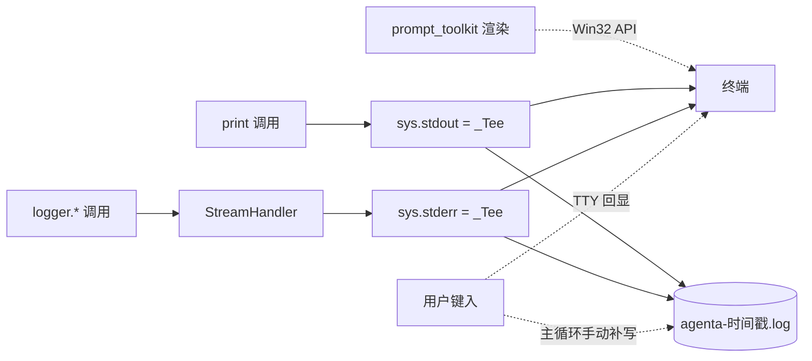

# 1. CLI 打印写文件

**功能描述**：CLI 终端看到的所有打印（banner / `你: <输入>` / Agent 回答 / `logger.*` / traceback）按 `CLI_LOG_MODE` 同步落到 `./logs/` 下的日志文件，方便事后排查 bug 与复盘对话。模式三选一：`NONE`（不写）/ `SINGLE`（固定 `agenta.log` 跨启动追加）/ `MULTI`（每次启动新建带时间戳文件）。

| 项 | 内容 |
|---|---|
| 用户故事 | 作为本地开发者，我希望"CLI 跑起来时所有看到的输出同时存到文件"，这样事后排查 bug / 复盘对话不必盯着终端不放；不同场景能按模式选"单次复盘"还是"长期追加" |
| 验收标准 | ① `CLI_LOG_MODE=NONE`（默认）行为完全不变，零副作用 ② `CLI_LOG_MODE=SINGLE` 写固定 `./logs/agenta.log`，跨启动 **append**（不覆盖） ③ `CLI_LOG_MODE=MULTI` 启动时新建 `./logs/agenta-YYYYMMDD-HHMMSS.log`，**每次启动一个新文件**（write 覆盖） ④ 终端正常交互（`prompt_toolkit` 提示符 / Tab 补全 / 历史上下键不被破坏） ⑤ 日志文件含 banner / 用户输入 / Agent 回答 / `logger.*` / stderr / traceback，UTF-8 中文正常 ⑥ 非法值（如 `CLI_LOG_MODE=FOO`）启动 warn 一行并降级 `NONE`，不阻塞主流程 ⑦ 大小写不敏感（`single` / `Single` / `SINGLE` 等价） |
| Scope | **本期做**：① stdout / stderr 包 tee 同步双写 ② `logger` 复用 stderr tee（不另起 `FileHandler`） ③ 用户输入显式回写文件（TTY 回显不经 Python stream） ④ 单 config `CLI_LOG_MODE` 三值枚举，默认 `NONE` **暂时不做**：文件 rotation / 压缩 / 上传；多文件分流（stdout.log 与 logger.log 分开）；Chainlit 端镜像 |
| 依赖 | `prompt_toolkit`（已用）；标准库 `sys` / `logging` / `pathlib` / `datetime` |

**实现机制示意**

# 2. logger 级别可配置

**功能描述**：root logger 的输出级别从 `.env` 的 `LOG_LEVEL` 读取，**同时作用于终端 stderr 与落盘文件**（因为文件就是 stderr 的 tee 出口），不重启 Python 不改代码就能切换 DEBUG / INFO / WARNING / ERROR / CRITICAL。

# 3. UI log

**功能描述**：UI 模式下后端（含 agent）跑在 uvicorn 进程里，由 `tools/ui.ps1` 启动并把进程的 stdout + stderr 合并重定向到 `./logs/uvicorn.log`。所以 UI 模式没有单独的 agent 日志文件，**agent 业务日志与 uvicorn 访问日志混在 `uvicorn.log` 这一个文件里**（对比 CLI 模式的 `agenta.log`）。查看：`.\tools\ui.ps1 logs uvicorn`（实时 tail，Ctrl+C 只退出查看、服务继续跑），或直接打开该文件。

为让 UI 模式日志可用，做了两处修正：

| 问题 | 现象 | 修正 |
|---|---|---|
| root logger 未配置 | uvicorn 默认只配自己的 `uvicorn.*` logger，不给 root 加 handler；`src.*` 的 INFO 日志冒泡到 root 被 lastResort handler（固定 WARNING 级）吞掉，只剩 WARNING / ERROR 能看到，`LOG_LEVEL` 也压不出 INFO | `src/api/main.py` 顶部按 `LOG_LEVEL` 配一次 root logging（与 CLI 入口 `main.py` 对齐）。配好后 agent INFO 全量进 `uvicorn.log`，`LOG_LEVEL` 在 UI 模式也真正生效 |
| 中文乱码 | `ui.ps1` 经 cmd.exe 重定向落盘，Windows 中文系统下 Python 重定向输出默认走 GBK，编辑器按 UTF-8 读出现乱码 | `ui.ps1` 生成的启动脚本里设 `PYTHONIOENCODING=utf-8`，强制 stdio 用 UTF-8 写 |
