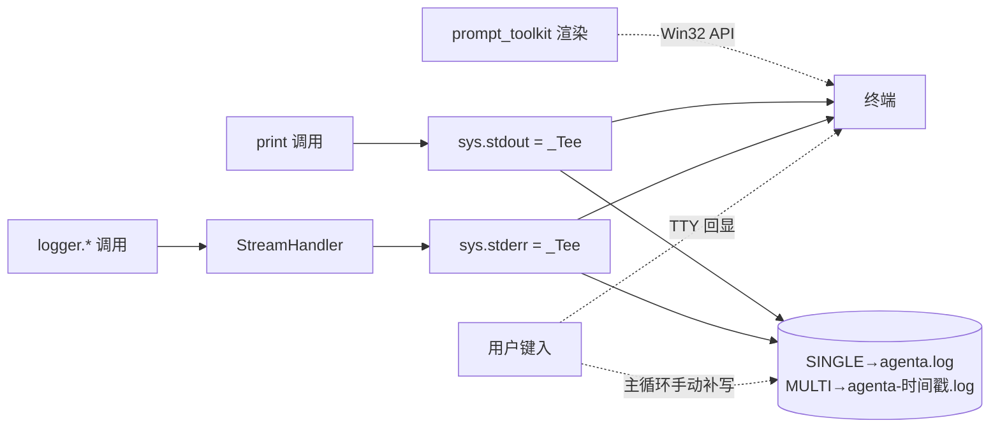
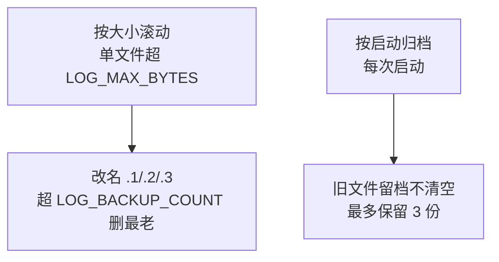

# 1. Phase 1
## 1.1. CLI log

**功能描述**：CLI 终端看到的所有打印（banner / `你: <输入>` / Agent 回答 / `logger.*` / traceback）按 `CLI_LOG_MODE` 同步写入 `./logs/` 下的日志文件，方便事后排查 bug 与复盘对话。模式三选一：`NONE`（不写）/ `SINGLE`（固定 `agenta.log` 跨启动追加）/ `MULTI`（每次启动新建带时间戳文件）。开启文件写入时（`SINGLE` / `MULTI`），启动后会多打一行 `📝 终端输出同步写入（<模式> / 追加|覆盖）：<路径>` 作为提示。

> 配置项见 `src/config.py` 的 `CLI_LOG_MODE`；实现见 `main.py` 顶部的 `_Tee` 与初始化段。


| 项 | 内容 |
|---|---|
| 用户故事 | 作为本地开发者，我希望"CLI 跑起来时所有看到的输出同时存到文件"，这样事后排查 bug / 复盘对话不必盯着终端不放；不同场景能按模式选"单次复盘"还是"长期追加" |
| 验收标准 | ① `CLI_LOG_MODE=NONE`（默认）行为完全不变，零副作用<br>② `CLI_LOG_MODE=SINGLE` 写固定 `./logs/agenta.log`，跨启动 **append**（不覆盖）<br>③ `CLI_LOG_MODE=MULTI` 启动时新建 `./logs/agenta-YYYYMMDD-HHMMSS.log`，**每次启动一个新文件**（write 覆盖）<br>④ 终端正常交互（`prompt_toolkit` 提示符 / Tab 补全 / 历史上下键不被破坏）<br>⑤ 日志文件含 banner / 用户输入 / Agent 回答 / `logger.*` / stderr / traceback，UTF-8 中文正常<br>⑥ 非法值（如 `CLI_LOG_MODE=FOO`）启动 warn 一行并降级 `NONE`，不阻塞主流程<br>⑦ 大小写不敏感（`single` / `Single` / `SINGLE` 等价） |
| Scope | **本期做**：① stdout / stderr 包 tee 同步双写 ② `logger` 复用 stderr tee（不另起 `FileHandler`） ③ 用户输入显式回写文件（TTY 回显不经 Python stream） ④ 单 config `CLI_LOG_MODE` 三值枚举，默认 `NONE`<br>**暂时不做**：文件 rotation / 压缩 / 上传；多文件分流（stdout.log 与 logger.log 分开） |
| 依赖 | `prompt_toolkit`（已用）；标准库 `sys` / `logging` / `pathlib` / `datetime` |


**实现机制示意**



要点：`_Tee` 只接管 `write` / `flush`，其余属性（`isatty` / `fileno` / `encoding`）透传给原 stream，所以不破坏 `prompt_toolkit` 的 TTY 检测；用户键入只走终端 TTY 回显，不经 Python `stdout`，因此主循环里显式补写一行 `你: <输入>` 到文件，日志里才能完整还原"我问了啥 → Agent 答了啥"。

## 1.2. logger 级别可配置

**功能描述**：root logger 的输出级别从 `.env` 的 `LOG_LEVEL` 读取，**同时作用于终端 stderr 与日志文件**（因为文件就是 stderr 的 tee 出口），改 `.env` 重启进程即可切换 DEBUG / INFO / WARNING / ERROR / CRITICAL，不必改代码。非法值（如 `LOG_LEVEL=FOO`）启动 warn 一行并降级 `INFO`。CLI 入口（`main.py`）与 UI 后端入口（`src/api/main.py`）各自配一次 root logging，规则一致。第三方库（`httpx` / `httpcore` / `openai` / `chromadb` / `sentence_transformers`）固定压到 `WARNING`，避免淹没业务日志。

## 1.3. UI log

### 1.3.1. uvicorn.log
**功能描述**：UI 模式下后端（含 agent）跑在 uvicorn 进程里，由 `tools/ui.ps1` 启动并把进程的 stdout + stderr 合并重定向到 `./logs/uvicorn.log`。所以 UI 模式没有单独的 agent 日志文件，**agent 业务日志与 uvicorn 访问日志混在 `uvicorn.log` 这一个文件里**（对比 CLI 模式的 `agenta.log`）。查看：`.\tools\ui.ps1 logs uvicorn`（实时 tail，Ctrl+C 只退出查看、服务继续跑），或直接打开该文件。

为让 UI 模式日志可用，做了两处修正：

| 问题 | 现象 | 修正 |
|---|---|---|
| root logger 未配置 | uvicorn 默认只配自己的 `uvicorn.*` logger，不给 root 加 handler；`src.*` 的 INFO 日志冒泡到 root 被 lastResort handler（固定 WARNING 级）吞掉，只剩 WARNING / ERROR 能看到，`LOG_LEVEL` 也压不出 INFO | `src/api/main.py` 顶部按 `LOG_LEVEL` 配一次 root logging（与 CLI 入口 `main.py` 对齐）。配好后 agent INFO 全量进 `uvicorn.log`，`LOG_LEVEL` 在 UI 模式也真正生效 |
| 中文乱码 | `ui.ps1` 经 cmd.exe 重定向写入文件，Windows 中文系统下 Python 重定向输出默认走 GBK，编辑器按 UTF-8 读出现乱码 | `ui.ps1` 生成的启动脚本里设 `PYTHONIOENCODING=utf-8`，强制 stdio 用 UTF-8 写 |

### 1.3.2. vite.log

**功能描述**：UI 模式下前端 dev server（vite）由 `tools/ui.ps1` 启动（`npm run dev`，工作目录 `frontend/`），进程 stdout + stderr 合并重定向到 `./logs/vite.log`。查看：`.\tools\ui.ps1 logs vite`（实时 tail，Ctrl+C 只退出查看、服务继续跑）。每次 `start` 会先清空旧 `vite.log` 再写，避免新旧两次启动的日志混在一起。

内容主要三类：① vite 启动 banner（版本号 / Local / Network 地址 / HMR 提示）；② 热更新（HMR）刷新提示；③ http proxy 转发错误。

最常见的是 `http proxy error: /api/... ECONNREFUSED`：vite 把 `/api/*` 代理到后端 uvicorn（:8000），若先起 vite、后起 uvicorn，这段空窗期的前端请求被拒，刷一串 `ECONNREFUSED`，等后端起来自动恢复——**不是 bug，是启动顺序导致的临时现象**。

已知瑕疵（与 uvicorn.log 不同，**当前未修**，留作 Phase 2）：

| 现象 | 原因 |
|---|---|
| 日志里夹 `[32m` 这类转义序列 | vite 输出带 ANSI 颜色控制码，直接写进文件后编辑器不解析转义，不如终端好看 |
| 箭头等字符变 `�?` | `➜` 等非 ASCII 字符经 cmd 重定向出现 mojibake；`ui.ps1` 的 `PYTHONIOENCODING=utf-8` 只对 Python 进程生效，vite 是 node 进程不吃这个变量 |


# 2. Phase 2

## 2.1. Phase 1 Review

Phase 1 的目标是"让本地调试有日志可查"，落地三件事：CLI 终端输出 tee 双写（§1.1）、logger 级别可配（§1.2）、UI 两个 dev server 各自重定向日志（§1.3）。

**做对的地方**

- `_Tee` 只接管 `write` / `flush` 并透传其余属性，没破坏 `prompt_toolkit` 的提示符 / Tab 补全 / 历史上下键。
- stdout / stderr 统一覆写 UTF-8（`errors="replace"` 兜底），中文与 emoji 不再让进程崩。
- UI 后端入口补配 root logging 后，`LOG_LEVEL` 在 UI 模式真正生效，agent 业务日志全量进 `uvicorn.log`。

**实际日志暴露的问题（带证据）**

下表问题来自对现有 `logs/` 三个文件的观察，作为 Phase 2 的输入：

| 问题 | 证据 | 影响 |
|---|---|---|
| skill 扫描日志刷屏 | `uvicorn.log` 里 `[SkillLoader] 发现 4 个 skill` 在一次运行内出现 34 次（几乎每个 API 请求一条） | INFO 噪音淹没真正的业务日志，排查时得手动滤 |
| access 日志与业务日志混在一起 | `uvicorn.log` 里 `INFO: 127.0.0.1 - "GET /api/... 200 OK"` 与 agent 业务 INFO 交错 | 想"只看 agent 在干嘛"或"只看 HTTP 请求"都做不到 |
| reload 留误导性 traceback | 改 `src/*.py` 触发 WatchFiles reload，每次留一段 `KeyboardInterrupt` traceback（如 `uvicorn.log` 多处） | 看着像崩溃，其实是正常热重启，新手易误判 |
| 日志无大小上限 / rotation | `SINGLE` 模式 `agenta.log` 跨启动一直 append；UI 端 `uvicorn.log` / `vite.log` 仅在 `start` 时清空 | 长期跑文件无限增长；想回看上一次启动的日志已被清掉 |
| `vite.log` 含 ANSI 码 + mojibake | 见 §1.3.2 | 文件直接打开可读性差 |
| 缺请求 / session 关联标识 | 多轮对话的日志只能靠时间戳猜归属 | 并发或多 session 场景难定位某次对话的完整链路 |

## 2.2. Phase 2 可加入的 feature

**F5 不做**（过滤交给 Notepad++ / `Select-String`，不在项目里再造弱化版搜索），其余 7 项**已实现**。使用方式见下文 §3 日志使用指南。

| # | feature | 解决的问题 | 落地做法 | 状态 |
|---|---|---|---|---|
| F1 | skill 扫描日志降噪 | skill 扫描刷屏 | `skill_loader.py` 每请求的扫描日志降到 `DEBUG`；CLI 启动用 `format_scan_banner` 单独打 stdout | ✅ |
| F2 | access / 业务日志分流（单文件 + 前缀） | 两类日志混在一起 | 共用一个 `uvicorn.log`，`TaggedFormatter` 给业务/框架日志加 `[APP]`、access 加 `[ACCESS]`，靠 `Select-String '\[ACCESS\]'` 等过滤 | ✅ |
| F3 | 按启动归档 | 重启丢历史、MULTI 文件堆积 | `agenta.log`/`uvicorn.log` 改为追加（不清空）；`vite.log` 启动时归档为 `.1`、MULTI 文件留最近 3 份 | ✅ |
| F4 | `vite.log` 清洗 | ANSI 码 + mojibake | `ui.ps1` 给 vite 设 `FORCE_COLOR=0` / `NO_COLOR=1`，不再输出颜色码；箭头也随之不再乱码 | ✅ |
| F5 | 日志查看 / 过滤增强 | 噪音中捞关键信息难 | 交给 Notepad++ / `Select-String`，配合 F2 前缀即可 | ❌ 不做 |
| F6 | 请求 / session 关联标识 | 缺关联无法串链路 | `log_setup.ContextFilter` + contextvar 注入 `s:<session> r:<request>`；CLI 主循环、UI chat 路由设 session，请求中间件设 request id | ✅ |
| F7 | 日志时间补全 | 无日期 / access 无时间戳 | 统一格式 `%Y-%m-%d %H:%M:%S`，对业务、框架、access 日志全生效 | ✅ |
| F8 | 按大小滚动 | 单次长跑撑爆文件 | CLI 用 `_LogFile`（共享文件 + 按 `LOG_MAX_BYTES` 滚动、留 `LOG_BACKUP_COUNT` 份）；UI 用 `RotatingFileHandler` | ✅ |

实现要点：

- 新增 `src/log_setup.py` 统一格式 / 级别 / 上下文注入（`TaggedFormatter` + `ContextFilter`），CLI 与 UI 共用。
- UI 后端改由 `src/api/run.py` 用 `uvicorn.run(log_config=...)` 启动，日志经 `RotatingFileHandler` 直接写 `uvicorn.log`（一举覆盖 F2/F6/F7/F8 + F3 追加）；`ui.ps1` 不再 shell 重定向到 `uvicorn.log`，进程裸输出（MCP 提示、早期崩溃）另存 `uvicorn.boot.log`。
- 新增 config：`LOG_MAX_BYTES`、`LOG_BACKUP_COUNT`（已同步 `config.py` / `.env.example` / `.env`）。

# 3. 日志使用指南

## 3.1. 日志文件一览

| 文件 | 来自 | 内容 | 怎么写的 |
|---|---|---|---|
| `logs/agenta.log` | CLI（`python main.py`） | 终端看到的一切：banner / `你: <输入>` / Agent 回答 / `logger.*` / traceback | 进程自己经 `_Tee` 双写（终端 + 文件） |
| `logs/uvicorn.log` | UI 后端（`python -m src.api.run`） | 业务日志（`src.*`）+ uvicorn 框架日志 + HTTP 访问日志 | 后端 `RotatingFileHandler` 直接写 |
| `logs/uvicorn.boot.log` | UI 后端启动包装脚本 | 进程裸 stdout/stderr：MCP 子进程提示、启动早期崩溃 | `ui.ps1` 的 shell 重定向 |
| `logs/vite.log` | UI 前端（`npm run dev`） | vite 启动 banner / HMR 提示 / proxy 错误 | `ui.ps1` 的 shell 重定向 |

`*.log.1` / `*.log.2` / `*.log.3` 是滚动 / 归档产生的历史备份（见 §4）。

CLI 是否写 `agenta.log` 由 `CLI_LOG_MODE` 决定（默认 `NONE` 不写）。UI 的 `uvicorn.log` / `vite.log` 总是写。

## 3.2. 日志格式

业务与框架日志带 `[APP]` 前缀，HTTP 访问日志带 `[ACCESS]` 前缀，便于一眼区分、也便于过滤：

```
2026-06-08 12:18:39 [APP] [INFO] [s:- r:-] mcp_manager.py:111 - [MCPManager] 启动完成：2 connected
2026-06-08 12:19:29 [ACCESS] [r:-] 127.0.0.1:57178 - "GET /api/health HTTP/1.1" 200
```

字段含义：

| 字段 | 含义 |
|---|---|
| `2026-06-08 12:18:39` | 日期 + 时间 |
| `[APP]` / `[ACCESS]` | 来源：业务/框架日志 vs HTTP 访问日志 |
| `[INFO]` | 日志级别 |
| `[s:... r:...]` | 当前 session id / request id（无则 `-`，见下） |
| `mcp_manager.py:111` | 打日志的文件:行号 |

关于 `s:` / `r:`：

- `s:`（session）：CLI 每轮问答、UI `/api/chat/stream` 处理期间会带上当前 session id；其余时候是 `-`。
- `r:`（request）：UI 每个 HTTP 请求处理期间带上随机短 id；access 日志在响应之后由 uvicorn 打出，已脱离请求上下文，所以常是 `-`，这是正常的。

## 3.3. 配置项

都在 `.env`（参考 `.env.example`）：

| 配置 | 默认 | 说明 |
|---|---|---|
| `LOG_LEVEL` | `INFO` | 级别：`DEBUG` / `INFO` / `WARNING` / `ERROR` / `CRITICAL`；非法值降级 `INFO` |
| `CLI_LOG_MODE` | `NONE` | CLI 落盘模式：`NONE` 不写 / `SINGLE` 固定 `agenta.log` 跨启动追加 / `MULTI` 每次启动新建带时间戳文件 |
| `LOG_MAX_BYTES` | `5242880`(5MB) | 单个文件大小上限，超过即滚动；`0` = 不限 |
| `LOG_BACKUP_COUNT` | `3` | 滚动 / 归档保留的备份份数（不含当前文件） |

改完重启对应进程（CLI 重新运行、UI 用 `ui.ps1 stop` + `start`）即生效。

UI 设置面板里只放了 `LOG_LEVEL`：它有副作用 hook，改完能立刻应用到 root logger；其余三项都是进程启动时读一次、运行中改不会重建 handler，所以留在 `.env`、靠重启生效，不进面板以免"改了没反应"。`CLI_LOG_MODE` 只管 CLI 的 `agenta.log`，对 UI 无效。

## 3.4. 滚动与归档规则

两种回收机制并存：



各文件具体行为：

| 文件 | 按大小滚动 | 按启动 |
|---|---|---|
| `agenta.log`（SINGLE） | ✅ 写满滚 `.1/.2/.3` | 追加，不清空 |
| `agenta.log`（MULTI 时为 `agenta-时间戳.log`） | ✅ | 每次新建一份，旧的只保留最近 3 份 |
| `uvicorn.log` | ✅（后端 `RotatingFileHandler`） | 追加，不清空 |
| `uvicorn.boot.log` | ❌（裸重定向，量极小） | 每次启动覆盖 |
| `vite.log` | ❌（裸重定向） | 启动时归档旧的为 `.1`，保留最近 3 份 |

## 3.5. 怎么查看 / 过滤

实时跟踪（服务继续跑，Ctrl+C 只退出查看）：

```powershell
.\tools\ui.ps1 logs uvicorn   # tail uvicorn.log
.\tools\ui.ps1 logs vite      # tail vite.log
```

过滤交给编辑器（Notepad++ 搜索 / 书签）或 `Select-String`，靠前缀分流很方便：

```powershell
Select-String '\[ACCESS\]' .\logs\uvicorn.log   # 只看 HTTP 访问
Select-String '\[APP\]'     .\logs\uvicorn.log   # 只看业务/框架
Select-String 'ERROR'       .\logs\uvicorn.log   # 只看报错
Select-String 's:<某sessionid>' .\logs\uvicorn.log  # 追某次会话
```

## 3.6. 常见现象怎么读

| 现象 | 含义 | 要紧吗 |
|---|---|---|
| `vite.log` 里一串 `http proxy error: /api/... ECONNREFUSED` | 前端起得比后端早，`/api/*` 代理暂时连不上 :8000 | 不要紧，后端起来自动恢复 |
| `uvicorn.boot.log` 里 `Secure MCP Filesystem Server running on stdio` | MCP 子进程的裸输出 | 正常 |
| 启动失败、`uvicorn.log` 是空的 | 崩在 logging 配置之前 | 看 `uvicorn.boot.log` 里的 traceback |
| `[ERROR] ... 402 Insufficient Balance` | LLM 账户余额不足 | 充值 / 换 key |
