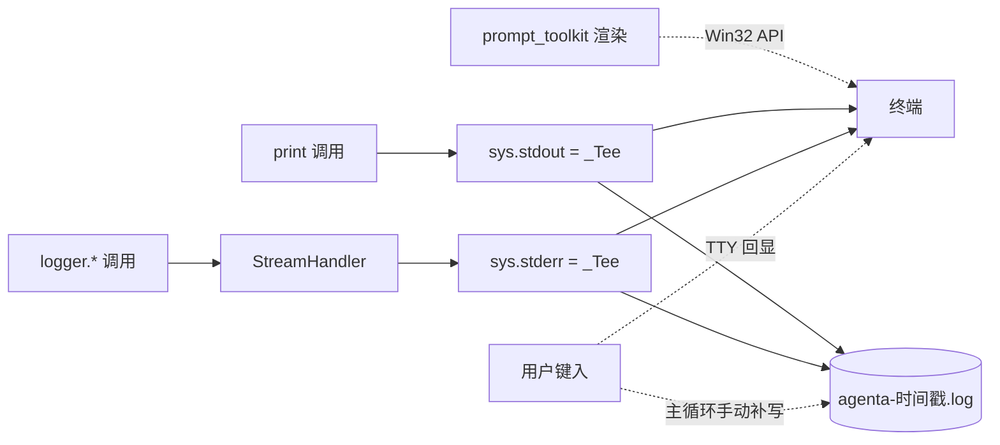

# 1. CLI 打印写文件

**功能描述**：CLI 终端看到的所有打印（banner / `你: <输入>` / Agent 回答 / `logger.*` / traceback）按 `CLI_LOG_MODE` 同步落到 `./logs/` 下的日志文件，方便事后排查 bug 与复盘对话。模式三选一：`NONE`（不写）/ `SINGLE`（固定 `agenta.log` 跨启动追加）/ `MULTI`（每次启动新建带时间戳文件）。

**Step 0 · 需求规格**

| 项 | 内容 |
|---|---|
| 用户故事 | 作为本地开发者，我希望"CLI 跑起来时所有看到的输出同时存到文件"，这样事后排查 bug / 复盘对话不必盯着终端不放；不同场景能按模式选"单次复盘"还是"长期追加" |
| 验收标准 | ① `CLI_LOG_MODE=NONE`（默认）行为完全不变，零副作用 ② `CLI_LOG_MODE=SINGLE` 写固定 `./logs/agenta.log`，跨启动 **append**（不覆盖） ③ `CLI_LOG_MODE=MULTI` 启动时新建 `./logs/agenta-YYYYMMDD-HHMMSS.log`，**每次启动一个新文件**（write 覆盖） ④ 终端正常交互（`prompt_toolkit` 提示符 / Tab 补全 / 历史上下键不被破坏） ⑤ 日志文件含 banner / 用户输入 / Agent 回答 / `logger.*` / stderr / traceback，UTF-8 中文正常 ⑥ 非法值（如 `CLI_LOG_MODE=FOO`）启动 warn 一行并降级 `NONE`，不阻塞主流程 ⑦ 大小写不敏感（`single` / `Single` / `SINGLE` 等价） |
| Scope | **本期做**：① stdout / stderr 包 tee 同步双写 ② `logger` 复用 stderr tee（不另起 `FileHandler`） ③ 用户输入显式回写文件（TTY 回显不经 Python stream） ④ 单 config `CLI_LOG_MODE` 三值枚举，默认 `NONE` **暂时不做**：文件 rotation / 压缩 / 上传；多文件分流（stdout.log 与 logger.log 分开）；Chainlit 端镜像 |
| 依赖 | `prompt_toolkit`（已用）；标准库 `sys` / `logging` / `pathlib` / `datetime` |

**Step 1 · Review 现状**

终端可见输出有三大来源，落盘前各自的路径：

| 来源 | 现状 | 是否能被 tee 抓到 |
|---|---|---|
| `print()`（banner / Agent 回答 / 命令反馈） | 走 `sys.stdout` | ✅ 包 stdout 即可 |
| `logging.*`（模块内日志） | `basicConfig` 默认 `StreamHandler → sys.stderr` | ✅ 包 stderr 即可 |
| `prompt_toolkit` 渲染（`你: ` 提示符 / 补全菜单） | Win 上走 Win32 console API，**绕 sys.stdout** | ❌ 抓不到（也不该抓，控制码进文件无意义） |
| 用户键入字符 | TTY 驱动直接回显，**根本不经 Python 任何 stream** | ❌ 必须手动补写 |

已有日志配置：`main.py` 顶部 `logging.basicConfig(level=INFO, ...)`，无 `FileHandler`。

缺口：① 输出无落盘 ② 用户输入即使开 tee 也抓不到。

**Step 2 · 实施计划**

关键决策：

| 决策点 | 选项 | 选择 | 理由 |
|---|---|---|---|
| 怎么"分流" | shell 重定向 `>` / `tee` 管道 / Python 内置 `_Tee` 包装 | **Python 内置 `_Tee`** | shell 方案破坏 TTY（`prompt_toolkit` 检测不到 TTY 退化为盲打），且 Win/bash 不通用；Python 内包装与 shell 无关 |
| logger 与文件如何衔接 | 加 `FileHandler` / 复用 stderr tee | **复用 stderr tee** | `basicConfig` 默认 `StreamHandler` 落 stderr，stderr 被 tee 后 logger 输出自动入文件；额外 `FileHandler` 会与 tee 重复写一遍 |
| 用户输入怎么进文件 | `print(user_input)` 显式回显 / 直接写文件句柄 | **直接写文件句柄** | `print` 会让终端额外再打一遍（与 TTY 回显重复）；直接 `_CLI_LOG_FILE.write(...)` 只进文件不影响终端 |
| Tee 装配时机 | `basicConfig` 前 / 后 | **`basicConfig` 之前** | `StreamHandler` 构造时绑定 `sys.stderr` 引用，若 basicConfig 在前 → 拿到的是未包装的原 stderr，logger 进不了文件 |
| 文件 buffer | 块缓冲 / 行缓冲 / 无缓冲 | **行缓冲** (`buffering=1`) | 每条 `\n` 立即刷盘，进程异常退出不丢日志；对吞吐无明显影响 |
| 文件名策略 | 固定单文件追加 / 每次启动带时间戳 / 两者皆要 | **两者皆要（`SINGLE` + `MULTI`）** | 单文件追加适合"长期录同一类问题排查"，时间戳分文件适合"单次会话复盘"；用一个 `CLI_LOG_MODE` 枚举把两者收口，避免双开关组合误用 |
| 开关数量 | 单开关 bool / 三值枚举 / 开关+路径+文件名模板 | **单 `CLI_LOG_MODE` 三值枚举** | 路径写死 `./logs/`、命名规则按模式定；需要时再扩路径 / 模板，不预先 over-engineer |

改动清单：

| # | 文件 | 改动 |
|---|---|---|
| 1 | `src/config.py` | 新增 `CLI_LOG_MODE: str`（默认 `"NONE"`；可选 `NONE` / `SINGLE` / `MULTI`） |
| 2 | `.env.example` | 第 8 节"CLI 日志（级别 + 落盘）"加 key（§5.1 三处同步） |
| 3 | `.env` | 同步加 key |
| 4 | `.gitignore` | 加 `logs/` 排除 |
| 5 | `main.py` | `_Tee` 类 + 模式分支（NONE/SINGLE/MULTI）+ 非法值降级 + 包 `sys.stdout/stderr` + 用户输入回写 + 启动时打印模式与路径 |

**Step 3 · 代码实现**

| 改动 | 位置 | 关键点 |
|---|---|---|
| Tee 类 | `main.py:_Tee` | `write` / `flush` 同时写原 stream 和文件；`__getattr__` 把 `isatty` / `fileno` / `encoding` 等透传原 stream → `prompt_toolkit` TTY 检测不受影响 |
| 模式解析 | `main.py` `_CLI_LOG_MODE` 局部变量 | `os.getenv("CLI_LOG_MODE", "NONE").upper()`；不在 `{NONE, SINGLE, MULTI}` 三值集合内则 `[WARN]` 打印并降级 `NONE` |
| 文件初始化 | `main.py` 顶部 `load_dotenv()` 之后、`basicConfig` 之前 | 模式非 `NONE` 时 `Path("./logs").mkdir(parents=True, exist_ok=True)`；`SINGLE` 用 `./logs/agenta.log` + `"a"` 追加；`MULTI` 用 `./logs/agenta-{ts}.log` + `"w"` 覆盖；统一 `encoding="utf-8", buffering=1`；`OSError` 静默降级 |
| stream 包装 | `main.py` 同上 | `sys.stdout = _Tee(sys.stdout, _CLI_LOG_FILE)`；`sys.stderr = _Tee(sys.stderr, _CLI_LOG_FILE)` |
| 用户输入回写 | `main.py` 主循环 `if not user_input: continue` 之后 | `_CLI_LOG_FILE.write(f"你: {user_input}\n") + flush`；写失败 try/except 吞掉 |
| 启动提示 | `main.py:main()` 入口 banner 后 | `print(f"📝 终端输出同步写入（{mode} / 追加|覆盖）：{path}")` 让用户知道模式与日志去向 |

**实现机制示意**

**Step 4 · UT 与冒烟**

- **无 UT**：纯 IO 装配，mock `sys.stdout/stderr` 的成本 > 收益
- **冷烟四组**对照 Step 0 验收：
  - `CLI_LOG_MODE=NONE`：`sys.stdout` 仍是 `TextIOWrapper`，`_CLI_LOG_PATH=None`，零副作用 ✅
  - `CLI_LOG_MODE=SINGLE`：`./logs/agenta.log` 以 `"a"` 打开；第二次启动文件 size 增长（不被截断）；`_Tee` 包装生效 ✅
  - `CLI_LOG_MODE=MULTI`：`./logs/agenta-YYYYMMDD-HHMMSS.log` 以 `"w"` 打开；每次启动生成新文件；文件内含 `logger.info` / `print` / `stderr` 三路输出，UTF-8 中文正常 ✅
  - `CLI_LOG_MODE=FOO`（非法）：启动 `[WARN]` 行，按 `NONE` 运行 ✅
- `ReadLints`：0 错

**Step 5 · 评估** —— skip（开发辅助 utility，无业务指标可评）

**Step 6 · design.md 同步** —— skip（本地开发工具，不属于 [design.md §3](design.md) 的系统设计范畴）

**已知不足 / Punt**

| # | 项 | 说明 |
|---|---|---|
| 1 | `prompt_toolkit` 的 `你: ` 提示符本身不进文件 | Win32 console API 绕 stdout；但紧随其后的 `你: <input>` 行已由主循环手动 log，复盘完整性不受影响 |
| 2 | `SINGLE` 模式无 rotation / 大小上限 | 长期追加同一文件可能膨胀到 GB 级；真要长期录可后续加 `logging.handlers.RotatingFileHandler` 风格。临时膨胀手工 `rm ./logs/agenta.log` 即可（下次启动自动重建） |
| 3 | `SINGLE` 模式多进程并发写会交错 | 同时跑两个 `main.py` 实例时两边都在 append 同一文件，行可能交错混杂；当前单进程开发场景不触发，多实例需求出现再加 file lock |
| 4 | stdout 与 logger 日志混在同一文件 | 排查时 grep `[INFO]` / `[WARNING]` 即可分流；如需分文件再扩 config |

# 2. logger 级别可配置

**功能描述**：root logger 的输出级别从 `.env` 的 `LOG_LEVEL` 读取，**同时作用于终端 stderr 与落盘文件**（因为文件就是 stderr 的 tee 出口），不重启 Python 不改代码就能切换 DEBUG / INFO / WARNING / ERROR / CRITICAL。

**Step 0 · 需求规格**

| 项 | 内容 |
|---|---|
| 用户故事 | 作为本地开发者，我希望"想看更多内部日志就调 DEBUG，想看清干净就调 WARNING/ERROR"——通过 `.env` 改一行即可，不动代码、不改 `basicConfig` 调用 |
| 验收标准 | ① `LOG_LEVEL=DEBUG`：`logger.debug(...)` 输出可见（终端 + 文件均生效） ② `LOG_LEVEL=WARNING`：`logger.info(...)` 不再输出，只看到 WARNING+ ③ 默认 `INFO`（向后兼容原行为） ④ 非法值（如 `LOG_LEVEL=VERBOSE`）启动时打印 warning 行并降级到 `INFO`，**不阻塞主流程** ⑤ 大小写不敏感（`info` / `Info` / `INFO` 等价） |
| Scope | **本期做**：① 新增 `LOG_LEVEL` config，应用到 root logger via `logging.basicConfig(level=...)` **暂时不做**：① 按模块单独设级别（`src.agent.*=DEBUG` + `src.rag.*=INFO`）—— 没必要的细粒度；② 三方噪声库（`httpx` / `chromadb` 等）级别仍固定 WARNING，不随 `LOG_LEVEL` 变化（详见"已知不足 #1"） |
| 依赖 | 标准库 `logging`；已有的 `[§1 落盘](#1-cli-打印写文件)` tee 机制（无需任何改动即自动生效） |

**Step 1 · Review 现状**

| 现状 | 说明 |
|---|---|
| logger 级别硬编码 | `main.py` `logging.basicConfig(level=logging.INFO, ...)` 写死 INFO |
| 三方噪声过滤 | `main.py` 顶部循环把 `httpx` / `httpcore` / `openai` / `chromadb` / `sentence_transformers` 各 logger 显式压到 `WARNING`，独立于 root logger |
| 终端 / 文件双输出 | `[§1](#1-cli-打印写文件)` tee 后 stderr → 终端 + 文件双写；只需改 root logger level，两路自动同步 |

**Step 2 · 实施计划**

关键决策：

| 决策点 | 选项 | 选择 | 理由 |
|---|---|---|---|
| 名称解析方式 | `getattr(logging, name, None)` 校 int / `logging.getLevelNamesMapping()`（3.11+） | **`getattr` + `isinstance(level, int)`** | 简单稳定，无版本依赖；私有 `_nameToLevel` 不用 |
| 非法值处理 | 抛 `RuntimeError` / 静默降级 / **warn 后降级** | **warn 后降级** | 配置错别字不应阻塞 CLI 启动，但要显式提示 |
| 终端 / 文件如何同步级别 | 各起一个 Handler 单独设级别 / **复用 root logger level** | **复用 root logger level** | `[§1](#1-cli-打印写文件)` 的 tee 让 stderr 同时进终端和文件，root level 自动覆盖两边 |
| 是否同步缩放三方噪声 | 同步缩放（`max(WARNING, level)`）/ **固定 WARNING** | **固定 WARNING** | 用户通常调 `LOG_LEVEL=DEBUG` 是想看自己代码细节，三方库 DEBUG 反而干扰；保持 WARNING 为最简单稳定 |

改动清单：

| # | 文件 | 改动 |
|---|---|---|
| 1 | `src/config.py` | 新增 `LOG_LEVEL: str`（默认 `"INFO"`） |
| 2 | `.env.example` + `.env` | 第 8 节加 key（§5.1 三处同步），章节名同步改成"CLI 日志（级别 + 落盘）" |
| 3 | `main.py` | `basicConfig(level=...)` 参数由 `logging.INFO` 换成 `_resolve()` 解析结果 |

**Step 3 · 代码实现**

| 改动 | 位置 | 关键点 |
|---|---|---|
| level 解析 | `main.py` `_LOG_LEVEL_NAME` / `_log_level` 局部变量 | `getattr(logging, name.upper(), None)`；`isinstance(_, int)` 不通过则打 warn 行并降级 `INFO` |
| basicConfig 注入 | `main.py:logging.basicConfig(level=_log_level, ...)` | format / datefmt 不变 |
| 三方噪声过滤 | `main.py` `for _noisy in (...)` 循环 | **保持不变**（固定 WARNING） |

**Step 4 · UT 与冒烟**

- 无 UT（纯 config 解析，behavior 通过 logging 本身保证）
- **冷烟 3 个级别**对照验收：
  - `LOG_LEVEL=DEBUG` → 启动后 `logger.debug(...)` 输出 ✅
  - `LOG_LEVEL=WARNING` → `logger.info(...)` 静默，`logger.warning(...)` 输出 ✅
  - `LOG_LEVEL=VERBOSE`（非法）→ 启动 warn `⚠️ 未知 LOG_LEVEL '...'，降级使用 INFO ...`，之后按 INFO 运行 ✅
- 大小写：`LOG_LEVEL=info` 与 `INFO` 等价（统一 `.upper()`）✅
- `ReadLints`：0 错

**Step 5 · 评估** —— skip（开发辅助 utility，无业务指标可评）

**Step 6 · design.md 同步**

[`design.md §A.1`](design.md#a1-cli-输出落盘) 配置表加 `LOG_LEVEL` 维度，明确"同时作用于终端 stderr 与落盘文件"。

**已知不足 / Punt**

| # | 项 | 说明 |
|---|---|---|
| 1 | 三方噪声库（`httpx` / `chromadb` 等）级别**不**随 `LOG_LEVEL` 缩放 | 设 `LOG_LEVEL=ERROR` 时 `chromadb` 等仍会输出 WARNING；如要"全部一齐压到 ERROR"需要后续把噪声过滤改成 `max(WARNING, _log_level)`，权衡是 `LOG_LEVEL=DEBUG` 时会涌出 chromadb / httpx 的大量 DEBUG 噪声 |
| 2 | 不支持按模块设级别 | 整个 root logger 一刀切；想 `src.agent.*=DEBUG` + 其余 `INFO` 这种细粒度，需要扩成 dict 配置 |
