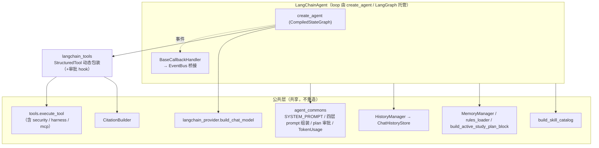

# iter_a：LangChain 适配

把 LangChain 从「保留骨架」推进到「对接公共层、与 Python / AutoGPT 三实现功能对齐」。
本迭代把原先夹在 Python 实现 `src/agent/agent.py` 里的共享资产抽到公共层
`src/agent/core/agent_commons.py`（agent.py 原名 re-export 保 Python 不破），其余只在
`src/agent/langchain_*.py` / `src/llm/langchain_provider.py` / `src/memory/langchain_history.py`
内做适配，确保 `IMP_METHOD=LANGCHAIN` 切换后表现层（CLI）零改动可用。

> 架构定位见 [design.md §5 IMP](./design.md)：三种实现共享公共层，差异只在 loop。
> LangChain 的 loop 由 **`create_agent`（LangChain 1.x / LangGraph）** 接管，本迭代的工作
> 就是把公共层的「依赖 / Helper」接到这条由框架托管的 loop 上，并把共享代码独立出来。

> **环境结论**：目标 venv（`../AgentA/.venv`）装的是 **LangChain 1.3.0**，legacy
> `AgentExecutor` / `create_tool_calling_agent` 已被移除。故本迭代直接切到 `create_agent`，
> 不再保留 legacy 路径（见 §2.3）。

## 1. 现状盘点

### 1.1 已有骨架（上一迭代落地）

| 文件                                   | 角色                                                           | 现状                                                                |
| ------------------------------------ | ------------------------------------------------------------ | ----------------------------------------------------------------- |
| `src/agent/langchain_agent.py`       | `LangChainAgent`：`create_tool_calling_agent + AgentExecutor` | `run` / `activate_skill` / `set_event_callback` 已具备；EventBus 接口对齐 |
| `src/agent/langchain_tools.py`       | 把 `tools.py` 包装成 `StructuredTool`                            | 仅包装 **4** 个工具（search/web/fetch/load_skill）                        |
| `src/llm/langchain_provider.py`      | `build_chat_model`：OpenAI / Anthropic 两路                     | 复用 `config.get_active_model()`，与 `provider.py` 同源配置               |
| `src/memory/langchain_history.py`    | `SQLiteChatMessageHistory`：桥接 `ChatHistoryStore`             | 仅持久化 user / assistant（与"只存 user+final"约定一致）                       |
| `tests/test_langchain_agent.py`      | 单测（`pytest.mark.langchain` 门控）                               | 覆盖 history / tools / 构造 / run，`bash tools/ut.sh -lc` 单独跑          |
| `src/cli/handlers.py · make_agent()` | 工厂：`IMP_METHOD=LANGCHAIN` 路由                                 | 已就位，构造入参与 Python Agent 一致                                         |

### 1.2 与「功能对齐」的差距

| #   | 缺口                                                                            | 影响                                                           | design 依据                                       |
| --- | ----------------------------------------------------------------------------- | ------------------------------------------------------------ | ----------------------------------------------- |
| G1  | 工具仅 4/17，缺 plan-execute(3) / study(3) / quiz(3) / srs(4)                      | LangChain 无法做计划、学习计划、测验、SRS                                  | §5 表：上述 tool 对 LangChain 标 ✓（StructuredTool 包装） |
| G2  | system prompt 只有 base，缺 4 层注入 + skill catalog；`user_memory` 入参未使用             | 用户 rules / 动态记忆 / 学习计划不进 prompt；LLM 看不到 `<available_skills>` | §3.5.2 四层注入                                     |
| G3  | 仅 emit `final_answer` / `error`                                               | CLI 分层渲染（thinking / token / tool / plan）退化为"只出最终答"           | §3.1 事件协议、§4.1                                  |
| G4  | 工具走 `.to_llm_str()` 直连，绕过 `CitationBuilder` / harness / security_filter 的统一编排 | 无引用编号、无 RAG 召回自检、注入清洗依赖 tool 内置                              | §3.6 / §3.12 / §3.13                            |
| G5  | 无 `MemoryManager.try_extract` 自动提取                                            | 跨 session 记忆不增长                                              | §3.4.2                                          |

> `origin/feature/langchain` 是早期独立 fork（删掉了 frontend / api / 大部分 docs），
> **不作为本迭代基线**；以当前 `main` 完整代码库为准。

## 2. 总体设计

### 2.1 对接策略：复用而非重写

LangChain 适配的核心原则与 AutoGPT 一致——**只编排，不重造公共层**：

### 2.2 工具包装：从 schema 动态生成

不再为每个 tool 手写 `StructuredTool`（4 个手写已显笨重），改为
**遍历 `get_tools(skill_bodies)` 的 OpenAI JSON schema 动态生成**：每个工具的
`parameters` → pydantic 模型（`create_model`），`func` → 统一闭包路由到
`execute_tool(name, args, skill_bodies, citation_builder, ...)`。

收益：

- 工具集合与 Python / AutoGPT 单一真相源一致（含 MCP 合流、名单门过滤、`fetch_url` 屏蔽逻辑）。
- security_filter / harness 已在 `execute_tool` 内部，**自动获得**（覆盖 G4 的一半）。
- 新增业务 tool 时 LangChain 零改动。

### 2.3 切到 `create_agent`（本迭代结论）

目标 venv 装的是 LangChain 1.3.0，legacy `AgentExecutor` / `create_tool_calling_agent`
已被移除，故直接采用 `langchain.agents.create_agent`：

- 每轮 `run()` 用当轮拼好的四层 prompt（`SystemMessage` 字面量，避开 `{...}` 模板解析）
  调 `create_agent(model, tools, system_prompt=...)` 得到 `CompiledStateGraph`，再
  `invoke({"messages": [...history..., HumanMessage]})`。
- 事件桥接仍走 `BaseCallbackHandler`（`langchain_core.callbacks`，跨版本稳定）：
  `on_llm_new_token` / `on_tool_start` / `on_tool_end`。
- token 统计从返回消息的 `usage_metadata` 累加（见 §4）。

### 2.4 公共代码独立（目标 3）

原先 `agent.py` 同时承载 Python 实现与若干「与 loop 无关的共享资产」，导致 LangChain /
AutoGPT 反向 import Python 实现文件。本迭代把这些资产抽到 `src/agent/core/agent_commons.py`：

`SYSTEM_PROMPT` / `TokenUsage` / `PlanAbortedByUser` / `get_shared_chat_history` /
`get_active_rules` / `build_active_study_plan_block` / `build_layered_system_prompt`
（四层 prompt 单一组装点） / `resolve_plan_approval`（审批裁决）。

`agent.py` 以原名 re-export 全部符号，Python 实现与其所有测试零改动（默认套件
**1344 passed** 验证）。LangChain 实现改为只 import `agent_commons`，不再依赖 `agent.py`。

## 3. 分阶段实现计划

| 阶段           | 内容                                                                                       | 落点                                          | 验收                               |
| ------------ | ---------------------------------------------------------------------------------------- | ------------------------------------------- | -------------------------------- |
| P1 工具全覆盖     | schema 动态生成全部 17+ tool，路由 `execute_tool`                                                 | `langchain_tools.py`                        | LangChain 能调 plan/study/quiz/srs |
| P2 四层 prompt | skill catalog + `<project_rules>` + `<user_context>` + `<active_study_plan>` + memory 接线 | `langchain_agent.py`                        | prompt 与 Python Agent 同构         |
| P3 事件流       | `BaseCallbackHandler` 桥接 token / tool_call_start / tool_call_end；plan_* 经 tool 返回后补发     | `langchain_agent.py`（新增 handler）            | CLI 分层渲染可见工具调用与流式 token          |
| P4 引用 / 自检   | per-run `CitationBuilder` 透传 + 末尾 sources 块；harness 已在 execute_tool 内                    | `langchain_agent.py` + `langchain_tools.py` | RAG 回答带 `[n]` 与 sources          |
| P5 测试        | 扩 `test_langchain_agent.py`：工具全集 / prompt 层 / 事件 / 引用                                    | `tests/`                                    | `bash tools/ut.sh -lc` 全绿        |

## 4. 关键取舍与已知限制

| 主题                   | 说明                                                                                                                                                                                                                                                          |
| -------------------- | ------------------------------------------------------------------------------------------------------------------------------------------------------------------------------------------------------------------------------------------------------------- |
| **plan-execute 保真度** | plan tool 可被调用并发 `plan_created` / `plan_step_*`（best-effort，从 tool 入参解析），无 `reconstruct_from_messages`；跨步进度保真度低于 Python `ToolCallEngine`。**plan 审批门已接入**：`make_plan` 成功后调审批 hook，拒绝即抛 `PlanAbortedByUser`（被 LangGraph ToolNode 兜住），`run()` 据 abort flag 给确定性取消回答。 |
| **thinking**         | thinking budget **已 best-effort 接入** `build_chat_model(thinking_cfg=...)`：Anthropic 原生 `thinking={...}`；OpenAI 兼容合并 `model.thinking` 的 extra_body。但 LangChain 流式不区分 thinking / 正文 delta，故 **`thinking_chunk` 不单独发**（`token_chunk` 经 callback 发）。            |
| **并发隔离**             | LangChain 仅 CLI 单实例使用（Web 并发固定走 Python `Agent`，见 `api/deps.py · get_agent`），per-run `session_id / event_callback / citation / abort flag` 折叠回实例状态即可。                                                                                                          |
| **token 统计**         | `last_usage` 从返回消息的 `usage_metadata` 累加（input/output/total）；provider 不回传 usage 时保持 `None`。                                                                                                                                                                  |
| **历史截断**             | 复用公共层 `HistoryManager.load_truncated`（含 skill_pair 保护），再经 `langchain_history.to_lc_messages` 转 LangChain 消息，与 Python / AutoGPT 同源。                                                                                                                          |

## 5. 文件影响清单

| 文件                                  | 改动                                                                                       |
| ----------------------------------- | ---------------------------------------------------------------------------------------- |
| `src/agent/core/agent_commons.py`   | **新增**：抽出三实现共享资产 + 四层 prompt 组装 + 审批裁决（目标 3）                                              |
| `src/agent/agent.py`                | 删除已抽走的定义，改为原名 re-export（Python 零行为变化）                                                     |
| `src/agent/langchain_agent.py`      | 迁移到 `create_agent`；四层 prompt、citation、callback handler、memory、历史截断、token 统计、plan 审批、thinking |
| `src/agent/langchain_tools.py`      | schema 动态生成全工具 + `make_plan` 审批 hook                                                      |
| `src/llm/langchain_provider.py`     | `build_chat_model(streaming, thinking_cfg)`；thinking best-effort                          |
| `src/memory/langchain_history.py`   | 新增 `to_lc_messages` / `load_truncated_lc_messages`（复用 HistoryManager）                     |
| `tests/test_langchain_agent.py` 等    | 迁移 mock 到 `create_agent`；新增 usage / 截断 / 审批用例；conftest 与协议/工厂测试同步 patch 位置                |

## 6. 验收

- `IMP_METHOD=LANGCHAIN` 真实构造：16 tools 动态包装，`create_agent` 返回 `CompiledStateGraph`，
  `invoke` 真打 provider（仅因 `.env` key 失效返 401，loop / 错误处理链路验证通过）。
- 单测：`tests/test_langchain_agent.py` 29 passed；含 langchain 的协议/工厂测试全绿。
- 回归：Python 默认套件 **1344 passed / 0 failed**（goal 2 不破 Python）。

