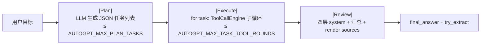

# iter_b：AutoGPT 实现

> 本迭代目标：把 `IMP_METHOD=AUTOGPT` 这条 Agent 实现从「接口对齐的骨架」推进为「复用公共层、与 Python 实现**功能对齐**」的可用实现。
> 设计依据：[`design.md §5 IMP`](design.md) 与 [`§3 Agent`](design.md)。

## 0. 本分支硬性目标与约束

| # | 目标 | 落地约束 |
|---|---|---|
| G1 | `IMP_METHOD=AUTOGPT` 时**所有功能**与 Python 实现对齐 | 见 §2 功能对齐清单；逐项验收 |
| G2 | **绝对不破坏 Python 分支功能** | 见 §1.1 不破坏约束；改动前后跑全量 Python 单测对比 |
| G3 | 尽量复用已有代码，但**抽象独立、不夹杂**；公共代码独立、本分支代码以 `autogpt` 明确标识 | 见 §1.2 代码组织约定 |
| G4 | 测试复用 `../AgentA/.venv`，`.env` 自行拷贝 | 见 §7 测试环境 |

### 0.1 「功能对齐」的准确含义

对齐的是**能力集**，不是**循环范式**。AutoGPT 保留自己的 Plan → Execute → Review 三阶段 loop（design §5：三种实现「差异只在 loop」），但必须提供与 Python 相同的**业务能力**（检索 / 引用 / 记忆 / rules / 学习计划 / 测验 / SRS / harness / 防注入 / skill / MCP / 事件流）。

## 1. 工程约束

### 1.1 不破坏 Python（G2）

实测：`SYSTEM_PROMPT` / `build_active_study_plan_block` / `ThinkingConfig` / `TokenUsage` / `Agent` / `PlanAbortedByUser` 等被**大量模块与测试**从 `src.agent.agent` 直接 import（`tests/test_agent*.py`、`test_system_prompt.py`、`test_agent_active_plan_injection.py`、`src/api/deps.py`、`tools/agent_eval/...` 等）。

因此本分支遵守：

1. **对 `agent.py` / `tools.py` / `src/agent/core/*` / `src/memory/*` 的改动只允许「加法」且默认行为不变**：
   - 只新增带默认值的可选参数、新增函数 / 常量；不改已有签名语义、不改已有默认分支。
2. **若要把共享代码从 `agent.py` 抽到独立模块（见 §1.2），必须在 `agent.py` 保留同名 re-export**，保证现有 import 路径全部有效。
3. 每完成一步，跑 **Python 全量单测**（不带 `-m autogpt`）确认零回归 —— 这是 G2 的硬门禁。

### 1.2 代码组织约定（G3）

三类代码分明摆放：

| 类别 | 位置 / 命名 | 说明 |
|---|---|---|
| **公共层（impl 无关）** | `src/agent/core/*` | 已有 helper（`ToolCallEngine` / `HistoryManager` / `MemoryManager` / `CitationBuilder` / `EventBus` / `rules_loader` …）直接复用，不复制 |
| **跨 impl 但夹在 `agent.py` 里的共享逻辑** | 直接从 `agent.py` import 复用（**决策 D1**） | 见 §1.3 |
| **AutoGPT 专属代码** | `src/agent/autogpt_agent.py` + 必要时新建 `src/agent/autogpt/` 包 | 文件 / 类 / 模块名带 `autogpt`，与 Python 实现物理隔离 |

原则：**AutoGPT 专属代码绝不写进 `agent.py`；公共代码绝不带 AutoGPT 业务假设**。

### 1.3 共享逻辑复用方式（D1：直接 import，零改动 agent.py）

**已定**：本迭代**不抽取** `shared_context.py`，AutoGPT 直接从 `agent.py` import 下列 module-level 符号复用。代价是 autogpt → agent.py 的模块耦合稍重，换来 agent.py 零改动、G2 风险最低。

| 符号 | 复用方式 |
|---|---|
| `_get_shared_chat_history` / `_get_shared_user_memory` | `from src.agent.agent import ...` 直接调 |
| `_get_active_rules` / `build_active_study_plan_block` | 同上 |
| `SYSTEM_PROMPT` / `ThinkingConfig` / `TokenUsage` | 同上（现状已 import） |

> 约定：这些是「复用 agent.py 暴露的能力」，**不是**把 AutoGPT 逻辑写进 agent.py。后续若 LangChain/AutoGPT 都需要而耦合变痛，再统一抽 `core/`（届时 re-export 保兼容）。

## 2. 功能对齐清单（G1 验收项）

`HarnessManager` 与 `security_filter` 落在 `execute_tool` 内部 —— 只要 Execute 子循环走 `execute_tool`（现状已走），**自检与防注入自动生效，零接线**。其余逐项：

| 能力 | 公共层组件 | Python | AutoGPT 现状 | 本迭代动作 |
|---|---|---|---|---|
| 业务 tool 全集（search / web / fetch / skill / study / quiz / srs / MCP / plan 三件套） | `tools.get_tools` + `execute_tool` | ✓ | ✓（已走 execute_tool） | **保留全集**（D2）；study-planner/quiz-maker 依赖 make_plan 嵌套 |
| 工具调用编排 + 干净历史写入 | `ToolCallEngine` | ✓ | ✗ 手写 | Execute 子循环改用（B-2） |
| RAG 引用编号 + sources 块 | `CitationBuilder` | ✓ | ✗ | 跨任务累计，Review 末尾 render（B-3） |
| Harness 自检（Q1/R1） | `HarnessManager`（tool 内） | ✓ | ✓ 自动 | 无需接线，加测试断言 |
| 防 prompt injection | `security_filter`（tool 内） | ✓ | ✓ 自动 | 无需接线，加测试断言 |
| 用户记忆注入 + 提取 | `MemoryManager` | ✓ | △ 仅 Review 手拼 | 用 `build_system_prompt` + `try_extract`（B-4） |
| 项目 rules | `rules_loader` | ✓ | ✗ | Review system 加 `build_rules_block`（B-4） |
| 学习计划注入 | `build_active_study_plan_block` | ✓ | ✗ | Review system 加该 block（B-4） |
| Plan 事件（CLI 进度渲染） | `EventBus` plan_* | ✓ | ✗ | 任务列表映射为 plan steps，emit plan_*（B-6） |
| Extended Thinking 流式 | `ThinkingPolicy` + provider `call_with_thinking` | ✓ | ✗ | **纳入本迭代**（D3）：Execute/Review 调 `call_with_thinking`，emit `thinking_chunk`（B-8） |
| token 流式 | provider `on_token_chunk` | ✓ | ✗ | **纳入本迭代**（D3）：Review 正文走 token 流，emit `token_chunk`（B-8） |

## 3. 三阶段架构（目标态）



### 3.1 公共层接入映射

| 阶段 | 复用组件 | 用法 |
|---|---|---|
| 构造 | `build_skill_catalog` | 已有：catalog 追加到 system_prompt |
| Plan | 历史摘要走统一来源 | Plan prompt 用规划专用 system（不注入四层） |
| Execute（每任务） | `ToolCallEngine` + `CitationBuilder` | 子循环每轮 `tool_engine.process`；citation 跨任务累计 |
| Review | `build_rules_block` + `MemoryManager.build_system_prompt` + `build_active_study_plan_block` | 四层 system；末尾 `citation_builder.render` 追加 sources |
| 收尾 | `MemoryManager.try_extract` | user_input + final_answer 触发跨 session 记忆提取 |
| 全程 | `EventBus` | info / tool_call_* / plan_* / final_answer / error |

### 3.2 四层 system 拼接（仅 Review）

```
base system_prompt（+ skill catalog）
  → <project_rules>           build_rules_block(_get_active_rules())
  → <user_context>            MemoryManager.build_system_prompt(...)
  → <active_study_plan>       build_active_study_plan_block(session_id)
```

> 取舍：Plan / Execute 是「内部工序」，用各自专用 system（规划助手 / 执行助手），**不**注入四层；只有面向用户输出的 Review 阶段需要完整人格 + 偏好 + 引用规范。

### 3.3 引用编号跨任务累计

`CitationBuilder` 每次 `run()` 实例化一次，贯穿所有任务的 Execute 子循环（多任务多次 `search_knowledge` 编号连续递增），Review 产出后 `extract_used` + `render` 一次性追加 `— sources —` 块——语义同 [§3.6](design.md)，「同轮」从 ReAct 的一轮扩展为 AutoGPT 的一次完整 Plan-Execute-Review。

> **已知风险（R1）**：Execute 子任务用 `TASK_COMPLETE: <摘要>` 收口，Review 看到的是「任务摘要」而非原始带 `[n]` 的 chunk；若摘要丢了 `[n]`，Review 无法复用编号。缓解：Execute 系统提示要求保留 `[n]`，或把 Execute 阶段的引用上下文一并透传给 Review。B-3 编码时确认。

## 4. 实施计划（分步，每步过 Python 全量单测）

- [x] **B-1 文档**（本步）：设计与约束落地。
- [x] **B-2 Execute 子循环接 `ToolCallEngine`**：手写 tool 子循环改为 `ToolCallEngine(events, citation_builder).process(...)`；保留 `TASK_COMPLETE:` 退出与轮次上限兜底。写库副作用用 §4.1 方案 A 解决。
- [x] **B-3 引用**：`run()` 建 `CitationBuilder`（实例状态 `self._citation_builder`）透传子循环；Review 末尾 `extract_used` + `render`。Execute system 加「保留 [N] 编号」指引缓解 R1。
- [x] **B-4 四层 system + 记忆提取**：Review system 经 `_build_review_system` 四层拼接；收尾 `_extract_memory` → `MemoryManager.try_extract`。
- [x] **B-5 持久化策略**：采用方案 A，新增 `_AutoGPTEphemeralHistory`（autogpt 专属，内存临时历史承接子循环中间消息，run 结束丢弃）。
- [x] **B-6 事件对齐**：
  - **内层 plan 事件**：子循环的 `ToolCallEngine` 持有 events bus，skill 触发 `make_plan` 时**自动**emit `plan_created`/`plan_step_*`（与 Python 同源，零额外代码）。
  - **外层任务进度**：AutoGPT 自身的 Plan 任务列表用 `info` 事件（`autogpt.plan` / `autogpt.task_start` / `autogpt.task_end`）+ 现有 `print` 渲染，**不**复用 `plan_*`，避免与内层 make_plan 形成两套 plan 互相打架（D2 嵌套场景下尤其重要）。
- [x] **B-7 单测**：扩展 `tests/test_autogpt_agent.py`（新增 `TestAutoGPTCommonLayer`：持久化隔离 / 内层 plan_created / 四层 user_context / token 流式开关；并把受 ToolCallEngine 影响的 4 个 execute 测试 patch 目标改到 `core.tool_call_engine.execute_tool`）。
- [x] **B-8 流式（D3）**：新增 `_llm_call` 统一入口，按 `ThinkingPolicy` 在 `chat` / `call_with_thinking` 间分发，透传 `on_thinking_chunk` / `on_token_chunk`；Review 正文走 token 流，「有订阅者才推」，无订阅者零副作用。

> **验证**：`pytest tests/test_autogpt_agent.py -m "autogpt and not integration"` → 56 passed（含 5 个新接入测试）；Python 侧回归 177 passed（零回归，G2 达标）。`test_make_agent_langchain*` 2 项失败为共享 venv 中 langchain 1.x 的既有环境问题，与本分支无关。

### 4.1 持久化冲突（B-5）

`ToolCallEngine.process` 会把 assistant / tool 消息写进 `chat_history`，与 AutoGPT「只持久化 user + 最终 assistant」约定冲突。

| 方案 | 说明 | 取舍 |
|---|---|---|
| **A. 子循环用 in-memory 临时 store** | 给子循环的 `ToolCallEngine` 传一个 `append` 只进内存、run 末尾丢弃的轻量对象（命名 `_AutoGPTEphemeralHistory`，放 autogpt 专属文件） | 隔离干净、零污染、符合 G3；需小适配对象 ✅ 倾向 |
| B. 末尾清理 | 用真 store，run 末尾删本轮中间消息 | 简单但有误删风险 |
| C. 不全量接 ToolCallEngine，仅手动 `register` hits | 偏离 §5「复用 helper」，且引用/事件逻辑要自维护 | ✗ |

> 方案 A 的临时 store 是「AutoGPT 专属」适配，按 G3 放在 autogpt 命名文件内（非 `core/`，因为它编码了 AutoGPT 的持久化策略，不是通用能力）。

## 5. 决策点（已定）

| ID | 决策 | 结论 |
|---|---|---|
| D1 | 共享逻辑复用方式 | **直接从 `agent.py` import**，不抽 `shared_context.py`，agent.py 零改动（最保 G2） |
| D2 | Execute 子循环是否暴露 plan 三件套 | **保留全集**（与 Python 一致）；外层任务进度用 `info` 事件、内层 make_plan 用 `plan_*`，两层分开避免打架 |
| D3 | thinking / token 流式是否纳入本迭代 | **纳入**（B-8）：Execute/Review 走 `call_with_thinking` + token 流 |

## 6. 接口契约（AgentAPI，已对齐，保持不变）

`AutoGPTAgent` duck-typed 满足 [`AgentAPI`](../src/agent/agent_api.py)：`run` / `set_event_callback` / `activate_skill` + `session_id` / `last_usage` / `verbose` / `thinking_cfg` / `events`。AutoGPT 仅 CLI 单实例，不进 Web 并发路径（API 固定 Python Agent），并发隔离不在本实现范围。

## 7. 测试环境（G4）

复用 `../AgentA` 的虚拟环境与配置，不重新安装依赖：

```powershell
# 复用 ../AgentA 的 .venv（不重新 pip install）
..\AgentA\.venv\Scripts\python.exe -m pytest tests\test_autogpt_agent.py -m autogpt

# .env：从 ../AgentA 拷贝到本分支根目录（本分支当前只有 .env.example）
Copy-Item ..\AgentA\.env .\.env
```

- 单测：`-m autogpt`（该文件默认被 deselect，需显式）。
- 集成（消耗真实 API quota）：`-m "autogpt and integration"`。
- **G2 门禁**：每步另跑 Python 全量单测（不带 `-m autogpt`）确认零回归。

## 8. 配置项

| key | 默认 | 含义 |
|---|---|---|
| `IMP_METHOD` | `PYTHON` | 设为 `AUTOGPT` 启用本实现（`make_agent` 已接线） |
| `AUTOGPT_MAX_PLAN_TASKS` | 6 | 单次规划最大子任务数 |
| `AUTOGPT_MAX_TASK_TOOL_ROUNDS` | 4 | 每个子任务最大工具调用轮次 |

## 9. 风险汇总

- **R1 引用穿透摘要丢失**：见 §3.3。
- **R2 ToolCallEngine 写库副作用**：见 §4.1，方案 A 隔离。
- **R3 plan 事件语义复用**：AutoGPT「任务」一次性全展开 vs ReAct plan step 增量，映射需防 CLI step 转圈（参照 `_finalize_pending_plan_steps`）。
- **R4 共享抽取回归**：见 §1.3 / D1，靠 re-export + 全量 Python 单测门禁兜底。
