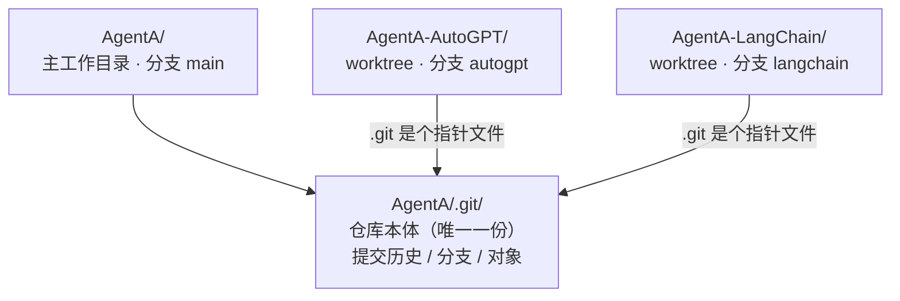
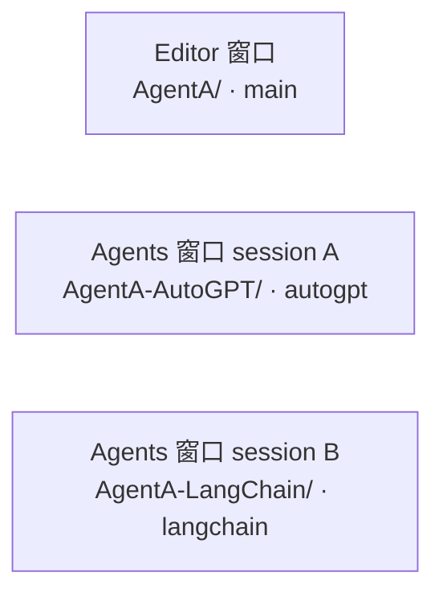

# Git Worktree 笔记

一句话：**同一个仓库、多个工作目录、每个目录各开一个分支**，让你不用反复切分支、也不用重复 clone，就能在多个分支上同时干活。

## 1. 为什么需要它

普通 clone 出来的仓库，只有**一个工作目录**，同一时刻只能 checkout 一个分支。想看另一个分支就得 `git checkout`，把当前文件全换掉——这意味着：

- 没法同时在两个分支上写代码；
- 切分支前还得先处理（提交 / 暂存）当前没写完的改动。

worktree 解决的就是"**多个分支并行开发**"的问题，而且比"再 clone 一份"更省空间、省时间（多个工作目录共用同一份 `.git`，不重复下载历史）。

## 2. 原理

关键认识：git 的"当前分支"是**工作目录级别**的状态，不是仓库级别的。一个工作目录同一时刻只能停在一个分支。worktree 就是让同一个仓库**额外挂出几个独立工作目录**，各自停在不同分支。



### 仓库本体只有一份

`.git/` 这个目录（提交历史、所有分支、对象库）物理上只存在于**主工作目录**里（如 `AgentA/`）。

### 额外 worktree 里的 `.git` 是"指针"

额外挂出来的目录（如 `AgentA-AutoGPT/`）里也有一个 `.git`，但它**不是文件夹，是一个文本文件**，内容是一行指针，指回主仓库：

```
gitdir: C:/DiskD/sourceCode/mygithub/AgentA/.git/worktrees/AgentA-AutoGPT
```

在该目录跑 git 命令时，git 读到这个指针，顺着找到仓库本体，于是知道历史和对象都在那边。

### 什么共享、什么独立

| 内容 | 存在哪 | 共享还是独立 |
|---|---|---|
| 提交历史 / 分支 / 对象（仓库本体） | 只在主目录 `.git/` | ✅ 共享 |
| 当前 checkout 的分支、暂存区、工作区文件 | 各 worktree 各自一份 | ❌ 独立 |

所以两个 worktree 改文件互不覆盖；但因为历史共享，一个目录里 commit 的内容，另一个目录 `git log` 立刻能看到。

## 3. 工作方式（几条必须记住的规则）

### 命令在哪跑就管哪个分支

**不需要回到主目录跑 git**。每个 worktree 都是功能完整的工作区，你要操作哪个分支，就 `cd` 到对应目录跑命令：

```bash
cd AgentA/            # 这里的 git 操作 main
cd ../AgentA-AutoGPT/ # 这里的 git 操作 autogpt
```

### 一个分支同一时刻只能被一个 worktree 占用

这是最容易踩的点。某分支已在某 worktree 上 checkout 后，别的 worktree **不能再切到同一分支**：

```bash
# 在 AgentA/（main）里想切到已被占用的 autogpt
git checkout autogpt
# fatal: 'autogpt' is already checked out at '.../AgentA-AutoGPT'
```

`git branch` 里被占用的分支前面会标 `+`：

```
+ autogpt   ...  (C:/.../AgentA-AutoGPT)   ← + 表示已被某 worktree 占用
* main      ...                            ← * 表示当前 worktree 所在分支
```

这是 git 故意防止两个目录同时改同一分支把状态搞乱，不是 bug。**想操作哪个分支，去对应的目录，而不是在一个目录里来回 `git checkout`。**

### gitignore 的东西不会自动带过去

worktree 的工作区是全新一份文件，只包含 git **跟踪**的内容。被 `.gitignore` 忽略的本地文件（如 `.env`、虚拟环境、`db/`、`sqlite_db/`、`node_modules/`）**不会出现在新 worktree 里**，需要自己准备：

- **`.env`**：直接拷过去即可。

```powershell
Copy-Item AgentA\.env AgentA-AutoGPT\.env
```

- **虚拟环境（`.venv`）**：**不能直接拷**。venv 里写死了绝对路径（`activate` / `pyvenv.cfg` / 脚本 shebang），拷过去激活会错乱。两种正确做法：
  - **共用主目录的 venv**（省事，依赖一致时推荐）：在 worktree 里直接激活主目录那个 `AgentA\.venv\Scripts\Activate.ps1`；
  - **各建独立 venv**（某分支要改依赖时用）：在 worktree 里 `python -m venv .venv` 重新装。

## 4. 常用命令

| 操作 | 命令 |
|---|---|
| 新建 worktree（checkout 已有分支） | `git worktree add ../AgentA-feature feature` |
| 新建 worktree（顺带建新分支） | `git worktree add -b new-feature ../AgentA-new` |
| 查看所有 worktree | `git worktree list` |
| 移除某个 worktree | `git worktree remove ../AgentA-feature` |
| 清理失效记录（目录被手动删后） | `git worktree prune` |

移除 worktree 后，它占用的分支才会被释放，之后才能在别处 checkout。

## 5. 本项目里的用法（多实现并行）

AgentA 有三种 Agent 实现（PYTHON / AUTOGPT / LANGCHAIN）需要并行开发，正好适合用 worktree：



- 一个目录一个 Cursor 窗口一个分支，三个 session 同时干活，运行时互不干扰。
- 因为各分支改的文件集基本不相交，并行阶段不会冲突；**只有最后合并回 main 时**，若不同分支改了同一行才会出 merge 冲突（正常现象，手动解即可）。

### 减少最终冲突的两个习惯

1. **feature 分支定期追 main**：开发途中隔几天在 worktree 里 `git merge main`，把冲突拆成"小步多次"而不是最后一次性爆发。
2. **公共文件约定单一负责人**：`design.md`、公共层代码这类多分支都想碰的，同一时间只让一个分支改。

### 合并顺序

把 main 当集成目标，feature 分支**一个一个**合，每合完一个跑测试确认稳定再合下一个；按"冲突面从小到大"排序，先合改动少的。
