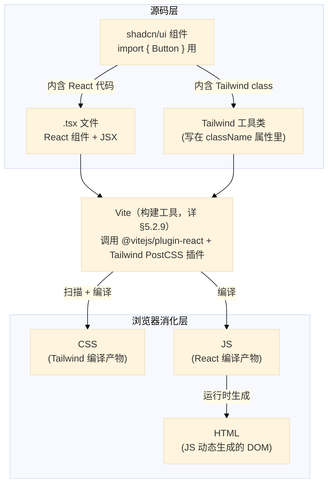
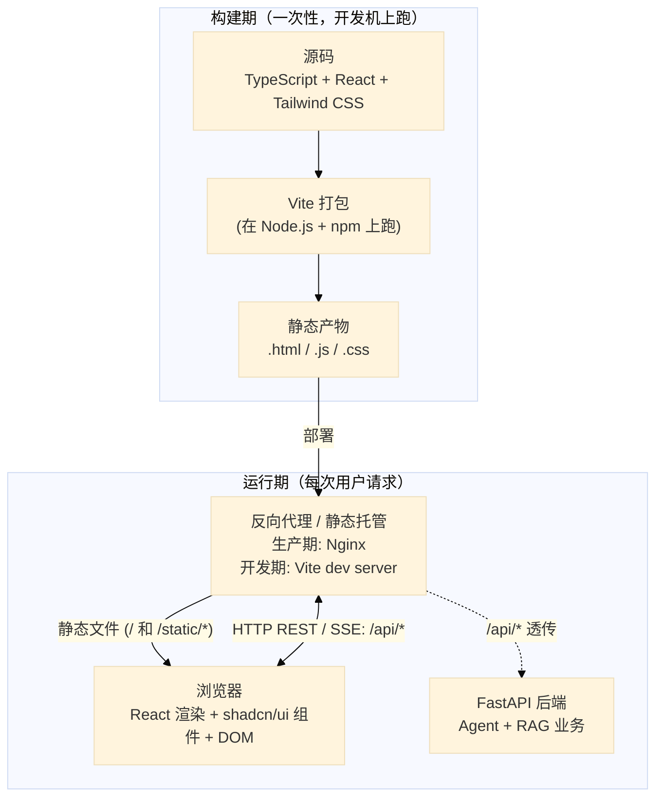
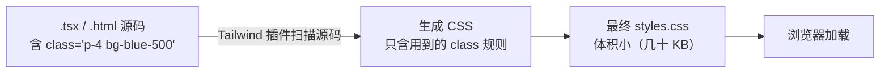
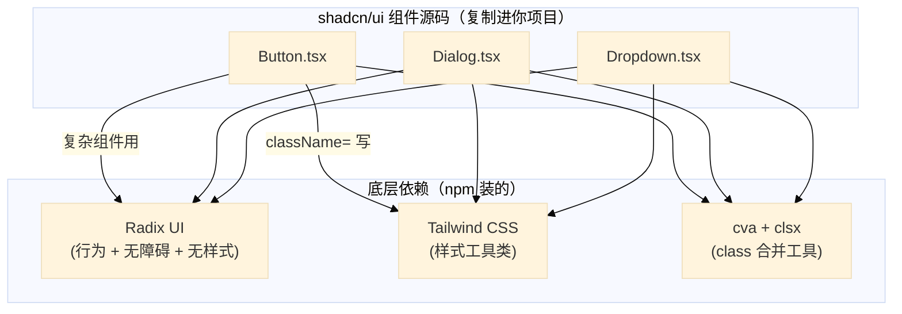
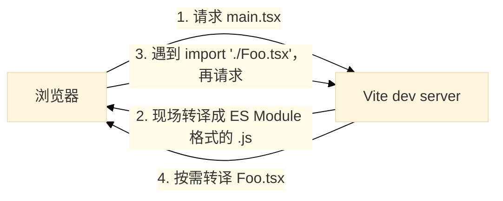
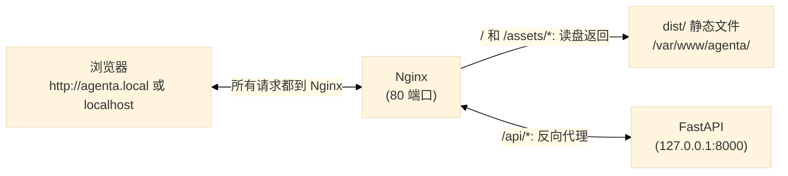

## 5.2. 相关技术

### 5.2.1. 概述

先建立"前端三件套 vs 工具栈"的对应（理解后面各节都靠它），再列本期各层候选 + 整体架构图。

**(1) 前端三件套 vs 工具栈对应**

一张网页 = **HTML（结构骨架）+ CSS（样式）+ JavaScript（交互）** —— 这是浏览器最终消化的三种产物形式。但前端工程化时源码不是直接这三种，而是通过工具链编译出这三种。下面这套技术怎么落到三件套：

| 工具 | 你写的源码长啥样 | 最终落到浏览器哪一层 |
|---|---|---|
| **Tailwind CSS** | `class="p-4 bg-blue-500"`（直接写在 HTML 标签的 `class` 属性里） | **CSS** —— 构建时 Tailwind 扫源码、把用到的工具类生成成 CSS 规则、产出一份 `.css` 文件 |
| **React** | `.tsx` 文件（JSX 描述结构 + JS 逻辑） | **JS（兼管动态生成 HTML）** —— JSX 被编译成 JS 函数调用、运行时**动态产出 HTML 元素**插入 DOM；交互（`onClick` 等）也在 JS 里 |
| **shadcn/ui** | `import { Button } from '@/components/ui/button'`（用 React 组件） | **横跨三层** —— 它就是"已经封好的 React 组件 + 内嵌 Tailwind class"，所以同时落 JS（React 部分）、HTML（组件渲染出的结构）、CSS（内嵌 Tailwind class 编译出的样式） |

几个关键澄清：

- **React 实际上"管两层"：JS + 动态 HTML** —— 回扣 §5.1.4 的 CSR（客户端渲染）：浏览器拿到的 `index.html` 几乎是空壳（只有 `<div id="root"></div>`），整个页面结构是 JS 跑起来后**动态生成**塞进去的。React 干的就是这件事
- **Tailwind 反常的地方：不切到 `.css` 文件写** —— 传统写 CSS 是建个 `styles.css` 文件、写 `.card { padding: 1rem; ... }` 规则。Tailwind 反过来 —— 你直接在 HTML 标签 `class` 属性里组合**预定义工具类**，构建时 Tailwind 扫描源码、把用到的类生成最终 CSS。**写法上几乎不碰 `.css` 文件，但最终产物还是 CSS**
- **shadcn/ui = React + Tailwind 的成品组件套装** —— shadcn 每个组件源码大概长这样（简化版）：


React 那部分（`function Button` + JSX 标签 + `{...props}`）→ JS / 动态 HTML；`className=` 里那串 Tailwind 工具类 → CSS。用的时候 `<Button>确定</Button>` 一行调用，背后复杂 class 列表已经被组件吸收掉了 —— 这就是 §5.2.6 (5) 里"组件化封装解决 Tailwind class 一长串看着乱"的具体例子。

源码层 ↔ 浏览器层映射总览：



**(2) 按层看候选技术**

**加粗** 的是 §5.3 待决的主候选。**所有候选 §5.2 后续小节都会展开**，方便对比后再拍板。

| 层 | 角色 | 候选 |
|---|---|---|
| **语言层** | 浏览器最终消化的代码 + 写代码用的语言 | HTML / CSS / JavaScript / **TypeScript** |
| **工程化层** | 开发期工具链：运行时 + 包管理 + 构建打包 | **Node.js**（运行时）/ **npm**（包管理）/ 打包工具见 UI 层（Vite 或 Next.js 内置）|
| **前端 UI 层** | 浏览器里运行时的框架、样式方案、组件库 | UI 库 **React**（确定要用）<br/>**是否套元框架**：直接 **React + Vite**（纯 CSR） vs **Next.js**（内含 React + 自带构建 / SSR / SSG）<br/>样式 **Tailwind CSS**（或原生 CSS / CSS-in-JS）<br/>组件库 **shadcn/ui**（或 MUI / Ant Design）|
| **通信层** | 前后端通信协议 | **HTTP REST**（常规请求）/ **SSE**（chat 流式响应）/ WebSocket（本项目不用）|
| **后端层** | Python 服务 + 业务代码 | **FastAPI**（本期新加，包项目已有的 **Agent + RAG** 核心成 HTTP 接口） |
| **部署层** | 生产环境反向代理 + 静态托管 | **Nginx**（或 Caddy / 静态托管平台）|

整体架构与数据流（**以 React + Vite 候选**为例 —— Next.js 候选会内置 Vite 那一层，整体管线略有不同，§5.2.5 对比展开）：



读图要点：

- **构建期（上方框）**：源码 → Vite 打包 → 静态产物。**部署一次**之后不再跑
- **运行期（下方框）**：浏览器跟后端的所有通信都走**同一道反向代理**：静态文件请求落到代理本地、`/api/*` 透传到后端进程（同源化，规避 CORS —— §5.1.6 思路 A）
- **开发期 vs 生产期**：架构同构、中间那层"反向代理"的实现不一样 ——
  - 开发期 = Vite dev server 顶替（同时承担打包 + 转译 + 代理 + HMR 热刷新）
  - 生产期 = Nginx 顶替（只做静态托管 + 代理，不再编译；JS 真正在浏览器里跑）

### 5.2.2. JavaScript / TypeScript

**JavaScript（JS）**：浏览器原生唯一支持的脚本语言。其他语言要在浏览器跑，**必须先编译/转译到 JS**（这也是 TypeScript 存在的前提）。

几个关键点：

- **动态弱类型**：变量类型运行时定，会做**隐式转换**（如 `"1" + 1 === "11"`、`[] + {} === "[object Object]"`）—— 反直觉行为是 JS 的"坑"主要来源
- **版本叫 ECMAScript（ES）**，每年一版。**ES6（即 ES2015）是分水岭**：引入 `class` / `let` / `const` / 箭头函数 / 模板字符串 / 模块系统 等；之后大家说"现代 JS"基本指 ES6+ 的写法
- **运行环境**：浏览器是主场，**Node.js** 让它也能跑服务端 / 工具链（详 §5.1.7 (1)）

**TypeScript（TS）**：JS 的**超集** + 静态类型层。微软出品，2012 年起，现在是大型前端项目事实默认（**新 React 项目 90%+ 都用 TS**）。

- **"超集"含义**：合法 JS 就是合法 TS（不必改逻辑就能跑），TS 只是在 JS 之上**加类型标注**
- **类型擦除**：`.ts` / `.tsx` 源码经打包工具编译后变成**纯 JS**；**运行时只有 JS 在跑、TS 类型不存在**。类型只在**编译期**帮你查错 + 帮编辑器做自动补全 / 跳转 / 重构
- **为什么大家加 TS**：少踩 `undefined is not a function` 这种运行时翻车；IDE 体验明显更好；项目大起来后可维护性强

同一段代码 JS vs TS 对比：

```js
// JS
const send = async (msg) => {
  const result = await fetchData(msg.content)
  return result.text
}
```

```ts
// TS：加了类型标注
interface Message { id: string; content: string }

const send = async (msg: Message): Promise<string> => {
  const result = await fetchData(msg.content)
  return result.text
}
```

**类比 Python**：跟 Python 类型注解（`def f(x: int) -> str`）思路一致 —— **编译/编辑期检查、运行时不强制**。Python 用过类型注解的人上手 TS 概念上差别不大；差别仅在 Python 的类型是语言原生、TS 的类型是后加层。

### 5.2.3. Node.js

Node.js 是 JS 运行时、npm 是包管理器 —— 这一节从**实操**角度补全：怎么装、怎么开新项目、几个包管理器怎么选、npx 又是什么。

**(1) 安装 + 验证**

Windows 下两种装法：

| 方式 | 优点 | 缺点 |
|---|---|---|
| **官网安装包**（[nodejs.org](https://nodejs.org)） | 简单，下完即用 | 多版本切换麻烦 |
| **多版本管理工具**（如 nvm-windows / fnm） | 多版本并存，按项目切换 | 多装一层工具 |

选最新的 **LTS（Long-Term Support, 长期支持）** 版本（偶数版本号，如 22.x、24.x），维护周期长、企业项目都用它。

装完验证：

```bash
node -v   # 如 v22.10.0
npm -v    # 如 10.9.0
```

**(2) 跑 JS 脚本**


```bash
node script.js        # 跑一个文件
node                  # 进入 REPL（交互式，类似 python 命令）
```

**(3) 项目级流程：从 package.json 装齐依赖 + 跑命令**

先记住一条**核心模式**：

> **只要当前目录有 `package.json` 但缺 `node_modules/`，就 `npm install`（无参数）一把装齐**。`package.json` 怎么来的不影响 —— 脚手架生成、git clone、手写都一样。

`npm install` 命令有**两种语义**，区分清楚：

| 命令形式 | 干什么 | 典型场景 |
|---|---|---|
| `npm install`（无参数） | 读当前 `package.json`，**按清单装齐**所有依赖到 `node_modules/` | 脚手架刚生成完 / git clone 完 / 清掉 `node_modules` 想重装 |
| `npm install <包名>` | **加一个新依赖**到当前项目（同时写进 `package.json` 清单） | 开发过程中需要引入新工具 / 新库 |

**(3a) 从零起一个新项目** —— 通常**用脚手架一键生成骨架**，不会手动一步步建：

```bash
npx create-vite my-app    # 脚手架生成项目骨架：package.json、index.html、src/ 等（不装依赖）
cd my-app                 # 此时有 package.json，没有 node_modules/
npm install               # 按上面那条核心模式：读 package.json 装齐依赖
npm run dev               # 跑起来
```

教学用，也可以**手动一步步建**（实际很少这样）：

```bash
mkdir my-app && cd my-app
npm init -y                          # 手动生成最简 package.json
npm install vite                     # 加一个新依赖（自动写入 package.json）
npm install --save-dev typescript    # -D / --save-dev = 装为"开发依赖"（开发 / 构建用、运行时不需要）
# 之后手动编辑 package.json 加 scripts、自己建目录、自己写代码……
```

**(3b) 接手别人的项目**（从 git clone 拿到的代码） —— `package.json` 在仓库里，但 `node_modules/` **不进 git**（被 `.gitignore` 排除，体积大且可从清单还原）：

```bash
git clone <repo> && cd <repo>     # 此时有 package.json，没有 node_modules/
npm install                       # 同一条核心模式：读 package.json 装齐依赖
npm run dev                       # 跑起来
```

可以看到 **(3a) 和 (3b) 的 `npm install` 是同一回事** —— 都是"按 package.json 装齐"。区别只在 `package.json` 的**来源**：脚手架现写 vs git 拉下来。

**(3c) `scripts` 字段是怎么工作的**

`package.json` 里的 `scripts` 字段定义快捷命令（脚手架或前任已写好）：

```json
{
  "scripts": {
    "dev": "vite",
    "build": "vite build",
    "lint": "eslint ."
  }
}
```

执行 `npm run dev` 时，npm 找到 `scripts.dev = "vite"`，于是去 `node_modules/.bin/vite` 跑这个命令。`npm run build` / `npm run lint` 同理。
**`node_modules/.bin/` 里的工具不在系统 PATH 里、不能直接命令行调用**，必须靠 `npm run`（或 `npx`）来跑。

**(4) npm / yarn / pnpm**

三个包管理器，都能装 npm 仓库里的包：

| 工具 | 特点 | 命令示例 |
|---|---|---|
| **npm** | Node 自带、最广用、最稳定 | `npm install` / `npm run dev` |
| **yarn** | Facebook 出品，2016 因速度优势火过一阵；现在 npm 也补齐了 | `yarn add react` / `yarn dev` |
| **pnpm** | **省磁盘**：用硬链接共享全局缓存（同一个包不会被 100 个项目各装 100 份）；启动也快 | `pnpm install` / `pnpm dev` |

**命令大同小异、行为基本兼容**。本项目用 **npm**（跟 Node.js 一起装、无需额外工具）就够；如果你同时维护多个前端项目，可考虑 pnpm 省点磁盘。

**(5) npx**

**本质**：一个**智能命令运行器**。你跑 `npx <工具> <参数>` 时，它按下面顺序找 `<工具>` 然后执行：

1. **当前项目 `node_modules/.bin/` 里有？** → 直接跑
2. **没有？** → 从 npm registry **临时下载**该包到一个缓存目录（默认 `~/.npm/_npx/`）、跑完留着备下次用 —— **不写进 `package.json`、不污染 `node_modules/`、不动全局 PATH**

随 npm 5.2+ 自带（装了 Node 就有），不用额外装。

**为什么需要它**：npm 包里的 CLI 工具（`vite` / `eslint` / `create-vite` 等）必须装在 `node_modules/.bin/` 才能跑，但这目录**不在系统 PATH**，命令行打 `vite` 找不到。在 npx 出现前你只有两个不爽的选项：

| 老办法 | 怎么做 | 痛点 |
|---|---|---|
| **全局装** | `npm install -g vite` | 污染全局；不同项目要不同版本会冲突 |
| **本地装 + 写 `scripts`** | 装到本地 → `package.json` 加 `"vite": "vite"` → `npm run vite` | 一次性的命令也要写进 `scripts`，烦 |

npx 把这两个痛点一起解了：

| 场景 | npx 用法 | npx 帮你做的事 |
|---|---|---|
| 跑**本项目装好的**工具、不想加进 `scripts` | `npx vite` | 自动去 `node_modules/.bin/` 找，比敲 `./node_modules/.bin/vite` 短 |
| 跑**没装的**一次性工具 / 脚手架 | `npx create-vite my-app`<br/>`npx prettier --write .` | 自动下载、跑完缓存（下次更快），不污染项目 |
| 跑**特定版本** | `npx vite@4` | 跟项目里装的版本无关，临时切到指定版本 |

**跟 `npm run` 的关系**：

| 命令 | 跑什么 | 来源 |
|---|---|---|
| `npm run <script>` | `package.json` 里 `scripts` 字段定义的快捷命令 | **本项目长期要跑的命令** |
| `npx <pkg> [args]` | 任意 npm 包的可执行入口 | **本地装的 或 临时下载** |

简记：**`npm run` 跑自家长期脚本；`npx` 跑别人家工具（一次性或临时）**。

实务里你最常见的就两种场景：

- `npx create-xxx my-app` —— 用脚手架起新项目（§5.2.3 (3a) 那个例子就是这个）
- `npx prettier --write .` / `npx eslint --fix .` —— 临时跑代码格式化 / 检查

补一句：`yarn dlx` / `pnpm dlx` 是 yarn / pnpm 的等价物（`dlx` = download & execute），概念完全一样。

### 5.2.4. React

**(1) 是什么**

React 是 Meta 开源（2013）的**前端 UI 库**。它自己定义自己是"库"（library）而非"框架"（framework）：**只管把"状态 → 视图"这件事渲染好**，其他事（路由、构建、数据获取、状态管理）都不管，留给生态。

定位决定了：用 React 时你需要**自己拼套件**（详 (5)），但每件事都能换、职责清晰。

**(2) 跟传统 DOM 操作的思路差异**

跟传统 jQuery / 原生 DOM 操作风格反过来（§5.1.9 讲过命令式 vs 声明式）：

| 风格 | 怎么写 |
|---|---|
| **命令式**（jQuery / 原生 DOM） | 你**亲自操刀**：找到 DOM 元素 → 改它的属性 / 文本 / 类名；每次状态变化都要手动同步 |
| **React（声明式）** | 你只描述"**当前状态下 UI 长啥样**"；状态变了 React 自动算出 DOM 怎么改 |

直观对比"点击按钮、计数 +1"：

```javascript
// 命令式（jQuery / 原生）
let count = 0;
document.getElementById('btn').addEventListener('click', () => {
  count++;
  document.getElementById('display').textContent = count;
});
```

```jsx
// React（声明式）
function Counter() {
  const [count, setCount] = useState(0);
  return (
    <div>
      <span>{count}</span>
      <button onClick={() => setCount(count + 1)}>+1</button>
    </div>
  );
}
```

React 这边你**没碰任何 DOM**，只描述 "UI = `count` 这个状态对应的样子"；`setCount` 一调用、React 自动 diff 出 `<span>` 该改、改之。

**(3) 核心概念**

| 概念 | 一句话 |
|---|---|
| **组件**（component） | UI 的最小复用单位，本质是个**返回 JSX 的 JavaScript 函数**（如上面的 `Counter`） |
| **JSX** | "在 JS 里写 HTML"的语法糖，编译期被翻译成 `React.createElement(...)` 调用；同时支持 `{表达式}` 嵌入 JS |
| **props**（属性） | 父组件传给子组件的"参数"（**只读**），类似函数参数：`<Button text="确定" />` |
| **state**（状态） | 组件内部"可变数据"，靠 `useState` 等 Hook 管理；状态变 → 组件重新渲染 |
| **单向数据流** | 数据靠 props 父 → 子；子要改父的数据，靠父传一个回调下来（如 `<input onChange={...}>`） |
| **Hooks** | `useState` / `useEffect` 等以 `use` 开头的函数，React 16.8 后的标准 API，给函数组件加状态 / 副作用 |

**(4) 工作原理**


**虚拟 DOM**：React 在内存里维护一份 UI 的 JS 对象表示，**比直接操作浏览器真实 DOM 便宜得多**（真实 DOM 操作会触发 reflow / repaint）。状态变时 React 先在虚拟 DOM 里算清要改啥、再批量同步到真实 DOM。

实际写代码时这层完全**对你透明** —— 你只写组件函数、调 `setState`，diff 算法是 React 内部的事。

**(5) "用 React" 实际上是拼一套**

React 不带这些能力，要自己挑：

| 责任 | 典型选择 |
|---|---|
| 构建 / dev server | **Vite**（§5.2.9）/ Webpack / Rsbuild |
| 路由 | React Router |
| 全局状态（跨组件） | Context API / Zustand / Redux |
| 数据获取（带缓存 / 重试） | TanStack Query / SWR / 自己 `fetch` |
| 样式方案 | **Tailwind CSS**（§5.2.6）/ CSS Modules / CSS-in-JS |
| 组件库 | **shadcn/ui**（§5.2.7）/ MUI / Mantine / Ant Design |
| 表单 | React Hook Form / Formik |

加粗的是本项目候选。**Vite + Tailwind + shadcn/ui** 是当前社区里跟 React 配的"黄金组合"之一，社区有现成模板（如 `npx create-vite -- --template react-ts`），不会真的从零拼。

**(6) 编辑器体验 / 生态**

- **TypeScript**：React 跟 TS 配合极顺（组件 props 直接当 TS interface 类型）。本项目走 TS 不走 JS（§5.2.2）
- **React DevTools**：浏览器扩展（Chrome / Firefox），看组件树、看每个组件当前的 props / state，调试比命令式时代香多了（§5.1.8 浏览器 DevTools 的延伸）
- **AI 友好**：训练语料里 React 占绝对大头，Copilot / Cursor 写 React 组件相当熟

**(7) 对本项目为什么用 React**

- 候选竞品里 **Vue 也很优秀**，但：
  - **shadcn/ui 只支持 React** —— shadcn 是本项目想要的组件库（§5.2.7），Vue 对应方案（shadcn-vue 是社区移植）社区规模小一档
  - React 生态规模更大，AI 写 React 组件更熟
  - 单用户私有工具不需要 Vue 的"渐进增强"优势
- React 跟 **FastAPI + Vite + Tailwind + shadcn** 这套组合的耦合最自然
- 声明式 + 组件化匹配 Claude / ChatGPT 这类聊天 UI 的天然组件分解（消息气泡 / 工具调用块 / 侧栏 session 列表等）

跟 Next.js 的对比 + 选型决策见 §5.2.5。

### 5.2.5. React vs Next.js

这是真正需要选型的地方 —— 两者都是当前前端主流，但定位差异大。React 已在 §5.2.4 详讲，本节聚焦 Next.js 的差异 + 整体对比 + 对本项目的初步看法。

**(1) React** —— 详 §5.2.4。简言之：库 + 自拼套件（构建 / 路由 / 状态 / 样式 / 组件库都自挑），灵活、职责清晰；典型组合 `React + Vite + Tailwind + shadcn/ui + React Router + ...`。

**(2) Next.js**

Vercel 主导（2016），**基于 React 的全栈框架**。在 React 之上**预装预配**了一整套，开箱即用：

| 维度 | Next.js 做了啥 |
|---|---|
| 构建 / dev server | 内置（Turbopack / Webpack） |
| 路由 | **文件系统路由** —— `app/foo/page.tsx` 自动对应 `/foo` |
| 渲染模式 | CSR / SSR / SSG / ISR 全支持，按需混用（详见 §5.1.4） |
| 后端能力 | **API routes** / **Server Components** / **Server Actions** —— 自带一个 Node 服务端，能在同一项目里写后端接口 |
| 优化 | 图片 / 字体 / 元数据 / 代码分割 一系列开箱优化 |
| SEO | 天然友好（SSR / SSG） |

**优点**：**约定胜配置**（convention over configuration）、一站式；中大型内容站 / 电商 / 重 SEO 场景里**省事优势**明显。
**代价**：Next.js 自带的能力**大半绑定它的 Node 后端**，你不用那部分就是白搭；学习坡度也比"裸 React"陡（特别 App Router 引入 Server Components 之后）。

**(3) 整体对比**

| 维度 | React + Vite | Next.js |
|---|---|---|
| 类型 | 库 + 自己拼套件 | 一站式框架 |
| 是否带 Node 服务端 | ❌（纯前端，部署纯静态产物） | ✅（要 Node 进程跑 SSR / API routes，除非用纯静态导出） |
| 渲染模式 | CSR 为主 | CSR / SSR / SSG / ISR 灵活混用 |
| 路由 | React Router 等（显式声明） | 文件系统约定（隐式） |
| 后端 API | **不带** —— 用你自己的后端（如 FastAPI） | **内置** —— 同项目写 API routes，或调外部 |
| SEO | 默认弱（CSR），要好得自己上 SSR / 预渲染 | 默认强 |
| 学习曲线 | React 本身简单，拼装散件要花时间 | 概念多（路由约定 / RSC / 缓存策略 / Server Actions），跟模板能跑、深入要花时间 |
| 适合场景 | SPA、内部工具、跟非 Node 后端搭、个人项目 | 内容站、重 SEO 场景、要 SSR 的大型应用、想用一个项目搞前后端 |
| 部署 | `dist/` 一坨静态文件，Nginx / 任意静态托管 | 部署 Node 服务（Vercel 一键 / 自托管），或退化成静态导出 |

**(4) 对本项目的初步看法**

需求侧关键事实（来自 §1 / §4）：

- 单用户、本地 / 私有部署
- 已有 **Python 写的 Agent + RAG 核心**（`src/agent/` + `src/rag/`），目前对外只有 CLI 入口；**本期会在它之上新加一层 FastAPI** 把核心包成 HTTP 接口（详 §6 实现）
- **不需要 SEO**（私有工具，没人 Google 它）
- 主要交互：聊天、文件拖拽入库、看 session 历史；流式输出用 SSE
- "我不学前端、只提需求"

把 Next.js 的核心卖点逐条对一下：

| Next.js 卖点 | 本项目用得上吗 |
|---|---|
| SSR / SEO | ❌ 私有工具，没人搜 |
| API routes / Server Components / Server Actions | ❌ 后端确定走 FastAPI（包 Python 写的 Agent + RAG 核心），不需要再起一层 Node API |
| 文件系统路由 | 用得上，但 React Router 也能做，差别不大 |
| 图片 / 字体 / 元数据优化 | ❌ 不是内容站 |

也就是 **Next.js 给的额外能力本项目大半用不到，却要为此承担一个 Node 服务端 + 一堆复杂概念**。反观 **React + Vite**：纯静态产物 → Nginx 直接服务 → 调 FastAPI；shadcn/ui 在 React + Vite + Tailwind 这组合下也最舒服 —— 整条流程简单、可控。

所以 §5.3 会倾向 **FastAPI + Vite + React + shadcn/ui** 这条线；正式决定留给 §5.3。

### 5.2.6. Tailwind CSS

**(1) 是什么**

Tailwind CSS 是个 **utility-first CSS 框架**（utility-first = "工具类优先"）。Adam Wathan 2017 出，现在 React 生态最主流的 CSS 方案之一。

它跟传统 CSS 的思路**反过来**：

| 风格 | 怎么写 |
|---|---|
| **传统 CSS** | 自己定义 class（如 `.card`） → 给 class 写一坨样式 → HTML 里引用 class 名 |
| **Tailwind** | 框架预定义一大堆**原子级工具类**（如 `p-4` = padding 1rem、`bg-blue-500` = 蓝色背景） → 你直接在 HTML 里**组合**它们、不自己写 CSS |

直观对比同一个卡片：

```css
/* 传统 CSS */
.card {
  padding: 1rem;
  background: white;
  border-radius: 0.5rem;
  box-shadow: 0 1px 3px rgba(0,0,0,0.1);
}
```
```html
<!-- 传统 CSS：HTML 引用 class -->
<div class="card">...</div>

<!-- Tailwind：不写 CSS 文件，直接 HTML 组合工具类 -->
<div class="p-4 bg-white rounded-lg shadow">...</div>
```

**(2) 为什么这种"反常"做法反而火了**

传统 CSS 痛点 → Tailwind 怎么解：

| 传统 CSS 痛点 | Tailwind 的解法 |
|---|---|
| **命名困难** —— 给每个组件想 class 名（`card` / `card-header` / `card-title-active` ...）很累 | 不命名了，直接用预定义工具类组合 |
| **样式越积越多** —— 项目久了 CSS 几千行，改一处怕影响别处 | 样式直接在 HTML 里，删元素 = 删样式，无残留 |
| **HTML 和 CSS 文件来回跳** | 全在一个文件 |
| **没用的 class 难清理** | 构建时**自动 tree-shake**：扫描源码、只把**用到过**的 class 编译进最终 CSS，没用的全去掉 → **最终 CSS 体积非常小**（一般几十 KB） |
| **样式天马行空、跨页面不统一** | 预定义的**设计 token** 约束你的选择（见下） |

**(3) 设计 token（约束你不要乱写）**

Tailwind 不是"啥都能写"。颜色、间距、字号等都是**预定义离散值**：

| 类别 | 工具类示例 | 对应 CSS 值 |
|---|---|---|
| 间距 | `p-1` / `p-2` / `p-4` / `p-8` | `padding: 4px` / `8px` / `16px` / `32px`（按 4px 步进） |
| 颜色 | `bg-blue-500` / `text-gray-900` | 预定义色阶（每色 50/100/.../900） |
| 字号 | `text-sm` / `text-base` / `text-lg` | 14px / 16px / 18px |
| 圆角 | `rounded` / `rounded-lg` / `rounded-full` | 4px / 8px / 9999px |
| 响应式 | `md:p-8` | 中屏以上 `padding: 32px`（移动优先思路） |
| 状态 | `hover:bg-blue-600` / `focus:ring-2` | 鼠标悬停 / 聚焦时的样式 |

这种**离散约束**反过来是个优点 —— 你不会随便写 `padding: 13px` 让 UI 稀奇古怪，组件之间天然协调。需要例外时也能逃生：`p-[13px]` / `bg-[#abc123]` 用方括号包任意值。

**(4) 工作原理**



Tailwind 是个 **构建期工具**（跟 Vite 集成），运行时浏览器看到的就是一份普通 CSS。

**(5) "HTML 里 class 一长串、看着乱" 怎么办**

实际写 Tailwind 经常一个元素 class 列表很长：

```html
<button class="px-4 py-2 bg-blue-500 hover:bg-blue-600 text-white rounded-md transition">
  确定
</button>
```

确实视觉上比传统 `<button class="btn-primary">` 脏。两个常见缓解办法：

1. **组件化封装** —— React 里写一个 `<Button>` 组件、把 class 列表封进去，使用方就清爽 —— **这就是 shadcn/ui 在做的事（§5.2.7 详讲）**
2. **Prettier 插件自动排序** class —— 按一个标准顺序排，至少让长 class 列表有规律

**(6) 编辑器体验**

- VS Code 装 **Tailwind CSS IntelliSense** 插件 → 输入 `p-` 自动补全所有间距类、悬停看到对应 CSS 值
- AI 工具（Copilot / Cursor）对 Tailwind 也很熟，写起来基本是"描述意图、AI 补 class"

**(7) 对本项目为什么用 Tailwind**

- 跟 React + Vite 集成简单（一行 npm 安装 + 几行配置）
- 跟 **shadcn/ui 强绑定** —— shadcn 的组件全部用 Tailwind class 写，**用 shadcn 就要用 Tailwind**（§5.2.7）
- 默认设计 token 已经够好，单用户私有工具不需要复杂主题
- 单页应用、组件不多，最终 CSS 体积极小

### 5.2.7. shadcn/ui

**(1) 是什么**

shadcn/ui 是个人开发者 @shadcn（Vercel 工程师）2023 年发布的一套 **React 组件集合**，基于 **Radix UI**（无样式的行为层）+ **Tailwind CSS**（样式层）构建。**它不是传统意义上的"组件库"**，而是一种**新型分发方式**：你不 `npm install` 它、而是**用 CLI 把组件源码复制进你的项目**。

GitHub 80k+ 星，当前 React + Tailwind 生态里最火的组件方案，已经是事实标准。

**(2) 反常的"安装方式"：复制源码进项目**

跟传统组件库（MUI / Ant Design / Mantine）的核心差异：

| 维度 | 传统组件库 | shadcn/ui |
|---|---|---|
| 安装 | `npm install antd` → 装到 `node_modules/` | `npx shadcn@latest add button` → CLI **把 Button 的源码文件直接复制到 `src/components/ui/button.tsx`** |
| 引用 | `import { Button } from 'antd'`（从 `node_modules`） | `import { Button } from '@/components/ui/button'`（从**你自己的项目**） |
| 代码位置 | `node_modules/` 里，你不动 | 你的项目里，**你可以随便改** |
| 升级方式 | `npm update antd` | 重新跑 `npx shadcn@latest add button`（覆盖原文件） |
| 定制深度 | 受限于库提供的 API（theme / className） | **完全自由** —— 它就是你的代码，直接编辑 |

为什么这么反常？解决传统组件库两大痛点：

1. **定制难** —— 传统库每个组件只暴露有限的 props，想改细节要么硬用 `className` 强行覆盖 CSS（脆弱）、要么 fork 库（更脆弱）。shadcn 让组件源码就在你项目里，**改就行**
2. **bundle 膨胀** —— 传统库即使 tree-shake 也可能拖入运行时依赖。shadcn 只复制你用到的组件、依赖也明确（Radix + Tailwind），最终 bundle 小

代价：组件**没有自动更新**。但聊天 UI / 后台工具这类应用，组件升级频率很低，**自由度比自动更新更重要**。

**(3) 组件结构（一个 Button 长啥样）**

跑完 `npx shadcn@latest add button`，`src/components/ui/button.tsx` 大概长这样（简化版）：

```tsx
import { cva } from "class-variance-authority"
import { cn } from "@/lib/utils"

const buttonVariants = cva(
  "inline-flex items-center justify-center rounded-md text-sm font-medium ...",
  {
    variants: {
      variant: {
        default: "bg-primary text-primary-foreground hover:bg-primary/90",
        outline: "border border-input bg-background hover:bg-accent ...",
        ghost: "hover:bg-accent hover:text-accent-foreground",
      },
      size: { sm: "h-8 px-3", default: "h-9 px-4", lg: "h-10 px-8" },
    },
    defaultVariants: { variant: "default", size: "default" },
  }
)

export function Button({ className, variant, size, ...props }) {
  return (
    <button
      className={cn(buttonVariants({ variant, size }), className)}
      {...props}
    />
  )
}
```

读这段就懂结构：

- **`cva`**（class-variance-authority）—— 小工具，定义"基础 class + 按 `variant` / `size` 切不同 class"的规则
- **`cn`** —— shadcn 自带的 helper，合并 class（智能去重、支持外部 `className` 覆盖）
- **Tailwind class** —— 所有样式都靠 Tailwind 工具类堆出来（§5.2.6）
- **Radix UI** —— 这里 Button 没用到；复杂组件（Dialog / Dropdown / Tooltip 等）会用 Radix 拿到无样式的**行为基础**：焦点管理、键盘导航、屏幕阅读器支持、动画过渡

**(4) 跟 Radix / Tailwind / cva 的关系**



shadcn/ui 本质 = **把 Radix（行为）+ Tailwind（样式）+ cva（变体管理）三者粘合在一起的、可读可改的源码模板**。

**(5) 实际使用流程**

```bash
npx shadcn@latest init
# 跟着 CLI 问答选：TypeScript、Tailwind 配置位置、color scheme（默认 / new-york / ...）等

npx shadcn@latest add button
npx shadcn@latest add dialog
npx shadcn@latest add input
# 用哪个 add 哪个；每次 add 都会在 src/components/ui/ 下生成一个 .tsx 文件
```

业务代码里调用跟传统组件库**几乎一样**：

```tsx
import { Button } from "@/components/ui/button"

<Button variant="outline" onClick={handleClick}>取消</Button>
```

差别只在它的源码**就在你项目里**、你可以改。

**(6) 对本项目为什么用 shadcn/ui**

- 跟 **React + Vite + Tailwind** 组合最自然（这套组合的当前事实标准）
- 聊天 UI 需要的组件 shadcn 都有：`Button` / `Input` / `Textarea` / `ScrollArea` / `Sheet` / `Dialog` / `Tooltip` / `DropdownMenu` / `Avatar` / `Card` ……
- 美学接近 Claude / Vercel / Linear 这类现代极简风，匹配 §4.2 UX 风格目标
- **可改的源码**对自定义聊天气泡 / 工具调用块这类**非标准 UI** 很友好 —— 想改直接动源码、不用跟库的 API 较劲
- AI 友好：Cursor / Copilot 训练语料里 shadcn 出现频率极高，AI 写起来熟

替代方案为啥不选：

| 方案 | 不选的理由 |
|---|---|
| MUI / Ant Design / Mantine | 设计风格偏企业级、自带主题系统笨重、bundle 大、改细节难 |
| 完全裸 Radix + 自己写 Tailwind | 工作量太大；shadcn 已经做完了"裸 Radix + Tailwind 粘合"的最佳实践 |
| 自己从 0 写组件 | 重复造轮子 |

### 5.2.8. FastAPI

**(1) 是什么**

FastAPI 是 Sebastián Ramírez 2018 年发布的 **Python 现代 web 框架**，基于 **Starlette**（异步 web 基础库）+ **Pydantic**（基于类型提示的数据校验库）+ Python `async`/`await`。GitHub 80k+ 星，当前 Python 后端增长最快的框架之一。

定位：**API 优先**（注意是 API、不是全栈页面渲染） —— 适合给前端 / SDK / 其他服务提供 HTTP 接口。本项目正是这个用法（包 Python Agent + RAG 核心成 HTTP API 给前端调）。

**(2) 跟其他 Python web 框架的对比**

| 框架 | 定位 | 适合 |
|---|---|---|
| **Django** | 全栈 / batteries-included（电池全自带：ORM、Admin 后台、模板引擎一应俱全） | 内容站、传统 CRUD 应用、需要管理后台 |
| **Flask** | 微框架，自由组合 | 小项目、传统同步 API、教学 |
| **FastAPI** | API 优先、async-first、强类型 | 现代 RESTful API、需要高性能 / OpenAPI 文档 / 强类型 |

FastAPI 为啥火起来，靠三个东西：

1. **基于 Python 类型提示做参数校验和文档**（靠 Pydantic）
2. **原生 async/await 支持**（性能跟 Node.js / Go 不相上下）
3. **自动生成 OpenAPI / Swagger 交互式文档**

**(3) 核心：类型提示驱动一切**

最简单的例子：

```python
from fastapi import FastAPI
from pydantic import BaseModel

app = FastAPI()

class ChatRequest(BaseModel):
    session_id: str
    message: str

@app.post("/api/chat")
def chat(req: ChatRequest) -> dict:
    return {"reply": f"收到: {req.message}"}
```

就这几行，FastAPI 帮你做了：

- **请求体反序列化**：客户端发 JSON，FastAPI 按 `ChatRequest` 类型解析；字段缺失 / 类型错自动返回 422
- **请求体校验**：`session_id` 必须 str、`message` 必须 str
- **响应序列化**：函数返回 dict，FastAPI 自动 JSON 化
- **自动生成交互文档**：访问 `http://localhost:8000/docs` 看到一个 Swagger UI，能直接在网页上发请求测试
- **TypeScript 类型同步**：基于 OpenAPI 可以一键生成前端 TypeScript 类型定义（避免前后端类型不一致）

跟传统 Flask 对比，校验和错误处理的工作量差距：

```python
# Flask 写法：校验、错误处理全部手写
@app.route("/api/chat", methods=["POST"])
def chat():
    data = request.get_json()
    session_id = data.get("session_id")
    if not session_id or not isinstance(session_id, str):
        return jsonify({"error": "session_id 必须是非空字符串"}), 400
    message = data.get("message")
    if not message or not isinstance(message, str):
        return jsonify({"error": "message 必须是非空字符串"}), 400
    return jsonify({"reply": f"收到: {message}"})
```

FastAPI 把这些都交给类型系统了。

**(4) async / sync 自动适配**

路由函数可以是 sync（普通 `def`）也可以是 async（`async def`），FastAPI 自动适配：

```python
@app.get("/api/sessions")
async def list_sessions():
    return await db.fetch_sessions()  # async：FastAPI 直接 await

@app.get("/api/health")
def health():
    return {"ok": True}  # sync：FastAPI 放进 thread pool 跑、不阻塞事件循环
```

为啥这个对本项目重要：

- **LLM 调用是慢 I/O**（等 OpenAI 响应可能几秒到几十秒）→ async 让单进程能并发处理多个用户请求
- **某些库（比如 `sqlite3` / `chromadb`）不支持 async** → 用 sync 写、FastAPI 自动塞进 thread pool 跑，不用为了 async 改一切

**(5) SSE 流式响应**

§5.1.3 / §5.1.10 都提过聊天 UI 要靠 SSE 实时把 LLM 的 token 推给前端。FastAPI 写 SSE 直接：

```python
from fastapi.responses import StreamingResponse

@app.post("/api/chat/stream")
async def chat_stream(req: ChatRequest):
    async def generator():
        async for chunk in agent.stream(req.message):
            yield f"data: {chunk}\n\n"  # SSE 协议格式
    return StreamingResponse(generator(), media_type="text/event-stream")
```

浏览器侧只需 `new EventSource('/api/chat/stream')` 就能实时收到 chunk —— 是聊天 UI 流式输出的标准做法。

**(6) 部署：uvicorn**

FastAPI 自己不带 HTTP 服务器，需要 **uvicorn**（一个 ASGI 服务器）跑它：

```bash
pip install fastapi uvicorn
uvicorn src.api.main:app --host 0.0.0.0 --port 8000 --reload
# --reload: 开发期热重载，改代码自动重启（类似 §5.1.7 dev server 的 HMR）
```

生产期通常 `uvicorn + gunicorn`（多进程 worker）。本项目单用户，单进程 `uvicorn` 就够。

**(7) 对本项目为什么用 FastAPI**

- **后端核心是 Python**（Agent + RAG 在 `src/agent/` + `src/rag/`），用 Python web 框架最自然 —— 比起来要是用 Node 框架包 Python，得多一层进程交互（Subprocess 或 gRPC），徒增复杂度
- **聊天 UI 主要数据流是 SSE** —— FastAPI 的 `StreamingResponse` 写起来直接
- **Pydantic 强类型 + OpenAPI 文档** —— 哪怕单人开发也享受到 API 改动后前端类型自动同步
- **async-first** 对 LLM 这种慢 I/O 场景天然合适
- 用 Flask 理论上也行，但要自己写 JSON 校验、自己写 SSE、没自动文档；本项目用 FastAPI 不会比 Flask 写得复杂，长期省事

### 5.2.9. Vite

**(1) 是什么**

Vite（法语"快"的意思，发音 /vit/）是 **Evan You**（Vue 框架作者）2020 年出的下一代前端构建工具。"开发服务器 + 生产构建"一体，**只在开发期 + 构建期用，部署后不参与运行**（部署的是它打出的静态产物，不是 Vite 本身）。

现在是 React / Vue / Svelte / Solid 等社区的事实标准 build tool；Vue 官方脚手架、Svelte 官方脚手架、shadcn/ui 的推荐模板都基于 Vite。

**(2) 解决了 Webpack 时代的痛点**

老的 Webpack 全量打包：

- 大项目启动慢（几十秒到几分钟）
- 每次保存代码 HMR 也慢（要算依赖图、增量打包）
- 配置复杂（一个 `webpack.config.js` 动辄几百行）

Vite 做的两件事革命性改进：

| 阶段 | Webpack 做法 | Vite 做法 |
|---|---|---|
| **开发期** | 先把所有源文件打包成几个大 bundle、再让浏览器加载 | **不打包**。浏览器要哪个文件、dev server 现场转译那个文件返回（用浏览器原生 ES Modules） |
| **生产期** | 自己的 bundler 打包 | 用 **Rollup**（业界公认产物质量最高的打包器之一）打包 |

第一点是 Vite 的核心创新 —— 启动时**几乎瞬间**起，且**项目多大都一样快**（因为根本没打包）。

**(3) 开发期工作原理**



浏览器**请求一个、转译一个** —— 不是先全量打包再给浏览器，所以**项目多大、启动多快没关系**。

`node_modules/` 里的依赖（npm 包，跨项目相对稳定）走一次性预打包：用 **esbuild**（Go 写的、比传统 JS 打包器快 10-100 倍）一次性预打包成 ES Modules、缓存到 `node_modules/.vite/` 下；之后浏览器请求依赖直接从缓存返回。

**(4) HMR（Hot Module Replacement，热模块替换）**

改一行代码 → 保存 → 浏览器**毫秒级**更新；且**保留页面状态**（你已经填了一半的表单、滚到一半的位置、打开的 modal 都不丢）。

工作原理：

- Vite dev server 监听源文件变化
- 检测到改动 → 算出受影响的模块
- 通过 WebSocket 通知浏览器："这几个模块替换一下"
- 浏览器只替换那几个模块、不刷整个页面

跟传统"改完代码手动 F5"对比，HMR 极大提速反复调样式 / 调交互的过程。

**(5) 生产构建**

```bash
npm run build       # 实际跑 vite build，内部用 Rollup
```

输出到 `dist/` 目录：

```
dist/
├── index.html                       # 入口 HTML
├── assets/index-a3b9c2f1.js         # 业务 JS（合并 + 压缩 + tree-shake）
├── assets/index-d8e7f3a5.css        # 业务 CSS（Tailwind 编译产物 + 其他）
└── assets/logo-7c1f2e9b.png         # 图片 / 字体等静态资源
```

文件名带 hash → **浏览器缓存友好**（内容变 hash 变、缓存自动失效；内容不变就一直命中缓存）。

`dist/` 整个目录扔给 Nginx 静态托管即可上线（§5.2.10 详讲）。

**(6) `vite.config.ts` 关键配置**

本项目 Vite 配置文件大概长这样：

```typescript
import { defineConfig } from 'vite'
import react from '@vitejs/plugin-react'

export default defineConfig({
  plugins: [react()],
  server: {
    port: 5173,
    proxy: {
      '/api': {
        target: 'http://localhost:8000',
        changeOrigin: true,
      },
    },
  },
})
```

关键两件事：

- **`plugins: [react()]`** —— 装 React 插件（让 Vite 知道怎么转译 JSX、启用 Fast Refresh）
- **`server.proxy`** —— 开发期把所有 `/api/*` 请求代理到 FastAPI 后端（`http://localhost:8000`）。这就是 §5.1.6 CORS "思路 A：让浏览器看到同源" 在开发期的具体实现 —— 浏览器只跟 `localhost:5173` 一个来源对话，Vite dev server 在后台帮你转发 `/api/*` 到 FastAPI，**完全绕过 CORS**

**(7) 对本项目为什么用 Vite**

- 跟 **React + Tailwind + shadcn/ui** 生态深度集成，社区现成模板（`npx create-vite -- --template react-ts`）
- 启动 / HMR 速度极快，写起来体验好
- 生产构建（Rollup）产物质量高
- 配置简单（一个 10 行左右的 `vite.config.ts` 就能跑起来），跟 Webpack 配置量差一个数量级
- 内置 dev server proxy → 开发期 CORS 一行配置直接解决（§5.1.6）
- 不选 Next.js 内置 build tool 的理由：Next.js 是个全栈框架、绑定 Node 服务端，本项目用不上那些（§5.2.5 已分析）

### 5.2.10. Nginx

**(1) 是什么**

Nginx 是俄罗斯工程师 Igor Sysoev 2004 年发布的**高性能 HTTP 服务器 + 反向代理**。最初为了解决 Apache 在高并发下的性能问题，用**事件驱动 + 异步非阻塞**模型。现在是全球最广用的 web 服务器之一（活跃站点占比超过 30%，跟 Apache 并列前茅）。

发音：**engine-X**。开源 + 有商业版（Nginx Plus）。

**(2) 在本项目里干啥**

3 件事：

1. **静态文件托管** —— 把前端 `dist/` 里的 `.html` / `.js` / `.css` / 图片直接吐给浏览器
2. **反向代理** —— 把 `/api/*` 请求透传到 FastAPI 后端进程（同源化、规避 CORS —— **§5.1.6 思路 A 的生产期实现**）
3. **运维标配** —— 可选的 HTTPS、gzip 压缩、缓存 header、访问日志等

> **Nginx 不是必需的、但是最稳的选择**。本项目单用户私有部署，理论上 FastAPI 自己也能 mount 静态文件（用 `StaticFiles`）—— 但 Nginx 处理静态文件比 Python 进程快好几倍、且抗压能力强，行业惯例是用 Nginx 分担这个职责。

**(3) 跟 Vite dev server 的关系（呼应 §5.1.6 思路 A）**

| 阶段 | 谁负责"同一来源 + 路由分发"角色 |
|---|---|
| **开发期** | Vite dev server（`localhost:5173`）—— 同时承担打包 + HMR + 代理 |
| **生产期** | Nginx —— 静态文件 + `/api/*` 代理到 FastAPI |

两个不同的工具、**同一个角色**：让浏览器看到所有请求都是同源（同一个 scheme + host + port），完全绕过 CORS。

**(4) 典型 `nginx.conf` 配置**

```nginx
server {
    listen 80;
    server_name agenta.local;          # 或 localhost / IP

    # 1. 前端静态文件
    root /var/www/agenta;              # dist/ 解压到这里
    index index.html;

    # SPA 路由兜底：所有未匹配路径都返回 index.html（让 React Router 接管）
    location / {
        try_files $uri $uri/ /index.html;
    }

    # 2. /api/* 转发到 FastAPI
    location /api/ {
        proxy_pass http://127.0.0.1:8000;
        proxy_set_header Host $host;
        proxy_set_header X-Real-IP $remote_addr;

        # SSE 流式响应必需：禁用缓冲、保持长连接
        proxy_buffering off;
        proxy_read_timeout 3600s;
    }
}
```

关键 4 点：

- **`root` + `index`** —— 告诉 Nginx 静态文件在哪、默认入口是 `index.html`
- **`try_files ... /index.html`** —— **SPA 路由兜底**：浏览器访问 `/sessions/abc` 这种深链接时 Nginx 找不到该文件、返回 `index.html`、让前端 React Router 接管路由
- **`location /api/ { proxy_pass ... }`** —— `/api/*` 透传到 `localhost:8000`（FastAPI 跑在那）
- **SSE 必须 `proxy_buffering off`** —— 默认 Nginx 会**缓冲**后端响应（攒成大块再发），SSE 流式输出就废了；必须关掉缓冲 + 调大 `proxy_read_timeout` 应对长会话

**(5) HTTPS（可选，本项目暂不需要）**

如果将来需要 HTTPS（公网部署、对接需要 secure context 的浏览器 API 等）：

- 用 **Let's Encrypt** 免费证书（`certbot` 一键申请 + 自动续期）
- Nginx 监听 443 + 配 SSL 证书路径 + 80 端口跳转到 443

本项目纯本地 / 内网部署，**用 HTTP 就够**（`localhost` 浏览器视为 secure context、对应 API 限制都不触发）。

**(6) 替代品**

| 替代 | 跟 Nginx 对比 |
|---|---|
| **Caddy** | 配置文件更简洁、**自动 HTTPS**（带 Let's Encrypt 集成）；社区比 Nginx 小但够用 |
| **Traefik** | 容器原生（Docker 标签自动配路由）；适合微服务 / 多服务场景 |
| **FastAPI 直接 `app.mount(StaticFiles(...))`** | 跳过 Nginx；最简单但静态文件性能差、生产不推荐 |
| **GitHub Pages / Vercel / Netlify** | 静态托管平台、零运维；但**无法**反向代理到你的 FastAPI 后端 —— 适合纯前端 demo |

本项目用 **Nginx**，最稳、网上配置示例最多、AI 也最熟。

**(7) 对本项目的部署架构**



整套部署流程：

1. 开发机跑 `npm run build` 出 `dist/` → 拷到服务器的 Nginx 静态目录（`/var/www/agenta/`）
2. 服务器跑 `uvicorn src.api.main:app --port 8000` 起 FastAPI（用 systemd / supervisord 守护进程）
3. Nginx 配置好两个 `location` 块（静态 + `/api/*` 代理）
4. 浏览器访问域名 → Nginx → 按路径分发到静态文件 / FastAPI

部署细节（systemd 守护、容器化、备份等）放 §6 实现 / 后续运维 iter。

