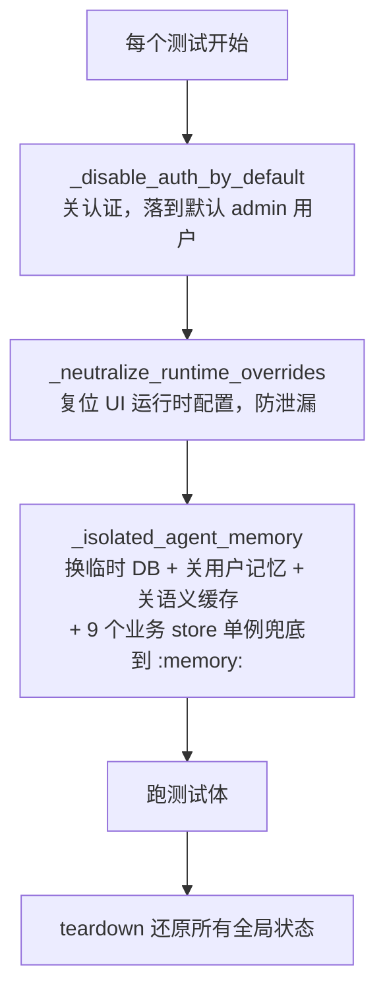

# 1. pytest 快速入门

Python 生态最主流的单元测试框架。AgentA 全部 UT 用它，测试代码在 `tests/`，配置在根目录 `pytest.ini`。

> 一句话定位：**pytest ≈ Python 世界的 Google Test**，但断言用原生 `assert`、fixture 用依赖注入，比 gtest 更轻。

---

## 1.1. 上手三件事

| 动作 | 命令 | 说明 |
|---|---|---|
| 装 | `pip install pytest` | AgentA 已在 `.venv/` 装好，不要用系统环境 |
| 跑全部（默认集） | `pytest` | 读 `pytest.ini`，递归收集 `tests/` 各子目录的 `test_*.py` |
| 跑单个文件 | `pytest tests/skills/test_skill_loader.py` | 调试单模块最常用 |
| 跑单个目录 | `pytest tests/memory` | 只跑某一层（按 src 分包，见 §1.2） |

AgentA 里固定用虚拟环境跑：

```powershell
.\.venv\Scripts\python.exe -m pytest -q
```

---

## 1.2. 测试发现（命名约定）

pytest 靠**命名约定**自动找测试，不需要手动注册：

| 层级 | 约定 | AgentA 实例 |
|---|---|---|
| 文件 | `test_*.py` | `tests/memory/test_user_memory.py` |
| 类（可选） | `Test<Behavior>`（不能有 `__init__`） | `class TestAdd:` |
| 函数 / 方法 | `test_<scenario>` | `def test_returns_tagged_block_after_load(self):` |

> 工程公约：Test 类名 `Test<Behavior>`、方法 `test_<scenario>`。一个被测模块对应一个 `test_<module>.py`。

测试文件按 src 结构分目录存放（深度 1 级），便于定位：

| 目录 | 对应 src | 目录 | 对应 src |
|---|---|---|---|
| `tests/agent/` | `src/agent`（含 `core`：如 `security_filter` / `url_guard` / tool 黑名单） | `tests/memory/` | `src/memory`（含 `security_event_store`） |
| `tests/api/` | `src/api`（含安全红队侧车与路由相关 UT，如 `test_security_adversarial`） | `tests/rag/` | `src/rag` |
| `tests/cli/` | `src/cli` | `tests/skills/` | `src/skills` |
| `tests/llm/` | `src/llm` | `tests/optional/` | langchain/autogpt 备用实现（默认不收集，见 §1.7） |

---

## 1.3. 写断言：用原生 `assert`

pytest 不需要 `EXPECT_EQ` 这类宏，直接写 `assert`，框架会在失败时自动展开表达式、打印两边的值（assertion rewriting）。

真实例子（[`tests/agent/test_agent_active_plan_injection.py`](../../tests/agent/test_agent_active_plan_injection.py) · `TestBuildActiveStudyPlanBlock.test_sessions_isolated`）：

```python
def test_sessions_isolated(self, store):
    """A session load → B session 不应看到。"""
    pid = store.create_plan(goal="A 的 plan")
    store.add_tasks(pid, [{"stage_idx": 1, "order_idx": 1, "title": "t"}])
    store.mark_loaded("sess-A", pid)

    out_a = build_active_study_plan_block(session_id="sess-A")
    out_b = build_active_study_plan_block(session_id="sess-B")
    assert "A 的 plan" in out_a
    assert out_b == ""          # 失败时自动打印 out_b 实际值
```

断言异常用 `pytest.raises`（[`tests/agent/test_srs_scheduler.py`](../../tests/agent/test_srs_scheduler.py) · `TestParseRating.test_invalid_raises`）：

```python
@pytest.mark.parametrize("raw", ["", "1", "ok", "great", "fail", "good?"])
def test_invalid_raises(self, raw: str) -> None:
    with pytest.raises(ValueError):
        parse_rating(raw)
```

---

## 1.4. fixture（准备 / 清理环境）

fixture = 把「造数据 / 建临时资源 / 事后清理」抽成可复用块，由 pytest 在跑用例前自动准备、跑完自动收尾。**通过函数参数名注入**。

### 1.4.1. 自定义 fixture

`yield` 前是 setup，`yield` 后是 teardown。真实例子（[`tests/agent/test_agent_active_plan_injection.py`](../../tests/agent/test_agent_active_plan_injection.py) 顶部 `store` fixture）：

```python
@pytest.fixture
def store(tmp_path: Path) -> Iterator[LearningPlanStore]:
    s = LearningPlanStore(str(tmp_path / "lp.db"))   # tmp_path 是内置 fixture
    lp_store_module.reset_shared_store_for_testing(s)
    yield s                                          # 把 s 注入测试
    lp_store_module.reset_shared_store_for_testing(None)
    s.close()                                        # 测试结束自动清理

def test_empty_when_no_loaded(self, store):          # 参数名 = fixture 名，自动注入
    pid = store.create_plan(goal="DB 有 active 但未 load")
    ...
```

### 1.4.2. 常用内置 fixture

| fixture | 用途 |
|---|---|
| `tmp_path` | 每个测试独立的临时目录（`pathlib.Path`），自动清理 |
| `monkeypatch` | 临时改属性 / 环境变量 / 字典，测试结束自动还原 |
| `capsys` | 捕获 stdout / stderr |

`monkeypatch` 在 AgentA 里大量用于把全局配置 / 模块单例指到临时对象（[`tests/api/test_api_skills.py`](../../tests/api/test_api_skills.py) 的 `client` fixture）：

```python
def client(tmp_path, monkeypatch):
    monkeypatch.setattr(skill_loader, "DEFAULT_SKILLS_DIR", tmp_path)
    disabled_file = tmp_path / "skills_disabled.json"
    monkeypatch.setattr(_cfg, "SKILLS_DISABLED_FILE", str(disabled_file))
    ...                                        # 测试结束 monkeypatch 自动还原
```

### 1.4.3. scope 与 autouse

- **scope**：`function`（默认，每个用例一次）/ `module` / `session`，控制 fixture 复用粒度与成本。
- **autouse=True**：不写进参数也自动对每个用例执行，用于全局隔离。

AgentA 的 `tests/conftest.py` 用 autouse fixture 做测试隔离（见 §1.8）。

---

## 1.5. mock 外部依赖

AgentA 约定：LLM / DB / 文件 IO 等外部依赖一律用标准库 `unittest.mock` 打桩，**UT 里不发真实请求**。

`patch.object` 让真实方法抛错，验证软降级（[`tests/agent/test_agent_active_plan_injection.py`](../../tests/agent/test_agent_active_plan_injection.py) · `test_store_exception_returns_empty`）：

```python
def test_store_exception_returns_empty(store):
    pid = store.create_plan(goal="x")
    store.mark_loaded("sess-A", pid)
    with patch.object(store, "render_plan_for_prompt",
                      side_effect=RuntimeError("DB bang")):
        assert build_active_study_plan_block(session_id="sess-A") == ""
```

`MagicMock` 替掉依赖并验证调用约定（[`tests/agent/test_memory_manager.py`](../../tests/agent/test_memory_manager.py) · `test_load_for_context_called_with_max_chars`）：

```python
def test_load_for_context_called_with_max_chars(self):
    um = MagicMock()
    um.load_for_context.return_value = "x"
    mgr = _mk_mgr(user_memory=um)
    mgr.build_system_prompt("BASE")
    um.load_for_context.assert_called_once_with(_cfg.USER_MEMORY_MAX_CHARS)
```

要点：

- `patch("模块路径.名字")`：patch 的是「被使用处」的引用，不是定义处。
- `side_effect`：抛异常 / 按序列返回多个值。
- `return_value`：固定返回值。
- `MagicMock` 自动生成任意属性 / 方法，省去手写假类。

---

## 1.6. 参数化（一份逻辑测多组数据）

真实例子（[`tests/agent/test_srs_scheduler.py`](../../tests/agent/test_srs_scheduler.py) · `TestParseRating.test_valid`）：

```python
@pytest.mark.parametrize("raw,expected", [
    ("again", Rating.AGAIN),
    ("AGAIN", Rating.AGAIN),
    (" Again ", Rating.AGAIN),
    ("hard", Rating.HARD),
    ("good", Rating.GOOD),
    ("easy", Rating.EASY),
])
def test_valid(self, raw: str, expected: Rating) -> None:
    assert parse_rating(raw) is expected
```

一个 `parametrize` 会展开成多个独立用例，任何一组失败都单独报出来。还可用 `pytest.param(..., marks=...)` 给单组打 marker（见 [`tests/llm/test_llm.py`](../../tests/llm/test_llm.py)）。

---

## 1.7. marker（给用例打标签，按需筛选）

marker 用 `@pytest.mark.<name>` 给用例打标签，配合 `-m` 表达式筛选跑哪些。AgentA 在 `pytest.ini` 注册了 4 个 marker，并**默认 deselect 掉**（平时不跑）：

| marker | 含义 | 为何默认不跑 |
|---|---|---|
| `integration` | 真实 API / 网络 / ChromaDB | 慢、要密钥、有副作用 |
| `slow` | 慢用例（真实 Office 解析 / 超时等待 / 入库等） | 省测试资源 |
| `langchain` | LangChain 备用实现（在 `tests/optional/`） | 非默认实现；import langchain 慢 |
| `autogpt` | AutoGPT 备用实现（在 `tests/optional/`） | 非默认实现 |

> `tests/optional/`（langchain/autogpt）还另外被 `--ignore` 排除——默认连**收集**都跳过，避免 collection 阶段 import langchain 拖慢（实测 collection ~65s → ~6s）。

`pytest.ini` 当前内容：

```ini
[pytest]
testpaths = tests
pythonpath = .
addopts = -v --tb=short --ignore=tests/optional -m "not integration and not langchain and not autogpt and not slow"
markers =
    integration: 真实 API / 网络 / ChromaDB 调用
    slow: 慢用例（真实文件入库 / Office 解析 / 超时等待等）
    langchain: LangChain Agent 实现相关（在 tests/optional，默认不收集）
    autogpt: AutoGPT Agent 实现相关（在 tests/optional，默认不收集）
```

打 marker 两种写法：

```python
# 单个用例
@pytest.mark.integration
def test_real_llm_call():
    ...

# 整个文件 / 整个类（放文件顶部或类上方）
pytestmark = pytest.mark.langchain
```

跑特定 marker：

```powershell
pytest -m "integration"                    # 只跑 integration
pytest -m "slow"                           # 只跑慢用例
pytest tests/optional -m "langchain"       # 跑备用实现（需先解除 --ignore，故指定目录）
```

> ⚠️ PowerShell 下 `-m ""`（清空筛选）的空串可能被吞，必要时改用 `-o addopts=""` 覆盖默认筛选。

---

## 1.8. AgentA 的测试隔离机制（`conftest.py`）

[`tests/conftest.py`](../../tests/conftest.py) 是 pytest 的「目录级共享配置」，里面的 fixture 对整个 `tests/`（含所有子目录）自动生效。AgentA 用 autouse fixture 保证每个测试干净、不污染真实数据、不误发 LLM：



| fixture | 干什么 | 为什么 |
|---|---|---|
| `_disable_auth_by_default` | 临时关 `AUTH_ENABLED` | API 测试无需登录即可跑通 |
| `_neutralize_runtime_overrides` | 把 config 复位到 env 基线 | 防 UI 存的运行时配置（如 thinking=true）泄漏到不 mock LLM 的测试 |
| `_isolated_agent_memory` | chat_history 换临时 DB、关 user_memory/语义缓存、9 个业务 store 单例 reset 到独立 `:memory:` | 测试间互不污染；不向真实 `sqlite_db/` 读写测试数据；不误发 LLM 干扰 mock 计数 |

> **store 兜底**：learning_plan / quiz / srs / usage / golden / trace / security_event / user_store 等单例默认指向真实 `./sqlite_db/*.db`。若测试经 `agent.run` / `execute_tool` 间接触发 `get_shared_store()` 又忘了自己隔离，会静默读写真实库。conftest 统一把这些单例 reset 到 `:memory:`（内存库，避免磁盘 IO 开销），新测试默认安全。
>
> 关键细节：`conftest.py` 顶部先 `load_dotenv(override=True)` 再 import `src.*` —— 因为 `src.config` 在 import 时就读 `os.getenv()`，顺序错了配置会全空。

---

## 1.9. 常用命令速查

| 需求 | 命令 |
|---|---|
| 跑默认集（不带参数，等价 `pytest tests/`） | `pytest` |
| 跑默认集（安静模式） | `pytest -q` |
| 跑单目录 / 单文件 | `pytest tests/rag` / `pytest tests/rag/test_rag.py` |
| 跑单个类 / 方法 | `pytest tests/rag/test_rag.py::TestSearch::test_search_returns_list` |
| 按 marker 筛选（`-m`） | `pytest -m "integration"` / `pytest -m "slow"` / `pytest -m "not integration"` |
| 按名字关键词筛（`-k`） | `pytest -k "isolation and not memory"` |
| 第一个失败就停 | `pytest -x` |
| 只重跑上次失败的 | `pytest --lf` |
| 看最慢的 N 个用例 | `pytest --durations=20` |
| 只收集不执行（看有哪些用例） | `pytest --collect-only -q` |
| 打印被吞的 stdout | `pytest -s` |

> 不带任何参数的 `pytest` 会读 `pytest.ini` 的 `testpaths` + `addopts` 跑默认集；`-m` 按 marker 表达式筛选（见 §1.7），`-k` 按用例名子串筛选。

---

## 1.10. 与 Google Test 对照（C++ 背景速查）

| 维度 | Google Test (C++) | pytest (Python) |
|---|---|---|
| 断言 | `EXPECT_EQ` / `ASSERT_TRUE` 宏 | 原生 `assert` |
| 用例组织 | `TEST` / `TEST_F(Fixture, Case)` | `test_` 函数 / `Test` 类 + 方法 |
| fixture | 继承 `::testing::Test` + `SetUp/TearDown` | 函数 + 依赖注入（参数名匹配）|
| 参数化 | `TEST_P` + `INSTANTIATE_TEST_SUITE_P` | `@pytest.mark.parametrize` |
| 过滤 | `--gtest_filter` | `-k` / `-m` |
| mock | Google Mock（gmock，独立库） | `unittest.mock`（标准库）|
| 执行 | 编译链接成可执行程序再跑 | 解释执行，直接收集源码跑 |

> 最大差异：pytest 没有 `EXPECT`（软失败）vs `ASSERT`（硬失败）之分——一个 `assert` 失败该用例即停。

---

# 2. 附录：缩写

| 缩写 | 全称 | 含义 |
|---|---|---|
| **UT** | Unit Test | 单元测试 |
| **fixture** | （原词） | 测试的环境准备 / 清理单元 |
| **marker** | （原词） | 给用例打的标签，配合 `-m` 筛选 |
| **mock** | （原词） | 用假对象替代真实外部依赖 |
| **conftest** | configuration test | pytest 目录级共享配置文件 |
