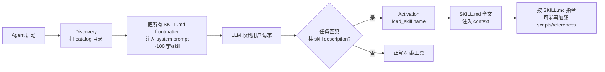

# 1. Bi-Encoder vs Cross-Encoder

## 编码方式

**Bi-Encoder（分开编码）：**
```
Query → Encoder → q_vec ─┐
                           ├→ cosine → score
Chunk → Encoder → d_vec ─┘
```
Query 和 Chunk 各自独立编码成向量，打 cosine 相似度。
Chunk 向量可以**提前全部算好存库**，检索时只算一次 Query 向量，然后做向量近邻搜索——极快。

**Cross-Encoder（拼一起编码）：**
```
[CLS] Query [SEP] Chunk [SEP] → Transformer → score
       ↑               ↑
   query 的每个词都能 attend 到 chunk 的每个词
```
Query 和 Chunk 拼在一起送入 Transformer，两边 token 充分交互，模型能捕捉到
"这个词在 Query 里是什么语境、对应 Chunk 里哪句话回应了它"——精度高，但慢。

## 对比

| | Bi-Encoder | Cross-Encoder |
|--|--|--|
| 速度 | 快（Chunk 向量提前算好） | 慢（每对都要跑一次前向） |
| 精度 | 较低（两边无词级交互） | 高（两边 token 互相 attend） |
| 用途 | **召回**（从海量文档快速捞候选） | **精排**（对少量候选重新打分） |

## 在 RAG 里的分工

```
用户 Query
  ↓
Bi-Encoder 召回  →  top-K × 3 候选（快但粗）
  ↓
Cross-Encoder 精排  →  最终 top-K（慢但准）
  ↓
送给 LLM
```

对全量文档跑 Cross-Encoder 太慢，对少量候选跑则可接受。
**Bi-Encoder 负责"海里捞鱼"，Cross-Encoder 负责"鱼里挑好的"。**


# 2. BGE

## 是什么

**BGE** = **B**AAI **G**eneral **E**mbedding，智源研究院（Beijing Academy of Artificial Intelligence, BAAI）开源的嵌入模型家族。
覆盖两类：

- **Dense embedding**：把文本编码成向量，用于召回（Bi-Encoder 模式）
- **Cross-Encoder reranker**：对 (query, doc) 拼接打分，用于精排

是 MTEB（Massive Text Embedding Benchmark）中英文榜单长期前列的开源 SOTA 之一。

## 模型谱系

| 模型 | 用途 | 维度 / 大小 | 语种 |
|---|---|---|---|
| `bge-small-zh` | Dense embedding | 512 / ~96MB | 中文优化 |
| `bge-small-en` | Dense embedding | 384 / ~33MB | 英文 |
| `bge-base/large-zh-v1.5` | Dense embedding | 768 / 1024 | 中文（更大更准）|
| `bge-m3` | Dense embedding | 1024 / ~568MB | 多语言（推荐生产）|
| `bge-reranker-base` | Cross-Encoder 精排 | ~1.1GB | 中英双语 |
| `bge-reranker-v2-m3` | Cross-Encoder 精排 | 更大 | 多语种最佳 |

## 本项目用到哪些

| .env 配置 | 别名 | 实际模型 |
|---|---|---|
| `EMBEDDING_MODEL=zh` | zh | `BAAI/bge-small-zh` |
| `EMBEDDING_MODEL=m3` | m3 | `BAAI/bge-m3`（默认）|
| `RERANKER_MODEL` | — | `BAAI/bge-reranker-base`（默认）/ `BAAI/bge-reranker-v2-m3`（可选）|

> 英文别名 `en` 走的是 MiniLM（all-MiniLM-L6-v2，微软开源轻量英文 / 多语，384 维 / ~90MB），不是 BGE。

## 易踩坑：非对称 query prefix

BGE 早期版本（v1.0）训练时 query 和 doc 不对称，**query 必须加专属 prefix** 否则相似度对不齐：

```
中文：query 前面加 "为这个句子生成表示以用于检索相关文章："
英文：query 前面加 "Represent this sentence for searching relevant passages: "
doc 端原样不动
```

**v1.5 和 m3 已修复对称性，不再需要 prefix**。本项目在 `src/rag/retriever.py:42-57` 按模型名自动判断是否注入 prefix，调用方无感知。

## 为什么选 BGE

- **本地可跑** · 免费 · 无需 API Key（不像 OpenAI text-embedding-3）
- **中文场景质量 ≥ 商用闭源**（MTEB-zh 长期前列）
- **同一团队覆盖 embedding + reranker**，训练数据 / 分布一致，搭配使用比混搭第三方模型更稳
- **bge-m3 单模型覆盖中英**，省一份库


# 3. CRUD
CRUD = **Create / Read / Update / Delete**，数据存储最基础的 4 个操作，对应 SQL 里就是 `INSERT / SELECT / UPDATE / DELETE`。

说一个东西"只做 CRUD"，意思是它**只管把数据存进去、取出来、改、删**，不参与任何业务判断。

- `ChatHistoryStore` 只做 CRUD → 给我一条 message 我存下来、给我 session_id 我返回最近 N 条，**不关心** "这是不是 skill 触发的轮、要不要保护成对、要不要截断"。
- `HistoryManager` 才管这些"要不要、怎么截"的业务策略，背后调 `ChatHistoryStore` 的 CRUD 拿数据。

# 4. Skills

## 0. 一句话定位

> **agentskills.io（Anthropic Agent Skills）= 一份文件系统级约定**，让 agent 在不爆 context window 的前提下，按需加载"特定任务的 know-how 指令包"。

设计动机：把"所有 agent 能做的事的详细指令"全塞进 system prompt 不可扩展（10 个 skill 就几万 token），所以拆成**目录结构 + 渐进披露**。

## 1. 四个核心机制



| 机制 | 含义 | 关键约束 |
|---|---|---|
| **① Catalog** | 一个根目录（如 `.agenta/skills/`）下放多个 skill 子目录，每 skill 一个独立目录 | 子目录名 = skill 唯一 ID（kebab-case） |
| **② Discovery** | Agent 启动时扫 catalog，**只读 SKILL.md 的 frontmatter**（name + description），汇总成清单注入 system prompt | 清单成本 ≈ 100 字 / skill |
| **③ Progressive Disclosure** | 三级渐进披露，**只在需要时**加载更深层内容 | 见下表 |
| **④ Activation** | LLM 判定当前任务命中某 skill 时，调用 `load_skill(name)`（或等价机制）把 SKILL.md 全文塞进 context | 激活由 LLM 自主决定（也可用户 `/skill-name` 手动） |

渐进披露三级
| Level | 加载什么 | 何时 | 典型大小 |
|---|---|---|---|
| **L1** | name + description | 启动时（全 catalog） | ~100 字/skill |
| **L2** | SKILL.md 全文 | LLM 激活时（一次一个） | 几百~几千字 |
| **L3** | SKILL.md 里 reference 的 scripts/ / references/ / assets/ 文件 | SKILL.md 指令里说"需要时再读" | 任意 |


## 2.SKILL.md标准格式

```markdown
---
name: kebab-case-id              # 必填，全 catalog 唯一
description: 一句话讲做什么 + 何时激活。控制在 ~100 字以内。
---

# Human-readable Title

## Purpose
...

## When to use
...

## Instructions
1. 步骤 1
2. 步骤 2
   - 详情可引用 `references/foo.md`
   - 复杂逻辑可调用 `scripts/bar.py`

## Examples
...
```

**关键约定**：
- `description` 决定 LLM 是否激活，**必须写成"做什么 + 何时用"格式**（"激活信号"），不是"这个 skill 是什么"（"自描述"）
- ❌ "本 skill 实现 PDF 解析功能"
- ✅ "Parse PDF files when user uploads or references one. Use this whenever the conversation involves extracting text, tables, or metadata from `.pdf` files."

---

## 3. 一个 Skill 目录的完整结构（官方推荐）

```
.agenta/skills/
└── pdf-extractor/
    ├── SKILL.md              # L2：必有
    ├── scripts/              # L3：可选，按需执行
    │   └── extract.py
    ├── references/           # L3：可选，按需读
    │   └── pdf-spec.md
    └── assets/               # L3：可选，模板/示例数据
        └── template.json
```

- **scripts/**：agent 可在激活后调用（需要 code execution 工具）
- **references/**：agent 按需读取的补充资料（避免塞进 SKILL.md 撑大 L2）
- **assets/**：模板、示例输入、配置文件

---

## 4. 跟 MCP / 普通 tool 的边界

| 维度 | **Skills (agentskills.io)** | **MCP (Model Context Protocol)** | **普通 Tool** |
|---|---|---|---|
| 层级 | **文件系统约定** | **进程级协议** | **agent 内部函数** |
| 形态 | 本地目录里的指令包（markdown + 可选 scripts） | 外部服务暴露 tools / resources / prompts，stdio/SSE 连接 | Python 函数（如 `search_knowledge`） |
| 注入方式 | system prompt（L1 清单）+ context（L2 全文） | tool schema 注入 | tool schema 注入 |
| 解决的问题 | "agent 该**如何使用**某能力" 的 know-how | "agent 能**接入哪些外部**能力" | "agent 当前内置的能力" |
| 谁触发激活 | LLM 自主 / 用户手动 | LLM 调用 tool | LLM 调用 tool |
| 是否爆 context | **不会**（渐进披露） | tool schema 一次性全注入 | tool schema 一次性全注入 |

**关键互补关系**：
- MCP 给外部接口，Skills 给"使用接口的 know-how"
- 一个 skill 可以**指导 LLM 怎么用一组 MCP tool / 普通 tool**（如 `pdf-extractor` skill 可能指导调用 `read_file` + `parse_pdf` MCP tool）
- phase 1.5 范围在 **Skills**（文件级约定），**不涉及 MCP**（那是另一个独立的 phase）

---

## 5. 在 AgentA 里的命名对照

| agentskills.io 术语 | AgentA 当前对应物 | 文件位置 |
|---|---|---|
| Catalog 根目录 | `.agenta/skills/` | 已存在（你之前从 `advanced/skills/` 搬过来） |
| Skill 单元 | `.agenta/skills/<name>/SKILL.md` | 已有一个 `example-skill/SKILL.md` |
| Discovery | `src/cli/skill_loader.py`（推测） | 已存在，待 Review |
| L1 清单注入 | 当前 system prompt 里有没有 skill catalog 段？ | **待 Review** |
| L2 Activation | `AgentAPI.activate_skill(name)` | 已存在（design.md §3 已列出） |
| L3 scripts/references | 当前 SKILL.md 是否引用外部资源？ | **待 Review** |

---

# 5. SRS
用户选 A — 先讲算法 / 调度策略原理 + 给 3-5 个核心决策点的 trade-off，再开 Step 0。

下面是**纯原理 + trade-off 表**，不掺项目实现细节（项目实现要 Step 0 才独立起草）。

---

## 一、SRS 是什么、解决什么问题

SRS（Spaced Repetition System，间隔重复系统）是 1970s 起源的记忆心理学实践：

- **基础假设**：人对一条信息的记忆衰减遵循"遗忘曲线"（Ebbinghaus，1885），**间隔越长再复习一次、记忆强度递增越快**
- **目标函数**：用**最少次数的复习**让一组卡片在长期都保持"想起来"的概率 ≥ 某阈值（行业惯例 90%）
- **核心动作**：每张卡片有"下次该复习的时刻"（`next_review_at`）；用户做完一次 quiz/review 后，根据**答对/答错 / 自评难度**调整下次间隔
- **典型场景**：背单词（Anki / SuperMemo）、医学执照（Memrise）、棋谱（chess.com）、面试题刷题（本项目契合度极高 — 用户给学习目标 → Plan 拆 → Quiz 出题 → 答错的题进 SRS 队列周期回炉）

直白一句：**SRS 是给 Quiz / 知识点配一个"几号再来一次"的调度器。**

---

## 二、调度算法

| 算法 | 来源 | 状态字段（每卡片） | 反馈粒度 | 复杂度 | 调参成本 |
|---|---|---|---|---|---|
| **Leitner 盒子** | 1972 物理盒 | `box_level`（1-5 个盒子） | 对/错 二元 | ★ | 0（无 hyperparam） |
| **SM-2** (SuperMemo 2) | 1987 Wozniak | `ease_factor`（默认 2.5）/ `interval_days` / `repetitions` | 0-5 自评 | ★★ | 低（公式有，无机器学习） |
| **Anki 修订版** | Anki 默认调度器 | SM-2 字段 + `lapses`（错次） + `learning_steps` | 4 档：again / hard / good / easy | ★★ | 中（多 hyperparam） |
| **FSRS** (Free Spaced Repetition Scheduler) | 2022 Open source（基于 DSR 记忆模型） | `stability` / `difficulty` / `retrievability` + 17 个全局参数 | 4 档同 Anki | ★★★★ | 高（需训练数据 fit 17 参数 / 默认参数也可用） |
| **Half-life regression / DKT** | Duolingo / Memory Research | 神经网络 / 全局参数估计 | 答对/答错 + 用户特征 | ★★★★★ | 极高（要大量历史数据） |

**关键 trade-off 概览**：

| 维度 | Leitner | SM-2 | Anki | FSRS | NN-based |
|---|---|---|---|---|---|
| 代码行数（核心调度） | 10 行 | 30 行 | 80-100 行 | 200+ 行 | 500+ 行 |
| **用户输入门槛** | 对/错 | **答完自评 0-5**（难推用户记得） | 4 档（again / hard / good / easy）| 4 档同 Anki | 对/错 |
| 启动数据需求 | 0 | 0 | 0 | 0（用默认 17 参数）/ 实测精度 fit 后约 500+ review 才显著优 | 5000+ review |
| 长尾精度 | 差 | 中 | 中-好 | 好 | 最好 |
| MVP 适配度 | ★★★★ | ★★★★★ | ★★★ | ★★ | ✗ |

**个人助手 MVP 阶段的现实**：用户 review 总量大概率 < 1000 张；FSRS / NN 的"长尾精度"优势在这个体量根本体现不出来，反而拖累调试。SM-2 是行业默认的"够用最小可行"。

---

## 三、调度触发策略
有三条路：

| 策略 | 含义 | 用户体验 | 实现复杂度 |
|---|---|---|---|
| **A. 被动查询（pull）** | 用户每天主动 `/srs review` 或 agent 在合适时机自查 → 列出 "今天 due 的 10 张卡" | 用户感知"我打开 agent 想复习时它能告诉我有什么要复习" | ★ 一个 SQL `WHERE next_review_at < now()` 完事 |
| **B. 进 agent 时主动提醒（一次性 push）** | Agent 启动 / `/study load` 时若 due > 0 → 在 system prompt 注入 `<srs_pending>5 张卡片 due</srs_pending>` 或 chat 启动语 | "打开就告诉我" + 不依赖外部进程 | ★★ 跟 Phase 2.2 `/study load` 注入路径同构（手动加载 vs 自动） |
| **C. 系统级后台 scheduler（cron / OS notification）** | 进程外的 cron / windows scheduled task / chainlit push notification 在 due 时刻系统提醒 | "邮件提醒我"，跟用户当前是否在用 agent 解耦 | ★★★★ 涉及 OS 集成 / 邮件 / 跨平台 / chainlit push API；超 MVP scope |


# 6. Harness（自检 / 反思）

## 一、Harness 是什么、解决什么问题

### 术语先澄清（避免后面混淆）

业界 "harness" 一词有两种用法，必须分清：

| 用法 | 含义 | 谁这么叫 |
|---|---|---|
| **广义 agent harness** | 包住 LLM 的整套**运行时脚手架**：工具调用循环 / 解析器 / 上下文拼装 / 错误处理 —— 即"把一个生 LLM 包成 agent 的那层胶水" | METR / Devin / SWE-bench 论文圈 |
| **狭义自检 harness**（**本项目用法**） | LLM 跑出一个产出后，agent **自己评一下产出好不好、要不要再来一轮** —— 即"反馈回路" | iter_3.md §3 #10 / iter_2_agent.md §4.6.2 G1 |

本项目（Phase 2.5）讨论的是**狭义**：广义那层在 Phase 2.1 plan-execute / 现有 ReAct 主循环里已经构成。下面 "harness" 一词如无说明都指狭义。

### 解决什么问题

LLM 一次性输出未必准（幻觉 / 漏覆盖 / 误用工具 / 答非所问）。传统做法是**让用户自己发现 + 重新提问**，但：

- 用户察觉成本高（要懂这个领域才能判错）
- 一些"对错有客观依据"的场景（测验答对答错 / plan 步骤是否覆盖目标 / RAG 召回是否相关）其实 **LLM 自己就能判**，没必要让用户当裁判
- 有些错误（plan 漏关键步骤 / RAG 召回到无关片段）**当时不发现，后面整条链路都是错的**，事后修代价大

所以加一道"agent 自己批自己"的回路：**产出 → 自评 → （不达标则）重做 / 修正 / 终止**。

直白一句：**Harness 是给 LLM 的产出加一道复核，决定要不要再来一遍。**

### 经典灵感来源

Reflexion（Shinn et al., NeurIPS 2023）—— "verbal reinforcement learning"（语言化强化学习）：agent 失败后用自然语言写一段反思，下一轮把反思塞回 prompt，相当于**用语言版的奖励信号迭代**。本项目的 harness 思路跟 Reflexion 一脉相承（iter_2_agent.md §4.7.2 #3 备注："Reflexion 风格"）。

---

## 二、典型模式对比

各路自检 / 自我修正工作可以按"评什么 / 谁来评 / 评几轮"3 个轴归类。

| 模式 | 论文 / 出处 | 评什么 | 谁来评 | 迭代次数 | 关键特征 |
|---|---|---|---|---|---|
| **Self-Refine** | Madaan et al., NeurIPS 2023 | 单次输出 | 同一个 LLM | 多轮（直到满意 / 上限） | 单模型自洽：反馈 → 修正 → 再来一轮 |
| **Reflexion** | Shinn et al., NeurIPS 2023 | 整条执行轨迹（含失败信号） | 同一个 LLM 写反思 | 跨次（每次失败积累） | 反思以**语言形式**累积进长期记忆 |
| **Chain-of-Verification（CoVe）** | Dhuliawala et al., 2023 | 单次输出 | 同模型，但**先列验证问题**再答 | 1-2 轮 | 把"自评"分解成"列出可验证的子事实问题" |
| **CRITIC** | Gou et al., ICLR 2024 | 单次输出 | 同模型 + **外部工具核验**（搜索 / 计算 / 代码执行） | 多轮 | 自评不空想，调工具拿事实依据（ground truth） |
| **Self-Consistency** | Wang et al., ICLR 2023 | 多次采样 | 不评，**投票** | N 次并行采样 | 没有显式评审，靠"多数收敛"近似正确 |
| **Constitutional AI / Self-Critique** | Bai et al., Anthropic 2022 | 单次输出 | 同模型 + 一组**原则（constitution）** | 1 轮（批评 → 重写） | 用书面原则约束评审视角，避免漫无目的 |
| **Process Reward Model（PRM）** | Lightman et al., 2023 | 推理过程**每一步** | **独立训练的小模型** | 离线训练 + 在线打分 | 每步打分而非只评最终答案；需要标注数据训练 |
| **LLM-as-a-Judge** | Zheng et al., NeurIPS 2023 | 任意输出 | 一个**更强的** LLM（GPT-4 等） | 1 轮 | 评估场景为主（非生产路径评审）；**本项目 [`tools/agent_eval/judge/`](../tools/agent_eval/judge/__init__.py) 已采用** |
| **Verifier Agent / Critic 子代理** | Devin / Marco DeepResearch / 多 agent 论文 | 子任务输出 / 最终答案 | **独立 agent 角色**（不同 prompt / 不同模型） | 1+ 轮 | 角色分离，"出题人 ≠ 阅卷人" |

### 关键对比维度提炼

| 维度 | 选项 | 影响 |
|---|---|---|
| **评什么** | 最终输出 / 中间步骤 / 整条执行轨迹 | 评的颗粒度 → 反馈信号密度（PRM 最密，Self-Refine 最疏） |
| **谁来评** | 同一 LLM / 同模型不同 prompt / 独立 LLM / 独立小模型 / 工具核验 | 客观性 vs 成本（独立 LLM 最准但贵；同模型最省但有"自我欣赏"偏差） |
| **评几轮** | 1 轮（出 → 评 → 终止） / N 轮（迭代修正） / 跨次（Reflexion 风格） | 质量 vs 成本（迭代越多越好越贵，且可能不收敛） |
| **依据什么** | 自由打分 / 原则清单 / 验证子问题 / 工具事实核验 | 信号客观性递增；项目复用工具核验时跟现有 RAG / web_search 同构 |
| **生产路径还是评估路径** | 生产 = 每次用户提问都跑 / 评估 = CI / phase 出口跑 | 生产路径评审必须低延迟（最多多打 1 次 LLM 调用）；评估路径不在乎延迟，可上更强模型 |

---

## 三、关键取舍

### 1. 自评偏差（最致命的坑）

同一个 LLM **既是出题人又是阅卷人**时，存在文献反复实证的两类偏差：

- **自我偏好偏差（self-preference bias）**：模型倾向于给自己的输出打高分（Zheng et al. 2023 LLM-as-Judge 的核心警告之一）
- **盲点同源**：模型在第一轮想不到的角度，第二轮自评也想不到 —— "你不知道自己不知道"

**缓解办法**（按成本递增）：

| 办法 | 成本 | 效果 |
|---|---|---|
| **换 prompt 人设**（"扮演严苛挑刺的审查者"） | 0 | 弱缓解，仍易陷入自我欣赏 |
| **给明确评分细则（rubric）** | 写一份 prompt | 中（约束打分维度，减少漫无目的） |
| **CoVe 风格分解**（先列验证问题，再答） | +1 次 LLM 调用 | 中（强迫触发盲点） |
| **CRITIC 风格工具核验** | +1 次工具调用（grep / search / 计算） | 强（事实有依据可对） |
| **换更强模型当评审** | +API 费 | 强（GPT-4 评 GPT-3.5 比同级互评稳） |
| **独立评审 agent** | +整条 prompt + 上下文 | 最强（角色 + 模型双隔离） |

### 2. 单轮 vs 迭代修正的收敛性

Self-Refine 论文展示"迭代越多越好"，但 Madaan 自己也承认：

- **任务越客观，迭代收益越大**（数学题 / 代码题）
- **任务越主观，迭代越容易跑偏 / 振荡**（写作风格 / 创意类）
- **3 轮以上边际收益骤降**，工业实践默认 1-2 轮

| 任务类型 | 推荐迭代次数 | 备注 |
|---|---|---|
| 客观可验证（测验对错 / 代码执行 / 数学计算） | 1-3 轮，**直到通过 / 触顶** | 适合有明确通过条件 |
| 半客观（plan 步骤合理性 / RAG 召回相关性） | **1 轮即停** | 第 2 轮往往只是换个说法没本质改进 |
| 主观（写作 / 风格） | **0 轮（不上 harness）** | 振荡 + 退化风险大于收益 |

### 3. 生产路径 vs 评估路径（最容易混淆）

业界"自评 / 评判"既出现在**生产**也出现在**评估**，机制相同但**目标和约束完全不同**：

| 维度 | 生产路径评审 | 评估路径评审 |
|---|---|---|
| 触发频率 | **每次用户提问** | CI / phase 出口 / 数据集跑批 |
| 谁触发 | LLM 自主 / agent 框架硬编码 | 工程师手动 / 流水线 |
| 延迟约束 | **强**（用户在等）→ 最多多打 1 次调用 | **无**（离线跑） |
| 模型选择 | 用主对话同款（省钱省延迟） | 可上**更强**模型当评审 |
| 用途 | 修自己产出 → 给用户更好答案 | 给"答案好坏"打分数 → 回归 / 选模型 / 调 prompt |
| 失败兜底 | 评审自己挂掉**不能阻塞**主流程 | 评审挂掉直接报告该用例 fail |

**本项目现状**：[`tools/agent_eval/judge/llm_judge.py`](../tools/agent_eval/judge/__init__.py) 是**评估路径**评审（已用于 Phase 2.1 plan / Phase 2.2 学习计划 eval）；Phase 2.5 要做的是**生产路径**评审（首次引入）。两者 prompt 思路相通但接入点完全不同 —— 生产路径要嵌进 `Agent.run()` 主循环 / 工具调用通道，评估路径只在脚本里跑。

### 4. 执行轨迹级 vs 输出级评估

| 评估颗粒度 | 看什么 | 适用场景 | 难点 |
|---|---|---|---|
| **输出级**（output-only） | 最终答案 | 测验答案对不对 / 文章好不好 | 看不到"过程哪一步出错"，只能整体推翻 |
| **执行轨迹级** | 完整事件流（每次 LLM 调用 / 工具调用 / 中间结论） | plan-execute 哪步走偏 / RAG 召回哪条不相关 | 上下文长，评审 prompt 要写得严谨；需要"录制"基础设施 |
| **步骤级**（step-level / PRM） | 每一步打分 | 数学推理 / 代码生成 | 需要标注训练奖励模型，工程量大 |

本项目 iter_2_agent.md §4.8.2 已规划 `trajectory` 框架（执行轨迹录制 / 离线回放）给 plan-execute / harness 共享 —— Phase 2.5 大概率会用执行轨迹级评估"plan 执行回顾"这个场景。

---

## 四、典型应用场景的颗粒度选择

把 §三 的取舍套到几个常见落地场景，看哪种模式适配（**纯原理对照，不掺项目实现细节**）：

| 场景 | 评什么 | 推荐模式 | 为什么 |
|---|---|---|---|
| **客观对错型**（测验简答题用户答案是否正确） | 输出级 | **LLM-as-Judge + 评分细则**（同模型即可，主对话延迟可接受） | 有事实依据（标准答案）做锚，自我欣赏偏差小 |
| **plan / 多步任务质量** | 执行轨迹级（含 plan 文本 + 每步执行结果） | **Reflexion 风格**：跑完后写反思总结 → 下次同类任务时塞进 prompt | 只看最终答案丢失"哪步走偏"信号；执行轨迹才能定位 |
| **RAG 召回质量** | 输出级（召回的片段 vs 用户提问） | **CoVe / 验证子问题** 或 **轻量 LLM-as-Judge** | "这条片段跟提问相关吗"是封闭判断，1 轮就够 |
| **agent 答案幻觉检测** | 输出级 + 工具核验 | **CRITIC 风格** 调 RAG / web_search 验证关键事实 | 自己跟自己核对没用，必须接事实依据工具 |
| **创意 / 写作类** | — | **不上 harness** | 主观任务迭代易退化，留给用户判断 |

### 失败模式 / 风险清单（落地前必看）

1. **成本翻倍**：每次用户提问多打 1 次 LLM 调用 = token / 延迟 / API 费 ×2 起步；迭代 N 轮 ×N
2. **循环不收敛 / 振荡**：修正后评审打分反而下降 → 需要"打分降了就回退到上一版"的兜底
3. **评审比执行者还差**：同模型自评时弱模型给弱判断 → 噪声 > 信号；需要校准（用 golden set 验证评审准确率）
4. **过度自信**：评审总打高分，永远不触发修正 → 需要刻意写 prompt 鼓励挑刺，或用阈值（"评分 ≥ 4 才放行"而非"评分非 5 就重做"）
5. **评审挂掉阻塞主流程**：必须优雅降级（graceful fallback）—— 评审调用失败时直接放过原始输出，**绝不让评审路径成为单点故障**

---


# A.缩写
| 缩写 | 全称 | 含义 |
|---|---|---|
| **KB** | Knowledge Base | 知识库（向量库 + 关键词索引）|
| **RAG** | Retrieval-Augmented Generation | 检索增强生成 |
| **BM25** | Best Matching 25 | 经典关键词检索算法 |
| **RRF** | Reciprocal Rank Fusion | 倒数排名融合（合并多路召回排序）|
| **HyDE** | Hypothetical Document Embeddings | 假设性文档嵌入（让 LLM 先编一段答案再检索）|
| **MRR** | Mean Reciprocal Rank | 平均倒数排名（评估指标）|
| **nDCG** | normalized Discounted Cumulative Gain | 归一化折损累积增益（更细的评估指标）|

