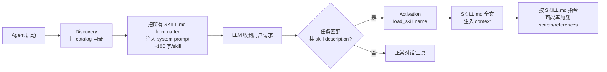

# 1. Bi-Encoder vs Cross-Encoder

## 编码方式

**Bi-Encoder（分开编码）：**
```
Query → Encoder → q_vec ─┐
                           ├→ cosine → score
Chunk → Encoder → d_vec ─┘
```
Query 和 Chunk 各自独立编码成向量，打 cosine 相似度。
Chunk 向量可以**提前全部算好存库**，检索时只算一次 Query 向量，然后做向量近邻搜索——极快。

**Cross-Encoder（拼一起编码）：**
```
[CLS] Query [SEP] Chunk [SEP] → Transformer → score
       ↑               ↑
   query 的每个词都能 attend 到 chunk 的每个词
```
Query 和 Chunk 拼在一起送入 Transformer，两边 token 充分交互，模型能捕捉到
"这个词在 Query 里是什么语境、对应 Chunk 里哪句话回应了它"——精度高，但慢。

## 对比

| | Bi-Encoder | Cross-Encoder |
|--|--|--|
| 速度 | 快（Chunk 向量提前算好） | 慢（每对都要跑一次前向） |
| 精度 | 较低（两边无词级交互） | 高（两边 token 互相 attend） |
| 用途 | **召回**（从海量文档快速捞候选） | **精排**（对少量候选重新打分） |

## 在 RAG 里的分工

```
用户 Query
  ↓
Bi-Encoder 召回  →  top-K × 3 候选（快但粗）
  ↓
Cross-Encoder 精排  →  最终 top-K（慢但准）
  ↓
送给 LLM
```

对全量文档跑 Cross-Encoder 太慢，对少量候选跑则可接受。
**Bi-Encoder 负责"海里捞鱼"，Cross-Encoder 负责"鱼里挑好的"。**


# 2. BGE

## 是什么

**BGE** = **B**AAI **G**eneral **E**mbedding，智源研究院（Beijing Academy of Artificial Intelligence, BAAI）开源的嵌入模型家族。
覆盖两类：

- **Dense embedding**：把文本编码成向量，用于召回（Bi-Encoder 模式）
- **Cross-Encoder reranker**：对 (query, doc) 拼接打分，用于精排

是 MTEB（Massive Text Embedding Benchmark）中英文榜单长期前列的开源 SOTA 之一。

## 模型谱系

| 模型 | 用途 | 维度 / 大小 | 语种 |
|---|---|---|---|
| `bge-small-zh` | Dense embedding | 512 / ~96MB | 中文优化 |
| `bge-small-en` | Dense embedding | 384 / ~33MB | 英文 |
| `bge-base/large-zh-v1.5` | Dense embedding | 768 / 1024 | 中文（更大更准）|
| `bge-m3` | Dense embedding | 1024 / ~568MB | 多语言（推荐生产）|
| `bge-reranker-base` | Cross-Encoder 精排 | ~1.1GB | 中英双语 |
| `bge-reranker-v2-m3` | Cross-Encoder 精排 | 更大 | 多语种最佳 |

## 本项目用到哪些

| .env 配置 | 别名 | 实际模型 |
|---|---|---|
| `EMBEDDING_MODEL=zh` | zh | `BAAI/bge-small-zh` |
| `EMBEDDING_MODEL=m3` | m3 | `BAAI/bge-m3`（默认）|
| `RERANKER_MODEL` | — | `BAAI/bge-reranker-base`（默认）/ `BAAI/bge-reranker-v2-m3`（可选）|

> 英文别名 `en` 走的是 MiniLM（all-MiniLM-L6-v2，微软开源轻量英文 / 多语，384 维 / ~90MB），不是 BGE。

## 易踩坑：非对称 query prefix

BGE 早期版本（v1.0）训练时 query 和 doc 不对称，**query 必须加专属 prefix** 否则相似度对不齐：

```
中文：query 前面加 "为这个句子生成表示以用于检索相关文章："
英文：query 前面加 "Represent this sentence for searching relevant passages: "
doc 端原样不动
```

**v1.5 和 m3 已修复对称性，不再需要 prefix**。本项目在 `src/rag/retriever.py:42-57` 按模型名自动判断是否注入 prefix，调用方无感知。

## 为什么选 BGE

- **本地可跑** · 免费 · 无需 API Key（不像 OpenAI text-embedding-3）
- **中文场景质量 ≥ 商用闭源**（MTEB-zh 长期前列）
- **同一团队覆盖 embedding + reranker**，训练数据 / 分布一致，搭配使用比混搭第三方模型更稳
- **bge-m3 单模型覆盖中英**，省一份库


# 3. CRUD
CRUD = **Create / Read / Update / Delete**，数据存储最基础的 4 个操作，对应 SQL 里就是 `INSERT / SELECT / UPDATE / DELETE`。

说一个东西"只做 CRUD"，意思是它**只管把数据存进去、取出来、改、删**，不参与任何业务判断。

- `ChatHistoryStore` 只做 CRUD → 给我一条 message 我存下来、给我 session_id 我返回最近 N 条，**不关心** "这是不是 skill 触发的轮、要不要保护成对、要不要截断"。
- `HistoryManager` 才管这些"要不要、怎么截"的业务策略，背后调 `ChatHistoryStore` 的 CRUD 拿数据。

# 4. Skills

## 0. 一句话定位

> **agentskills.io（Anthropic Agent Skills）= 一份文件系统级约定**，让 agent 在不爆 context window 的前提下，按需加载"特定任务的 know-how 指令包"。

设计动机：把"所有 agent 能做的事的详细指令"全塞进 system prompt 不可扩展（10 个 skill 就几万 token），所以拆成**目录结构 + 渐进披露**。

## 1. 四个核心机制



| 机制 | 含义 | 关键约束 |
|---|---|---|
| **① Catalog** | 一个根目录（如 `.agenta/skills/`）下放多个 skill 子目录，每 skill 一个独立目录 | 子目录名 = skill 唯一 ID（kebab-case） |
| **② Discovery** | Agent 启动时扫 catalog，**只读 SKILL.md 的 frontmatter**（name + description），汇总成清单注入 system prompt | 清单成本 ≈ 100 字 / skill |
| **③ Progressive Disclosure** | 三级渐进披露，**只在需要时**加载更深层内容 | 见下表 |
| **④ Activation** | LLM 判定当前任务命中某 skill 时，调用 `load_skill(name)`（或等价机制）把 SKILL.md 全文塞进 context | 激活由 LLM 自主决定（也可用户 `/skill-name` 手动） |

### 渐进披露三级

| Level | 加载什么 | 何时 | 典型大小 |
|---|---|---|---|
| **L1** | name + description | 启动时（全 catalog） | ~100 字/skill |
| **L2** | SKILL.md 全文 | LLM 激活时（一次一个） | 几百~几千字 |
| **L3** | SKILL.md 里 reference 的 scripts/ / references/ / assets/ 文件 | SKILL.md 指令里说"需要时再读" | 任意 |

---

## 2. SKILL.md 标准格式

```markdown
---
name: kebab-case-id              # 必填，全 catalog 唯一
description: 一句话讲做什么 + 何时激活。控制在 ~100 字以内。
---

# Human-readable Title

## Purpose
...

## When to use
...

## Instructions
1. 步骤 1
2. 步骤 2
   - 详情可引用 `references/foo.md`
   - 复杂逻辑可调用 `scripts/bar.py`

## Examples
...
```

**关键约定**：
- `description` 决定 LLM 是否激活，**必须写成"做什么 + 何时用"格式**（"激活信号"），不是"这个 skill 是什么"（"自描述"）
- ❌ "本 skill 实现 PDF 解析功能"
- ✅ "Parse PDF files when user uploads or references one. Use this whenever the conversation involves extracting text, tables, or metadata from `.pdf` files."

---

## 3. 一个 Skill 目录的完整结构（官方推荐）

```
.agenta/skills/
└── pdf-extractor/
    ├── SKILL.md              # L2：必有
    ├── scripts/              # L3：可选，按需执行
    │   └── extract.py
    ├── references/           # L3：可选，按需读
    │   └── pdf-spec.md
    └── assets/               # L3：可选，模板/示例数据
        └── template.json
```

- **scripts/**：agent 可在激活后调用（需要 code execution 工具）
- **references/**：agent 按需读取的补充资料（避免塞进 SKILL.md 撑大 L2）
- **assets/**：模板、示例输入、配置文件

---

## 4. 跟 MCP / 普通 tool 的边界

| 维度 | **Skills (agentskills.io)** | **MCP (Model Context Protocol)** | **普通 Tool** |
|---|---|---|---|
| 层级 | **文件系统约定** | **进程级协议** | **agent 内部函数** |
| 形态 | 本地目录里的指令包（markdown + 可选 scripts） | 外部服务暴露 tools / resources / prompts，stdio/SSE 连接 | Python 函数（如 `search_knowledge`） |
| 注入方式 | system prompt（L1 清单）+ context（L2 全文） | tool schema 注入 | tool schema 注入 |
| 解决的问题 | "agent 该**如何使用**某能力" 的 know-how | "agent 能**接入哪些外部**能力" | "agent 当前内置的能力" |
| 谁触发激活 | LLM 自主 / 用户手动 | LLM 调用 tool | LLM 调用 tool |
| 是否爆 context | **不会**（渐进披露） | tool schema 一次性全注入 | tool schema 一次性全注入 |

**关键互补关系**：
- MCP 给外部接口，Skills 给"使用接口的 know-how"
- 一个 skill 可以**指导 LLM 怎么用一组 MCP tool / 普通 tool**（如 `pdf-extractor` skill 可能指导调用 `read_file` + `parse_pdf` MCP tool）
- phase 1.5 范围在 **Skills**（文件级约定），**不涉及 MCP**（那是另一个独立的 phase）

---

## 5. 在 AgentA 里的命名对照

| agentskills.io 术语 | AgentA 当前对应物 | 文件位置 |
|---|---|---|
| Catalog 根目录 | `.agenta/skills/` | 已存在（你之前从 `advanced/skills/` 搬过来） |
| Skill 单元 | `.agenta/skills/<name>/SKILL.md` | 已有一个 `example-skill/SKILL.md` |
| Discovery | `src/cli/skill_loader.py`（推测） | 已存在，待 Review |
| L1 清单注入 | 当前 system prompt 里有没有 skill catalog 段？ | **待 Review** |
| L2 Activation | `AgentAPI.activate_skill(name)` | 已存在（design.md §3 已列出） |
| L3 scripts/references | 当前 SKILL.md 是否引用外部资源？ | **待 Review** |

---


# A.缩写
| 缩写 | 全称 | 含义 |
|---|---|---|
| **KB** | Knowledge Base | 知识库（向量库 + 关键词索引）|
| **RAG** | Retrieval-Augmented Generation | 检索增强生成 |
| **BM25** | Best Matching 25 | 经典关键词检索算法 |
| **RRF** | Reciprocal Rank Fusion | 倒数排名融合（合并多路召回排序）|
| **HyDE** | Hypothetical Document Embeddings | 假设性文档嵌入（让 LLM 先编一段答案再检索）|
| **MRR** | Mean Reciprocal Rank | 平均倒数排名（评估指标）|
| **nDCG** | normalized Discounted Cumulative Gain | 归一化折损累积增益（更细的评估指标）|

