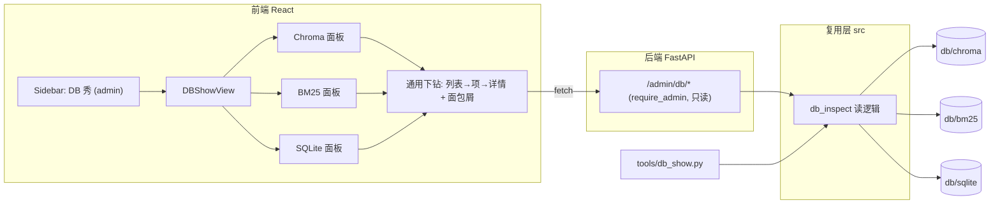
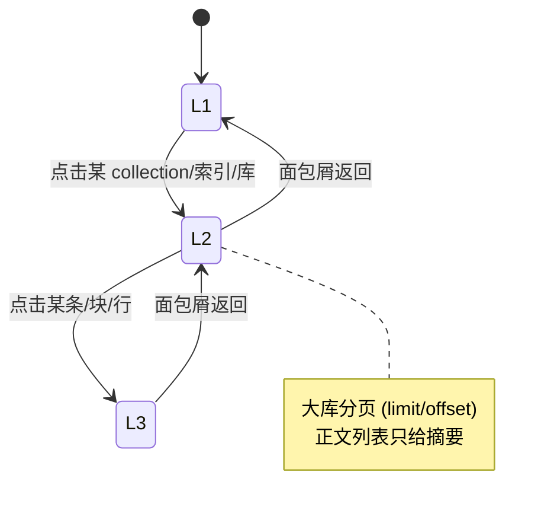

# 1. 背景

运行期数据落在 `db/chroma`、`db/sqlite`、`db/bm25`下，**没有统一的可视入口**，本工具可以查看各数据库结构和内容。

# 2. CLI

## 2.1. 命令和参数

入口：`python tools/db_show.py <子命令> [选项]`；`python tools/db_show.py -h` 打印帮助。

| 子命令 | 选项 | 功能 |
|--------|------|------|
| `summary` | — | 依次输出 Chroma、SQLite、BM25 三段摘要（统计为主，不含 Chroma 正文抽样）。 |
| `chroma` | `--sample N`（默认 `3`；`N=0` 表示仅统计、不抽样） | 列出各 collection 条数；`N>0` 时对每个 collection 抽样 `N` 条 chunk（正文截断 + 主要 metadata）。 |
| `chroma` | `--collection NAME`（可选，与上同行并用） | 只处理名为 `NAME` 的 collection；省略则处理持久化目录下**全部** collection。 |
| `sqlite` | — | 汇总「配置里各 `*_DB_PATH`」与 `db/sqlite/*.db`：每个文件下列表名及各表行数；敏感库不打印密钥类字段。 |
| `bm25` | — | 对每个 `bm25_*.pkl` 输出一条摘要（能加载则多报规模信息，失败则报原因 + 文件信息）。 |

## 2.2. 用法示例

```bash
python tools/db_show.py -h                              # 帮助
python tools/db_show.py summary                         # 三段统计摘要
python tools/db_show.py chroma                          # 各 collection 条数 + 默认抽样 3 条
python tools/db_show.py chroma --sample 0               # 仅统计，不抽样
python tools/db_show.py chroma --collection kb_zh       # 只看指定 collection
python tools/db_show.py sqlite                          # 各 .db 表名与行数
python tools/db_show.py bm25                            # 各 bm25_*.pkl 规模
```


## 2.3. 输出说明：各 SQLite 库的含义

`summary` / `sqlite` 会逐个列出「配置里各 `*_DB_PATH` + `db/sqlite/*.db`」每个文件下的表名与行数（只统计行数、不展开字段值，所以 `auth.db` 等敏感库不打印密钥 / 密码）。各库内容对照如下：

| 配置项 | 文件 | 主要表 | 装什么 |
|---|---|---|---|
| `MEMORY_DB_PATH` | `chat_history.db` | `sessions` / `messages` | 对话会话与逐条消息历史 |
| `AUTH_DB_PATH` | `auth.db` | `users` / `auth_sessions` / `user_settings` / `user_rules` | 用户账号、登录会话、个人设置、自定义规则 |
| `USAGE_DB_PATH` | `usage.db` | `usage_events` / `model_pricing` / `saving_events` / `cache_lookups` / `agent_traces` / `trace_spans` / `security_events` | 用量计费、模型价格、省钱事件、缓存命中、Agent 调用链路 trace、安全事件 |
| `RAG_GOLDEN_DB_PATH` | `rag_golden.db` | `rag_golden` | RAG 评估的 golden 问答集 |
| `USER_MEMORY_DB_PATH` | `user_memory.db` | `user_memories` | 跨会话的长期用户记忆 |
| `LEARNING_PLAN_DB_PATH` | `learning.db` | `learning_plans` / `learning_tasks` | 学习计划及其下属任务 |
| `QUIZ_DB_PATH` | `quiz.db` | `quiz_sets` / `quiz_questions` | 测验集与题目 |
| `SRS_DB_PATH` | `srs.db` | `srs_cards` | 间隔重复记忆（SRS, Spaced Repetition System）卡片 |

# 3. Web UI

把 CLI 的只读巡检能力搬到 Web 上：新增一页「DB 秀」，让管理员不进终端也能逐层查看 Chroma / BM25 / SQLite 的结构与内容。

## 3.1. 需求

- **功能**：新增「DB 秀」页，左侧分三类（Chroma / BM25 / SQLite），每类支持**逐层下钻**——从「列表」到「某一项」再到「单条详情」，看到结构与具体内容。
- **目标**：不开终端、不写 SQL，就能巡检三类后台数据；与 `tools/db_show.py` **同源**（共用后端读逻辑，口径一致）。
- **价值**：排查"数据是否合理"（如本期发现的 kb_m3 向量段异常、dense/BM25 条数不一致）时有可视入口，降低运维门槛。
- **风险**：暴露后台数据 → 必须**仅管理员可见 + 全程只读 + 敏感字段不外泄**；大库需分页，避免一次拉全量拖垮前后端。
- **现状**：CLI（§2）已完成且可复用；前端已有 admin-only 页（Skills / MCP）与多层视图范式可参照；后端 `db_show.py` 的读逻辑目前是脚本内函数，需抽成可被 API 复用的模块。

三类的「三层下钻」对应关系：

| 层级 | Chroma | BM25 | SQLite |
|------|--------|------|--------|
| L1 列表 | 全部 collection（名称 / 条数 / 向量维度 / 距离空间） | 全部 `bm25_*.pkl`（文件 / 文档块数 / 字节 / k1·b） | 全部库（配置项 / 文件 / 表数） |
| L2 某一项 | 某 collection 的条目列表（id + 正文摘要，分页） | 某索引的文档块列表（id + 正文摘要，分页） | 某库的表列表（表名 / 行数）→ 表数据（分页） |
| L3 单条详情 | 单条：正文全文 + 全部 metadata | 单块：正文全文 + metadata + tokens 规模 | 单行：各列值（敏感库/字段脱敏或隐藏） |

## 3.2. 总体框架



要点：把 `db_show.py` 的读逻辑抽到一个**公共模块**（暂名 `db_inspect`），CLI 与 API 都调它，避免两套实现、口径漂移。

## 3.3. 页面交互（下钻 + 面包屑）



## 3.4. 后端接口（初稿，待 §3.6 决策后定稿）

| 方法 | 路径 | 作用 |
|------|------|------|
| GET | `/admin/db/chroma/collections` | L1：collection 列表（名称/条数/维度/空间） |
| GET | `/admin/db/chroma/{name}/items?limit&offset` | L2：条目分页（id + 正文摘要） |
| GET | `/admin/db/chroma/{name}/items/{id}` | L3：单条全文 + metadata |
| GET | `/admin/db/bm25/indexes` | L1：索引文件列表 |
| GET | `/admin/db/bm25/{collection}/docs?limit&offset` | L2：文档块分页 |
| GET | `/admin/db/bm25/{collection}/docs/{id}` | L3：单块详情 |
| GET | `/admin/db/sqlite/databases` | L1：库 + 表清单（含行数） |
| GET | `/admin/db/sqlite/{db_key}/{table}?limit&offset` | L2/L3：表数据分页（脱敏后） |

约束：全部 `require_admin`、只读（仅 GET）；Chroma 不取 embeddings（沿用 §2 修复，避免 kb_m3 那类向量段异常拖垮）；SQLite 不返回密钥类列。

## 3.5. 可观测性与验证

- 前端：本地 `./i start` 后用 admin 账号进「DB 秀」，逐类点到 L3。
- 后端：接口可独立用 `pytest tests/api/test_api_*.py` 覆盖（mock 读逻辑，不依赖真实大库）。

## 3.6. 决策结论

| 决策点 | 结论 |
|--------|------|
| 权限范围 | **仅管理员可见**（与 Skills/MCP 一致；后端 `require_admin`） |
| 后端读逻辑 | **抽公共模块 `db_inspect`**，CLI（§2）与 API 共用，口径一致、不重复实现 |
| SQLite 第三层 | **展示行级数据，但敏感库/字段脱敏或隐藏**（如 `auth.db` 不返回密码/密钥列） |
| 本期范围 | **纯浏览下钻**（L1→L2→L3 + 分页 + 面包屑）；搜索/过滤留待后续迭代 |

## 3.7. 实现与验收

落点（按设计的复用层 → 后端 → 前端）：

| 模块 | 文件 | 说明 |
|------|------|------|
| 复用读逻辑 | `src/db_inspect.py`（新） | Chroma/BM25/SQLite 只读 + 分页 + 脱敏；CLI 与 API 共用 |
| 后端路由 | `src/api/routes/db_admin.py`（新）+ `src/api/main.py` 注册 | `/api/admin/db/*`，全部 GET、`require_admin` |
| CLI | `tools/db_show.py` | 改为委托 `db_inspect`，输出口径不变 |
| 前端类型/接口 | `frontend/src/types/dbAdmin.ts`、`api/client.ts` | DB 秀响应类型与 8 个 GET 封装 |
| 前端页面 | `frontend/src/components/admin/DBShowView.tsx` + `Sidebar.tsx` + `App.tsx` | 三类面板 + 三层下钻 + 面包屑 + 分页；admin-only 入口 |
| 测试 | `tests/test_db_inspect.py`、`tests/api/test_api_db_admin.py`、`tests/tools/test_db_show.py` | 读逻辑/HTTP 封装/CLI 共 21 项 |

安全：所有端点 `require_admin` + 仅 GET；Chroma 抽样/详情不取 embeddings（避开坏向量段）；SQLite 表名先按 `sqlite_master` 白名单校验再用、`limit/offset` 走绑定参数、敏感列（口令/密钥/hash 等）值替换为 `***`。

已知注意：BM25 列表（L1）会完整加载各 `bm25_*.pkl` 才能报块数，大库（如 `kb_en` 约 8 MB）首屏会有数秒延迟；属可接受的巡检成本，后续可按需优化为只读规模。

人工测试方案（本地 `./i start`，admin 登录）：

| 步骤 | 操作 | 验收标准 |
|------|------|----------|
| 1 | 侧栏出现「DB 秀」（仅 admin） | 非 admin 看不到该入口 |
| 2 | Chroma → 点 `kb_zh` → 点某条 | 列表显示条数/维度；详情显示正文全文 + metadata |
| 3 | Chroma 选 `kb_m3` | 列表维度显示「—」不报错（坏向量段降级），仍可浏览条目 |
| 4 | BM25 → 点某索引 → 点某块 | 显示块数/k1/b；详情有正文 + tokens 数 |
| 5 | SQLite → `auth.db` → `users` 表 | 行数据可见，`password_hash` 等列显示 `***`，并提示「已脱敏列」 |
| 6 | 任一列表翻页 | 上一页/下一页与 `from–to / total` 正确 |
| 7 | 面包屑点中间层 | 正确回退到上一层 |
| 8 | `pytest tests/tools/test_db_show.py tests/test_db_inspect.py tests/api/test_api_db_admin.py -q` | 21 项全过 |

# 4. UI 工具升级（入库时间 / 过滤 / 排序）

在 DB 秀（§3）的 L2 列表上做增量，**只针对 Chroma 与 BM25**（两者结构一致、共享 metadata）；SQLite 不在本期。**维持只读**——不加删除。

## 4.1. 范围决策

| 维度 | 结论 |
|------|------|
| 入库时间 | L2 行加「入库时间」徽章，取 `ingested_at`；**无则显示 `-`**（不回落 `mtime`）。旧数据（早期入库的 `kb_en`/`kb_zh`）无该字段，会显示 `-` |
| 过滤 | 文件名模糊 + 正文模糊 + 入库时间段（三者可组合） |
| 排序 | 文件名 / 入库时间，升降序 |
| 删除 | **不做**，保持只读；删除走现有领域功能（知识库文档删除 / 会话 / 记忆 等已有入口） |

## 4.2. 实现方式与性能护栏

- **BM25**：索引本就整份载入内存，过滤 / 排序全在内存做（纯函数 `filter_sort_rows`）。
- **Chroma**：正文模糊走服务端 `where_document $contains`、入库时间段走服务端 `where ingested_at` 范围（数值范围用 `$and` 拆两个单操作符子句）；服务端预过滤后取回 **≤ `CHROMA_SCAN_CAP`（20000）** 候选，再在内存做文件名模糊 + 排序 + 分页。候选触顶返回 `truncated=true`，UI 提示「结果基于前 N 条」。
- 排序 / 文件名过滤的内存逻辑两库共用 `filter_sort_rows`。

接口改动（均新增 query 参数，仍 `require_admin` + 只读）：

| 端点 | 新增参数 |
|------|----------|
| `GET /admin/db/chroma/{name}/items` | `filename_q` / `body_q` / `ts_from` / `ts_to` / `sort_by`(`filename`\|`ingested_at`) / `desc` |
| `GET /admin/db/bm25/{collection}/docs` | 同上 |

## 4.3. UI（用户视角）

- L2 列表上方过滤条：`文件名 [包含…]　正文 [包含…]　入库 [日期]–[日期]　[查询][清除]`，下一行 `排序 [字段▾] [↑/↓]`。
- 每行右侧徽章含「入库 2026-06-13 21:02」（无则「入库 -」）。
- 切换过滤 / 排序回到第 1 页；过滤后 `total` 为过滤后条数。

## 4.4. 约束

- 全程只读 + `require_admin`。
- Chroma 时间段过滤靠 `ingested_at`，无该字段的旧数据会被排除（已确认可接受）。
- 坏向量段（历史 `kb_m3`）不取 embeddings，过滤 / 列表读不到就跳过、不报错。