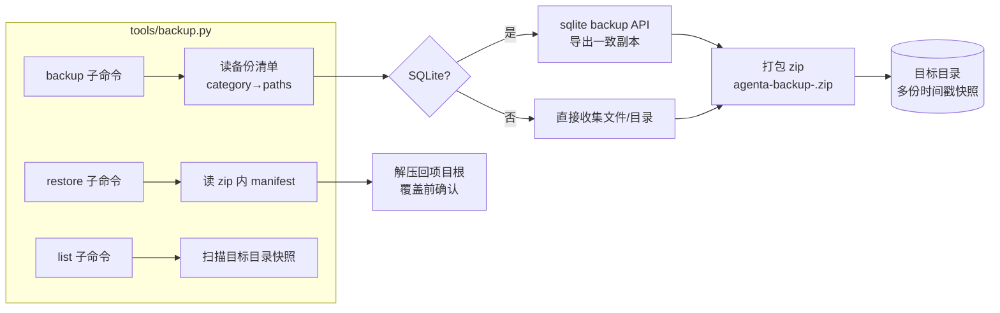

# 1. 目的：
1. 该入库的入库，不该入库的不入库
2. 运行时有用数据可备份，在多台电脑上重复适用
3. 实现一个工具，备份运行时数据到指定目录

# 2. 入库现状review
确保符合 “该入库的入库，不该入库的不入库”

## 2.1. 检查方法
- `git ls-files -ci --exclude-standard`：查"被忽略却仍被跟踪"的文件
- `git status --ignored`：查工作区被忽略的内容
- `git check-ignore -v <path>`：定位某文件被哪条规则忽略
- `git ls-files` 扫描已跟踪的 `.json` / `.log` / `.db`：查"误入库的运行时数据"

## 2.2. 结论
总体符合"该入库的入库，不该入库的不入库"。发现 **1 个问题**：`tools/agent_eval/reports/.gitkeep` 的白名单失效，目录实际未入库（详见 §2.4）。

## 2.3. 符合项（无需改动）

| 类别 | 内容 | 状态 |
|---|---|---|
| 被忽略却被跟踪 | `git ls-files -ci` 结果为空 | ✅ 无 |
| 敏感配置正确忽略 | `.env`、`.agenta/api_keys.json`、`config_overrides.json`、`routing_pool.json`、`skills/disabled.json`、`mcp/disabled.json` | ✅ |
| 运行时数据正确忽略 | `db/`、`sqlite_db/`、`history/`、`logs/`、`.run/`、`chroma_db/`、`bm25_index/` | ✅ |
| cache 正确忽略 | `__pycache__/`、`.pytest_cache/`、`.mypy_cache/`、`.ruff_cache/`、`.venv/` | ✅ |
| 私有数据正确忽略 | `datasets/*`，仅白名单 `data_en/test/test_sample.*` 入库 | ✅ |
| 报告产物正确忽略 | `reports/`（覆盖 `tools/rag_eval/reports` 与 `tools/agent_eval/reports`）、`tools/rag_eval/golden.json` | ✅ |
| 共享模板正确入库 | `.env.example`、`.agenta/mcp/config.json`、`.agenta/rules.md`、`.agenta/skills/*/SKILL.md`、各 `tools/agent_eval/*/dataset.json`、`tools/rag_eval/golden.example.json` | ✅ |
| 前端忽略 | `frontend/.gitignore` 覆盖 `node_modules`/`dist`，根 `.gitignore` 兜底 | ✅ |

## 2.4. 问题项与修复

| 级别 | 问题 | 原因 | 影响 | 修法 |
|---|---|---|---|---|
| P3（一致性） | `tools/agent_eval/reports/.gitkeep` 白名单失效，目录实际未入库 | `.gitignore` 的 `reports/` 把整个 `tools/agent_eval/reports/` 目录忽略；git 规则下父目录被整目录忽略后，`!.../reports/.gitkeep` 无法恢复子文件（`git check-ignore` 证实命中的是 `reports/`） | **功能无影响**：所有写报告的脚本（`perf_eval` / `run_all` / `recall_golden` / 各 `eval_*` / `recall_skill` 等）落盘前都调 `mkdir(parents=True, exist_ok=True)`，目录会自建、报告不会写失败。仅**一致性问题**：与 gitignore 注释"保留目录本身"不符，且易误导后人以为 `.gitkeep` 在库里 | 已修：删除失效的 `tools/agent_eval/reports/*` + `!.../.gitkeep` 两行白名单（`reports/` 已覆盖该目录），并更新注释说明"脚本自建目录、无需 .gitkeep 占位"。磁盘上残留的 `.gitkeep` 保持被忽略，无害 |

# 3. 运行时数据列表
扫描AgentA 项目，把**所有**不入 git 库的文件，如运行时产生的文件（db 和 配置信息等) 、cache （如__pycache__, .pytest_cache等) ，按类整理，并记录到本节。

分析哪些数据是需要备份，重用的。

## 3.1. 扫描方法
- `git status --ignored --short`：列出工作区所有被忽略的条目（目录会折叠）
- 对 `db/` `.agenta/` `datasets/` 等数据目录递归 `Get-ChildItem` 看真实文件与体积
- 对照 `src/config.py` 的默认路径，确认每类数据的语义与来源

## 3.2. 按类清单
体积为本机当前快照，仅供参考。"可再生"指能否从已入库内容（代码 / datasets）或外部重新生成。

### A. 敏感配置（不可再生，含密钥）
| 路径 | 体积 | 说明 |
|---|---|---|
| `.env` | ~22KB | API Keys + 全部运行配置，换机必需 |
| `.agenta/config_overrides.json` | <1KB | 配置 UI 的本地 override |
| `.agenta/routing_pool.json` | <1KB | 模型路由池 |
| `.agenta/api_keys.json` | （当前无） | admin 在 UI 配的明文密钥，生成后属此类 |
| `.agenta/skills/disabled.json`、`.agenta/mcp/disabled.json` | ~0 | skills/MCP 禁用列表，个人偏好 |

### B. 运行期数据库（不可再生，用户数据）
| 路径 | 体积 | 说明 |
|---|---|---|
| `db/sqlite/auth.db` | 44KB | 账号 / 鉴权 |
| `db/sqlite/chat_history.db` | ~1MB | 对话历史 |
| `db/sqlite/user_memory.db` | 16KB | 用户长期记忆 |
| `db/sqlite/learning.db`、`quiz.db`、`srs.db` | 各 ~30KB | 学习计划 / 测验 / SRS 复习 |
| `db/sqlite/usage.db` | 116KB | 用量统计 |
| `db/sqlite/rag_golden.db` | 48KB | RAG 黄金集（DB 形态） |

### C. 向量库 / 检索索引（可再生，体积大）
| 路径 | 体积 | 说明 |
|---|---|---|
| `db/chroma/`（含 `chroma.sqlite3` + 各 collection bin） | ~85MB | 向量库，可由 `datasets/` 重新 ingest |
| `db/bm25/*.pkl` | ~11MB | BM25 倒排索引，可重建 |
| `db/chroma/ingest_history.json` | <1KB | 已 ingest 记录，配合重建 |

### D. 私有知识库源文件（不可再生，原始数据）
| 路径 | 体积 | 说明 |
|---|---|---|
| `datasets/data_en/{5g,ai,other}/` | ~5.6MB | 英文知识源（docx/xlsx/pdf/pptx/html） |
| `datasets/data_zh/` | ~66KB | 中文知识源 |
| `datasets/web_uploads/` | ~5.4MB | UI 上传的原始文件（含少量测试垃圾如 `x..txt`/`y..txt`） |
| （`datasets/data_en/test/test_sample.*` 已白名单入库，不在此列） | — | — |

### E. 自定义评估黄金集（不可再生，人工标注）
| 路径 | 体积 | 说明 |
|---|---|---|
| `tools/rag_eval/golden.json` | ~27KB | 人工标注的 RAG 黄金集 |

### F. 评估报告（可再生，历史快照）
| 路径 | 体积 | 说明 |
|---|---|---|
| `tools/agent_eval/reports/*.md`、`*.json` | ~50KB | 各 eval 自动落盘的报告（红线：禁止批量删） |
| `tools/rag_eval/reports/*.md`、`*.md.log` | ~0.7MB | RAG eval 报告 + 运行日志 |

### G. 笔记 / 历史导出（不可再生，个人产出）
| 路径 | 体积 | 说明 |
|---|---|---|
| `history/{5g.md,howto_job.md,pdcch.txt}` | ~11KB | 个人笔记 / 历史导出 |

### H. 缓存 / 依赖 / 构建产物（可再生，无需备份）
| 路径 | 说明 |
|---|---|
| `.venv/` | 由 `requirements.txt` 重建 |
| `frontend/node_modules/`、`frontend/dist/`、`frontend/.vite/` | 由 `package.json` 重建 |
| `__pycache__/`、`.pytest_cache/`、`.mypy_cache/`、`.ruff_cache/` | 运行 / 测试自动生成 |
| `build/`、`dist/`、`*.egg-info/` | 构建产物 |

### I. 运行时临时（可再生，无需备份）
| 路径 | 说明 |
|---|---|
| `logs/*`（uvicorn / vite 日志） | 运行日志 |
| `.run/*.pid`、`*.cmd` | 进程 PID + 启动包装器 |

### J. 工具二进制（可重新下载）
| 路径 | 体积 | 说明 |
|---|---|---|
| `tools/bin/cloudflared.exe` | ~51MB | 隧道工具，可官网重下 |

### K. 编辑器 / IDE（个人，可选）
| 路径 | 说明 |
|---|---|
| `.vscode/settings.json`、`AgentA.code-workspace`、`AgentA-Cursor.code-workspace` | 个人编辑器配置 |

### L. 旧路径遗留（待确认）
| 路径 | 体积 | 说明 |
|---|---|---|
| `sqlite_db/{chat_history.db,srs.db}` | ~48KB | 旧默认路径遗留；现默认已迁到 `db/sqlite/`。疑似废弃数据，是否还需保留待确认 |

## 3.3. 备份取舍结论

**最终选择：备份 A B C E F K，排除 D G H I J L。**

| 选择 | 类别 | 说明 |
|---|---|---|
| ✅ 备份 | A 敏感配置 | `.env` + `.agenta/*.json`（含暂未生成的 `api_keys.json`） |
| ✅ 备份 | B 运行期数据库 | `db/sqlite/*.db` 全部 |
| ✅ 备份 | C 向量库 / BM25 索引 | `db/chroma/` + `db/bm25/`（体积大，但 D 不备份，索引即唯一可重用副本） |
| ✅ 备份 | E 黄金集 | `tools/rag_eval/golden.json` |
| ✅ 备份 | F 评估报告 | `tools/agent_eval/reports/`、`tools/rag_eval/reports/` |
| ✅ 备份 | K 编辑器 / IDE | `.vscode/settings.json`、`*.code-workspace` |
| ❌ 排除 | D 知识库源文件 | 另行管理，不进本工具 |
| ❌ 排除 | G 笔记 / 历史导出 | 不纳入 |
| ❌ 排除 | H 缓存/依赖/构建、I 运行时临时 | 可再生 / 无价值 |
| ❌ 排除 | J 工具二进制 `tools/bin/cloudflared.exe` | 可官网重下，不纳入 |
| ❌ 排除 | L 旧路径遗留 `sqlite_db/` | 视为废弃，不备份 |

# 4. 运行时数据备份工具
创建一个工具，备份运行时可重用数据到指定目录。

## 4.1. 需求（初稿）
- **功能**：一条命令把 §3.3 选定的七类（A B C E F J K）运行时数据备份到指定目录；并支持从备份目录还原回项目，用于换机 / 重装后快速恢复。
- **目标**：免去手工逐个拷贝、避免遗漏敏感配置和数据库；在多台电脑上重复适用。
- **价值**：换机即恢复运行环境（密钥 / 用户数据 / 向量库 / 报告 / 工具 / 编辑器配置）。
- **风险**：备份包含明文密钥（`.env`、`.agenta/api_keys.json`），产物需用户自行妥善保管；服务运行中直接拷 SQLite 可能拷到不一致状态。
- **现状**：无备份工具；可参考 `tools/db_show.py` 的 CLI 风格与路径约定（`src/config.py` 提供各数据默认路径）。

### 4.1.1. 决策记录
| 决策点 | 选择 |
|---|---|
| 产物形式 | 单个带时间戳的 zip 包 |
| 功能范围 | 备份 + 还原 双向 |
| SQLite 一致性 | 用 `sqlite3` backup API 做在线一致备份（服务运行中也安全） |
| 目标目录 / 快照 | CLI 参数指定目录，每次新建带时间戳快照、保留多份 |

## 4.2. 设计（初稿）
本节描述备份 / 还原工具的总体框架、备份清单、产物结构与接口。

### 4.2.1. 总体框架

### 4.2.2. 备份清单（category → 路径）
路径优先从 `src/config.py` 读取（B/C 受 `.env` 影响），其余按项目根相对路径硬编码；不存在的条目静默跳过并计数。

| 类别 | 来源 | 路径 | 收集方式 |
|---|---|---|---|
| A 敏感配置 | 硬编码 | `.env`、`.agenta/config_overrides.json`、`.agenta/routing_pool.json`、`.agenta/api_keys.json`、`.agenta/skills/disabled.json`、`.agenta/mcp/disabled.json` | 文件拷贝 |
| B 运行期 DB | `config.py` | 8 个 `*_DB_PATH`（auth/chat_history/usage/rag_golden/user_memory/learning/quiz/srs） | sqlite backup API |
| C 向量库/索引 | `config.py` | `CHROMA_DB_PATH`、`BM25_INDEX_DIR` | 目录树拷贝 |
| E 黄金集 | 硬编码 | `tools/rag_eval/golden.json` | 文件拷贝 |
| F 评估报告 | 硬编码 | `tools/agent_eval/reports/`、`tools/rag_eval/reports/` | 目录树拷贝 |
| K 编辑器/IDE | 硬编码 | `.vscode/settings.json`、`*.code-workspace`（项目根） | 文件拷贝 |

### 4.2.3. 产物结构
- 文件名：`agenta-backup-<YYYYMMDD-HHMMSS>.zip`，落在 CLI 指定目录下。
- zip 内按**项目根相对路径**存放（还原时可直接解压回根）。
- zip 内附 `backup-manifest.json`：记录时间戳、各类别命中的文件清单、是否含向量库、工具版本，供 restore / list 读取与展示。

### 4.2.4. 接口（CLI）
| 命令 | 作用 | 关键参数 |
|---|---|---|
| `backup` | 收集七类数据打成 zip | `--out <dir>`（必填，快照落此）、`--skip-vectors`（可选，跳过 C 类大文件） |
| `restore` | 从 zip 解压回项目根 | `--zip <path>`（必填）、`--force`（跳过覆盖确认） |
| `list` | 列出目标目录下的快照及其 manifest 摘要 | `--out <dir>` |

### 4.2.5. 影响面与可观测性
- **不动** DB schema、API、配置项；纯新增 `tools/backup.py` + UT，对现有功能零影响。
- **破坏性**：`restore` 会覆盖 `.env` / `db/` 等现有文件 —— 默认交互确认，`--force` 才静默覆盖。
- **敏感**：产物含明文密钥，工具运行结束打印一行提醒"妥善保管，勿入 git / 公共网盘"。
- **可观测**：backup / restore 逐类打印命中文件数与体积，结尾打印 zip 路径 + 总大小。
- **验证**：UT 用临时目录构造假数据，跑 backup→restore 往返，断言文件一致 + manifest 正确；SQLite 在线备份用临时 db 验证可读。

### 4.2.6. 实现步骤
1. 新建 `tools/backup.py`：argparse 三子命令 + `load_dotenv(override=True)` + 项目根 sys.path（仿 `db_show.py`）。
2. 实现备份清单解析（从 `config.py` 取 B/C 路径，其余硬编码）。
3. 实现 `backup`：SQLite 在线备份到临时副本 → 连同其余文件按相对路径写入 zip + manifest。
4. 实现 `restore`：读 manifest → 确认 → 解压回根。
5. 实现 `list`：扫描目录、读各 zip 的 manifest 摘要。
6. 新增 UT `tests/tools/test_backup.py`：往返一致性 + 跳过不存在项 + SQLite 在线备份。
7. 自测 + 撰写人工测试方案并验收。

## 4.3. 实现与验收

### 4.3.1. 落地清单
| 文件 | 内容 |
|---|---|
| `tools/backup.py` | CLI（`backup` / `restore` / `list`）+ 清单构建 + SQLite 在线备份 + zip 打包 / 还原 |
| `tests/tools/test_backup.py` | 5 个 UT：help、`--skip-vectors` 去 C、往返一致、list 摘要、空目录 |

实现说明：清单构建 / 备份 / 还原 / 列表均为可独立调用的纯函数（CLI 只接线），UT 用临时根 + 假 config 做往返，不碰真实数据；B/C 路径从 `src/config.py` 读，A/E/F/K 硬编码相对路径；不存在的条目静默跳过。

### 4.3.2. 自测结果
- `pytest tests/tools -q`：10 passed（含本工具 5 个）。
- 真机 `backup --skip-vectors`：A 5 / B 8 / E 1 / F 49 / K 3 个文件，zip ~458KB，正常生成。
- `list`：正确列出快照（时间戳 / 文件数 / 大小 / 是否含向量库）。
- `restore` 输入 `n`：正确取消、不覆盖任何文件。

### 4.3.3. 人工测试方案
默认在主项目目录跑；备份目标用一个临时目录（如 `D:\agenta_bak`），还原**务必在隔离副本**里验证，避免覆盖正在用的数据。

| 用例 | 操作步骤 | 验收标准 |
|---|---|---|
| 全量备份 | `python tools/backup.py backup --out D:\agenta_bak` | 生成 `agenta-backup-<ts>.zip`；打印 A/B/C/E/F/K 各类文件数与体积；含 C 时体积约 100MB+ |
| 跳过向量库 | `python tools/backup.py backup --out D:\agenta_bak --skip-vectors` | 产物明显变小；摘要无 C 类；提示"已跳过 C 向量库" |
| 列表 | `python tools/backup.py list --out D:\agenta_bak` | 按时间倒序列出全部快照，标注是否含向量库 |
| 服务运行中备份 | 启动后端后再跑 backup | 成功生成，无 DB 锁错误（验证 sqlite 在线备份） |
| 还原（隔离） | 把仓库 clone / 拷到新目录，在其中 `python tools/backup.py restore --zip <上面的 zip>`，输入 `y` | `.env`、`db/sqlite/*.db`、报告、`.vscode/settings.json` 等按原相对路径还原；启动后端能读到原有账号 / 对话 / 记忆 |
| 还原确认拦截 | 同上但输入 `n` | 打印"已取消"，不写任何文件 |
| 强制还原 | `restore --zip <zip> --force` | 跳过确认直接还原 |
| 敏感提醒 | 任意一次 backup 结束 | 打印"备份含明文密钥，请妥善保管"提醒 |
