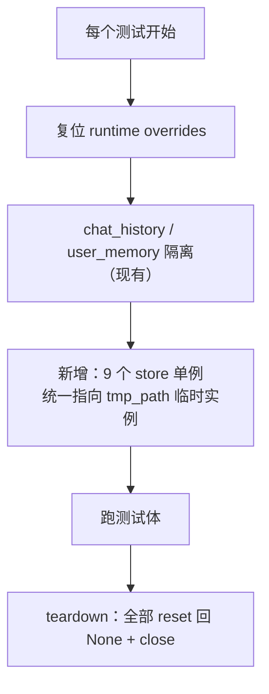

# iter_15 UT 精简与重构

## 1. 需求

对 AgentA 现有 80 个测试文件、1720 个 UT case 做一次体检 + 精简 + 结构治理。分两部分：

### 1.1. 精简（省测试资源）

把「无用 / 重复 / 平时根本不跑」的 case 优化掉，同时保住 UT 对工程质量的保护力。

- **价值**：UT 堆到 1500+，collection 阶段 65s（被 langchain import 拖慢）、默认套件跑一遍 ~125-150s。精简后更快、改代码心智负担更低。
- **风险**：删测试 = 删保护。删的都是别人写的代码，已由用户逐类决策授权（见 §4）。

### 1.2. 新增需求

| 编号 | 需求 | 说明 |
|---|---|---|
| **需求0** | 修复部分 db 测试没隔离的漏洞 | 见 §3 根因分析 + §5.1 方案 |
| **需求1** | UT 文件按目录存放 | 对齐 src 目录结构，深度最多 2 级。见 §5.3 |
| **需求2** | 增加 UT 测试专用配置 | 如 UT 跑真实 LLM 时用哪个模型。见 §5.2 |

---

## 2. 现状盘点

### 2.1. 总量

| 指标 | 数值 |
|---|---|
| 测试文件 | 80 个 |
| 总 case（含 deselect） | 1720 |
| 默认套件实跑（`pytest -q`） | 1587 passed，~125-150s |
| 默认 deselect（平时不跑） | 133 |
| collection 阶段耗时 | ~65s（异常高，主因 langchain import） |

### 2.2. 平时不跑的 case（按 marker）

| marker | 数量 | 落在哪 | 性质 |
|---|---|---|---|
| `autogpt` | 63 | 整个 `test_autogpt_agent.py` | AutoGPT 备用实现（非默认） |
| `langchain` | 29 | 整个 `test_langchain_agent.py` | LangChain 备用实现（非默认） |
| `integration` | 27 | 散落 `test_llm/test_agent/test_rag/test_tools/test_autogpt` | 真实 API / 网络 / ChromaDB |
| `extended_providers` | 17 | `test_llm.py` 参数化 | kimi/qwen 以外 6 个 provider |

### 2.3. 跑得最慢的 case

| 耗时 | case | 原因 |
|---|---|---|
| 12.3+12.2+3.0s | `test_api_kb.py` 三个 upload | 真实文件入库（embedding/ChromaDB） |
| 8.2s | `test_api_chat.py::test_chat_missing_message_returns_422` | 仅测 422 却付 app 启动开销 |
| 4.3/2.7/2.4s | `test_parser.py` xlsx/pptx/docx | 真实解析 Office 文件 |
| 2.0+0.5s | `test_mcp_manager.py` 两个 timeout | 真实 sleep 等超时 |

---

## 3. db 隔离漏洞根因（需求0）

### 3.1. 现状

`tests/conftest.py` 的全局 autouse 隔离只覆盖 **3 样**：chat_history（换临时 DB）、user_memory（设 None + 关开关）、语义缓存（关开关）。

但 AgentA 有 **11 个**带进程级单例 `get_shared_store()` 的 store，默认路径都指向真实 `./sqlite_db/*.db`：

| store 模块 | 默认 DB | reset 函数 |
|---|---|---|
| `chat_history` | chat_history.db | conftest 已兜 ✓ |
| `user_memory` | user_memory.db | conftest 已兜 ✓ |
| `learning_plan_store` | learning.db | `reset_shared_store_for_testing` |
| `quiz_store` | quiz.db | 同上 |
| `srs_store` | srs.db | 同上 |
| `usage_store` | usage.db | 同上 |
| `golden_store` | rag_golden.db | 同上 |
| `trace_store` | usage.db | 同上 |
| `security_event_store` | usage.db | 同上 |
| `user_store` | auth.db | 同上 |
| `semantic_cache` | ChromaDB | 同上（仅关 enabled） |

### 3.2. 漏洞

后 9 个 store **没有全局兜底**，靠各测试文件自觉 reset / `dependency_overrides` / 自构造临时实例。已核查：store 单测、tool 测、API 测都各自做了隔离，**冷库实证（learning/quiz/srs/user_memory）跑完全量测试 mtime 未变**。

但存在**只读泄漏**：`Agent.run()` 在 `src/agent/agent.py:270` 每轮都调 `build_active_study_plan_block(sid)` → learning_plan `get_shared_store()` → 打开**真实 learning.db**。凡是跑 `agent.run`/相关流程又没 reset learning_plan 单例的测试（如 `test_agent.py`），都会连真实库（只读，故 mtime 不变、不易察觉）。

**本质问题**：隔离逻辑分散在各文件、靠自觉，新测试一旦忘记就静默污染/读取真实库，且不报错。

---

## 4. 精简决策（已确认）

| 类别 | 范围 | **决策** |
|---|---|---|
| **A** | langchain 29 + autogpt 63 备用实现测试 | 代码不动，移到**不被 pytest 扫描**的目录，减少 collection 时间；`pytest.ini` 加备注，需要时手动纳入 |
| **B** | integration 27 真实外部调用 | **只留连通性/功能性测试**；LLM 回答长短/质量之类的断言**全删** |
| **C** | extended_providers 17 provider 配置 | **收敛为只针对 UT 专用配置（需求2）的测试** |
| **D** | 套件内垂直重复 ~30-50 | 做去重优化（下游层只留集成冒烟，详尽断言留底层） |
| **E** | 慢 case | 建新 marker **`slow`，默认不跑**；慢 case 打 `slow` |

---

## 5. 设计

### 5.1. 需求0：conftest 全局 store 隔离兜底

在 `tests/conftest.py` 现有 autouse fixture 里**扩展**：把上述 9 个未兜底 store 的进程级单例，统一 reset 为指向 `tmp_path` 的临时实例；测试结束 reset 回 None。

- **要点**：store 模块在 import 时已把 `config.XXX_DB_PATH` 读成模块级常量，改 config 无效；必须 reset 单例为「传入 tmp 路径的新实例」。
- **兜底语义**：各测试文件原有的文件内 reset / `dependency_overrides` 保持不变（它们在测试体内覆盖全局兜底，互不冲突）。全局兜底只负责「没人管的测试不碰真实库」。
- **收益**：任何新测试即便忘了隔离，也默认落到临时库，不再静默读写真实 `sqlite_db/`。

### 5.2. 需求2：UT 专用配置

新增配置项，让需要真实 LLM 的测试（integration）用指定模型，不动用生产默认 `ACTIVE_MODEL`。

| 配置项 | 默认 | 语义 |
|---|---|---|
| `UT_LLM_MODEL` | 空 | UT 跑真实 LLM 时用的 model id；空则回落 `ACTIVE_MODEL` |

- **生效方式**：`conftest.py` 提供一个 fixture（如 `ut_llm_model`），integration 测试用它解析出模型并覆盖 `current_active_model`；非法值回落 `ACTIVE_MODEL` 并 warning。
- **同步**（按 §1.3.4）：`.env`、`.env.example`（脱敏）、`src/config.py` 三处。
- **决策（记录）**：UT 专用配置**不进运行时 UI** —— 它是开发者跑测试用的，不属于运行时业务配置，进 UI 无意义。这是对 §1.3.4「UI 同步」的有意豁免。
- **类别 C 落地**：把 `test_llm.py` 里 17 个 extended_providers 参数化（重复测同一套 provider 配置存在性）删除，替换为针对 `UT_LLM_MODEL` 的少量测试（合法 model→能解析出 provider；非法→回落 ACTIVE_MODEL）。

### 5.3. 需求1：测试文件按目录重组

`tests/` 下按 src 顶层包建 **1 级子目录**（深度满足 ≤2）。每个子目录加 `__init__.py`（保持现有 import 风格）。

| 目标目录 | 对应 src | 测试文件 |
|---|---|---|
| `tests/agent/` | `src/agent` + `src/agent/core` | test_agent, test_agent_protocol, test_agent_events, test_agent_concurrency, test_agent_active_plan_injection, test_tools, test_tools_mcp_integration, test_tool_call_engine, test_plan_manager, test_plan_permission, test_system_prompt, test_event_bus, test_harness_manager, test_harness_integration, test_research_engine, test_memory_manager, test_history_manager, test_srs_scheduler, test_mcp_manager, test_mcp_config, **test_security_filter**, **test_url_guard**, **test_tool_blocklist** |
| `tests/api/` | `src/api` | test_api_*（health, srs, quizzes, kb, eval, mcp, usage, config, keys, chat, chat_stream, memory, rules, plans, sessions, skills）, test_chat_routing, **test_security_adversarial** |
| `tests/cli/` | `src/cli` | test_cli_handlers, test_cli_handlers_thinking, test_cli_handlers_study, test_cli_handlers_quiz, test_cli_handlers_srs, test_cli_handlers_mcp |
| `tests/llm/` | `src/llm` | test_llm, test_model_router, test_llm_judge_helper, test_llm_provider_sanitize |
| `tests/memory/` | `src/memory` | test_memory, test_user_memory, test_save_history, test_user_store, test_usage_store, test_savings_store, test_learning_plan_store, test_quiz_store, test_srs_store, test_golden_store, test_trace_store, test_semantic_cache, test_data_isolation, **test_security_event_store** |
| `tests/rag/` | `src/rag` | test_rag, test_rag_judge, test_golden_gen, test_citation_builder, test_format_search_results, test_parser, test_runner_answer_quality |
| `tests/skills/` | `src/skills` | test_skill_loader |
| （已并入上表） | `src/agent/core`、`src/memory`、`tools/…` + `src/api` | 原 `tests/security/`：`test_security_filter` / `test_url_guard` / `test_tool_blocklist` → `tests/agent/`；`test_security_event_store` → `tests/memory/`；`test_security_adversarial`（红队 API + runner）→ `tests/api/`（见 iter_16） |
| `tests/optional/`（**类别 A**，不被默认扫描） | 备用实现 | test_langchain_agent, test_autogpt_agent |

- **决策（记录，iter_16 修订）**：取消 `tests/security/` 单列，安全 UT 按**被测代码所在包**归入 `tests/agent/`、`tests/memory/`、`tests/api/`，与 `src/` 对齐；不再保留「为内聚而偏离 src」的独立目录。
- **决策（记录）**：`agent/core` 的测试归 `tests/agent/`（不再下沉一级），保持 1 级深度、最简洁。
- `conftest.py` 留在 `tests/` 根（autouse fixture 对所有子目录生效）。

### 5.4. 类别 A：移出扫描范围

- `tests/optional/` 不放进默认收集：`pytest.ini` 用 `--ignore=tests/optional` 或 `norecursedirs`，并加备注「需要时 `pytest tests/optional -m langchain/autogpt`」。
- 收益：collection 不再 import langchain/autogpt，~65s collection 显著下降。

### 5.5. 类别 E：新增 slow marker

`pytest.ini` 注册 `slow` marker，默认 `addopts` 追加 `and not slow`。给 §2.3 的慢 case（kb upload / parser office / mcp timeout）打 `@pytest.mark.slow`。

### 5.6. 配置/marker 改动汇总

`pytest.ini` 最终 marker：`integration / langchain / autogpt / extended_providers / slow`，默认筛选追加 `and not slow`，并 `--ignore=tests/optional`。

---

## 6. 实现步骤（TodoWrite 来源）

1. **需求0**：改 `tests/conftest.py`，全局兜底 9 个 store 单例 → 临时库。
2. **需求2**：加 `UT_LLM_MODEL` 配置（config.py + .env + .env.example）+ conftest fixture。
3. **类别 C**：`test_llm.py` 删 extended_providers 参数化，新增 UT 配置测试。
4. **类别 B**：审计 27 个 integration，删质量类断言，留连通性。
5. **类别 E**：注册 `slow` marker，给慢 case 打标，改 `pytest.ini`。
6. **类别 D**：去重（SRS/quiz/study/security 下游层留冒烟）。
7. **需求1 + 类别 A**：建子目录 + 移动 80 文件 + `tests/optional/` + 改 `pytest.ini`。
8. 跑全量测试验收。

> 顺序：先做内容精简（1-6，不动文件位置），最后做目录重组（7），避免移动中途路径混乱。

---

## 7. 人工测试方案

| 用例 | 操作 | 验收标准 |
|---|---|---|
| 默认套件全绿 | `pytest -q` | 全 pass，无 error；耗时较改造前下降 |
| collection 提速 | `pytest --collect-only -q` | 不再 import langchain/autogpt；耗时显著 < 65s |
| db 隔离生效 | 记录 `sqlite_db/*.db` mtime → `pytest -q` → 再记录 | 所有真实 db mtime **不变**（含 learning.db） |
| optional 不默认跑 | `pytest -q` 收集数 | 不含 langchain/autogpt 的 92 个 |
| optional 可手动跑 | `pytest tests/optional -m langchain` | 能收集并执行 |
| slow 默认不跑 | `pytest -q` | 不含打了 slow 的慢 case |
| UT 配置生效 | 设 `UT_LLM_MODEL` → 跑相关 UT | 真实 LLM 调用走该模型 |

验收报告写到 `docs/verification/iter_15_verification.md`。

---

## 8. 实测收益

下列为本环境实测数据（`pytest --collect-only` / 全量跑各取代表值；耗时随机器负载、并发运行的 uvicorn 有波动）。

| 维度 | 改造前（实测） | 改造后（实测） |
|---|---|---|
| 默认收集 case | 1720（1587 跑 + 133 deselect） | 1611（1578 跑 + 33 deselect） |
| 默认不收集（optional，可手动跑 92 个） | 0（langchain/autogpt 仍被 import） | 92（`--ignore`，连收集都跳过） |
| collection 耗时（pytest 内部计时） | 64.95s | 6.11s（高负载时 ~14s） |
| 默认套件耗时 | 149.01s | 117.75s |
| db 隔离 | 分散、靠自觉、agent.run 只读真实 learning.db | conftest 全局兜底到 `:memory:`，实测 8 个业务 store 单例均隔离 |
| 目录结构 | 80 文件平铺 | 按 src 分 9 子目录，易定位 |

> collection 从 64.95s → 6.11s 是最大单项收益，主因 `--ignore=tests/optional` 让默认收集不再 import langchain。

核心主力路径（PYTHON Agent / RAG / store / API / security 算法层）的保护**一条不动**。
