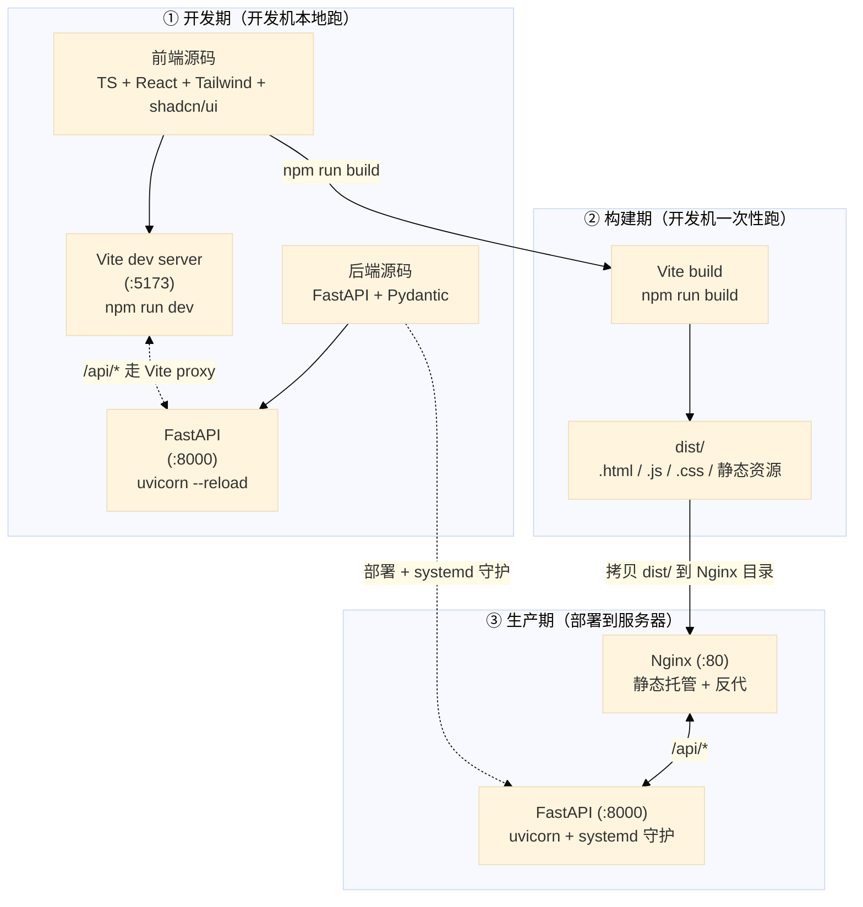

# 1. 背景

RAG 和 Agent 部分都进行了优化和升级，现在开始 UI 部分。

# 2. 现状与思考

当前 Web UI 是当时的一个尝试，并非真实需求，也没有仔细设计。是对当时CLI 功能的界面化，完全不符合 UI 本身的特性，要从头全新设计。

当前项目实现了 web UI draft，选择的是用 chainlit 来实现。
思考：当前项目做 desk app UI 还是 Web UI？→ 选 Web UI
技术选型：Vite + React vs Next.js -> 在学习完基础知识后决定

学习方式：实践 > 理论
1. 理解前/后端基本概念和框架
2. 需求定义：先知道要什么，然后再决定用什么做、如何做。
3. 技术选型：了解技术栈，知道什么工具是干什么的
4. 在 AI 辅助下完成代码

# 3. chainlit 现状清单

| 文件 | 怎么改 |
|---|---|
| `chainlit_app.py` | 删 |
| `.chainlit/` 目录 | 删 |
| `chainlit.md` | 删 |
| `public/custom.css` | 删 |
| `public/custom.js` | 删 |
| `tools/ui_debug.ps1` | 删（新 UI 启动脚本另写） |
| `requirements.txt` | 删 `chainlit` 那行 |
| `.gitignore` | 删 `.chainlit/translations/` 段 |
| `README.md` | 删 3 处 chainlit 启动 / 介绍引用 |
| `docs/design.md` | 删 3 处架构图里 `chainlit_app._event_router` 引用 |
| `src/agent/*.py` | 删注释里的 "Chainlit"  |
| `src/llm/provider.py` | 删注释里的 "Chainlit"  |
| `src/cli/skill_loader.py`| 删注释里的 "Chainlit"  |
| `tests/conftest.py` | 删注释里的 "Chainlit"  |


# 4. 需求定义

## 4.1. 功能

chat 主区交互：
- 流式输出（thinking + token）
- 停止生成
- 消息编辑 + 重发
- 回答 regenerate（同 / 换 provider）
- 代码块 syntax highlight + copy

Agent 状态可视化：
- 📋 Plan checkbox + 单步状态
- 💭 Thinking 折叠
- 🛠 Tool call 折叠 + 详情
- 📊 Token 消耗（每轮 / 累计）
- 引用 [n] hover 预览 + jump to source

资源管理：
- 会话：新建 / 改名 / 切换 / 删除 / 清空 / 导出 md / 全文搜索
- 用户记忆：列表 / 增删改
- prompt -> `.agenta/rules.md`（查看 / 编辑）
- skills：列表 / 启停 / reload
- mcp server：列表 / 健康状态 / config 查看
- 知识库：文档列表 / 上传入库 / 入库进度 / 清库

业务面板（学习/研究助理，可扩展）：
- 学习计划
- Quiz：出题 / MCQ 答题 / 批改
- SRS：日历 + 卡片复习 + 4 档评分

系统配置：
- LLM provider（含 Thinking 开关 / budget / adaptive）
- RAG top_k 等检索参数
- .env 中挑一些主要的
- 主题（亮 / 暗）
- 语言

反馈机制：
- toast（角落小条幅，自动消失）
- loading（异步进行中提示）
- error inline（错误就近显示，不弹窗）

调试：
- 复用/优化 CLI 的调试功能 /logs 下的日志


## 4.2. UX 风格

参考 Claude 的 Web 版：

- 配色：暖白主背景 + 深灰文本 + 暖橙 accent；暗色模式翻成深棕灰 + 暖白
- 字体：英文 Inter / system-ui；中文 PingFang SC / Microsoft YaHei
- 圆角：气泡 / 卡片 ~12px；按钮 / 输入框 ~6px
- 间距：留白宽松；消息间距 ≥ 16px
- 过渡动画：温和（150–200ms ease），不夸张
- 具体 hex / 字号 / 字重实施时定

布局（参照 Claude Web）：
- 左侧栏：顶部 `[+ 新对话]` → 资源菜单（知识库 / Skills / MCP / Rules / 记忆）→ Recents 列表 → 底部用户区（账号 / 设置入口 / 主题切换 / 折叠）
- 主区顶部细条：当前 chat 标题 + model / provider 切换
- 主区 chat：消息流；sources / tools / token 作为**内嵌折叠按钮**显示在回答下方，点击才弹出
- 主区底部输入框区：输入框 + 附件 + skill 触发 + Thinking 开关
- 右侧 detail panel：**默认折叠**，点 sources / tools / token 按钮时滑出；可常驻 pin

页面布局图：

```
┌──────────────────────┬──────────────────────────────────────────────┐
│ ⚡ AgentA      ◀     │   💬 当前 chat 标题            [Qwen ▾]      │
│ ──────────────────── │ ──────────────────────────────────────────── │
│ [+ 新对话]            │                                              │
│                      │  user: …                                     │
│ 📚 知识库             │                                              │
│ 🔧 Skills            │  ai:  📋 Plan                                │
│ 🔌 MCP               │      ✅ Step 1                               │
│ 📝 Rules             │      ⏳ Step 2                               │
│ 🧠 用户记忆           │      💭 Thinking ▾                          │
│                      │      正文（流式打字中…）                       │
│ ──────────────────── │                                              │
│ 🔍 Recents           │   [📚 sources(2)] [🛠 tools(3)] [📊 token]   │
│ 今日                  │                                              │
│ · …                  │  Tabs: [Chat][计划][Quiz][SRS]               │
│ · …                  │                                              │
│ 昨日                  │  ┌───────────────────────────────────────┐  │
│ · …                  │  │ + 📎 [输入框…]                    [↑] │  │
│                      │  │   Thinking ◯                          │  │
│ ──────────────────── │  └───────────────────────────────────────┘  │
│ 👤 Michael · ⚙ · 🌙  │                                              │
└──────────────────────┴──────────────────────────────────────────────┘
```

注：sources / tools / token 内嵌按钮点击 → 右侧滑出 detail panel（默认折叠）；
左侧栏可整体折叠收成图标列。


# 5. 技术选型
## 5.1. 基础知识
参见 [iter_4_5.1_UI基础知识.md](../../knowledge/iter_4_5.1_UI基础知识.md)

## 5.2. 相关技术
参见 [iter_4_5.2_UI相关技术.md](../../knowledge/iter_4_5.2_UI相关技术.md)

## 5.3. 选型决策

**最终选型**：`Python + TypeScript + FastAPI + Vite + React + Tailwind CSS + shadcn/ui + Nginx`

**技术栈分层职责**：

| 层 | 工具 / 技术 | 负责干啥 | 详见 |
|---|---|---|---|
| **前端语言** | TypeScript | 前端源码语言（JS + 类型系统） | §5.2.2 |
| **前端 UI 库** | React | 声明式 UI 渲染 + 组件化 | §5.2.4 |
| **前端样式** | Tailwind CSS | utility-first CSS 工具类 | §5.2.6 |
| **前端组件库** | shadcn/ui | 复制源码的 React 组件套装（基于 Radix UI + Tailwind） | §5.2.7 |
| **前端路由** | React Router | 浏览器内多页面切换（聊天主页 / session 详情等） | §5.2.4 (5) |
| **前端工程化运行时** | Node.js | 跑构建工具 / dev server 的 JS 运行时 | §5.2.3 |
| **前端包管理** | npm | 装依赖、跑 scripts | §5.2.3 |
| **前端构建 / dev server** | Vite | 开发期现场转译 + HMR、构建期用 Rollup 打包 | §5.2.9 |
| **后端语言** | Python | 后端源码语言（项目已有 Agent + RAG 核心） | — |
| **后端 web 框架** | FastAPI | HTTP API 路由 + Pydantic 校验 + SSE 流式响应 + OpenAPI 文档 | §5.2.8 |
| **后端 HTTP 服务器** | uvicorn | ASGI 服务器，跑 FastAPI；开发期 `--reload` 热重载 | §5.2.8 (6) |
| **通信协议** | HTTP REST + SSE | 常规请求走 REST、聊天流式响应走 SSE | §5.1.3 |
| **生产部署：反向代理 + 静态托管** | Nginx | 静态文件托管 + `/api/*` 反向代理到 FastAPI | §5.2.10 |
| **生产部署：进程守护** | systemd | 让 uvicorn 24/7 跑、崩了自动重启 | §6 |

**项目已有（不变）**：

- `src/agent/` —— Python Agent core（含三种实现：Python / LangChain / AutoGPT）
- `src/rag/` —— RAG 检索 + 重排
- `src/memory/` —— 会话历史 + memory + 复习计划存储

本期新加的就是上面表格里**所有非 Python 的工具** + 一层 FastAPI（在新目录 `src/api/` 里写）把上面三个 Python 模块包成 HTTP 接口。

**整体开发流程**：



读图要点：

- **① 开发期**：前端写 `.tsx` 源码 → Vite dev server 实时编译 + HMR；后端写 FastAPI 路由 → uvicorn 热重载。两边都跑在 localhost，浏览器只跟 `:5173` 一个来源对话，`/api/*` 由 Vite proxy 透传到 `:8000`（同源化、避 CORS —— §5.1.6 思路 A 开发期实现）
- **② 构建期**：前端 `npm run build` 一次性产出 `dist/` 静态产物
- **③ 生产期**：`dist/` 拷到服务器 Nginx 静态目录；FastAPI 用 uvicorn + systemd 守护跑在 `:8000`；Nginx 配两个 location，`/` 给静态文件、`/api/*` 反代到 FastAPI（同源化、避 CORS —— §5.1.6 思路 A 生产期实现）


# 6. 实现
## 6.1 环境准备

本期 Node 侧**无需重装**。

**Python 侧**（在现有 venv 装，全部用户级、无 admin 影响）：

| 包 | 作用 | 备注 |
|---|---|---|
| `fastapi` | Web 框架（详 §5.2.8） | 核心包 |
| `uvicorn[standard]` | **ASGI 服务器** —— 在端口监听 HTTP 请求、把请求 dispatch 给 FastAPI 应用对象、把响应写回 socket。跟 FastAPI 是"服务器 + 框架"的关系（类比 Flask + gunicorn） | `[standard]` 是 pip 的 extras 语法，多装一组可选加速 / 便利包：`httptools`（C 实现的 HTTP 解析器）/ `uvloop`（高性能 asyncio 事件循环，Linux/Mac 生效、Windows 自动跳过）/ `websockets` / `watchfiles`（`--reload` 监听文件变化）/ `python-dotenv`。不带 `[standard]` 也能跑，性能略降；装 `[standard]` 是社区惯例 |
| `python-multipart` | 解析 HTTP `multipart/form-data` 请求体（浏览器表单 + 文件上传协议格式） | 纯 Python、单一职责库。FastAPI 核心不内置 multipart 解析；只要写 `File(...)` / `Form(...)` 接收文件就必须装它，否则启动报 `Form data requires "python-multipart" to be installed`。本期 [Step 4 知识库拖拽上传](#645-step-4---知识库--拖拽入库) 必用，一次装上免得到时漏 |

`requirements.txt` 加 3 行：

```diff
+ fastapi
+ uvicorn[standard]
+ python-multipart
```

**前端依赖怎么走？**

前端依赖在 `frontend/package.json`。这个文件**当前还不存在**，会 通过脚手架命令自动生成 / 增量写入：

| 命令 | 自动加进 `package.json` 的典型依赖 |
|---|---|
| `npm create vite@latest frontend -- --template react-ts` | `react` / `react-dom` / `typescript` / `vite` / `@vitejs/plugin-react` |
| `npm install -D tailwindcss postcss autoprefixer` | `tailwindcss` / `postcss` / `autoprefixer` |
| `npx shadcn@latest init`（含后续 `npx shadcn@latest add <component>`） | `@radix-ui/react-*` / `class-variance-authority` / `clsx` / `tailwind-merge` / `lucide-react` |


## 6.2 目录/文件结构

```
AgentA/                              # 项目根
├── src/                             # 后端 Python
│   ├── agent/                       # 已有，不动
│   ├── rag/                         # 已有，不动
│   ├── memory/                      # 已有，不动
│   ├── llm/                         # 已有，不动
│   ├── cli/                         # 已有，不动
│   ├── config.py                    # 已有，按需加 API 相关配置项
│   └── api/                         # 【本期新增】FastAPI 层
│       ├── __init__.py
│       ├── main.py                  # FastAPI app + 路由挂载入口
│       ├── deps.py                  # 依赖注入：单例 Agent / Store / ...
│       ├── routes/                  # 各业务路由
│       │   ├── __init__.py
│       │   ├── health.py            # /api/health
│       │   ├── chat.py              # /api/chat/*
│       │   ├── sessions.py          # /api/sessions/*
│       │   ├── kb.py                # /api/kb/*
│       │   ├── memory.py            # /api/memory/*
│       │   ├── rules.py             # /api/rules/*
│       │   ├── skills.py            # /api/skills/*
│       │   ├── mcp.py               # /api/mcp/*
│       │   ├── config.py            # /api/config/*
│       │   └── learning.py          # /api/learning/*（业务面板）
│       └── schemas/                 # Pydantic 请求 / 响应模型
│           ├── __init__.py
│           ├── chat.py
│           ├── session.py
│           └── ...
│
├── frontend/                        # 【本期新增】前端项目（独立目录）
│   ├── package.json
│   ├── tsconfig.json
│   ├── vite.config.ts               # 含 /api/* proxy 到 :8000
│   ├── tailwind.config.ts
│   ├── postcss.config.js
│   ├── components.json              # shadcn/ui 配置
│   ├── index.html                   # 入口 HTML
│   └── src/
│       ├── main.tsx                 # React 挂载入口
│       ├── App.tsx                  # 根组件 + 路由
│       ├── components/
│       │   ├── ui/                  # shadcn/ui 组件（CLI 复制进来）
│       │   ├── chat/                # 聊天主区（MessageList / Composer / ...）
│       │   ├── sidebar/             # 左侧栏（资源菜单 / 会话列表 / ...）
│       │   └── panel/               # 右侧 detail panel
│       ├── pages/                   # 顶级页面（按 React Router 组织）
│       ├── hooks/                   # 自定义 hooks（useChatStream / useSession / ...）
│       ├── lib/                     # 通用工具（cn / 时间格式化 / ...）
│       ├── api/                     # 后端 API 客户端封装（fetch / SSE）
│       ├── store/                   # 全局状态（Zustand）
│       └── types/                   # TS 类型（部分由后端 OpenAPI 自动生成）
│
├── tests/
│   ├── test_agent_*.py              # 已有
│   ├── test_rag_*.py                # 已有
│   └── test_api_*.py                # 【本期新增】API 层 UT（用 FastAPI TestClient）
│
├── docs/
│   ├── design.md                    # 本 iter 完成后回写 "§N Web UI + API 层" 章节
│   └── iter_4_UI.md                 # 本文档
│
├── tools/
│   └── dev.ps1                      # 【可选】一键起前后端两进程
│
└── requirements.txt                 # 加 fastapi / uvicorn / python-multipart
```

**设计约定**：

- **前端独立 `frontend/`**，跟 `src/` 平行 —— 前后端依赖 / 构建 / 锁定文件互不影响
- **后端 API 层 `src/api/`，不动现有 `src/agent/` / `src/rag/`** —— API 通过 `deps.py` 拿核心模块实例（依赖注入），保持 Agent core 跟 HTTP 解耦
- **路由按业务功能拆文件**，每个文件一个 `APIRouter`，`main.py` 统一挂载 —— 避免单文件膨胀
- **Pydantic schema 单独放 `schemas/`** —— 跟路由解耦，方便复用 + 生成 OpenAPI

## 6.3 `design.md` 同步策略

**本 iter 期间**：所有 UI + API 设计写在 `iter_4_UI.md`（§6 本节就够），**不动 `docs/design.md`**。

**本 iter 完成后**：往 `docs/design.md` 加一节 **"§N. Web UI + API 层"**，写：

- 新增目录结构（`src/api/` + `frontend/`）的角色 / 边界
- API 路由总览（端点列表 + 各自职责）
- 前后端边界（什么放前端、什么放后端）
- SSE / CORS / 部署（开发 vs 生产）

**理由**：`docs/design.md` 是"**当前态架构**"文档（工程公约 §3）。本 iter 进行中代码不稳定、写进去容易过时；做完一次回写、跟最新代码对齐。这也跟之前定的"README / design 等新 UI 好了再更新"对齐。

## 6.4 分步实现

### 6.4.1~6.4.8 Step 0~7
参见 [iter_4_6.4_UI实现细节.md](../../knowledge/iter_4_6.4_UI实现细节.md)

### 6.4.9 Step 8 - 总体验收

**目标**：把 Step 0~7 的能力按一条**端到端用户旅程**串起来跑通。后续 Step 覆盖前面 Step 的所有效果（流式聊天必然覆盖非流式、session 管理必然覆盖单轮聊天……），因此**只要 Step 8 全过 = Step 0~7 全过**，不再重复每个 Step 自己的细分验收。

**前置准备**：

1. `.venv` 已建好、`requirements.txt` 装齐：`.\.venv\Scripts\pip install -r requirements.txt`
2. `frontend/node_modules` 已装好：`cd frontend && npm install`
3. `.env` 至少配好 1 个 LLM provider 的 API key（kimi / qwen 任一即可，glm 因 [Step 2 风险点](#643-step-2---流式输出--agent-状态) `make_plan` 死循环不建议作为主测 provider）
4. 当前目录在项目根（`AgentA/`）下，PowerShell 5.1+ 

#### 启停工具 `tools\ui.ps1`

为了避免每次手动开两个终端 + 记忆 uvicorn / vite 命令，封装了一个 PowerShell 启停工具：

| 命令 | 作用 |
|---|---|
| `.\tools\ui.ps1 start` | 后台启动 uvicorn (`:8000`) + vite (`:5173`)；自动写 `.run/<name>.pid`、`logs/<name>.log` |
| `.\tools\ui.ps1 stop` | 一起停；用 `taskkill /T /F` 杀整个进程树（避免 npm/node、uvicorn reloader/worker 留孤儿） |
| `.\tools\ui.ps1 stop uvicorn` / `stop vite` | 只停一个（用于"只重启后端 / 只重启前端"场景） |
| `.\tools\ui.ps1 status` | 表格列出两个服务的 status / PID / 端口 / URL |
| `.\tools\ui.ps1 logs uvicorn` / `logs vite` | `tail -f` 对应日志；Ctrl+C 只退出查看，服务继续跑 |
| `.\tools\ui.ps1 help` | 帮助（不带参数也是这个） |

工具内置幂等检测：PID 文件存在 + 进程还在 / 或端口已被占用，则 `start` 跳过 + 警告，不会重复启起 2 份。

---

#### A. 后端 UT 全量回归

```powershell
.\.venv\Scripts\python -m pytest -q
```

预期：全过（默认 deselect `integration` / `langchain` / `autogpt` / `extended_providers` markers，约 1100+ case，跑约 30s 内）。

如果只想跑 web API 相关：

```powershell
.\.venv\Scripts\python -m pytest -q tests/test_api_*.py
```

---

#### B. 前端构建检查

```powershell
cd frontend
npx tsc --noEmit          # 类型检查，应零错
npx eslint . --max-warnings 0  # lint，应零 error 零 warning（详见 `frontend/eslint.config.js` 的规则说明）
npm run build             # vite build，应 5s 内出 dist/（warning 提示 chunk > 500KB 可忽略）
cd ..
```

---

#### C. 端到端冒烟

**1) 启动服务**

```powershell
.\tools\ui.ps1 start
.\tools\ui.ps1 status
```

预期：`uvicorn` 和 `vite` 两行都是 `RUNNING`、列出 PID、URL（`http://localhost:8000/docs` + `http://localhost:5173/`）。

如果 status 显示某个 `stopped` 或 start 报失败：

```powershell
.\tools\ui.ps1 logs uvicorn   # 看后端启动日志
.\tools\ui.ps1 logs vite      # 看前端启动日志
```

排错后再 `.\tools\ui.ps1 stop` + `start` 重试。

**2) 后端健康检查**（覆盖 Step 0）

浏览器开 `http://localhost:8000/docs` → 应看到 Swagger UI，列出 `/api/health` / `/api/chat` / `/api/chat/stream` / `/api/sessions` / `/api/kb/*` / `/api/memory` / `/api/rules` / `/api/skills` / `/api/mcp` / `/api/config` / `/api/plans` / `/api/quizzes` / `/api/srs` 等所有路由。

点 `GET /api/health` → `Try it out` → `Execute` → 200 + `{"ok": true, "version": "..."}`。

**3) 前端首屏**（覆盖 Step 0 / Step 3 / Step 5 / Step 6 / Step 7）

浏览器开 `http://localhost:5173/` → 应看到：

- 左侧 Sidebar 自上而下：
  - 顶部"新建会话"按钮
  - 资源菜单区（聊天 / 知识库 / 记忆 / 规则 / Skills / MCP / 学习计划 / Quiz / SRS / 设置 共 10 个入口）
  - "Recents" 标签 + 会话列表（点标签可折叠/展开，chevron 跟着旋转；折叠状态写 localStorage 持久化）
  - 底部右侧：主题切换按钮（Sun / Moon / Monitor 三态）
- 主区：当前 session 的聊天界面（消息区空 + 输入框）

**4) 流式聊天 + 多轮记忆 + Plan / Tool 可视化**（覆盖 Step 1 + Step 2）

- 在输入框发 `用 3 句话讲一下牛顿三定律` → 正文 token 逐字浮现（不是等 5 秒整段出）
- F12 → Network → 找到 `POST /api/chat/stream` → 状态 200、Type `eventsource`、EventStream 标签里能看到一串 `token_chunk` + 最后 `final_answer`
- 再发 `我刚才问的是什么？` → assistant 应答出 "牛顿三定律"（说明 chat_history 复用）
- 发 `帮我设计一份 4 周的 Rust 入门学习计划` → 正文上方先出 Plan checklist（每步从 ⏳ 翻 ✓）、可能伴随 `make_plan` / `create_study_plan` 工具调用卡片

**5) Session 管理 + 持久化 + SSE 断流**（覆盖 Step 3 + Step 7 review fix #9）

- 点"新建会话" → list 顶部多一个 session（标题前 8 位 uuid）、自动切到它
- **关键测**：在新 session 里发一句长回答的问题（如"详细讲讲深度学习的发展史"）；token 流到一半时**立刻点回上一个 session** → 旧 SSE 应该被前端主动 abort（Network 看到 `EventStream` 列变成 `(canceled)`）；切回来不会看到混乱的中间 token
- hover session → 弹 `⋯` → 重命名为"测试会话" → 列表立刻更新
- hover session → 删除 → 确认 Dialog → 该 session 从列表消失
- 逐个删完所有 session（每条单删，没有"清空"按钮）→ 删到 0 条时前端 `handleDelete` 兜底自动 `createSession()` 建一个新空 session（默认显示标题为 "New Chat"，首条 user 消息一来就被覆盖为该消息摘要），保持至少 1 个 active
- 点 "Recents" 标签 → 会话列表折叠（chevron 从朝下转到朝右）；再点一次 → 展开；刷新浏览器后折叠状态保留（localStorage 持久化）
- **重启后端**：`.\tools\ui.ps1 stop uvicorn` → `.\tools\ui.ps1 start uvicorn` → 浏览器刷新 → session 列表 / 消息历史全部还在

**6) 知识库 拖拽入库 + 列表 + 删除 + Agent 检索**（覆盖 Step 4）

- 点 `知识库` view → 主区切到 KB 面板
- 拖一个 `.md` 文件到拖拽区 → 高亮 → 松开 → spinner → toast "已入库，N chunks"、列表新增一行
- 同名文件再拖一次 → toast 提示"内容未变化，已跳过"（content_sha1 去重）
- 拖一个 `.exe` → toast "不支持的格式"，不发请求
- 列表里删一个文档 → AlertDialog 确认 → 行消失 + toast "已删除"
- 切回聊天，新 session 问"我刚上传的 X 文档讲了什么？" → assistant 应该能调 `search_knowledge` 工具命中

**7) 资源管理（Memory / Rules / Skills / MCP）**（覆盖 Step 5）

**记忆**（点 `记忆`）：

- 列表每行显示 category 中文标签（偏好 / 背景 / 指令 / 任务 / 纠错）+ source 标签（自动 / 请记住 / 手工）+ key + value + 创建时间
- hover 行 → 右侧浮出 ✏️ 编辑 / 🗑️ 删除按钮
- 点 ✏️ → 弹 Dialog（key 只读、value 可改）→ 改完 Enter / 保存 → toast + 列表更新
- 点 🗑️ → AlertDialog 确认 → 行消失 + toast "已删除"
- 点顶部 `+ 添加记忆` → 弹 Dialog：选 category（默认偏好）→ 输入 key（如 `favorite_language`）→ 输入 value（如 `Python`，支持多行；Ctrl+Enter 提交）→ 添加 → 列表新增一行，source 标 "手工"
- 点顶部 `清空全部` → AlertDialog 二次确认（显示当前条数）→ 清空 → toast "已清空 N 条"

**规则**（点 `规则`）：

- textarea 显示 `.agenta/rules.md` 内容（撑满主区高度，不再写死 400px）
- 改内容 → 编辑框下方的"保存"按钮可点 → 保存 → toast "已保存，新 session 生效"

**Skills**（点 `Skills`）：

- 默认看到「**已启用 (N)**」区块（绿色 ✓ 图标）+「**已禁用 (M)**」区块（仅当有禁用项时出现，灰色暂停图标）+「**加载失败**」区块（仅当有 failed 项，琥珀色 ⚠ 图标）
- 「已启用」标题**同行右侧**有 4 个工具按钮：搜索框（按 name / description 模糊匹配）/ 名称 A→Z 切换（再点变 Z→A）/ `+ 新建 Skill` / `重新加载`（带刷新图标）
- 行左侧自上而下：Switch toggle（绿底=启用 / 灰底=禁用）/ 展开折叠箭头 / name + description + location 路径
- 行尾 ✏️ 编辑、🗑️ 删除
- **toggle**：点一下绿色 Switch → 灰色 → toast "X 已禁用，新对话生效" → 该行从「已启用」搬到「已禁用」区
- **展开看 body**：点行任意位置（除按钮外）→ 下方按 Markdown 渲染显示 SKILL.md body（不是裸 pre 文本，列表 / 标题 / code 都有样式）
- **编辑**：点 ✏️ → 行内展开编辑表单：
  - 顶部行：「编辑：&lt;name&gt;」+ 取消 / 保存按钮（**底部同行也有一份**，长 body 时不用滚回顶部）
  - name 输入框（改了显示 "（修改将触发改名）" 黄字提示，保存时会调 `POST /api/skills/{old}/rename`）
  - description 输入框
  - body 区：右上 `Edit | Split | Preview` 三态切换（默认 Split）；CodeMirror 6 提供 markdown 语法高亮（dark 模式自动 oneDark）；Split 模式左编辑右实时预览
- **新建**：点 `+ 新建 Skill` → 弹**接近全屏的对话框**（最大 1400×900）→ name + description 在顶部一行 → body 编辑器**撑满中间剩余高度** → body 已预填中文骨架（"何时使用 / 步骤 / 注意事项"）→ 创建后立即出现在「已启用」区
- **改名**：编辑现有 skill → 改 name 字段 → 保存 → 磁盘上 `.agenta/skills/{old}/` 整目录搬到 `{new}/`，`scripts/` 等子文件一起搬，frontmatter `name:` 字段同步更新；若该 skill 原本被禁用，改名后仍在「已禁用」区（状态迁移）
- **删除**：点 🗑️ → AlertDialog 确认 → `.agenta/skills/{name}/` 整目录消失
- **重新加载**：手工编辑 `.agenta/skills/foo/SKILL.md` 或 `.agenta/skills/disabled.json` 后 → 点重新加载 → toast 报告"X 个加载，Y 个禁用，Z 个失败"
- **frontmatter passthrough**：手工在 SKILL.md 里加 `allowed-tools: [tool_a]` 等非标准字段 → UI 改 description / body 保存 → 磁盘上 `allowed-tools` 字段仍在（不丢失）

**MCP**（点 `MCP`）：

- 默认看到「**已启用 (N)**」区块（绿色 ✓ 图标）+「**已禁用 (M)**」区块（仅当有禁用项，灰色暂停图标）+「**加载失败**」区块（仅当有 failed 项，琥珀色 ⚠ 图标）
- 「已启用」标题**同行右侧**有 4 个工具按钮：搜索框（按 name / command 模糊匹配）/ 名称 A→Z 切换 / `+ 新建 Server` / `重新加载`（带刷新图标）
- 行左侧自上而下：Switch toggle（绿底=启用 / 灰底=禁用）/ 展开折叠箭头 / name + 状态徽章（connected / failed / closed）+ tool_count + 命令行预览 + error（如有）
- 行尾 ✏️ 编辑、🗑️ 删除
- **toggle**：点绿色 Switch → 灰色 → toast "X 已禁用" → server 子进程立即停止（不需重启 uvicorn）→ 该行从「已启用」搬到「已禁用」区；下一轮对话 LLM 看不到该 server 的 tool
- **展开看详情**：点行任意位置（除按钮外）→ 下方显示 Command / Args 列表 / Env 键值 / **Tools 列表**（每个 tool 含 name + description）
- **编辑**：点 ✏️ → 行内展开编辑表单：
  - 顶部行：「编辑：&lt;name&gt;」+ 取消 / 保存按钮（**底部同行也有一份**，长 env 列表时不用滚回顶部）
  - name 输入框（改了保存时会先调 `POST /api/mcp/servers/{old}/rename`）
  - command 输入框
  - args：可增减的参数列表（每行一个 `-y` / 路径等，✕ 删除 / `+ 添加参数` 加行）
  - env：可增减的 KEY=value 键值对，value 支持 `${VAR}` 引用进程 env（启动时按当前 env 展开）
  - 保存：启用中的 server 自动 stop+start 让新 command/args/env 生效；下一轮对话即可看到新 tool 列表
- **新建**：点 `+ 新建 Server` → 弹大对话框 → 填 name / command / args[] / env{} → 创建后写 `.agenta/mcp/config.json` + 立即 `start_one` 拉起子进程；几秒后行变成 connected
- **改名**：编辑现有 server → 改 name → 保存 → `config.json` 里 key 从 `{old}` 改成 `{new}`，若原本被禁用则 `disabled.json` 同步迁移；运行中的 server 先 stop_one 再 start_one
- **删除**：点 🗑️ → AlertDialog 确认 → `config.json` 移除该条目 + `stop_one` 关闭子进程 + 清理 disabled.json 孤儿
- **重新加载**：手工编辑 `.agenta/mcp/config.json` 或 `disabled.json` 后 → 点重新加载 → toast 报告"X 个已连接，Y 个失败"+ manager 按差异 diff 启停（新增 server 拉起 / 移除的关闭 / spec 改动的重启）
- **${VAR} 透传**：在 env value 里写 `${MY_TOKEN}` 保存 → `config.json` 文件保留字面量 `${MY_TOKEN}`（不展开）；server 启动时按当前进程 env 替换；变量缺失时保留字面量传给子进程

**8) 主题切换 + 全局 Toast 同步**（覆盖 Step 6 + Step 7 review fix #2）

- Sidebar 底部右侧主题按钮点一次 → dark；二次 → light；三次 → system
- **关键测**：切换主题时，**正在显示中的 toast 颜色应该跟着翻转**（不再需要刷新页面，验证 review #2 ThemeProvider Context 修复）
- 在 dark 模式下逐个 view 切一遍（聊天 / KB / 记忆 / 规则 / Skills / MCP / 学习计划 / Quiz / SRS / 设置）→ 全部深色显示正确
- 刷新浏览器 → 主题保留

**9) 设置面板（只读）**（覆盖 Step 6）

- 点 `设置` → 主区显示 LLM / RAG / Memory / Rules / MCP / Security / Web / Log 8 个分组
- **关键测**：确认看不到任何完整 API key（被脱敏成 `***`）

**10) 业务面板（学习计划 / Quiz / SRS）**（覆盖 Step 7）

- 回 chat 发 `做一份机器学习入门 4 周学习计划` → 让 LLM 调 `create_study_plan` 创建 plan
- 切 `学习计划` → 左侧列出 plan；点进右侧显示 stages + tasks，active plan 高亮
- chat 发 `考我 5 道 attention 机制的题` → 让 LLM 调 `create_quiz`
- 切 `Quiz` → 列表出现新 quiz；点进显示 questions + 未答状态
- chat 答题 → `grade_quiz` 批改 → 切回 Quiz view → 看到 user_answer / score / feedback
- chat 发 `把刚才错的题加进 SRS` → 切 `SRS` → 上方"到期"队列 / 下方全卡列表都能看到新卡

**11) 并发请求 thread-safety**（覆盖 Step 7 review fix #1）

- **关键测**：开两个浏览器 tab，同时分别问不同的问题（同时按回车）→ 两边都应该按提交顺序得到正确答案，**不会出现答案串到对方 session 的情况**（验证 `_AGENT_LOCK` 串行化修复）

**12) 重启 / 持久化总验**

```powershell
.\tools\ui.ps1 stop
.\tools\ui.ps1 start
```

刷新浏览器 → 上面建立的 session / KB 文档 / memory / plan / quiz / SRS 卡片**全部还在**（持久化 store + sqlite_db + chroma_db 工作正常）。

**13) 干净停服**

```powershell
.\tools\ui.ps1 stop
.\tools\ui.ps1 status
```

预期：两个服务都 `stopped`、`.run/*.pid` 已清。

---

#### D. Step 7 review 后的 10 项 fix

| Fix | 验收点 |
|---|---|
| #1 `_AGENT_LOCK` 串行化 | C.11 两 tab 并发问答不串台 |
| #2 ThemeProvider Context | C.8 切主题时 toast 颜色跟随 |
| #3 PlansView/QuizzesView refreshList 优化 | C.10 切 plan / quiz 点击不闪 + Network 不重复拉列表 |
| #4 deps.py docstring 更新 | 仅文档；走读 `src/api/deps.py` |
| #5 user_memory.upsert 返回 id | C.7 memory 编辑保存后立刻看到（不再依赖 key 反查） |
| #6 MemoryPatchResponse 新增 | UT 已覆盖（`tests/test_api_memory.py`） |
| #7 SSE AbortController | C.5 session 切换时旧流被 cancel |
| #8 kb.py 删 dead import | 仅静态检查，B 步骤 tsc/eslint/build 覆盖 |
| #9 SRSView 移除 emoji | C.10 SRS view 空状态文案"没有到期卡片，继续保持" |
| #10 asChild 警告修复 | F12 Console 无 `<button> cannot contain a nested <button>` / `React does not recognize the asChild prop` 警告 |
