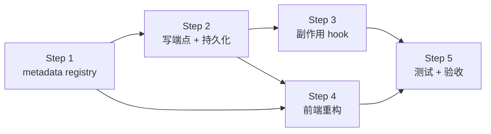
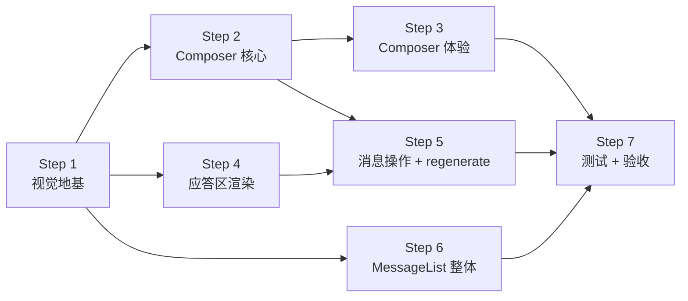

# 1. 配置优化

## 1.1. 需求

### 1.1.1. 已列方向（用户原始）

- 配置可修改并立即生效
- bool 选项用 Switch（开关）—— 注：bool 配置业界惯例用 Switch 而非 RadioGroup，一眼看清状态、一步切换
- 多选 / 单选枚举用下拉框（单选枚举若 ≤4 项可用 RadioGroup，少一次点击）
- 配置项有简要说明，悬停显示详细说明

### 1.1.2. 业界标杆补充

**A. 分组与导航**

- 配置分组沿用后端 8 组：LLM / RAG / Memory / Rules / MCP / Security / Web / Log（与 `routes/config.py` 一致）
- 顶部搜索框：按 key 或描述模糊匹配（VSCode 设置面板风格）
- 已修改项视觉标记（左侧蓝点 / 边框高亮）+ 顶部"未保存改动"状态条
- 关闭页面 / 切走 view 时，有未保存改动给浏览器原生 `beforeunload` 警告

**B. 控件按值类型自动匹配**

| 值类型 | 控件 | 备注 |
|---|---|---|
| bool | Switch | 单步切换 |
| 单选枚举 ≤4 项 | RadioGroup | 选项一眼看完 |
| 单选枚举 >4 项 | Select 下拉 | 节省空间 |
| 多选 | MultiSelect / Checkbox 列表 | 如 `RAG_ACTIVE_EMBEDDINGS` |
| 数字（有范围） | NumberInput；连续值再加 Slider | 限制非法值 |
| 路径 | Input + 文件 / 目录选择器 | 如 `WEB_UPLOAD_DIR` |
| 长文本 / JSON | Textarea；JSON 加语法高亮 | 如 MCP `config_file` 内容 |
| API key 等敏感字符串 | **本期只读展示"已设置 / 未设置"徽章；不开放修改**（仍只能改 `.env` 后重启） | 详 §1.1.3 |

**C. 说明与帮助层级**

- 每项 label 下一行**简要说明**（一句话讲意义；常驻显示）
- 行尾 info 图标，hover / focus 弹 Tooltip 显示**详细说明**：含义 + 取值范围 + 影响范围（影响哪个模块）+ 默认值
- 标注**配置来源**：`.env` / runtime override / 内置默认值 —— 用户能一眼看出改动会写到哪、重启后是否还在

**D. 默认值与重置**

- 每项行尾"重置为此项默认值"图标按钮（仅当当前值 ≠ 默认值时出现）
- 每组顶部"全组重置为默认"按钮（带确认 Dialog）

**E. 校验与反馈**

- 前端基础校验（类型 / 范围 / 必填）+ 后端 Pydantic 再校验；保存失败回滚到原值，错误就近 inline 显示（不弹窗）
- 危险项二次确认 Dialog —— 如关闭 `SECURITY_MODE`、改 `PLAN_PERMISSION_MODE` 为更宽松值
- 保存成功 toast；批量保存显示进度条

**F. "立即生效 vs 重启"清单**

下表覆盖当前 `routes/config.py` 暴露的全部项。判定原则：调用方如果是**每次调用读 `_cfg.X`**，就立即生效；如果是**启动时读一次缓存到 local var**，就需要重启。

| 组 | key | 生效方式 | 副作用 / 注意点 |
|---|---|---|---|
| **LLM** | `active_provider` | 立即 | 触发下一次 LLM call 时重建 client；无需重启 |
| | `force_temperature` | 立即 | — |
| | `thinking_enabled` | 立即 | 仅 Claude / Qwen3 实际生效，其他 provider 静默降级 |
| | `thinking_budget` | 立即 | — |
| **RAG** | `top_k` / `k_per_source` | 立即 | — |
| | `active_embeddings` / `default_embedding` | 立即 | 首次切到新 alias 会触发 embedding 模型加载（几秒到几十秒） |
| | `reranker_enabled` | 立即 | — |
| | `reranker_model` | 立即 | 切换会重新加载 cross-encoder（几秒），改完第一次检索慢 |
| | `query_rewrite_enabled` / `ocr_fallback_enabled` | 立即 | — |
| | `chunk_size` / `chunk_overlap` | 立即（仅新入库） | **已入库的 chunk 不会重切**；改完要重新 ingest 旧文档才有效 |
| **Memory** | `enabled` / `auto_extract` / `max_chars` | 立即 | — |
| **Rules** | `enabled` / `file` / `max_chars` | 立即 | 下一次组 system prompt 时读 |
| **MCP** | `enabled` | 立即 | true→false 触发 stop_all；false→true 触发 start_all |
| | `config_file` | 立即 | 切换路径会 stop 当前所有 server + 加载新文件重连 |
| | `connect_timeout_sec` / `call_timeout_sec` | 立即 | 仅影响下一次握手 / call |
| **Security** | `mode` / `plan_permission_mode` | 立即 | 改 `mode=normal→strict` 立即收紧 tool 白名单，注意提示 |
| **Web** | `upload_dir` | 立即（仅新上传） | **已上传文件不搬家**；前端列表会切到新目录 |
| | `max_upload_mb` | 立即 | — |
| **Log** | `level` | 立即 | 调 `logging.getLogger().setLevel()`；已写入文件的日志不回填 |

**结论**：本期暴露的全部项都能做到立即生效，无需在 UI 上显示"重启后生效"徽章；但 4 类项要有 inline 提示：

1. `chunk_size` / `chunk_overlap`：保存后 toast "仅影响新入库文档"
2. `WEB_UPLOAD_DIR`：保存后 toast "仅影响新上传，旧文件留在原目录"
3. `reranker_model` / `default_embedding` / `active_embeddings`：保存后 toast "首次使用新模型时会加载几秒"
4. `SECURITY_MODE` 切到 `strict`：保存前二次确认 Dialog（避免误把所有 tool 关掉）

### 1.1.3. 本期不做（已决定）

- API key 等敏感字段的修改 —— 仍只能改 `.env` 后重启；UI 只展示"已设置 / 未设置"徽章
- 多用户场景下的 audit log（谁 / 何时 / 改了哪个 key）
- 配置导入 / 导出（备份 / 跨机迁移）
- 修改历史与撤销（最近 N 次）

## 1.2. 实现步骤

按"后端能力先行 → 前端消费"分 5 步；每步独立可验收，互不阻塞。



| Step | 内容 | 关键产物 |
|---|---|---|
| **1. metadata registry** | 集中描述每项的：key / 类型 / 默认值 / 取值范围 / 简要说明 / 详细说明 / 副作用提示 / 危险标记。`GET /api/config` 返回"当前值 + metadata"组合 | `src/api/runtime/config_meta.py` + 扩展 `ConfigResponse` |
| **2. 写端点 + 持久化** | `PATCH /api/config` 接收 `{key, value}`、Pydantic 校验、运行时写回 `src.config` 模块属性；持久化到 `.agenta/config_overrides.json`；启动时优先加载该文件覆盖 `os.getenv` 默认值 | `routes/config.py` + 新增 overrides loader |
| **3. 副作用 hook** | 按 key 注册"改后触发什么"：`active_provider` → 重建 LLM client；`MCP_*` → manager reload；`LOG_LEVEL` → `logging.setLevel`；embedding / reranker → 清模型缓存；其他无副作用项 noop | `src/api/runtime/config_hooks.py` |
| **4. 前端重构** | 控件工厂（按 metadata.type 渲染 Switch / RadioGroup / Select / NumberInput / Input / Textarea）+ 顶部搜索 + 分组导航 + dirty 状态 + info Tooltip + 行内校验报错 + 重置按钮 + 副作用提示 toast + 危险项二次确认 Dialog | 重写 `frontend/src/components/settings/SettingsView.tsx`，拆出控件子组件 |
| **5. 测试 + 验收** | 后端 UT 覆盖每组至少 1 个 key 的：读 / 写 / 校验失败 / 持久化 / 副作用 hook 触发；端到端手测走 §1.1.2 F 4 类副作用提示 + §E 危险二次确认 | 扩充 `tests/test_api_config.py` + §1.3 |

**推进策略**：

- Step 1+2 是前后端共同依赖的契约层，建议合并做完再分头展开
- Step 3 副作用 hook 按 key 增量补：先做 `LOG_LEVEL` / `top_k` 这种 noop / setter 型试通链路，再做 `active_provider` / `MCP_*` 这种带重建逻辑的
- Step 4 前端先做骨架（搜索 / 分组 / 控件工厂 / Switch + NumberInput），再补 Select / MultiSelect / 文件选择器等长尾控件
- 不追求一次到位；Step 5 验收只看"已实现 key 的全链路通"，未接入的 key 仍走只读展示

### 1.2.1. 实现期决策记录

实现过程遇到的多路径决策一并记下，后续讨论 / 复盘对照：

| 决策点 | 选择 | 理由 |
|---|---|---|
| 持久化文件位置 | `.agenta/config_overrides.json` | 跟 `.agenta/rules.md` / `skills/disabled.json` / `mcp/config.json` 同目录、同命名风格；个人本地修改，已加入 `.gitignore` |
| 优先级模型 | `os.getenv` 默认值 → runtime override（覆盖） | 启动时 snapshot `_cfg` 当前值（即 .env 解析后的值）作为 reset 目标；override 文件加载时再覆盖 `_cfg` 模块属性 |
| 来源标识 | 二态：`default` / `override` | UI 只展示 "已修改" 徽章，不区分 .env 与硬编码默认（用户视角无关紧要） |
| GET 响应 shape | `{groups: [{name, label, items: [{key, value, default, source, type, brief, detail, options, min, max, side_effect_hint, danger, editable}]}]}` | 一次性返回值 + metadata，前端纯按 metadata 渲染控件，未来加新 key 不改前端 |
| 写端点风格 | `PATCH /api/config/{key}` body `{value}` + `DELETE /api/config/{key}` reset | RESTful；按 key 单项操作，避免批量 partial-failure 复杂性 |
| 文件外部修改同步 | 加 `POST /api/config/reload` + UI "从文件重载" 按钮（不做文件 watcher 自动刷新） | 跟 Skills / MCP 已有 "重新加载" 模式一致；自动 watcher 在编辑器频繁保存时会触发多次 hook，不可控 |
| Step 1+2 合并 | 合并实现 | 单独 metadata 没用；合并一次到位 |
| 副作用 hook 范围 | `LOG_LEVEL` / `MCP_ENABLED` / `MCP_CONFIG_FILE`，其他 noop | 多数 key 在调用方每次读 `_cfg.X`，setattr 后下次调用即生效，无需 hook；embedding / reranker 缓存按 model_name 索引，切换模型自动加载，也无需 hook |
| 控件库 | 直接用 `@base-ui/react/switch` + `<Input type=number>` + 原生 `<select>` + 原生 `<input type=radio/checkbox>` | 已有依赖 / 满足需求；不引入额外 ui 包 |
| Tooltip 实现 | 原生 HTML `title` 属性（多行 `\n` 分隔） | 零依赖 + a11y 自带；后续若要富文本可升级 base-ui Tooltip |
| 控件类型 enum 阈值 | enum_str 选项 ≤4 用 RadioGroup，>4 用 Select | 跟 §1.1.1 用户原话约定一致 |
| 保存方式 | 自动保存，无保存按钮：离散控件（Switch / Radio / Select / Checkbox）立即存，文本 / 数字框停手 600ms 防抖后存 | 与用户 "改完立即生效、不要保存按钮" 的要求一致；防抖避免文本每按一键都 PATCH |
| 保存反馈 | 成功不弹 toast（行左蓝条 + 行右 "保存中" + 工具栏 "N 项保存中…"），失败才 toast + 行内红字 | 每拨一次 Switch 都弹 toast 太吵；副作用提示改为行内常驻一行灰字 |
| 误关保护 | 仅当有保存在飞 / 防抖排队时触发 `beforeunload`（不做常驻 "未保存改动" 状态条） | 自动保存下不存在长期未保存态，只需兜住 "改完瞬间就关页" 的窗口 |
| 危险项 UX | `danger=True` 项改动时立即弹 AlertDialog 二次确认（离散控件本就一改即存），取消则回滚控件视觉态 | 与 §1.1.2 §E 对齐 |
| API key | 不写进 registry，UI 不可见 | 与 §1.1.3 决定一致；防泄漏的红线在 routes/config.py + UT 双层兜底 |
| 暂不暴露的项 | `IMP_METHOD` / `AUTOGPT_*` / `HARNESS_*` / `BM25_*` / `RAG_DENSE_MIN_SCORE_*` / `QUIZ_DEFAULT_*` / `SRS_*` / `LEARNING_PLAN_*` / `THINKING_BUDGET_*` 子项等 | 操作 / 调优内部参数，非典型用户面板需求；想改可走 `.env` |

**当前 registry 覆盖范围**：8 组 27 个 key。新增 key 的成本：在 `src/api/runtime/config_meta.py` `REGISTRY` 列表加一条 `ConfigItem`，无需改前端。

## 1.3. 人工验收

后端 UT 已覆盖契约层（GET shape / PATCH 校验 / DELETE reset / `LOG_LEVEL` hook / 持久化跨重启 / 从文件重载 / API key 不泄漏，详 `tests/test_api_config.py` 23 条），本节只列**端到端手测**点。

**交互前提（与下面所有用例相关）**：

- **无保存按钮，改完自动存**：离散控件（Switch / Radio / Select / Checkbox）一动就立即存；文本 / 数字框停手约 600ms（防抖）才存。
- **保存中的视觉**：该行左侧出现蓝条 + 行右出现转圈 "保存中"；顶部工具栏出现 "N 项保存中…"。存完蓝条消失、行右出现 "已修改" 徽章 + 重置按钮。
- **成功不弹 toast**：避免每拨一次 Switch 都弹；只有出错才 toast + 行内红字。

**前置**：`.\tools\ui.ps1 start` 启动后端 + 前端；浏览器开 `http://localhost:5173/` 进 `设置` view。

> 说明：`LOG_LEVEL` / `logs uvicorn` —— `LOG_LEVEL` 控制的是 AgentA 自己的 root logger。AgentA 跑在 uvicorn 进程里，其日志被 `ui.ps1` 重定向到 `logs/uvicorn.log`（文件名只是按启动进程命名，里面混着 uvicorn 访问日志 + AgentA 业务日志）。下面 "看 `logs uvicorn`" 都指在该文件里看 **AgentA 自己的日志行**。

### 1.3.1. UI 渲染与导航

| 检查 | 预期 |
|---|---|
| 标题一致 | 左侧边栏入口与中间标题都叫 "设置"，不再出现 "系统配置" |
| 左侧分组导航 | 左边竖排 8 组：LLM / RAG / Memory / Rules / MCP / Security / Web / Log；点某组**只显示该组**（不是滚动定位）|
| 搜索 `top_k` | 跨组只剩 `RAG_TOP_K` 一条；左导航对应组右侧显示命中数徽章；点任一组名清空搜索回到单组视图 |
| 搜索 `mcp` | MCP 组各项命中 |
| 6 种控件类型至少 1 个走通 | bool 显 Switch（如 `RERANKER_ENABLED`）／int 显数字框（`RAG_TOP_K`）／enum_str ≤4 项显 RadioGroup（`SECURITY_MODE` 两选）／enum_str >4 项显下拉（`ACTIVE_PROVIDER`）／multi_enum_str 显 checkbox 列表（`RAG_ACTIVE_EMBEDDINGS`）／path 显文本框（`USER_RULES_FILE`）|
| 下拉框配色 | `ACTIVE_PROVIDER` / `LOG_LEVEL` 下拉的弹出项跟 "添加记忆" 下拉一致，亮 / 暗模式都正常 |
| info 图标 hover | 显示详细说明 + 取值范围 + 默认值 + 来源（多行） |

### 1.3.2. 改完即生效

| 改 | 怎么验 |
|---|---|
| `LOG_LEVEL` → `DEBUG`，再切 `WARNING` | 在 `logs/uvicorn.log`（`.\tools\ui.ps1 logs uvicorn`）看到 AgentA 日志行密度变化（DEBUG 大量行 / WARNING 几乎沉默）|
| `RAG_TOP_K` → `2` | 进 chat 问需检索的问题，应答附带 sources 折叠最多 2 条 |
| `RERANKER_ENABLED` → `false` | 同上提问，sources 不再带 reranker 分数 |
| `THINKING_ENABLED` → `true`（先把 provider 切到 claude / qwen3） | 应答前出现 thinking 折叠块 |
| `ACTIVE_PROVIDER` 切 provider | 主区顶部 model 标签换；下一次发问 Network 看到对应 base_url |

### 1.3.3. 持久化与重置

| 步骤 | 预期 |
|---|---|
| 拨动一个 Switch（如 `RERANKER_ENABLED`） | 立即触发保存：行左短暂蓝条 + 右侧 "保存中" → 完成后蓝条消失、出现 "已修改" 徽章 + 重置按钮 |
| 改数字框（如 `RAG_TOP_K`）后停手 | 约 600ms 后才发保存（连续按键不会每键一存）|
| 检查 `.agenta/config_overrides.json` | 文件出现，含已改的 key |
| `.\tools\ui.ps1 stop uvicorn` → `start uvicorn` → 刷新浏览器 | 改过的值仍在；徽章仍是 "已修改" |
| 点行右 重置 按钮 | toast `xxx 已重置`；值回 `.env` / 默认；徽章消失；overrides.json 对应 key 也删了（此项是文件里唯一时文件留 `{}`）|
| 改文本 / 数字框后趁保存还没落地立刻刷新浏览器 | 弹出原生 "离开页面？" 警告（有保存在飞 / 防抖排队时才弹）；保存落地后再刷新则无警告 |
| 改值再改回原值 | 取消尚未发出的保存，行回到干净态（无需任何按钮）|

### 1.3.4. 从文件重载（手改文件后同步）

| 步骤 | 预期 |
|---|---|
| 编辑器手改 `.agenta/config_overrides.json`（如加 `"RAG_TOP_K": 23`）→ 只点工具栏 `刷新` | 值**不变**：刷新只把后端内存现状读回 UI，没读磁盘文件 |
| 同上手改后点工具栏 `从文件重载` | toast 提示同步了哪些 key；列表立刻显示新值 + "已修改" 徽章；后端 `_cfg` 已被文件覆盖 |
| 文件里删掉某 key 后点 `从文件重载` | 该项回到启动时初值（`.env` / 默认）|
| 文件无变化时点 `从文件重载` | toast `overrides 文件已是最新，无变化` |

### 1.3.5. 校验失败

| 操作 | 预期 |
|---|---|
| `RAG_TOP_K` 输入 `999` 停手 | 防抖后发请求 → 行下方红字 "RAG_TOP_K 不能大于 50" + 行左红条；server 值不变 |
| `RAG_TOP_K` 输入空 | 数字框本地兜底（空 / NaN 不发请求），不报错也不保存 |
| 后端伪造非法 enum_str（curl `PATCH /api/config/SECURITY_MODE` body `{"value":"yolo"}`） | 400 + detail `SECURITY_MODE 取值必须在 ['normal', 'strict'] 中` |

### 1.3.6. 副作用提示（行内常驻）

带 `side_effect_hint` 的项在控件下方**常驻**一行灰字 "提示：…"（不是 toast）；检查文案：

| key | 行内提示包含 |
|---|---|
| `CHUNK_SIZE` / `CHUNK_OVERLAP` | "仅影响新入库文档" |
| `WEB_UPLOAD_DIR` | "仅影响新上传" |
| `RERANKER_MODEL` / `DEFAULT_EMBEDDING_ALIAS` / `RAG_ACTIVE_EMBEDDINGS` | "首次使用新模型时会加载几秒" |
| `MCP_ENABLED` / `MCP_CONFIG_FILE` | 触发 MCP manager 重载 / 切路径停 server 重连 相关文案 |

### 1.3.7. 危险项二次确认

危险项是离散控件，**一改动就直接弹确认**（没有中间的保存按钮）：

| 操作 | 预期 |
|---|---|
| `SECURITY_MODE` 切到 `strict` | 立即弹 AlertDialog "确认修改敏感配置"（含 key 名）；点取消 → 控件视觉态回滚、server 不变；点确认 → 实际写入 |
| `PLAN_PERMISSION_MODE` 拨到开 | 同上，确认才写入；取消则开关弹回 |
| 行内 "敏感" 徽章 | 上述两项标题旁带琥珀色 "敏感" 标签 |

### 1.3.8. 副作用 hook 真触发

| key | 验证手段 |
|---|---|
| `LOG_LEVEL` | 改完后在 `logs/uvicorn.log` 立刻看到 AgentA 日志级别变化（无需重启）；手改文件后点 `从文件重载` 同样触发 |
| `MCP_ENABLED` true→false | 浏览器开 `http://localhost:8000/api/mcp/servers` 看全部 server `closed`、`tool_count=0` |
| `MCP_ENABLED` false→true | 同上看到 server 重新 `connected` |
| `MCP_CONFIG_FILE` 切到一个空 / 不存在的路径 | 全部 server 停掉、不抛 500 |

### 1.3.9. 安全红线

| 检查 | 预期 |
|---|---|
| 浏览器 F12 Network 看 `GET /api/config` body | **不出现**任何 `api_key` / `MOONSHOT_API_KEY` / `OPENAI_API_KEY` 等字段或值 |
| `PATCH /api/config/MOONSHOT_API_KEY` 试探 | 404 `Unknown or non-editable config key` |
| 设置面板里搜 `api_key` / `MOONSHOT` | 无结果（registry 不含敏感字段） |


# 2. chat 页面优化

## 2.1. 需求

### 2.1.1. 原始需求

**视觉**

- 字体颜色优化（对比度 / 暗色模式可读性）

**Composer（消息发送框）**

- 停止生成
- Think 模式开关
- LLM 选择
- 上传文件

**User 消息**

- 消息编辑 + 重发 + 复制
- 回答 regenerate（多结果可切换）

**Assistant 应答区**

- 流式输出（thinking 折叠 + 正文）
- Plan 动态更新，详情可折叠
- 工具展示，详情可折叠
- fetch 工具网页链接列表，可点击
- RAG 引用展示
- 回答 regenerate（同已发送消息，但独立按钮在应答下）

### 2.1.2. 业界标杆

参考：ChatGPT / Claude.ai / Cursor / Perplexity / Linear AI / Gemini / Cody。

**A. Composer**

| 项 | 业界做法 | 备注 |
|---|---|---|
| 多行自动增高 | 已实现（`max-h-32`），可加底部拉手放大 | 现有 |
| 草稿持久化 | 按 session 存 localStorage，切回不丢 | Claude / Cursor |
| 字数 / token 估算 | 右下角实时显示当前输入估算 token，超限红字 | OpenAI Playground |
| 上传文件细化 | 拖拽进 composer / 粘贴图片直接 attach / 多文件批量；附件 chip 可移除 + 缩略图预览 | ChatGPT / Claude 标杆 |
| LLM 选择 | 下拉 + "最近 3 个 / 收藏"快捷切；当前 provider 不支持的能力（如 thinking）按钮自动灰显 + Tooltip 解释 | Cursor 模型选择风格 |
| Think 模式 | 仅在 active provider 支持时可点；不支持时灰显 + Tooltip "X 不支持 thinking" | — |
| 停止生成 | Esc 快捷键；按钮文案"停止生成"（流式中）/"发送"（空闲） | ChatGPT |
| 全局快捷键 | Cmd+/ 聚焦输入、Cmd+Enter 发送、Esc 中止 | 现代 SaaS 通用 |
| Slash command | `/` 触发 skill 选择菜单（与现有 skills 对接） | Cursor / Linear |
| @ 提及上下文 | `@file:xxx` / `@kb:doc` / `@msg:N` 引用进 prompt | 高级，列入 §2.1.3 |

**B. Assistant 应答区**

| 维度 | 业界做法 | 备注 |
|---|---|---|
| 流式光标 | 正文末尾闪烁 cursor 区分"还在写"vs"卡住" | ChatGPT |
| 折叠默认 | thinking 折叠 / plan 展开 / tool 折叠 | Claude 风格 |
| Plan 进度 | 在现有 step checkbox 之外加整体 N/M 步进度条 + 每步 ✓/✗/⏸ 状态徽章 | — |
| Tool 详情 | 参数 / 结果分两栏；长 preview 截断 + "展开全部" 按钮 | 现有 ToolBlock 扩展 |
| fetch 链接列表 | 每条 favicon + 标题 + URL + 摘要片段；点击新标签打开 | Perplexity |
| RAG 引用 | 内联 `[1] [2]` hover 预览 chunk；点击跳到底部 sources 折叠面板，含 score / source 文件 | Perplexity / Bing Chat |
| 代码块 | syntax highlight（shiki / highlight.js）+ 右上角 copy 按钮（hover 出现）+ 语言标签 | Cursor / ChatGPT |
| 数学公式 | KaTeX 渲染（`$...$` / `$$...$$`） | 学习场景必备 |
| Mermaid 图 | ` ```mermaid ` 自动渲染流程图 / 时序图 | Notion / GitHub |
| 元数据底栏 | provider / model + 耗时（s）+ token（prompt / completion / total）+ thinking budget（如开） | 与 §3 token 统计对齐 |
| 操作按钮（hover 出现） | Copy 全文 / Regenerate / 多结果切换 `N/M` 翻页箭头 | ChatGPT / Claude |
| 错误重试 | 红框 + "重试 / 换 provider 重试" 按钮 | Cursor |
| Regenerate 多分支 | 同 user msg 可重生成 N 次，箭头切换；切换会改写后续 chat_history 路径 | ChatGPT 标杆 |

**C. User 消息**

- hover 浮出 action chip：Edit / Resend / Copy / Delete
- **Edit 重发的语义**：丢弃此条 user msg 之后的全部消息（包括 assistant 应答 + 后续轮次），编辑前给确认 Dialog 警示。业界（ChatGPT / Claude）统一这个语义，避免 chat_history 分叉混乱
- 附件 chip 内嵌在 user msg 顶部（缩略图 / 文件名 / 大小）

**D. MessageList / 整体**

- 自动滚到底；用户向上滚时**暂停自动滚** + 右下浮动 "↓ 回到最新" 按钮
- 时间戳分隔：消息间隔 > 30 分钟插入一行 "今天 14:23" / "昨天 09:11"
- **空状态欢迎屏**：3-5 个推荐 prompt 卡片（学习模板 / 知识库提问 / quiz 演示），点击直接填到 composer
- 全局 Cmd+F：当前 session 内搜消息（命中高亮 + 跳转）
- 长对话虚拟滚动：消息数 > 200 时启用 `@tanstack/react-virtual`，避免过早优化

**E. 视觉 / 字体 / a11y**（对应用户"字体颜色优化"）

- 正文字号 14-15px / `leading-relaxed`（1.625）；mono 用 Geist Mono / JetBrains Mono
- 中文 PingFang SC / Microsoft YaHei，英文 Inter / Geist
- 用户气泡 vs assistant 气泡强对比：右对齐 + 主色填充 vs 左对齐 + 弱底色（现有）
- 代码块亮 / 暗模式各有专属配色，**避免裸 `bg-background`** 跟正文气泡同色（当前 MD code 块视觉边界弱）
- thinking / plan / tool 折叠 chevron 旋转动画 150ms ease
- 焦点环：所有可点元素 focus-visible 显环
- WCAG AA：正文 vs 背景对比度 ≥ 4.5:1

**F. Skill / Command palette（可选，影响面较大）**

- Cmd+K 拉起 command palette：列出 skills + 最近 prompt + 快速跳转 view（KB / Memory / Settings…）
- composer 内 `/skill_name` 自动补全（与 A 里的 Slash command 共享底层 skill 列表）
- 业界 Cursor / Linear / Notion / Raycast 通用；本项目 skills 后端已就绪

### 2.1.3. 本期不做

| 项 | 业界 | 暂搁理由 |
|---|---|---|
| @ 提及上下文（`@file` / `@kb` / `@msg`） | Cursor / Linear | autocomplete + 上下文检索集成，工作量大 |
| Skill / Command palette（§F） | Cursor / Linear | UI 改动大，先把 chat 主流程打磨完 |
| Mermaid 图渲染 | Notion / GitHub | 引入 mermaid.js（数百 KB），先看是否真有用户需求 |
| KaTeX 数学公式 | ChatGPT / Claude | 学习场景重要，但需 KaTeX 包；可后置 |
| "继续生成"（中断后续写） | Claude / Cursor | 后端要支持 SSE 续连 + chat_history 拼接 |
| Like / Dislike 反馈通道 | ChatGPT | 需建反馈存储 + 评估管线，单用户场景收益小 |
| Read aloud / TTS | ChatGPT | 浏览器 TTS 质量差；接 ElevenLabs 等成本高 |
| 语音对话模式（参考截图的波形图标） | ChatGPT 语音 | 实时语音对话需 STT+TTS+流式打断，成本高；本期只做麦克风听写（见 §2.1.4 A） |
| Anchor link / Share message | ChatGPT | 多用户场景才有意义 |
| 长对话虚拟滚动 | 大型 IM | 当前消息量普遍 <100，过早优化；待真需要再加 |

### 2.1.4. 最终需求

> - `[§3]`：依赖后面 §3 token 统计的数据接口；本期先把界面位置 / 结构留出来，数值等 §3 接口好了再填。
> - `[后端]`：需要后端配合改 chat_history，是本期唯一有后端改动的部分。

**A. Composer（发送框）**

| 功能 | 用户看到 | 怎么操作 |
|---|---|---|
| 停止生成 | 流式回答中，发送按钮变成"停止生成" | 点按钮 / 按 Esc 立即中止本次生成 |
| 推理强度档位 | 模型名旁一个档位下拉「关 / 低 / 中 / 高」（参考 Cursor 的 `Medium` 风格）；当前 provider 不支持时灰显 | 下拉选档位；灰显时 hover 提示"当前模型不支持 thinking"。映射到 `THINKING_ENABLED` + `THINKING_BUDGET` 预设（关=不思考；低≈2048 / 中≈8000 / 高≈32000 tokens，具体值实现时定） |
| 模型选择 | 发送框旁显示当前模型名，点开是下拉列表 | 下拉里点另一个 provider，立即切换，下一条消息生效 |
| 上传文件 | 左下 `+` 菜单；发送框上方一排附件卡片（缩略图 / 文件名 / 大小，带删除叉） | 点 `+` / 拖文件进框 / 粘贴图片；点叉移除某个附件 |
| 语音听写 | 右下角麦克风图标 | 点一下开始录音，说话实时转成文字填进发送框（浏览器原生 Web Speech API，零后端；不支持的浏览器自动隐藏） |
| 草稿不丢 | 切到别的 session 再切回，没发出的草稿还在 | 无需操作，自动按 session 记住 |
| 字数估算 `[§3]` | 发送框右下角实时显示当前输入的 token 估算，超限标红 | 无需操作，输入时自动更新 |
| 发送快捷键 | — | Cmd/Ctrl+Enter 发送；Cmd/Ctrl+/ 聚焦到发送框；Esc 中止 |
| 斜杠调用 skill | 在空发送框敲 `/` 弹出 skill 列表 | 上下键选、回车填入；继续打字过滤 |

**B. Assistant 应答区**

| 功能 | 用户看到 | 怎么操作 |
|---|---|---|
| 流式光标 | 正文末尾有个闪烁光标，区分"还在写"还是"卡住了" | 无需操作 |
| 折叠默认态 | thinking 默认收起、tool 默认收起、plan 默认展开 | 点标题行展开 / 收起，chevron 带旋转动画 |
| Thinking 耗时（**参考 Cursor "Thought for 14s"**） | thinking 块收起时，标题显示「思考了 N 秒」；流式 reasoning 进行中实时计时，结束后定格总耗时 | 点标题行展开看完整 reasoning |
| Plan 展示 | 顶部"待办 N"标题 + 计数；每步一行带状态图标：已完成（✓ + 灰色删除线）/ 进行中（→ 箭头或转圈，文字加重）/ 待办（虚线圆圈，常规文字）。**视觉参考 Cursor 的 To-dos 面板** | 点标题行折叠 / 展开整个 plan；步骤随 agent 进度实时更新状态 |
| 代码块 | 代码有语法高亮 + 右上角语言标签 + 复制按钮 | hover 出现复制按钮，点一下整段复制 |
| 工具调用 | 折叠块头部用**人类可读动作名**（如"联网搜索 / 抓取网页"，非裸 tool 名）+ chevron；进行中转圈、完成后底部一行 **"完成 ✓"**；普通 tool 展开是"参数 / 结果"两栏，结果过长截断 | 点头部折叠 / 展开；点"展开全部"看完整结果 |
| 搜索 / 抓取结果（**参考 Cursor "Searched the web" 样式**） | 搜索按 query 分组，每组右侧"N 条结果"计数；每条结果一行：favicon + 标题 + 右对齐域名，卡片弱边框可滚动；抓取失败的单独成行"抓取失败 <url>" + 外链图标 | 点任一条新标签打开原网页 |
| RAG 引用 | 正文里内联 `[1] [2]` 角标；底部一个"来源"折叠面板 | hover 角标预览片段；点角标跳到底部来源；面板里看 score / 来源文件 |
| 元数据底栏 `[§3]` | 每条回答底部一行：模型名 + 耗时 + token（输入 / 输出 / 合计） | 无需操作 |
| 操作按钮（布局**参考 Cursor 应答区样式**） | hover 应答时，正文下方浮出一排图标：复制（⧉）/ 重新生成（↻）两个；**朗读 / 赞踩本期不做**（见 §2.1.3） | 点"复制"整段复制；点"重新生成"重答这一轮 |
| 出错重试 | 生成失败时显示红框 + "重试"按钮 | 点"重试"重发本轮 |
| 多版本切换 `[后端]`（**参考 Cursor `‹ 3/3 ›` 样式**） | 同一轮重新生成多次后，hover 操作行末尾（重新生成图标右侧）出现 `‹ 3/3 ›` 翻页器 | 点左右箭头在多个版本间切换；切换会改写后续 chat_history 路径 |

**C. User 消息**

| 功能 | 用户看到 | 怎么操作 |
|---|---|---|
| 悬停操作（**参考 Cursor user 消息样式**） | hover 自己发的消息，气泡下方浮出一行：时间戳（如 `Jun 4`）+ 三个图标 重发（↻）/ 编辑（✏️）/ 复制（⧉）。**不含删除**（与参考一致） | 点对应图标 |
| 编辑 / 重发 | 点编辑（✏️）后消息变可编辑框；改完重发 | **重发（↻）/ 改完重发都会丢弃这条之后的所有消息**（含后续回答和轮次），操作前弹确认框警示 |
| 附件展示 | 带附件的用户消息顶部显示附件卡片（缩略图 / 文件名 / 大小） | 无需操作 |

**D. 消息列表 / 整体**

| 功能 | 用户看到 | 怎么操作 |
|---|---|---|
| 自动滚到底 | 新消息进来自动滚到最新 | 无需操作 |
| 上滚暂停 + 回到最新 | 往上翻历史时不再被自动拽回；右下角浮出"↓ 回到最新" | 点浮钮跳回底部 |
| 时间分隔 | 两条消息间隔超过 30 分钟，插一行"今天 14:23 / 昨天 09:11" | 无需操作 |
| 空状态欢迎屏（**参考 Claude.ai 样式**） | 新 session 无消息时居中显示：logo + 时段问候「上午好 / 下午好 / 晚上好，Michael」（名字本期取默认值 `Michael`，待 §6 多用户支持后换真实用户名）；问候下方一排分类快捷 chip（带图标），贴本项目业务：知识库提问 / 出题测验 / 学习计划 / 复习卡片 / 自由聊 | 点 chip 把对应模板 prompt 填进发送框 |
| Composer 位置 | 空状态时 composer 居中（紧贴问候下方）；发出第一条消息后平滑移到底部常驻 | 无需操作，发首条后自动过渡 |
| 对话结尾 logo（**参考此图**） | 对话末尾（最后一条消息下方）显示 AgentA logo + 问候 pill「你好，我是 AgentA，有什么可以帮你？」；用 `resources/log/agentA_logo.svg`（带轨道环 / 神经节点的发光 A，青蓝色透明底） | 无需操作 |

**E. 视觉 / 字体 / a11y**（对应用户"字体颜色优化"）

| 改进 | 用户看到 |
|---|---|
| 正文排版 | 字号 14-15px、行高更松；中文 PingFang / 雅黑，英文 Inter / Geist，代码 mono 字体 |
| 文字配色层级（**参考此图**） | 这是Cluade 网页版，如能拿到具体数据可以直接用。正文柔和浅灰（非纯白，暗底不刺眼）；加粗 / 标题引导词更亮近白形成层级；斜体可辨；行内 `code` 等宽 + 弱底色 chip；链接 / 强调用蓝色（≈`#58a6ff`）；hex 颜色码前自动渲染同色小色块预览（`● #58a6ff`） |
| 气泡对比 | 用户气泡（右对齐 + 主色）与 assistant 气泡（左对齐 + 弱底色）一眼可分 |
| 代码块配色 | 代码块有独立亮 / 暗配色，不再跟正文气泡同底色、边界分明 |
| 折叠动画 | thinking / plan / tool 的 chevron 展开收起有 150ms 平滑旋转 |
| 焦点环 | 键盘 Tab 到的按钮 / 输入框有清晰焦点环 |
| 对比度 | 正文与背景对比度达 WCAG AA（≥4.5:1），暗色模式不发灰 |

## 2.2. 实现步骤

以 §2.1.1 原始需求为骨架，按"发送端 / 接收端 / 整体"拆成 7 步；§2.1.4 是每步"做成啥样"的细化规格（下表 A-E 即 §2.1.4 五个类别）。排序原则：纯前端、零后端依赖的先做；需要后端配合的（chat_history 分支）排最后。

**原始需求覆盖对照**（§2.1.1 每条都落到某步，确保不漏）：

| §2.1.1 原始需求 | 落在 |
|---|---|
| 视觉：字体颜色优化（对比度 / 暗色可读性） | Step 1 |
| Composer：停止生成 | Step 2 |
| Composer：Think 模式开关 | Step 2（做成档位下拉） |
| Composer：LLM 选择 | Step 2 |
| Composer：上传文件 | Step 2 |
| User 消息：编辑 + 重发 + 复制 | Step 5 |
| User 消息：回答 regenerate（多结果可切换） | Step 5 |
| Assistant：流式输出（thinking 折叠 + 正文） | Step 4 |
| Assistant：Plan 动态更新，详情可折叠 | Step 4 |
| Assistant：工具展示，详情可折叠 | Step 4 |
| Assistant：fetch 网页链接列表，可点击 | Step 4 |
| Assistant：RAG 引用展示 | Step 4 |
| Assistant：回答 regenerate（应答下独立按钮） | Step 5 |

下面步骤表里 **粗体「原」标记** 的是上表原始需求项，其余为 §2.1.2 标杆增强。



| Step | 内容 | 关键产物 | 后端依赖 |
|---|---|---|---|
| **1. 视觉地基**（§E） | **「原」字体颜色优化**：文字配色层级（正文柔和浅灰 + 加粗近白 + 行内 code chip + 蓝色强调 + hex 色块预览）+ WCAG AA 对比度 + 暗色不发灰。增强：正文字号 / 行高 / 中英文字体栈、气泡对比、代码块亮 / 暗专属配色、折叠 chevron 旋转动画、focus-visible 环 | 全局 CSS token + `markdown-preview.tsx` + 各 Block 组件配色微调 | 无 |
| **2. Composer 核心**（§A 部分） | **「原」停止生成**（Esc + 按钮文案随流式切换）；**「原」Think 开关**（做成档位下拉「关 / 低 / 中 / 高」+ 按 provider 能力灰显）；**「原」LLM 选择**（下拉）；**「原」上传文件**（`+` 菜单 / 拖拽 / 粘贴 / 多文件 chip + 缩略图 + 可移除）。增强：麦克风语音听写（Web Speech API） | `Composer.tsx` + 新 `ModelSelect` / `ThinkingLevel` 子组件 + `useSpeechInput` hook；复用 `/api/config` 的 `ACTIVE_PROVIDER` / `THINKING_ENABLED` / `THINKING_BUDGET` | 无（沿用现有上传 / SSE 接口） |
| **3. Composer 体验**（§A 余下，全为标杆增强） | 快捷键（Cmd+Enter 发送 / Cmd+/ 聚焦 / Esc 中止）；草稿按 session 存 localStorage；右下角 token 估算（超限红字）；`/` 触发 skill 选择菜单 | `Composer.tsx` + `useDraft` hook + 对接现有 skills 列表 | 无 |
| **4. 应答区渲染**（§B） | **「原」流式输出**（thinking 折叠 + 正文 + 流式光标）；**「原」Plan 动态更新可折叠**（做成 To-dos 样式：✓ 划线 / → 进行中 / 虚线圈待办 + 计数标题）；**「原」工具展示可折叠**（Cursor "Searched the web" 样式：可读动作名 + 完成 ✓）；**「原」fetch 链接列表可点击**（搜索按 query 分组 + N 条结果 + favicon/标题/域名 + 抓取失败行）；**「原」RAG 引用展示**（内联 `[1]` + 底部 sources 折叠面板）。增强：thinking 头部「思考了 N 秒」、代码块 syntax highlight + copy + 语言标签 | `MessageBubble.tsx` / `ThinkingBlock.tsx` / `PlanBlock.tsx` / `ToolBlock.tsx` / `markdown-preview.tsx` + 新 `CodeBlock` / `SourcesPanel` 子组件 | 无（消费现有 SSE 事件） |
| **5. 消息操作 + regenerate**（§B / §C） | **「原」编辑 + 重发 + 复制**：user msg hover 浮出 时间戳 + 重发 / 编辑 / 复制（不含删除），编辑 / 重发都丢弃此条之后全部消息 + 操作前确认 Dialog；**「原」回答 regenerate（多结果可切换）**：应答下独立 regenerate 按钮 + 多版本 `‹ N/M ›` 箭头切换 | `MessageBubble.tsx` + 后端 sessions / chat 路由支持"截断到某条 + 重生成" | **有**：chat_history 截断 / 分支重写 |
| **6. MessageList 整体**（§D，全为标杆增强） | 自动滚到底；用户上滚暂停自动滚 + 右下"↓ 回到最新"浮钮；消息间隔 >30min 插时间戳分隔行；空状态欢迎屏（logo + 时段问候「下午好，Michael」+ 业务分类 chip）；composer 空状态居中、发首条后移到底部；对话结尾显示 AgentA logo + 问候 pill | `MessageList.tsx` / `ChatView.tsx` + 新 `EmptyState` / `ScrollToBottom` 子组件 + `agentA_logo.svg` 引入 frontend；新 config `USER_DISPLAY_NAME`（默认 `Michael`，三处同步） | 无 |
| **7. 测试 + 验收** | 前端 tsc / eslint / build；交互手测走 §2.3 | — | — |

**推进策略**：

- Step 1 先行：纯视觉、零后端依赖、风险最低，且是后面所有改动的底色
- Step 2 / 3（发送端）与 Step 4（接收端）互不依赖，可并行
- Step 5 是唯一需要后端配合的：先做语义简单的"截断重发"，多分支 `N/M` 切换视后端 chat_history 分支能力再上；工作量最大，必要时单独拆一个 iter
- token 估算（Step 3）/ 元数据底栏 token（Step 4）依赖 §3 token 统计：先搭结构占位，等 §3 数据接口好了再填
- §2.1.3 候选项（@提及 / command palette / Mermaid / KaTeX / 继续生成等）本期不做

### 2.2.1. 实现期决策记录

Step 1-6 的组件已落地（覆盖上表全部「原」需求 + 标杆增强）。本节记录验收（Step 7）阶段做的判断，遇到岔路自己拍的选择都列在这。

| 决策点 | 选择 | 理由 |
|---|---|---|
| `parseSources` / `SourceLine` 放哪 | 从 `SourcesPanel.tsx` 抽到独立 `chat/sources.ts` | 组件文件只导出组件，满足 react-refresh 的 fast-refresh 约束；纯函数 / 类型单独放 |
| hook 里 `ref.current = x` 写法 | `useChat` / `useSpeechInput` 改成 `useEffect(() => { ref.current = x }, [x])` | 不在 render 阶段写 ref（React lint 规则）；回调 / effect 里读取时已是最新值，行为不变 |
| 截断重发的后端测试 | 新增 `test_api_sessions.py` 6 个 UT（端点 + store 两层） | `truncate_from_user_message` / `POST /sessions/{id}/truncate` 是本期新增核心路径，按公约 §4 必须有 UT；覆盖正常截断 / 截到首条清空 / 越界返回 0 / 负数 422 / 夹多条 assistant 行按 user 序号定位 |
| 图片 / 二进制附件 | 仅在消息体里加一行「未随消息发送：暂不支持多模态」提示，不真正上传 | 后端无多模态入口；文本附件则内联进 message body |
| token 估算 | Composer 右下「~N tokens」按 `字符数/4` 占位，超 `TOKEN_SOFT_LIMIT=8000` 标红 | 真实统计待 §3 token 接口；先占位不阻塞 |
| `USER_DISPLAY_NAME` | 默认 `Michael`，已三处同步（`config.py` / `.env.example` / `.env`） | 空状态欢迎屏问候用；后续多用户（§6）再改成动态 |
| 流结束时残留「进行中」工具 | `useChat` 加 `endRunningTools`：onClose / onError / stop 时把仍 running 的工具收敛成失败态；onClose 若零正文零错误补一条明确错误 | 验收发现 SSE 提前关闭会留空气泡 + 永久转圈，让失败「可见」而非静默（根因另查，见 §2.3.8） |

**验收结果**（Step 7）：

- 前端 `tsc --noEmit` 0 错；`eslint` 0 错（修掉 6 个：`PlanBlock`/`ToolBlock` 未用 import、`SourcesPanel` react-refresh、`useChat`/`useSpeechInput` render 阶段写 ref）；`vite build` 通过（geist 字体 + `agentA_logo.svg` 已打包）。
- 后端 `pytest -q` 1286 通过（唯一 1 个失败是 `test_mcp_config` 的 Windows `os.replace` 文件锁偶发，与本期无关，单独跑即过）。

## 2.3. 人工验收

前端 tsc / eslint / build + 后端截断 UT 已在 §2.2.1 跑通；本节是**端到端手测**清单，覆盖 §2.1.4 全部 A-E 项。每条都给"怎么操作 + 达标标准"，照着点一遍即可判定是否过关。

**前置**：

- `.\tools\ui.ps1 start` 起后端 + 前端；浏览器开 `http://localhost:5173/`。
- 准备两类提问素材：① 需联网的问题（如"2026 年欧洲杯赛程"）触发联网搜索；② 知识库里确有内容的问题触发"检索知识库"+ RAG 引用（知识库为空时跳过 RAG 相关项）。
- 验"推理档位"前先在 `设置` 把 `ACTIVE_PROVIDER` 切到支持 thinking 的 provider（claude / qwen / moonshot / kimi / deepseek / glm 之一）。
- 暗色相关项在系统 / 应用暗色模式下各看一遍。

### 2.3.1. 原始需求达标对照（§2.1.1 逐条，确保不漏）

| §2.1.1 原始需求 | 验收节 | 一句话达标 |
|---|---|---|
| 视觉：字体颜色优化 | 2.3.1 | 正文柔和浅灰、加粗近白分层；链接蓝色；对比度过 AA；暗色不发灰 |
| Composer：停止生成 | 2.3.2 | 流式中按钮变停止 / Esc 可中止 |
| Composer：Think 开关 | 2.3.2 | 档位下拉「关/低/中/高」，不支持的 provider 灰显 |
| Composer：LLM 选择 | 2.3.2 | 下拉切 provider，下一条生效 |
| Composer：上传文件 | 2.3.2 | `+`/拖拽/粘贴加附件 chip，可删 |
| User：编辑 + 重发 + 复制 | 2.3.5 | hover 浮出三图标；编辑/重发先弹确认再截断重答 |
| User：回答 regenerate 多结果切换 | 2.3.5 | 应答下 ↻ 重生成；多次后出 `‹ N/M ›` 翻页 |
| Assistant：流式（thinking 折叠 + 正文） | 2.3.4 | thinking 默认收起、正文带流式光标 |
| Assistant：Plan 可折叠 | 2.3.4 | To-dos 样式，状态随进度实时变 |
| Assistant：工具可折叠 | 2.3.4 | 可读动作名 + 完成 ✓，展开看参数/结果 |
| Assistant：fetch 链接列表可点 | 2.3.4 | favicon + 标题 + 域名，点击新标签打开 |
| Assistant：RAG 引用 | 2.3.4 | 底部"来源"折叠面板列条目 |
| Assistant：应答下独立 regenerate | 2.3.4 / 2.3.5 | hover 应答浮出 ↻ |

### 2.3.2. 视觉地基 / 字体配色（§E）

| 操作 | 达标标准 |
|---|---|
| 让助手输出一段含标题 / 加粗 / 斜体 / 列表 / 链接的 markdown | 正文是柔和浅灰（非纯白）；加粗 / 标题更亮近白，层级一眼可分；斜体可辨；链接蓝色带下划线 hover |
| 让助手输出行内 `` `代码` `` 和一个 hex 色值（如 `` `#58a6ff` ``） | 行内代码是等宽 + 弱底色 chip；hex 码前自动渲染一个同色小色块 |
| 让助手输出一段带语言的代码块（如 ```` ```python ````） | 代码块有独立底色（与正文气泡明显不同色、边界分明）+ 右上角语言标签；hover 出现复制按钮，点击整段复制成功 |
| 对比用户气泡与助手气泡 | 用户气泡右对齐 + 主色填充；助手气泡左对齐 + 弱底色，一眼可分 |
| 展开 / 收起 thinking / plan / tool | chevron 有 ~150ms 平滑旋转动画 |
| 键盘 Tab 遍历发送框 / 各按钮 | 每个可聚焦元素都有清晰焦点环 |
| 切暗色模式通读全程 | 文字不发灰、对比度足够（正文 vs 背景 ≥ 4.5:1，可用浏览器 DevTools 对比度检查抽测正文 / 链接 / 次要灰字） |

### 2.3.3. Composer 核心（§A）

| 操作 | 达标标准 |
|---|---|
| 发一条会流式较久的消息，生成中看发送按钮 | 按钮变"停止生成"（方块图标）；点它 / 按 Esc 立即停，正文停在当前位置、不再增长 |
| 点模型名旁的推理档位下拉 | 列出「关 / 低 / 中 / 高」；选一档后下一条消息生效（低≈budget 2048 / 中≈8000 / 高≈32000）；当前 provider 不支持时档位按钮灰显，hover 提示"当前模型不支持 thinking" |
| 点发送框旁的模型名下拉 | 列出所有 provider；选另一个后标签立即更新，下一条消息走新 provider（F12 Network 看 base_url 变化） |
| 点左下 `+` → 上传文件 / 拖文件进框 / 截图后粘贴 | 发送框上方出现附件卡片：文本 / 图片显缩略图或图标 + 文件名 + 大小 + 删除叉；点叉移除 |
| 上传一个 `.txt` / `.md` 后发送 | 文本附件内容内联进消息体；图片 / 二进制附件随消息带一行"未随消息发送：暂不支持多模态"提示 |
| 浏览器支持时看发送框右下 | 出现麦克风图标；点一下开始录音（图标变红），说话实时转文字填进框；再点停止。不支持的浏览器无此图标（不报错） |

### 2.3.4. Composer 体验（§A 余下）

| 操作 | 达标标准 |
|---|---|
| 输入框打字后按 Cmd/Ctrl+Enter | 直接发送（等同点发送） |
| 焦点在别处时按 Cmd/Ctrl+/ | 光标聚焦到发送框 |
| 输入一段草稿不发，切到别的 session 再切回 | 草稿还在（按 session 各自记忆） |
| 持续输入长文本 | 右下角实时显示 `~N tokens` 估算；超 8000 时数字变红（占位值，`[§3]` 接入后替换真实统计） |
| 在空发送框敲 `/` | 弹出 skill 列表；上下键选 + 回车填入 `/skill名 `；继续打字过滤；Esc 关闭 |

### 2.3.5. 应答区渲染（§B）

| 操作 | 达标标准 |
|---|---|
| 发一条消息观察流式 | 正文末尾有闪烁光标；生成结束光标消失 |
| 观察各块默认折叠态 | thinking 默认收起、tool 默认收起、plan 默认展开 |
| 触发带 reasoning 的回答，看 thinking 块标题 | 进行中实时计时；收起后标题显示「思考了 N 秒」；点开看完整 reasoning |
| 触发会建 plan 的复杂任务 | 顶部"待办 N"+ 计数；每步状态随进度实时变：✓ 灰删除线（完成）/ → 加重（进行中）/ 虚线圈（待办）/ ✕（失败） |
| 让助手输出代码块 | 语法高亮（或等宽呈现）+ 语言标签 + hover 复制按钮，复制得到原始代码 |
| 提问触发联网搜索 | 折叠块头部显示"联网搜索 …"（非裸 `web_search`）；进行中转圈，完成后底部"完成 ✓"；展开后每条结果一行：favicon + 标题/URL + 右对齐域名，点击新标签打开 |
| 提问触发抓取网页且失败 | 失败的单独成行可见（不静默吞，块底显示失败态） |
| 普通工具调用展开 | 见"参数 / 结果"两部分；结果过长时截断可滚 |
| 提问触发知识库检索（知识库非空） | 正文下方出现"来源 · N"折叠面板，展开列 `[1] [2]…` 条目（含来源信息）；调小 `RAG_TOP_K` 后条目数随之减少 |
| 制造一次生成失败（如断网后发） | 显示红框错误 + "重试"按钮；点重试重发本轮 |
| 回答底部元数据行 `[§3]` | 结构占位在（模型 / 耗时 / token 行）；数值待 §3 接口，验收只要求"不报错、位置预留" |

### 2.3.6. 消息操作 + regenerate + 多版本（§B / §C，含 `[后端]`）

| 操作 | 达标标准 |
|---|---|
| hover 自己发的消息 | 气泡下方浮出一行：时间戳 + 重发（↻）/ 编辑（✏️）/ 复制（⧉）三图标；**无删除**；点复制得到原文 |
| 点编辑 → 改文字 → 保存并重发 | 先弹确认框"重发这条消息？（会丢弃此条之后的所有回答和后续对话，不可撤销）"；确认后此条之后全部消息消失，用新内容重新生成 |
| 点重发（↻）不编辑 | 同样先弹确认，确认后截断并重答 |
| 取消确认框 | 不发生任何截断，消息列表不变 |
| hover 助手回答 | 正文下方浮出 复制（⧉）/ 重新生成（↻）；点复制得到回答全文 |
| 对同一轮点重新生成 ≥2 次 | 操作行末尾（↻ 右侧）出现 `‹ N/M ›` 翻页器；点左右箭头在多个版本间切换显示，边界箭头置灰 |
| 截断 / 重生成后刷新浏览器重新拉历史 | 后端历史与界面一致（被丢弃的消息确实没了）——印证 `POST /sessions/{id}/truncate` 真落库 |

> 多版本 `‹ N/M ›` 是**前端内存态**：刷新页面后历史只保留最后一次结果，翻页器消失（设计如此，见 §2.2.1）。

### 2.3.7. 消息列表 / 整体（§D）

| 操作 | 达标标准 |
|---|---|
| 新建一个空 session | 居中显示：logo + 时段问候「上午好 / 下午好 / 晚上好，Michael」+ 一排分类 chip（知识库提问 / 出题测验 / 学习计划 / 复习卡片 / 自由聊）；composer 居中紧贴问候下方 |
| 点任一分类 chip | 对应模板 prompt 填进发送框（自由聊为空 prompt 只聚焦） |
| 在 `设置` 改 `USER_DISPLAY_NAME` 再回空 session | 问候里的名字随之更新（默认 `Michael`） |
| 发出第一条消息 | 欢迎屏消失，composer 移到底部常驻，消息列表出现 |
| 连续多轮对话 | 新消息自动滚到底 |
| 往上翻历史 | 不再被自动拽回底部；右下角浮出"↓ 回到最新"按钮；点它平滑滚回底部并恢复自动跟随 |
| 两条消息真实间隔 > 30 分钟 | 之间插一行时间分隔 pill「今天 14:23 / 昨天 09:11 / Jun 4 09:11」 |
| 一轮回答结束后看对话末尾 | 最后一条消息下方显示 AgentA logo + 问候 pill「你好，我是 AgentA，有什么可以帮你？」；流式进行中不显示该 logo |

### 2.3.8. 回归（确保没改坏旧功能）

| 检查 | 达标标准 |
|---|---|
| 切换 / 新建 / 删除 / 重命名 session | 与改版前一致，切 session 时正在进行的流式被正确中止 |
| 历史 session 的消息渲染 | thinking / plan / tool / 正文 / 来源都能从落库历史正确还原 |
| 设置页（§1）全功能 | 仍按 §1.3 正常工作（本期改动未波及）|

### 2.3.9. 验收执行记录

按 §2.3 用浏览器端到端点了一遍（provider=kimi），结果如下。

**已实测通过**：

| 项 | 实测结果 |
|---|---|
| 2.3.2 停止生成 | 长回答生成中发送按钮变「停止生成」方块；点它正文定格在当前位置（实测一篇长文停在「…通往通用人工智能（AGI）」处不再增长），按钮恢复「发送」、重新生成按钮重新可用 |
| 2.3.2 推理档位 | 下拉「关/低/中/高」，选中项打勾；切档后触发按钮标签实时更新（关→中）；kimi 支持 thinking 故不灰显 |
| 2.3.2 模型选择 | 下拉列 9 个 provider（claude/deepseek/glm/grok/kimi/minimax/ollama/openai/qwen），当前 kimi 打勾 |
| 2.3.2 上传 | `+` 弹「上传文件」菜单项（点它触发系统文件选择器） |
| 2.3.2 语音 | 发送框右下有「语音听写」麦克风按钮 |
| 2.3.3 Enter 发送 | 打字后按 Enter 直接发送、草稿清空（注：自动化「打字即回车」偶发不触发是工具竞态，手动 Enter 正常） |
| 2.3.3 token 估算 | 填入模板后右下出现「~N tokens」 |
| 2.3.3 slash | 空框敲 `/` 弹 skill 列表（example-skill / quiz-maker / srs-review / study-planner，带描述） |
| 2.3.4 代码块 | 独立深色底（`bg-code-surface`）+ 右上「PYTHON」语言标签 + 「复制」按钮；正文色 `foreground/90`（柔和近白非纯白） |
| 2.3.4 工具块 | KB 提问触发 3 个「检索知识库 "…"」块，可读动作名 + 查询词 + 状态；历史重载后为终态（无残留转圈） |
| 2.3.4 markdown | 多级标题 / 有序无序列表 / 加粗渲染正常（实测一篇含 6 大节的长文） |
| 2.3.5 编辑/重发确认 | 点重发弹确认框「重发这条消息？…会丢弃此条之后的所有回答和后续对话，且不可撤销」+ 取消/确认重发；Esc/取消不截断 |
| 2.3.5 regenerate + 多版本 | 点重新生成产出不同答案；操作行出现 `‹ 2/2 ›` 翻页器，左右箭头切换正文、边界箭头置灰；生成中重新生成按钮置灰 |
| 2.3.6 空状态 | 新建会话居中显示 logo + 「晚上好，Michael」+ 5 个分类 chip + 居中 composer |
| 2.3.6 chip 填充 | 点「知识库提问」填入模板「基于我的知识库，帮我解释一下：」 |
| 2.3.6 沉底 + 结尾 logo + 回到最新 | 首条消息后 composer 沉底；末尾出现「你好，我是 AgentA…」问候 pill；上滚后浮出「↓ 回到最新」 |

**未单独跑（已代码确认 / 缺触发条件）**：thinking 耗时显示、Plan 块（这几轮 query 未触发 `plan_created`）、hex 色块、焦点环、暗色对比度、草稿跨 session 持久化 —— 逻辑在代码里已具备，缺现成触发素材或属纯视觉项。

**验收中发现并已修的问题**：

| 问题 | 现象 | 处理 |
|---|---|---|
| 流提前关闭后工具永久转圈 | thinking+多工具路径下，前端 SSE 流在收到首个 `tool_call_start` 后提前 `onClose`（后端实际跑完并落库了完整答案 + 3 次检索），导致界面留一个空气泡 + 永远「进行中」的工具块 | 已修前端 `useChat`：流关闭 / 出错 / 用户中止时，把仍「进行中」的工具收敛成失败态（`endRunningTools`）；若流正常关闭却零正文零错误，补一条明确错误「生成未完成…」，不再静默留空 |

**根因留待后续**（已拍板）：上面「流提前关闭」的**根因**（前端只收到首个事件就关闭、而后端继续跑完）本期不深挖——可能在 Vite dev proxy 的 SSE 处理 / `sse_starlette` ping 间隔 / `@microsoft/fetch-event-source` 的某个 abort 竞态，需要带运行时日志单独排查，更偏后端 / 基础设施而非本期 UI 组件。本期已用前端兜底让失败「可见」，根因修复作为独立后端任务后续单独排。


