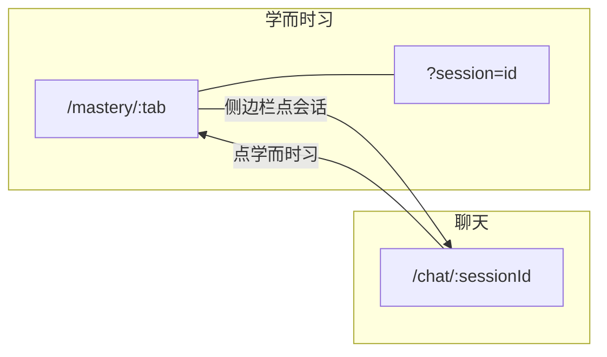
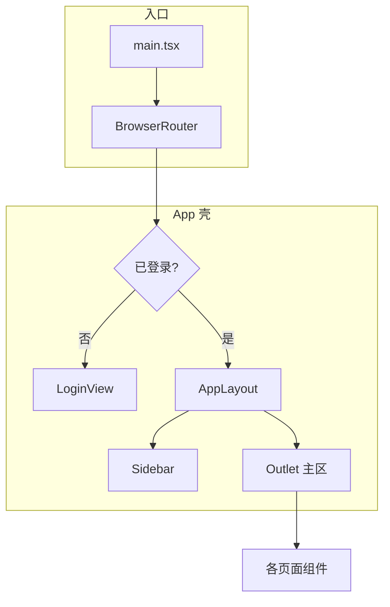

# 1. 背景
## 1.1. 起因
侧边栏切换标签（聊天 / 知识库 / 设置等）只改 React 状态 activeView，不更新浏览器地址栏；
用户无法收藏直链、刷新后回到默认聊天页、后退键不能在标签间切换。

## 1.2. 目标
每个页面有自己完整的网址，可收藏 / 后退 / 刷新。

# 2. 需求分析

## 2.1. 现状

App.tsx 用 activeView 和若干 React 状态驱动整站界面，地址栏始终停在根路径 /。带来的问题：

1. 无法收藏：在知识库、设置等页面无法复制有意义的链接。
2. 刷新丢失上下文：刷新后一律回到默认聊天页，子标签页、选中会话、知识库二级列表等全部重置。
3. 后退无效：侧边栏切换不产生历史记录，浏览器后退会离开站点而非回到上一页。
4. 跨页跳转不可分享：知识库 → Golden 管理（goldenJump）、Golden 返回知识库（kbReturn）等靠一次性 state，刷新即丢。

部署侧 nginx 已配置 try_files → index.html，单页应用（SPA）深链在服务端无阻碍；缺口在前端路由层。

## 2.2. 目标

登录后，用户在 AgentA 里看到的每一个有意义的页面位置都对应一条可读的网址。用户可以：

- 收藏或分享链接，他人（同权限）打开后看到相同页面；
- 用浏览器后退 / 前进在访问过的页面间切换；
- 刷新后仍停留在当前页面（含子标签页、选中会话等）；
- 未登录时打开深链，登录成功后自动跳回该链接。

## 2.3. 已确认决策

| 决策          | 选择                                      |
| ----------- | --------------------------------------- |
| 网址深度        | 尽量完整：主视图 + 子标签页 + 聊天会话 + 知识库别名 + 跨页查询参数 |
| 实现方式        | 引入 react-router-dom ^7（与 React 19 对齐） |
| 非管理员访问管理员路径 | 留在路径，主区显示「无权限」                          |
| 未登录深链       | 登录后恢复登录前请求的网址                           |
| 学而时习网址      | /mastery/:tab?session=，会话用查询参数表示助手面板状态  |
| 侧边栏点会话      | 保持现状：一律进 /chat/:sessionId               |
| 助手面板开/关     | 不进网址，继续 localStorage                    |
| 数据库页命名      | 网址与 ViewKind 统一用 database（废弃 dbshow）      |

## 2.4. 路由表

根路径 / 重定向到 /chat。

| 视图   | 路径                              | 备注                                                              |
| ---- | ------------------------------- | --------------------------------------------------------------- |
| 聊天   | /chat，/chat/:sessionId          | 无 sessionId 时行为与现有一致（列表首条或自动新建）                                 |
| 知识库  | /kb，/kb/:alias                  | alias 对应二级文档列表                                                  |
| 记忆   | /memory                         |                                                                 |
| 规则   | /rules                          |                                                                 |
| 技能   | /skills                         | 管理员                                                             |
| MCP  | /mcp                            | 管理员                                                             |
| 学而时习 | /mastery，/mastery/:tab?session= | tab：plans / quizzes / srs；见 2.5                                 |
| 用量   | /usage，/usage/:tab              | tab：mine / savings / all / savings_all / pricing                |
| 质量看板 | /quality，/quality/:tab          | tab：trace / security_runtime / offline / golden                 |
| 数据库  | /database，/database/:tab        | tab：chroma / bm25 / sqlite / maintenance；管理员                    |
| 备份   | /backup                         | 管理员                                                             |
| 设置   | /settings，/settings/:section    | section：profile / password / system / apikeys / users / account |


## 2.5. 学而时习

学而时习页分左右两块：左侧学习主区（计划 / 测验 / 复习三个标签页），右侧 AI 助手（内嵌 ChatView，可收起、可拖拽宽度）。

网址设计：

```
/mastery/:tab?session=<sessionId>
```

示例：/mastery/plans?session=abc123 表示「学习计划」标签页 + 助手使用会话 abc123。


| 操作               | 网址变化                             |
| ---------------- | -------------------------------- |
| 切标签页             | 改路径段，保留 ?session=                |
| 助手内换会话           | 只改 ?session=，留在学而时习              |
| 侧边栏点某会话          | /chat/:sessionId（语义：我要去聊天页）      |
| 从 /chat/A 切到学而时习 | /mastery/plans?session=A（带上当前会话） |
| 收起 / 展开助手        | 网址不变；chatOpen 仍存 localStorage    |


跨视图会话同步（全局只有一个 activeSessionId）：



打开学而时习页时：网址带 ?session= 则默认展开助手；否则沿用 localStorage 中的 chatOpen。面板宽度、帮助引导是否关闭仍只存 localStorage，不进网址。

## 2.6. 跨页查询参数

把现有 goldenJump / kbReturn / goldenTabSignal 一次性 state 改为网址可表达：

- 知识库点进 Golden：/quality/golden?docId=xxx&fromAlias=yyy
- Golden 返回知识库：/kb/fromAlias
- 入库完成提示「去 Golden 管理」：/quality/golden（无 docId 筛选）

查询参数变化写入浏览历史，后退可还原筛选状态。

## 2.7. 侧边栏会话

- 选中会话 → 导航到 /chat/:sessionId
- 新建会话 → 创建后跳到新会话的网址
- 删除当前会话 → 按现有逻辑选下一个，并更新网址

## 2.8. 权限与非法路径

管理员专属路径（skills / mcp / database / backup，以及 quality 的 golden / offline 标签页、usage 的管理员标签页、settings 的管理员分区）：非管理员直接打开时，侧边栏仍高亮对应项，主区显示「无权限」提示，不静默跳转。

非法标签页 / 分区 / sessionId / alias：回退到该视图的默认子页（如 /quality/trace、/settings/profile）；sessionId 不存在时回 /chat 并选列表首条（或自动新建，与现逻辑一致）。

学而时习 ?session= 指向已删除或不存在的会话：丢弃该查询参数，回落到 AppLayout 当前内存会话（或列表首条），与 chat 兜底对齐；不因此新建会话。

## 2.9. 登录流

- 未登录访问任意路径：展示登录页，记住 location.pathname + search。
- 登录 / 注册成功后：跳回记住的网址；若无则 /chat。
- 已登录用户访问 /：重定向 /chat。

## 2.10. 历史与导航

- 侧边栏切换视图、改路径跳转：默认压入历史记录（push），产生后退记录。
- 同一视图内仅查询参数微调（如 Golden 换筛选）：压入历史记录，可后退还原。
- 程序性重定向（非法标签页修正、权限兜底、未知路径 *）：替换当前历史记录（replace），避免历史栈垃圾条目。

## 2.11. 不在本期

- 后端 API 路径改动（纯前端路由）。
- 知识库二级列表内的分页 / 筛选 / 搜索进网址（仅别名层级）。
- 数据库页内表行选中、Chroma 条目详情等三级状态。
- 学而时习助手面板宽度、帮助引导开关（仍 localStorage）。

## 2.12. 验收标准

1. 侧边栏每个入口切换后，地址栏变为 2.4 路由表对应路径；刷新后视图与子标签页不变。
2. 选中某聊天会话，网址为 /chat/id；复制链接在新标签打开（同账号）后进入同一会话。
3. 知识库进入某库二级列表，网址为 /kb/alias；刷新仍在该库。
4. 知识库 → Golden 带 docId 筛选，网址含查询参数；后退回到知识库原页面。
5. 在聊天 / 知识库 / 设置间切换后，浏览器后退逐步还原，不会直接离开站点。
6. 非管理员打开 /skills，主区显示无权限，网址保持 /skills。
7. 未登录打开 /memory，登录后自动进入 /memory。
8. 学而时习：/mastery/quizzes?session=A 刷新后标签页和会话不变；从 /chat/A 切入学而时习后网址带 session=A。
9. 生产构建 + nginx 单页应用回退：直接访问 /quality/golden?docId=xxx 能正常加载（非 404）。

## 2.13. 设计测试


| #   | 操作                     | 预期                                     |
| --- | ---------------------- | -------------------------------------- |
| T1  | 登录 → 点「知识库」→ 选一个库      | 网址 /kb/alias，刷新仍在该库                    |
| T2  | 聊天选会话 A → 切到设置 → 后退    | 回到 /chat/A，消息仍在                        |
| T3  | 知识库文档点「Golden」         | 网址 /quality/golden?docId=…&fromAlias=… |
| T4  | Golden 点「返回知识库」        | 网址 /kb/alias                           |
| T5  | 普通用户直接输入 /database     | 无权限提示，网址不变                             |
| T6  | 退出登录 → 访问 /memory → 登录 | 进入 /memory                             |
| T7  | 输入 /quality/nope       | 落到 /quality/trace（替换当前历史记录）            |
| T8  | 硬刷新任意深链                | 页面正常，控制台无路由相关报错                        |
| T9  | 构建后预览，直接打开 /chat/id    | 200，会话正确加载                             |
| T10 | 学而时习切标签页 + 助手换会话 → 刷新  | 网址 /mastery/:tab?session=id 不变         |
| T11 | /chat/A → 点学而时习        | 网址 /mastery/plans?session=A            |
| T12 | 学而时习内点侧边栏会话 B          | 网址 /chat/B                             |
| T13 | 删除会话 A 后刷新 /mastery/plans?session=A | ?session= 被丢弃，助手用剩余有效会话              |

# 3. 设计

## 3.1. 总体框架

用 react-router-dom 的 BrowserRouter 接管前端导航；网址为唯一页面状态来源，侧边栏与各主区视图从网址派生，不再维护 activeView。



AppLayout 保留现有会话列表、useChat、Sidebar；主区由 Routes + Outlet 渲染。goldenJump / kbReturn / goldenTabSignal 三个一次性 state 删除，改由网址与查询参数表达。

## 3.2. 路由结构

路由表与需求 2.4 一致。实现上采用「扁平路径 + 可选动态段」，默认子页用 Navigate（replace）补齐。

| 路径模式               | 组件                | 默认重定向                          |
| ------------------ | ----------------- | ------------------------------ |
| /                  | —                 | → /chat                        |
| /chat              | ChatPage          | 会话就绪后 replace → /chat/:sessionId（见 3.3） |
| /chat/:sessionId   | ChatPage          | —                              |
| /kb                | KnowledgeBaseView | —                              |
| /kb/:alias         | KnowledgeBaseView | —                              |
| /memory            | MemoryView        | —                              |
| /rules             | RulesView         | —                              |
| /skills            | SkillsPage        | —                              |
| /mcp               | MCPPage           | —                              |
| /mastery           | —                 | → /mastery/plans               |
| /mastery/:tab      | MasteryPage       | 非法 tab → /mastery/plans        |
| /usage             | —                 | → /usage/mine                  |
| /usage/:tab        | UsagePage         | 非法 tab → /usage/mine           |
| /quality           | —                 | → /quality/trace               |
| /quality/:tab      | QualityPage       | 非法 tab → /quality/trace        |
| /database          | —                 | → /database/chroma             |
| /database/:tab     | DatabasePage      | 非法 tab → /database/chroma      |
| /backup            | BackupPage        | —                              |
| /settings          | —                 | → /settings/profile            |
| /settings/:section | SettingsPage      | 非法 section → /settings/profile |
| *                  | —                 | replace → /chat                |


带标签页的视图（mastery / usage / quality / database / settings）内部不再自持 tab state，改读 useParams，点标签时 navigate 到新路径。

非法路径、缺省子页、通配 * 等程序性跳转一律 Navigate replace，与 2.10 一致。

侧边栏高亮：由 pathname 映射 ViewKind（与现 ViewKind 枚举对齐），不再接收 activeView prop。

## 3.3. 会话解析

全局仍只有一个 activeSessionId，由当前网址解析，供 useChat、Sidebar、学而时习助手共用。

会话的拉取与「空则新建」只在 AppLayout 一处执行（沿用现 App.tsx 第 68–91 行逻辑，迁入 AppLayout）。ChatPage 不调用 createSession，不重复拉列表；只读 AppLayout 下发的 sessions 与就绪状态，在需要时用 replace 补齐网址。

| 当前路径             | sessionId 来源               |
| ---------------- | -------------------------- |
| /chat/:sessionId | 路径参数 sessionId             |
| /mastery/:tab    | 查询参数 session（可选）           |
| 其他               | 沿用上次有效 sessionId（内存），不写进网址 |

AppLayout 初始化（唯一来源）：

1. 登录后拉 sessions 列表；
2. 列表为空 → 调用 createSession 一次，写入 sessions；
3. 标记 sessionsReady，供子路由消费。

/chat 无 sessionId 时：等 sessionsReady 后，ChatPage 用 replace 跳到 /chat/当前 activeSessionId（即列表首条或上一步新建的那条）。不在 ChatPage 内再判空、再建。

/chat/:sessionId 在列表中不存在：AppLayout 将 activeSessionId 校正为列表首条（列表空则走上面第 2 步新建），ChatPage replace 到 /chat/校正后的 id。

/mastery/:tab?session= 无效（已删除或不存在）：AppLayout 丢弃该参数，activeSessionId 回落到内存中的有效会话（或列表首条）；MasteryPage replace 去掉 ?session= 或改为有效 id。不为此新建会话。

侧边栏选会话、新建会话、删除会话：一律 navigate 到对应 /chat/:sessionId（需求 2.7）。新建会话仍由 AppLayout 的 handleCreate 调 API，成功后 navigate。

学而时习助手内换会话：navigate 到 /mastery/:tab?session=新 id，不离开学而时习。

从 /chat/A 进入学而时习：navigate 到 /mastery/plans?session=A（无 tab 记忆时默认 plans）。

## 3.4. 权限

管理员专属路径分两类处理：


| 类型      | 路径                                                                                                                                                         | 非管理员行为                |
| ------- | ---------------------------------------------------------------------------------------------------------------------------------------------------------- | --------------------- |
| 整页管理员   | /skills、/mcp、/database、/backup                                                                                                                             | 渲染 ForbiddenView，网址不变 |
| 页内管理员标签 | /quality/golden、/quality/offline、/quality/security_runtime；/usage/all、/usage/savings_all、/usage/pricing；/settings/system、/settings/apikeys、/settings/users | 同上                    |


ForbiddenView：主区居中简短提示「无权限访问此页面」，侧边栏仍高亮当前入口。

权限判定集中在 frontend/src/routes/access.ts（路径 + tab/section → 是否需管理员），路由组件入口调用，避免各页面散落重复判断。

## 3.5. 登录回跳

未登录时，App 在 auth 分支首帧用 useLocation 把 pathname + search 写入 App 层 ref（或 sessionStorage），不依赖 LoginView 内部 state——登录成功后 user 变真、LoginView 卸载，挂在子组件 state 上的回跳目标会丢。

流程：

1. App 判定 !user 且非 authLoading：立即记录 location.pathname + location.search 到 pendingRedirectRef；
2. 渲染 LoginView（只负责表单，不持有回跳目标）；
3. login / register 成功后，App 读 pendingRedirectRef，navigate(目标, { replace: true })；无记录则 /chat；
4. 用完后清空 pendingRedirectRef。

已登录用户访问 /：Navigate replace 到 /chat。

authLoading 期间仍显示全屏「加载中…」，不闪登录页。

## 3.6. 跨页查询参数

知识库 → Golden 管理：


| 查询参数      | 含义                               |
| --------- | -------------------------------- |
| docId     | 来源文档 ID，传给 GoldenManager 作筛选     |
| fromAlias | 来源知识库别名，供「返回知识库」跳转 /kb/fromAlias |
| docLabel  | 来源文档展示名（可选，缺省用 docId 显示）         |


知识库 L2 点 Golden：navigate(/quality/golden?docId=…&fromAlias=…&docLabel=…)。

Golden 返回知识库：navigate(/kb/fromAlias)，删除 kbReturn state。

入库完成提示「去 Golden 管理」：navigate(/quality/golden)。

QualityPage 从 useSearchParams 读 docId / fromAlias / docLabel，组装 GoldenDocFilter 传给 GoldenManager；清除筛选时 navigate 去掉对应 query（push，可后退）。

## 3.7. 学而时习

MasteryPage 读 :tab 与 ?session=。


| 场景            | 行为                                             |
| ------------- | ---------------------------------------------- |
| 网址带 ?session= | 展开助手（覆盖 chatOpen 仅当次进入；之后仍由 localStorage 记住开闭） |
| ?session= 无效   | 丢弃参数，回落到 AppLayout 有效会话（见 3.3）              |
| 助手内换会话        | navigate 更新 ?session=                          |
| 切标签页          | navigate /mastery/新tab，保留 ?session=            |
| 侧边栏点会话        | navigate /chat/:sessionId                      |


chatOpen、chatWidth、introDismissed 逻辑留在 MasteryView，不进网址。

## 3.8. 文件改动


| 操作            | 文件                                                                                |
| ------------- | --------------------------------------------------------------------------------- |
| 新增依赖          | frontend/package.json（react-router-dom ^7）                                          |
| 路由入口          | frontend/src/main.tsx（包 BrowserRouter）                                            |
| 路径与映射         | frontend/src/routes/paths.ts（ViewKind ↔ 路径、默认 tab）                                |
| 权限规则          | frontend/src/routes/access.ts                                                     |
| 布局壳           | frontend/src/routes/AppLayout.tsx（Sidebar + Outlet + 会话/useChat）                  |
| 无权限页          | frontend/src/components/layout/ForbiddenView.tsx                                  |
| 路由表           | frontend/src/routes/AppRoutes.tsx                                                 |
| 瘦身            | frontend/src/App.tsx（auth 门禁、pendingRedirectRef、AppRoutes）                         |
| 侧边栏           | frontend/src/components/sidebar/Sidebar.tsx（navigate 替代 onSwitchView）             |
| 知识库           | frontend/src/components/kb/KnowledgeBaseView.tsx（读 :alias，删 returnToAlias）        |
| 质量看板          | frontend/src/components/eval/QualityView.tsx（读 :tab 与 query，删 goldenJump 等 props） |
| 学而时习          | frontend/src/components/business/MasteryView.tsx（读 :tab 与 ?session=）              |
| 用量 / 数据库 / 设置 | UsageView、DatabaseView、SettingsPage（tab/section 改网址驱动）                            |
| 登录            | frontend/src/components/auth/LoginView.tsx（仅表单；回跳由 App 层处理）                      |


不动后端、不动配置项、不动数据库 schema。

## 3.9. 命名优化

数据库管理页统一用 database，废弃 dbshow：

| 层面 | 旧 | 新 |
|---|---|---|
| 网址 | /dbshow、/dbshow/:tab | /database、/database/:tab |
| ViewKind | dbshow | database |
| 组件 | DatabaseView（已是现名，不动） | — |

legacy 代码中 ViewKind 已改为 database（Sidebar.tsx、App.tsx）；路由实现 paths.ts / access.ts 直接用 /database。不设 /dbshow → /database 重定向（本项目无历史外链负担）。

CLI 工具 tools/db_show.py 与前端路由无关，不在此次改名范围。

## 3.10. 影响面


| 维度        | 是否涉及                    |
| --------- | ----------------------- |
| 后端 API    | 否                       |
| DB schema | 否                       |
| 配置项       | 否                       |
| 向后兼容      | 旧书签 / 根路径自动重定向，无破坏性     |
| 部署        | nginx try_files 已就绪，无需改 |


## 3.11. 实现步骤

1. 安装 react-router-dom ^7，main.tsx 挂 BrowserRouter。
2. 新增 paths.ts、access.ts，定义路径常量与 ViewKind 映射。
3. 从 App.tsx 抽出 AppLayout：迁入会话初始化 effect（唯一来源）、useChat、Sidebar、Outlet。
4. 实现 AppRoutes；ChatPage 只做 replace 补齐网址，不建会话；通配 * 用 replace → /chat。
5. App 层 pendingRedirectRef：未登录首帧记 location，登录成功后 navigate 回跳。
6. 改 Sidebar：navigate 切视图，pathname 推导高亮。
7. 无 tab 的视图（memory / rules 等）接路由。
8. 有 tab 的视图（usage / quality / database / settings / mastery）改网址驱动；mastery 无效 ?session= 兜底。
9. 知识库 alias、Golden 跨页 query，删除 goldenJump / kbReturn / goldenTabSignal。
10. ForbiddenView + 权限门禁。
11. 按需求 2.13 设计测试逐项手工验收。


## 3.12. 调试

- 开发期直接看地址栏与 React Router DevTools（可选安装）确认路径与查询参数。
- 会话异常（空白聊天、跳错会话）：在 AppLayout 临时打 log 输出「解析到的 sessionId / sessions 列表」，验收后删除。
- 深链 404：确认 vite dev 与 nginx 均把未知路径回退到 index.html。

