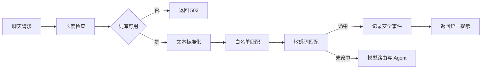

# 1. 背景

ICP 备案成功后，申请了公安备案：新办网站申请。
申请审核不通过，不通过原因为：未建立审核机制，未建立实名制，未落实输出审核机制

# 2. 分析

根据 agenta 当前实现和资质，分析差了什么，如何修改或规避
目标：能够通过公安备案审核

# 3. 待确认

你好，我了解了一下情况，现在个人主体无法申请短信签名，因此无法采用手机短信验证码完成实名认证。
这个网站只是我个人学习用的，也不打算对外开放，所以我删除了注册功能和已有其它账号，现在只能我自己使用。请问这种方式是否符合备案要求？


- 个人主体能否采用管理员人工核验并开通账号？
- 审核机制需要提交哪些截图、制度和后台记录？
- “是否提供互联网交互服务”应选择哪一具体服务类型？

# 4. 整改

## 4.1. 删除注册功能

登录界面只能登录，不能注册


## 4.2. 建立审核机制

### 4.2.1. 前置过滤

#### 4.2.1.1. 实现方式选择
自研 Trie 树

| 类型 | 实现方式 | 示例 |
|---|---|---|
| 关键词黑名单 | Trie 树 / Aho-Corasick 算法 | 涉政、涉暴、色情词库 |
| 正则规则 | 身份证号、手机号、银行卡号脱敏 | `\d{18}`、`1[3-9]\d{9}` |
| Prompt 注入检测 | 检测越狱前缀（如 "ignore previous instructions"） | 维护已知攻击模式库 |
| 输入长度/频率限制 | 防资源滥用 | 单用户 QPS 限制、Token 上限 |

VS

接入开源敏感词库（如 sensitive-word-filter 类项目）

决策：选接入开源敏感词库

#### 4.2.1.2. 需求分析

采用国内开源项目 houbb/sensitive-word-data 作为初始词库，保留 Apache-2.0 许可证声明。词库经人工审核和裁剪后随项目部署，第一版不超过 5000 词，运行时不联网更新。

- 所有用户输入在进入 Agent 前检查，管理员账号也不能绕过。
- 命中启用词条后直接拦截，不调用模型、联网搜索、知识库或其它工具。
- 页面只提示输入不符合使用规则，不展示命中词条和内部分类。
- 支持全角半角、英文大小写、零宽字符、简单拆词及繁简体处理；白名单优先。
- 记录用户、时间、词库版本、命中词条、分类和处置结果，不重复保存完整输入。
- 词库加载失败时停止聊天功能，不能在过滤失效后继续提供服务。

#### 4.2.1.3. 设计

##### 4.2.1.3.1. 流程



同步聊天和流式聊天共用同一个检查函数。检查位置在消息长度校验之后、模型路由和语义缓存之前，保证命中后不会调用分类模型、Agent、联网搜索或知识库。

##### 4.2.1.3.2. 模块

新增 src/services/sensitive_word_filter.py，负责词库加载、文本标准化、白名单处理和敏感词匹配。过滤器在进程内保持单例，应用启动时加载一次，不新增独立服务。

匹配器使用 pyahocorasick 。词库放在 resources/sensitive_words/，包含：

- deny.tsv：启用词条及分类，人工裁剪后总数不超过 5000。
- allow.txt：误报白名单。
- metadata.json：上游项目、提交版本、生成时间和词库版本。
- LICENSE：上游 Apache-2.0 许可证。

不把上游 6 万余条原始词库全部部署到服务器。词库更新在开发环境人工完成，审核后随代码发布，线上不连接代码托管平台。

##### 4.2.1.3.3. 匹配规则

输入先执行 Unicode NFKC 标准化、英文小写转换、零宽字符清除、全半角统一和常见分隔符处理。繁简体使用随词库生成的轻量映射表统一，不在服务器加载额外语言模型。

先标记白名单命中的文本范围，再执行敏感词匹配；完全落在白名单范围内的命中忽略。其它命中全部拦截。返回结果只包含是否命中、词条、分类和词库版本，不保存标准化后的完整输入。

##### 4.2.1.3.4. 接口接入

src/api/routes/chat.py 新增共用检查函数，由 POST /api/chat 和 POST /api/chat/stream 调用：

1. 过滤器未就绪时返回 HTTP 503，提示聊天暂不可用。
2. 命中时写入安全事件，以正常助手回复返回统一提示「尊敬的用户您好，让我们换个话题再聊聊吧。」，不调用模型。
3. 未命中时继续现有流程。

检查逻辑不判断用户角色，管理员和普通用户执行相同规则。CLI 不属于公网服务，本次不改。

##### 4.2.1.3.5. 审计

复用 security_events 表，不修改数据库结构。新增 input_filter 事件类型，detail 使用 JSON 保存词库版本、命中词条、分类和处理结果，不保存完整输入。
记录失败只写服务端错误日志，当前请求仍然拦截。

管理后台现有安全事件面板增加“输入过滤”类型，供复审时查看命中记录。

##### 4.2.1.3.6. 失败处理

src/api/main.py 在应用启动阶段加载词库。
加载失败时保留登录、管理和健康检查功能，但将过滤器标记为不可用；所有聊天请求返回 503。
服务端日志记录具体加载错误，不能退回到无过滤状态。


#### 4.2.1.4. 词库部署

词库在开发机生成，审核后随代码发布到服务器；线上进程只读本地文件，不联网拉取上游。

**目录**（resources/sensitive_words/）

| 文件 | 运行时 | 说明 |
|---|---|---|
| deny.tsv | 是 | 黑名单，词条与分类（tab 分隔）；build 生成，上限 5000 |
| allow.txt | 是 | 白名单；build 从上游同步 |
| trad_simp.tsv | 是 | 繁简映射；手工维护，build 不改写 |
| extra.tsv | 否 | 人工补词源表；build 时合并进 deny.tsv，始终保留 |
| metadata.json | 是 | 上游版本、生成时间、词条数 |
| LICENSE | 否 | 上游 Apache-2.0 声明 |

**开发机生成词库**

使用工程虚拟环境执行 tools/cli/sensitive_word_cli.py：

```text
# 查看当前词库
python tools/cli/sensitive_word_cli.py status

# 从 GitHub 拉取 houbb/sensitive-word-data 并裁剪（默认最多 5000 词）
python tools/cli/sensitive_word_cli.py build

# 公司网络需代理（务必带端口）
python tools/cli/sensitive_word_cli.py build --proxy http://10.144.1.10:8080

# 离线：先 git clone houbb/sensitive-word-data，再指定本地目录
python tools/cli/sensitive_word_cli.py build --source-dir D:\src\sensitive-word-data

# 仅保留政治 + 违法类（标签 0、4）
python tools/cli/sensitive_word_cli.py build --tags 0,4
```

上游 houbb 标签：0 政治、1 毒品、2 色情、3 赌博、4 违法。裁剪时 extra.tsv 词条优先保留，其余按分类优先级（政治优先）在配额内选取。

**人工补词**

上游未收录但需拦截的词，写入 `extra.tsv`（**不直接改** `deny.tsv`）。运行时只读 `deny.tsv`，`extra.tsv` 是人工维护的源表，须经 `build` 合并后才会生效。

**格式**（与 `deny.tsv` 相同：一行一词，`词` 与 `分类` 之间用 **Tab**，不要用空格）：

```text
# 以 # 开头的整行是注释，build 会跳过
情色	porn
砒霜	illegal
六四	politics
六四事件	politics
```

常见分类：`politics`（政治）、`porn`（色情）、`illegal`（违法）、`drugs`（毒品）、`gambling`（赌博）；多分类用英文逗号，如 `politics,illegal`。

**编辑方式**：`extra.tsv` 是纯文本，无需编译。Cursor / VS Code 若用表格扩展打开，会以表格展示两列，保存后底层仍是 Tab 分隔；格式异常时改用「Open With → Text Editor」检查，避免引号、行首缩进或空格代替 Tab。

**补词后必须重新 build**（仅改 `extra.tsv` 不会更新线上词库）：

```text
python tools/cli/sensitive_word_cli.py build --proxy http://10.144.1.10:8080
python tools/cli/sensitive_word_cli.py status
```

确认 `deny.tsv` 中已出现新词（例如 `grep` 或全文搜索 `砒霜`）。`extra.tsv` 中的词条在 build 时**始终保留**，不会被 5000 上限挤掉。补词后须人工过目再发布。

**发布与生效**

1. 检查 deny.tsv、metadata.json 变更合理，extra.tsv 已审核。
2. 与代码一并提交、部署（git pull / 发布包覆盖均可）。
3. 重启后端（python -m src.api.run 或 systemd agenta-backend），启动日志应出现敏感词库加载完成。
4. 发一条应被拦截的测试句，确认页面为普通助手回复而非错误框；管理后台「实时安全监控」可见 input_filter 记录。

**线上约束**

- 不在服务器执行 build，不配置词库路径环境变量。
- 词库加载失败时聊天返回 503，登录与管理功能仍可用。


### 4.2.2. 模型自审

在 System Prompt 中植入审核指令

### 4.2.3. 后置拦截与审计

| 机制 | 作用 |
|---|---|
| 输出敏感词二次扫描 | 防止模型生成违规内容 |
| 语义相似度检测 | 对比已知违规案例库（向量检索） |
| 日志全量留存 | 用户 ID、时间、输入、输出、审核结果，保留 6 个月以上 |
| 人工抽检队列 | 高风险/随机抽样人工复核 |
| 用户举报通道 | 形成闭环反馈 |

### 4.2.4. 分类处置策略

| 风险等级 | 处理方式 |
|---|---|
| 安全 | 直接输出 |
| 低敏感（如医学、法律咨询） | 输出 + 追加免责声明 |
| 中风险（如边缘政治、争议话题） | 拒绝回答 / 提供中性事实 / 转人工 |
| 高风险（涉政、涉暴、色情、违法） | 直接拦截，记录日志，必要时封禁用户 |

### 4.2.5. 合规点

| 合规项 | 实现建议 |
|---|---|
| ICP 备案 + 算法备案 | 生成式 AI 服务需按《生成式人工智能服务管理暂行办法》备案 |
| 内容标识 | AI 生成内容需添加水印/标识 |
| 未成年人保护 | 实名认证或年龄验证，禁止向未成年人提供不适内容 |
| 数据不出境 | 用户数据、对话记录存储在境内服务器 |
| 7×24 小时巡查 | 配合网信部门内容巡查，建立应急响应机制 |