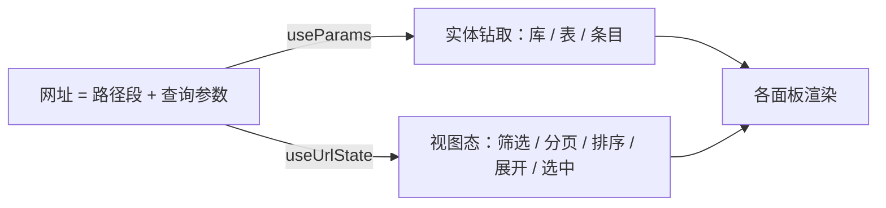

# 背景

在 [完整URL](i1.1_11_url_whole.md) 中实现了 URL 分级，但是只支持到第二层， 如http://47.96.93.237/database/sqlite。对于更深的路径则保存原来实现。

# 需求

支持所有页面，所有层级的完整 URL 访问。

## 需求分析

### 现状

完整 URL（见 i1.1_11_url_whole.md）已把主视图、子标签页、聊天会话、知识库别名、Golden 跨页查询参数写进网址，大致覆盖到第二层，例如 /database/sqlite、/quality/golden、/settings/system、/kb/:alias、/chat/:sessionId、/mastery/:tab?session=。

同一份文档的「不在本期」里明确留下了更深状态没做：知识库列表内的分页、筛选、搜索，数据库页内的库、表、条目详情等。这些仍靠组件内本地状态驱动，刷新会丢，也无法收藏或分享直链。

### 目标

凡是用户眼里「我停在某个有意义的页面位置」，都应对应一条可读网址。打开该链接（同权限）应落到同一位置；刷新、后退、前进的行为与 i1.1_11_url_whole.md 已定规则保持一致。

有意义的页面位置指：能独立理解、值得收藏或分享的位置，例如某库某表、某条目详情、某配置分组、某条 Trace 详情。弹窗、确认框、表单草稿、批量勾选、折叠块等过程态仍不进网址。

### 本期范围

按收藏、分享价值从高到低，本期六块全做：

1. 数据库钻取（缺口最大）：Chroma / BM25 选中库到条目详情；SQLite 选中库到表，行详情可选；维护页无子导航，暂不加深。
2. 知识库文档列表：在 /kb/:alias 上用查询参数表达分页、排序、筛选、搜索。
3. 技能 / MCP：展开到某一项，如 /skills/:name、/mcp/:name，或等价查询参数。
4. 设置 · 系统配置：配置分组进网址，搜索框可选。
5. 用量 / 质量看板：常用时间范围等筛选进查询参数；Trace 详情 id、离线评估任务子页进网址；Golden 已有 docId，其余列表筛选可选。
6. 学而时习：计划、测验的选中项进网址；SRS 复习过程态不进。

### 已确认决策

需求讨论时确认了三项，均取推荐方案：

| 决策 | 选择 |
| --- | --- |
| 本期深度 | 上面六块全做 |
| 数据库 URL 形态 | 路径表达位置，如 /database/sqlite/:db/:table、/database/chroma/:coll；条目用路径或 ?item= |
| 列表分页 / 筛选 / 搜索 | 进查询参数，刷新可还原、可分享筛选后的列表 |

### 不在本期

- 后端 API 路径改动，仍是纯前端路由。
- 弹窗、确认框、批量勾选、表单草稿、未保存的编辑。
- 聊天页的块折叠、输入草稿、附件、深度研究开关，沿用现有存储。
- 学而时习助手面板宽度与开关，仍存 localStorage。
- SRS 复习进度等过程态。
- 备份页，没有实质更深位置。

### 沿用既有约定

登录深链恢复、非管理员留在路径并显示无权限、非法段用 replace 回默认子页、侧边栏切换默认 push，均沿用 i1.1_11_url_whole.md，本期不重开。

### 验收标准

1. 数据库：打开到某 SQLite 表、某 Chroma 条目的链接，刷新后仍在同一位置。
2. 知识库：带筛选、分页的列表链接，刷新后筛选与页码不变。
3. 技能或 MCP：展开某项的链接，刷新后该项仍展开或进入对应详情态。
4. 设置系统配置：选中某分组后刷新，仍停在该分组。
5. 用量、质量：带时间范围（及 Trace、离线子页若纳入）的链接，刷新后状态一致。
6. 学而时习：选中计划、测验的链接，刷新后仍选中该项。
7. 过程态（弹窗、草稿等）不进入网址；浏览器后退不出现无意义垃圾条目，程序性修正仍用 replace。

### 设计测试

| # | 操作 | 预期 |
| --- | --- | --- |
| T1 | 数据库选 SQLite 某库某表，复制链接新开 | 落到同一表 |
| T2 | Chroma 打开某条目详情后刷新 | 仍在该条目 |
| T3 | 知识库某库筛选后翻页，再刷新 | 筛选与页码保留 |
| T4 | 技能展开某项后刷新 | 该项仍展开 |
| T5 | 设置系统配置切分组后刷新 | 仍在该分组 |
| T6 | 用量改时间范围后刷新 | 范围不变 |
| T7 | 打开某 Trace 详情后刷新 | 仍在该详情 |
| T8 | 学而时习选中某计划后刷新 | 仍选中 |
| T9 | 打开带深层路径但无权限的链接 | 网址保留，主区显示无权限 |
| T10 | 非法深层段 | replace 到该视图合法默认位置 |


## 设计

### 总体思路

沿用 i1.1_11 的原则：网址是页面状态的唯一来源，深层位置也从网址派生，不再各自用组件内 useState 保存。

深层状态按语义分两类表达：

- 实体钻取用路径段：一层层进入某个库、某张表、某个条目。路径层级对应面包屑，符合「钻进去」的直觉。
- 筛选、分页、排序、搜索、展开、选中用查询参数：它们是同一层上的可选叠加，不构成新层级。

这两条对应需求「已确认决策」里数据库用路径、列表状态进查询参数的选择。



### 共享 hook：useUrlState

新增一个基于 react-router useSearchParams 的封装，供各面板直接读写查询参数，避免把大量筛选参数逐层透传 props（对应「已确认决策」的接入方式）。

它提供三件事：

- 读：按 key 取值并回退到默认值，带类型转换（数字、日期、枚举）。
- 写：传入补丁对象合并进当前查询串；等于默认值或空串的键自动删除，保持网址干净。
- 历史：默认 push，用户主动改筛选后可后退还原；可传 replace 用于程序性修正。

约定：改筛选或每页条数时，补丁里一并带上 page=1，复用旧组件「改筛选就归零页码」的行为。

路径段仍按 i1.1_11 风格用 useParams 读取，不走这个 hook。

### 路由表扩展

只有数据库需要新增路径段。其余视图的深层状态都走查询参数，路由表不变。

数据库统一为「标签页 + 至多两段可选路径」，两段的含义随标签页而定：

| 路径模式 | chroma / bm25 | sqlite |
| --- | --- | --- |
| /database/:tab | 库列表 | 库列表 |
| /database/:tab/:seg1 | 某库的条目 / 文档列表 | 某库的表列表 |
| /database/:tab/:seg1/:seg2 | 某条目 / 文档详情 | 某表的行数据 |

维护标签页没有更深层级。SQLite 行详情不进路径段，用查询参数 ?row=<主键>；没有稳定单一主键的表不进网址，能点开看但刷新不保留。

URL 示例：

```
/database/chroma/mylib               Chroma 某库条目列表
/database/chroma/mylib/a1b2c3        Chroma 某条目详情
/database/bm25/mylib/doc42           BM25 某文档详情
/database/sqlite/auth/users          SQLite 某表数据
/database/sqlite/auth/users?row=5    SQLite 某行详情
/database/chroma/mylib?page=2&sort=ingested_at&filename=readme   列表叠加筛选
```

### 各页查询参数

参数名统一取短名；未列出的过程态（弹窗、草稿、批量勾选等）不进网址。

| 页面 | 路径 | 查询参数 |
| --- | --- | --- |
| 数据库 Chroma / BM25 列表 | /database/:tab/:coll | page、size、filename、body、from、to、sort、dir |
| 数据库 SQLite 表数据 | /database/sqlite/:db/:table | page、size、uid、tcol、from、to、sort、dir、row |
| 知识库文档列表 | /kb/:alias | page、size、q、lang、ext、from、to、sort、dir |
| 技能 / MCP | /skills、/mcp | open（展开项，逗号分隔）、q、sort |
| 设置系统配置 | /settings/system | group（配置分组）、q（可选） |
| 用量 | /usage/:tab | range、metric、group、page |
| 质量 · 会话监控 | /quality/trace | range、scope、page、trace（详情 id） |
| 质量 · 实时安全 | /quality/security_runtime | type、uid、from、to、sort、page |
| 质量 · 离线评估 | /quality/offline | task（子任务 key） |
| 质量 · Golden | /quality/golden | docId、fromAlias、docLabel（沿用）、status、source、q（可选） |
| 学而时习 | /mastery/:tab | session（沿用）、plan、quiz |

### 各面板改造

改造方式一致：把原来的本地 useState 换成路径段（useParams）或查询参数（useUrlState），删掉「改筛选归零页码」等散落逻辑改由 hook 约定承担。

| 组件 | 现在的本地 state | 改为 |
| --- | --- | --- |
| DatabaseView 各面板 | sel、table、offset、pageSize、filters、sort、detail | coll / table 走路径段，其余走查询参数，行详情走 ?row= |
| KnowledgeBaseView LibraryView | listQuery | 查询参数 |
| SettingsView（仅路由页） | activeGroup、search | group、q 查询参数 |
| SkillsView / MCPView | expanded、query、sortDir | open、q、sort 查询参数 |
| UsageDashboard / SavingsPanel | range、metric、groupBy、page | 查询参数 |
| TraceDashboard / RuntimeMonitor | range、scope、page、筛选、详情 | 查询参数 |
| OfflineEvalView | activeKey | task 查询参数 |
| MasteryView | 计划 / 测验选中 | plan、quiz 查询参数 |

设置页有一处要区分：SettingsView 既作 /settings/system 路由页，也嵌入设置弹窗（embedded 模式）。只有路由页读写网址；嵌入弹窗仍用本地 state，不碰网址。

### 兜底与历史

- 非法标签页 / 分区（沿用 i1.1_11）：replace 到该视图默认子页。
- 非法实体段（库 / 表 / 条目不存在）：不强制跳转，面板显示「未找到」并给返回上层的入口，与列表筛选值非法一样容错。
- 非法查询参数（越界页码、未知排序键等）：回退到默认值，不报错。
- 历史记录：切库 / 表 / 条目、翻页、改筛选都用 push，可逐步后退；程序性修正用 replace。

### 权限

深层路径的权限判定沿用 access.ts，基本无需改动：数据库、技能、MCP 是整页管理员，新增的更深路径段自然继承；质量、用量、设置的管理员判定看第二段标签页 / 分区，仍是 parts[1]，深层查询参数不影响。

### 文件改动

| 操作 | 文件 |
| --- | --- |
| 新增共享 hook | frontend/src/routes/useUrlState.ts |
| 路径与查询参数构造、常量 | frontend/src/routes/paths.ts |
| 数据库路由加可选段 | frontend/src/routes/AppRoutes.tsx、frontend/src/routes/pages/DatabasePage.tsx |
| 数据库各面板改网址驱动 | frontend/src/components/admin/DatabaseView.tsx |
| 知识库列表改网址驱动 | frontend/src/components/kb/KnowledgeBaseView.tsx、DocumentList.tsx |
| 设置系统配置分组进网址 | frontend/src/components/settings/SettingsView.tsx |
| 技能 / MCP 展开进网址 | frontend/src/components/resources/SkillsView.tsx、MCPView.tsx |
| 用量筛选进网址 | frontend/src/components/usage/UsageDashboard.tsx、SavingsPanel.tsx |
| 质量各子页进网址 | frontend/src/components/eval/TraceDashboard.tsx、SecurityPanel.tsx、OfflineEvalView.tsx、GoldenManager.tsx |
| 学而时习选中进网址 | frontend/src/components/business/MasteryView.tsx |

不动后端、不动配置项、不动数据库 schema。

### 影响面

| 维度 | 是否涉及 |
| --- | --- |
| 后端 API | 否 |
| DB schema | 否 |
| 配置项 | 否 |
| 向后兼容 | 旧的二级网址（如 /database/sqlite）行为不变，只是更深层从「刷新丢失」变为「可还原」，无破坏性 |
| 部署 | nginx try_files 已就绪，无需改 |

### 实现步骤

1. 新增 useUrlState hook，约定读写、默认值删除、push / replace、改筛选归零页码。
2. paths.ts 补数据库多段路径构造与各页查询参数的键常量、解析 / 序列化。
3. AppRoutes、DatabasePage 加两段可选路径；DatabaseView 各面板改用路径段 + useUrlState，行详情用 ?row=。
4. 知识库 LibraryView 的 listQuery 改由网址驱动。
5. 设置系统配置：路由页读写 group / q；嵌入弹窗保持本地 state。
6. 技能 / MCP 的展开、搜索、排序进查询参数。
7. 用量、质量各子页、学而时习选中改网址驱动。
8. 按需求「设计测试」逐项手工验收。

### 调试

- 开发期直接看地址栏确认路径段与查询参数随交互变化，刷新后状态还原。
- 深层实体不存在：确认面板显示「未找到」且能返回上层，不白屏、不误跳。
- 深链 404：确认 vite dev 与 nginx 都把未知路径回退到 index.html。