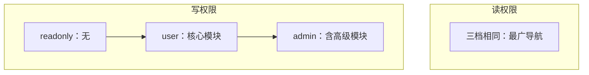
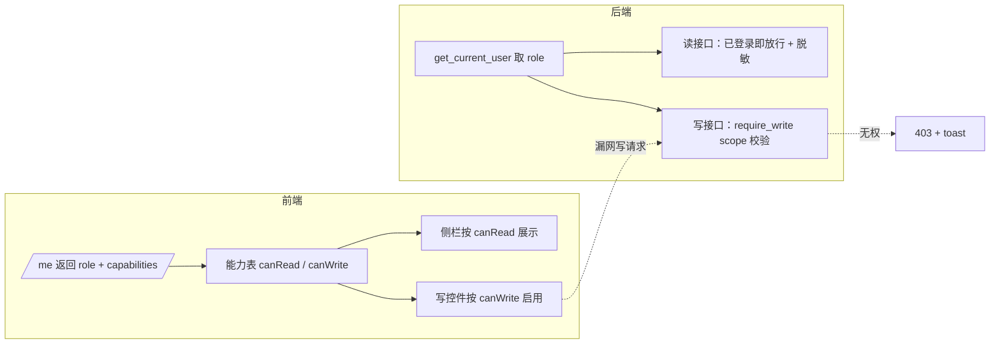

# 1. 背景

本网站备案为不对外提供交互服务，但需要向访客展示产品能力。

现有权限分两层：

- 主账号（用户名 = AUTH_ADMIN_USERNAME）：全部读写 + 用户管理
- 其它账号按 DB 字段 role 划分（本期重定为三档）

实现要求：

- 写权限按 readonly ⊂ user ⊂ admin 严格分级
- 读权限三档对齐为同一套最广导航（扩大现 user 可见范围，而不是缩小 readonly）
- 默认提供 guest 体验账号（role=readonly），访客可一键进入；有兴趣者可申请升档
- 主账号可在用户管理中修改任意账号的 role（含 readonly / user / admin）
- 登录页引导文案、登录后顶部提示条需随新角色体系重设计

# 2. 需求分析

## 2.1. 目标

在不开注册的前提下，让访客零门槛浏览尽量多的产品界面（只读）。正式用户在同一套导航上逐级解锁写能力：先能改核心业务，再能改高级管理功能。guest 是默认体验账号名，不是独立 role。

## 2.2. 现状与问题

| 维度 | 现状 | 问题 |
|---|---|---|
| 角色 | user / admin | 无法表达「能看不能改」 |
| 可见性 | admin 页仅 admin 可见 | user 看不到 Skills、数据库等，不利于理解产品全貌 |
| 前端 | isAdmin 同时管「看不看」和「改不改」 | 无法表达「能看不能改」 |
| 登录页 | 「联系我们获取体验账号」 | 与一键体验矛盾 |
| 顶部条 | 非 admin 统一「申请管理员权限」 | 未区分 readonly 与 user |

## 2.3. 权限模型

### 2.3.1. 核心原则：读广写窄

- 读：readonly = user = admin（同一套侧栏与路由，尽量多，见下表）；仅用户管理、密码与安全 / 注销不在此列（属账号写操作，不是展示页）
- 写：严格包含 readonly ⊂ user ⊂ admin（能写的模块一定能看，高档位写范围更大）
- 本期是扩大 user 能看到的界面，不是压缩 readonly 的界面

与现网对比：

| | 现网 user | 新 user | 新 readonly |
|---|---|---|---|
| 核心页（聊天、记忆等） | 可见可写 | 可见可写 | 可见只读 |
| 知识库 | 可见可写（入库） | 可见只读 | 可见只读 |
| 原 admin 页（Skills、数据库等） | 不可见 | 可见只读 | 可见只读 |
| 写 admin 模块 | — | 不可 | 不可 |

升档时侧栏基本不变，主要变化是按钮从灰掉变为可用：

- readonly → user：聊天、记忆、Rules、学而时习等核心模块可写（不含知识库入库）
- user → admin：知识库入库/删改、Skills、系统配置、备份操作等可写

### 2.3.2. 角色层级

- 主账号：不变，用户名判定，用户管理写权限
- readonly / user / admin：DB role 三选一，主账号可分配

### 2.3.3. 模块矩阵

图例：读 = 可进入页面浏览；写 = 可保存/上传/删除/触发 LLM 等；脱敏 = 可见但敏感字段打码；— = 不可见

| 模块 | readonly | user | admin |
|---|---|---|---|
| 聊天 | 读（样例会话，见下节） | 写 | 写 |
| 知识库 | 读 | 读 | 写（含上传 / 入库 / 删改） |
| 记忆 / Rules / 学而时习 | 读 | 写 | 写 |
| 用量看板（含全员 / 单价 tab） | 读 | 读 | 写 |
| 质量看板（含安全 / 离线 / Golden tab） | 读 | 读 | 写 |
| Skills / MCP | 读 | 读 | 写 |
| 数据库 | 读 | 读 | 写 |
| 备份与恢复 | 读（仅列表，脱敏） | 读（仅列表，脱敏） | 写（含下载/恢复） |
| 设置 · 个人信息 | 读 | 写 | 写 |
| 设置 · 密码与安全 / 注销 | — | 写 | 写 |
| 设置 · 系统配置 / API 密钥 | 读（脱敏） | 读（脱敏） | 写 |
| 设置 · 用户管理 | — | — | 仅主账号 |

说明：

- 知识库写操作仅 admin（相对现网 user 的收紧：user 可浏览、不可入库 / 上传 / 删文档）
- readonly 与 user 在原 admin 页上均为只读 UI + 后端拒绝写接口
- 用户管理仍仅主账号；备份下载/恢复、API 密钥改值等写操作仅 admin
- 密码/注销对 readonly 不可见：属账号写操作，不是展示向页面；不违背「读广」

### 2.3.4. 实现约定

- 后端：user_store 角色枚举加入 readonly（现为 user / admin 两值），create_user / update_role 的校验与默认值同步；读接口按「已登录」放行（原 require_admin 的读改为三档可读 + 脱敏）；写接口按 role 校验 scope
- 前端：能力表拆成 canRead(scope) / canWrite(scope)；侧栏按 canRead 展示，控件按 canWrite 启用
- 主账号：create_user / update_role 支持 readonly / user / admin

scope 一览（前后端共用，英文名即代码 identifier）：

| scope | 模块 | 读放行 | 写档位 |
|---|---|---|---|
| chat | 聊天 | 三档 | user 起 |
| kb | 知识库 | 三档 | 仅 admin |
| memory | 记忆 / Rules / 学而时习 | 三档 | user 起 |
| usage | 用量看板 | 三档 | 仅 admin |
| quality | 质量看板 | 三档 | 仅 admin |
| skills | Skills / MCP | 三档 | 仅 admin |
| db | 数据库 | 三档 | 仅 admin |
| backup | 备份与恢复 | 三档（脱敏） | 仅 admin |
| profile | 设置 · 个人信息 | 三档 | user 起 |
| account | 设置 · 密码与安全 / 注销 | user 起可见 | user 起 |
| config | 设置 · 系统配置 / API 密钥 | 三档（脱敏） | 仅 admin |
| users | 设置 · 用户管理 | 仅主账号 | 仅主账号 |

## 2.4. 进入体验方式

登录页保留账号密码，增加「立即体验」：

- 使用 site.json 中 demoAccount 凭据调用 POST /api/auth/login（仅登录页读取，不在联系页展示）
- 后端账号 guest，role=readonly，长期固定；主账号勿改 guest 角色，供多人同时只读浏览
- 需试用写能力：主账号另开 user / admin 账号，不走 guest
- 部署时确保 guest 存在且 role=readonly

## 2.5. 联系页

- 移除「体验账号」卡片（用户名/密码展示）；访客从登录页「立即体验」进入即可
- 联系页仅保留联系方式、notice、微信二维码等；site.json 仍保留 demoAccount 供登录页使用

## 2.6. 聊天（readonly）

- 不做特殊处理：会话照常从 DB 读，仅禁用新建 / 发送 / 编辑 / 删除；发不出消息即天然零 token，无需样例会话预置或零 token 特判
- guest 账号下的既有会话即访客能看到的内容（可放几段示例）
- user / admin 聊天与现网一致（可写）

## 2.7. 登录页文案重设计

替换 LoginView 底部「本站不开放注册。请 联系我们 获取体验账号。」

### 2.7.1. 布局

登录按钮下：

1. 「立即体验（只读浏览）」按钮
2. 辅助说明一行 + 联系链接

### 2.7.2. 文案（推荐）

- 按钮：`立即体验（只读浏览）`
- 辅助：`本站不开放注册。如需开通可编辑账号或管理员权限，请` [联系我们]

## 2.8. 登录后顶部提示条重设计

替换 UserFeatureBanner，按 role 分档；admin / 主账号不显示。

| role | 文案（推荐） |
|---|---|
| readonly | `当前为只读体验，无法保存修改。如需使用聊天、记忆等完整功能，请` [联系我们] `申请账号。` |
| user | `当前可编辑聊天、记忆等；知识库、Skills、系统配置、备份等仍为只读。如需入库或修改这些模块，请` [联系我们] `申请管理员权限。` |

要点：user 已能看到高级页，顶条要说清「看得见改不了」与升档目标。

侧栏角标：readonly → 只读；user → User；admin → ADMIN；主账号 → SUPER

## 2.9. 只读态交互

无写权限时，禁用控件与短提示并用，不单靠一种方式。

### 2.9.1. 分层

| 层级 | 做法 | 目的 |
|---|---|---|
| 全局 | 顶部 RoleHintBanner | 说明当前档位与升档路径 |
| 控件 | 写操作按钮、输入框、上传等 disabled + 灰显 | 一眼看出不可操作 |
| 悬停 / 聚焦 | 禁用控件加 tooltip（或 title） | 说明原因，避免「坏了还是没权限」 |
| 兜底 | 漏网写操作 → 后端 403 + toast | 防绕过前端 |

### 2.9.2. 按角色

#### readonly

- 所有写控件禁用；tooltip 可统一：`只读体验，无法修改`
- 聊天区：输入栏保留可见但禁用 + tooltip（`只读体验，无法发送`），让用户知道有聊天能力但当前无权限
- 不为每个按钮单独弹 toast

#### user 在只读模块（知识库、Skills、系统配置等）

- 同样禁用 + tooltip，文案按模块区分，例如：
  - 知识库入库：`入库需管理员权限`
  - Skills 编辑：`修改需管理员权限`
- 与顶条「看得见改不了」一致

#### admin / 主账号

- 写控件正常可用；无额外只读提示

### 2.9.3. 实现约定

- 由 canWrite(scope) 统一驱动 disabled，避免每页散落判断
- 可封装共用组件（如带 tooltip 的禁用按钮），文案表按 scope 配置
- 403 响应统一 toast：`当前账号无修改权限`（readonly / user 命中时）

## 2.10. 数据与账号

- guest：固定账号，role=readonly；样例数据预置其下；勿升档，避免多人共用时被改乱
- 与正式 user/admin 数据隔离；多访客共享 guest 浏览视图
- 写体验走独立账号（user / admin），体现三档分工

# 3. 设计

只读体验与三档权限主要落在三处：后端按 scope 的写权限判定、前端由后端下发的能力表驱动侧栏与控件、登录页与顶部提示条的重设计。数据层几乎不动，role 列已存在，只放宽取值、不改 schema。

## 3.1. 总体框架

单一事实源是后端的 scope 能力表（见 2.3.4）：写权限由它判定，前端能力也由它算出后随 /me 下发，前后端不各写一份映射。

## 3.2. 后端权限判定

- 能力表集中在新模块 `src/api/permissions.py`：scope 到「最低可写角色」的映射，角色按 readonly < user < admin 序数比较。
- 读接口：原先挂 `require_admin` 的 GET 降为 `get_current_user`，登录即可读；涉密字段走脱敏视图。
- 写接口：新增依赖工厂 `require_write(scope)`，按能力表校验当前 role，未达档位返回 403「当前账号无修改权限」。
- `require_super_admin` 不变，仅用户管理使用。

| 依赖 | 用途 |
|---|---|
| get_current_user | 所有读接口：已登录即放行 |
| require_write(scope) | 写接口：按 scope 校验 role（取代大部分 require_admin） |
| require_super_admin | 用户管理写操作，仅主账号 |

`backup` 与 `db_admin` 现为路由级 `require_admin`（连 GET 一起挡），需拆成 GET 走 `get_current_user`、变更类走 `require_write`。

## 3.3. 前端能力下发

- `/me` 的 UserInfo 增加 `capabilities` 字段：本用户可写的 scope 列表，由后端按能力表 + role 算出。
- 前端 helper：`canWrite(scope)` 即该 scope 是否在 `capabilities` 里；`canRead(scope)` 除 users 外恒为真（users 靠 `can_manage_users`）。
- 侧栏去掉 isAdmin 门禁：Skills、MCP、数据库、备份等恒展示；仅用户管理仍按 `can_manage_users`。
- 封装带 tooltip 的禁用控件组件，按 `canWrite(scope)` 决定 disabled 与提示文案（文案表按 scope 配置，见 2.9）。

## 3.4. 数据与接口改动

DB schema 不动：users.role 列已存在（默认 user），本期只放宽取值到 readonly，无迁移、无破坏性变更。

| 位置 | 改动 |
|---|---|
| user_store | 角色枚举加入 readonly（_ROLES 三值）；create_user / update_role 放行 readonly |
| schemas/auth | CreateUserRequest / UpdateUserRoleRequest 的 role 说明与校验含 readonly；UserInfo 增 capabilities |
| api/user_info | to_user_info 计算并填充 capabilities |
| api/permissions（新增） | scope 能力表 + require_write 依赖工厂 |
| 各 admin 路由 | GET 降为 get_current_user；写改 require_write(scope)；涉密字段脱敏 |
| 前端 types/auth | UserInfo 增 capabilities；auth.tsx 暴露 canRead / canWrite |

## 3.5. UI 改动

| 组件 | 改动 |
|---|---|
| LoginView | 加「立即体验（只读浏览）」按钮，用 site.json 的 demoAccount 调登录；底部文案改版（见 2.7） |
| UserFeatureBanner | 改为按 role 分档的 RoleHintBanner；admin / 主账号不显示（见 2.8） |
| Sidebar | 去 isAdmin 门禁，原 admin 页恒展示；角标 readonly / User / ADMIN / SUPER |
| 只读控件组件 | 统一 disabled + tooltip，由 canWrite 驱动；聊天输入栏可见但禁用 |
| ContactPage | 已无体验账号卡片，确认保持 |

聊天的 readonly 不做特殊处理：会话照常从 DB 读，仅按 canWrite("chat") 禁用发送 / 新建 / 编辑 / 删除，不引入样例会话或零 token 特判。

## 3.6. 影响面

- 不动 DB schema，无破坏性；旧 user / admin 账号行为不变，admin 写能力不退化。
- 读接口放宽是主要风险点：原仅 admin 可读的页现三档可读，需逐个确认涉密字段已脱敏（api_keys 的 GET 本就只回掩码，config 视为非密钥运行配置）。
- guest 账号需存在且 role=readonly，靠部署 / 初始化保证。

## 3.7. 配置项

本期不新增 .env 配置项：demoAccount 走 site.json（已存在），guest 账号靠部署保证；「立即体验」不加总开关。

## 3.8. 可观测性

- 写接口 403 记 warning：用户名、role、scope、path，用来区分「前端漏网」与「越权尝试」。
- 「立即体验」复用现有登录日志，不额外加。

## 3.9. 实现步骤

1. 后端角色枚举 + schema + 校验放行 readonly
2. permissions.py 能力表 + require_write 依赖工厂
3. 各 admin 路由读写拆分 + 涉密字段脱敏
4. /me 下发 capabilities
5. 前端 canRead / canWrite + 侧栏放开 + 禁用控件组件
6. LoginView 立即体验、RoleHintBanner、侧栏角标
7. 部署校验 guest 存在且 role=readonly
8. 按验收标准与设计测试自测

## 3.10. 关键取舍（已确认）

| 取舍点 | 结论 |
|---|---|
| 后端权限组织 | 集中 scope 能力表 + require_write(scope)；读接口降为登录即放行 |
| 前端能力来源 | /me 下发 capabilities，前端只读，映射仅后端维护一份 |
| readonly 聊天 | 不特殊处理：照常读 DB，仅禁写；不做样例会话 / 零 token 特判 |
| 立即体验开关 | 不加；demoAccount 走 site.json |

# 4. 验收标准

1. role 支持 readonly / user / admin，主账号可分配
2. 登录页有「立即体验」与新辅助文案
3. readonly / user / admin 侧栏一致（含 Skills、数据库、备份等；无用户管理）
4. readonly：全站只读；聊天仅样例；写接口 403
5. user：聊天、记忆、Rules、学而时习等可写；知识库只读（上传 / 入库 403）；原 admin 页可见只读
6. admin：高级模块可写；用户管理仍仅主账号
7. 顶条：readonly / user 分档文案正确；admin 无顶条
8. 现网 admin 写能力回归不退化
9. 联系页无体验账号展示；demoAccount 仅登录页「立即体验」使用
10. 无写权限时：写控件禁用灰显 + tooltip（含聊天输入栏）；强行写操作 403 + toast
11. readonly / user 打开原 admin 读接口（Skills、数据库、备份、系统配置等）正常返回、不报 500；脱敏字段（API 密钥、备份敏感信息）确实打码

# 5. 设计测试

| 场景 | 操作 | 期望 |
|---|---|---|
| readonly 导航 | 看侧栏 | 含 Skills、数据库、备份等 |
| readonly 写 | 上传知识库 / 改 Skills | 403 或控件禁用 |
| user 导航 | 看侧栏 | 与 readonly 相同 |
| user 写 KB | 上传 / 入库 | 403 或控件禁用 |
| user 写聊天 | 发送消息 | 成功 |
| user 写 admin | 改系统配置 | 403 |
| admin 写 KB | 上传 / 入库 | 成功 |
| user 读 admin | 打开 /skills | 正常只读展示 |
| 升档 user→admin | 主账号改 role | 知识库可入库；Skills 等可写 |
| readonly 聊天 | 发消息 | 输入栏可见但禁用，tooltip 说明原因 |
| 只读 tooltip | 悬停禁用上传按钮 | 显示原因文案 |

