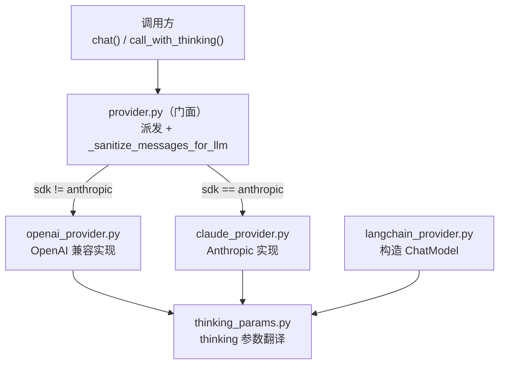

# 1. provider 重构

把 `src/llm/provider.py`（604 行，OpenAI 兼容 + Anthropic 两套实现挤在一起）拆成「薄门面 + 两个对等实现」，并清掉其中一个会导致 Claude 调用崩溃的缺失函数。

## 1.1. 需求

- **功能**：上层调用方式完全不变（仍 `from src.llm.provider import chat, call_with_thinking`），只是把两家 provider 的实现各自独立成文件，入口只负责派发。
- **目标**：
  - `provider.py` 收敛为门面：派发 + 共享的消息清洗。
  - OpenAI 兼容实现、Anthropic 实现各自独立成文件。
  - 补上缺失的 `_split_system_messages`（当前 Claude 分支调用了一个未定义的函数）。
  - thinking 参数的「配置→请求参数」翻译抽成共享件，消除 `provider` 与 `langchain_provider` 的逻辑漂移。
- **价值**：
  - 新增 / 维护某一家 provider 时改动面收敛到单文件，互不干扰。
  - 消除一个运行期 bug（走 Claude 必崩）。
  - thinking 参数只有一份算法，`provider` / `langchain_provider` 不再各写各的、悄悄对不上。
- **风险**：
  - 拆分若让实现文件反向依赖门面，会形成循环 import（见 [§1.2.3](#123-关键设计决策)）。
  - 统一 thinking 参数会改变 `langchain_provider` 现有行为（见 [§1.2.5](#125-影响面与兼容)）。
- **现状**：
  - `provider.py` 单文件 604 行，门面（`chat` / `call_with_thinking`）、OpenAI 实现、Claude 实现、tool-name 适配混在一起。
  - `_split_system_messages` 在 `_chat_claude`、`_chat_claude_thinking` 各调一次，但**全代码库无定义**——basedpyright 已告警，走 Claude 会 `NameError`。
  - `_sanitize_messages_for_llm`（消息加固，provider 无关）两处被调：`chat()` 派发前、`_chat_openai_reasoning` 内部；`call_with_thinking` 的 Claude thinking 分支**漏调**。
  - thinking 参数翻译在 `provider` 与 `langchain_provider` 各写一份，且 Claude budget cap 已漂移（一个用 `model.max_output_tokens`，一个用 `CLAUDE_MAX_TOKENS`）。

## 1.2. 设计

### 1.2.1. 总体框架

依赖单向：门面 → 两实现；三方共用 `thinking_params`。实现文件**不反向 import 门面**。

### 1.2.2. 文件归属

| 文件 | 内容 |
|---|---|
| `provider.py`（门面） | `chat()`、`call_with_thinking()`、`_sanitize_messages_for_llm`、派发逻辑 |
| `openai_provider.py` | `_openai_call`、`_run_openai_stream`、`_chat_openai_reasoning`，以及 tool-name 适配（`_sanitize_function_name` / `_restore_function_name` / `_sanitize_tools_for_llm` / `_restore_tool_call_names`，OpenAI 协议特有） |
| `claude_provider.py` | `_chat_claude`、`_chat_claude_thinking`、`_run_thinking_stream`、`_convert_tools_to_anthropic`、`_wrap_anthropic_response`、`_split_system_messages`、`_CLAUDE_OUTPUT_CAP` |
| `thinking_params.py` | OpenAI thinking 的 `extra_body` 拼装；Claude thinking 的 `(budget, max_tokens)` 计算 |

### 1.2.3. 关键设计决策

- **消息清洗上提门面（破循环依赖）**：`_chat_openai_reasoning` 现在内部调 `_sanitize_messages_for_llm`，若它挪进 `openai_provider` 又调留在门面的清洗函数，就会双向依赖。解法：把 `_sanitize_messages_for_llm` 的调用统一放在门面两个入口（`chat` / `call_with_thinking`）派发前执行，实现文件只收「已清洗」的 messages，不再回调门面。
- **tool-name 适配整体进 `openai_provider`**：让 OpenAI 分支自包含（sanitize → 调用 → restore 都在内部），门面不内联这套，避免反向依赖。Claude 分支本就不做 restore，不受影响。
- **`_split_system_messages` 落到 `claude_provider`**：把 messages 里 `role == "system"` 的内容抽出拼成单个 system 文本（Anthropic 的 `system` 是独立顶层参数），其余消息原样返回。返回 `(system_prompt, filtered_messages)`。
- **thinking 参数共享件**：见 [§1.2.4](#124-接口与数据改动)。Claude budget cap 统一取 `model.max_output_tokens or 64000`。

### 1.2.4. 接口与数据改动

- **对外 API**：不变。`chat` / `call_with_thinking` 仍从 `src.llm.provider` 导出；9 处调用方零改动。
- **新增共享函数**（`thinking_params.py`）：

| 函数 | 签名 | 说明 |
|---|---|---|
| Claude budget 计算 | `claude_thinking_budget(model, budget_tokens) -> tuple[int, int]` | 返回 `(budget, max_tokens)`；`cap = model.max_output_tokens or 64000`，`budget = max(1024, min(budget_tokens, cap-4096))`，`max_tokens = budget + 4096` |
| OpenAI thinking 参数 | `openai_thinking_extra_body(model, spec, budget) -> tuple[str, dict]` | 返回 `(model_id, extra_body)`；合并 `spec.enable_extra_body`、按 `spec.budget_key` 透传预算、按 `spec.thinking_model` 切模型 |

- 无 DB / schema / Pydantic 改动。

### 1.2.5. 影响面与兼容

| 维度 | 影响 |
|---|---|
| 调用方 | 无（门面 API 不变） |
| OpenAI 兼容路径 | 行为等价（实现平移，sanitize/restore 时序不变） |
| Claude 普通对话 | 行为等价；额外修复 `_split_system_messages` 缺失（原本必崩） |
| Claude thinking（直连） | 行为等价（budget / max_tokens 算法平移到共享件） |
| **Claude thinking（langchain）** | **行为变化**：`max_tokens` 由写死的 `CLAUDE_MAX_TOKENS`(4096) 改为 `budget + 4096`。原算法因 `4096-4096=0` 把 budget 永久钉死在 1024（thinking 近乎失效），改后恢复为真实 budget。非 thinking 路径仍用 `CLAUDE_MAX_TOKENS`，不动。 |

兼容策略：不保留旧的重复实现，直接收敛为单一来源（项目偏好简洁 > 兼容）。

### 1.2.6. 可观测性 / 验证

- 静态：basedpyright 对 `provider.py` 的 `_split_system_messages` 告警消失；三个新文件无新告警。
- UT：`tests/llm/` 下补 / 调整——`_split_system_messages` 拆分正确性、`claude_thinking_budget` 边界（budget 下限 1024 / cap 夹取 / max_tokens 联动）、`_sanitize_messages_for_llm` 在两个入口都生效（含 Claude thinking 路径新覆盖）。mock 掉 anthropic / openai SDK，不真发 LLM。
- 回归：`pytest -q` 全绿。

### 1.2.7. 实现步骤

1. 新建 `thinking_params.py`，落 `claude_thinking_budget` / `openai_thinking_extra_body`。
2. 新建 `claude_provider.py`，迁入 Anthropic 全套并补 `_split_system_messages`；thinking budget 改用共享件。
3. 新建 `openai_provider.py`，迁入 OpenAI 全套（含 tool-name 适配）；thinking 参数改用共享件。
4. `provider.py` 收敛为门面：保留 `chat` / `call_with_thinking` / `_sanitize_messages_for_llm`，两入口派发前统一清洗，分发到两实现。
5. `langchain_provider.py` 的 thinking 参数改调共享件（含 `max_tokens` 联动修复）。
6. 补 / 调 `tests/llm/` UT，跑 `pytest -q` 回归。

### 1.2.8. 落地结果

| 文件 | 状态 |
|---|---|
| `thinking_params.py` | 新增：`claude_thinking_budget` / `openai_thinking_extra_body`（`_CLAUDE_OUTPUT_CAP` 落此处——它只服务 budget 计算，比放 `claude_provider` 更贴近使用点） |
| `claude_provider.py` | 新增：Anthropic 全套 + 补 `_split_system_messages`；budget 改用共享件 |
| `openai_provider.py` | 新增：OpenAI 全套 + tool-name 适配 |
| `provider.py` | 收敛为门面：`chat` / `call_with_thinking` / `_sanitize_messages_for_llm` + 派发；两入口派发前统一清洗 |
| `langchain_provider.py` | thinking 参数改用共享件，thinking 时 `max_tokens` 由 `CLAUDE_MAX_TOKENS` 改为 `budget+4096` |

对外 API（`chat` / `call_with_thinking`）不变，9 处调用方零改动。

自动化验证：`tests/llm` 78 passed；全量 `pytest -q` **1709 passed / 32 deselected**；basedpyright 对 `provider.py` 的 `_split_system_messages` 告警消失。

### 1.2.9. 人工冒烟方案（需真实 API key，可选）

| 步骤 | 操作 | 验收 |
|---|---|---|
| Claude 普通对话 | 切到 `claude-sonnet-4-5`，发一句普通问题 | 正常返回（验证 `_split_system_messages` 已修复，不再 `NameError`） |
| Claude thinking | 同模型，`call_with_thinking(budget_tokens=8000)` | 思考过程逐块输出、正文正常、不报 `max_tokens` 相关 400 |
| OpenAI 兼容 thinking | 切到 `qwen3.5-flash`，开 thinking | `delta.reasoning_content` 正常透传 |
| langchain thinking | LangChain 实现下开 Claude thinking | budget 不再被钉死在 1024（行为修复点）；不报 400 |
