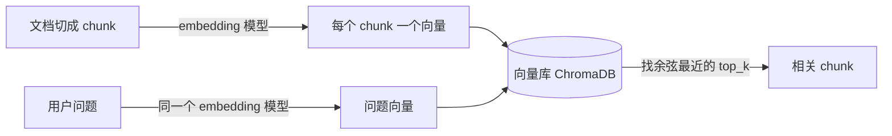
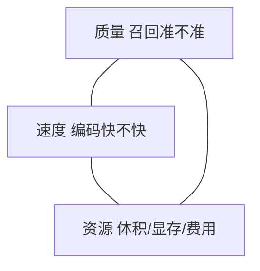
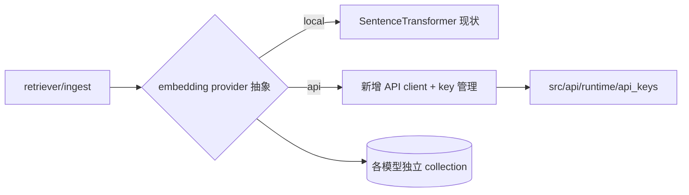
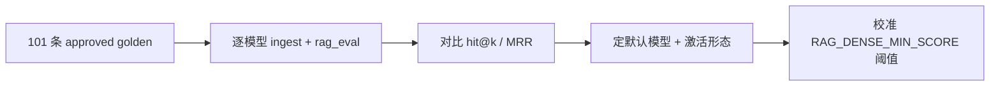

# 1. 目标

！！！本期只讨论不实现！！！

 topics:

1. embedding 模型

- bi-encoder 召回 Vs cross-encoder 精排
- offline model vs cloud model

# 2. 基础知识

## 2.1. 什么是 embedding？

embedding（向量表示）就是把一段文字（也可以是图片、音频）映射成一串固定长度的数字，例如 384 个或 1024 个小数。这串数字叫**向量**，它落在一个高维空间里的某个位置。

核心思想一句话：**意思相近的文字，向量位置也相近**。

- "怎么重启服务器" 和 "服务器如何重新启动" → 向量几乎重合
- "怎么重启服务器" 和 "今天午饭吃什么" → 向量离得很远

怎么衡量"相近"？用两个向量的**夹角余弦**（cosine similarity）：

| 余弦值 | 含义                       |
| ------ | -------------------------- |
| 接近 1 | 方向几乎一致，语义高度相关 |
| 接近 0 | 互不相关                   |
| 小于 0 | 语义相反/无关              |

AgentA 全程用 cosine（见 `src/rag/ingest.py` 的 `_HNSW_SPACE="cosine"`）。

embedding 在 RAG 里的作用（为什么需要它）：

关键点：**入库（ingest）和查询（query）必须用同一个模型**。不同模型产出的向量在不同空间里，互相比距离没有意义——这也是 AgentA 给每个模型单独建一个 collection 的原因。

和"关键词搜索"的区别：关键词搜索匹配字面（BM25），问"重启"就只找含"重启"二字的；embedding 匹配语义，问"重启"也能找到写"重新启动""reboot"的内容。两者互补，AgentA 同时用了（dense 向量召回 + BM25），再用 RRF 融合。

**我的备注：**

embedding 用 bi-encoder：把文档切块，每块转成一个向量

答时， 把问题（query）转成向量，用 bi-encoder 计算 query 向量和文档向量间的相关性
这个过程 query 向量和文档向量都是分别计算的。文档向量是在文档入库时就算好了，所以召回速度快，但精度低。
召回top_k：就是把相关性最高 k 个文档块返回

cross-encoder 则是要即时算的，要把 (query, doc) 成对输入计算相关性，精度更高。
运行不可能把 query 和 kb 里所有doc chunk 算一遍，所以时基于 top_k * N 来算。
然后把cross-encoder 算的 top_k * N 进行排序，取出 top_k 作为最后结果。
这个过程就是 re-rank(二次精排)。

## 2.2. embedding 模型有哪些？哪里来？

embedding 模型按"在哪跑"分两类：

| 类型                    | 代表                                                               | 特点                                                       | AgentA 现状       |
| ----------------------- | ------------------------------------------------------------------ | ---------------------------------------------------------- | ----------------- |
| **本地开源模型**  | all-MiniLM、BAAI/bge 系列、`Qwen3-Embedding`、`gte`、`e5`    | 一次下载到本地，离线可跑，无调用费用，数据不出本机         | ✅ 当前全部用这类 |
| **云端 API 模型** | OpenAI `text-embedding-3`、Cohere、Voyage、`智谱/百川/通义` 等 | 不占本地显存、维度高质量好，但按量计费、要联网、数据出本机 | ❌ 当前不支持     |

本地模型从哪来：绝大多数托管在 **HuggingFace Hub**。AgentA 通过 `sentence-transformers` 库（`SentenceTransformerEmbeddingFunction`）加载，首次用到会自动从 HF 下载并缓存到 `~/.cache/huggingface/`。国内网络用 `tools/download_models.py` 多镜像（hf-mirror.com）一键预拉。

## 2.3. 本地 vs 云端：约束与决策

云端 API 不少有**免费额度**可白嫖，常用的：

| 提供方                                | 免费情况                                      | 备注                                             |
| ------------------------------------- | --------------------------------------------- | ------------------------------------------------ |
| **硅基流动 SiliconFlow**        | 提供 `bge-m3` 等 embedding 免费调用         | 国内直连；跑的就是开源那批，从本地迁过去成本最低 |
| **智谱 / 通义（DashScope）**    | `embedding` 系列有免费额度                  | 国内直连、中文好                                 |
| **Jina AI**                     | 注册送 token（`jina-embeddings-v3` 多语言） | 维度可调                                         |
| **Cohere / Voyage / Gemini**    | trial / 赠送 token                            | 多需联网出海                                     |
| **OpenAI `text-embedding-3`** | 无免费，按量计费                              | 即上表云端模型一栏所列                           |

选不选云端，先过**硬约束**（满足不了直接排除云端），再看**软权衡**：

| 层级   | 考量                                                   | 倾向                                  |
| ------ | ------------------------------------------------------ | ------------------------------------- |
| 硬约束 | **数据隐私**：隐私数据不能出本机                 | 隐私 → 只能本地（一票否决云端）      |
| 硬约束 | **网络可用性**：离线 / 内网环境                  | 不能联网 → 只能本地                  |
| 软权衡 | **成本**：本地占机器但免费；云端省机器但按量计费 | 量小 + 想省机器偏云端；量大持续偏本地 |
| 软权衡 | **质量**：云端大维度模型通常更强                 | 追求质量偏云端                        |
| 软权衡 | **运维**：本地要下载/占显存；云端开箱即用        | 怕麻烦偏云端                          |
| 软权衡 | **模型可控性**：见下方陷阱                       | 长期偏本地                            |

**模型可控性陷阱**：入库与查询必须同一模型（见 [§2.1](#21-什么是-embedding)）。用云端模型灌了大批向量库后，一旦厂商限流 / 涨价 / 下线该模型，整个库就得全量重新 ingest；本地模型永远在自己手里，不会被动失效。这条让长期选型天平偏向本地。

挑模型时主要看这几个维度：

- **语言**：纯英文 / 中文优化 / 多语言。中文场景用纯英文模型会明显掉点。
- **维度**：384 / 512 / 768 / 1024 …。维度越高一般越细腻，但占存储、算得慢。
- **体积与速度**：小模型（几十 MB，CPU 也快）vs 大模型（几百 MB~几 GB，最好有 GPU）。
- **是否需要指令前缀**：部分模型（如 bge、e5）要求 query 前面拼一句指令（如 `为这个句子生成表示以用于检索：`）才发挥最佳效果。

权威参考榜单：**MTEB**（Massive Text Embedding Benchmark，HuggingFace 上的 embedding 综合评测榜），可按语言筛选看排名。
MTEB Leaderboard 主页：[https://huggingface.co/spaces/mteb/leaderboard](https://huggingface.co/spaces/mteb/leaderboard)

看榜要点：盯 **Retrieval（检索）** 那一列，别只看综合分（Average）——RAG 吃的是检索能力；同时结合维度 / 模型体积看，榜首常是几 B 参数大模型，本地跑吃显存，未必选第一名。

## 2.4. 评估数据：自有 golden vs 标准基准

业界有现成的"语料 + golden"基准（标注了哪个 query 该命中哪些文档），但**和 AgentA 现有评估不能直接对接**，差异在标注与指标：

| 维度       | 标准基准（BEIR / C-MTEB Retrieval / T2Ranking / DuReader-retrieval / MultiCPR） | AgentA `tools/rag_eval/`       |
| ---------- | ------------------------------------------------------------------------------- | -------------------------------- |
| 相关性标注 | qrels：query → doc_id + 分级相关性                                             | 关键词 OR 命中 + source 子串匹配 |
| 核心指标   | nDCG@k、MRR、Recall@k                                                           | hit_keyword@k、hit_source@k      |
| 语料       | 需把基准 corpus 全量 ingest 进库                                                | 用户自己的文档                   |

直接接标准集有两道坎：① 把基准 corpus 灌进 ChromaDB；② qrels 转成 AgentA 的字段。RAG 端到端质量另有 **CRUD-RAG / RGB**（中文）等基准，但涉及生成评测，改动更大。

**取舍**：AgentA 是私有文档助手，真实场景就是用户自己的文档；"模型横向强弱"MTEB 榜已替我们比好。因此更划算的路径是——**靠 MTEB / C-MTEB 榜初筛掉明显弱的模型 → 在自有 golden 上做最终验证**，而非费力把标准集灌进来。需要和外部横向对比时，再一次性适配一个中文小数据集（如 MultiCPR 单域）并给 runner 加 Recall@k。

## 2.5. 性能与质量

embedding 选型本质是在三件事之间权衡：

| 维度           | 说明                                      | 影响                                                                  |
| -------------- | ----------------------------------------- | --------------------------------------------------------------------- |
| **质量** | 同语言、同领域下能否把相关 chunk 排到前面 | 直接决定 RAG 答得准不准；用 recall@k / MRR 衡量                       |
| **速度** | 编码一条文本的耗时                        | ingest 大库、在线查询延迟；小模型 CPU 毫秒级，大模型 CPU 可能上百毫秒 |
| **资源** | 模型体积、内存/显存、（API 模型的）调用费 | 本地部署门槛、并发能力                                                |

经验规律：

- 维度更高 / 模型更大 ≈ 质量更好，但速度更慢、占用更高，**不是越大越值**——要看任务和语料。
- 真正的质量结论**必须用自己的语料评测**，榜单只能作为初筛。AgentA 已有 `tools/rag_eval/` 评估框架可直接拿来对比模型。
- 不同模型相似度分布不同，**阈值要跟着模型调**（`src/config.py` 已记录：MiniLM 同主题对 ~0.40-0.60、bge-small-zh ~0.55-0.85、bge-m3 ~0.45-0.75）。换模型必须重新校准 `RAG_DENSE_MIN_SCORE` 这类阈值。

# 3. AgentA 现状

## 3.1. 模型清单

定义在 `src/config.py` 的 `EMBEDDING_MODELS`，每个别名绑定独立 collection（维度不同必须分库）：

入库/召回（bi-embedding)：

| 别名   | 模型                  | 语言            | 维度 | collection | 体积    |
| ------ | --------------------- | --------------- | ---- | ---------- | ------- |
| `en` | `all-MiniLM-L6-v2`  | 英文/多语言     | 384  | `kb_en`  | ~90 MB  |
| `zh` | `BAAI/bge-small-zh` | 中文优化        | 512  | `kb_zh`  | ~96 MB  |
| `m3` | `BAAI/bge-m3`       | 多语言（dense） | 1024 | `kb_m3`  | ~568 MB |

reranker（cross- embedding）：

* 默认 `BAAI/bge-reranker-base`（中英双语）
* 轻量备选 `cross-encoder/ms-marco-MiniLM-L-6-v2`

## 3.2. 工作机制

- **加载**：`src/rag/retriever.py` 用 `SentenceTransformerEmbeddingFunction`，本地跑、进程级懒加载缓存（同名模型只加载一次，线程安全）。query 编码结果还有 LRU 缓存。
- **距离空间**：统一 `cosine`（`ingest.py`，旧库若是默认 L2 会在 ingest 时 drop & recreate 修正）。
- **多模型激活**：
  - EMBEDDING_MODEL（入库用）决定入库默认模型
  - RAG_ACTIVE_EMBEDDINGS（召回用）决定检索时同时查哪几个 collection
- **下载**：`tools/download_models.py` 多镜像 fallback（hf-mirror → 官网），支持离线 `TRANSFORMERS_OFFLINE`。
- **自定义模型**：`resolve_embedding()` 允许 `.env` 直接填 HF 模型名（不止三个内置别名），会按模型名末段自动生成 collection 名。

## 3.3. 现状

1. **只支持本地 HF 模型**：无法接云端 API embedding（如需更高质量 / 不想占本地资源时没有选项）。
3. **模型偏老**：MiniLM、bge-small 都是较早一代；2024-2025 出现了 `bge-m3`、`Qwen3-Embedding`、`gte-multilingual` 等更强的多语言模型。
4. **缺少基于本仓语料的横向评测**，目前选型缺乏数据支撑。

# 4. 讨论

## 4.1. 已确认的方向

| 决策点     | 结论                                                                  |
| ---------- | --------------------------------------------------------------------- |
| 主语料语言 | **中英混合**（各占不少）                                        |
| 部署方式   | 倾向**只用本地模型**（保持简洁），但云端 API 方案先一并讨论再定 |
| 选型依据   | 先讨论清楚候选与方案，暂不急着按经验直接换                            |

中英混合是关键约束：纯英文的 MiniLM（当前默认）和纯中文的 bge-small-zh **单独都不够**，需要一个**多语言模型单独覆盖中英**，或继续 `en+zh` 双库并行。

## 4.2. 本地候选模型（中英混合）

| 模型                               | 维度 | 体积    | 中英混合表现                | 备注                                                           |
| ---------------------------------- | ---- | ------- | --------------------------- | -------------------------------------------------------------- |
| `BAAI/bge-m3`                    | 1024 | ~568 MB | 好（多语言强项）            | **已内置（`m3`）、已可下载**，单模型覆盖中英，起点最稳 |
| `Qwen3-Embedding-0.6B`           | 1024 | ~600 MB | 很好（2025 多语言 SOTA 级） | 较新，需验证 `sentence-transformers` 兼容性                  |
| `intfloat/multilingual-e5-large` | 1024 | ~560 MB | 好                          | 需要 `query:` / `passage:` 前缀                            |
| `gte-multilingual-base`          | 768  | ~305 MB | 较好、更轻快                | 维度低、CPU 友好                                               |

倾向起点：**把默认从 `en` 改为 `m3`（bge-m3）**，单模型覆盖中英、且本地已就绪，改动最小；是否再引入更新的 Qwen3/e5 作为对比，取决于要不要走评测。

两种落地形态：

- **方案 A（单模型）**：`RAG_ACTIVE_EMBEDDINGS=m3`，一个库覆盖中英 —— 最简洁。
- **方案 B（双库并行）**：保留 `en,zh` 思路换成更强的中英模型分别建库 —— 召回更全但更重、阈值各调。

## 4.3. 云端 API embedding

| 候选                                    | 维度      | 中英混合 | 计费/特点                   |
| --------------------------------------- | --------- | -------- | --------------------------- |
| OpenAI `text-embedding-3-small/large` | 1536/3072 | 好       | 按 token 计费、便宜、要联网 |
| 智谱 `embedding-3`                    | 可变      | 中文优   | 国内可达                    |
| 通义 `text-embedding-v3`              | 1024      | 中英好   | 国内可达                    |

接入会动的地方（成本评估，不是现在就做）：

- 需要把现在写死的 `SentenceTransformerEmbeddingFunction` 抽象成 provider 层（local / api 两实现）。
- 复用现有 API key 管理（`src/api/runtime/api_keys`）与 collection 隔离机制。
- 代价：联网依赖、按量计费、**数据出本机**——与"只用本地、保持简洁"的偏好相冲突。

**取舍判断**：中英混合 + 本地，`bge-m3` 基本能满足质量需求；云端 API 主要价值在"想要更高维/更高质量且不介意数据出本机"。若坚持简洁，建议本期不做云端，留作 backlog。

## 4.4. 讨论结论

| 决策点       | 结论                                          | 理由                                                                                              |
| ------------ | --------------------------------------------- | ------------------------------------------------------------------------------------------------- |
| 本地落地形态 | 倾向**单模型 `m3`**，最终由评测数据定 | 中英混合用单个多语言模型最契合简洁偏好；现状 `en+zh` 双库的英文端（MiniLM）偏弱，双库优势不明显 |
| 云端 API     | **本期不做，记 backlog**                | 与"只用本地/简洁"冲突；bge-m3 对中英混合质量足够。重评触发条件：评测显示本地召回不达标            |
| 是否评测     | **走评测**                              | golden 库已有**101 条 approved**，足够横向对比；换默认模型靠数据而非口碑                    |

## 4.5. 推荐路线：评测驱动选型

候选对比对象（用 `tools/rag_eval/runner.py -o reports/<model>.md` 各跑一轮）：

1. **现状基线**：`en+zh` 双库（当前默认）
2. **方案 A**：`m3` 单库
3. **可选**：更新的多语言模型（如 `Qwen3-Embedding-0.6B` / `multilingual-e5-large`）

按 `hit_either@k` 与 `MRR` 选优，再据所选模型校准阈值；云端 API 写入 backlog。

> 评测涉及多次 ingest（会重建 collection）——属 §1.6 破坏性操作，执行前会先与用户确认范围与可逆性。

# 5. embedding 管理

CLI tool: tools/download_models.py
