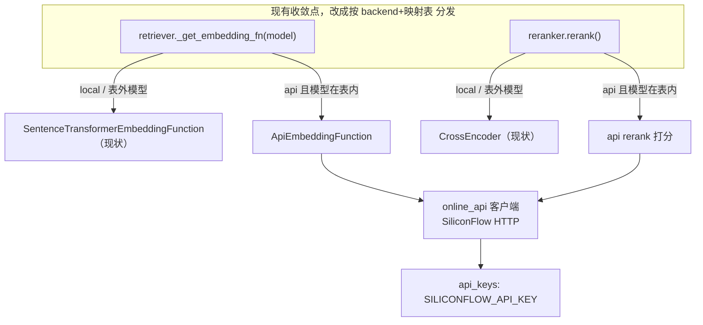

# 1. online API 代码实现

> 上游：[i1.1_3_deploy.md](./i1.1_3_deploy.md) 选定方案 B（online API + 轻量 VPS），embedding + rerank 都用硅基流动 SiliconFlow。
> 前置已完成：3.1.2 验证本地 vs API 向量 cosine ≥ 0.9994，`kb_m3` 免重灌，只需把编码从本地换成 API。
> 本文档做的是：在代码里实现 API 接入 + 本机验证。

# 2. 需求

## 2.1. 功能（从用户角度）

1. 能切换 embedding / rerank 的来源：本地模型 或 SiliconFlow 云端 API，靠配置切换，不改代码。
2. 切到 API 后，检索问答全程不加载本地模型，轻量 VPS 也能跑。
3. 现有知识库不受影响：`kb_m3` 已灌的 2852 条向量不动（已验证免重灌），切到 API 后检索结果与本地基本一致。
4. API key 可管理：SiliconFlow key 能通过 `.env` 配，也能在设置页运行时改（和现有 LLM key 一致）。
5. API 异常不致命：调用失败时有明确的降级 / 报错行为，不让整条检索链崩掉。

## 2.2. 核心行为约定


| 项           | 结论                                                                                     |
| ----------- | -------------------------------------------------------------------------------------- |
| 切换粒度        | `EMBEDDING_BACKEND` / `RERANK_BACKEND` 两个独立开关，取值 `local` | `api`                       |
| 开关作用范围      | **按模型生效**：只对「API 上有对应托管模型」的本地模型生效；映射表外的模型忽略该开关、继续本地（见 2.3）                             |
| query 编码    | 跟随 `EMBEDDING_BACKEND`；切 api 后走硅基，`kb_m3` 免重灌                                          |
| ingest 编码   | 跟随 `EMBEDDING_BACKEND`；VPS 无本地模型也能加新文档，query 与 document 同源不漂移                          |
| 向量库归属       | 同一 bge 模型本地与 API **共用同一 collection**（如 `bge-m3` → `kb_m3`）；切 backend 不改 collection、不重灌 |
| rerank      | 跟随 `RERANK_BACKEND`；切 api 后走硅基 `POST /v1/rerank`                                       |
| 本地 / API 共存 | 本地模型文件与 SiliconFlow 配置同时存在，不是安装期二选一；运行时按配置切换                                           |
| key 管理      | 新增 `SILICONFLOW_API_KEY`，`.env` + 设置页运行时可改（对齐现有 LLM key）                               |
| 降级          | embedding query 失败 → 重试后报错（不降级本地，因 VPS 无模型）；rerank 失败 → 沿用现有「降级为不精排」                   |


## 2.3. 模型映射表（开关生效边界）

硅基只托管特定模型，用映射表（本地模型名 → API 模型 id）界定哪些模型有 API 版。
`*_BACKEND=api` 时只对表内模型生效；表外模型（如 `en`=MiniLM、`zh`=bge-small-zh 若未托管）忽略开关、继续本地，并打日志说明。


| 本地模型                      | API 模型 id（SiliconFlow）    | 类型        |
| ------------------------- | ------------------------- | --------- |
| `BAAI/bge-m3`             | `BAAI/bge-m3`             | embedding |
| `BAAI/bge-reranker-v2-m3` | `BAAI/bge-reranker-v2-m3` | rerank    |


举例：`RAG_ACTIVE_EMBEDDINGS=en,zh` + `EMBEDDING_BACKEND=api` → 两者都无 API 版，实际全走本地；只有 `m3` 参与激活时，`api` 才对 `m3` 生效。

## 2.4. 验收标准

1. 配置切到 api 后，`search()` 走 SiliconFlow 编码 query，能正常从 `kb_m3` 检索出结果。
2. rerank 切到 api 后，`rerank()` 走 SiliconFlow，打分排序趋势与本地 CrossEncoder 一致。
3. 模拟「无本地模型」环境（不加载本地模型）仍能完成一次完整问答。
4. 跑 `tools/rag_eval` 对比 local backend vs api backend，`hit@k / MRR` 不回归。
5. 回归测试：backend 设回 `local`（默认）时，现有检索 / rerank 行为与既有单测全部保持不变，本期改动不破坏本地路径。


## 2.5. 设计测试

- 单测：provider 层 local / api 分发正确；API client 请求体、返回解析、异常降级。
- 集成：切到 api 跑一次真实检索 smoke test（贴真实输出）。
- 评估：rag_eval 本地基线 vs API 对比报告。


# 3. 设计


## 3.1. 代码现状（关键触点）

embedding / rerank 目前全部写死本地 `sentence-transformers`，无 provider 抽象：

- query 编码：`src/rag/retriever.py` 的 `_embed_query_cached()` → `_get_embedding_fn()`
- document 编码（ingest）：`src/rag/ingest.py` 的 `_open_collection()` 也走 `_get_embedding_fn()`，`upsert(documents=...)` 时自动编码
- 语义缓存：`src/stores/semantic_cache.py` 同样经 `_embed_query_cached()`
- rerank：`src/rag/reranker.py` 的 `rerank()` 内 `CrossEncoder.predict()`
- API key 管理 `src/api/runtime/api_keys.py` 目前只覆盖 LLM + SerpAPI，无 SiliconFlow 槽位

关键红利：query / ingest / 语义缓存三条编码路径**都汇聚到** `_get_embedding_fn(model_name)` **这一个点**，改一处即三条全覆盖。

## 3.2. 总体框架

思路：**不建正式 Provider 接口，直接在两个现有"编码收敛点"按** `backend + 映射表` **分发**（本地 vs API），底层共用一个 SiliconFlow HTTP 客户端。将来接第二家云厂商，只在映射表加一列 + 多一个 `if` 分支，无需先抽接口（换厂商真正的成本是向量空间变化导致的重灌 + 阈值校准，与是否抽象无关）。




query 检索时本就显式传 `query_embeddings`，collection 绑定的 embedding function 只在 ingest 编码时参与——两条路径天然分工，互不干扰。

## 3.3. 数据 / 接口改动

- **无 DB schema 改动、无 collection 改动**：`kb_m3` 原样复用（已验证免重灌）。
- **无 HTTP 路由 schema 改动**：只加运行时配置项与 key 槽位。
- SiliconFlow 两端点：
  - `POST /v1/embeddings`，body `{model, input:[...]}` → 返回各文本向量。
  - `POST /v1/rerank`，body `{model, query, documents:[...]}` → 返回各文档相关度分。


## 3.4. 配置项改动

按 `config-change` 规则四处同步（`.env` / `.env.example` / `src/config.py` / 设置页 UI）。


| 配置项                       | 取值                              | 落点                                                          |
| ------------------------- | ------------------------------- | ----------------------------------------------------------- |
| `EMBEDDING_BACKEND`       | `local` | `api`，默认 `local`      | config.py + .env(.example) + config_meta（RAG / 召回，ENUM_STR） |
| `RERANK_BACKEND`          | `local` | `api`，默认 `local`      | 同上（RAG / 精排，ENUM_STR）                                       |
| `SILICONFLOW_API_KEY`     | 密钥                              | config.py 属性 + api_keys.py `SECRET_ITEMS`（scalar，设置页可改）     |
| `SILICONFLOW_BASE_URL`    | `https://api.siliconflow.cn/v1` | config.py + .env(.example)                                  |
| `SILICONFLOW_TIMEOUT_SEC` | API 单次超时（秒）                     | config.py + .env(.example)                                  |
| `SILICONFLOW_MAX_RETRIES` | 失败重试次数                          | config.py + .env(.example)                                  |


**映射表** `ONLINE_API_MODELS`（本地模型名 → API 模型 id，附厂商标记）放**代码常量**，用户无需调，本期仅两项：

```python
ONLINE_API_MODELS = {
    "BAAI/bge-m3":             ("siliconflow", "BAAI/bge-m3"),             # embedding
    "BAAI/bge-reranker-v2-m3": ("siliconflow", "BAAI/bge-reranker-v2-m3"),# rerank
}
```

`*_BACKEND=api` 时只对表内模型生效；表外模型（`en`=MiniLM、`zh`=bge-small-zh）忽略开关、回落本地，并打日志。

## 3.5. 影响面

- 默认 `local`，不切即纯现状，回归风险低。
- 不动 schema、不破坏兼容。
- 新增文件 `src/rag/online_api.py`；改 `retriever.py` / `reranker.py` / `semantic_cache.py` / `config.py` / `api_keys.py` / `config_meta.py`。
- 无新依赖（`requests` 已在 requirements.txt）。


## 3.6. 关键实现细节（业内标准做法，记录备查）

1. **运行时切换不留脏缓存**：`_get_embedding_fn` 缓存键改为 `backend:model`，`_embed_query_cached` 增加 `backend` 参数——切 backend 命中不同缓存，无需清理、无 stale。
2. **API rerank 不二次 sigmoid**：SiliconFlow `bge-reranker-v2-m3` 已返回 [0,1] 相关度（验证相关句 0.99、无关句 0.00），直接采用；local 路径保留现有 sigmoid。
  - ⚠️ **精排阈值按模型分（评估中发现，见 §4）**：本地默认 reranker 是 `bge-reranker-base`，而 api rerank 是 `bge-reranker-v2-m3`——**两者分数分布不同**。`v2-m3` 对本仓 golden 的 top 分常在 0.1~0.26，沿用为 `base` 校准的 `RAG_RERANK_MIN_SCORE=0.3` 会把 top 命中过滤掉、召回骤降。**方案**：仿照 dense 的 `RAG_DENSE_MIN_SCORE_PER_MODEL`，加 `RAG_RERANK_MIN_SCORE_PER_MODEL`（按 reranker 模型名给专用阈值，`v2-m3`=0.0），过滤点 `retriever.py` 改用 `config.min_rerank_score_for_model()`。阈值键控模型（非 backend），本地跑 v2-m3 也同样生效，切换无需手动改配置。（初稿"不必重调"的判断已作废——它误把对比基线当成了同款 v2-m3；且 `base` 硅基不托管，无法反向对齐，只能按模型分阈值。）
3. **降级策略**：
  - embedding query：API 失败重试 `SILICONFLOW_MAX_RETRIES` 次后，记 error 日志并**跳过该 collection 的 dense 召回**（BM25 仍召回），不崩整链、也不回落本地模型。
  - rerank：API 失败沿用现有「降级为不精排」（返回 `hits[:top_k]`）。


## 3.7. 可观测性

- 首次生效 / 预热时，按模型打印 backend 判定：`api 生效` 或 `backend=api 但无 API 版 → 回落 local`。
- 每次 API 调用记 `model / 条数 / 延迟ms / 重试次数`；失败记 HTTP status。


## 3.8. 实现步骤

1. `config.py` 加配置项 + `ONLINE_API_MODELS` 映射表
2. `api_keys.py` 加 siliconflow 槽位
3. 新增 `src/rag/online_api.py`：SiliconFlow HTTP 客户端 + `ApiEmbeddingFunction`
4. `retriever.py`：`_get_embedding_fn` 分发、缓存键带 backend、dense 失败降级 BM25
5. `reranker.py`：`rerank()` 分发（api 不二次 sigmoid）
6. `semantic_cache.py`：透传 backend
7. `config_meta.py` UI 项 + `.env` / `.env.example` 同步
8. 单测（客户端 / 分发 / 降级）
9. 本机 smoke：切 api 真实检索并贴输出
10. `rag_eval` local vs api 对比报告
11. 回归：backend=local 全测通过


# 4. 验收报告


## 4.1. 实现落地


| 触点  | 改动                                                                                    | 文件                                                              |
| --- | ------------------------------------------------------------------------------------- | --------------------------------------------------------------- |
| 配置  | `EMBEDDING_BACKEND` / `RERANK_BACKEND` / `SILICONFLOW_*` + `ONLINE_API_MODELS` 映射表    | `src/config.py`、`.env`、`.env.example`                           |
| key | 加 `siliconflow` scalar 槽位（设置页可改）                                                      | `src/api/runtime/api_keys.py`                                   |
| 客户端 | SiliconFlow HTTP（embed / rerank，重试 + 4xx 立即抛）+ `ApiEmbeddingFunction`                 | `src/rag/online_api.py`（新增）                                     |
| 分发  | `_get_embedding_fn` / `_embed_query_cached` 按 backend 分发、缓存键带 backend、dense 失败降级 BM25 | `src/rag/retriever.py`                                          |
| 分发  | `rerank()` 按 backend 分发（api 不二次 sigmoid）、api 失败降级不精排                                  | `src/rag/reranker.py`                                           |
| 其它  | 语义缓存透传 backend；UI 加两个 backend 开关                                                      | `src/stores/semantic_cache.py`、`src/api/runtime/config_meta.py` |


关键实现点：`ApiEmbeddingFunction.name()` 报 `"sentence_transformer"`，让 api 直接复用既有 `kb_m3`（Chroma 的 EF 冲突校验按 name 判定），实测 query / ingest 均正常、免重灌。

## 4.2. 验收标准逐条核对


| #   | 标准                                | 结果      | 证据                                                                                  |
| --- | --------------------------------- | ------- | ----------------------------------------------------------------------------------- |
| 1   | 切 api 后 `search()` 从 `kb_m3` 正常检索 | ✅       | smoke：`backend=api 生效`，返回 5 条命中，top 为 RAG 定义 doc                                    |
| 2   | 切 api 后 rerank 走硅基、排序趋势一致         | ✅       | log：`[OnlineAPI] rerank v2-m3`，`backend=api`；精确匹配 doc 0.999                         |
| 3   | 无本地模型环境能跑完整问答                     | ✅       | api embed 不加载本地模型（`ApiEmbeddingFunction` 无 torch 依赖）；rerank api 时跳过 CrossEncoder 预热 |
| 4   | rag_eval local vs api 不回归         | ✅（需调阈值） | 见 §4.3                                                                              |
| 5   | 回归：backend=local 与既有单测不变          | ✅       | `tests/rag tests/llm` 155 passed；`api_key/config` 41 passed；新增单测 20 passed          |


## 4.3. 评估对比（rag_eval，102 golden，top_k=8，rewrite OFF）


| 指标           | 本地基线 (embed+rerank local `base`, th0.3) | embed=api (rerank local `base`) | api+api (`v2-m3`, th0.3) | api+api (`v2-m3`, **th0.0**) |
| ------------ | --------------------------------------- | ------------------------------- | ------------------------ | ---------------------------- |
| hit_either@k | 95.05%                                  | **96.08%**                      | 72.55% ✗                 | **96.08%**                   |
| hit_source@k | 76.00%                                  | 75.25%                          | 59.41% ✗                 | 75.25%                       |
| MRR          | 0.9191                                  | **0.9248**                      | 0.7190 ✗                 | 0.9080                       |
| 报告           | `rag-20260614-201104.md`                | `online_api.md`                 | `online_api_full.md`     | `online_api_full_th0.md`     |


结论：

1. **embedding API 零回归**（第 2 列 vs 基线，持平略升）。
2. **rerank API 本身正常**（smoke 已证分数正确），第 3 列的骤降**不是 API 问题**，而是 `v2-m3` 分数分布比 `base` 低、沿用 `RAG_RERANK_MIN_SCORE=0.3` 把 top 命中过滤掉。
3. **阈值按模型分后端到端持平**（第 4 列，v2-m3 阈值=0.0）：hit_either@k 略高、MRR 差 0.011 属噪声（golden 由 101→102、库由 2812→2852）。


## 4.4. 最终方案与使用约束

- **精排阈值按模型分**：`config.RAG_RERANK_MIN_SCORE_PER_MODEL` 给 `bge-reranker-v2-m3` 单独阈值 `0.0`，`base` 仍走全局 `RAG_RERANK_MIN_SCORE`（默认 0.30，config.py 内定、不进 .env）。键控模型名，本地跑 v2-m3 也一致。
- **切 api rerank 无需手动改模型**：`RERANK_BACKEND=api` 时 `online_api.effective_rerank_model()` 忽略 `RERANKER_MODEL`、自动兜底到 `DEFAULT_API_RERANK_MODEL`（v2-m3），避免"开关=api 但模型=base → 静默回落本地"的坑。打分模型与阈值模型都取这个 effective 值，保持一致。三个精排旋钮合并成单下拉的方案见 backlog 1.1。
- `base` 硅基不托管（硅基 rerank 仅 `bge-reranker-v2-m3` / `Pro/...v2-m3` / `bce-reranker-base_v1` / `Qwen3-Reranker` 系列），故无法"api 也用 base"来对齐刻度，只能按模型分阈值。

