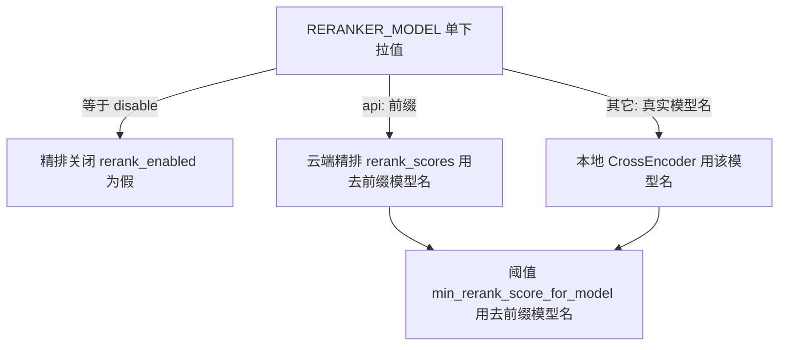
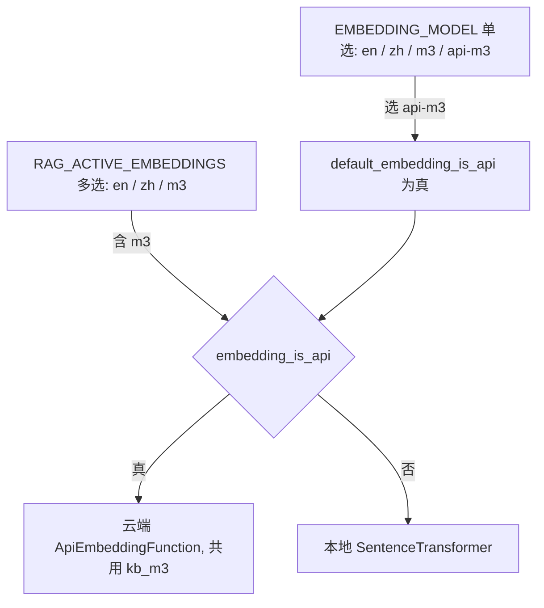

# 1. RAG 配置项简化

> 上游：[backlog.md](../../backlog.md) §1.1「配置项简化」；online API 接入见 [i1.1_4_online_api.md](./i1.1_4_online_api.md)。
> 本文档做的是：把散落的 RAG 配置项合并成对用户友好的单一下拉，减少组合心负担。
> 分批推进：C1 精排三合一（已完成）、C2 embedding 合并（本文档 §2）。

# 2. C1 精排配置三合一

## 2.1. 需求

### 2.1.1. 现状（三个旋钮）

精排靠三个独立配置项控制，散落在设置页「精排」区：

| 配置项 | 类型 | 含义 | 现默认 |
| --- | --- | --- | --- |
| `RERANKER_ENABLED` | bool | 是否开精排 | true |
| `RERANK_BACKEND` | local / api | 精排来源 | local |
| `RERANKER_MODEL` | 自由字符串 | 本地 CrossEncoder 模型名 | `BAAI/bge-reranker-base` |

问题：三个旋钮相互耦合，用户要自己搞懂「开关 + 来源 + 模型」怎么搭配才合法，还存在「来源=api 但模型填了 base」这种要靠 `effective_rerank_model()` 兜底的坑。

### 2.1.2. 目标（一个下拉）

合并成单个 `RERANKER_MODEL` 下拉，5 个选项一次性表达「开不开 / 用云端还是本地 / 哪个模型」：

| 下拉值 | 含义 | 派生语义 |
| --- | --- | --- |
| `disable` | 关闭精排 | enabled=false |
| `api:BAAI/bge-reranker-v2-m3` | 硅基云端精排 | enabled=true, api, 模型 v2-m3 |
| `BAAI/bge-reranker-base` | 本地 base（中英） | enabled=true, local |
| `BAAI/bge-reranker-v2-m3` | 本地 v2-m3（多语言） | enabled=true, local |
| `cross-encoder/ms-marco-MiniLM-L-6-v2` | 本地 MiniLM（英文轻量） | enabled=true, local |

设置页「精排」区从「开关 + 来源下拉 + 模型自由输入」三项，收敛成一个下拉框。`RERANKER_RECALL_MULTIPLIER`（精排召回倍数）与这三个无关，保持独立不动。

### 2.1.3. 功能（从用户角度）

1. 设置页「精排」只需选一个下拉项，就能决定精排开不开、走云端还是本地、用哪个模型，不用再理解三项怎么组合。
2. 选 `api:` 开头的项即走硅基云端（仍需先在 API Keys 页配 SiliconFlow key），不存在「选了 api 却因模型名不对而静默回落本地」的坑——下拉值本身就把来源和模型钉死了。
3. 精排质量不回归：各选项对应的实际模型 / 阈值与现在等价（`api:...v2-m3` 走 v2-m3 且阈值 0.0，`BAAI/bge-reranker-base` 走全局 0.30，等等）。

### 2.1.4. 验收标准

1. 设置页精排区只剩一个下拉（+ 召回倍数），选任一值检索问答正常。
2. 选 `disable` 全程不加载 CrossEncoder、不调云端，等价于旧 `RERANKER_ENABLED=false`。
3. 选 `api:BAAI/bge-reranker-v2-m3` 走硅基、阈值 0.0，端到端与现在 `RERANK_BACKEND=api` 一致。
4. 选三个本地项分别加载对应本地模型，行为与旧 `RERANK_BACKEND=local + RERANKER_MODEL=X` 一致。
5. 回归：`tests/rag` / `tests/api` / `tests/llm` 全绿；重写后的 online_api 单测通过。

### 2.1.5. 设计测试

- 单测：下拉值 → (enabled, is_api, 实际模型名) 的派生解析正确，5 个值逐一覆盖。
- 集成：切 `disable` / `api:...` / 本地各跑一次 smoke（贴真实输出）。
- 评估：本期纯配置形式重构，不改模型 / 阈值 / 算法，精排质量以 i1.1_4 的 rag_eval 结论为准，不再重跑完整对比（决策见 §1.3）。

## 2.2. 设计

### 2.2.1. 总体思路

单个 `RERANKER_MODEL` 下拉值即「唯一真相」，代码里**不再有 backend 概念**。取值靠 `disable` 特判和 `api:` 前缀自解释：



派生规则（全部读同一个 `RERANKER_MODEL`）：

| 派生量 | 规则 |
| --- | --- |
| `rerank_enabled()` | 值 ≠ `disable` |
| `rerank_is_api()` | 值以 `api:` 开头 |
| `rerank_model_name()` | 去掉 `api:` 前缀后的真实模型名（本地加载 / api 模型 id / 阈值查表都用它） |

关键点：`api:BAAI/bge-reranker-v2-m3` 和本地 `BAAI/bge-reranker-v2-m3` 去前缀后同名 → 自动命中同一条阈值（`RAG_RERANK_MIN_SCORE_PER_MODEL` 里 v2-m3=0.0），无需额外处理。原来的 `effective_rerank_model()` 兜底逻辑连同「开关=api 但模型=base」的坑一起消失。

### 2.2.2. 配置项改动

| 动作 | 配置项 | 落点 |
| --- | --- | --- |
| **删** | `RERANKER_ENABLED` | config.py 属性 + `.env.example` + config_meta UI |
| **删** | `RERANK_BACKEND` | config.py 属性 + `.env.example` + config_meta UI |
| **改** | `RERANKER_MODEL` | STRING → ENUM_STR（5 值下拉）；config.py 加派生 helper；`.env.example` 注释更新 |
| 不动 | `RERANKER_RECALL_MULTIPLIER` | 与本次无关，保留 |

> `.env` 实际没写这两行（走默认），只需清 `.env.example`。旧 override JSON 里的残留 key 被 `apply_overrides` 忽略（只应用 REGISTRY 内的 key），无害、无迁移阻塞。

### 2.2.3. 代码改动面

| 文件 | 改动 |
| --- | --- |
| `src/config.py` | 删 2 属性；`RERANKER_MODEL` 默认值保留；加 `rerank_enabled()` / `rerank_is_api()` / `rerank_model_name()` |
| `src/rag/online_api.py` | 删 `rerank_backend_for()` / `effective_rerank_model()` / `DEFAULT_API_RERANK_MODEL`；更新 docstring（`embedding_backend_for` 属 C2，保留不动） |
| `src/rag/reranker.py` | `warm_up` / `_get_cross_encoder` / `rerank()` 改用新 helper，分支由 `rerank_is_api()` 决定 |
| `src/rag/retriever.py` | `RERANKER_ENABLED` → `rerank_enabled()`；阈值查表 `effective_rerank_model()` → `rerank_model_name()`；注释更新 |
| `src/api/runtime/config_meta.py` | 删 2 个 ConfigItem；`RERANKER_MODEL` 改 ENUM_STR + options + 文案 |
| `tools/rag_eval/runner.py` | `RERANKER_ENABLED` / `RERANKER_MODEL` → 新 helper |
| `src/cli/main.py` | 状态行同上 |
| `.env.example` | 删 2 行，改 `RERANKER_MODEL` 注释 |

### 2.2.4. 影响面

- 默认 `BAAI/bge-reranker-base`（与现在等价），不改配置即纯现状，回归风险低。
- 不动 DB schema、不动 collection、不动阈值 / 算法。
- 破坏兼容：删两个配置项属于「激进清理」路径，已与用户确认（简洁 > 兼容）。

### 2.2.5. 可观测性

- 精排日志按 `rerank_is_api()` 打 `api` / `local`；`warm_up` 时按值打印「关闭 / api 跳过预热 / 本地预热」。

### 2.2.6. 实现步骤

1. config.py：删 2 属性、加 3 个派生 helper
2. online_api.py：删 backend / effective 相关、更 docstring
3. reranker.py：改 3 处用新 helper
4. retriever.py：改 3 处 + 注释
5. config_meta.py：删 2 项、改 `RERANKER_MODEL` 为 ENUM_STR
6. rag_eval/runner.py + cli/main.py：跟改
7. `.env.example` 同步
8. 测试重写 + 新增解析单测
9. 回归：`tests/rag` / `tests/api` / `tests/llm` 全绿
10. smoke：切 `disable` / `api:...` / 本地各跑一次贴输出

## 2.3. 决策记录

- **旧配置项处理**：彻底删除 `RERANKER_ENABLED` / `RERANK_BACKEND`（含 `.env.example` / UI / config.py 属性），代码内部去除 backend 概念。用户确认走「简洁 > 兼容」路径。
- **下拉命名格式**：用真实模型名 + `api:` 前缀（如 `api:BAAI/bge-reranker-v2-m3`），省一层别名映射。用户确认。
- **验收深度**：只跑 smoke + 全量单测，不重跑完整 rag_eval。理由：本期纯配置形式重构，实际模型 / 阈值 / 算法与 i1.1_4 等价，质量不回归已由 i1.1_4 的评估结论覆盖。用户确认。

## 2.4. 验收报告

### 2.4.1. 落地改动

| 触点 | 改动 | 文件 |
| --- | --- | --- |
| 配置 | 删 `RERANKER_ENABLED` / `RERANK_BACKEND` 属性；加 `rerank_enabled()` / `rerank_is_api()` / `rerank_model_name()` 派生 helper | `src/config.py` |
| 云端客户端 | 删 `rerank_backend_for()` / `effective_rerank_model()` / `DEFAULT_API_RERANK_MODEL`，更 docstring | `src/rag/online_api.py` |
| 精排 | `warm_up` / `_get_cross_encoder` / `rerank()` 改用新 helper，分支由 `rerank_is_api()` 决定，api 打分模型 id = 去前缀模型名 | `src/rag/reranker.py` |
| 召回 | `rerank_enabled()` 判定 + 阈值查表用 `rerank_model_name()` | `src/rag/retriever.py` |
| UI | 删 2 个 ConfigItem，`RERANKER_MODEL` 改 ENUM_STR（5 值下拉） | `src/api/runtime/config_meta.py` |
| 其它 | rag_eval metadata / CLI 状态行跟改；`.env.example` 删 2 行、改注释 | `tools/rag_eval/runner.py`、`src/cli/main.py`、`.env.example` |
| 测试 | 重写 online_api 精排用例（按单值）+ 新增派生解析单测；config PATCH 通用 bool 测试改用 `RAG_QUERY_REWRITE_ENABLED` | `tests/rag/test_rag_online_api.py`、`tests/api/test_api_config.py` |

### 2.4.2. 验收标准逐条核对

| # | 标准 | 结果 | 证据 |
| --- | --- | --- | --- |
| 1 | 精排区只剩一个下拉，选任一值检索正常 | ✅ | config_meta 只余 `RERANKER_MODEL`(ENUM_STR) + 召回倍数；smoke 三分支均返回结果 |
| 2 | `disable` 不加载 CrossEncoder、不调云端 | ✅ | smoke A：`enabled=False`，`rerank: skipped (use_rerank=False)`，hits reranked=False |
| 3 | `api:...v2-m3` 走硅基、阈值 0.0 | ✅ | smoke B：真实 `[OnlineAPI] rerank model=BAAI/bge-reranker-v2-m3`，backend=api，最高分 0.9975 |
| 4 | 本地项加载对应模型 | ✅ | smoke C：本地加载 `BAAI/bge-reranker-base`，backend=local，最高分 0.7310 |
| 5 | 回归：单测全绿 | ✅ | `tests/rag tests/api tests/llm` 506 passed；含 online_api 26 项、新增派生解析 4 项 |

### 2.4.3. smoke 输出
（query=「什么是 RAG」，query 编码走 api）

```
A disable       enabled=False is_api=False model_name='disable'
  → rerank: skipped，#0 reranked=False score=0.0164
B api:...v2-m3  enabled=True  is_api=True  model_name='BAAI/bge-reranker-v2-m3'
  → [OnlineAPI] rerank n=6 1612ms，#0 reranked=True score=0.9975
C bge-reranker-base  enabled=True is_api=False model_name='BAAI/bge-reranker-base'
  → 本地 CrossEncoder，#0 reranked=True score=0.7310
```

> 注：C1 的 `reranker.py` 内部仍有一处 `backend` 局部变量与日志字样（历史遗留），在 C2「去 backend」时一并清理。

# 3. C2 embedding 配置简化

## 3.1. 需求

### 3.1.1. 现状

embedding 现在有两个作用面不同的配置，外加一个全局来源开关：

| 配置项 | 类型 | 作用面 | 现默认 | 用在哪 |
| --- | --- | --- | --- | --- |
| `EMBEDDING_MODEL`（→`DEFAULT_EMBEDDING_ALIAS`） | 单选 | 入库默认 | `m3` | ingest 默认模型、语义缓存、kb 接口默认库 |
| `RAG_ACTIVE_EMBEDDINGS` | 多选 | 检索 | `m3` | 检索时同时查哪几个 collection |
| `EMBEDDING_BACKEND` | local / api 全局 | 两者都管 | `local` | 全局决定 m3 走本地还是云端 |

别名映射：`en`→(MiniLM, kb_en)、`zh`→(bge-small-zh, kb_zh)、`m3`→(bge-m3, kb_m3)。`EMBEDDING_BACKEND=api` 时只有 m3（API 有托管）走云端，en/zh 回落本地。

问题：`EMBEDDING_BACKEND` 是从早期设计留下的「本地 vs 云端」二元抽象，但当前实际只有 bge-m3 一个模型能走云端，这个全局开关显得多余又费解。

### 3.1.2. 目标

- `EMBEDDING_MODEL` 单选新增 `api-m3` 选项，成为「m3 是否走云端」的**唯一开关**（选项 4 项，UI 按现规则渲染成单选框，不是下拉）。
- `EMBEDDING_BACKEND` 概念彻底删除（含代码里的 backend 抽象，对齐 C1）。
- `RAG_ACTIVE_EMBEDDINGS` 选项不变（en/zh/m3、仍多选）；其中 `m3` 走本地还是云端跟随 `EMBEDDING_MODEL` 是否选了 `api-m3`。

### 3.1.3. 功能（从用户角度）

1. 想让 m3 走云端，直接把默认 embedding 选成 `api-m3` 即可，不用再单独理解一个「来源」开关。
2. `api-m3` 与 `m3` 共用同一个 `kb_m3`，现有向量不重灌。
3. 选 `api-m3` 后，入库与检索的 m3 编码都走云端，轻量 VPS 也能跑；en/zh 永远本地。

### 3.1.4. 验收标准

1. 设置页 embedding 相关只剩「默认 embedding 单选（含 api-m3）」+「启用的 embedding 多选（en/zh/m3）」，无独立来源开关。
2. `EMBEDDING_MODEL=api-m3` 时，检索 m3 与入库默认走云端（真实 `[OnlineAPI] embeddings` 调用），`kb_m3` 不重灌。
3. `EMBEDDING_MODEL=m3`（或 en/zh）时，m3 走本地，行为与旧 `EMBEDDING_BACKEND=local` 一致。
4. 回归：`tests/rag` / `tests/api` / `tests/llm` 全绿。

### 3.1.5. 设计测试

- 单测：`default_embedding_is_api()` / `embedding_is_api(model)` / `resolve_embedding("api-m3")` 解析正确。
- 集成：`api-m3` 与 `m3` 各跑一次检索 smoke（贴真实输出）。
- 评估：纯配置形式重构，不改模型 / 阈值 / 算法，质量以 i1.1_4 结论为准，不重跑完整 rag_eval（决策见 §2.3）。

## 3.2. 设计

### 3.2.1. 总体思路

不再有 `embedding_backend_for() -> "local"|"api"` 这种来源枚举，改成直白布尔谓词，与 C1 的 `rerank_is_api()` 同风格：



新判定函数：

```python
# config.py
def default_embedding_is_api() -> bool:
    """默认 embedding 是否走云端（EMBEDDING_MODEL 选了 api-m3）。"""
    return DEFAULT_EMBEDDING_ALIAS == "api-m3"

# online_api.py —— 取代 embedding_backend_for
def embedding_is_api(model_name: str) -> bool:
    """该 embedding 模型是否走云端 API：仅 bge-m3 可，且默认 embedding 选了 api-m3。"""
    return config.online_api_model(model_name) is not None and config.default_embedding_is_api()
```

`api-m3` 与 `m3` 解析到同一 `(bge-m3, kb_m3)`，共用库免重灌；因为唯一可云端的就是 bge-m3、且只有一个全局开关，判定只需吃 `model_name` + 全局标志，无需把别名透传进各函数。

### 3.2.2. 配置项改动

| 动作 | 配置项 | 落点 |
| --- | --- | --- |
| **删** | `EMBEDDING_BACKEND` | config.py 属性 + `.env` + `.env.example` + config_meta UI |
| **改** | `EMBEDDING_MODEL`（DEFAULT_EMBEDDING_ALIAS） | 单选选项加 `api-m3`；`resolve_embedding` 处理 api-m3；加 `default_embedding_is_api()` |
| 不动 | `RAG_ACTIVE_EMBEDDINGS` | 选项仍 en/zh/m3；detail 补「m3 走本地还是云端跟随默认 embedding」 |

### 3.2.3. 代码改动面

| 文件 | 改动 |
| --- | --- |
| `src/config.py` | 删 `EMBEDDING_BACKEND`；`resolve_embedding("api-m3")` → 复用 m3；加 `default_embedding_is_api()` |
| `src/rag/online_api.py` | `embedding_backend_for` → 改名 `embedding_is_api` 返回 bool；模块 docstring 去 backend 措辞 |
| `src/rag/retriever.py` | `_get_embedding_fn`：`backend` 变量 → `use_api = embedding_is_api(model)`，缓存键改 `f"{model}@api" / @local`；`_embed_query_cached(model, text, backend:str)` 形参 → `use_api: bool`（仍入 lru 键，避免运行时切换取旧向量）；相关注释去 backend |
| `src/stores/semantic_cache.py` | `backend = ...` → `use_api = embedding_is_api(model)`，透传 bool |
| `src/api/runtime/config_meta.py` | 删 `EMBEDDING_BACKEND` item；`DEFAULT_EMBEDDING_ALIAS` options 加 `api-m3` + 文案；`RAG_ACTIVE_EMBEDDINGS` detail 补充 |
| `.env` / `.env.example` | 删 `EMBEDDING_BACKEND`；`EMBEDDING_MODEL` 注释加 api-m3；Online API 段注释更新 |
| `tests/rag/test_rag_online_api.py` | `TestBackendResolve` → `TestEmbeddingIsApi`（断言 bool）；`_api_on` 改设 `DEFAULT_EMBEDDING_ALIAS="api-m3"`；新增 `default_embedding_is_api` / `resolve api-m3` 单测 |

### 3.2.4. 影响面

- 默认 `EMBEDDING_MODEL=m3`（本地），不改配置即现状，回归风险低。
- 不动 DB / collection / 阈值 / 算法；`kb_m3` 免重灌。
- 破坏兼容：删 `EMBEDDING_BACKEND` 属「激进清理」，已确认。

### 3.2.5. 实现步骤

1. config.py：删 EMBEDDING_BACKEND、`resolve_embedding` 处理 api-m3、加 `default_embedding_is_api()`
2. online_api.py：`embedding_backend_for` → `embedding_is_api`（bool）+ docstring
3. retriever.py / semantic_cache.py：backend 变量/参数改 `use_api` bool，缓存键与注释去 backend
4. config_meta.py：删 1 项、`DEFAULT_EMBEDDING_ALIAS` 加 api-m3、`RAG_ACTIVE_EMBEDDINGS` 文案
5. `.env` / `.env.example` 同步
6. 测试改写 + 新增单测
7. 回归全绿 + smoke（api-m3 / m3 两态）

## 3.3. 决策记录

- **去 backend 概念**：删除 `EMBEDDING_BACKEND`（含代码里的 backend 抽象），用 `default_embedding_is_api()` / `embedding_is_api(model)` 布尔谓词替代，对齐 C1。用户确认走「简洁 > 兼容」路径。
- **两个配置面处理**：`DEFAULT_EMBEDDING_ALIAS`（单选，含 api-m3）与 `RAG_ACTIVE_EMBEDDINGS`（多选，仍 en/zh/m3）都保留，职责不同不合并；`RAG_ACTIVE_EMBEDDINGS` 里的 m3 走本地还是云端跟随默认 embedding。用户确认。
- **验收深度**：只跑 smoke + 全量单测，不重跑完整 rag_eval。同 C1，纯配置形式重构，质量以 i1.1_4 结论覆盖。用户确认。
- **SiliconFlow key 落点**：删 `EMBEDDING_BACKEND` 后原「Online API」段只剩 `SILICONFLOW_API_KEY`，将其挪入 `.env` / `.env.example` 的「Embedding」段（api-m3 的触发点，精排也共用），删掉旧独立段。用户指定。

## 3.4. 验收报告

### 3.4.1. 落地改动

| 触点 | 改动 | 文件 |
| --- | --- | --- |
| 配置 | 删 `EMBEDDING_BACKEND` 属性；`resolve_embedding("api-m3")` 复用 m3；加 `default_embedding_is_api()` | `src/config.py` |
| 云端判定 | `embedding_backend_for` → `embedding_is_api` 返回 bool；docstring 去 backend | `src/rag/online_api.py` |
| 分发 | `_get_embedding_fn` / `_embed_query_cached` 的 `backend` 变量/参数 → `use_api` bool；缓存键与注释去 backend | `src/rag/retriever.py` |
| 分发 | 语义缓存 `backend` → `use_api` | `src/stores/semantic_cache.py` |
| 清理 | C1 残留：`rerank()` 内 `backend` 局部变量/日志字样 → `use_api` / 来源 | `src/rag/reranker.py` |
| UI | 删 `EMBEDDING_BACKEND` item；`DEFAULT_EMBEDDING_ALIAS` options 加 api-m3 + 文案；`RAG_ACTIVE_EMBEDDINGS` detail 补充 | `src/api/runtime/config_meta.py` |
| 配置文件 | 删 `EMBEDDING_BACKEND`；`SILICONFLOW_API_KEY` 挪入 Embedding 段；`EMBEDDING_MODEL` 注释加 api-m3 | `.env`、`.env.example` |
| 测试 | `TestBackendResolve` → `TestEmbeddingIsApi`（断言 bool + resolve api-m3）；`_api_on` 改设 `DEFAULT_EMBEDDING_ALIAS=api-m3`；`_embed_query_cached` 参数改 bool | `tests/rag/test_rag_online_api.py` |

### 3.4.2. 验收标准逐条核对

| # | 标准 | 结果 | 证据 |
| --- | --- | --- | --- |
| 1 | embedding 只剩默认单选（含 api-m3）+ 启用多选，无独立来源开关 | ✅ | config_meta 删掉 `EMBEDDING_BACKEND`；`DEFAULT_EMBEDDING_ALIAS` options=en/zh/m3/api-m3 |
| 2 | `api-m3` 时检索 / 入库走云端，`kb_m3` 不重灌 | ✅ | smoke A：`[Embedding] 走云端 api` + `[OnlineAPI] embeddings model=BAAI/bge-m3 n=1 1947ms`，命中 kb_m3 |
| 3 | `m3` 时走本地，与旧 local 一致 | ✅ | smoke B：`Load pretrained SentenceTransformer: BAAI/bge-m3`，命中同样结果 |
| 4 | 回归全绿 | ✅ | `tests/rag tests/api tests/llm` 509 passed（含新增 embedding 云端判定 5 项） |

### 3.4.3. smoke 输出（query=「什么是 RAG」，RAG_ACTIVE_EMBEDDINGS=m3）

```
A api-m3  default_embedding_is_api=True  embedding_is_api(m3)=True
  → [Embedding] 走云端 api + [OnlineAPI] embeddings n=1 1947ms，#0 src=test/test_sample.txt
B m3      default_embedding_is_api=False embedding_is_api(m3)=False
  → Load pretrained SentenceTransformer: BAAI/bge-m3（本地），#0 src=test/test_sample.txt
```


# 4. Fix issues

## 4.1. rag 评估报告优化
报告中未显示模型是 api/local

## 4.2. UI 入库优化
入库模型不能选 api 

## 4.3. 库列表默认标记失效（已修复）
全局 `EMBEDDING_MODEL=api-m3` 时，`kb.list_collections` 的 `is_default` 用 `alias == DEFAULT_EMBEDDING_ALIAS` 直接比，en/zh/m3 无一等于 api-m3 → 没有库被标默认。连带：前端「默认入库」徽标消失、入库面板默认目标回落到 en。
改法：改为按「解析后的 collection」比对（`collection_name == resolve_embedding(DEFAULT_EMBEDDING_ALIAS)[1]`），api-m3 归一到 kb_m3，且运行时取值不冻结。

## 4.4. 入库端点默认别名冻结（已修复）
`kb` 上传 / 列表 / 删除 / 清空端点的 `model=Form(config.DEFAULT_EMBEDDING_ALIAS)` 在模块 import 时就把默认值冻结，运行时改配置（含切到 api-m3）不跟随；旧版 `_validate_alias` 还不认 api-m3 会直接 400（已随 4.2 放行）。
改法：默认改 `None`，在函数体内回落到 `config.DEFAULT_EMBEDDING_ALIAS`（运行时取值）。

## 4.5. 覆盖文件死键残留（已修复）
`.agenta/config_overrides.json` 曾留着 `RERANK_BACKEND` / `EMBEDDING_BACKEND` 两个 C1/C2 已删除的配置项。已手动清除。

## 4.6. CLI 库状态不标来源（已修复）
`tools/cli/rag_cli.py` 的 `_render_alias("api-m3")` 只回显 "api-m3"，不展示对应模型（bge-m3）、也不标本地/云端。仅本地开发 CLI 输出，优先级低（P3）。
改法：`_render_alias` 对 api-m3 显示解析后的模型名 + 「云端」标记。

## 4.7. ingest 帮助文案漏 api-m3
`src/rag/ingest.py` 的 `--model` 帮助文案原写 "en/zh/m3"，未提 api-m3（功能上 `resolve_embedding` 已支持）。纯文案（P3），已随 4.2 实现一并改。

