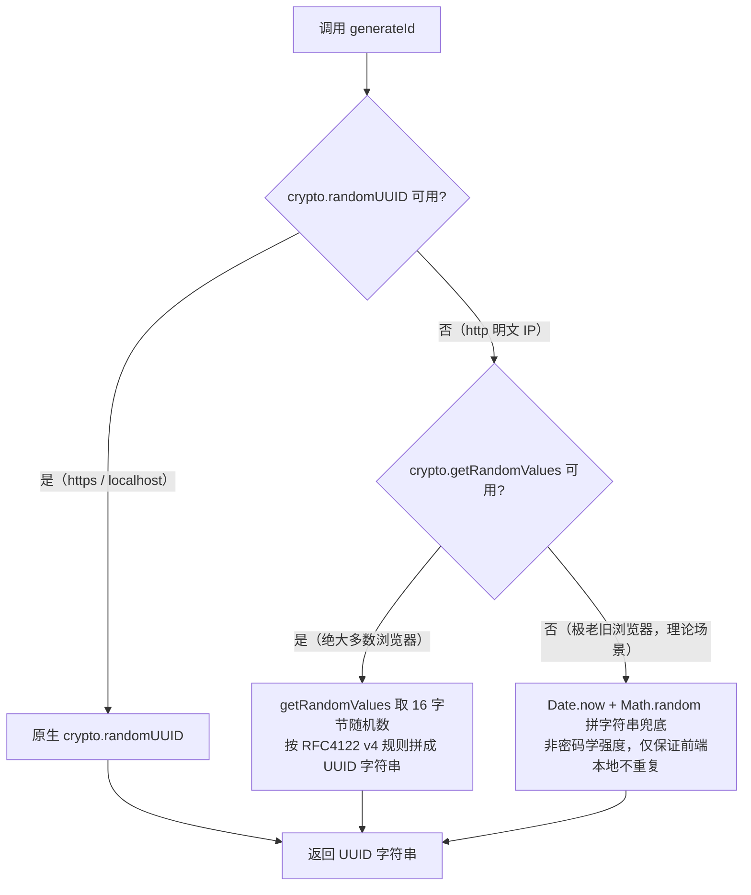

# 1. 前端 crypto.randomUUID 兼容修复

> 上游：部署验证阶段（[i1.1_3_deploy.md](./i1.1_3_deploy.md) 步骤 9.5）发现，裸 IP + HTTP 访问下点历史会话 / 发消息没反应。

## 2. 需求

### 2.1. 问题现象

浏览器打开 `http://<VPS公网IP>/`（裸 IP + 明文 HTTP，未配 HTTPS）：

- 点左侧历史会话列表任意一条 → 没反应。
- 输入框打字后点发送 → 没反应。
- 打开开发者工具 Console，两个操作都能看到同一条报错：

```
Uncaught TypeError: crypto.randomUUID is not a function
```

本机开发环境（`http://localhost:5173`）不会复现，只在部署到公网 IP 后才出现。

### 2.2. 根因

`crypto.randomUUID()` 是浏览器 Web Crypto API 的一部分，规范规定**只在"安全上下文"里可用**（协议是 `https://`，或主机名是 `localhost`）。本机开发用 `localhost`，浏览器天生豁免判成安全；部署后访问的是 `http://<公网IP>`，既不是 `https`、也不是 `localhost`，浏览器直接把这个 API 禁用，一调用就抛 `TypeError`，把点击事件的处理函数整个中断。

跟后端、nginx、MCP 都无关，是纯前端代码在浏览器里被挡。

### 2.3. 影响范围（代码定位）

前端代码里 3 个文件、共 6 处调用 `crypto.randomUUID()`，都是给消息 / 附件生成一个仅供前端本地使用的 ID（不是安全用途，不参与鉴权/签名）：

| 文件 | 调用处 | 用途 |
| --- | --- | --- |
| `frontend/src/hooks/useChat.ts` | 3 处 | 新建 assistant 消息 ID、思考分段 ID、新建 / 编辑 user 消息 ID |
| `frontend/src/types/session.ts` | 2 处 | 历史消息回填时给 user / assistant 消息重建 ID |
| `frontend/src/components/chat/Composer.tsx` | 1 处 | 上传附件生成附件 ID |

### 2.4. 目标

裸 IP + HTTP（无 HTTPS）环境下，发消息、编辑消息、切换历史会话、上传附件都能正常工作，不再因为这个 API 被禁用而报错中断；已有的 HTTPS / localhost 环境行为不变。

### 2.5. 验收标准

1. 在浏览器里手动模拟"不安全上下文"（或直接在部署环境验证）：点历史会话、发送消息、编辑消息、上传附件，Console 不再出现 `crypto.randomUUID is not a function`，功能正常。
2. 生成的 ID 仍能满足现有用途——前端 `Map`/`key` 去重、`React key`、消息编辑定位等，不要求全局唯一（同用户单会话内不重复即可），但沿用 UUID 形态不做大改动。
3. 本机 `localhost` 开发环境（原本能用 `crypto.randomUUID`）行为不受影响。
4. 现有前端测试（如有覆盖相关逻辑）不回归。

### 2.6. 设计测试

- 本机验证（不用额外起服务，最简单）：`npm run dev` 打开 `http://localhost:5173`，在浏览器 DevTools Console 执行 `crypto.randomUUID = undefined` 覆盖掉这个方法，当场模拟"不安全上下文里 API 被禁用"的效果（注意不要刷新页面，刷新会重新拿到浏览器对安全上下文的真实判断，覆盖就失效了）。覆盖后依次点历史会话、发消息、编辑消息、上传附件，确认 Console 不再报 `crypto.randomUUID is not a function`，功能正常。
- 真实环境终验：改完直接部署到 VPS，浏览器打开 `http://101.37.28.92/`（裸 IP + HTTP，本次问题最初复现的环境），重复上述四个操作，确认无报错、功能正常，作为最终验收依据。

## 3. 设计

### 3.1 方案调研

`crypto` 对象上除了 `randomUUID()`，还有一个 `getRandomValues()` 方法，用途都是"要密码学强度的随机数"，但**安全限制不一样**——只有 `randomUUID()` 被限制成"只能在安全上下文用"，`getRandomValues()` 在 `http://` 明文环境下也一直能用（浏览器规范这么定的，不是兼容性 bug）。参考社区里同类问题的标准做法（如 `TanStack/db` 项目的 [issue #1541](https://github.com/TanStack/db/issues/1541)）：优先用 `randomUUID()`，不可用时改用 `getRandomValues()` 按 RFC 4122 v4 规则手工拼出一个格式完全相同的 UUID 字符串。

这样两条分支生成的都是标准 UUID v4、都是密码学强度随机，行为上跟原来几乎一样，只是换了个"拿随机数"的门路，符合验收标准里"沿用 UUID 形态不做大改动"的要求。



### 3.2 改动点

新增一个工具函数集中生成 ID，替换现有 6 处直接调用，不改调用方的用法（还是 `xxx()` 拿一个字符串）：

| 改动 | 内容 |
| --- | --- |
| 新建 `frontend/src/lib/id.ts` | 导出 `generateId(): string`，按 3.1 三级 fallback 实现 |
| `frontend/src/hooks/useChat.ts` | 3 处 `crypto.randomUUID()` → `generateId()`，顶部加 import |
| `frontend/src/types/session.ts` | 2 处 `crypto.randomUUID()` → `generateId()`，顶部加 import |
| `frontend/src/components/chat/Composer.tsx` | 1 处 `crypto.randomUUID()` → `generateId()`，顶部加 import |

### 3.3 影响面

- 不动后端、不动 API/DB schema，纯前端一个新工具函数 + 6 处调用点替换。
- 不破坏兼容：`https/localhost` 环境下第一分支跟原来行为完全一致（还是原生 `crypto.randomUUID()`）；`http` 明文环境下从"报错崩溃"变成"能生成同格式 UUID"，是修复不是变更。
- 不涉及配置项改动。

### 3.4 可观测性

`generateId()` 走到最后一级兜底（`getRandomValues` 也不可用）时，打印一条 `console.warn`，注明"当前浏览器随机数能力受限，ID 非密码学强度"——这种情况理论上只会出现在极老旧浏览器，一旦真发生，日志能帮定位是浏览器兼容问题而不是新 bug。前两级分支是正常路径，不加日志。

### 3.5 实现步骤

1. 新建 `frontend/src/lib/id.ts`，实现 `generateId()`（三级 fallback + 兜底 warn 日志）。
2. 替换 `useChat.ts`（3 处）、`session.ts`（2 处）、`Composer.tsx`（1 处）里的调用。
3. 按 2.6 本机验证：`npm run dev` + Console 覆盖 `crypto.randomUUID` 模拟不安全上下文，验证四个操作。
4. 部署到 VPS，按 2.6 真实环境终验一次。

代码已按 3.2 改完（`generateId()` 实现 + 6 处调用替换），本机 `npm run build` 类型检查通过，`generateId()` 的三个分支逻辑用 Node 脚本单独验证过（分支 1/2 生成的都是合法 UUID v4，分支 2 跑 5000 次无重复）。步骤 3、4 需要真实浏览器 / 真实 VPS 环境，由你来做，具体步骤见下节。

## 4. 验证步骤

### 4.1 本机点击验证 [Done]

浏览器打开 `http://localhost:5173`，打开 DevTools → Console，粘贴执行：

```js
crypto.randomUUID = undefined
```

（不要刷新页面——刷新会重新拿到浏览器对安全上下文的真实判断，覆盖就失效了）

覆盖后依次做这 4 件事，确认 Console 不再出现 `crypto.randomUUID is not a function`，功能正常：

1. 点左侧历史会话列表任意一条
2. 输入框打字后点发送
3. 编辑一条已发送的消息
4. 上传一个附件（图片或文本文件）

### 4.2 VPS 真实环境终验 [Done]

```bash
ssh <你的VPS账号>@101.37.28.92
cd ~/AgentA
git pull
cd frontend
npm install     # package.json 没变可跳过，保险起见跑一次
npm run build   # 产物直接落在 frontend/dist，nginx 直接托管，不用重启 nginx / 后端
```

浏览器打开 `http://101.37.28.92/`（**硬刷新** `Ctrl+Shift+R`，避免 `index.html` 被浏览器缓存住旧版本），重复 4.1 里的 4 个操作——这次不用手动覆盖 `crypto.randomUUID`，裸 IP + HTTP 本身就是不安全上下文，能直接复现最初的报错场景。确认 Console 无报错、4 个操作都正常，即为最终验收通过。

✅ 已验证（2026-07-09）：`git pull` + `npm run build` 后硬刷新，4 个操作均正常，Console 无 `crypto.randomUUID is not a function`。

## 5. 验收报告

| 验收项 | 结果 | 说明 |
| --- | --- | --- |
| 2.5.1 不安全上下文下 4 个操作正常、无报错 | ✅ | 4.1 本机覆盖 `crypto.randomUUID` + 4.2 VPS `http://101.37.28.92/` 均通过 |
| 2.5.2 ID 仍满足前端本地用途 | ✅ | `generateId()` 走 `getRandomValues` 分支时仍输出 RFC 4122 v4 格式 UUID |
| 2.5.3 localhost 开发环境不受影响 | ✅ | 4.1 未覆盖时行为与改前一致；覆盖后走 fallback 分支也正常 |
| 2.5.4 现有前端测试不回归 | ✅ | `npm run build` 类型检查通过 |

**结论**：验收通过。裸 IP + HTTP 部署场景下聊天交互已恢复，部署文档步骤 9.5 可继续按正常流程验证问答链路。
